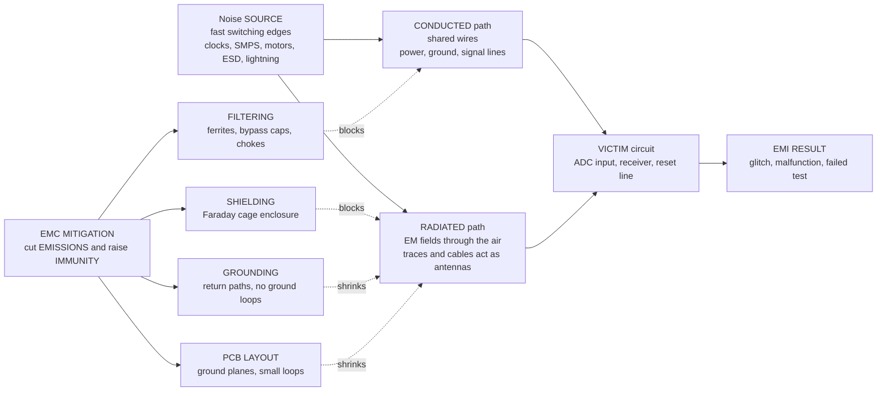

# 📡 Electromagnetic Compatibility

> [!abstract] TL;DR
> **Electromagnetic Compatibility (EMC)** is the discipline of making electronic devices coexist without disturbing one another. It has **two sides**: a device must not **emit** interference that disrupts its neighbors (**emissions**), and it must **tolerate** the interference in its environment (**immunity / susceptibility**). Every EMI problem is a chain of three links — a **SOURCE** of noise (fast switching: digital clocks, switch-mode power supplies, motors, ESD, lightning), a **COUPLING PATH** (**conducted** through shared wires, or **radiated** through the air, plus near-field **capacitive** and **inductive** crosstalk), and a **VICTIM** circuit. The root cause in modern electronics is **fast edges**: a sharp transition is rich in **high-frequency harmonics** (bandwidth $\propto 1/t_r$) that radiate from traces and cables acting as unintended antennas. You fix EMC by attacking the chain — **shielding** (Faraday cage), **grounding** (return paths, no ground loops), **filtering** (ferrites, bypass caps, common-mode chokes), and **PCB layout** (ground planes, small loop areas). It is not optional: products **must pass** FCC / CE compliance testing before they can ship.

---

## Intuition

**Analogy: every electronic device is both a noisy neighbor and a light sleeper.** It leaks electromagnetic noise that can wake up the devices around it, *and* it can be woken by their noise in turn. Ever heard a **buzz in speakers** when a phone is about to ring, or watched a **cheap radio glitch** when a power drill fires up nearby? That is EMI in the wild — one device shouting, another too easily disturbed.

**Electromagnetic compatibility is the discipline of good electronic manners.** It has exactly two rules of etiquette: don't **shout too loudly** (keep your *emissions* below a limit) and don't be **too easily disturbed** (have enough *immunity* to ignore your neighbors). Get both right and a dense, crowded electronic world — a car with a hundred processors, a hospital full of instruments, a phone pressed against a laptop — can coexist without everything interfering with everything else. Get either wrong and you get glitches, safety hazards, and a product that fails certification and cannot ship.

---

## How It Works

### Core Mechanics

1. **Every EMI problem is a SOURCE → COUPLING PATH → VICTIM chain.** To have interference you need all three: something that *generates* noise, a *path* for it to travel, and something *sensitive* enough to be disturbed. Break **any one** link and the problem disappears — that is the whole strategy of EMC.
2. **The source is almost always fast switching.** A digital clock edge, a MOSFET turning off in a switch-mode power supply, a brushed motor's commutator, an electrostatic discharge (ESD), or a lightning strike all produce a **sharp change in current or voltage**. By Fourier's rule, a sharp edge is a **broadband** signal — its energy reaches up to roughly $f_{\text{knee}} \approx 1/(\pi\,t_r)$, where $t_r$ is the rise time. The faster the edge, the higher the harmonics reach, the worse the EMI.
3. **The coupling path is either conducted or radiated.** **Conducted** noise rides along *shared conductors* — the power rail, the ground, a signal wire common to source and victim. **Radiated** noise leaves as an *electromagnetic field* through the air, launched by any trace, cable, or loop that is large compared with the wavelength and thus acts as an **unintended antenna**. In the near field these split into **capacitive** coupling (an electric field between two traces — voltage crosstalk) and **inductive** coupling (a magnetic field linking two current loops — the mechanism behind **ground loops**).
4. **The victim is any circuit sensitive enough to be corrupted.** A high-impedance analog input, an ADC reference, a radio receiver's front end, a reset line, or a long control cable. Immunity means raising the victim's threshold above the coupled noise.
5. **EMC = reduce emissions AND raise immunity, by attacking the chain.** **Shielding** blocks *radiated* paths (a Faraday cage), **filtering** blocks *conducted* paths (ferrites and bypass capacitors divert high-frequency energy to ground), **grounding and layout** shrink loop areas so there is less to radiate and less to pick up, and **differential signaling** makes the victim reject the noise both wires see in common.

### Flow / Architecture



---

## Key Concepts

### Secondary Level

- **Two rules of good manners.** A device must not **emit** noise that bothers others (*emissions*), and must not be **too easily bothered** by others' noise (*immunity*). EMC is passing *both* tests.
- **Source, path, victim.** Interference always has a **maker** (something switching fast), a **route** (through wires or through the air), and a **receiver** (something sensitive). Cut any one and the buzz stops.
- **Two routes for the noise:** **conducted** — the noise travels along a **shared wire** (power or ground); **radiated** — the noise flies through the **air** as an invisible wave, exactly like a tiny radio transmitter you never meant to build.
- **Why fast is bad.** A very sudden on/off switch makes a "spiky" signal that contains **lots of high frequencies**, and high frequencies escape from wires easily. Slower, gentler switching is quieter.
- **The three fixes you can see in any product:** a **metal shield / can** (blocks the airborne route), **ferrite beads and little capacitors** near chips (soak up the conducted noise), and a **solid ground plane** on the circuit board (keeps the noise loops tiny).

### Undergraduate Level

- **The interference model, quantified.** Coupled noise voltage at the victim is (source strength) × (coupling factor) − (mitigation). Emissions compliance means the *radiated/conducted field* stays under a regulatory mask; immunity means the *victim threshold* stays above the injected disturbance.
- **Why edges radiate — the frequency-domain view.** A trapezoidal pulse train has a harmonic **envelope** with two breakpoints: it is flat, then rolls off at $-20\text{ dB/decade}$ above $f_1 = 1/(\pi\tau)$ (set by the **pulse width** $\tau$), then at $-40\text{ dB/decade}$ above $f_2 = 1/(\pi t_r)$ (set by the **rise time** $t_r$). Halving the rise time pushes $f_2$ up an octave — **doubling the bandwidth of your emissions**. Speed and EMC are in direct tension (see [[Fourier_Transform]], [[Frequency_Spectrum]]).
- **Four coupling mechanisms.**
  - **Conducted** — shared impedance in a common power/ground/signal conductor; noise current develops a voltage across it that the victim sees.
  - **Radiated** — a loop or a monopole (trace + cable) launches a field; efficiency rises with loop area, current, and frequency.
  - **Capacitive (electric-field) crosstalk** — parasitic capacitance couples a *voltage* edge from an aggressor trace to a victim; worse for high $dV/dt$ and high victim impedance.
  - **Inductive (magnetic-field) crosstalk / ground loops** — mutual inductance couples a *current* change ($dI/dt$) into a neighboring loop; the physics of [[Faradays_Law_and_Induction]] — a changing flux through the victim loop induces an EMF.
- **The mitigation toolbox.** **Shielding** (a conductive enclosure reflects and absorbs fields — a Faraday cage), **grounding** (low-impedance return paths; single-point vs multipoint grounds; killing **ground loops**), **filtering** (ferrite beads and **decoupling / bypass capacitors** placed right at the IC power pins, **common-mode chokes** and EMI filters on power inputs), **PCB layout** (solid **ground planes**, keeping each signal's return current directly beneath it to minimize loop area, controlled trace spacing), **differential signaling / twisted pair** (the victim subtracts the two wires, cancelling the **common-mode** noise both picked up), and **spread-spectrum clocking** (dither the clock to smear a tall harmonic spike into a broad low hump so the *peak* meets the limit).
- **Signal integrity and EMC are the same coin.** A clean, controlled return path that keeps reflections and ringing down *also* keeps loop area and radiation down. Good high-speed design *is* good EMC design.

### Graduate Level

- **The trapezoid spectrum, exactly.** For a periodic trapezoid of amplitude $A$, period $T$, duty $d=\tau/T$, and rise time $t_r$, the harmonic amplitudes are $|c_n| = 2Ad\,\bigl|\operatorname{sinc}(nd)\bigr|\,\bigl|\operatorname{sinc}(n t_r/T)\bigr|$ with $\operatorname{sinc}(x)=\sin(\pi x)/(\pi x)$. The two $\operatorname{sinc}$ factors produce the $-20$ and $-40\text{ dB/decade}$ envelope breakpoints — the design equation behind every emissions budget.
- **Near vs far field.** The boundary is $r \approx \lambda/2\pi$. **Inside** (near field), a source is either high-impedance (electric, capacitive) or low-impedance (magnetic, inductive), and the two are treated separately; **outside** (far field), only the propagating plane wave with $Z_0 = 377\,\Omega$ remains — the regime of [[Electromagnetic_Waves_and_Radiation]] and [[Maxwells_Equations]]. Which field dominates dictates whether you fight it with *shielding by reflection* (good for E-fields), *absorption* (good at HF), or *layout / distance* (best for near-field magnetic coupling).
- **Shielding effectiveness.** $SE_{\text{dB}} = R + A + B$: **reflection loss** $R$ (large for E-fields, falls with frequency), **absorption loss** $A = 8.686\,t/\delta$ where the **skin depth** $\delta = 1/\sqrt{\pi f \mu \sigma}$ shrinks as $\sqrt{f}$ (so absorption *rises* with frequency — HF EMI is easier to shield), and a re-reflection correction $B$. The practical enemy is not the metal but the **apertures**: a slot radiates strongly once its length approaches $\lambda/2$, so seams, gaps, and cable penetrations — not wall thickness — set real-world shield performance.
- **Ground is a return-current network, not a node.** At DC "ground" is equipotential; at RF the inductance of every return path makes ground a distributed impedance. High-frequency return current follows the **path of least inductance** (directly under the signal trace on a plane), not least resistance — the single most important layout insight. **Single-point** grounds suit low frequency; **multipoint** (plane) grounds suit high frequency; hybrid schemes bridge them.
- **Common-mode vs differential-mode.** Radiated emissions are usually **common-mode**: a small common-mode current on a long cable radiates far more than the intended differential current. Common-mode chokes and careful cable/connector grounding target exactly this; differential signaling and balance keep the conversion of DM→CM low.
- **ESD and transient immunity.** An electrostatic discharge is a sub-nanosecond, multi-amp current pulse — extremely broadband. Protection uses TVS diodes, spark gaps, and ground/layout that steer the surge away from sensitive nodes. IEC 61000-4-2 (ESD), -4-4 (fast transients / burst), and -4-5 (surge) are the standard immunity tests.
- **Regulatory reality.** **FCC Part 15** (US) and the **CISPR / EN** standards behind the **CE** mark (Europe) impose both **emissions** limits (conducted 150 kHz–30 MHz, radiated 30 MHz–several GHz) and **immunity** requirements. Testing happens in **anechoic / semi-anechoic chambers** with calibrated antennas and LISNs. EMC is a **gating** requirement — a product that fails does not ship — and because problems surface late, EMC is a notorious cause of **last-minute redesigns**.

---

## Python Demo

```python
# Electromagnetic Compatibility: why fast edges emit, and how filters/shields tame them.
#
#   (a) EMISSION SPECTRUM  --  WHY fast digital/switching edges radiate.
#       Take a trapezoidal clock (a real switching waveform) and compute its
#       harmonic spectrum. The envelope has two breakpoints:
#           f1 = 1/(pi*tau)   -> roll-off begins at -20 dB/decade (set by pulse WIDTH)
#           f2 = 1/(pi*t_r)   -> steepens to -40 dB/decade (set by RISE TIME)
#       Overlay a FAST edge vs a SLOW edge: the fast edge pushes f2 higher, so its
#       harmonics reach much further up in frequency -> more high-frequency EMI.
#
#   (b) MITIGATION  --  filtering and shielding attenuate the high harmonics.
#       * an LC / ferrite low-pass filter multiplies the emission spectrum by |H(f)|,
#         crushing the HF harmonics while passing the fundamental (before vs after).
#       * a solid metal shield: absorption loss A = 8.686 * t / skin_depth rises as
#         sqrt(f) -- so shielding gets BETTER at high frequency (the good news).
# numpy + matplotlib only.
import numpy as np
import matplotlib.pyplot as plt

# --------------------------------------------------------------------------
# (a) TRAPEZOIDAL CLOCK EMISSION SPECTRUM (analytic Fourier-series envelope)
#     |c_n| = 2*A*d * |sinc(n*d)| * |sinc(n*t_r/T)|,   sinc(x)=sin(pi x)/(pi x)
# --------------------------------------------------------------------------
f0   = 10e6                 # 10 MHz clock  -> period T = 100 ns
T    = 1.0 / f0
A    = 3.3                  # logic swing (volts)
duty = 0.5                  # 50% duty cycle -> pulse width tau = duty*T
tau  = duty * T

n    = np.arange(1, 4001)   # harmonic indices 1..4000 (up to ~40 GHz)
fh   = n * f0               # harmonic frequencies

def trap_harmonics(t_r):
    """Amplitude of each harmonic of a trapezoid with rise/fall time t_r."""
    return 2 * A * duty * np.abs(np.sinc(n * duty)) * np.abs(np.sinc(n * t_r / T))

tr_fast = 0.5e-9            # 0.5 ns edge  (fast / aggressive)
tr_slow = 3.0e-9            # 3.0 ns edge  (slowed on purpose)

c_fast = trap_harmonics(tr_fast)
c_slow = trap_harmonics(tr_slow)

# Convert to dB-microvolts (a real EMC unit): dBuV = 20*log10(V / 1e-6)
floor = 1e-9
to_dBuV = lambda c: 20 * np.log10(np.maximum(c, floor) / 1e-6)

# Envelope breakpoints
f1      = 1 / (np.pi * tau)
f2_fast = 1 / (np.pi * tr_fast)
f2_slow = 1 / (np.pi * tr_slow)

# --------------------------------------------------------------------------
# (b1) FILTER: 2nd-order LC / ferrite-bead low-pass on the noisy line
#      |H(f)| = 1 / sqrt(1 + (f/fc)^(2*order))   (Butterworth-type)
# --------------------------------------------------------------------------
fc    = 50e6               # filter corner: pass 10 MHz fundamental, cut the HF tail
order = 2
Hmag  = 1.0 / np.sqrt(1 + (fh / fc) ** (2 * order))
c_filtered = c_fast * Hmag

# --------------------------------------------------------------------------
# (b2) SHIELD: absorption loss of a solid metal wall vs frequency
#      skin_depth = 1/sqrt(pi f mu sigma);  A_dB = 8.686 * t / skin_depth
# --------------------------------------------------------------------------
mu0   = 4 * np.pi * 1e-7
fsh   = np.logspace(4, 10, 400)          # 10 kHz .. 10 GHz
t_sh  = 0.1e-3                            # 0.1 mm wall
def absorption_dB(sigma, mu_r):
    delta = 1.0 / np.sqrt(np.pi * fsh * mu_r * mu0 * sigma)
    return 8.686 * t_sh / delta
A_copper = absorption_dB(5.8e7, 1.0)     # copper: high conductivity
A_steel  = absorption_dB(1.0e7, 300.0)   # steel: lower sigma but high mu_r

# ==========================================================================
#  PLOTS
# ==========================================================================
fig, ax = plt.subplots(2, 2, figsize=(15, 10))

# ---- (a1) time-domain trapezoid: fast vs slow edge ----
def trap_wave(t, t_r):
    # one clean period built from clamped ramps: rise, high, fall, low
    x = np.zeros_like(t)
    tt = np.mod(t, T)
    x += np.clip(tt / t_r, 0, 1)                        # rising edge
    x -= np.clip((tt - tau) / t_r, 0, 1)                # falling edge
    return A * np.clip(x, 0, 1)

tt = np.linspace(0, 2.2 * T, 4000)
ax[0, 0].plot(tt * 1e9, trap_wave(tt, tr_fast), color='tab:red',  lw=2,
              label=f"fast edge  t_r = {tr_fast*1e9:.1f} ns")
ax[0, 0].plot(tt * 1e9, trap_wave(tt, tr_slow), color='tab:blue', lw=2,
              label=f"slow edge  t_r = {tr_slow*1e9:.1f} ns")
ax[0, 0].set_title("(a) Trapezoidal clock: a real switching waveform")
ax[0, 0].set_xlabel("time  [ns]"); ax[0, 0].set_ylabel("voltage  [V]")
ax[0, 0].grid(alpha=0.3); ax[0, 0].legend(loc="upper right", fontsize=9)

# ---- (a2) emission spectrum: fast vs slow edge + envelope breakpoints ----
axs = ax[0, 1]
axs.semilogx(fh, to_dBuV(c_fast), color='tab:red',  lw=1.2, alpha=0.9,
             label=f"fast edge ({tr_fast*1e9:.1f} ns): HF energy reaches far")
axs.semilogx(fh, to_dBuV(c_slow), color='tab:blue', lw=1.2, alpha=0.9,
             label=f"slow edge ({tr_slow*1e9:.1f} ns): HF tail collapses")
for fb, txt, col in [(f1, "f1 = 1/(pi*tau)\n-20 dB/dec", 'k'),
                     (f2_slow, "f2 slow", 'tab:blue'),
                     (f2_fast, "f2 fast\n-40 dB/dec", 'tab:red')]:
    axs.axvline(fb, color=col, ls='--', lw=1)
axs.text(f1 * 1.1, 95, "f1: width sets\n-20 dB/dec", fontsize=8)
axs.text(f2_fast * 0.35, 20, "f2: rise time sets\n-40 dB/dec", fontsize=8, color='tab:red')
axs.set_title("(a) Emission spectrum: faster edge = broader EMI")
axs.set_xlabel("frequency  [Hz, log]"); axs.set_ylabel("harmonic level  [dB-uV]")
axs.set_xlim(f0, fh[-1]); axs.set_ylim(-10, 130)
axs.grid(True, which='both', alpha=0.3); axs.legend(loc="lower left", fontsize=8)

# ---- (b1) filtering: emission spectrum before vs after LC/ferrite low-pass ----
axf = ax[1, 0]
axf.semilogx(fh, to_dBuV(c_fast),     color='0.6',      lw=1.2,
             label="before filter (fast edge)")
axf.semilogx(fh, to_dBuV(c_filtered), color='tab:green', lw=1.4,
             label="after LC/ferrite low-pass")
axf.axvline(fc, color='k', ls='--', lw=1)
axf.text(fc * 1.1, 105, f"filter corner\nfc = {fc/1e6:.0f} MHz", fontsize=8)
axf.set_title("(b) Filtering crushes the high-frequency harmonics")
axf.set_xlabel("frequency  [Hz, log]"); axf.set_ylabel("harmonic level  [dB-uV]")
axf.set_xlim(f0, fh[-1]); axf.set_ylim(-10, 130)
axf.grid(True, which='both', alpha=0.3); axf.legend(loc="lower left", fontsize=9)

# ---- (b2) shielding: absorption loss rises with frequency ----
axh = ax[1, 1]
axh.loglog(fsh, A_copper, color='tab:orange', lw=2, label="copper 0.1 mm")
axh.loglog(fsh, A_steel,  color='tab:purple', lw=2, label="steel 0.1 mm (high mu_r)")
axh.axhline(40, color='gray', ls=':', lw=1)
axh.text(2e4, 46, "40 dB = 100x field reduction", fontsize=8, color='gray')
axh.set_title("(b) Shield absorption loss grows as sqrt(f)")
axh.set_xlabel("frequency  [Hz, log]"); axh.set_ylabel("absorption loss  A  [dB, log]")
axh.grid(True, which='both', alpha=0.3); axh.legend(loc="upper left", fontsize=9)

plt.tight_layout()
plt.savefig("electromagnetic_compatibility.png", dpi=120)
print("Saved electromagnetic_compatibility.png")

# ---- Numerical summary ----
knee_fast = f2_fast / 1e9
knee_slow = f2_slow / 1e9
print(f"Edge-rate 'knee' frequency: fast edge = {knee_fast:.2f} GHz, "
      f"slow edge = {knee_slow:.2f} GHz  (6x slower edge -> 6x lower knee)")
# level of the 51st harmonic (~510 MHz), a typical radiated-emissions band
i = 50
print(f"~{fh[i]/1e6:.0f} MHz harmonic: fast={to_dBuV(c_fast)[i]:.0f} dBuV, "
      f"slow={to_dBuV(c_slow)[i]:.0f} dBuV, "
      f"filtered={to_dBuV(c_filtered)[i]:.0f} dBuV")
print(f"Copper shield absorption at 100 MHz: {absorption_dB(5.8e7,1.0)[0]:.0f} "
      f".. rising to high dB by 10 GHz (HF EMI is EASIER to shield)")
```

The top row is the **cause**: the same trapezoidal clock drawn with a fast (0.5 ns) and a slow (3 ns) edge, and their spectra. The fast edge's second breakpoint $f_2 = 1/(\pi t_r)$ sits an octave-and-a-half higher, so its harmonics stay tall far into the GHz range — *that* is why fast digital design is an EMC headache. The bottom row is the **cure**: an LC/ferrite low-pass (left) passes the 10 MHz fundamental but slams the high harmonics down by tens of dB, and a thin metal shield (right) gets *more* effective as frequency climbs, because absorption loss scales with $\sqrt{f}$ — the reassuring flip side of the emissions story.

---

## Real-World Applications

- **Automotive electronics.** A modern car packs 100+ ECUs, ignition coils, high-current motors, and (in EVs) hundreds-of-kilowatt inverters switching hard — all inches from AM/FM radio, keyless entry, and safety sensors. CISPR 25 and OEM specs make EMC one of the hardest gates in automotive design; a failed radiated-emissions test can delay a launch.
- **Medical devices.** Pacemakers, infusion pumps, and MRI-adjacent equipment must be *immune* to phone, Wi-Fi, and cautery interference (a malfunction is a patient-safety event) while emitting little themselves — IEC 60601-1-2 governs both sides.
- **Consumer product certification.** Every phone, laptop, USB charger, and IoT gadget must clear **FCC Part 15** (US) or **CE / EN** (EU) emissions *and* immunity before sale. The FCC ID on the back of your devices is EMC compliance made visible.
- **Switch-mode power supplies.** The very thing that makes SMPS efficient — hard, fast switching — makes them prime EMI sources. Every adapter carries an input **EMI filter** (common-mode choke + X/Y capacitors) and often a snubber to slow edges, purely to pass conducted-emissions limits.
- **High-speed digital and data centers.** DDR memory, PCIe, and 100 GbE links have edges in the tens of picoseconds; their EMC survival depends entirely on ground planes, controlled-impedance return paths, and spread-spectrum clocking — where **signal integrity and EMC merge**.
- **Aerospace and defense.** DO-160 (avionics) and MIL-STD-461 impose stringent emissions/immunity limits, plus **lightning** and **HIRF** (high-intensity radiated field) survivability — an aircraft must keep flying through a nearby radar or a strike.
- **ESD-hardened design.** Every connector-facing pin — USB, HDMI, buttons — carries TVS protection so a person's finger-zap (a broadband ESD pulse) does not reset or destroy the chip behind it.

---

## Common Pitfalls

- **Forgetting EMC has two halves.** Passing **emissions** is not enough — the device must also survive **immunity/susceptibility** tests (ESD, fast transients, surge, radiated fields). Teams that budget only for emissions get blindsided by an immunity failure late in the program.
- **Chasing the symptom, not the chain.** Interference is always **source → coupling path → victim**. Bolting a shield on the victim when the real fix is slowing the *source* edge or breaking a *conducted* path wastes weeks. Identify which link is cheapest to break.
- **Confusing conducted with radiated coupling.** A filter on the power line does nothing for a field radiating off a cable, and a shield does nothing for noise conducted straight through a wire penetrating it. Diagnose the **path** first — below ~30 MHz problems are usually conducted, above it usually radiated.
- **Ignoring the return path.** The #1 layout sin: routing a fast signal far from its return current, opening a large loop that both **radiates** and **picks up** noise. High-frequency return current wants the path of *least inductance* — directly under the trace on a solid **ground plane**. Slots and splits in that plane force detours that wreck EMC.
- **Using faster parts "for margin."** A faster logic family or a sharper gate driver has a higher knee frequency and *worse* emissions for no functional benefit. Use the **slowest edge** that meets timing; add series resistors or ferrites to soften unnecessarily fast edges.
- **Bypass capacitors placed too far away.** A decoupling cap works only if the loop from IC pin → cap → ground is tiny; a centimeter of trace adds enough inductance to make it useless at high frequency. Place bypass caps **right at the power pins**.
- **Creating ground loops.** Grounding a system at two points connected by a long path lets magnetic flux induce a circulating current (Faraday's law) that shows up as noise — the classic audio "hum" and instrumentation offset. Use single-point grounds at low frequency, or break the loop with isolation.
- **Treating shields as solid when they have holes.** Shielding effectiveness is set by **apertures**, not wall thickness — a seam or slot approaching $\lambda/2$ radiates freely. Gasket the seams, keep openings small, and ground cable shields at the point of entry.
- **Leaving EMC to the end.** EMC failures surface only when a near-complete product enters the chamber, and fixes then mean respins and slipped launches. Bake EMC into architecture, layout, and part selection from day one.
- **Misreading near vs far field.** Near a source you fight *capacitive* (E-field) and *inductive* (H-field) coupling with different tools; only in the far field is it a $377\,\Omega$ plane wave. Applying a far-field shielding intuition to a near-field magnetic problem (where distance and loop control win) fails.

---

## Related Concepts

- [[Electromagnetic_Waves_and_Radiation]] — radiated coupling *is* an EM wave: an unintended antenna (trace or cable) launches the field this note tries to suppress; far-field EMC is wave propagation.
- [[Maxwells_Equations]] — the field theory beneath it all; Ampère's and Faraday's laws say changing currents make fields and changing fields make currents — the physics of every coupling path.
- [[Faradays_Law_and_Induction]] — the mechanism of **inductive coupling** and **ground loops**: a changing magnetic flux through a victim loop induces a noise EMF.
- [[Frequency_Spectrum]] — emissions are judged as a spectrum against a regulatory mask; EMC thinking is inherently frequency-domain.
- [[Fourier_Transform]] — explains *why fast edges radiate*: a sharp transition transforms into broadband high-frequency content ($\propto 1/t_r$).
- [[Analog_Filters_and_Frequency_Response]] — EMI filters, ferrite beads, and bypass capacitors are **low-pass filters**; the same $|H(j\omega)|$ that cleans a signal attenuates conducted noise.
- [[RC_RL_and_RLC_Transients]] — edge shaping and snubbers are RC/RL/RLC time-constants; a ferrite-plus-capacitor is a small LC low-pass in the time domain.
- [[AC_Circuit_Analysis_and_Phasors]] — the frequency-dependent impedance of decoupling caps, ferrites, and parasitics — the phasor machinery that makes a "ground wire" an inductor at RF.
- [[Magnetic_Materials_and_Magnetic_Domains]] — ferrite beads and common-mode chokes exploit lossy magnetic materials; magnetic shielding uses high-$\mu$ alloys.
- [[Wave_Motion_and_Properties]] — wavelength vs physical dimension sets the near/far-field boundary and when a slot or cable becomes an efficient antenna.
- [[Electrical_Engineering_Overview]] — situates EMC as the practical flip side of RF and high-speed digital design across the EE landscape.

*Sibling notes in this Electromagnetics and RF section (prose references, to be built): Maxwells_Equations_for_Engineers frames the field theory for practicing engineers; Transmission_Lines explains controlled impedance and reflections that share EMC's return-path physics; RF_and_Microwave_Engineering is the intentional-emitter counterpart to EMC's unintentional one; Power_Electronics_and_Converters covers the switch-mode supplies that are EMC's biggest noise sources; and Digital_System_Design_and_HDL produces the fast edges whose spectra drive the whole problem.*

---

## Review Questions

1. **(Secondary)** Using the "noisy neighbor and light sleeper" analogy, explain the two things a well-behaved electronic device must do to be electromagnetically compatible. Then, given a drill that makes a nearby radio crackle, identify the **source**, a plausible **coupling path**, and the **victim**, and name one fix for each link in the chain.
2. **(Undergraduate)** Your board passes emissions with a 3 ns clock edge but a colleague swaps in a driver with a 0.5 ns edge "for timing margin," and now it fails radiated emissions at 700 MHz. (a) Using the trapezoid envelope breakpoints $f_1 = 1/(\pi\tau)$ and $f_2 = 1/(\pi t_r)$, explain *why* the faster edge failed. (b) List three mitigations — one at the source, one on the coupling path, one at layout — and say which coupling mechanism each addresses.
3. **(Graduate)** You must shield a sensitive receiver against both a near-field 100 kHz magnetic source and a far-field 2 GHz plane wave, using a thin conductive enclosure. (a) Explain, via skin depth and $SE = R + A + B$, why the enclosure works far better at 2 GHz than at 100 kHz, and what *actually* limits its performance in practice. (b) Since a thin copper wall barely helps the 100 kHz magnetic problem, what non-shielding strategies (material choice, geometry, distance) would you use instead, and why?

---

## Sources

- Ott, H. — *Electromagnetic Compatibility Engineering* (Wiley) — the definitive modern EMC reference: emissions, immunity, shielding, grounding, filtering, PCB layout, and the source-coupling-victim model.
- Paul, C. — *Introduction to Electromagnetic Compatibility* (Wiley) — rigorous field-theory foundation: crosstalk, radiated/conducted coupling, and the trapezoidal spectrum.
- Johnson, H. & Graham, M. — *High-Speed Digital Design: A Handbook of Black Magic* (Prentice Hall) — return paths, edge rates, ground planes, and where signal integrity meets EMC.
- Morrison, R. — *Grounding and Shielding: Circuits and Interference* (Wiley) — the physics of grounds, shields, and interference from a field-energy viewpoint.
- Williams, T. — *EMC for Product Designers* (Newnes) — the practical compliance angle: FCC/CE limits, chamber testing, and design-for-EMC workflow.

---

#electrical-engineering #emc #emi #shielding #signal-integrity
