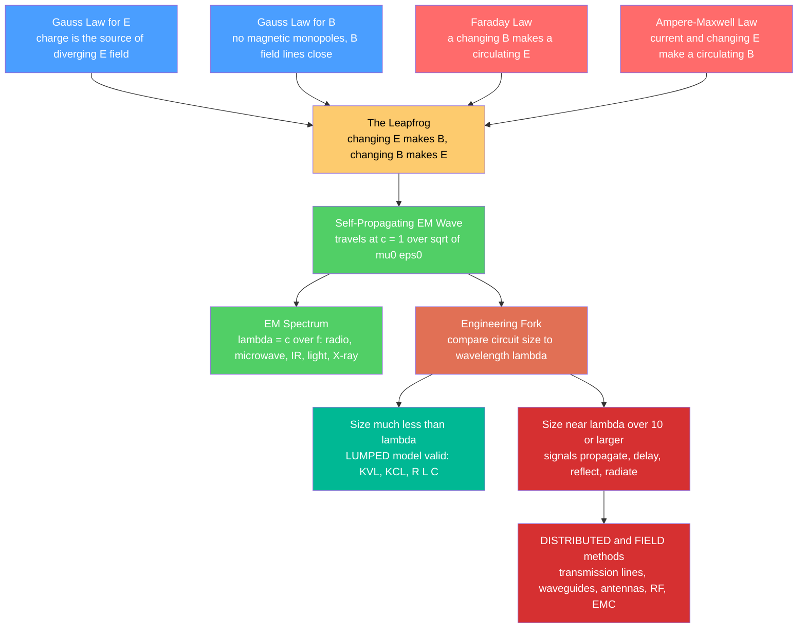

# 📡 Maxwell's Equations for Engineers

> [!abstract] TL;DR
> Four short equations govern all of electricity, magnetism, and light: charge makes an electric field, there are no magnetic monopoles, a **changing magnetic field makes an electric field** (Faraday), and **current plus a changing electric field makes a magnetic field** (Ampere-Maxwell). Together the last two let $\vec{E}$ and $\vec{B}$ regenerate each other and leapfrog through empty space as a self-sustaining wave at $c = 1/\sqrt{\mu_0\epsilon_0}$ — that is radio, Wi-Fi, and light. The **engineering payoff**: the lumped-circuit model (KVL/KCL, instantaneous) is only valid while a circuit is much smaller than a wavelength. Once physical size approaches $\sim\lambda/10$, signals *propagate*, *reflect*, and *radiate* — and you must switch to transmission-line and field analysis. This note is the engineering companion to the physics note [[Maxwells_Equations]], and the opener for the Electromagnetics & RF section.

## Intuition — analogy FIRST

**Four short equations, scribbled on a T-shirt, secretly run your entire wireless world.** Maxwell's equations say a changing electric field makes a magnetic field and vice versa — so the two can *leapfrog* through empty space forever as a self-sustaining wave traveling at the speed of light. That's light, that's radio, that's Wi-Fi, that's your phone signal.

For a circuit engineer, these equations are also **the fine print**: they tell you *when* your simple wire stops being a simple wire and starts acting like an antenna — the moment your signal's wavelength shrinks to the size of your board. At 60 Hz a wavelength is 5000 km, so your whole house is electrically "tiny" and a wire is just a wire. At 5 GHz a wavelength is 6 cm, so a 6 mm trace is already a meaningful fraction of a wavelength — the voltage at one end differs from the other, the trace radiates, and Kirchhoff's tidy loops quietly stop being true. Maxwell's equations mark exactly where circuit theory ends and field theory begins.

The analogy has a punchline: **there is only one physics here.** The transformer humming in your charger, the antenna on your router, and the beam of a laser pointer are all the same four equations, evaluated at different frequencies and different sizes relative to a wavelength.

---

## How It Works

### The four equations, in engineer's words

1. **Gauss's law for $\vec{E}$** — electric field lines diverge out of positive charge and into negative charge. Charge is the *source* of $\vec{E}$.
2. **Gauss's law for $\vec{B}$** — magnetic field lines never start or stop; they always close on themselves. There are **no magnetic monopoles**.
3. **Faraday's law** — a *changing magnetic field* induces a circulating electric field. This is transformers, inductors, generators, and induced EMF.
4. **Ampere-Maxwell law** — *current* **and** a *changing electric field* (Maxwell's displacement-current insight) produce a circulating magnetic field.

Equations 3 and 4 are the engine: a changing $\vec{E}$ makes a $\vec{B}$, and that changing $\vec{B}$ makes an $\vec{E}$, endlessly. In empty space, with no charges or currents to lean on, the two fields sustain **each other** and march forward as an electromagnetic wave at $c = 1/\sqrt{\mu_0\epsilon_0} \approx 3\times10^8$ m/s. Wavelength and frequency are tied by $\lambda = c/f$, and stepping $f$ from Hz to PHz sweeps the entire EM spectrum from power lines to radio to microwaves to light to X-rays.

### The engineering fork

Once you know a wave has a wavelength $\lambda$, everything about *which model to use* follows from comparing $\lambda$ to the physical size $\ell$ of your circuit:

- $\ell \ll \lambda$ (rule of thumb $\ell < \lambda/10$): the signal looks *instantaneous* everywhere in the circuit at once. **Lumped model** (KVL/KCL, R/L/C) is valid.
- $\ell \gtrsim \lambda/10$: different points see the signal at *different phases*. The wire has delay, reflections, standing waves, and it radiates. **Distributed / field model** (transmission lines, waveguides, antennas) is required.



---

## Key Concepts

### Secondary Level

- **What the four equations *say* (no calculus):** charge makes an electric field; magnetic field lines always close (no north pole without a south); a changing magnetic field makes an electric field; electric current and a changing electric field make a magnetic field.
- **The big idea:** because a changing $\vec{E}$ makes $\vec{B}$ and a changing $\vec{B}$ makes $\vec{E}$, the two fields can *keep each other alive* and travel on their own — an electromagnetic wave — at the speed of light.
- **One family, many faces:** radio, microwaves, infrared, visible light, X-rays are all the same electromagnetic wave at different frequencies — the **EM spectrum**.
- **$\lambda = c/f$:** higher frequency means shorter wavelength. Radio waves are metres to kilometres long; light waves are under a millionth of a metre.
- **Maxwell's unification:** electricity, magnetism, and light turned out to be *one* thing. That is one of the greatest ideas in physics — and the reason your phone can be wireless.

### Undergraduate Level

- **Differential form (free space):** $\nabla\!\cdot\!\vec{E}=\rho/\epsilon_0$, $\;\nabla\!\cdot\!\vec{B}=0$, $\;\nabla\!\times\!\vec{E}=-\partial\vec{B}/\partial t$, $\;\nabla\!\times\!\vec{B}=\mu_0\vec{J}+\mu_0\epsilon_0\,\partial\vec{E}/\partial t$. The last term is the **displacement current**.
- **Wave equation and speed:** combining Faraday and Ampere-Maxwell in vacuum gives $\nabla^2\vec{E}=\mu_0\epsilon_0\,\partial^2\vec{E}/\partial t^2$, a wave at $c=1/\sqrt{\mu_0\epsilon_0}$.
- **Wave impedance:** for a plane wave, $E/H = \eta = \sqrt{\mu/\epsilon}$. In free space $\eta_0 \approx 377\,\Omega$ — the "resistance of empty space" that antenna and shielding design revolve around.
- **Lumped vs distributed criterion:** lumped analysis assumes signals act everywhere at once; valid while $\ell \lesssim \lambda/10$. Compute $\lambda = c/f$ (or $v_p = c/\sqrt{\epsilon_r}$ in a dielectric) and compare to trace/component length.
- **Polarization:** the direction the $\vec{E}$ field oscillates (linear, circular, elliptical). It determines antenna orientation and why a tilted receive antenna loses signal.
- **Near field vs far field:** close to a source (within roughly $\lambda/2\pi$) fields are reactive and fall off fast; beyond that is the radiating far field where power leaves as a wave. Antenna gain is a far-field concept.
- **Skin effect:** at high frequency, current crowds into a thin surface layer of depth $\delta=\sqrt{2/(\omega\mu\sigma)}$, raising effective resistance. Why RF conductors are plated and why you cannot just "use thicker wire" at GHz.
- **Boundary conditions:** tangential $\vec{E}$ and tangential $\vec{H}$ are continuous across an interface; normal $\vec{B}$ is continuous; a perfect conductor forces tangential $\vec{E}=0$ at its surface. These stitch fields across materials and drive reflection/refraction.

### Graduate Level

- **Transmission-line theory as 1-D Maxwell:** the telegrapher's equations follow from Maxwell for a two-conductor guiding structure, giving characteristic impedance $Z_0=\sqrt{L'/C'}$, propagation constant $\gamma=\alpha+j\beta$, and reflection coefficient $\Gamma=(Z_L-Z_0)/(Z_L+Z_0)$ — the working language of RF and signal integrity.
- **Guided waves and modes:** waveguides support TE/TM modes each with a **cutoff frequency**; below cutoff the mode is evanescent. Dispersion (frequency-dependent $v_p$) spreads pulses.
- **Poynting vector and radiation:** $\vec{S}=\vec{E}\times\vec{H}$ carries power (W/m$^2$); antenna radiation, gain, and effective aperture are far-field integrals of $\vec{S}$.
- **Full-wave numerical methods:** because closed-form Maxwell solutions are rare, engineers solve them numerically — **FDTD** (time domain), **MoM** (integral equation, great for antennas), and **FEM** (arbitrary geometry) power every commercial EM simulator.
- **Signal integrity and EMC:** a fast digital edge of rise time $t_r$ has significant spectral content up to $f_{knee}\approx0.35/t_r$; a 100 ps edge reaches multi-GHz. When the interconnect delay approaches $t_r$, the trace is a transmission line — reflections cause ringing, and the high-frequency content **radiates** (electromagnetic interference). Return-current paths and ground-plane discontinuities become first-class design concerns.

---

## Python Demo

```python
# Maxwell for engineers, two pictures:
#   (a) a propagating PLANE EM WAVE  - E perpendicular to B, both perpendicular
#       to the direction of travel, moving at speed c, wavelength lambda = c/f
#   (b) the WAVELENGTH-vs-FREQUENCY map that sets the LUMPED-vs-DISTRIBUTED
#       boundary: lumped circuit analysis fails once size ~ lambda/10
import numpy as np
import matplotlib.pyplot as plt

c = 2.998e8  # speed of light in vacuum [m/s] = 1/sqrt(mu0*eps0)

fig = plt.figure(figsize=(14, 6))

# ---------------------------------------------------------------
# (a) LINEARLY POLARISED PLANE EM WAVE traveling in +z at speed c.
#     E oscillates along x, B along y, in phase; both perpendicular to travel.
# ---------------------------------------------------------------
ax1 = fig.add_subplot(1, 2, 1, projection='3d')

f = 1.0e9                       # 1 GHz
lam = c / f                     # wavelength = c/f  (~0.30 m at 1 GHz)
k = 2 * np.pi / lam             # wave number
z = np.linspace(0, 3 * lam, 400)

E = np.cos(k * z)               # E field along x (normalised amplitude)
B = np.cos(k * z)               # B field along y (in phase; scaled by 1/c physically)
zeros = np.zeros_like(z)

ax1.plot(z, E, zeros, color='tab:red', lw=2, label='E field (along x)')
ax1.plot(z, zeros, B, color='tab:blue', lw=2, label='B field (along y)')
for i in range(0, len(z), 18):  # stems show the perpendicular oscillation
    ax1.plot([z[i], z[i]], [0, E[i]], [0, 0], color='tab:red', alpha=0.35)
    ax1.plot([z[i], z[i]], [0, 0], [0, B[i]], color='tab:blue', alpha=0.35)

ax1.set_title(f"Plane EM wave: f = 1 GHz, lambda = c/f = {lam*100:.1f} cm\n"
              "E perpendicular to B, both perpendicular to travel (+z at speed c)")
ax1.set_xlabel("z  [m]  (direction of travel)")
ax1.set_ylabel("E (x)")
ax1.set_zlabel("B (y)")
ax1.legend(loc='upper right')

# ---------------------------------------------------------------
# (b) WAVELENGTH vs FREQUENCY  ->  the lumped-vs-distributed boundary.
#     lambda = c/f. Lumped (KVL/KCL) holds while size << lambda;
#     rule of thumb: it breaks once physical size ~ lambda/10.
# ---------------------------------------------------------------
ax2 = fig.add_subplot(1, 2, 2)

freq = np.logspace(1, 15, 600)      # 10 Hz ... 1e15 Hz
wavelength = c / freq               # metres
ax2.loglog(freq, wavelength, 'k-', lw=2, label='lambda = c / f')
ax2.loglog(freq, wavelength / 10, 'r--', lw=1.8,
           label='lambda/10  (lumped model fails when size reaches this)')

# The canonical example: 1 GHz -> lambda = 30 cm -> a 3 cm trace already matters
ax2.plot(1e9, c / 1e9, 'bo', ms=8)
ax2.annotate("1 GHz: lambda = 30 cm,\nlambda/10 = 3 cm  ->  a 3 cm trace matters!",
             xy=(1e9, c / 1e9), xytext=(2e9, 8.0),
             arrowprops=dict(arrowstyle='->'))

# annotate the classic regimes
regimes = [
    (2e1, 2e4, "Audio"),
    (3e5, 3e9, "Radio / RF"),
    (3e9, 3e11, "Microwave"),
    (4.3e14, 7.5e14, "Visible light"),
]
for f0, f1, name in regimes:
    ax2.axvspan(f0, f1, alpha=0.12)
    ax2.text(np.sqrt(f0 * f1), 5e-5, name, ha='center', fontsize=9, rotation=90)

ax2.set_title("Wavelength vs Frequency: the lumped -> distributed boundary")
ax2.set_xlabel("Frequency f  [Hz]")
ax2.set_ylabel("Wavelength lambda  [m]")
ax2.grid(True, which='both', alpha=0.3)
ax2.legend(loc='lower left', fontsize=8)

plt.tight_layout()
plt.savefig("maxwell_for_engineers.png", dpi=120)
plt.show()

# ---- Numerical sanity check: wavelength and the lambda/10 "size that matters" ----
print("  frequency        wavelength        lambda/10 (size where lumped breaks)")
for fq in [60, 1e3, 1e6, 1e9, 1e10, 5e14]:
    lam_i = c / fq
    print(f"  {fq:8.1e} Hz   {lam_i:12.4e} m   {lam_i/10:12.4e} m")
# 60 Hz -> lambda ~ 5000 km (a whole house is 'lumped');
# 1 GHz -> lambda ~ 30 cm  (a few-cm PCB trace is already 'distributed').
```

The two panels tell the whole story: on the left, $\vec{E}$ and $\vec{B}$ propping each other up as they travel; on the right, the single line $\lambda = c/f$ that quietly decides whether you may use Ohm and Kirchhoff or must reach for transmission lines and fields.

---

## Real-World Applications

- **Wireless everything (antennas, radio, radar, Wi-Fi, 5G, GPS)** — an antenna is a circuit *deliberately* built to be a good fraction of a wavelength so it radiates; the whole link budget lives in the far-field Poynting flux and wave impedance $\eta_0 \approx 377\,\Omega$. Faraday and Ampere-Maxwell together are the transmitter.
- **High-speed digital / signal integrity** — DDR, PCIe, USB, and HDMI traces are transmission lines. Designers match $Z_0$ (often 50 $\Omega$ or 100 $\Omega$ differential), control trace length for delay, and terminate ends to kill reflections — pure Maxwell wearing a PCB layout hat.
- **Power engineering (transformers, motors, generators)** — Faraday's law of induction is the entire operating principle: changing flux induces EMF. At 50/60 Hz everything is comfortably lumped, so circuit theory rules the grid.
- **Photonics and optoelectronics** — light in a fiber, a laser cavity, or a waveguide is an EM wave obeying the very same equations; index of refraction is just $n=\sqrt{\epsilon_r}$, and total internal reflection is a boundary-condition result.
- **Electromagnetic compatibility (EMC)** — fast switching edges are spectrally rich and radiate; the same Maxwell equations that make an antenna *work* make an unshielded clock trace *fail* an emissions test. Shielding, grounding, and return-path design are Maxwell's equations applied defensively.
- **MRI and medical RF** — RF coils launch precisely tuned EM waves at the Larmor frequency to flip nuclear spins; coil design is a near-field electromagnetics problem.

---

## Common Pitfalls

- **Not knowing what each equation physically *means*.** Memorising symbols without the story is the classic failure. Anchor them: **Gauss's law** = charge sources $\vec{E}$; **Gauss for B** = no magnetic monopoles, $\vec{B}$ lines close; **Faraday** = a *changing $\vec{B}$* makes $\vec{E}$ (transformers, generators); **Ampere-Maxwell** = *current* **and** a *changing $\vec{E}$* make $\vec{B}$. The self-propagating wave at $c=1/\sqrt{\mu_0\epsilon_0}$ falls out of the last two.
- **Assuming the lumped model always holds.** KVL/KCL silently assume signals are *instantaneous* across the circuit — true only when $\ell \ll \lambda$. As frequency rises (or edges get faster), that assumption dies. Always sanity-check $\lambda = c/f$ (or the edge's knee frequency) against your physical size; the $\sim\lambda/10$ rule of thumb is your alarm.
- **Using physical length instead of the guided wavelength.** In a dielectric (a PCB with $\epsilon_r\approx4$), the wave slows to $v_p = c/\sqrt{\epsilon_r}$, so $\lambda$ *shrinks* by $\sqrt{\epsilon_r}$ (roughly halves). Traces become "electrically long" sooner than free-space math suggests.
- **Forgetting that fast digital edges are wideband.** A slow-clock signal can still have a razor-sharp edge; the rise time $t_r$, not the clock rate, sets the highest frequency ($f_{knee}\approx0.35/t_r$). A 100 MHz clock with 100 ps edges radiates like a multi-GHz source — the root of countless EMC failures.
- **Ignoring reflections and termination.** On a distributed line, an impedance mismatch reflects energy back, producing ringing and overshoot. "It's just a wire" thinking causes bit errors on unterminated high-speed links.
- **Overlooking the skin effect.** At high frequency, current abandons the conductor's interior for a surface layer of depth $\delta$, so DC resistance formulas underestimate loss badly. Thicker wire does not help; surface area and plating do.
- **Confusing near field with far field.** Antenna gain, radiation patterns, and the $\eta_0\approx377\,\Omega$ wave impedance are *far-field* concepts. Inside $\sim\lambda/2\pi$ the fields are reactive and dominated by the source geometry — measuring "gain" there is meaningless.
- **Dropping polarization.** A perfectly good link fails if the receive antenna's polarization is orthogonal to the incoming wave. Polarization is a real, lossy design variable, not a footnote.
- **Treating $c$ as universal in materials.** The vacuum $c$ is fixed, but in matter waves travel at $v=c/n$; phase and group velocity can differ (dispersion), which matters for pulse integrity and wideband signals.

---

## Related Concepts

- [[Maxwells_Equations]] — the physics-side companion: the same four equations with the field tensor, Poynting theorem, and covariant form; **this** note is the EE/application view of that theory.
- [[Electromagnetic_Waves_and_Radiation]] — how the leapfrogging fields become a radiating wave; the physics behind antennas and the far field.
- [[Faradays_Law_and_Induction]] — the third Maxwell equation, and the operating principle of transformers, inductors, generators, and motors.
- [[Gauss_Law_and_Electric_Potential]] — the first Maxwell equation: charge as the source of the electric field.
- [[Wave_Motion_and_Properties]] — the general wave vocabulary ($\lambda$, $f$, $v$, phase) that $\lambda=c/f$ specialises to EM.
- [[Polarization_and_Dispersion]] — polarization states and frequency-dependent propagation, both first-class RF design variables.
- [[Circuit_Elements_and_Kirchhoffs_Laws]] — the lumped KVL/KCL model whose validity boundary this note pins down; below $\sim\lambda/10$ it reigns, above it fails.
- [[AC_Circuit_Analysis_and_Phasors]] — the phasor/impedance machinery that bridges steady-state AC circuits toward $Z_0$ and wave impedance.
- [[Analog_Filters_and_Frequency_Response]] — frequency-domain thinking that carries into RF matching networks and the spectral content of fast edges.
- [[Vector_Fields_and_Line_Integrals]] — the divergence and curl language in which Maxwell's equations are written.
- [[Integral_Theorems]] — the divergence and Stokes theorems that convert Maxwell's equations between integral and differential form.

*Section siblings (Electromagnetics & RF), built next: Transmission_Lines (delay, $Z_0$, reflections), Waveguides_and_Antennas (guided modes, radiation), RF_and_Microwave_Engineering (S-parameters, matching), Electromagnetic_Compatibility (emissions, shielding), and Photonics_and_Optoelectronics (light as an EM wave).*

---

## Review Questions

1. **(Secondary)** In one sentence each, say what the four Maxwell equations mean physically, then explain how two of them team up to let an electromagnetic wave travel through empty space with nothing pushing it. Why does that make light and radio "the same thing"?
2. **(Undergraduate)** A digital signal drives a 4 cm PCB trace on FR-4 ($\epsilon_r\approx4$). (a) At what signal frequency does $\lambda/10$ (using the *guided* wavelength) equal 4 cm? (b) Above that frequency, name three physical effects the lumped model ignores. (c) Why can a slow clock still force you into distributed analysis?
3. **(Graduate)** Explain, from Maxwell's equations, why a fast digital edge both *reflects* on an unterminated trace and *radiates* into free space, and connect each effect to a specific equation. Then describe how characteristic impedance $Z_0$, the reflection coefficient $\Gamma$, and the knee frequency $f_{knee}\approx0.35/t_r$ together let you decide whether a given interconnect will pass an EMC emissions test.

---

## Sources

- Ulaby, F. & Ravaioli, U. — *Fundamentals of Applied Electromagnetics* (Pearson) — fields, waves, transmission lines, and antennas from the engineering angle.
- Sadiku, M. — *Elements of Electromagnetics* (Oxford) — thorough vector-calculus-to-Maxwell development with worked engineering examples.
- Pozar, D. — *Microwave Engineering* (Wiley) — transmission lines, S-parameters, waveguides, and RF/microwave design.
- Griffiths, D. — *Introduction to Electrodynamics* (Cambridge) — the canonical physics treatment of Maxwell's equations and EM waves.
- Johnson, H. & Graham, M. — *High-Speed Digital Design: A Handbook of Black Magic* (Prentice Hall) — the practical bridge from Maxwell to signal integrity and EMC.

---

#electrical-engineering #maxwells-equations #electromagnetics #em-waves #distributed-circuits
