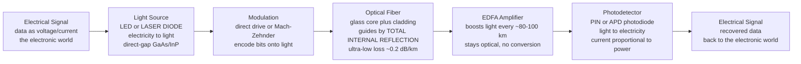

# 💡 Photonics and Optoelectronics

> [!abstract] TL;DR
> **Photonics** is engineering with *light* instead of (or alongside) electrons: a **laser or LED** turns an electrical signal into pulses of light, an **optical fiber** carries that light across oceans through hair-thin glass by **total internal reflection** with almost no loss (~0.2 dB/km), and a **photodetector** turns the light back into electricity at the far end. Because light oscillates at hundreds of **terahertz**, one fiber can carry many "colours" at once (**WDM**) for tens of **terabits per second** — which is why essentially all global Internet traffic, data-center interconnects, and 5G backhaul ride on photons in glass. **Optoelectronics** is the broader family of light-electricity converters: not just comms lasers and detectors, but **solar cells**, **displays**, and **image sensors**.

---

## Intuition

**Analogy:** Electrons are wonderful messengers, but in a copper wire they are like commuters shuffling down a crowded corridor — they bump into everything, heat the walls, jam at high frequency, and shout so loudly they interfere with the wire next door. **Light** is a different kind of messenger entirely: fire a pulse of laser light down a glass thread and it *flies*, doesn't rub against the walls, carries a staggering amount of information at once, and ignores the electrical chatter around it. Photonics is the art of putting your message *onto* light, sending it screaming through glass, and reading it back off as electricity at the other end.

Technically, that "corridor" is an **optical fiber** — a strand of ultra-pure glass thinner than a hair — and the message is imprinted as fast on/off (or phase) changes of a **laser** beam. The reason a video call crosses the planet in a blink is that the entire Internet backbone is exactly this: **electricity → light → glass → light → electricity**, repeated ocean by ocean. Everything below is just the physics of *how* we generate the light, trap it in the glass, and catch it again.

---

## How It Works

### Core Mechanics

1. **Start in the electronic world.** Your data lives as a voltage or current — bits driven by a transceiver chip. To send it far and fast, you convert it to light.
2. **Generate light (electricity → light).** A forward-biased **direct-band-gap** semiconductor diode emits photons when electrons and holes recombine across the gap. An **LED** emits by *spontaneous* emission (broad, incoherent, cheap); a **laser diode** adds an optical cavity to force *stimulated* emission, producing **coherent, narrow-linewidth** light ideal for long distances. The **band gap sets the colour**: photon energy $E = hf = hc/\lambda$ must equal the gap, so GaAs/InP/InGaAsP alloys are engineered to emit at the fiber's magic wavelengths. Silicon, being *indirect*-gap, is a terrible light emitter — a central inconvenience of photonics.
3. **Encode the data (modulation).** *Direct modulation* switches the laser's drive current on and off. For high speed and long reach, an *external* **Mach-Zehnder modulator** leaves the laser running steadily and instead flips the light's phase/amplitude — cleaner and faster.
4. **Guide the light (the fiber).** The light enters a glass **core** surrounded by a slightly lower-index **cladding**. At the core–cladding boundary the light undergoes **total internal reflection**, so it stays trapped and zig-zags (or, in single-mode fiber, flows as one guided mode) down the core. Modern silica fiber loses only **~0.2 dB/km** — light can travel ~80–100 km before it needs a boost.
5. **Amplify without converting (EDFA).** Instead of detecting and re-transmitting, an **Erbium-Doped Fiber Amplifier** pumps the fiber itself so it *amplifies the light optically* in the 1550 nm band — the trick that made transoceanic cables practical.
6. **Detect the light (light → electricity).** At the far end a reverse-biased **photodiode** (PIN, or an **avalanche photodiode / APD** for extra gain) absorbs photons and produces a photocurrent **proportional to the optical power** — the *responsivity*. That current is amplified and re-clocked back into bits.
7. **Multiply the capacity (WDM).** Because the optical spectrum is enormous, you can run *many* independent laser "colours" down the *same* fiber simultaneously — **Wavelength-Division Multiplexing** — combining them at the input and separating them at the output, multiplying capacity into the tens of **Tb/s**.

### Flow / Architecture



---

## Key Concepts

### Secondary Level

- **Photonics** — engineering with **light** the way electronics engineers with electric current: generating it, guiding it, switching it, and catching it.
- **The three jobs** — a **source** turns electricity into light, a **fiber** carries the light, a **detector** turns light back into electricity.
- **Optical fiber** — an ultra-thin, ultra-pure glass thread that traps light and carries it for tens of kilometres with tiny loss.
- **Why light?** — light travels fast, carries huge amounts of data at once, barely fades in glass, and does not electrically interfere with its neighbours.
- **Optoelectronics beyond comms** — the same physics runs **LED lighting**, **screens** (LED/OLED), **camera sensors**, and **solar panels** (light → electricity).

### Undergraduate Level

- **Photon energy and the band gap** — emission and absorption obey $E = hf = hc/\lambda$; a semiconductor emits/absorbs light whose photon energy matches its **band gap** $E_g$, so $\lambda \approx 1240 / E_g$ (nm, with $E_g$ in eV). **Direct-gap** materials (GaAs, InP, GaN) emit efficiently; **indirect-gap** silicon does not.
- **LED vs laser diode** — LEDs use **spontaneous** emission → broad spectrum, incoherent, cheap, short links; laser diodes add a resonant cavity for **stimulated** emission → **coherent**, narrow-linewidth, high-power light for long-haul.
- **Total internal reflection & fiber modes** — light stays in the core when it hits the cladding beyond the critical angle. **Single-mode fiber** (tiny ~9 µm core) carries one mode → no modal dispersion → long-haul; **multimode fiber** (~50 µm core) is cheaper but limited by modal dispersion → short reach.
- **Attenuation & the low-loss windows** — silica fiber has loss minima at **1310 nm** (near-zero chromatic dispersion) and **1550 nm** (lowest loss, ~0.2 dB/km, where EDFAs work), with an **OH (water) absorption peak** near 1383 nm. Power decays as $P(L) = P_0 \cdot 10^{-\alpha L/10}$.
- **Dispersion** — pulses spread and eventually overlap: **modal** (multimode), **chromatic** (different wavelengths travel at different speeds), and **polarization-mode** dispersion set the distance × bit-rate limit alongside attenuation.
- **Photodetectors** — **PIN** photodiodes (fast, linear) and **avalanche photodiodes (APD)** (internal gain) convert optical power to photocurrent via **responsivity** $R = \eta q\lambda/(hc)$ [A/W]; current $I = R \cdot P_{opt}$.

### Graduate Level

- **Semiconductor optical gain & rate equations** — laser threshold, carrier/photon coupling, relaxation oscillations, linewidth (Schawlow-Townes and the Henry $\alpha$ enhancement factor), and why external modulators beat direct modulation at high speed (chirp).
- **Fiber transmission physics** — the nonlinear Schrödinger equation governing propagation; the interplay of **Rayleigh scattering** ($\propto 1/\lambda^4$), infrared absorption, group-velocity dispersion $\beta_2$, and Kerr nonlinearities (self- and cross-phase modulation, four-wave mixing) that limit reach and channel count.
- **Optical amplification & noise** — EDFA gain flatness, amplified spontaneous emission (ASE), and the accumulation of **OSNR** penalty over cascaded spans; Raman amplification as a complement.
- **Coherent detection & advanced modulation** — recovering *amplitude and phase* with a local oscillator enables **QAM on light** (16-/64-QAM), polarization multiplexing, and DSP-based dispersion compensation — the basis of modern 400G/800G coherent optics.
- **WDM system engineering** — the ITU grid, DWDM channel spacing (50/100 GHz), the C- and L-bands (~1530–1625 nm), and the link budget: $\text{Tb/s} = \text{channels} \times \text{bits/symbol} \times \text{symbol rate}$.
- **Silicon photonics & integration** — building modulators, waveguides, and detectors (often **germanium-on-silicon**) in CMOS-compatible processes, with lasers flip-chip/heterogeneously integrated because silicon cannot lase — the platform behind **co-packaged optics** and photonic computing.

---

## Python Demo

```python
# Photonics essentials in one script:
#   (a) FIBER: attenuation vs wavelength (the 1310 & 1550 nm low-loss windows),
#              power decay with distance, and the WDM capacity available.
#   (b) DEVICES: LED/laser emission wavelength set by the band gap (E = hc/lambda),
#              and photodetector responsivity (photocurrent proportional to power).
import numpy as np
import matplotlib.pyplot as plt

# --- physical constants ---
h  = 6.626e-34          # Planck constant (J*s)
c  = 2.998e8            # speed of light (m/s)
q  = 1.602e-19          # electron charge (C)

# ============ (a) FIBER ATTENUATION vs WAVELENGTH ============
# Synthetic-but-realistic single-mode silica loss model (dB/km):
#   Rayleigh scattering ~ 1/lambda^4, an OH (water) peak near 1383 nm,
#   an infrared absorption tail at long wavelengths, plus a small floor.
lam_um = np.linspace(0.80, 1.70, 900)          # wavelength in micrometres
rayleigh = 0.80 / lam_um**4                     # dominant at short wavelengths
oh_peak  = 0.70 * np.exp(-((lam_um - 1.383) / 0.025)**2)   # water/OH absorption
ir_tail  = 0.05 * np.exp((lam_um - 1.55) / 0.10)           # infrared absorption
floor    = 0.03                                 # imperfection floor
atten    = rayleigh + oh_peak + ir_tail + floor  # total loss (dB/km)

def loss_at(nm):
    return np.interp(nm/1000.0, lam_um, atten)

a1310, a1550 = loss_at(1310), loss_at(1550)
print(f"Loss @ 1310 nm = {a1310:.2f} dB/km   Loss @ 1550 nm = {a1550:.2f} dB/km")

# ---- WDM capacity available in the C-band (~1530-1565 nm) ----
lam0, dlam = 1550e-9, 35e-9                      # centre wavelength, C-band width
bandwidth_Hz = c * dlam / lam0**2               # optical bandwidth: df = c*dl/l^2
spacing_Hz   = 50e9                             # 50 GHz DWDM channel spacing
n_channels   = int(bandwidth_Hz / spacing_Hz)
per_channel  = 400e9                            # 400 Gb/s per coherent channel
total_Tbps   = n_channels * per_channel / 1e12
print(f"C-band optical bandwidth ~ {bandwidth_Hz/1e12:.2f} THz")
print(f"~{n_channels} WDM channels @ 400 Gb/s  ->  ~{total_Tbps:.1f} Tb/s per fiber")

# ---- power vs distance: P(L) = P0 * 10^(-alpha*L/10) ----
L = np.linspace(0, 120, 400)                    # distance (km)
P0 = 1.0                                         # launched power (mW)
P_1550 = P0 * 10**(-a1550 * L / 10.0)
P_1310 = P0 * 10**(-a1310 * L / 10.0)

# ============ (b) EMISSION & DETECTION ============
# Emission wavelength set by the band gap:  lambda[nm] = h*c/(Eg) = 1239.8 / Eg[eV]
Eg = np.linspace(0.7, 3.6, 400)                 # band gap (eV)
lam_emit = (h * c / (Eg * q)) * 1e9             # emitted wavelength (nm)
materials = {"InGaAsP (1550)": 0.80, "InGaAsP (1310)": 0.95,
             "GaAs (~870)": 1.42, "GaN/InGaN (blue)": 2.7, "Silicon (indirect)": 1.12}

# Photodetector responsivity R = eta*q*lambda/(h*c)  [A/W]; current I = R * P_opt
lam_det = np.linspace(800, 1700, 400)           # detector wavelength (nm)
eta = 0.75                                       # quantum efficiency
R_ideal = (q * (lam_det*1e-9)) / (h * c)        # eta = 1
R_real  = eta * R_ideal
R_real[lam_det > 1600] = 0                        # InGaAs absorption cutoff

# ============ PLOTS ============
fig, ax = plt.subplots(2, 2, figsize=(14, 9))

# (1) fiber attenuation with the low-loss windows
ax[0,0].plot(lam_um*1000, atten, lw=2.4, color="#0984e3")
ax[0,0].scatter([1310, 1550], [a1310, a1550], color="#00b894", zorder=5, s=60)
ax[0,0].annotate("1310 nm window\n(zero dispersion)", (1310, a1310),
                 textcoords="offset points", xytext=(-10, 40), fontsize=8,
                 arrowprops=dict(arrowstyle="->"))
ax[0,0].annotate("1550 nm window\n(lowest loss, EDFA band)", (1550, a1550),
                 textcoords="offset points", xytext=(-40, 55), fontsize=8,
                 arrowprops=dict(arrowstyle="->"))
ax[0,0].annotate("OH water peak", (1383, loss_at(1383)),
                 textcoords="offset points", xytext=(-30, 10), fontsize=8)
ax[0,0].set_title("Optical fiber attenuation vs wavelength")
ax[0,0].set_xlabel("wavelength (nm)"); ax[0,0].set_ylabel("loss (dB/km)")
ax[0,0].grid(True, alpha=0.3)

# (2) power vs distance: gentle decay at 1550 nm
ax[0,1].plot(L, 10*np.log10(P_1550), lw=2.4, color="#6c5ce7",
             label=f"1550 nm ({a1550:.2f} dB/km)")
ax[0,1].plot(L, 10*np.log10(P_1310), lw=2.0, ls="--", color="#e17055",
             label=f"1310 nm ({a1310:.2f} dB/km)")
ax[0,1].axhline(-20, color="k", ls=":", lw=1.2, label="-20 dB budget")
ax[0,1].set_title("Power vs distance:  P = P0 * 10^(-alpha L / 10)")
ax[0,1].set_xlabel("fiber length (km)"); ax[0,1].set_ylabel("power (dBm)")
ax[0,1].legend(fontsize=8); ax[0,1].grid(True, alpha=0.3)

# (3) emission wavelength set by band gap
ax[1,0].plot(Eg, lam_emit, lw=2.4, color="#00b894")
for name, gap in materials.items():
    wl = (h*c/(gap*q))*1e9
    ax[1,0].scatter([gap], [wl], s=50, zorder=5)
    ax[1,0].annotate(name, (gap, wl), textcoords="offset points",
                     xytext=(6, 4), fontsize=7.5)
ax[1,0].axhspan(1260, 1360, color="#dfe6e9", alpha=0.6)
ax[1,0].axhspan(1530, 1565, color="#dfe6e9", alpha=0.6)
ax[1,0].set_title("Emission wavelength vs band gap:  lambda = hc / Eg")
ax[1,0].set_xlabel("band gap Eg (eV)"); ax[1,0].set_ylabel("wavelength (nm)")
ax[1,0].grid(True, alpha=0.3)

# (4) photodetector responsivity (current proportional to optical power)
ax[1,1].plot(lam_det, R_ideal, lw=1.8, ls="--", color="#b2bec3",
             label="ideal (eta = 1)")
ax[1,1].plot(lam_det, R_real, lw=2.4, color="#d63031",
             label=f"typical InGaAs (eta = {eta})")
ax[1,1].set_title("Photodetector responsivity  R = eta q lambda / hc")
ax[1,1].set_xlabel("wavelength (nm)"); ax[1,1].set_ylabel("responsivity (A/W)")
ax[1,1].legend(fontsize=8); ax[1,1].grid(True, alpha=0.3)

fig.suptitle("Photonics: fiber loss windows, reach, emission and detection",
             fontsize=13)
fig.tight_layout(rect=[0, 0, 1, 0.97])
fig.savefig("photonics_demo.png", dpi=120)
plt.show()
```

The top-left panel is the single most important curve in optical communications: fiber loss plunges toward two windows — **1310 nm** (near-zero dispersion) and **1550 nm** (the ~0.2 dB/km global minimum where **EDFA** amplifiers live) — separated by the **OH water peak**. The top-right panel shows why 1550 nm wins long-haul: at ~0.2 dB/km, light survives ~100 km per span. The bottom row captures the electricity↔light interface: emission wavelength is *pinned by the band gap* ($\lambda = hc/E_g$, which is why silicon sits at 1.12 eV yet cannot lase, and InGaAsP is tuned to 1310/1550 nm), while the detector's **responsivity rises linearly with wavelength** until the material's absorption cutoff — its photocurrent is simply proportional to the light hitting it.

---

## Real-World Applications

- **The Internet backbone** — terrestrial long-haul routes and **transoceanic submarine cables** carry essentially *all* intercontinental data traffic as WDM light over single-mode fiber with EDFA/Raman amplification. A single modern cable pair pushes hundreds of Tb/s.
- **Data-center interconnects & co-packaged optics** — hyperscale AI/cloud clusters move enormous east-west traffic on **pluggable optics** (100G/400G/800G) and increasingly **silicon-photonic co-packaged optics** that put the light source next to the switch/GPU ASIC to beat copper's reach and power limits.
- **Fiber-to-the-home (FTTH) & PON** — passive optical networks (GPON/XGS-PON) deliver gigabit broadband to homes over shared single-mode fiber using cheap LEDs/lasers and splitters.
- **5G fronthaul/backhaul** — dense fiber links carry radio data between antennas and baseband units with the low latency and bandwidth wireless generations demand.
- **LiDAR & sensing** — pulsed or FMCW laser ranging for autonomous vehicles, robotics, and mapping; distributed fiber sensing (DAS) monitors pipelines, borders, and structures using the fiber itself as the sensor.
- **Medical, industrial & display optoelectronics** — laser surgery and endoscopy, industrial cutting/welding lasers, **LED/OLED displays and lighting**, camera **image sensors**, and optical storage.
- **Solar energy** — **photovoltaic cells** are optoelectronics run in reverse: photons in, electricity out — the band-gap physics of emission mirrored into absorption.

---

## Common Pitfalls

- **Assuming silicon can emit light.** Silicon is an **indirect-gap** semiconductor — electron-hole recombination usually releases heat (a phonon), not a photon. Efficient sources need **direct-gap** materials (GaAs, InP, InGaAsP, GaN). This is *the* reason lasers must be bonded onto silicon-photonic chips rather than grown in them.
- **Confusing LEDs with laser diodes.** LEDs use **spontaneous** emission → broad, incoherent light, fine for indicators and short links but useless for long-haul (dispersion smears the wide spectrum). Laser diodes use **stimulated** emission in a cavity → **coherent, narrow-linewidth** light. Do not expect LED economics with laser performance.
- **Ignoring the wavelength windows.** Random wavelengths hit high loss or the OH water peak. Real systems live at **1310 nm** (zero dispersion) or **1550 nm** (lowest loss, EDFA band). Short multimode links use ~850 nm. Picking the wrong window wastes power budget.
- **Treating dispersion as an afterthought.** Even lossless fiber has a reach limit: **chromatic** and **modal** dispersion spread pulses until bits overlap. Multimode fiber's modal dispersion caps it at short reach; long-haul demands **single-mode** fiber and dispersion management/compensation.
- **Over-bending the fiber.** Bends below the minimum radius break total internal reflection and leak light (bend loss); microbends and bad splices add loss too. Fiber is glass — dirt on a connector or a tight loop tanks your link budget.
- **Mismatching source, fiber, and detector wavelengths.** A 1550 nm laser needs 1550-compatible fiber *and* an InGaAs detector (silicon detectors go blind past ~1100 nm). All three must share the band.
- **Forgetting the power/link budget.** Reach is set by launched power, fiber loss (dB/km × km), connector/splice losses, and receiver sensitivity. At ~0.2 dB/km you get ~80–100 km before needing an **EDFA** — plan spans and amplifiers accordingly, and watch accumulated ASE noise (OSNR).
- **Eye-safety complacency.** Fiber lasers, especially in the invisible IR, carry real eye-hazard energy. Never look into a live fiber or connector.

---

## Related Concepts

- [[Optical_Properties_and_Photonic_Materials]] — the materials-science engine room: absorption, emission, refractive index, and the direct/indirect band gaps that decide which materials can lase or detect.
- [[Semiconductors_Intrinsic_and_Extrinsic]] — doping, carriers, and band structure — the substrate physics under every LED, laser diode, and photodiode.
- [[p_n_Junctions_and_Diodes]] — the junction whose *forward* bias emits light (LED/laser) and whose *reverse* bias absorbs it (photodiode/solar cell).
- [[Laser_Physics]] — stimulated emission, population inversion, gain, and resonators — exactly what a laser diode does at the atomic level.
- [[Geometric_and_Wave_Optics]] — refractive index, Snell's law, and **total internal reflection**, the principle that traps light in the fiber core.
- [[Interference_and_Diffraction]] — the wave behaviour behind fiber modes, gratings, WDM filters, and Mach-Zehnder modulators.
- [[Polarization_and_Dispersion]] — how polarization and wavelength-dependent speed cause pulse spreading (chromatic/polarization-mode dispersion), a key reach limit.
- [[Wave_Motion_and_Properties]] — frequency, wavelength, and $v = f\lambda$: the bedrock relating a photon's colour to its energy and speed.

*Sibling notes in Electrical Engineering that connect directly: **Semiconductor_Devices_and_Diodes** (the light-emitting/absorbing junction is a diode), **Communication_Systems_Fundamentals** (photonics is the physical layer beneath modulation and multiplexing), **Maxwells_Equations_for_Engineers** (light is a guided electromagnetic wave), **RF_and_Microwave_Engineering** (the high-frequency analog cousin, now converging via microwave photonics), and **Renewable_Energy_Integration** (solar cells as optoelectronic energy sources). See the **Electrical_Engineering_Overview** for how photonics sits within the discipline.*

---

## Review Questions

1. **(Secondary)** Using the "messenger" analogy, give three reasons light beats electrons in copper for sending data across an ocean. In one sentence each, what do the **source**, **fiber**, and **detector** do?
2. **(Undergraduate)** A single-mode link runs at 1550 nm with 0.2 dB/km fiber, launches +3 dBm, and needs at least −24 dBm at the receiver. Ignoring connector losses, roughly how far can it reach before an amplifier is required? Why is 1550 nm chosen over 1310 nm for this long span, and what *other* impairment (besides loss) eventually limits reach?
3. **(Graduate)** Explain why the *same* band-gap parameter fixes an LED's emission colour, a laser diode's wavelength, and a photodiode's cutoff — and why silicon can *detect* near-IR poorly yet cannot *emit* it at all. Then describe how **WDM** and **coherent detection** together push a single fiber into the tens-of-Tb/s regime, and name the two nonlinear/noise effects that ultimately cap the channel count.

---

## Sources

- Saleh, B. E. A. & Teich, M. C. — *Fundamentals of Photonics* (Wiley) — the standard graduate survey of light generation, guiding, modulation, and detection.
- Agrawal, G. P. — *Fiber-Optic Communication Systems* (Wiley) — fibers, sources, detectors, dispersion, WDM, and nonlinear transmission in depth.
- Yariv, A. & Yeh, P. — *Photonics: Optical Electronics in Modern Communications* (Oxford) — device physics of lasers, modulators, and waveguides.
- Keiser, G. — *Optical Fiber Communications* (McGraw-Hill) — a systems-oriented treatment of fiber links, budgets, and networks.
- Chrostowski, L. & Hochberg, M. — *Silicon Photonics Design* (Cambridge) — the integrated-optics frontier and CMOS-compatible photonic circuits.

---

#electrical-engineering #photonics #optical-fiber #lasers #optoelectronics
