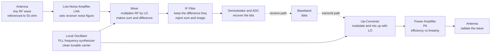

# 📡 RF and Microwave Engineering

> [!abstract] TL;DR
> **RF and microwave engineering is electronics run at frequencies so high — megahertz to gigahertz to millimetre-wave — that signals stop behaving like currents you switch and start behaving like *waves* you steer, match, and mix.** In this regime the wavelength shrinks to the size of your components, so a wire becomes an antenna and a bend becomes a circuit element; you match everything to a standard **50 Ω**, characterize parts by **S-parameters** (how they reflect and transmit waves) instead of voltage and current, and design on the **Smith chart**. The canonical architecture is the **superheterodyne receiver**: a **low-noise amplifier** (whose noise figure sets the whole receiver's sensitivity via the **Friis cascade**) feeds a **mixer** that multiplies the signal by a **local oscillator** to **heterodyne** it down to a fixed **intermediate frequency**, producing **sum and difference** frequencies; transmit reverses this with an up-converter and a **power amplifier** fighting the eternal **efficiency-versus-linearity** tradeoff. This is the physical layer of *all* wireless — cellular, Wi-Fi, GPS, radar, and satellite.

## Intuition — analogy FIRST

At the frequencies your laptop's digital logic runs, electronics is comfortingly simple: a wire is a wire, voltage is voltage, and a signal either arrives or it doesn't. Crank the frequency up to a **billion cycles per second** and you cross into a strange twilight zone where none of that is true anymore.

Here is the disorienting part. A radio wave at 3 GHz has a **wavelength of about 10 centimetres** — the length of your thumb. That means a signal does not appear "all at once" along a 10 cm trace on your circuit board: the far end of the trace is at a *different point in the wave's cycle* than the near end. Suddenly a plain copper track is a **transmission line**, an innocent right-angle bend **reflects energy back at you**, an open-ended stub becomes a **tuned filter**, and if you touch a normal voltmeter probe to the circuit you disturb the very wave you were trying to measure. The comfortable rules of lumped circuits dissolve; the **wave nature** of the signal takes over.

So RF and microwave engineers stop thinking in currents-through-components and start thinking like **plumbers of waves**. The mental model is water flowing through pipes of a fixed bore: everything is built to a single "pipe diameter" — an impedance of **50 ohms** — so that waves flow through junctions **without splashing back**. A mismatch anywhere is a change in pipe diameter that sends an echo travelling back up the line. The whole craft becomes: *how do I launch this wave, guide it, amplify it without adding hiss, shift its frequency, and match every junction so nothing reflects?*

This invisible craft is behind every radar dish sweeping the sky, every satellite dish bolted to a roof, every cell tower, and the tiny radio buried inside the phone in your pocket — all of them taming waves that oscillate **billions of times a second** to carry your data through empty air.

---

## How It Works

### Core mechanics

The unifying problem of RF is that at high frequency you cannot escape the **wave**. Four consequences flow from that single fact, and they define the whole discipline:

1. **Everything is distributed, not lumped.** Because the wavelength is comparable to your components, you cannot pretend a component sits at "one point." Interconnects become **transmission lines** with a characteristic impedance; a length of line *transforms* impedance; components have unavoidable parasitic inductance and capacitance. (See the sibling notes *Transmission_Lines* and *Waveguides_and_Antennas*.)
2. **You match everything to 50 Ω.** Any impedance discontinuity reflects a fraction of the incident wave back toward the source — quantified by the reflection coefficient $\Gamma = (Z_L - Z_0)/(Z_L + Z_0)$ and the standing-wave ratio (VSWR). Reflected power is power *not delivered*, and it can destroy a power amplifier. So every block is designed to present and see **50 Ω**, using the **Smith chart** (a conformal map of the reflection coefficient) to visualize the matching.
3. **You characterize with S-parameters, not V and I.** At GHz you cannot reliably measure the instantaneous voltage and current a transistor model needs. Instead you measure **scattering parameters** — $S_{11}$ (input reflection), $S_{21}$ (forward gain/transmission), $S_{12}$ (reverse isolation), $S_{22}$ (output reflection) — which describe how *waves* scatter off a device's ports. A **vector network analyzer (VNA)** measures them directly. S-parameters compose cleanly, are measurable, and are the universal currency of RF design.
4. **You shift frequency by mixing (heterodyning).** Amplifying, filtering, and demodulating a signal is far easier at a *fixed, lower* frequency than at whatever channel the antenna caught. So the receiver **multiplies** the incoming RF by a clean **local oscillator (LO)** sinusoid. A trig identity does the magic: $\cos(\omega_{RF} t)\cos(\omega_{LO} t) = \tfrac12\cos((\omega_{RF}-\omega_{LO})t) + \tfrac12\cos((\omega_{RF}+\omega_{LO})t)$ — the product contains the **sum** and **difference** frequencies. Keep the difference (the **intermediate frequency, IF**) and you have slid the whole signal down to a convenient, fixed band. This is Edwin **Armstrong's superheterodyne** principle, and essentially every radio built since 1918 uses it.

The receiver's **sensitivity** — the weakest signal it can hear — is set almost entirely by the **first** amplifier. The **Friis noise formula** for a cascade,
$$F_\text{total} = F_1 + \frac{F_2-1}{G_1} + \frac{F_3-1}{G_1 G_2} + \cdots,$$
shows that each stage's noise is *divided by the gain of everything before it*. Put a high-gain, low-noise amplifier **first** and its gain suppresses the noise of everything downstream; that first LNA's **noise figure** dominates the total. Put a lossy mixer first and the receiver goes deaf. This is why the block right behind the antenna is always the **LNA**.

On transmit the chain runs backwards: baseband data modulates a carrier, an up-converting mixer shifts it to the RF channel, and a **power amplifier (PA)** boosts it to watts for the antenna. The PA is where the **efficiency-versus-linearity** war is fought: a nonlinear PA is efficient but smears the signal into neighbouring channels (**intermodulation**, spectral regrowth), while a linear PA is clean but wastes power as heat. Modern high-**PAPR** signals (OFDM in Wi-Fi/5G) force the PA into deep **back-off** or into clever architectures like **Doherty** and **envelope tracking**, often built in **GaN** for power and efficiency.

### Signal chain — the superheterodyne transceiver



---

## Key Concepts / Details

### Secondary Level

- **Radio is waves, not just wires.** At radio and microwave frequencies the signal is an **electromagnetic wave** (the same physics as light, just longer wavelength) that travels through space and along cables. RF engineering is the art of making and catching those waves.
- **Mixing = tuning your radio.** When you "tune" to a station, the radio generates its own internal tone (the **local oscillator**) and **multiplies** it against everything the antenna picks up. The math of multiplying two waves produces their **difference** frequency — and the radio is built to listen only there. Turning the dial changes the internal tone so a different station lands on that fixed listening frequency.
- **The first amplifier matters most.** The antenna's signal is fantastically weak. The very first amplifier behind it (the **low-noise amplifier**) must boost it while adding almost no hiss of its own, because any noise added there gets amplified by everything after. Get the first stage wrong and the whole radio is deaf.
- **Everything is 50 ohms.** RF parts, cables, and connectors are all built to a standard "impedance" of **50 ohms** so that waves flow between them smoothly instead of bouncing back — like matching pipe diameters so water doesn't splash at every joint.
- **Where you meet it:** Wi-Fi, Bluetooth, GPS, the cellular radio in your phone, car radar, weather radar, satellite TV — and the microwave oven, which uses the same GHz waves to shake water molecules and heat your food.

### Undergraduate Level

**The heterodyne identity.** Frequency conversion rests on the product-to-sum identity:
$$\cos(2\pi f_{RF} t)\,\cos(2\pi f_{LO} t) = \tfrac12\cos\!\big(2\pi (f_{RF}-f_{LO})\,t\big) + \tfrac12\cos\!\big(2\pi (f_{RF}+f_{LO})\,t\big).$$
A **mixer** is a nonlinear or switching device that realizes this multiply. Its outputs are the **IF = |f_RF − f_LO|** (kept) and the **sum** (filtered away). **Conversion loss/gain** measures how much signal survives; **spurs** are unwanted mixing products of harmonics.

**The image-frequency problem.** A mixer cannot tell $f_{LO}+f_{IF}$ from $f_{LO}-f_{IF}$ — both land on the same IF. The unwanted one is the **image**. It must be removed *before* the mixer by an RF filter, or cancelled by an **image-reject mixer** (quadrature architecture). Choosing the IF is a tradeoff: a high IF pushes the image far away (easy to filter) but makes IF filtering harder; a low IF is the reverse.

**S-parameters and matching.**
- Reflection coefficient at a load: $\Gamma = \dfrac{Z_L - Z_0}{Z_L + Z_0}$, with $Z_0 = 50\ \Omega$. VSWR $= \dfrac{1+|\Gamma|}{1-|\Gamma|}$.
- **Return loss** $= -20\log_{10}|\Gamma|$ (dB); **insertion loss/gain** relate to $|S_{21}|$.
- The **Smith chart** plots impedance on the plane of $\Gamma$ (unit circle = totally reflective), turning matching-network design into geometric moves (adding series/shunt L or C rotates you along circles).

**Noise figure and the Friis cascade.** Noise factor $F = \text{SNR}_{in}/\text{SNR}_{out}$; noise figure $\text{NF} = 10\log_{10}F$ (dB). For stages in series:
$$F_\text{total} = F_1 + \frac{F_2-1}{G_1} + \frac{F_3-1}{G_1 G_2} + \cdots$$
The first stage's noise passes through undivided; later stages are suppressed by preceding gain — **the LNA dominates**. Reference to the antenna, sensitivity is $P_\text{sens} = -174\ \text{dBm/Hz} + 10\log_{10}(B) + \text{NF} + \text{SNR}_\text{req}$.

**Nonlinearity — the RF linearity battle.** Real amplifiers are only *approximately* linear. Model the transfer as $v_\text{out} = a_1 v + a_2 v^2 + a_3 v^3 + \cdots$:
- **1-dB compression point (P1dB):** input power where gain has dropped 1 dB below its small-signal value — the onset of saturation.
- **Third-order intercept (IP3/IIP3):** the extrapolated point where third-order intermodulation products would equal the fundamental; a figure of merit for two-tone distortion. **IM3** products fall at $2f_1-f_2$ and $2f_2-f_1$, dangerously close to the wanted signals and impossible to filter out.
- **Dynamic range** is bounded below by noise figure and above by compression/IP3.

**The building blocks.**

| Block | Job | Key metric / tension |
|---|---|---|
| **LNA** | first-stage gain with minimal added noise | noise figure vs gain vs matching |
| **Mixer** | frequency conversion (RF↔IF) | conversion loss, LO leakage, spurs, image |
| **Local oscillator / PLL / synthesizer** | generate clean tunable carrier | **phase noise**, spurs, lock time |
| **Power amplifier (PA)** | drive watts into the antenna | **efficiency vs linearity**, PAPR back-off |
| **Filters (SAW / BAW / cavity)** | select band, reject image and spurs | insertion loss vs selectivity, size |
| **Circulator / duplexer** | separate TX and RX on one antenna | isolation, non-reciprocity |

### Graduate Level

**Why 50 Ω?** It is an engineering compromise for coaxial cable. Minimum attenuation in an air-filled coax occurs near **77 Ω**; maximum power-handling occurs near **30 Ω**; the geometric-ish compromise landed at **50 Ω** (and 75 Ω survives for low-loss video/cable-TV). Standardizing one impedance made components, connectors, and measurement gear interoperable — the "50 Ω everywhere" convention is as much about ecosystem as physics.

**S-parameters as a wave formalism.** Define incident/reflected wave amplitudes $a_i = (V_i + Z_0 I_i)/2\sqrt{Z_0}$, $b_i = (V_i - Z_0 I_i)/2\sqrt{Z_0}$; then $\mathbf{b} = \mathbf{S}\,\mathbf{a}$. S-parameters exist and are bounded even when Z/Y/H parameters blow up (open/short terminations), they cascade via **T-parameters**, and for a lossless reciprocal network $\mathbf{S}$ is unitary and symmetric. The VNA measures $\mathbf{S}(f)$ after **calibration** (SOLT/TRL) that de-embeds cables and connectors — the calibration is often harder than the measurement.

**Receiver architectures beyond classic superhet.**
- **Superheterodyne:** best selectivity/dynamic range, but needs image-reject filtering and multiple LOs/IFs — bulky.
- **Direct-conversion (zero-IF / homodyne):** LO = carrier, IF = 0. No image, highly integrable (dominates modern CMOS transceivers), but suffers **DC offset**, **LO self-mixing**, **flicker (1/f) noise**, and **I/Q imbalance**.
- **Low-IF** and **sampling/software-defined radio** trade these problems differently; SDR pushes the ADC as close to the antenna as dynamic range and clock jitter allow.

**Oscillator phase noise.** A real oscillator's spectrum is not a delta but a noisy skirt; **Leeson's model** gives regions with $1/f^3$, $1/f^2$, and flat slopes set by the resonator $Q$, device noise, and power. Phase noise directly limits **reciprocal mixing** (a strong adjacent channel mixes with LO skirts into your IF), EVM, and radar Doppler resolution. This connects intimately to [[Oscillators_and_Feedback_Amplifiers|oscillator and PLL design]].

**Power-amplifier classes and linearization.** Class **A** (linear, ~50% max, always conducting) → **AB** → **B** → **C** (efficient, distorted) trade conduction angle for efficiency; switching classes **D/E/F** shape voltage/current waveforms to approach 100% but are inherently nonlinear. High-PAPR OFDM forces either **back-off** (wasteful) or linearization: **Doherty** amplifiers (a peaking stage that boosts efficiency at back-off), **envelope tracking** (modulate the supply), and **digital pre-distortion (DPD)** (invert the PA nonlinearity in DSP). **GaN** HEMTs give high power density and efficiency; **GaAs**, **SiGe** BiCMOS, and **CMOS** cover LNAs, mixers, and integrated transceivers/**MMICs**.

**The frequency bands.** HF/VHF/UHF (below ~3 GHz) for broadcast, cellular sub-6, GPS; **microwave** (3–30 GHz) for Wi-Fi, radar, satellite, point-to-point links; **mmWave** (30–300 GHz) for 5G FR2, automotive 77 GHz radar, and 6G research — where huge bandwidth meets brutal path loss, forcing **phased-array beamforming** and integrated antenna-in-package designs.

---

## Python Demo

```python
# RF chain fundamentals with numpy + matplotlib:
#   (a) FREQUENCY MIXING / HETERODYNING -- multiply an RF tone by a local-oscillator
#       sinusoid; the product's spectrum shows the SUM and DIFFERENCE frequencies.
#       Low-pass filtering keeps the DIFFERENCE (the intermediate frequency, IF) --
#       this is how every superheterodyne radio slides a channel down to a fixed band.
#   (b1) FRIIS NOISE CASCADE -- the receiver's total noise factor referred to the input;
#        the FIRST stage dominates. Putting the LNA first vs the lossy mixer first
#        changes the whole receiver's noise figure dramatically.
#   (b2) PA GAIN COMPRESSION -- a memoryless cubic nonlinearity shows the 1-dB
#        compression point where the amplifier stops being linear.
import numpy as np
import matplotlib.pyplot as plt

db2lin = lambda d: 10.0 ** (d / 10.0)     # dB -> linear power ratio

# ============================================================
# (a) MIXING: RF x LO -> sum and difference frequencies
# ============================================================
fs   = 10_000.0                    # sample rate [Hz]
N    = 8000
t    = np.arange(N) / fs
f_RF = 1000.0                      # incoming RF tone (stand-in for a GHz carrier)
f_LO = 1200.0                      # local oscillator
f_diff, f_sum = abs(f_RF - f_LO), f_RF + f_LO   # 200 Hz (IF) and 2200 Hz

rf    = np.cos(2*np.pi*f_RF*t)
lo    = np.cos(2*np.pi*f_LO*t)
mixed = rf * lo                    # the mixer's multiply

# spectrum
win  = np.hanning(N)
freq = np.fft.rfftfreq(N, 1/fs)
def spectrum(x):
    return np.abs(np.fft.rfft(x * win)) / N * 2
S_mix = spectrum(mixed)

# ideal brick-wall low-pass to KEEP the difference (IF) and reject the sum
f_cut  = 600.0
mask   = (freq <= f_cut)
X_full = np.fft.rfft(mixed * win)
S_if   = np.abs(X_full * mask) / N * 2

print(f"Mixing {f_RF:.0f} Hz RF with {f_LO:.0f} Hz LO -> "
      f"difference/IF = {f_diff:.0f} Hz, sum = {f_sum:.0f} Hz")
print(f"Low-pass at {f_cut:.0f} Hz keeps the IF, rejects the sum.")

# ============================================================
# (b1) FRIIS CASCADE: total noise factor, LNA-first vs mixer-first
#   F_total = F1 + (F2-1)/G1 + (F3-1)/(G1*G2) + ...
# ============================================================
# stage specs: (name, NF_dB, Gain_dB)
lna   = ("LNA",    1.5,  20.0)
mixer = ("Mixer", 10.0,  -6.0)     # conversion LOSS -> gain < 1
ifamp = ("IF amp", 6.0,  30.0)

def cascade_terms(stages):
    """noise-factor contribution of each stage, referred to the input."""
    terms, Gprod = [], 1.0
    for i, (name, nf, g) in enumerate(stages):
        F = db2lin(nf)
        terms.append((name, F if i == 0 else (F - 1.0) / Gprod))
        Gprod *= db2lin(g)
    return terms

good = cascade_terms([lna, mixer, ifamp])       # correct order: LNA first
bad  = cascade_terms([mixer, lna, ifamp])       # wrong order: mixer first
F_good = sum(v for _, v in good); NF_good = 10*np.log10(F_good)
F_bad  = sum(v for _, v in bad);  NF_bad  = 10*np.log10(F_bad)
print(f"\nLNA-first  cascade NF = {NF_good:.2f} dB   (first stage dominates)")
print(f"Mixer-first cascade NF = {NF_bad:.2f} dB   (receiver goes deaf!)")

# ============================================================
# (b2) PA COMPRESSION: cubic nonlinearity -> 1-dB compression point
#   fundamental output amplitude ~ g1*A + (3/4)*g3*A^3   (g3 < 0 = compressive)
# ============================================================
g1, g3 = 10.0, -0.5                # small-signal voltage gain 20 dB; compressive cubic
R = 50.0
A = np.linspace(0.02, 2.5, 500)                 # input amplitude sweep
Vout = np.abs(g1*A + 0.75*g3*A**3)              # fundamental output amplitude
Pin_dBm  = 10*np.log10((A**2/2)   / R / 1e-3)
Pout_dBm = 10*np.log10((Vout**2/2)/ R / 1e-3)
Pout_lin = Pin_dBm + 20*np.log10(g1)            # ideal linear extrapolation
comp     = Pout_lin - Pout_dBm                  # gain compression [dB]
i1dB     = int(np.argmin(np.abs(comp - 1.0)))   # where compression = 1 dB
print(f"\nPA 1-dB compression: Pin = {Pin_dBm[i1dB]:.1f} dBm, "
      f"Pout = {Pout_dBm[i1dB]:.1f} dBm")

# ============================================================
# PLOTS
# ============================================================
fig, ax = plt.subplots(2, 2, figsize=(14, 9))

# (1) mixer output spectrum: sum & difference
ax[0,0].plot(freq, S_mix, lw=1.2)
ax[0,0].axvline(f_diff, color='g', ls='--', label=f"difference / IF = {f_diff:.0f} Hz")
ax[0,0].axvline(f_sum,  color='r', ls='--', label=f"sum = {f_sum:.0f} Hz")
ax[0,0].set(title="(a) Mixer output: RF x LO -> SUM and DIFFERENCE",
            xlabel="frequency [Hz]", ylabel="magnitude", xlim=(0, 2600))
ax[0,0].legend(); ax[0,0].grid(alpha=0.3)

# (2) after IF low-pass: only the difference (IF) survives
ax[0,1].plot(freq, S_if, lw=1.2, color='g')
ax[0,1].axvspan(0, f_cut, color='g', alpha=0.08, label=f"low-pass keeps < {f_cut:.0f} Hz")
ax[0,1].axvline(f_sum, color='r', ls=':', label="sum rejected")
ax[0,1].set(title="(a) After IF filter: only the difference (IF) remains",
            xlabel="frequency [Hz]", ylabel="magnitude", xlim=(0, 2600))
ax[0,1].legend(); ax[0,1].grid(alpha=0.3)

# (3) Friis cascade: stage-by-stage noise contribution, both orderings
labels = [n for n, _ in good]                   # LNA, Mixer, IF amp
bad_by_name = dict(bad)                          # name -> mixer-first contribution
good_vals = [v for _, v in good]
bad_vals  = [bad_by_name[name] for name in labels]
x = np.arange(len(labels)); w = 0.38
ax[1,0].bar(x - w/2, good_vals, w, label=f"LNA first (NF={NF_good:.1f} dB)")
ax[1,0].bar(x + w/2, bad_vals,  w, label=f"Mixer first (NF={NF_bad:.1f} dB)", color='crimson')
ax[1,0].set_xticks(x); ax[1,0].set_xticklabels(labels)
ax[1,0].set(title="(b1) Friis cascade: 1st stage dominates the noise",
            ylabel="noise-factor contribution (referred to input)")
ax[1,0].legend(); ax[1,0].grid(alpha=0.3, axis='y')

# (4) PA gain compression with 1-dB point
ax[1,1].plot(Pin_dBm, Pout_lin, 'k--', lw=1.3, label="ideal linear")
ax[1,1].plot(Pin_dBm, Pout_dBm, lw=2.0, label="real PA (compressing)")
ax[1,1].plot(Pin_dBm[i1dB], Pout_dBm[i1dB], 'ro', ms=9,
             label=f"P1dB @ Pin={Pin_dBm[i1dB]:.1f} dBm")
ax[1,1].set(title="(b2) Power amplifier: 1-dB compression point",
            xlabel="input power [dBm]", ylabel="output power [dBm]")
ax[1,1].legend(); ax[1,1].grid(alpha=0.3)

plt.tight_layout()
plt.savefig("rf_chain_demo.png", dpi=110)
print("\nSaved rf_chain_demo.png")
```

**What it shows.** Panel (a-left) is the heart of every radio: multiplying a 1000 Hz "RF" tone by a 1200 Hz local oscillator produces exactly two new lines — the **difference at 200 Hz** (the IF we want) and the **sum at 2200 Hz** — the heterodyne identity made visible. Panel (a-right) applies an IF low-pass filter: the sum vanishes and only the down-converted IF survives, which is how the radio parks any channel on one fixed, easy-to-process frequency. Panel (b1) drives home the **Friis** lesson: with the LNA first, the receiver's noise figure is ~2 dB, but swap the lossy mixer to the front and it rockets to ~11 dB — the receiver goes deaf, because the mixer's noise is no longer divided by any preceding gain. Panel (b2) plots a compressing power amplifier: it tracks the ideal linear line until, near the marked **1-dB compression point**, it saturates — the onset of the nonlinearity that generates intermodulation and limits every RF link's usable power.

---

## Real-World Applications

- **Your phone's cellular/Wi-Fi/GPS radio.** A single handset packs multiple superheterodyne or direct-conversion transceivers, RF front-end modules with GaAs/CMOS LNAs and PAs, SAW/BAW filter banks, and PLL synthesizers hopping across dozens of 2G–5G bands, Wi-Fi 2.4/5/6 GHz, Bluetooth, and GPS — all sharing antennas via duplexers.
- **Radar.** Automotive **77 GHz mmWave** radar for adaptive cruise and collision avoidance; **weather radar** (Doppler for storm velocity); air-traffic, marine, and military radar all rely on stable low-phase-noise oscillators and high-power (often GaN) amplifiers.
- **Satellite communications and GPS.** Uplink/downlink at C/Ku/Ka bands use LNAs with sub-dB noise figures (often cooled) because the received signal is minuscule after a 36,000 km trip; the LNA's noise figure literally sets the link budget.
- **Radio astronomy.** Cryogenically cooled LNAs push noise figures to the physical limit to detect faint cosmic signals — the ultimate demonstration of Friis: the first stage is everything.
- **Wi-Fi and 5G base stations.** OFDM's high PAPR forces **Doherty** PAs, **envelope tracking**, and **digital pre-distortion** to stay linear and efficient; massive-MIMO **phased arrays** steer beams by controlling the phase of many RF chains.
- **The microwave oven.** A magnetron generates ~2.45 GHz microwaves that couple into water's dielectric loss — the same physics of wave generation and cavity resonance, applied to heating rather than communicating.

---

## Common Pitfalls

- **Thinking in lumped circuits at GHz.** Once the wavelength approaches the trace length, a wire is a **transmission line**, a bend reflects, and V/I intuition fails. You *must* switch to distributed thinking, S-parameters, and the Smith chart. Treating a 3 GHz layout like a DC schematic guarantees mismatch, ripple, and mystery oscillations.
- **Ignoring impedance matching / the 50 Ω discipline.** An unmatched junction reflects power ($\Gamma \neq 0$), causing standing waves, gain ripple, lost sensitivity, and possible PA damage from reflected power. Match every interface; watch VSWR/return loss.
- **Forgetting the image frequency.** A plain mixer folds both $f_{LO}\pm f_{IF}$ onto the same IF. Without an RF image-reject filter *before* the mixer (or an image-reject architecture), a strong signal at the image frequency swamps your channel. Choosing the IF is partly an image-management decision.
- **Putting a lossy stage before the LNA.** Any filter, switch, or cable loss ahead of the LNA adds *directly* to the noise figure (its loss ≈ its NF, undivided by gain). Every 0.5 dB of front-end loss is 0.5 dB of sensitivity gone. Order the cascade so gain comes early — that is the whole point of Friis.
- **Underestimating nonlinearity.** Driving a PA or LNA past P1dB creates **harmonics** and, worse, **third-order intermodulation** at $2f_1-f_2$ / $2f_2-f_1$ that land *inside* the passband and cannot be filtered out. Budget for IP3, back-off, and spectral regrowth from the start; don't chase efficiency into distortion.
- **Neglecting oscillator phase noise.** A noisy LO smears the carrier; via **reciprocal mixing**, strong adjacent channels leak into your IF, and EVM/BER degrade. Phase noise, not just frequency accuracy, decides whether a synthesizer is usable.
- **Trusting uncalibrated VNA measurements.** S-parameters are only as good as the SOLT/TRL calibration that de-embeds cables, connectors, and fixtures. Skipping or botching calibration produces confident-looking, completely wrong data.
- **Poor grounding, shielding, and layout.** At RF, ground is not a single node — ground bounce, unintended coupling, and radiating loops turn a stable amplifier into an oscillator and let interference leak everywhere. Layout *is* the circuit.

---

## Related Concepts

- [[Electromagnetic_Waves_and_Radiation]] — RF/microwave signals *are* EM waves; propagation, polarization, and radiation from antennas are the physics this discipline engineers.
- [[Maxwells_Equations]] — the distributed, field-based behavior that forces S-parameters and transmission-line design (instead of lumped V/I) comes directly from Maxwell's equations at high frequency.
- [[Oscillators_and_Feedback_Amplifiers]] — the local oscillators, PLLs, and frequency synthesizers that a mixer needs are exactly these feedback oscillators; **phase noise** is their key RF-specific metric.
- [[Fourier_Transform]] — mixing, sidebands, sum/difference frequencies, and IF filtering are all statements in the frequency domain; the Fourier transform is the language of the RF spectrum.
- [[Frequency_Spectrum]] — the whole superheterodyne idea is *moving energy around the spectrum*; understanding spectra of modulated signals underpins channel selection and image rejection.
- [[Fourier_Applications]] — amplitude/frequency modulation and heterodyne mixing are worked as Fourier applications; the sum-and-difference result is the multiplication (convolution-in-frequency) property.
- [[Sampling_Theorem]] — software-defined radios and IF-sampling receivers sample RF/IF directly; Nyquist, aliasing, and bandpass sampling decide where you can place the ADC.
- [[Analog_Filters_and_Frequency_Response]] — IF, image-reject, and channel-select filters are frequency-response design; RF just adds SAW/BAW/cavity technologies and tighter loss/selectivity tradeoffs.
- [[MOSFETs_and_CMOS]] — modern integrated LNAs, mixers, and transceivers are built in CMOS RFICs; device $f_T$/$f_\text{max}$ set the achievable frequency.
- [[Bipolar_Junction_Transistors]] — SiGe HBTs and GaAs/InP bipolar devices deliver low-noise, high-frequency gain for LNAs and mmWave front ends.
- [[Semiconductors_Intrinsic_and_Extrinsic]] — the wide-bandgap materials (GaN, GaAs) that make high-power, high-efficiency RF amplifiers possible are extrinsic semiconductors engineered for exactly these properties.

---

## Review Questions

1. **(Secondary)** In your own words, explain why a radio "mixes" the incoming signal with a tone it generates internally, and what "tuning" the radio actually changes. Why does the very first amplifier behind the antenna have to be extraordinarily quiet?
2. **(Undergraduate)** A receiver chain is LNA (NF = 1.5 dB, gain = 20 dB) → mixer (NF = 10 dB, gain = −6 dB) → IF amp (NF = 6 dB, gain = 30 dB). Compute the total noise figure using the Friis formula. Then recompute with the mixer placed *first*. Explain the difference quantitatively, and state the design rule it implies. Separately, for an LO at 1.2 GHz and an RF at 1.0 GHz, give the IF and the image frequency.
3. **(Graduate)** Contrast the superheterodyne and direct-conversion (zero-IF) architectures: what problem does each solve, and what new problems does each create? Then explain why 50 Ω became the universal RF impedance, why S-parameters are preferred over Z/Y parameters at microwave frequencies, and how oscillator phase noise degrades a receiver through reciprocal mixing.

---

## Sources

- Pozar, D. M. — *Microwave Engineering*, 4th ed. (transmission lines, S-parameters, matching/Smith chart, microwave components). [Wiley](https://www.wiley.com/en-us/Microwave+Engineering%2C+4th+Edition-p-9780470631553)
- Razavi, B. — *RF Microelectronics*, 2nd ed. (LNAs, mixers, oscillators, PLLs, receiver architectures, nonlinearity). [Pearson](https://www.pearson.com/en-us/subject-catalog/p/rf-microelectronics/P200000009291)
- Gonzalez, G. — *Microwave Transistor Amplifiers: Analysis and Design*, 2nd ed. (S-parameter amplifier design, stability, noise). [Pearson](https://www.pearson.com/en-us/subject-catalog/p/microwave-transistor-amplifiers-analysis-and-design/P200000003414)
- Ludwig, R. & Bogdanov, G. — *RF Circuit Design: Theory and Applications*, 2nd ed. (transmission lines, matching networks, RF components). [Pearson](https://www.pearson.com/en-us/subject-catalog/p/rf-circuit-design-theory-and-applications/P200000003396)
- Steer, M. — *Microwave and RF Design* (open-access multi-volume series, NC State). [NC State Libraries](https://www.lib.ncsu.edu/do/open-education/microwave-and-rf-design)

---

#electrical-engineering #rf-engineering #microwave #mixers #s-parameters
