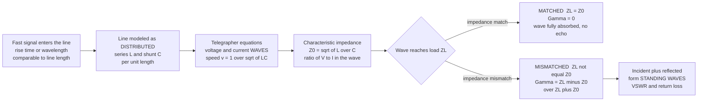

# 📡 Transmission Lines

> [!abstract] TL;DR
> At low frequency a wire is just a wire — the voltage is (almost) the same everywhere along it. But once a signal's **wavelength becomes comparable to the wire's length**, the signal is a **wave** that takes real time to travel and can **reflect** off the far end. Model the line as infinitesimal series **inductance** $L$ and shunt **capacitance** $C$ per unit length → the **telegrapher's equations** → voltage/current waves that travel at $v = 1/\sqrt{LC}$ with a **characteristic impedance** $Z_0 = \sqrt{L/C}$ (standardized at $50\,\Omega$ for RF, $75\,\Omega$ for video). When a wave hits a load $Z_L$, a fraction reflects — the **reflection coefficient** $\Gamma = (Z_L - Z_0)/(Z_L + Z_0)$. Match it ($Z_L = Z_0 \Rightarrow \Gamma = 0$) and the wave is fully absorbed; mismatch it and you get **standing waves**, **VSWR**, wasted power, and corrupted data. This one idea governs *all* high-speed and high-frequency engineering: RF, antennas, radar, and multi-GHz PCB signal integrity.

## Intuition — analogy FIRST

At low frequencies a wire is just a wire: flip a switch and the whole wire changes voltage together, as if the signal appeared everywhere on it at once. You never think about *where* on the wire you are.

But when signals get fast enough, a wire stops being a point and becomes a **hallway** down which the signal travels like a wave, taking real time to reach the far end. Now the far door matters. If the door is exactly the right shape — if it *fits* the hallway — your shout passes straight through and is gone. But shout down a hallway with a mismatched exit and part of your voice **bounces back as an echo**. Send a fast pulse down a cable into a mismatched load and it **reflects**, racing back to garble the signals behind it.

Transmission-line theory is how engineers stop these electrical echoes. The trick is to **match the hallway to the door** — make the load impedance equal the line's characteristic impedance so nothing reflects. That is exactly why every high-speed cable, PCB trace, and antenna feed is carefully *impedance-controlled*. This is the place where ordinary circuit theory (the wire is a node) hands off to wave physics (the wire is a medium).

---

## How It Works

### Core Mechanics

1. **When a wire becomes a transmission line.** The lumped model treats a wire as a single equipotential node. That is valid only when the wire is *electrically short* — its physical length $\ell$ is a small fraction of the wavelength $\lambda = v/f$ (rule of thumb: $\ell < \lambda/10$). A $30\text{-cm}$ trace is trivial at $1\ \text{kHz}$ ($\lambda = 300\ \text{km}$) but is *two wavelengths long* at $2\ \text{GHz}$. Once $\ell \gtrsim \lambda/10$, you must treat the signal as a **wave**.

2. **The distributed model.** Chop the line into infinitesimal cells. Each length $dz$ has series inductance $L\,dz$ (from the magnetic field around the conductors), shunt capacitance $C\,dz$ (from the electric field between them), and — for lossy lines — series resistance $R\,dz$ and shunt conductance $G\,dz$. Applying Kirchhoff's laws to a cell and taking $dz \to 0$ gives the **telegrapher's equations**:
$$\frac{\partial v}{\partial z} = -L\frac{\partial i}{\partial t}, \qquad \frac{\partial i}{\partial z} = -C\frac{\partial v}{\partial t}$$

3. **Waves fall out.** Differentiate and substitute to get the 1-D **wave equation** $\partial^2 v/\partial z^2 = LC\,\partial^2 v/\partial t^2$, whose solutions are forward and backward traveling waves $v(z,t) = v^+(z - v t) + v^-(z + v t)$ propagating at velocity $v = 1/\sqrt{LC}$.

4. **Characteristic impedance $Z_0$.** In a *single* traveling wave the ratio of voltage to current is fixed: $Z_0 = \sqrt{L/C}$ (lossless). It is *not* a resistor you can measure with an ohmmeter — it is the impedance the wave "sees" as it propagates into an infinite line. Standard values: $50\,\Omega$ (RF/microwave, a compromise between power handling and loss), $75\,\Omega$ (video/CATV, lowest loss), $100\,\Omega$ differential (Ethernet/USB), $90\,\Omega$ (USB), $\approx 120\,\Omega$ (twisted pair).

5. **Reflections at the load.** When the forward wave reaches a load $Z_L \ne Z_0$, the fixed ratio $Z_0$ cannot simultaneously satisfy the load's demanded $V/I = Z_L$. Nature resolves this by launching a **reflected wave**. The **voltage reflection coefficient** is
$$\boxed{\;\Gamma = \frac{Z_L - Z_0}{Z_L + Z_0}\;}$$
$\Gamma = 0$ when **matched** ($Z_L = Z_0$, wave fully absorbed), $\Gamma = +1$ for an **open** circuit, $\Gamma = -1$ for a **short**.

6. **Standing waves.** Incident and reflected waves superpose into a stationary interference pattern. Its "peakiness" is the **VSWR** $= V_{\max}/V_{\min} = (1 + |\Gamma|)/(1 - |\Gamma|)$, ranging from $1$ (perfect match) to $\infty$ (total reflection). **Return loss** $= -20\log_{10}|\Gamma|$ (dB) is the same information in decibels.

### Flow / Architecture



---

## Key Concepts / Details

### Secondary Level

**A wire is not always just a wire.** The dividing line is the ratio of physical length to wavelength $\lambda = v/f$. Electrically **short** ($\ell \ll \lambda$): lumped circuit, one voltage everywhere. Electrically **long** ($\ell \gtrsim \lambda/10$): treat it as a transmission line with traveling waves.

**Signals travel at finite speed.** On a coax with dielectric of relative permittivity $\varepsilon_r$, waves travel at $v = c/\sqrt{\varepsilon_r} \approx 0.66c$ for typical PTFE/polyethylene — about $2 \times 10^8\ \text{m/s}$, or roughly $5\ \text{ns}$ per meter. That delay is why long cables have measurable **propagation delay**.

**Echoes are reflections.** A mismatched end sends part of the wave back. Matched = no echo (all energy delivered); open or short = full echo. This is the single most important practical fact.

### Undergraduate Level

**The telegrapher's equations and their solution.** For a lossless line, sinusoidal steady state gives $V(z) = V^+ e^{-j\beta z} + V^- e^{+j\beta z}$ with phase constant $\beta = \omega\sqrt{LC} = 2\pi/\lambda$. The current wave is $I(z) = (V^+ e^{-j\beta z} - V^- e^{+j\beta z})/Z_0$ — note the **minus sign** on the reflected term, the source of all the interesting behavior.

**Input impedance of a terminated line.** Looking into a lossless line of length $\ell$ terminated in $Z_L$:
$$Z_{\text{in}} = Z_0\,\frac{Z_L + jZ_0\tan\beta\ell}{Z_0 + jZ_L\tan\beta\ell}$$
The impedance **transforms with position** — a mismatched load looks like a *different* impedance a quarter-wavelength back. Two famous special cases:
- **Quarter-wave transformer** ($\ell = \lambda/4$): $Z_{\text{in}} = Z_0^2/Z_L$. Choosing $Z_0 = \sqrt{Z_{\text{source}} Z_L}$ matches two real impedances — the classic single-frequency matching trick.
- **Stub lines**: a shorted line of length $< \lambda/4$ looks like a pure inductor; an open line looks like a capacitor. Distributed elements *replace* lumped L and C at microwave frequencies.

**Reflection, VSWR, return loss — one triangle of numbers.**

| Termination | $Z_L$ | $\Gamma$ | VSWR | Return loss |
|---|---|---|---|---|
| Matched | $Z_0$ | $0$ | $1$ | $\infty$ dB |
| Open | $\infty$ | $+1$ | $\infty$ | $0$ dB |
| Short | $0$ | $-1$ | $\infty$ | $0$ dB |
| $2Z_0$ (e.g. $100\,\Omega$) | $2Z_0$ | $+1/3$ | $2$ | $9.5$ dB |
| $Z_0/2$ (e.g. $25\,\Omega$) | $Z_0/2$ | $-1/3$ | $2$ | $9.5$ dB |

**Impedance matching is the goal.** Reflections corrupt signals (ringing, intersymbol interference), waste power (a fraction $|\Gamma|^2$ is sent back), and can damage transmitters. Matching networks (L-networks, quarter-wave transformers, stubs) transform $Z_L$ to $Z_0$.

**The Smith chart.** A conformal map of the complex $\Gamma$-plane onto the impedance plane, letting engineers do the $Z_{\text{in}}$ transformation and design matching networks *graphically*. Movement along the line is a rotation on the chart; adding a series/shunt element is a slide along a resistance/conductance circle. Still the lingua franca of RF design even in the age of simulators.

### Graduate Level

**Lossy lines and the general $Z_0$.** With $R$ and $G$ included, the propagation constant is complex, $\gamma = \alpha + j\beta = \sqrt{(R + j\omega L)(G + j\omega C)}$, and $Z_0 = \sqrt{(R + j\omega L)/(G + j\omega C)}$. The wave attenuates as $e^{-\alpha z}$ ($\alpha$ = attenuation constant, Np/m). At high frequency $R \ll \omega L$ and $G \ll \omega C$, so $Z_0 \to \sqrt{L/C}$ (real) and loss becomes nearly frequency-flat per wavelength.

**Dispersion and the distortionless condition.** In general $\beta(\omega)$ is nonlinear, so different frequencies travel at different speeds and pulses **disperse** (spread). Heaviside's **distortionless condition** $R/L = G/C$ makes $\alpha$ frequency-independent and $\beta$ linear — the historical motivation for **loading coils** on telephone lines. In modern high-speed digital, frequency-dependent dielectric loss and skin-effect resistance cause the same pulse smearing that limits channel reach.

**Power and the loss of matching.** Time-average power delivered to the load is $P = \tfrac{1}{2}|V^+|^2/Z_0 \,(1 - |\Gamma|^2)$. The factor $(1 - |\Gamma|^2)$ is the **mismatch loss**: even a modest VSWR of 2 ($|\Gamma| = 1/3$) reflects $|\Gamma|^2 \approx 11\%$ of the power. Maximum power transfer to a *complex* source requires the **conjugate match** $Z_L = Z_s^*$, which is subtly different from the reflectionless match $Z_L = Z_0$ — a common source of confusion.

**Time-domain reflectometry (TDR).** Send a fast **step** down the line and watch the reflections at the input. Each impedance discontinuity sends back an echo at time $t = 2\ell/v$ (round trip). The *sign and size* of the echo reveal the fault type (open, short, kink, connector, water ingress), and the *timing* gives the **distance to fault** $= v\,t/2$. TDR is how technicians locate a buried cable break without digging up the whole run, and how signal-integrity engineers profile the impedance of a PCB channel.

---

## Python Demo

```python
# Transmission-line reflection, VSWR, matching, and TDR.
# (a) Reflection coefficient, standing waves, VSWR vs load.
# (b) Pulse / step reflection (TDR) locating a mismatched end.
# Lossless line assumed. numpy + matplotlib only.
import numpy as np
import matplotlib.pyplot as plt

Z0 = 50.0                                   # characteristic impedance (ohms), RF standard

def gamma(ZL, Z0=Z0):
    """Voltage reflection coefficient  Gamma = (ZL - Z0)/(ZL + Z0)."""
    return (ZL - Z0) / (ZL + Z0)

def vswr(G):
    """Voltage standing-wave ratio from |Gamma|."""
    g = np.abs(G)
    return (1 + g) / (1 - g + 1e-15)

# --- Four canonical terminations ---
loads = {
    "matched  ZL=50":  50.0,
    "mismatch ZL=100": 100.0,
    "open     ZL=inf": 1e9,                 # ~ open circuit -> Gamma = +1
    "short    ZL=0":   0.0,                 # short circuit  -> Gamma = -1
}
for name, ZL in loads.items():
    G = gamma(ZL)
    rl = -20 * np.log10(np.abs(G) + 1e-15)  # return loss (dB)
    print(f"{name:18s} Gamma={G:+.3f}  |Gamma|={abs(G):.3f}  "
          f"VSWR={vswr(G):7.2f}  return loss={rl:6.1f} dB")

# --- Standing-wave envelope along the line (d = distance from load, in wavelengths) ---
d = np.linspace(0, 2.0, 800)                # two wavelengths of line
beta_d = 2 * np.pi * d                      # beta*d = 2*pi*(d/lambda)
Vp = 1.0                                     # incident amplitude (normalized)

fig, ax = plt.subplots(2, 3, figsize=(16, 9))

# (1) |V(d)| standing-wave envelope for each load
for name, ZL in loads.items():
    G = gamma(ZL)
    Venv = np.abs(Vp * (1 + G * np.exp(-2j * beta_d)))
    ax[0, 0].plot(d, Venv, lw=2, label=name)
ax[0, 0].set(title="Standing-wave voltage envelope |V| along the line",
             xlabel="distance from load  d / lambda", ylabel="|V|  (normalized)")
ax[0, 0].legend(fontsize=8); ax[0, 0].grid(alpha=0.3)

# (2) Snapshot: incident + reflected + resultant for a SHORT (Gamma = -1)
G = gamma(0.0)                              # short -> Gamma = -1
phase = np.pi / 4                           # a fixed instant omega*t
vi = Vp * np.cos(phase + beta_d)                     # incident component
vr = np.real(G) * Vp * np.cos(phase - beta_d)        # reflected component
res = vi + vr                                         # resultant standing wave
env = Vp * np.abs(1 + G * np.exp(-2j * beta_d))       # |V| envelope
ax[0, 1].plot(d, vi, lw=1.2, alpha=0.6, label="incident")
ax[0, 1].plot(d, vr, lw=1.2, alpha=0.6, label="reflected")
ax[0, 1].plot(d, res, 'k', lw=2.2, label="resultant")
ax[0, 1].plot(d,  env, 'r--', lw=1.4, label="envelope")
ax[0, 1].plot(d, -env, 'r--', lw=1.4)
ax[0, 1].set(title="Short circuit: nodes every half-wavelength",
             xlabel="distance from load  d / lambda", ylabel="voltage (normalized)")
ax[0, 1].legend(fontsize=8); ax[0, 1].grid(alpha=0.3)

# (3) |Gamma| vs (resistive) load
RL = np.linspace(0, 300, 600)
ax[0, 2].plot(RL, np.abs(gamma(RL)), lw=2)
ax[0, 2].axvline(Z0, color='r', ls=':', label="match: ZL = Z0")
ax[0, 2].plot(Z0, 0, 'ro')
ax[0, 2].set(title="|Gamma| vs load: zero only at ZL = Z0",
             xlabel="load resistance RL (ohms)", ylabel="|Gamma|")
ax[0, 2].legend(fontsize=8); ax[0, 2].grid(alpha=0.3)

# (4) VSWR vs (resistive) load
ax[1, 0].plot(RL, vswr(gamma(RL)), lw=2)
ax[1, 0].axhline(1, color='k', lw=0.6)
ax[1, 0].axvline(Z0, color='r', ls=':', label="VSWR = 1 at match")
ax[1, 0].set(title="VSWR vs load (1 = perfect, blows up at open/short)",
             xlabel="load resistance RL (ohms)", ylabel="VSWR", ylim=(1, 10))
ax[1, 0].legend(fontsize=8); ax[1, 0].grid(alpha=0.3)

# (5) TDR: step down the line, read the echo at the round-trip time 2T ---------
def tdr_input(t, Vs, Rs, Z0, RL, T, Nmax=50):
    """Input-end voltage vs time for a step launched into a mismatched line."""
    V1 = Vs * Z0 / (Z0 + Rs)                # launched step (source divider)
    GL = (RL - Z0) / (RL + Z0)              # load reflection
    Gs = (Rs - Z0) / (Rs + Z0)             # source reflection
    V = np.zeros_like(t)
    for n in range(Nmax):
        V += (Gs * GL) ** n * V1 * (t >= 2 * n * T)              # forward launches
        V += GL * (Gs * GL) ** n * V1 * (t >= (2 * n + 2) * T)   # returning echoes
    return V

v_prop = 2.0e8                              # propagation velocity (m/s), ~0.66 c
length = 10.0                               # line length (m)
T = length / v_prop * 1e9                   # one-way delay (ns) -> 50 ns
t = np.linspace(0, 300, 3000)               # time (ns)
Vs, Rs = 1.0, Z0                            # 1 V step from a MATCHED source (clean echo)
for name, ZL in loads.items():
    ax[1, 1].plot(t, tdr_input(t, Vs, Rs, Z0, ZL, T), lw=2, label=name)
ax[1, 1].axvline(2 * T, color='k', ls=':', label=f"round trip 2T = {2*T:.0f} ns")
ax[1, 1].set(title=f"TDR: echo at 2T locates fault at v*T = {v_prop*T*1e-9:.0f} m",
             xlabel="time (ns)", ylabel="input voltage (V)")
ax[1, 1].legend(fontsize=8); ax[1, 1].grid(alpha=0.3)

# (6) Return loss vs VSWR (the RF engineer's reference curve)
vswr_axis = np.linspace(1.01, 10, 500)
gmag = (vswr_axis - 1) / (vswr_axis + 1)    # |Gamma| from VSWR
ax[1, 2].plot(vswr_axis, -20 * np.log10(gmag), lw=2)
for v_ref in (1.5, 2.0, 3.0):
    g = (v_ref - 1) / (v_ref + 1)
    ax[1, 2].plot(v_ref, -20 * np.log10(g), 'ro')
    ax[1, 2].annotate(f"VSWR {v_ref}\n{-20*np.log10(g):.1f} dB",
                      (v_ref, -20 * np.log10(g)), fontsize=7,
                      textcoords="offset points", xytext=(6, 4))
ax[1, 2].set(title="Return loss vs VSWR (bigger dB = better match)",
             xlabel="VSWR", ylabel="return loss (dB)")
ax[1, 2].grid(alpha=0.3)

plt.tight_layout()
plt.savefig("transmission_lines.png", dpi=110)
print("Saved transmission_lines.png")
```

**What it shows.** Panel 1: the standing-wave envelope is *flat* for the matched load (no reflection) but ripples between $V_{\max}$ and $V_{\min}$ for open/short (full reflection, deep nulls) and mildly for the $100\,\Omega$ mismatch. Panel 2: for a short, incident and reflected waves interfere into a true standing wave with a forced voltage **node at the load** and nulls every half-wavelength. Panels 3–4: $|\Gamma|$ dips to zero and VSWR to 1 *only* at $Z_L = Z_0$ — the whole point of matching. Panel 5 (**TDR**): a step launched from a matched source shows a flat trace for the matched line, but a **bump at the round-trip time $2T$** for a mismatch — up for an open, down for a short, partway for $100\,\Omega$ — and the timing pins the fault to $v\,T = 10\ \text{m}$. Panel 6 is the reference chart every RF engineer memorizes: VSWR $1.5 \to 14\ \text{dB}$, VSWR $2 \to 9.5\ \text{dB}$.

---

## Real-World Applications

- **RF and antenna feeds.** Every transmitter feeds its antenna through $50\,\Omega$ coax; a bad match (high VSWR) reflects power back into the power amplifier, wasting energy and risking damage. Antenna tuners and matching networks force VSWR toward 1.
- **High-speed digital signal integrity.** Multi-GHz PCB traces (DDR memory, PCIe, USB, HDMI, Ethernet) are **controlled-impedance** ($50\,\Omega$ single-ended, $100\,\Omega$ differential). Series/parallel termination resistors kill reflections that would otherwise show up as ringing and false logic transitions.
- **Cable TV and video.** $75\,\Omega$ coax is chosen for minimum loss; connectors and splitters are $75\,\Omega$ so the signal is not corrupted by impedance bumps.
- **Radar and microwave systems.** Waveguides, microstrip, and stripline route GHz signals with tight impedance control; mismatches degrade range and resolution.
- **Cable fault location (TDR).** Field technicians pulse buried power, telecom, and network cables and read the echo timing to locate breaks, kinks, water ingress, and bad splices to within meters — without excavating the whole run.
- **Precise timing / clock distribution.** Impedance-matched lines deliver clean edges with predictable, uniform propagation delay across a board or backplane.

---

## Common Pitfalls

- **"A wire is always just a wire."** The lumped model is only valid when $\ell \ll \lambda$. Once the line length approaches $\sim\lambda/10$ (equivalently, when the signal's rise time is comparable to the round-trip delay), transmission-line effects — delay, reflection, ringing — appear and *must* be modeled. This is the number-one surprise for digital designers moving to faster edges.
- **Treating $Z_0$ as a resistor you can measure.** $Z_0 = \sqrt{L/C}$ is the *ratio of voltage to current in a traveling wave*, not a lumped resistance. An ohmmeter on an open $50\,\Omega$ cable reads infinity, not $50\,\Omega$. Yet a *matched* $50\,\Omega$ termination absorbs exactly as if the line continued forever.
- **Forgetting the sign of $\Gamma$.** Open circuit gives $\Gamma = +1$ (reflected wave in phase, voltage doubles at the end); short circuit gives $\Gamma = -1$ (out of phase, voltage forced to zero). Getting the sign wrong inverts every standing-wave and TDR interpretation.
- **Confusing the reflectionless match with the conjugate match.** $Z_L = Z_0$ eliminates reflections; $Z_L = Z_s^{*}$ maximizes power transfer from a complex source. For a matched real system they coincide, but in general they differ — do not blindly conflate them.
- **Assuming VSWR is harmless if "only" 2.** A VSWR of 2 already reflects $\sim 11\%$ of the power and creates voltage peaks $2\times$ the average — enough to matter for power amplifiers, breakdown, and sensitive digital links.
- **Ignoring dispersion and loss on long/fast links.** Frequency-dependent dielectric loss and skin effect smear pulse edges (intersymbol interference). Heaviside's distortionless condition $R/L = G/C$ and modern equalization exist precisely to fight this.
- **Mismatched connectors and vias.** Reflections come from *any* impedance discontinuity, not just the load: a connector, a via, a stub, or a width change on a PCB trace each launches its own echo. TDR reveals them as bumps along the trace.
- **Reading TDR distance without the velocity factor.** Distance to fault $= v\,t/2$ needs the cable's actual propagation velocity ($v = c/\sqrt{\varepsilon_r}$, often $\sim 0.66c$). Using $c$ overestimates the distance by $\sim 50\%$.

---

## Related Concepts

- [[Electromagnetic_Waves_and_Radiation]] — the signal on a transmission line is a **guided** electromagnetic wave; $Z_0$ is the line's analog of the impedance of free space.
- [[Maxwells_Equations]] — the telegrapher's equations are Maxwell's equations specialized to the two-conductor geometry; $L$ and $C$ per unit length come straight from the magnetic and electric field energy.
- [[Wave_Motion_and_Properties]] — standing waves, nodes/antinodes, and the reflection coefficient $r = (Z_2 - Z_1)/(Z_2 + Z_1)$ on a string are the exact mechanical twin of $\Gamma$ on a line.
- [[Introduction_to_PDEs]] — the telegrapher's equations reduce to the 1-D **wave equation**, the canonical hyperbolic PDE with left- and right-traveling solutions.
- [[Second_Order_Linear_ODEs]] — in phasor (steady-state) form the line equation is a second-order ODE in position $z$, whose $e^{\pm j\beta z}$ solutions are the forward and reflected waves.
- [[RC_RL_and_RLC_Transients]] — TDR is the *distributed* generalization of a lumped step response: instead of one $RC$ decay you see discrete echoes spaced by the round-trip delay.

Closely related sibling notes in this Electromagnetics & RF section build directly on this material: **Maxwell's equations for engineers** (the field foundation), **waveguides and antennas** (guided waves without two conductors, and the transition to radiation), **RF and microwave engineering** (Smith-chart matching, S-parameters), and **electromagnetic compatibility** (reflections and mismatches as EMI sources). This note also assumes the phasor and complex-impedance machinery from **AC circuit analysis and phasors**.

---

## Review Questions

1. **(Secondary)** A $30\ \text{cm}$ PCB trace carries a signal on FR-4 ($v \approx 1.5 \times 10^8\ \text{m/s}$). At $1\ \text{kHz}$ it behaves as a plain wire, but at $2\ \text{GHz}$ it must be treated as a transmission line. Compute the wavelength at each frequency and explain, using the $\ell$ vs $\lambda$ criterion, why the two cases are so different.
2. **(Undergraduate)** A $50\,\Omega$ line is terminated in $Z_L = 100\,\Omega$. Compute $\Gamma$, the VSWR, the return loss in dB, and the fraction of incident power that is reflected. Then describe how a **quarter-wave transformer** could be used to match this load, giving the required $Z_0$ of the transformer section.
3. **(Graduate)** A TDR step launched from a $50\,\Omega$ source into a cable ($v = 2 \times 10^8\ \text{m/s}$) shows the input voltage step *upward* at $t = 120\ \text{ns}$. What kind of fault is it, how far away is it, and why does the sign of the reflection tell you the fault type? Now suppose instead the trace shows a *small* downward bump at $60\ \text{ns}$ followed by the main upward step at $120\ \text{ns}$ — what does the intermediate discontinuity represent, and how would you distinguish a series inductance from a shunt capacitance from the *shape* of the reflected edge?

---

## Sources

- Pozar, D. M. — *Microwave Engineering*, 4th ed. (transmission-line theory, Smith chart, matching networks). [Wiley](https://www.wiley.com/en-us/Microwave+Engineering%2C+4th+Edition-p-9780470631553)
- Ulaby, F. & Ravaioli, U. — *Fundamentals of Applied Electromagnetics* (transmission lines, reflection, VSWR). [Pearson](https://www.pearson.com/en-us/subject-catalog/p/fundamentals-of-applied-electromagnetics/P200000003269)
- Johnson, H. & Graham, M. — *High-Speed Digital Design: A Handbook of Black Magic* (signal integrity, controlled impedance, TDR). [Prentice Hall](https://www.oreilly.com/library/view/high-speed-digital-design/9780133957242/)
- Sadiku, M. N. O. — *Elements of Electromagnetics*, 7th ed. (telegrapher's equations, characteristic impedance). [Oxford University Press](https://global.oup.com/academic/product/elements-of-electromagnetics-9780190698614)
- Steer, M. — *Microwave and RF Design* (open-access, NC State) — transmission lines and Smith chart. [NC State / OER](https://www.lib.ncsu.edu/do/open-education/microwave-and-rf-design)

---

#electrical-engineering #transmission-lines #impedance-matching #vswr #signal-integrity
