# 📡 Waveguides and Antennas

> [!abstract] TL;DR
> An **antenna** is a *transducer* that converts a **guided** electromagnetic wave — the electrical wiggles confined to a wire or transmission line — into a **radiating** free-space wave (transmit), and back again (receive). By **reciprocity**, an antenna's transmit and receive patterns are *identical*. Its behavior is summarized by a handful of metrics: the **radiation pattern** (how radiated power varies with direction), **directivity & gain** in $\text{dBi}$ (how tightly it concentrates power versus an isotropic radiator), **beamwidth**, **efficiency**, **polarization**, **bandwidth**, and **input impedance** (which must match the feed line). Resonant antennas are about $\lambda/2$ in size — which is *why* AM antennas are huge and mmWave ones are grain-of-rice tiny. A **waveguide** is a hollow metal pipe that herds microwaves along with very low loss above a **cutoff frequency**, carrying **TE/TM modes** (no TEM) — the plumbing of radar and satellite. Stack many elements with controlled phase and you get a **phased array**: a beam you can **steer electronically** with no moving parts — the engine behind 5G, radar, and massive MIMO.

## Intuition — analogy FIRST

An **antenna is a translator between two worlds**. Inside your phone, radio energy is trapped as guided electrical wiggles running along copper traces. The antenna takes those confined wiggles and *lets them go* — launching them as free-flying radio waves that cross the open sky — and on the far end another antenna *catches* those invisible waves and traps them back into wires. Every wireless link on Earth begins and ends at an antenna: no antenna, no signal ever leaves or enters.

A **waveguide is a pipe that herds waves** so they cannot escape — a hollow metal tube funneling microwaves from a radar transmitter to its dish without leaking, the way a garden hose channels water instead of letting it spray everywhere.

And the **shape of the antenna decides how it speaks**. A bare dipole radiates like a bare **light bulb** — glowing in almost every direction, reaching everyone but shouting at no one in particular. A big parabolic dish is a **laser pointer** — it takes the same energy and squeezes it into a pencil-thin beam that carries far in one direction but is invisible off to the side. That trade — spread the energy everywhere versus concentrate it in a beam — is the single most important choice in antenna design, and it is captured by one number: **gain**.

---

## How It Works

Every wireless link is the same six-step relay. A transmitter pushes a **guided wave** down a transmission line or waveguide; the **transmit antenna** converts that guided wave into a **radiating free-space wave**; the antenna's geometry shapes that radiation into a **pattern** with a certain **directivity/gain**; the wave **propagates** through space, weakening with distance; a **receive antenna** intercepts a slice of the wavefront and converts it *back* into a guided wave; and the receiver reads it. Because Maxwell's equations are time-symmetric, the same antenna has the **same pattern** whether it transmits or receives — the deep fact of **reciprocity**.

The radiation itself is a direct consequence of **accelerating charge**: when the feed current oscillates, the near-field energy that cannot re-collapse back into the antenna detaches and propagates outward as a self-sustaining $\mathbf{E}$-$\mathbf{H}$ wave — exactly the radiation term of Maxwell's equations. Close to the antenna the fields are complicated and reactive (the **near field**); many wavelengths away they settle into a clean, locally-planar **far field** whose shape *is* the radiation pattern.

```mermaid
graph LR
    TX["Transmitter<br/>guided wave on<br/>transmission line or waveguide"]
    ANT_T["Transmit antenna<br/>transducer guided to free-space<br/>matched to feed impedance"]
    PAT["Radiation pattern<br/>directivity and gain in dBi<br/>main beam plus sidelobes"]
    PROP["Free-space propagation<br/>far-field spherical wave<br/>Friis path loss grows with distance"]
    ANT_R["Receive antenna<br/>captures wave free-space to guided<br/>same pattern by reciprocity"]
    RX["Receiver<br/>guided wave back on<br/>transmission line"]

    TX --> ANT_T --> PAT --> PROP --> ANT_R --> RX

    style TX fill:#2563eb,color:#fff
    style ANT_T fill:#7c3aed,color:#fff
    style PAT fill:#d97706,color:#fff
    style PROP fill:#0891b2,color:#fff
    style ANT_R fill:#7c3aed,color:#fff
    style RX fill:#059669,color:#fff
```



A **waveguide** replaces the two-conductor transmission line with a *single* hollow conductor. It cannot support the simple TEM wave a coax carries; instead the walls impose boundary conditions that only allow discrete field patterns — **modes** — each of which propagates only *above* its own **cutoff frequency**. Below cutoff the mode is evanescent (it dies away exponentially) and carries no power; above cutoff it travels with remarkably low loss and handles high power, which is why radar and satellite front-ends plumb their microwaves through waveguide rather than lossy cable.

---

## Key Concepts / Details

### Secondary Level — Antennas as Translators, Gain, and Why Size Follows Wavelength

An **antenna** is a two-way translator between guided waves (trapped on wires) and free-space waves (flying through the air). The same device works both ways — **reciprocity** guarantees a good transmit antenna is an equally good receive antenna, with the identical pattern.

The **radiation pattern** is a map of *how much energy goes in each direction*. Two extremes anchor the intuition:

| Antenna behaves like a... | Pattern | Reach | Example |
|---|---|---|---|
| **Light bulb** | radiates in (almost) all directions | everyone nearby, weakly | a phone or Wi-Fi whip |
| **Laser pointer** | one tight pencil beam | far, but only one direction | a satellite dish |

**Gain** (in **dBi** — decibels relative to an *isotropic* radiator that glows perfectly evenly) measures how much an antenna concentrates power into its best direction. An isotropic radiator is $0\ \text{dBi}$ by definition; a simple dipole is about $+2.15\ \text{dBi}$; a big dish can exceed $+40\ \text{dBi}$ (10,000× the isotropic intensity in its beam). Gain does not create energy — it *redistributes* it, robbing the sides to feed the front.

A basic zoo of antenna **types**:

| Type | Look | Gain | Typical use |
|---|---|---|---|
| **Dipole / monopole** | a rod or whip | low (~2 dBi) | radio, car aerials, cheap IoT |
| **Patch / microstrip** | a flat metal square on a PCB | modest | phones, GPS, arrays |
| **Yagi-Uda** | a "TV aerial" with fins | medium | rooftop TV, ham radio |
| **Horn** | a flared metal funnel | medium-high | microwave feeds, references |
| **Parabolic dish** | a curved reflector | very high | satellite, radar, radio astronomy |
| **Helical** | a coil spring | medium (circular pol.) | GPS, satellites |

Finally, the rule that governs their *size*: an efficient resonant antenna is about **half a wavelength** long, $\ell \approx \lambda/2$. A $1\,\text{MHz}$ AM station has $\lambda = 300\,\text{m}$, so its antenna is a *tower*; a $28\,\text{GHz}$ 5G signal has $\lambda \approx 1\,\text{cm}$, so its antenna is smaller than a fingernail (which is exactly why you can pack *hundreds* of them into a phone or base station).

### Undergraduate Level — Directivity vs Gain, Beamwidth, Polarization, Impedance, and the Friis Link

**Near field vs far field.** Close to the antenna (within roughly $2D^2/\lambda$ of an aperture of size $D$) the fields are reactive and store energy locally; farther out lies the **far field (Fraunhofer region)**, where the wave is locally planar, the pattern shape is fixed, and power falls as $1/r^2$. Antenna metrics are defined in the far field.

**Directivity vs gain.** **Directivity** $D$ is a purely geometric measure — peak radiation intensity divided by the average over all directions: $D = 4\pi\, U_{\max}/P_{\text{rad}}$. **Gain** folds in **efficiency** $\eta$ (ohmic and dielectric losses, mismatch): $G = \eta\, D$. Reported in $\text{dBi}$, gain is what actually appears in a link budget. A lossless antenna has $G = D$; a poorly-matched or resistive one has $G < D$.

**Beamwidth.** The **half-power beamwidth (HPBW)** is the angular width between the $-3\,\text{dB}$ points of the main lobe. High gain and narrow beamwidth are two sides of the same coin: roughly $G \approx \frac{4\pi}{\Omega_A}$ where $\Omega_A$ is the beam solid angle, so squeezing the beam raises the gain.

**Polarization.** The orientation of the radiated $\mathbf{E}$-field — **linear** (vertical/horizontal) or **circular** (left/right-hand). A **polarization mismatch** between transmit and receive antennas can cost many dB (a cross-polarized pair can null almost entirely); circular polarization is used for satellites and GPS because it survives arbitrary receiver orientation and Faraday rotation.

**Bandwidth** is the frequency range over which the antenna stays well-matched and keeps its pattern — resonant elements (dipole, patch) are narrowband; horns, spirals, and log-periodics are broadband.

**Input impedance and matching.** The antenna presents a complex **input impedance** $Z_{\text{in}} = R_{\text{rad}} + R_{\text{loss}} + jX$ to its feed line. Maximum power is delivered only when this matches the line's characteristic impedance (commonly $50\,\Omega$); mismatch reflects power back, quantified by **VSWR** or **return loss** $S_{11}$. A half-wave dipole is naturally near $73\,\Omega$ — conveniently close to $50/75\,\Omega$ cable, which is part of why it is so ubiquitous. (This is the same impedance-matching physics as *Transmission_Lines*, and the phasor/impedance foundation is *AC_Circuit_Analysis_and_Phasors*.)

**The Friis transmission equation** — the link budget in one line. In free space, received power is

$$P_r = P_t\, G_t\, G_r \left(\frac{\lambda}{4\pi R}\right)^2,$$

where $P_t$ is transmit power, $G_t, G_r$ the antenna gains, $R$ the range, and $\lambda$ the wavelength. The $\left(\frac{\lambda}{4\pi R}\right)^2$ term is **free-space path loss**: signal falls as $1/R^2$, and (for fixed antenna *gains*) higher frequencies lose more — the reason mmWave needs high-gain beamforming to close a link. Every dB of gain, transmit power, or path loss lands directly in this equation.

### Graduate Level — Waveguide Modes, Arrays, Beamforming, and MIMO

**Waveguides and modes.** A hollow rectangular guide of interior width $a$ supports transverse-electric and transverse-magnetic modes, $\text{TE}_{mn}$ and $\text{TM}_{mn}$, but **no TEM** mode (a single conductor cannot support TEM). Each mode has a **cutoff frequency**; for the dominant $\text{TE}_{10}$ mode, $f_c = \dfrac{c}{2a}$. Only above cutoff does the mode propagate — below it, the fields are evanescent. The guide wavelength is longer than free space, $\lambda_g = \dfrac{\lambda}{\sqrt{1-(f_c/f)^2}}$, and phase velocity *exceeds* $c$ while group (energy) velocity stays below it. Because there is no center conductor and no dielectric, ohmic loss is tiny and power handling is enormous — hence waveguide dominates high-power radar and satellite front-ends, where coax would burn up or leak. Close a length of waveguide at both ends and you get a **resonant cavity**, the basis of ultra-selective microwave filters and oscillator references. **Transmission lines** (coax, microstrip) trade this for the convenience of a TEM mode that works down to DC — at the cost of more loss as frequency climbs. (See sibling *RF_and_Microwave_Engineering*.)

**Antenna arrays and the array factor.** Place $N$ identical elements in a line, feed each with amplitude $a_n$ and phase $\beta_n$, and the total far-field pattern factorizes — **pattern multiplication** — into the single-element pattern times an **array factor**:

$$\text{AF}(\theta) = \sum_{n=0}^{N-1} a_n\, e^{\,j n (kd\cos\theta + \beta)}, \qquad k = \tfrac{2\pi}{\lambda}.$$

For uniform amplitude and a progressive phase $\beta$, this is a **geometric sum** whose magnitude is $\left|\dfrac{\sin(N\psi/2)}{\sin(\psi/2)}\right|$ with $\psi = kd\cos\theta + \beta$ — a **discrete Fourier transform** of the excitation over the array aperture. More elements → a **narrower main beam** and higher directivity ($\sim N$× for a uniform array); the excitation *taper* (amplitude weighting) trades main-beam width against **sidelobe** level, exactly the window-function trade of DSP. A uniform array's first sidelobe sits at $-13.2\,\text{dB}$; a tapered (e.g. Chebyshev/Taylor) array pushes it down at the cost of a wider beam.

**Beam steering and phased arrays.** Setting the inter-element phase to $\beta = -kd\cos\theta_0$ points the main beam at $\theta_0$ — with **no moving parts**. Change the phase electronically and the beam sweeps in microseconds: the principle of the **phased array**, from AESA radar to 5G mmWave base stations. The catch is **grating lobes** — if elements are spaced farther than $\sim\lambda/2$, extra full-strength copies of the main beam appear (spatial aliasing, the direct analogue of undersampling in the Fourier domain).

**MIMO and massive MIMO.** With many elements *and* digital control of each, an array can form **multiple simultaneous beams**, spatially multiplexing several users on the same frequency (**MIMO / spatial multiplexing**) or focusing energy on one user (**beamforming**). **Massive MIMO** — dozens to hundreds of elements at a base station — is the headline capacity technology of 5G/6G, turning the antenna array into a software-controlled, direction-aware aperture.

---

## Python Demo

```python
# Antennas & phased arrays, from radiation pattern to electronic beam steering.
#   (a) RADIATION PATTERN: polar plot of normalized radiated power for
#       an ISOTROPIC radiator (uniform circle, 0 dBi) vs a half-wave DIPOLE
#       (donut / figure-eight), illustrating DIRECTIVITY and GAIN.
#   (b) ARRAY / BEAMFORMING: the ARRAY FACTOR of a uniform linear array --
#       adding elements NARROWS the beam (higher directivity).
#   (c) BEAM STEERING: fix N and vary the inter-element PHASE to steer the beam
#       ELECTRONICALLY (the basis of 5G / radar phased arrays).
#   (d) Cartesian dB pattern: main-beam narrowing + sidelobes + half-power beamwidth.
# Only numpy + matplotlib. Array factor is computed as a direct sum (robust at the
# main-beam singularity of the closed-form sin(N x)/sin(x)).
import numpy as np
import matplotlib.pyplot as plt

theta = np.linspace(0, 2 * np.pi, 1200)   # angle measured from the array / dipole axis

# ---------------------------------------------------------------
# (a) RADIATION PATTERNS: isotropic vs half-wave dipole (normalized power)
# ---------------------------------------------------------------
iso = np.ones_like(theta)                 # isotropic: equal in all directions -> unit circle

eps = 1e-9
F = np.cos((np.pi / 2) * np.cos(theta)) / (np.sin(theta) + eps)  # dipole field pattern
dipole = np.nan_to_num(F ** 2)            # power pattern; nulls along the wire axis
dipole /= dipole.max()                    # normalize so peak = 1

# numeric directivity of the dipole: pattern is azimuthally symmetric about the wire,
#   D = 2 * Umax / integral_0^pi U(theta) sin(theta) dtheta
th = np.linspace(1e-6, np.pi - 1e-6, 20000)
U = (np.cos((np.pi / 2) * np.cos(th)) / np.sin(th)) ** 2
D_dipole = 2.0 * U.max() / np.trapz(U * np.sin(th), th)
G_dipole_dBi = 10 * np.log10(D_dipole)

# ---------------------------------------------------------------
# Uniform linear array factor (direct sum -> no 0/0 at the main beam)
# ---------------------------------------------------------------
def array_factor(N, d_over_lambda, steer_deg, theta):
    kd   = 2 * np.pi * d_over_lambda
    beta = -kd * np.cos(np.deg2rad(steer_deg))          # progressive phase steers the beam
    n    = np.arange(N)[:, None]
    psi  = kd * np.cos(theta)[None, :] + beta
    AF   = np.abs(np.sum(np.exp(1j * n * psi), axis=0)) / N
    return AF                                            # normalized 0..1, peak at theta = steer

fig = plt.figure(figsize=(14, 11))

# (a) polar: isotropic vs dipole
ax_a = fig.add_subplot(2, 2, 1, projection='polar')
ax_a.plot(theta, iso,    color='tab:gray', lw=2, label='isotropic  (0 dBi)')
ax_a.plot(theta, dipole, color='tab:blue', lw=2,
          label=f'half-wave dipole  ({G_dipole_dBi:.2f} dBi)')
ax_a.set_theta_zero_location('N')
ax_a.set_title("(a) Radiation pattern: isotropic vs dipole\n(normalized power)", va='bottom')
ax_a.legend(loc='lower center', bbox_to_anchor=(0.5, -0.28), fontsize=8)

# (b) polar: more elements -> narrower beam (broadside, d = lambda/2)
ax_b = fig.add_subplot(2, 2, 2, projection='polar')
for N, col in [(2, 'tab:green'), (4, 'tab:orange'), (8, 'tab:red'), (16, 'tab:purple')]:
    ax_b.plot(theta, array_factor(N, 0.5, 90, theta), color=col, lw=1.6, label=f'N = {N}')
ax_b.set_theta_zero_location('N')
ax_b.set_title("(b) Array factor: more elements -> narrower beam\n(d = lambda/2, broadside)", va='bottom')
ax_b.legend(loc='lower center', bbox_to_anchor=(0.5, -0.28), fontsize=8, ncol=2)

# (c) polar: electronic beam steering (fix N = 10, vary phase / steer angle)
ax_c = fig.add_subplot(2, 2, 3, projection='polar')
for s_deg, col in [(90, 'tab:blue'), (60, 'tab:green'), (120, 'tab:orange'), (45, 'tab:red')]:
    ax_c.plot(theta, array_factor(10, 0.5, s_deg, theta), color=col, lw=1.6,
              label=f'steer = {s_deg} deg')
ax_c.set_theta_zero_location('N')
ax_c.set_title("(c) Phased-array beam steering\n(N = 10, phase steers the beam)", va='bottom')
ax_c.legend(loc='lower center', bbox_to_anchor=(0.5, -0.28), fontsize=8, ncol=2)

# (d) cartesian dB: main-beam narrowing, sidelobes, half-power beamwidth
ax_d = fig.add_subplot(2, 2, 4)
th_h  = np.linspace(1e-4, np.pi, 4000)
deg_h = np.rad2deg(th_h)
for N, col in [(8, 'tab:red'), (16, 'tab:purple')]:
    AF_dB = 20 * np.log10(array_factor(N, 0.5, 90, th_h) + 1e-6)
    ax_d.plot(deg_h, AF_dB, color=col, lw=1.8, label=f'N = {N}')
    # half-power beamwidth: angular width where AF^2 crosses -3 dB around broadside (90 deg)
    main = np.abs(deg_h - 90) < 60
    below3 = 20 * np.log10(array_factor(N, 0.5, 90, th_h) + 1e-6) < -3.0
    left  = deg_h[main & below3 & (deg_h < 90)].max()
    right = deg_h[main & below3 & (deg_h > 90)].min()
    print(f"N={N:2d}: half-power beamwidth ~ {right - left:.1f} deg, "
          f"directivity ~ {10*np.log10(N):.1f} dBi (uniform array)")
ax_d.axhline(-3.0,  color='gray', ls=':', lw=1)
ax_d.axhline(-13.2, color='k',    ls='--', lw=0.8)
ax_d.text(2, -12.4, "first sidelobe ~ -13.2 dB (uniform)", fontsize=8)
ax_d.set_title("(d) Array pattern in dB: beamwidth + sidelobes")
ax_d.set_xlabel("angle from array axis  [deg]"); ax_d.set_ylabel("|AF|  [dB]")
ax_d.set_xlim(0, 180); ax_d.set_ylim(-40, 2); ax_d.grid(alpha=0.3); ax_d.legend(loc='upper right')

plt.tight_layout()
plt.savefig("waveguides_and_antennas.png", dpi=110)
print("Saved waveguides_and_antennas.png")

# Numeric sanity checks
print(f"Half-wave dipole directivity  D = {D_dipole:.3f}  = {G_dipole_dBi:.2f} dBi "
      f"(textbook ~ 1.64, 2.15 dBi)")
print(f"Isotropic directivity D = 1.000 = 0.00 dBi by definition")
```

Running it produces four panels: **(a)** the isotropic radiator as a flat unit circle beside the dipole's figure-eight donut, with the printed directivity landing on the textbook $2.15\ \text{dBi}$; **(b)** the array factor sharpening from a fat $N=2$ lobe to a slender $N=16$ beam as elements are added; **(c)** the *same* 10-element array with its beam swung to $45^\circ$, $60^\circ$, $90^\circ$, and $120^\circ$ purely by changing element phase — electronic steering with no moving parts; and **(d)** the dB view showing the main beam halving in width as $N$ doubles while the first sidelobe stubbornly sits at $-13.2\ \text{dB}$ for a uniform array.

---

## Real-World Applications

- **5G / 6G massive MIMO.** Base stations pack dozens-to-hundreds of patch elements and steer narrow beams at individual users, spatially multiplexing many devices on one frequency — the headline capacity technology of modern cellular. mmWave's brutal path loss makes this beamforming *mandatory*, not optional.
- **Radar (AESA phased arrays).** Active electronically-scanned arrays sweep a beam across the sky in microseconds with no gimbals — fighter-jet, air-traffic, and weather radar. Waveguide plumbs the high-power microwave energy to the aperture.
- **Satellite communications.** High-gain **parabolic dishes** (very narrow beams, $40+\ \text{dBi}$) close the enormous free-space path loss to geostationary orbit; **horn** feeds illuminate the dish; **circular polarization** survives arbitrary orientation and Faraday rotation.
- **Wi-Fi, GPS, and phones.** Flat **patch/microstrip** antennas hide inside laptops, GPS pucks, and handsets; multiple antennas enable Wi-Fi MIMO. GPS uses circular polarization and a low-gain near-hemispherical pattern to see satellites everywhere in the sky.
- **Radio astronomy.** Giant dishes and **interferometer arrays** (VLA, ALMA) synthesize a virtual aperture kilometers across; the array factor and Fourier-aperture ideas here are the same ones used to *image* the sky — see *Telescopes_and_Detectors*.
- **Broadcast and TV.** Rooftop **Yagi-Uda** aerials point their gain at a distant transmitter; AM towers are $\lambda/4$ monopoles hundreds of meters tall.
- **Microwave ovens and industrial heating.** Waveguide carries $2.45\ \text{GHz}$ power from the magnetron into the cavity; the oven itself is a resonant cavity.

---

## Common Pitfalls

- **Forgetting the antenna is a *transducer*, and that it is *reciprocal*.** An antenna converts guided ↔ free-space waves; a good transmitter is an equally good receiver with the **identical pattern**. Designing separate "TX" and "RX" patterns for the same aperture is a category error.
- **Confusing directivity with gain.** **Directivity** is geometry alone; **gain** $= \eta \times$ directivity folds in efficiency and mismatch loss. Quoting directivity as gain overstates a lossy or poorly-matched antenna's real-world performance.
- **Ignoring input-impedance match.** The antenna must match the feed line (typically $50\,\Omega$); mismatch reflects power back (bad **VSWR** / **return loss**) and the transmitter never radiates it. The "gain" is meaningless if the feed is mismatched.
- **Expecting a tiny antenna at low frequency.** Efficient resonant antennas are $\sim\lambda/2$. You *cannot* cheat physics for free — electrically-small antennas exist but pay in bandwidth and efficiency (that is why AM antennas are towers and mmWave ones are specks).
- **Measuring in the near field.** Radiation-pattern metrics are only valid in the **far field** ($r \gtrsim 2D^2/\lambda$). Near-field measurements give the wrong pattern and gain entirely.
- **Grating lobes from too-coarse element spacing.** Space array elements more than $\sim\lambda/2$ apart and you get **grating lobes** — full-strength phantom beams (spatial aliasing). Keep $d \le \lambda/2$ when steering widely.
- **Polarization mismatch.** A vertically-polarized transmit antenna into a horizontally-polarized receive antenna can lose tens of dB. Match polarization (or use circular) — an easy, silent link killer.
- **Chasing high gain without accepting a narrow beam.** Gain and beamwidth are inseparable: a $40\ \text{dBi}$ dish has a pencil beam that must be *pointed*. High gain buys reach at the cost of coverage and pointing tolerance.
- **Treating a waveguide like a wire.** A waveguide passes *nothing* below its **cutoff frequency**, supports only **TE/TM modes** (no TEM/DC), and has a frequency-dependent guide wavelength and phase velocity above $c$. Feeding it below cutoff radiates nothing.
- **Underestimating the antenna.** In a wireless product the antenna is frequently the *hardest* part — pattern, match, efficiency, size, and placement all fight each other, and a great radio behind a bad antenna is a bad product.

---

## Related Concepts

- [[Electromagnetic_Waves_and_Radiation]] — the physics an antenna exploits: accelerating charge launches self-sustaining $\mathbf{E}$-$\mathbf{H}$ waves that detach into the far field.
- [[Maxwells_Equations]] — the governing laws; radiation is the far-field solution, and their time-symmetry is *why* antennas are reciprocal.
- [[Wave_Motion_and_Properties]] — wavelength, phase velocity, and propagation set antenna size ($\lambda/2$) and waveguide dispersion.
- [[Interference_and_Diffraction]] — array beamforming *is* controlled interference; a dish's beam and sidelobes are diffraction from a finite aperture.
- [[Polarization_and_Dispersion]] — polarization (linear/circular) governs antenna matching; guide dispersion sets waveguide phase/group velocity.
- [[Fourier_Transform]] — the **array factor is the Fourier transform** of the aperture excitation; beam shape ↔ excitation taper is a transform pair.
- [[Frequency_Spectrum]] — bandwidth, cutoff, and the frequency-dependence of gain and path loss live in the spectral domain.
- [[Telescopes_and_Detectors]] — radio dishes and interferometer arrays apply the very same aperture, gain, and array-factor mathematics to image the sky.
- [[AC_Circuit_Analysis_and_Phasors]] — phasors and complex impedance underpin input-impedance matching between antenna and feed line.

Sibling electromagnetics-and-RF notes (in prose): *Maxwells_Equations_for_Engineers* supplies the field theory in engineering form; *Transmission_Lines* is the guided-wave feed whose impedance the antenna must match; *RF_and_Microwave_Engineering* covers the S-parameters, matching networks, and waveguide components around the antenna; *Communication_Systems_Fundamentals* consumes the link budget the Friis equation produces; *Electromagnetic_Compatibility* deals with the *unwanted* radiation an antenna's cousins emit.

---

## Review Questions

1. **(Secondary)** An AM broadcast antenna is a tower hundreds of meters tall, but a $28\ \text{GHz}$ 5G antenna is smaller than a grain of rice. Using the "resonant size $\approx \lambda/2$" rule, explain why — and explain, using the light-bulb-versus-laser-pointer picture, what "gain" buys you and what it costs.
2. **(Undergraduate)** A satellite link uses a transmit dish with $G_t = 40\ \text{dBi}$ and a receiver with $G_r = 30\ \text{dBi}$ at $12\ \text{GHz}$ over $R = 36{,}000\ \text{km}$. Write the Friis equation, identify the free-space path-loss term, and explain qualitatively why raising the frequency (for fixed antenna *gains*) *increases* path loss — and how high-gain beamforming compensates.
3. **(Graduate)** You are designing a phased array to steer a beam from broadside out to $\pm 60^\circ$. (a) What inter-element phase $\beta$ points the beam at $\theta_0$? (b) Why must you keep the element spacing $d \le \lambda/2$, and what artifact appears if you violate it? (c) Contrast this array's front-end with a rectangular waveguide feed: which one has a cutoff frequency, which supports TEM, and why does radar plumb high power through waveguide rather than coax?

---

## Sources

- Balanis, C. A. — *Antenna Theory: Analysis and Design* (patterns, directivity/gain, dipoles, arrays, apertures — the standard reference).
- Pozar, D. M. — *Microwave Engineering* (transmission lines, waveguide modes and cutoff, resonators, matching, S-parameters).
- Stutzman, W. L. & Thiele, G. A. — *Antenna Theory and Design* (array factor, pattern multiplication, phased arrays, beamforming).
- Ulaby, F. T. & Ravaioli, U. — *Fundamentals of Applied Electromagnetics* (waves, radiation, antennas, and the Friis transmission equation).

---

#electrical-engineering #antennas #waveguides #beamforming #radiation-pattern
