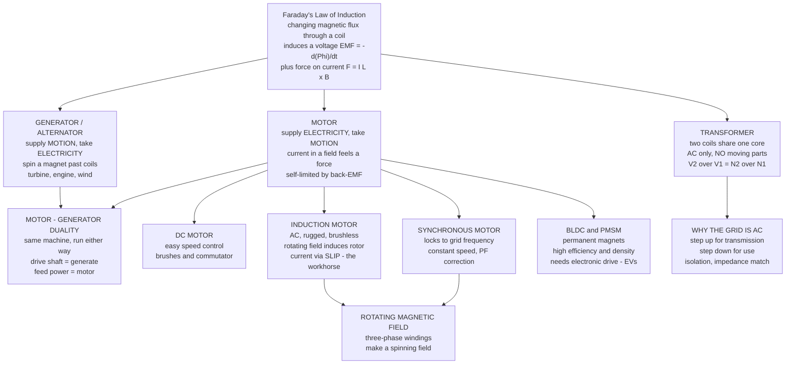

# ⚙️ Electric Machines and Transformers

> [!abstract] TL;DR
> One idea powers civilization: **move a magnet near a wire and you make electricity; push electricity through a wire near a magnet and you make motion.** That is [[Faradays_Law_and_Induction|Faraday's law of induction]] ($\mathcal{E} = -d\Phi_B/dt$) plus the force on a current in a field ($\vec{F} = I\vec{L}\times\vec{B}$), run in both directions. A **generator** spins a magnet to make the electricity in your walls; a **motor** reverses it, turning that electricity back into the spin of a fan, a pump, an EV's wheels; a **transformer** uses the same magnetic dance — two coils sharing a core — to change voltage with **no moving parts**, which is the entire reason the grid is AC. Nearly all the world's electricity is *made by* these machines, and roughly *half of it is consumed by* motors.

## Intuition — analogy FIRST

Picture a swimmer and a paddle-wheel in a river. Turn the paddle-wheel by hand and it stirs the water into motion; let the flowing water push the paddle-wheel and it turns on its own. It is the **same coupling** between wheel and water, read in two directions — one converts effort into flow, the other flow into effort.

Electric machines are exactly this, but the coupling medium is a **magnetic field** instead of water. Faraday discovered in 1831 that a *changing* magnetic flux through a coil pushes a voltage around it. That single fact, read forward and backward, gives you every machine that matters:

- **Generator** — spin a magnet past coils; the flux through them changes; a voltage appears. *Mechanical motion → electricity.* This is how turbines (steam, hydro, wind) make almost all grid power.
- **Motor** — feed current into coils sitting in a magnetic field; the field pushes on that current ($\vec{F}=I\vec{L}\times\vec{B}$) and the rotor turns. *Electricity → mechanical motion.* The motor even generates its own opposing voltage as it spins — **back-EMF** — which is Faraday's law biting back and quietly setting the motor's speed.
- **Transformer** — put two coils on one iron core and drive the first with AC. Its changing flux threads the second coil and induces a voltage there, scaled by the **turns ratio**. No rotor, no motion — just the magnetic dance changing voltage up or down at ~99% efficiency.

The profound part: a motor and a generator are *the same machine*. Drive the shaft and it generates; feed it power and it motors. The **motor/generator duality** is not an analogy — it is one device obeying one law.

---

## How It Works

Every device below is a way of arranging **coils, a magnetic field, and (sometimes) motion** so that Faraday's law does useful work. The branch you land on depends on *what you supply and what you take out*.



**The unifying chain.** (1) A time-varying flux $\Phi_B$ through a coil of $N$ turns induces $\mathcal{E} = -N\,d\Phi_B/dt$. (2) A current $I$ in a field $\vec{B}$ feels a force $\vec{F} = I\vec{L}\times\vec{B}$, hence a **torque** on a rotor. (3) In rotating machines these two act *together*: the machine produces torque *and* the moving conductors generate a **back-EMF** that opposes the applied voltage (Lenz's law), so a motor self-regulates — as it speeds up, back-EMF rises, current falls, torque falls, until torque exactly balances the load. (4) In a transformer there is *no motion*: the AC primary makes the flux change, and mutual inductance carries that change to the secondary, scaled by turns.

---

## Key Concepts / Details

### Secondary Level

- **The one law, both directions.** Motion + magnet + coil → electricity (**generator**). Electricity + coil + magnet → motion (**motor**). Same physics, opposite bookkeeping.
- **Transformer = voltage changer with no moving parts.** Two coils on an iron ring. More turns on the output side → higher voltage; fewer turns → lower voltage. It only works on **AC**, because the flux must *keep changing*. A DC transformer is impossible.
- **Turns ratio.** If the output coil has twice the turns of the input coil, the output voltage is (about) doubled — but the output current is *halved*, because energy is conserved: $V_1 I_1 \approx V_2 I_2$. You never get power for free.
- **Why the grid is AC.** Power lost in wires is $I^2R$. Transformers let us **step voltage up** for long-distance transmission (huge voltage, tiny current, tiny loss) and **step it down** again for safe household use. Only AC transforms this easily — that is the whole reason your wall socket is AC.
- **Motors are everywhere.** Fans, fridges, washing machines, drills, pumps, elevators, EVs. Roughly **half of all electricity** turns a motor shaft.

### Undergraduate Level

- **Ideal transformer relations.** For $N_1$ primary and $N_2$ secondary turns sharing a common flux:
$$\frac{V_2}{V_1} = \frac{N_2}{N_1} \equiv a, \qquad \frac{I_2}{I_1} = \frac{N_1}{N_2} = \frac{1}{a}, \qquad V_1 I_1 \approx V_2 I_2.$$
A transformer also transforms **impedance**: a secondary load $Z_L$ looks like $Z_{\text{in}} = (N_1/N_2)^2 Z_L$ seen from the primary — the basis of **impedance matching**.
- **Transformer losses.** Real efficiency is ~97–99%. Losses are (i) **copper / $I^2R$** loss in the windings (load-dependent) and (ii) **core / iron** loss — **hysteresis** (energy to re-magnetize the core each cycle) and **eddy currents** (circulating currents in the core, suppressed by using thin *laminations* and silicon steel). Core loss is roughly constant with load.
- **Generators / alternators.** Convert mechanical power (steam/gas/hydro/wind turbine) to electrical. **Synchronous machines** dominate grid generation: a DC-excited (or PM) rotor spun at synchronous speed produces a three-phase EMF whose frequency is locked to shaft speed, $f = pn/120$ (poles $p$, rpm $n$).
- **The three-phase rotating magnetic field.** Feed three windings spaced $120°$ apart with three currents $120°$ apart in time, and their combined field is a **constant-magnitude vector that rotates** at synchronous speed $n_s = 120f/p$ rpm. This spinning field, discovered by **Tesla**, is the heart of AC motors — no commutator needed.
- **Induction motor (the workhorse).** The stator's rotating field sweeps past the rotor bars, *inducing* rotor currents (Faraday again), which feel a force and drag the rotor along. The rotor must lag the field — it runs at **slip** $s = (n_s - n)/n_s$ (typically 2–5%). At exactly synchronous speed the flux would be constant, no rotor current, no torque — so slip is *essential*. Rugged, cheap, brushless.
- **DC motor.** Field + armature; a **commutator** mechanically flips the armature current each half-turn to keep torque unidirectional. Speed is nearly proportional to applied voltage, torque to current — dead-simple control, at the cost of wearing **brushes**.
- **Back-EMF sets the speed.** A spinning motor is also a generator: it produces $E_b = K\phi\omega$ opposing the supply. Armature current is $I = (V - E_b)/R_a$. At standstill $E_b=0$ so **starting current is huge**; as speed rises, $E_b$ rises and current falls until torque meets the load.
- **Torque–speed characteristic.** The operating point is where the **motor's torque curve crosses the load's torque curve**. Starting torque (at zero speed / $s=1$), breakdown (peak) torque, and the steep near-synchronous region all live on this curve.

### Graduate Level

- **Per-phase equivalent circuit (induction motor).** Referring rotor to stator, the developed torque is
$$T = \frac{3\,V_{\text{th}}^2\,(R_2/s)}{\omega_s\left[(R_{\text{th}} + R_2/s)^2 + (X_{\text{th}} + X_2)^2\right]},$$
where $\omega_s = 2\pi n_s/60$ is synchronous mechanical speed. **Breakdown slip** occurs at $s_{\max} = R_2/\sqrt{R_{\text{th}}^2 + (X_{\text{th}}+X_2)^2}$; increasing rotor resistance $R_2$ (wound-rotor / slip-ring machines) moves peak torque toward standstill — high starting torque.
- **Synchronous machine power angle.** For a round-rotor synchronous machine, developed power is $P = \dfrac{3 V E_f}{X_s}\sin\delta$, where $\delta$ is the **load angle** between terminal voltage and internal EMF. Overexcitation makes it *supply* reactive power — a **synchronous condenser** for power-factor correction. Salient-pole machines add a reluctance term $\propto \sin 2\delta$.
- **PMSM / BLDC.** Permanent-magnet rotor; the drive electronically commutates stator currents in sync with rotor position (Hall sensors or sensorless estimation). **Field-oriented control (FOC)** transforms three-phase currents into a rotor-aligned $d$–$q$ frame so torque and flux are controlled independently, like a DC motor — high efficiency and power density, hence EVs, drones, robotics. Requires a **power-electronic inverter**.
- **Loss taxonomy and thermal rating.** Total loss = **copper** ($I^2R$, both windings) + **iron** (hysteresis $\propto f B^n$, eddy $\propto f^2 B^2 t^2$) + **mechanical** (friction + windage) + **stray load**. A machine's nameplate rating is a **thermal limit** — the continuous power at which winding temperature stays within insulation class; overload is allowed only briefly.
- **Steinmetz / phasor per-phase analysis.** AC machine steady state is solved with the [[AC_Circuit_Analysis_and_Phasors|phasor / complex-impedance]] method: magnetizing reactance, leakage reactance, and slip-dependent rotor resistance combine into one per-phase circuit whose complex power $S = P + jQ$ gives torque and power factor.
- **Duality made formal.** The same electromechanical energy-conversion equations ($T = \partial W_{\text{co-energy}}/\partial\theta$) describe both directions; sign of power flow, not structure, distinguishes motoring from generating (a spinning EV motor becomes a generator during **regenerative braking**).

---

## Python Demo

```python
# Electric machines: (a) IDEAL TRANSFORMER scaling laws, and
# (b) INDUCTION MOTOR torque-speed curve with a load line + operating point.
# Shows Faraday's law running "sideways" (transformer) and "in a circle" (motor).
# numpy + matplotlib only.
import numpy as np
import matplotlib.pyplot as plt

# ============================================================
# (a) IDEAL TRANSFORMER:  V2/V1 = N2/N1 = a ,  I2/I1 = 1/a ,  power conserved
# ============================================================
V1   = 230.0            # primary voltage (V, rms)
I1   = 10.0             # primary current (A, rms)
Pin  = V1 * I1          # apparent input power (VA)  -> conserved in ideal case
a    = np.linspace(0.1, 5.0, 400)   # turns ratio N2/N1 (step-down < 1, step-up > 1)

V2 = a * V1             # secondary voltage rises with ratio
I2 = I1 / a            # secondary current falls inversely -> power conserved
Pout = V2 * I2          # == Pin exactly for the ideal transformer

# One changing-flux cycle -> the induced EMF is a sinusoid (Faraday: e = -N dPhi/dt)
t     = np.linspace(0, 2, 500)                 # two periods (in units of period T)
flux  = np.cos(2 * np.pi * t)                  # core flux Phi(t) ~ cos
emf   = 2 * np.pi * np.sin(2 * np.pi * t)      # induced EMF ~ -dPhi/dt ~ +sin (90 deg lead)

# ============================================================
# (b) INDUCTION MOTOR torque-speed:  T(s) from the per-phase equivalent circuit
#     T = 3 Vth^2 (R2/s) / [ ws * ((Rth + R2/s)^2 + (Xth + X2)^2) ]
# ============================================================
f_line = 50.0           # supply frequency (Hz)
poles  = 4              # 4-pole machine
n_s    = 120 * f_line / poles          # synchronous speed = 1500 rpm
w_s    = 2 * np.pi * n_s / 60.0        # synchronous speed (mechanical rad/s)

Vth, Rth, Xth = 220.0, 0.30, 0.50      # Thevenin-equivalent stator (V, ohm, ohm)
R2,  X2       = 0.25, 0.55             # rotor referred to stator (ohm)

s = np.linspace(1e-3, 1.0, 600)        # slip: 1 = standstill (start), ->0 = near sync
n = n_s * (1 - s)                      # rotor mechanical speed (rpm)
T_motor = (3 * Vth**2 * (R2 / s)) / (w_s * ((Rth + R2 / s)**2 + (Xth + X2)**2))

# A fan/pump LOAD torque grows with speed^2; operating point = where curves cross
T_rated_load = T_motor.max() * 0.55
T_load = T_rated_load * (n / n_s)**2

# Find the stable operating point (low-slip branch): last sign change of (T_motor - T_load)
diff = T_motor - T_load
cross = np.where(np.diff(np.sign(diff)) != 0)[0]
op = cross[-1]                          # near-synchronous crossing = stable point
n_op, T_op, s_op = n[op], T_motor[op], s[op]
eff_est = (1 - s_op) * 100              # rotor-circuit efficiency ceiling ~ (1 - slip)
print(f"Sync speed n_s = {n_s:.0f} rpm,  w_s = {w_s:.1f} rad/s")
print(f"Starting torque (s=1): {T_motor[0]:.1f} N.m")
print(f"Breakdown torque:      {T_motor.max():.1f} N.m at slip {s[T_motor.argmax()]:.2f}")
print(f"Operating point:  {n_op:.0f} rpm,  T = {T_op:.1f} N.m,  slip = {s_op:.3f},"
      f"  rotor eff <= {eff_est:.1f}%")

# =========================== PLOTS ===========================
fig, ax = plt.subplots(2, 2, figsize=(14, 9))

# (1) Transformer voltage & current vs turns ratio
axt = ax[0, 0]
axt.plot(a, V2, 'C0', lw=2, label="secondary V2 = a*V1")
axt.axhline(V1, color='C0', ls=':', lw=1, label="primary V1")
axt.set_xlabel("turns ratio  a = N2 / N1"); axt.set_ylabel("voltage [V]", color='C0')
axt.tick_params(axis='y', labelcolor='C0')
axt.axvline(1.0, color='gray', ls='--', lw=1)
axt.text(1.02, V2.max()*0.9, "step-down | step-up", color='gray')
axi = axt.twinx()
axi.plot(a, I2, 'C3', lw=2, label="secondary I2 = I1 / a")
axi.set_ylabel("current [A]", color='C3'); axi.tick_params(axis='y', labelcolor='C3')
axt.set_title("Ideal Transformer: turns ratio sets voltage,\ncurrent scales inversely (power conserved)")
axt.legend(loc="upper left"); axt.grid(alpha=0.3)

# (2) Power in vs out -> conservation (the 'no free lunch' check)
axp = ax[0, 1]
axp.plot(a, Pout, 'C2', lw=2, label="V2 * I2  (output)")
axp.axhline(Pin, color='k', ls='--', lw=1.5, label=f"V1 * I1 = {Pin:.0f} VA (input)")
axp.set(title="Power Conservation: V1*I1 = V2*I2\n(ideal ~ real is 97-99% efficient)",
        xlabel="turns ratio  a", ylabel="power [VA]")
axp.set_ylim(0, Pin * 1.6); axp.legend(); axp.grid(alpha=0.3)

# (3) Induced EMF as a sinusoid (Faraday: EMF leads flux by 90 deg)
axe = ax[1, 0]
axe.plot(t, flux, 'C0', lw=2, label="core flux  Phi(t)")
axe.plot(t, emf / (2*np.pi), 'C3', lw=2, label="induced EMF ~ -dPhi/dt (scaled)")
axe.axhline(0, color='k', lw=0.5)
axe.set(title="Faraday's Law: changing flux induces a sinusoidal EMF\n(EMF leads flux by 90 degrees)",
        xlabel="time [periods]", ylabel="normalized amplitude")
axe.legend(); axe.grid(alpha=0.3)

# (4) Induction motor torque-speed curve + load line + operating point
axm = ax[1, 1]
axm.plot(n, T_motor, 'C0', lw=2.5, label="motor torque  T(n)")
axm.plot(n, T_load,  'C1', lw=2, ls='--', label="load torque (fan ~ n^2)")
axm.plot(n[0], T_motor[0], 'ks', ms=8, label=f"starting torque = {T_motor[0]:.0f} N.m")
axm.plot(n[T_motor.argmax()], T_motor.max(), 'C0^', ms=9, label="breakdown torque")
axm.plot(n_op, T_op, 'r*', ms=16, label=f"operating pt: {n_op:.0f} rpm, slip={s_op:.2f}")
axm.axvline(n_s, color='gray', ls=':', lw=1)
axm.text(n_s*0.86, T_motor.max()*0.15, "sync\nspeed", color='gray')
axm.set(title="Induction Motor Torque-Speed\n(operating point = motor torque meets load)",
        xlabel="speed [rpm]", ylabel="torque [N.m]")
axm.legend(fontsize=8); axm.grid(alpha=0.3)

plt.tight_layout()
plt.savefig("electric_machines.png", dpi=110)
print("Saved electric_machines.png")
```

**What it shows.** Panels 1–2 are the transformer: raising the turns ratio $a=N_2/N_1$ lifts the secondary voltage *linearly* while dragging the current down *inversely*, so the product $V_2 I_2$ pins exactly to $V_1 I_1$ — you trade volts for amps, never getting extra power (real units lose only the 1–3% core + copper loss). Panel 3 draws Faraday's law itself: a cosine flux induces a sine EMF leading it by $90°$ — the primary signal that a transformer or generator delivers. Panel 4 is the induction motor's signature **torque–speed curve**: large **starting torque** at standstill, a **breakdown (peak)** torque partway up, and the steep near-synchronous region where the motor lives; the red star marks the **operating point** where the motor curve crosses the fan's load curve, at a small **slip** — and the rotor's efficiency ceiling is roughly $(1-\text{slip})$.

---

## Real-World Applications

- **Electric power generation (~all of it).** Coal, gas, nuclear, and hydro plants spin **synchronous generators**; combined they produce the overwhelming majority of grid electricity. Wind turbines use doubly-fed induction or PM synchronous generators.
- **The transmission grid.** **Step-up transformers** at the plant raise generation to hundreds of kV for low-loss transmission; **step-down transformers** at substations and on poles bring it back to safe utilization voltage. This transformer chain is *why the grid is AC*.
- **Industrial motion (~half of all electricity).** **Induction motors** drive pumps, fans, compressors, conveyors, mixers, and mills — cheap, rugged, brushless. Variable-frequency drives now vary their speed for large energy savings.
- **Electric vehicles.** Traction uses **PMSM / BLDC** (and sometimes induction — early Tesla Model S) motors for high efficiency and power density, with regenerative braking turning the motor into a generator. Central to transport **decarbonization**.
- **Consumer & precision.** BLDC in drones, disk drives, and appliances; **steppers** and **servos** in 3D printers, CNC, and robotics for precise position control (motors as **actuators**, see [[Actuators_Sensors_and_Embedded_Robotics]]).
- **Power-factor correction.** Overexcited **synchronous condensers** and large synchronous motors supply reactive power to stabilize grid voltage.

---

## Common Pitfalls

- **"Transformers boost power."** No — a transformer trades **voltage for current** at (near) constant power. Step voltage up ×10 and current drops ×10; $V_1 I_1 \approx V_2 I_2$. The gain is *lower transmission loss*, not more energy.
- **Trying to transform DC.** Transformers need a *changing* flux. Apply DC and you get a brief spike then nothing — plus a huge magnetizing current that can burn the winding. This is the deep reason grids run on AC.
- **Confusing hysteresis with eddy-current loss.** Both are **iron/core** losses. **Hysteresis** is the energy to re-flip magnetic domains each cycle (fix: soft magnetic material, see [[Magnetic_Materials_and_Magnetic_Domains]]). **Eddy currents** are induced circulating currents in the core (fix: thin **laminations** + silicon steel). Different causes, different cures.
- **Ignoring huge starting current.** At standstill a motor has **zero back-EMF**, so armature/stator current is limited only by tiny winding resistance — many times rated. Real drives use star-delta starters, soft-starters, or VFDs. Forgetting this trips breakers and cooks windings.
- **Thinking an induction motor can reach synchronous speed.** If the rotor ever matched the field, the flux through it would be *constant*, inducing no current and no torque. It **must** run slower — **slip** is not a defect, it is the operating principle.
- **Mislabeling motor vs generator as different machines.** They are the **same device**. Sign of power flow decides: drive the shaft → generate; feed electrical power → motor. Regenerative braking flips a running motor into a generator on the fly.
- **Forgetting back-EMF sets the speed.** A DC motor's steady speed is set by $E_b = V - I R_a$, not by "how much torque" — the load determines current/torque, back-EMF determines speed. Miss this and speed-control intuition breaks.
- **Overloading past the thermal (nameplate) rating.** A motor's rating is a **temperature limit**, not a hard power wall. Brief overload is fine; sustained overload melts insulation. Rating ≠ instantaneous capability.
- **Assuming brushed simplicity is free.** DC motors give easy control but **brushes/commutators** wear, spark, and need maintenance — the reason induction and BLDC dominate where reliability matters.
- **Neglecting that PM machines need electronics.** BLDC/PMSM cannot run straight off DC or the grid; they require an **inverter** with rotor-position feedback (FOC). The motor and its **power-electronic drive** are one system.

---

## Related Concepts

- [[Faradays_Law_and_Induction]] — the single law ($\mathcal{E}=-d\Phi_B/dt$) underneath *every* machine here; generator, motor back-EMF, and transformer are its three faces.
- [[Magnetism_and_Biot_Savart]] — where the magnetic field $\vec{B}$ that carries the torque and the force $\vec{F}=I\vec{L}\times\vec{B}$ come from.
- [[AC_Circuit_Analysis_and_Phasors]] — the per-phase phasor / complex-impedance method used to solve transformer and AC-machine equivalent circuits and compute power factor.
- [[Rotational_Dynamics]] — torque, angular acceleration, and moment of inertia govern the mechanical side: $T_{\text{motor}} - T_{\text{load}} = J\,d\omega/dt$ sets how a machine speeds up to its operating point.
- [[Actuators_Sensors_and_Embedded_Robotics]] — motors *as actuators*: BLDC/PMSM, steppers, and servos are the muscles of robots, driven by exactly these principles.
- [[Magnetic_Materials_and_Magnetic_Domains]] — the soft magnetic cores (silicon steel, ferrites) and permanent magnets that make transformers and PM machines possible; domain re-magnetization *is* hysteresis loss.

*(Siblings developed in this Power & Energy Systems section — Power Systems and the Grid, Power Electronics and Converters, Motor Drives and Control, Renewable Energy Integration, and Maxwell's Equations for Engineers — extend the story from a single machine to the whole electrified grid and the power-electronic drives that command modern motors.)*

---

## Review Questions

1. **(Secondary)** A transformer has 100 turns on the primary and 400 on the secondary, with 230 V AC applied to the primary. What is the secondary voltage? If the secondary delivers 2 A to a load, roughly what current flows in the primary, and why can't this device also work on a DC battery?
2. **(Undergraduate)** Explain, using **back-EMF**, why a DC motor draws a very large current the instant it is switched on but far less once it is up to speed. Then explain why an **induction motor** can never quite reach synchronous speed — what would happen to the rotor torque if it did?
3. **(Graduate)** Using the per-phase torque expression $T = \dfrac{3V_{\text{th}}^2(R_2/s)}{\omega_s[(R_{\text{th}}+R_2/s)^2+(X_{\text{th}}+X_2)^2]}$, show where the **breakdown (maximum) torque** occurs in terms of slip, and explain how a **wound-rotor** machine uses added rotor resistance $R_2$ to move high torque toward standstill for starting. Contrast this control approach with how a modern **PMSM drive** achieves torque control via field-oriented control.

---

## Sources

- Fitzgerald, A. E., Kingsley, C. & Umans, S. — *Electric Machinery* (McGraw-Hill), the graduate standard on electromechanical energy conversion. [McGraw-Hill](https://www.mheducation.com/highered/product/electric-machinery-fitzgerald-umans/M9780073380469.html)
- Chapman, S. J. — *Electric Machinery Fundamentals* (McGraw-Hill), the classic undergraduate text. [McGraw-Hill](https://www.mheducation.com/highered/product/electric-machinery-fundamentals-chapman/M9780073529547.html)
- Hughes, A. & Drury, B. — *Electric Motors and Drives: Fundamentals, Types and Applications* (Newnes/Elsevier). [Elsevier](https://www.elsevier.com/books/electric-motors-and-drives/hughes/978-0-08-102615-1)
- Sen, P. C. — *Principles of Electric Machines and Power Electronics* (Wiley). [Wiley](https://www.wiley.com/en-us/Principles+of+Electric+Machines+and+Power+Electronics%2C+3rd+Edition-p-9781118078877)
- MIT OpenCourseWare 6.061 — *Introduction to Electric Power Systems* (machines, transformers, and the grid). [MIT OCW](https://ocw.mit.edu/courses/6-061-introduction-to-electric-power-systems-spring-2011/)

---

#electrical-engineering #electric-motors #transformers #generators #electromagnetism
