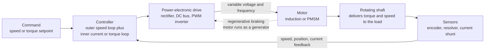

# ⚙️ Motor Drives and Control

> [!abstract] TL;DR
> A bare motor wired straight to the line (**direct-on-line**) spins at essentially **one fixed speed** and slams to a start. A **motor drive** inserts **power electronics plus control** between the source and the motor so it can be fed **variable voltage, frequency, and current** — buying controllable **speed, torque, position, acceleration, and direction**. The workhorse AC drive is the **Variable-Frequency Drive (VFD)**: rectify the line to a **DC bus**, then an **inverter** synthesizes variable-frequency, variable-voltage AC by **PWM** — and because an AC motor's synchronous speed is proportional to frequency, controlling frequency controls speed. Control ranges from simple **scalar V/f** (keep the voltage-to-frequency ratio constant to hold flux — good for pumps and fans) up to **field-oriented / vector control (FOC)**, which transforms the three-phase currents into a rotating **dq** frame to command **torque and flux independently and instantly**, like a DC motor — the enabler of high-performance **servos, EVs, and robots**. The payoff is enormous: motors consume roughly **half of all electricity**, and for pump/fan loads the **affinity laws** ($P \propto \text{speed}^3$) mean slowing a motor with a VFD instead of throttling saves a huge fraction of that energy.

## Intuition — analogy FIRST

A bare motor plugged into the wall is like a **car with only one gear and no accelerator**: it spins at one fixed speed and lurches to a start whether you want it to or not. You can turn it on and off, but you cannot *drive* it.

A **motor drive** is the accelerator, the transmission, and the brain combined. It is power electronics that feed the motor **exactly the voltage and frequency it needs** to spin at *any* speed — smoothly, efficiently, and with precise torque. Press "go a little," and the drive gently ramps the frequency up; ask for a hill of torque, and it pushes more current; ask it to stop *here, level with the floor,* and it holds position to the millimeter.

This is why your **EV glides from 0 to highway speed silently** (no gearbox, no clutch — the drive continuously reshapes the power), why an **elevator stops flush with the floor**, and why a **factory robot moves with millimeter precision**. In every one of these, the *motor* is just the muscle — the **drive is what makes electric motion controllable.** The rest of this note is how that box between the wall and the motor actually works.

---

## How It Works

You cannot change a motor's physics, but you can wrap **power electronics and a controller** around it. The controller takes a **command** (a desired speed or torque), compares it to what the shaft is actually doing, and tells an **inverter** what waveform to make. The inverter — the heart of the drive — takes DC and chops it with fast switches into three-phase AC of **whatever voltage and frequency the controller asked for**. That variable AC drives the motor; sensors report back the real speed, position, and current; and the loop closes. The identical *measure-compare-correct* discipline of any feedback controller (the sibling note **Feedback and Control Systems**) now governs a spinning machine.



Two ideas make the whole thing tick. First, **speed follows frequency**: an AC motor's synchronous speed is $N_s = 120 f / p$ (rpm), so if the inverter can make *any* frequency, it can command *any* speed. Second, **torque follows current**: at constant magnetic flux, torque is proportional to current, so a fast **inner current loop** gives you a fast, precise handle on torque — and an **outer speed (or position) loop** wraps around it to hit the commanded motion.

---

## Key Concepts / Details

### Secondary Level — Why a Drive, and What a VFD Is

- **Direct-on-line vs a drive.** Bolt a motor straight to the mains and it draws a huge inrush current, jerks to a start, and runs at one fixed speed set by the line frequency. A **drive** feeds it a *tailored* waveform instead — soft start, any speed, controlled torque, and either direction.
- **The Variable-Frequency Drive (VFD).** The standard AC drive works in three stages: (1) a **rectifier** turns incoming AC into DC; (2) a **DC bus** capacitor holds a steady DC voltage; (3) an **inverter** of fast switches (IGBTs or power MOSFETs — see **MOSFETs and CMOS**) chops that DC back into three-phase AC of *adjustable* frequency and voltage using **PWM (pulse-width modulation)**.
- **Slow it down to save energy.** For a fan or pump, running the motor slower cuts power dramatically. A VFD that matches motor speed to actual demand — rather than running flat-out and throttling with a valve — is one of the biggest energy-saving levers in industry, because motors use about **half of all electricity generated.**

### Undergraduate Level — V/f Control, Vector Control, and the Control Loops

- **Scalar V/f control.** Keep the **voltage-to-frequency ratio constant** so the motor's magnetic **flux stays constant** as you sweep frequency. Simple, cheap, and sensorless — the workhorse for **pumps, fans, and conveyors** where you only need a speed knob, not razor-sharp dynamics. At very low frequency the stator resistance eats a bigger share of the voltage, so a small **voltage boost** props up low-speed torque.
- **Field-oriented / vector control (FOC).** The three-phase currents are run through the **Clarke and Park transforms** into a rotating **dq reference frame** locked to the rotor flux. In that frame the machine looks like a **DC motor**: the **d-axis current sets the flux** and the **q-axis current sets the torque**, and the two are **decoupled** — so you can command torque *instantly and independently* of flux. This is what makes **servo drives, EV traction, and robot joints** fast and precise. **Direct torque control (DTC)** reaches a similar decoupling by switching the inverter to drive stator flux and torque directly, with a very fast torque response and no explicit PWM modulator.
- **Sensored vs sensorless.** High-performance FOC wants rotor **position**: an **encoder** or **resolver** on the shaft gives it directly. **Sensorless** drives instead *estimate* position and speed from measured currents and voltages (back-EMF observers, high-frequency injection at standstill) — cheaper and more rugged, but weaker at zero speed.
- **Nested control loops.** The architecture is a hierarchy: a **fast inner current (torque) loop** at the bottom, an **outer speed loop** around it, and — for servos — an outermost **position loop**. Each loop is usually a **PID**-style regulator; the inner loop must be much faster than the outer for stability. This is exactly the cascade taught in **PID Control** and **Feedback Control Fundamentals**, now applied to a machine.

### Graduate Level — Machine Models, Modulation, and Regeneration

- **The dq machine model.** In rotor-flux coordinates the induction and PMSM equations reduce to coupled first-order dynamics in $i_d, i_q$ with a **cross-coupling** term ($\omega L i$) that FOC **feed-forward decouples**; torque is $T = \tfrac{3}{2} \tfrac{p}{2}\,\lambda\, i_q$ for a surface-PMSM. This is the same **rigid-body torque-to-motion** chain seen in **Robot Dynamics and Equations of Motion** and **Rotational Dynamics** — the drive is the actuator that closes it.
- **Modulation strategy.** **Sinusoidal PWM** is simple; **space-vector PWM (SVPWM)** uses the inverter's DC bus ~15% better and gives lower harmonic distortion. Switching frequency trades **loss vs waveform quality vs acoustic noise**.
- **Field weakening.** Above rated speed the back-EMF hits the DC-bus ceiling; injecting **negative d-axis current** weakens the flux to keep climbing speed at **constant power** — this is what lets an EV keep accelerating past its base speed.
- **Regenerative braking.** Reverse the power flow and the motor becomes a **generator**: kinetic energy pumps current back into the DC bus. In an EV or elevator that energy **recharges the battery**; in a grid-tied drive an **active front end** returns it to the line (otherwise a **braking resistor** burns it off). This is where the drive touches the wider grid — the province of the sibling notes **Power Electronics and Converters**, **Renewable Energy Integration**, and **Power Systems and the Grid**.

---

## Python Demo

Two things every drive engineer must feel in their bones: **(a)** changing the inverter's output frequency shifts the whole torque-speed curve (V/f control), and **(b)** for pump/fan loads the **affinity laws** make variable-speed drives crush throttling on energy. This script plots both.

```python
# Motor drives: (a) V/f control shifts the torque-speed curve with frequency;
# (b) affinity-law energy savings of a VFD vs throttling a pump/fan.
import numpy as np
import matplotlib.pyplot as plt

# --- (a) V/f (scalar) control of an induction motor -----------------------
# Simplified per-phase equivalent-circuit parameters at base frequency.
R1, R2   = 0.5, 0.4        # stator / rotor resistance [ohm]
X1b, X2b = 1.2, 1.2        # leakage reactances at base frequency [ohm]
Vb, fb   = 230.0, 50.0     # base phase voltage [V], base frequency [Hz]
poles    = 4

def torque_speed(f):
    """Torque vs rotor speed at supply frequency f, holding V/f constant."""
    a  = f / fb                        # frequency ratio
    V  = Vb * a                        # scale voltage with freq -> constant flux
    X1, X2 = X1b * a, X2b * a          # reactances scale with frequency
    Ns = 120.0 * f / poles             # synchronous speed [rpm]
    ws = 2 * np.pi * Ns / 60.0         # synchronous speed [rad/s]
    s  = np.linspace(0.001, 1.0, 500)  # slip from ~0 to 1
    T  = (3 * V**2 * (R2 / s)) / (ws * ((R1 + R2 / s)**2 + (X1 + X2)**2))
    N  = Ns * (1 - s)                  # rotor speed [rpm]
    return N, T

fig, (ax1, ax2) = plt.subplots(1, 2, figsize=(13, 5.2))

for f in [50, 40, 30, 20]:
    N, T = torque_speed(f)
    ax1.plot(N, T, lw=2, label=f"{f} Hz")

ax1.axhline(80, color="k", ls="--", lw=1.2, label="load torque")   # constant load
ax1.set_xlabel("Rotor speed [rpm]")
ax1.set_ylabel("Torque [N-m]")
ax1.set_title("(a) V/f control: torque-speed curve shifts with inverter frequency")
ax1.set_xlim(0, 1550); ax1.set_ylim(0, 190)
ax1.grid(alpha=0.3); ax1.legend()

# --- (b) Affinity laws: throttling vs a variable-speed drive ---------------
q = np.linspace(0.0, 1.0, 200)        # flow as a fraction of rated
P_throttle = 0.32 + 0.68 * q          # fixed speed + valve/damper: power stays high
P_vfd      = q**3                     # VFD slows the motor: cubic affinity law

ax2.plot(q*100, P_throttle*100, color="crimson",  lw=2, label="Throttle (fixed speed + valve)")
ax2.plot(q*100, P_vfd*100,      color="seagreen", lw=2, label="VFD (variable speed, q^3)")
ax2.fill_between(q*100, P_vfd*100, P_throttle*100, color="gold", alpha=0.35,
                 label="Energy saved by VFD")

qop = 0.60                            # annotate a typical 60% flow operating point
ax2.plot([qop*100, qop*100], [qop**3*100, (0.32+0.68*qop)*100], color="gray", ls=":")
save = (0.32 + 0.68*qop) - qop**3
ax2.annotate(f"at 60% flow:\nthrottle {100*(0.32+0.68*qop):.0f}% power\n"
             f"VFD {100*qop**3:.0f}% power\n-> save {100*save:.0f}%",
             xy=(qop*100, qop**3*100), xytext=(12, 62),
             arrowprops=dict(arrowstyle="->"), fontsize=9)
ax2.set_xlabel("Flow [% of rated]")
ax2.set_ylabel("Input power [% of rated]")
ax2.set_title("(b) Affinity laws: VFD vs throttling energy for a pump/fan")
ax2.grid(alpha=0.3); ax2.legend(loc="upper left")

plt.tight_layout()
plt.savefig("motor_drives_demo.png", dpi=110)
plt.show()

# --- quantify savings over a representative duty cycle ---------------------
flows = np.array([1.0, 0.9,  0.8,  0.7,  0.6,  0.5])
hours = np.array([0.05, 0.10, 0.20, 0.25, 0.25, 0.15])   # fraction of run-hours, sums to 1
E_throttle = np.sum(hours * (0.32 + 0.68 * flows))
E_vfd      = np.sum(hours * flows**3)
print(f"Duty-cycle average power -- throttle: {E_throttle*100:4.1f}%   VFD: {E_vfd*100:4.1f}%")
print(f"Energy reduction with VFD: {100*(1 - E_vfd/E_throttle):4.1f}%")
```

Panel (a) shows each torque-speed curve **sliding to a lower speed as the frequency drops**, its peak torque roughly preserved because V/f (and therefore flux) is held constant — that horizontal family of curves *is* smooth speed control. Panel (b) shows the throttle curve staying stubbornly high while the VFD curve dives as $q^3$; the gold region is pure wasted energy, and the printed duty-cycle result is a **~50% energy reduction** — the single most-quoted reason VFDs exist.

---

## Real-World Applications

- **Electric-vehicle and hybrid traction.** A **traction inverter** running **FOC** on a **PMSM** (or induction motor) delivers instant torque from zero speed, **field-weakening** for highway speed, and **regenerative braking** to recharge the battery — the entire "one-pedal" driving feel is the drive, not the motor.
- **HVAC and industrial fluid handling.** **VFDs on pumps, fans, compressors, and cooling towers** ride the affinity-law curve for massive energy savings and are a headline **decarbonization** lever in buildings and process plants.
- **Robotics, CNC, and servos.** Multi-axis **servo drives** with encoders and nested position/speed/current loops move tool heads and robot joints with micron repeatability — see **Actuators, Sensors, and Embedded Robotics**.
- **Elevators, cranes, and hoists.** Precise speed and **level-stop** positioning, plus **regeneration** that recovers energy every time a loaded car descends.
- **Rail traction, appliances, and drones.** From locomotives down to **inverter-driven washing machines and refrigerators** and BLDC drone ESCs — variable-speed drives quietly run modern electrified motion everywhere.

---

## Common Pitfalls

- **Confusing the motor with the drive.** The motor is the muscle; the **drive (power electronics + control)** is what supplies variable voltage/frequency/current for variable speed and torque. "Direct-on-line" is a motor with *no* drive — fixed speed, hard start.
- **Assuming V/f control gives servo performance.** Scalar V/f is fine for pumps/fans but has **no fast torque control** and sags at low speed. High-performance motion needs **vector/FOC** (with the **dq** transform) or **direct-torque control**.
- **Forgetting the affinity laws.** Sizing pump/fan savings linearly instead of by $P \propto \text{speed}^3$ badly *understates* VFD payback — the cubic law is where the money is.
- **Ignoring drive-generated harmonics and EMI.** The rectifier front end injects **line-current harmonics** and the fast PWM edges radiate **EMI**; both need filters (line reactors, dv/dt or sine filters) and proper shielding/grounding.
- **Bearing currents and cable reflections.** High-**dv/dt** PWM can induce shaft voltages that **spark through bearings** (fluting) and cause reflected-wave overvoltage on long motor cables — mitigate with insulated bearings, shaft grounding rings, and output filters.
- **Under-sizing thermals / skipping derating.** Inverter switches and the motor both heat up; low-speed operation reduces self-cooling on fan-cooled motors, and altitude/ambient force **derating**. Neglecting it trips the drive or cooks the machine.
- **Regeneration with nowhere to go.** Braking an overhauling load pumps energy back into the **DC bus**; without a **braking resistor** or **active front end** the bus overvolts and faults.

---

## Related Concepts

- [[PID_Control]] — the proportional-integral-derivative regulator used inside a drive's current, speed, and position loops.
- [[Feedback_Control_Fundamentals]] — the measure-compare-correct closed loop that a drive's nested loops implement.
- [[Actuators_Sensors_and_Embedded_Robotics]] — servo drives as the actuators of robots, with the encoders/resolvers that close their loops.
- [[Robot_Dynamics_and_Equations_of_Motion]] — the load dynamics a drive's commanded torque must move.
- [[Rotational_Dynamics]] — torque, inertia, and angular acceleration: the physics the drive commands ($T = J\dot\omega$).
- [[MOSFETs_and_CMOS]] — the power MOSFETs/IGBTs whose fast switching builds the PWM inverter.
- [[AC_Circuit_Analysis_and_Phasors]] — three-phase voltages, currents, and the phasor view underlying V/f and dq analysis.
- [[Electrical_Engineering_Overview]] — the map placing drives at the convergence of machines, power electronics, and control.

*Sibling notes in this section (prose references, to be built): Electric Machines and Transformers, Power Electronics and Converters, Feedback and Control Systems, Renewable Energy Integration, and Power Systems and the Grid.*

---

## Review Questions

1. **(Secondary)** A ceiling fan on a wall dimmer and an industrial fan on a VFD both slow down. Why does only the VFD save a large amount of energy, and which physical law explains it?
2. **(Undergraduate)** You must drive a conveyor at variable speed with modest dynamics, and separately a robot joint needing instant, precise torque. Which control strategy (V/f vs field-oriented control) fits each, and what does FOC's **dq** transform buy you that V/f cannot?
3. **(Graduate)** An EV needs full torque from standstill *and* continued acceleration well above base speed. Explain how a traction inverter's inner current loop, field weakening, and regenerative braking each contribute — and what limits (DC-bus voltage, thermal, harmonics) constrain the design.

---

## Sources

- Ned Mohan, *Electric Machines and Drives: A First Course* — accessible V/f, VFD, and vector-control foundations.
- Ned Mohan, *Advanced Electric Drives: Analysis, Control, and Modeling using MATLAB/Simulink* — dq modeling and field-oriented control in depth.
- Krause, Wasynczuk, Sudhoff & Pekarek, *Analysis of Electric Machinery and Drive Systems* — the reference machine/drive modeling text.
- Bimal K. Bose, *Modern Power Electronics and AC Drives* — inverters, PWM, and AC drive control strategies.
- Austin Hughes & Bill Drury, *Electric Motors and Drives: Fundamentals, Types and Applications* — intuition-first coverage of drives and applications.

---

#electrical-engineering #motor-drives #vfd #field-oriented-control #variable-speed
