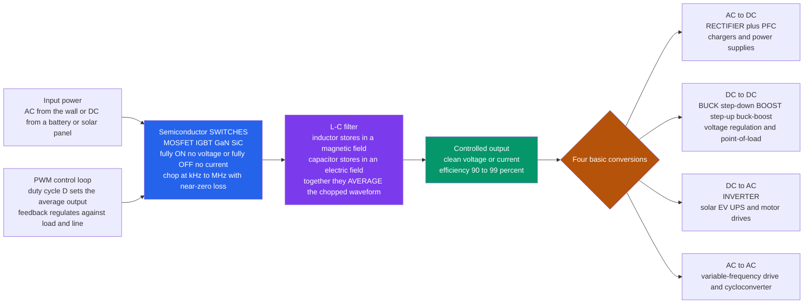

# ⚡ Power Electronics and Converters

> [!abstract] TL;DR
> **Power electronics** converts electricity from one form or level to another — AC to DC, DC to DC, DC to AC — **efficiently**, by *switching* rather than *dissipating*. The trick is deceptively simple: an ideal switch is either fully **ON** (voltage across it $\approx 0$) or fully **OFF** (current through it $\approx 0$), so in *either* state the power it burns, $P = V \cdot I$, is $\approx 0$. Chop the input on and off at **kHz–MHz**, then let an **L-C filter** average the pieces, and you reshape power at **90–99% efficiency** — versus a **linear regulator** whose efficiency is only $V_{out}/V_{in}$, wasting the rest as heat. That one idea powers **four conversions** — **AC-DC rectifiers** (every charger), **DC-DC converters** (buck/boost, on every board), **DC-AC inverters** (solar, EV, UPS, motor drives), and **AC-AC** (variable-frequency drives) — built from **MOSFETs, IGBTs, and wide-bandgap GaN/SiC**. It is the quiet linchpin of electrification: every phone, laptop, LED, EV, and renewable inverter runs on this switching magic.

## Intuition — analogy FIRST

Your laptop charger takes **120 V AC** from the wall and hands your machine a precise **20 V DC**. An old resistive "brick" would get to 20 V by *throttling* — burning the 100 V difference as heat, like slowing a car by dragging your foot instead of easing off the gas. It would be hot, heavy, and wasteful. Your modern charger is cool and tiny because it does something cleverer: it **chops** the incoming power on and off tens of thousands of times a second and averages the result.

Here is why that wins. Think of filling a bucket to exactly the half-way line using a tap you can only slam **fully open** or **fully shut** — never trickle. Slam it open for half of each second and shut for the other half, and *on average* the bucket fills at half rate. A **fully open** tap wastes nothing (no resistance), and a **fully shut** tap wastes nothing (no flow) — so you set any average level you like with almost **zero waste**. A power switch is exactly that tap: fully ON it drops no voltage, fully OFF it passes no current, so it dissipates almost no power. **Power electronics is the art of reshaping electricity by rapid switching** — chop it, filter it, and out comes a clean, precisely controlled voltage or current at 95%-plus efficiency. Every charger, EV powertrain, solar inverter, and data-center rail is built on this idea.

---

## How It Works

A converter takes **input power** (AC from the grid, or DC from a battery or solar panel), feeds it through fast **semiconductor switches** that chop it into pulses, and passes those pulses through a **reactive filter** — an **inductor** (which resists sudden current changes and stores energy in a magnetic field) and a **capacitor** (which resists sudden voltage changes and stores energy in an electric field). The filter **averages** the chopped waveform into a smooth output. A **control loop** watches the output, compares it to the target, and adjusts the switches' **duty cycle** $D$ — the fraction of each cycle the switch is ON — to hold the output steady against load and input changes.

The governing relation for the workhorse **buck (step-down) converter** is beautifully simple: in steady state the inductor can carry no net DC voltage, so the averaged output is

$$V_{out} = D \cdot V_{in}, \qquad 0 \le D \le 1.$$

Turn the duty cycle knob from 0 to 1 and the output rides linearly from 0 to $V_{in}$ — all while the switch stays lossless. The same principle, rearranged, gives the **boost (step-up)** converter ($V_{out} = V_{in}/(1-D)$), the **buck-boost**, the **rectifier** (AC folded into DC), and the **inverter** (DC modulated back into AC via a rapidly varied duty cycle that traces out a sine).



---

## Key Concepts / Details

### Secondary Level — Switching Beats Throttling

The single idea that makes power electronics possible: **a switch wastes almost no power**.

- **The efficiency trick.** Power dissipated in a device is $P = V \cdot I$. A switch that is **fully ON** has $V \approx 0$ across it, so $P \approx 0$. A switch that is **fully OFF** has $I \approx 0$ through it, so again $P \approx 0$. It only burns power during the brief *instant* of transition. So by keeping the switch in ON or OFF states and never lingering in between, we reshape power with tiny losses.
- **Linear vs switching.** A **linear regulator** makes a lower voltage by acting like a resistor in series, dropping the excess and turning it into heat — its efficiency is exactly $V_{out}/V_{in}$ (a 12 V-to-5 V linear regulator throws away 58% as heat). A **switching regulator** chops and filters instead, reaching 90–99% *regardless* of how big the step is.
- **The four conversions.** **AC-DC** (a *rectifier* — your phone charger, a PC power supply), **DC-DC** (a *converter* — steps voltages up or down on every circuit board), **DC-AC** (an *inverter* — turns a battery or solar panel's DC into grid-like AC), and **AC-AC** (changes AC frequency or magnitude — motor drives).
- **Why it is everywhere.** Every charger, laptop brick, LED driver, EV, and solar inverter is a power-electronics converter. It is one of the fastest-growing fields in electrical engineering because it is essential to electrification and clean energy.

### Undergraduate Level — Topologies, PWM, and Losses

- **PWM (pulse-width modulation).** A high-frequency clock defines a period $T$; the switch is held ON for a fraction $D$ of it and OFF for $1-D$. Varying $D$ sets the **average**. This is the universal control handle: for a buck, $V_{out} = D\,V_{in}$, a clean linear relationship the feedback loop exploits.
- **The buck (step-down).** Switch chops $V_{in}$; the L-C filter averages it to $V_{out} = D\,V_{in}$. The inductor current is a **triangle ripple** around the DC load current, with peak-to-peak $\Delta I_L = \dfrac{V_{out}(1-D)}{L\,f_{sw}}$ — bigger $L$ or faster switching means smaller ripple.
- **The boost (step-up).** Stores energy in the inductor while the switch is ON, then dumps it *in series* with the source when OFF, giving $V_{out} = \dfrac{V_{in}}{1-D} > V_{in}$. The **buck-boost** can go either side of $V_{in}$ (with polarity inversion).
- **Rectifiers and PFC.** A **rectifier** (diode bridge, or an active/synchronous one) folds AC into DC; a bulk capacitor smooths it. Naive rectifiers draw current in ugly spikes, so **power-factor correction (PFC)** shapes the input current to be sinusoidal and in phase — mandatory for larger AC-DC supplies.
- **Inverters.** Modulate the duty cycle of an H-bridge so the *averaged* output traces a **sinusoid** (sinusoidal PWM), then filter — turning DC into clean AC for solar export, EV motors, and UPS backup.
- **The switching devices.** A **power MOSFET** (fast, lower voltage/power, high frequency) suits chargers and point-of-load rails; an **IGBT** (rugged, high voltage/current, slower) suits motor drives and traction. Both are driven ON/OFF, not held in a linear region.
- **Two loss mechanisms.** **Conduction loss** ($I^2 R_{ds(on)}$) while the switch is ON, and **switching loss** (energy lost during each ON/OFF transition, $\propto f_{sw}$). Raising frequency shrinks the magnetics (smaller L, C) but *raises* switching loss — the central design trade-off.
- **The SMPS.** The **switched-mode power supply** packages all of this — rectifier, PFC, a switching DC-DC stage, and a control loop — into the efficient brick behind every modern device.

### Graduate Level — Wide-Bandgap, Soft-Switching, EMI, and Control

- **Wide-bandgap revolution.** **GaN** (gallium nitride) and **SiC** (silicon carbide) switch far faster and tolerate higher fields and temperatures than silicon. GaN enables tiny, high-frequency chargers (that palm-sized 100 W USB-C brick); SiC enables high-voltage, high-temperature EV traction inverters, solar strings, and grid converters. Higher frequency means dramatically **smaller inductors and capacitors** (power density) and lower loss — the modern frontier. See [[Semiconductors_Intrinsic_and_Extrinsic]] for the band-gap physics.
- **Conduction vs switching loss, quantified.** Total device loss $\approx I_{rms}^2 R_{ds(on)}$ (conduction) $+\; (E_{on}+E_{off})\,f_{sw}$ (switching) $+\; Q_g V_{drive} f_{sw}$ (gate drive). Wide-bandgap devices cut $E_{on/off}$ and $Q_g$, letting you push $f_{sw}$ up for the same efficiency.
- **Soft-switching / resonant converters.** **Hard switching** dissipates energy every transition because voltage and current overlap. **Zero-voltage switching (ZVS)** and **zero-current switching (ZCS)** use resonant L-C tanks (LLC, phase-shifted full bridge) to bring $V$ or $I$ to zero *before* the switch changes state — slashing switching loss and EMI, enabling MHz operation.
- **Conduction modes.** **CCM** (continuous conduction — inductor current never reaches zero) versus **DCM** (discontinuous — it hits zero each cycle). The transfer function and control loop differ between them, complicating wide-load-range design.
- **EMI / EMC.** Fast $dv/dt$ and $di/dt$ that make switching efficient also radiate and conduct **electromagnetic interference**. Managing it — snubbers, layout, filters, spread-spectrum, controlled slew — is a first-class design constraint tied to regulatory EMC limits.
- **Thermal management.** Even 2% loss in a kilowatt converter is 20 W in a tiny package; junction temperature, heatsinking, and thermal cycling drive reliability and lifetime.
- **The control loop.** A converter is a feedback system: sense the output, compare to reference, and modulate $D$. **Voltage-mode** and **current-mode** control, with loop **compensation** for stability and fast transient response, sit atop the same theory in [[Feedback_and_Control_Systems]] and [[Feedback_Control_Fundamentals]]. Because the plant is a switching, sampled system, small-signal averaged models (state-space averaging) are used to design the compensator.

---

## Python Demo

```python
# Power electronics, visualized two ways:
#   (a) BUCK (step-down) CONVERTER + PWM: a switch chops Vin at duty cycle D,
#       an L-C filter averages it -> Vout = D*Vin. We time-simulate the
#       switching-node voltage, the triangular inductor-current ripple, and the
#       smooth averaged output, then show the linear control law Vout vs D.
#   (b) SWITCHING vs LINEAR EFFICIENCY: a switching regulator stays ~92-96%
#       efficient no matter how big the step-down, while a LINEAR regulator's
#       efficiency is exactly Vout/Vin -- everything else becomes heat.
# Only numpy + matplotlib. The converter is integrated with plain forward Euler.
import numpy as np
import matplotlib.pyplot as plt

# ---- buck converter parameters ----------------------------------
Vin  = 12.0        # input voltage (V)
D    = 0.5         # PWM duty cycle -> expect Vout ~ D*Vin = 6 V
fsw  = 100e3       # switching frequency (Hz)
T    = 1.0 / fsw   # switching period (s)
L    = 47e-6       # filter inductor (H)
C    = 100e-6      # filter capacitor (F)
R    = 3.0         # load resistor (ohm) -> Iout ~ Vout/R ~ 2 A

# forward-Euler time grid: simulate several switching periods
n_per   = 6
steps   = 12000
t       = np.linspace(0.0, n_per * T, steps)
dt      = t[1] - t[0]

iL   = np.zeros(steps)   # inductor current
vC   = np.zeros(steps)   # output (capacitor) voltage
vsw  = np.zeros(steps)   # switching-node voltage
# start near steady state so we see clean ripple, not the startup transient
iL[0] = (D * Vin) / R
vC[0] = D * Vin

for k in range(steps - 1):
    phase = (t[k] % T) / T
    on    = phase < D                       # switch ON for fraction D of each period
    vsw[k] = Vin if on else 0.0             # ideal synchronous buck node
    diL = (vsw[k] - vC[k]) / L              # L * diL/dt = vsw - vout
    dvC = (iL[k] - vC[k] / R) / C           # C * dvout/dt = iL - iload
    iL[k + 1] = iL[k] + diL * dt
    vC[k + 1] = vC[k] + dvC * dt
vsw[-1] = Vin if ((t[-1] % T) / T < D) else 0.0

# measure steady-state output and ripple over the final period
mask       = t >= (n_per - 1) * T
Vout_meas  = vC[mask].mean()
ripple_meas = iL[mask].max() - iL[mask].min()
ripple_formula = (Vout_meas * (1 - D)) / (L * fsw)

# ---- (c) control law: Vout vs duty cycle D ----------------------
D_axis   = np.linspace(0.0, 1.0, 200)
Vout_law = D_axis * Vin

# ---- (d) efficiency: switching vs linear ------------------------
ratio = np.linspace(0.05, 1.0, 200)     # Vout / Vin
eff_linear    = ratio                    # linear regulator: efficiency = Vout/Vin
eff_switching = 0.96 - 0.04 * (1 - ratio)  # device-loss-limited, ~flat vs ratio

# ------------------------- plotting ------------------------------
fig, ax = plt.subplots(2, 2, figsize=(14, 9))

# (a) switching node vs smooth output (first few cycles)
show = t <= 4 * T
ax[0, 0].plot(t[show] * 1e6, vsw[show], color="tab:orange", lw=1.2,
              label="switching node (chopped Vin)")
ax[0, 0].plot(t[show] * 1e6, vC[show], color="tab:blue", lw=2.2,
              label="output Vout (L-C averaged)")
ax[0, 0].axhline(D * Vin, color="gray", ls="--", lw=0.9, label="D*Vin target")
ax[0, 0].set_title("(a) Buck: chop Vin, then AVERAGE with the L-C filter")
ax[0, 0].set_xlabel("time  [microseconds]")
ax[0, 0].set_ylabel("voltage  [V]")
ax[0, 0].legend(loc="center right", fontsize=8)
ax[0, 0].grid(alpha=0.3)

# (b) inductor current ripple (triangle around the DC load current)
ax[0, 1].plot(t[show] * 1e6, iL[show], color="tab:green", lw=1.8)
ax[0, 1].axhline(iL[mask].mean(), color="gray", ls="--", lw=0.9,
                 label="average = load current")
ax[0, 1].set_title("(b) Inductor current: triangular ripple, not a spike")
ax[0, 1].set_xlabel("time  [microseconds]")
ax[0, 1].set_ylabel("inductor current  [A]")
ax[0, 1].legend(loc="upper right", fontsize=8)
ax[0, 1].grid(alpha=0.3)

# (c) linear control law Vout = D*Vin
ax[1, 0].plot(D_axis, Vout_law, color="tab:purple", lw=2.2)
ax[1, 0].plot(D, Vout_meas, "ko", ms=7,
              label=f"simulated: D={D}, Vout={Vout_meas:.2f} V")
ax[1, 0].set_title("(c) PWM control law:  Vout = D * Vin  (linear)")
ax[1, 0].set_xlabel("duty cycle  D")
ax[1, 0].set_ylabel("output voltage  Vout  [V]")
ax[1, 0].legend(loc="upper left", fontsize=8)
ax[1, 0].grid(alpha=0.3)

# (d) switching vs linear efficiency
ax[1, 1].plot(ratio, eff_switching * 100, color="tab:blue", lw=2.4,
              label="switching regulator (chop + filter)")
ax[1, 1].plot(ratio, eff_linear * 100, color="tab:red", lw=2.4,
              label="linear regulator (efficiency = Vout/Vin)")
ax[1, 1].fill_between(ratio, eff_linear * 100, eff_switching * 100,
                      color="tab:red", alpha=0.12,
                      label="power wasted as heat by linear")
ax[1, 1].set_title("(d) Why switching wins: efficiency vs step-down")
ax[1, 1].set_xlabel("conversion ratio  Vout / Vin")
ax[1, 1].set_ylabel("efficiency  [percent]")
ax[1, 1].set_ylim(0, 100)
ax[1, 1].legend(loc="lower right", fontsize=8)
ax[1, 1].grid(alpha=0.3)

plt.tight_layout()
plt.savefig("power_electronics_and_converters.png", dpi=110)
print("Saved power_electronics_and_converters.png")

# ---- numeric sanity checks --------------------------------------
print(f"Target  Vout = D*Vin = {D*Vin:.2f} V")
print(f"Sim     Vout        = {Vout_meas:.2f} V")
print(f"Ripple  measured    = {ripple_meas:.3f} A")
print(f"Ripple  formula     = {ripple_formula:.3f} A  (Vout*(1-D)/(L*fsw))")
r_demo = 5.0 / 12.0
print(f"At 12V->5V: linear efficiency = {r_demo*100:.1f} percent "
      f"(wastes {(1-r_demo)*100:.1f} percent as heat)")
print(f"At 12V->5V: switching efficiency ~ {(0.96-0.04*(1-r_demo))*100:.1f} percent")
```

Running it: panel **(a)** shows the switching node as a hard 0-to-12 V square wave while the output voltage sits as a nearly flat 6 V line — the L-C filter has averaged the chop. Panel **(b)** shows the inductor current as a clean **triangle ripple** riding on the 2 A DC load current, its slope flipping sign each time the switch toggles; the measured peak-to-peak matches the formula $V_{out}(1-D)/(Lf_{sw})$. Panel **(c)** confirms the linear control law $V_{out}=D\,V_{in}$, with the simulated operating point landing right on the line. Panel **(d)** is the punchline: the linear regulator's efficiency is the diagonal $V_{out}/V_{in}$ — at a 12 V-to-5 V step it manages only ~42%, dumping the shaded region as heat — while the switching converter holds ~93–96% no matter how deep the step-down.

---

## Real-World Applications

- **Chargers and power supplies.** Every phone charger, laptop brick, and PC power supply is an **AC-DC SMPS** (rectifier + PFC + switching DC-DC). GaN has shrunk fast chargers to a fraction of old sizes.
- **Point-of-load on every board.** CPUs, GPUs, and SoCs need many tightly-regulated low voltages at high current; **multiphase buck converters** (VRMs) sit right next to the chip delivering hundreds of amps.
- **Electric vehicles.** A **traction inverter** (usually **SiC**) turns battery DC into the AC that spins the motor; on-board **DC-DC** converters feed the 12 V bus, and **chargers** convert grid AC to pack DC. Efficient conversion directly extends range.
- **Solar and wind.** **Grid-tie inverters** convert panel/turbine DC into synchronized grid AC; **MPPT** DC-DC stages track the panel's maximum-power point. Power electronics is the interface for essentially all renewable generation.
- **Grid and storage.** **HVDC** links, **STATCOMs**, and grid-scale **battery inverters** use large power converters to move and condition bulk power — a backbone of the modern grid.
- **Motor drives.** **Variable-frequency drives (VFDs)** synthesize adjustable-frequency AC to run motors at variable speed, saving enormous energy in pumps, fans, HVAC, and industry versus running fixed-speed.
- **LED lighting and appliances.** Every LED needs a **constant-current driver**; inverter air conditioners, induction cooktops, and washing machines all run on power-electronic converters.

---

## Common Pitfalls

- **Confusing linear with switching regulation.** A **linear** regulator's efficiency is *fixed* at $V_{out}/V_{in}$ — it cannot be improved, and a big step-down means big heat. A **switching** regulator sidesteps this by chopping and filtering. Reaching for an LDO to drop 24 V to 3.3 V at high current bakes the board; use a buck.
- **Ignoring the frequency trade-off.** Raising $f_{sw}$ shrinks the L and C (smaller, cheaper magnetics) but **increases switching loss** ($\propto f_{sw}$). There is an optimum; pushing frequency without faster (e.g. GaN/SiC) devices just wastes efficiency in heat.
- **Undersizing the inductor / ripple.** Too small an $L$ gives large current ripple, higher peak currents, more loss, and possible entry into DCM where the control loop behaves differently. Size $L$ for a target ripple ($\Delta I_L \approx 20\text{–}40\%$ of load).
- **Forgetting the switch is not ideal.** Real switches have finite $R_{ds(on)}$ (conduction loss) and finite transition time (switching loss). At high current, conduction dominates; at high frequency, switching dominates. Both must be budgeted.
- **Neglecting EMI.** The very fast $dv/dt$ and $di/dt$ that make switching efficient radiate and conduct interference. Poor layout, missing input filters, or long gate loops cause EMC failures and erratic behavior. Design the layout and filtering from the start.
- **Assuming the loop is automatically stable.** A converter is a feedback system; a switching converter with an under-damped L-C output can oscillate or ring under load steps without proper **loop compensation**. Design and verify the control loop, not just the power stage.
- **Overlooking thermal reality.** "97% efficient" still means real watts of loss in a small package. Junction temperature, heatsinking, and thermal cycling set reliability. A converter that works on the bench can fail in an enclosure.
- **Picking the wrong switch class.** **MOSFETs** shine at lower voltage and high frequency; **IGBTs** at high voltage/current but lower frequency; **GaN** for compact high-frequency; **SiC** for high-voltage, high-temperature. Using an IGBT where fast switching is needed, or a silicon MOSFET where a SiC device belongs, leaves efficiency and size on the table.

---

## Related Concepts

- [[MOSFETs_and_CMOS]] — the **power MOSFET** is the fast, voltage-driven switch at the heart of buck converters and high-frequency chargers; the same device physics, scaled for power.
- [[Semiconductor_Devices_and_Diodes]] — **diodes** are the rectifying element in AC-DC converters and the freewheeling path in DC-DC stages; the p-n junction is the foundation of every switch and rectifier.
- [[RC_RL_and_RLC_Transients]] — the **inductor and capacitor** transients are *exactly* the L-C filter dynamics that average the chopped waveform into a smooth output.
- [[AC_Circuit_Analysis_and_Phasors]] — the AC side of rectifiers and inverters (RMS, power factor, phase) is analyzed with the phasor tools this note develops.
- [[Feedback_and_Control_Systems]] — the converter's **regulation loop** (sense-compare-adjust the duty cycle) is a classic closed-loop control problem with stability and compensation concerns.
- [[Feedback_Control_Fundamentals]] — the general theory of the feedback loop that keeps a converter's output locked to its reference under disturbances.
- [[Semiconductors_Intrinsic_and_Extrinsic]] — doping and band-gap physics explain why **wide-bandgap GaN and SiC** switch faster and tolerate higher fields and temperatures than silicon.
- [[Semiconductors_and_Devices]] — the condensed-matter physics of carriers and junctions underlying every power switch and diode.
- [[Faradays_Law_and_Induction]] — the inductor stores energy in a magnetic field and opposes sudden current changes; Faraday's law is *why* the L-C filter and boost/flyback topologies work.
- [[Electrical_Engineering_Overview]] — where power electronics sits within the wider EE landscape.

Sibling power-and-energy notes (in prose): **Power_Systems_and_the_Grid** is the bulk generation, transmission, and distribution network that converters interface to; **Electric_Machines_and_Transformers** are the motors and magnetics that inverters and rectifiers drive and couple through; **Motor_Drives_and_Control** builds variable-speed drives directly on top of inverters and PWM; **Renewable_Energy_Integration** relies on grid-tie inverters and MPPT converters covered here; and **Semiconductor_Devices_and_Diodes** supplies the switching and rectifying devices.

---

## Review Questions

1. **(Secondary)** Explain, in terms of $P = V \cdot I$, why a switch that is either fully ON or fully OFF wastes almost no power — and why a linear regulator dropping 12 V to 5 V wastes over half its input as heat while a switching converter does not.
2. **(Undergraduate)** A buck converter has $V_{in} = 24$ V and must produce $V_{out} = 9$ V. What duty cycle $D$ is required? If $f_{sw} = 200$ kHz and $L = 33\,\mu\text{H}$, estimate the peak-to-peak inductor-current ripple. What happens to the ripple, the magnetics size, and the switching loss if you double $f_{sw}$?
3. **(Graduate)** You are designing a 6.6 kW EV on-board charger and a 400 V-to-800 V DC-DC stage. Argue when you would choose **SiC** MOSFETs over **silicon IGBTs**, how **soft-switching (ZVS)** changes the frequency-versus-loss trade-off, and how pushing switching frequency higher affects the magnetics, the EMI budget, and the thermal design. What does wide-bandgap buy you, and what new problems does it introduce?

---

## Sources

- Mohan, N., Undeland, T. & Robbins, W. — *Power Electronics: Converters, Applications, and Design* (the standard text on topologies, PWM, and applications).
- Erickson, R. & Maksimović, D. — *Fundamentals of Power Electronics* (converter analysis, averaged modeling, and control).
- Rashid, M. H. — *Power Electronics: Circuits, Devices, and Applications* (devices, rectifiers, inverters, and drives).
- Kazimierczuk, M. K. — *Pulse-Width Modulated DC-DC Power Converters* (detailed PWM converter analysis and design).
- Kassakian, J., Schlecht, M. & Verghese, G. — *Principles of Power Electronics* (rigorous circuit and control foundations).

---

#electrical-engineering #power-electronics #dc-dc-converter #inverter #pwm
