# ⚡ Power Systems and the Grid

> [!abstract] TL;DR
> The electric grid is the **largest machine ever built** — a continent-spanning network that must **generate exactly as much power as everyone is consuming, at every single instant**, because electricity cannot be stored cheaply at scale. The shared **AC frequency (60 Hz in the Americas, 50 Hz elsewhere)** is the real-time balance signal: if demand exceeds generation, every generator physically slows and the frequency **dips**; if generation exceeds demand it **rises**. Power flows through four layers — **generation → step-up transformer → high-voltage transmission → step-down → distribution → loads**. It is transmitted at **hundreds of kilovolts** for one decisive reason: line loss is $I^2R$, and for a fixed power $P=VI$, raising the voltage lowers the current, so loss falls as $\sim 1/V^2$. That single fact is why transformers exist and why AC won the War of Currents. This note opens the **Power & Energy Systems** section.

## Intuition — analogy FIRST

**The power grid is the largest machine humans have ever built, and flipping a light switch quietly commands a power plant a hundred miles away.** Picture a plumbing system with *no storage tanks anywhere*: the instant you open a tap, the water pressure would collapse unless, at that same instant, a pump somewhere far away pushes harder. That is the grid. Electricity is fiendishly hard to store in bulk, so the moment a city switches on its air conditioners, distant generators must *physically push harder* — burning more fuel, opening more steam valves — within seconds, or the whole system sags.

The astonishing part is that this second-by-second balancing act succeeds across an entire continent, keeping **voltage and frequency rock-steady for billions of devices** that all assume a clean, constant 120/230 volts at a precise 60/50 hertz. The grid is a colossal, distributed, real-time control problem solved continuously and invisibly — one of engineering's greatest and least-noticed feats.

The analogy has a punchline that reveals the whole subject: **frequency is the pressure gauge.** Because thousands of generators are spinning in mechanical lockstep, the grid's frequency is a direct, instantaneous readout of whether supply is winning or losing against demand. When demand outruns generation, the spinning machines give up rotational energy to cover the gap and *slow down* — the frequency dips below 60 Hz. Watch the frequency, and you are watching the balance of an entire continent's power in a single number.

---

## How It Works

### Core mechanics

1. **The balance law.** At every instant, total generation must equal total consumption plus losses. There is no meaningful buffer between them (grid-scale storage is still a tiny fraction of demand). This is not a target to aim for — it is a physical law enforced by the machines themselves.
2. **Frequency is the balance indicator.** All synchronous generators across an interconnection rotate in phase-lock, so they share one common electrical frequency. Their combined spinning mass (**inertia**) is a flywheel. If load suddenly exceeds generation, that flywheel supplies the extra energy and slows: frequency drops. If generation exceeds load, frequency rises. The **swing equation** governs this: $\tfrac{2H}{f_0}\tfrac{df}{dt} = P_{gen} - P_{load}$.
3. **Control restores balance.** *Governors* on each generator sense the frequency droop and open the throttle within seconds (**primary control**); automatic generation control then nudges outputs back to restore exactly 60/50 Hz (**secondary control**); operators schedule plants minutes-to-hours ahead (**tertiary**).
4. **Three-phase AC.** The grid carries **three sinusoidal voltages 120° apart**. Their instantaneous *powers sum to a constant* (unlike single-phase, whose power pulses to zero twice per cycle), they use conductor copper efficiently, and they naturally produce the rotating magnetic field that spins motors — Tesla's insight.
5. **Voltage transformation is the whole game.** Transformers (via [[Faradays_Law_and_Induction]]) step voltage **up** for transmission and **down** for use. Because $P=VI$, high voltage means low current, and since line loss is $I^2R$, high voltage means dramatically less loss over long distances.

### Flow / Architecture

```mermaid
graph LR
    GEN["Generation<br/>power plants at 10 to 25 kV<br/>coal, gas, nuclear, hydro, wind, solar"]
    SU["Step-Up Transformer<br/>raise voltage, lower current"]
    TX["Transmission<br/>115 to 765 kV lines<br/>low I squared R loss over long distance"]
    SD["Step-Down Substation<br/>lower voltage for regional use"]
    DIST["Distribution<br/>4 to 35 kV feeders<br/>then 120 or 240 V to premises"]
    LOAD["Loads<br/>homes, factories, EV chargers<br/>demand shifts second by second"]
    BAL["Balance Law<br/>generation MUST equal demand every instant"]
    FREQ["Frequency 60 or 50 Hz<br/>the real-time balance signal<br/>dips when demand exceeds supply"]

    GEN --> SU --> TX --> SD --> DIST --> LOAD
    LOAD -. "demand rises" .-> BAL
    GEN -. "supply" .-> BAL
    BAL --> FREQ
    FREQ -. "governor command" .-> GEN

    style GEN fill:#4a9eff,color:#fff
    style TX fill:#e17055,color:#fff
    style LOAD fill:#00b894,color:#fff
    style BAL fill:#fdcb6e,color:#000
    style FREQ fill:#d63031,color:#fff
```



---

## Key Concepts

### Secondary Level

- **No storage means instant balance.** You cannot easily keep electricity in a warehouse, so power plants must make exactly as much as everyone is using, right now, every second of every day.
- **Frequency is the heartbeat.** The grid's alternating current flips 60 times a second (50 in much of the world). If demand gets ahead of supply, the generators slow slightly and the frequency dips — like a treadmill dragging when you push too hard.
- **The four layers.** Power is **generated** at plants, **stepped up** to very high voltage, sent long distances on **transmission** towers, **stepped down** at substations, and **distributed** down your street to homes and businesses.
- **Why high voltage on the big towers.** Sending power at high voltage lets you use *less current*, and less current means far less energy wasted as heat in the wires. That is why long-distance lines run at hundreds of thousands of volts and get stepped down before reaching you.
- **Three-phase.** The grid uses three separate AC signals staggered in time. Together they deliver *smooth, constant* power (great for running motors) instead of the pulsing power a single wire would give.

### Undergraduate Level

- **The transmission-loss argument.** To deliver power $P$ at voltage $V$, the current is $I = P/V$ (unity power factor). Line loss is $P_{loss} = I^2R = (P/V)^2 R \propto 1/V^2$. Doubling $V$ cuts loss to a quarter — the entire economic case for high-voltage AC and transformers.
- **Three-phase power is constant.** For a balanced resistive load, $p_a+p_b+p_c = \tfrac{3}{2}V_pI_p$, a constant with **no pulsation**, whereas single-phase power $v i = V_pI_p\cos^2(\omega t)$ swings between zero and peak at $2\omega$.
- **Real vs reactive power.** Real power $P$ (watts, MW) does useful work; reactive power $Q$ (VAR, MVAR) shuttles energy back and forth into inductances/capacitances doing no net work. Complex power $S = P + jQ$, and **power factor** $\cos\phi = P/|S|$. Low PF wastes conductor capacity — hence **VAR compensation** (capacitor banks) to correct it. (These build directly on [[AC_Circuit_Analysis_and_Phasors]].)
- **Per-unit system.** Voltages, currents, and impedances are normalized to chosen base values, so transformers "disappear" from the math and multi-voltage networks become directly comparable.
- **The grid layers as voltages.** Generation ~10–25 kV, transmission 115–765 kV, subtransmission ~35–115 kV, distribution 4–35 kV, service 120/240 V — each interface is a transformer.
- **AC beat DC (War of Currents).** Edison's DC could not be voltage-transformed efficiently, so it could not travel far. Tesla and Westinghouse's AC could be stepped up for transmission and down for use — decisive over long distances.

### Graduate Level

- **Power-flow (load-flow) analysis.** Solve the nonlinear nodal equations $P_i = \sum_k |V_i||V_k|(G_{ik}\cos\theta_{ik} + B_{ik}\sin\theta_{ik})$ for bus voltage magnitudes and angles, typically by **Newton–Raphson** or fast-decoupled methods. This is the workhorse computation of every control center.
- **Stability and synchronization.** Every synchronous machine must stay in phase-lock. The **swing equation** $M\ddot\delta = P_m - P_e$ governs rotor-angle dynamics; a fault that pushes a machine past its critical clearing angle causes **loss of synchronism**. Small-signal (eigenvalue), transient (large-disturbance), and voltage stability are distinct regimes (Kundur's taxonomy).
- **Protection and cascading failures.** Relays detect faults and command breakers to isolate them within cycles. But a tripped line reroutes its flow onto neighbors, which may overload and trip in turn — a **cascade** (see [[Cascades_and_Systemic_Risk]]). The 2003 Northeast blackout and 2003 Italian blackout are canonical examples.
- **Reactive power and voltage support.** Voltage is a *local* quantity controlled by reactive-power balance; too little $Q$ locally causes **voltage collapse**. SVCs, STATCOMs, and synchronous condensers inject/absorb VARs dynamically.
- **HVDC.** For very long lines, submarine cables, and asynchronous ties, high-voltage DC avoids AC's charging current and skin effect and controls power flow directly — used for point-to-point bulk transfer and grid interconnection.
- **Frequency control hierarchy.** Inertia (instant) → primary droop governors (seconds) → automatic generation control / AGC (tens of seconds to minutes) → economic dispatch (minutes). Falling system inertia from inverter-based renewables is a live stability concern.

---

## Python Demo

```python
# Power Systems and the Grid — two foundational truths, four panels:
#   (A) THREE-PHASE voltages 120 degrees apart
#   (B) three-phase delivers CONSTANT power (single-phase PULSATES)  -> why the grid & motors are 3-phase
#   (C) transmission LOSS falls as 1/V^2  -> why we transmit at hundreds of kV (transformers)
#   (D) SUPPLY must equal DEMAND: frequency dips on a load step until governors respond
import numpy as np
import matplotlib.pyplot as plt

f0 = 60.0                      # grid frequency [Hz]  (use 50.0 outside the Americas)
w  = 2 * np.pi * f0
t  = np.linspace(0, 2/f0, 1000)   # two cycles

Vp, Ip = 1.0, 1.0              # per-unit peak voltage and current (resistive load -> in phase)

# ---- three-phase quantities, 120 degrees apart ----
va = Vp * np.cos(w * t)
vb = Vp * np.cos(w * t - 2*np.pi/3)
vc = Vp * np.cos(w * t + 2*np.pi/3)
# instantaneous power per phase (resistive: current in phase with voltage)
pa, pb, pc = va*va, vb*vb, vc*vc
p_three = pa + pb + pc            # <- CONSTANT = 1.5 * Vp * Ip
p_single = va * va               # <- single-phase: PULSATES between 0 and peak

fig, ax = plt.subplots(2, 2, figsize=(14, 10))

# (A) the three phase voltages
ax[0,0].plot(t*1e3, va, label='Phase A')
ax[0,0].plot(t*1e3, vb, label='Phase B')
ax[0,0].plot(t*1e3, vc, label='Phase C')
ax[0,0].axhline(0, color='k', lw=0.6)
ax[0,0].set_title("(A) Three-phase voltages, 120 degrees apart")
ax[0,0].set_xlabel("time [ms]"); ax[0,0].set_ylabel("voltage [pu]")
ax[0,0].legend(loc='upper right', fontsize=8); ax[0,0].grid(alpha=0.3)

# (B) constant three-phase power vs pulsating single-phase power
ax[0,1].plot(t*1e3, p_single, color='tab:red', lw=1.6,
             label='single-phase power (pulsates to 0)')
ax[0,1].plot(t*1e3, p_three, color='tab:green', lw=2.4,
             label='three-phase TOTAL = 1.5 (CONSTANT)')
ax[0,1].axhline(1.5, color='tab:green', ls='--', lw=1)
ax[0,1].set_title("(B) Why the grid uses three-phase: smooth, constant power")
ax[0,1].set_xlabel("time [ms]"); ax[0,1].set_ylabel("instantaneous power [pu]")
ax[0,1].legend(loc='upper right', fontsize=8); ax[0,1].grid(alpha=0.3)

# (C) transmission loss vs voltage for FIXED delivered power  -> loss ~ 1/V^2
P = 100e6                        # deliver 100 MW
R = 10.0                         # line resistance [ohm]
V = np.linspace(10e3, 765e3, 500)      # 10 kV ... 765 kV
I = P / V                        # current needed (unity power factor)
loss = I*I * R                   # I^2 R  resistive loss [W]
ax[1,0].plot(V/1e3, loss/1e6, 'b-', lw=2)
for vkv in (10e3, 138e3, 500e3):
    l = (P/vkv)**2 * R / 1e6
    ax[1,0].plot(vkv/1e3, l, 'ko')
    ax[1,0].annotate(f"{vkv/1e3:.0f} kV -> {l:.1f} MW lost",
                     xy=(vkv/1e3, l), xytext=(vkv/1e3+60, l+3),
                     arrowprops=dict(arrowstyle='->'), fontsize=8)
ax[1,0].set_title("(C) Loss falls as 1/V^2 -> transmit at HIGH voltage")
ax[1,0].set_xlabel("transmission voltage [kV]"); ax[1,0].set_ylabel("line loss [MW]")
ax[1,0].grid(alpha=0.3)

# (D) supply=demand: frequency response to a sudden load step (swing eqn + droop governor)
H, D, Rdroop = 5.0, 1.0, 0.05    # inertia const, damping, governor droop (per unit)
dt, T = 0.01, 20.0
steps = int(T/dt)
tt = np.arange(steps) * dt
df = 0.0                          # frequency deviation [pu]
freq = np.zeros(steps)
dP_load = np.where(tt >= 2.0, 0.10, 0.0)   # +10% load step at t = 2 s
for k in range(steps):
    dP_gen = -(1.0/Rdroop) * df                 # primary/droop control
    ddf = (dP_gen - dP_load[k] - D*df) / (2*H)  # 2H d(df)/dt = Pgen - Pload - D df
    df += ddf * dt
    freq[k] = f0 + df * f0
ax[1,1].plot(tt, freq, 'm-', lw=2)
ax[1,1].axhline(f0, color='k', ls='--', lw=1, label='nominal 60 Hz')
ax[1,1].axvline(2.0, color='gray', ls=':', lw=1)
ax[1,1].set_title("(D) Load step at t=2s: frequency DIPS until generation catches up")
ax[1,1].set_xlabel("time [s]"); ax[1,1].set_ylabel("frequency [Hz]")
ax[1,1].legend(loc='upper right', fontsize=8); ax[1,1].grid(alpha=0.3)

plt.tight_layout()
plt.savefig("power_grid_fundamentals.png", dpi=120)
plt.show()

# ---- numerical sanity checks ----
print(f"three-phase total power  min={p_three.min():.4f}  max={p_three.max():.4f} "
      f"(constant at 1.5*Vp*Ip)")
print(f"single-phase power       min={p_single.min():.4f}  max={p_single.max():.4f} "
      f"(pulsates to zero)")
print("\ndeliver 100 MW through a 10 ohm line:")
for vkv in (10, 138, 500):
    l = (P/(vkv*1e3))**2 * R
    print(f"  at {vkv:4d} kV  ->  I = {P/(vkv*1e3):8.1f} A,  loss = {l/1e6:7.2f} MW "
          f"({100*l/P:5.2f} percent)")
print(f"\nsteady-state frequency after 10 percent load step: {freq[-1]:.3f} Hz "
      f"(settles below 60 under primary control alone)")
```

The four panels carry the whole story: **(A)** three staggered sinusoids whose **(B)** powers sum to a flat line while single-phase pulses to zero; **(C)** the $1/V^2$ collapse of loss that makes hundreds of kilovolts and transformers non-negotiable; and **(D)** frequency as the living gauge of supply-versus-demand — dipping the instant load jumps, then held by the governors.

---

## Real-World Applications

- **Bulk transmission backbones** — 500 kV and 765 kV AC lines (and long HVDC links like China's ±800 kV Xiangjiaba–Shanghai) move gigawatts across thousands of kilometers precisely because loss scales as $1/V^2$.
- **Grid control centers (ISOs/RTOs, e.g., PJM, CAISO, National Grid ESO)** — run state estimation, power-flow, and contingency analysis every few minutes and dispatch generation to hold frequency at 60/50 Hz across the interconnection.
- **Frequency regulation markets** — generators (and now batteries and demand response) are *paid* to hold frequency; grid batteries like Hornsdale (Australia) provide sub-second frequency response that spinning plants cannot match.
- **Distribution transformers** — the pole-top or pad-mount cans on every street step 4–35 kV feeders down to 120/240 V; there are hundreds of millions worldwide, each an application of Faraday's law.
- **Protection systems** — distance and differential relays plus circuit breakers clear faults in a few cycles to stop cascades; their coordination is what kept a local tree-into-line fault from becoming a continental blackout on most days.
- **Renewable integration and the smart grid** — inverter-based wind and solar, phasor measurement units (PMUs), and demand response are reshaping the balancing problem as synchronous inertia declines.

---

## Common Pitfalls

- **Forgetting that supply must equal demand *instantly*.** Unlike almost every other commodity, electricity has essentially no inventory. The grid is a just-in-time system with a horizon of *milliseconds*, and treating it like a warehouse with buffer stock is the root misconception. **Frequency** is the only real-time proof that the balance holds.
- **Thinking frequency is just "the AC rate."** Frequency is the **control variable**. A dip below 60/50 Hz literally means the continent is consuming more than it is generating and the spinning machines are paying the difference out of their rotational energy. Under-frequency load shedding exists precisely to stop that spiral.
- **Confusing three-phase with "three single-phase wires."** The point of three-phase is that the phases are staggered by 120° so their instantaneous powers **sum to a constant** — smooth torque for motors and full use of conductors — which no single-phase system provides.
- **Not understanding *why* voltage is stepped up.** People memorize "transformers change voltage" without the payoff: for fixed delivered power, higher voltage means lower current, and loss $I^2R$ then falls as $1/V^2$. This is the entire reason for transmission voltages, transformers, and AC's historical victory.
- **Ignoring reactive power and power factor.** Real (MW) power does the work, but reactive (MVAR) power must also be supplied and balanced *locally* to hold voltage. A low power factor silently wastes conductor and transformer capacity; uncorrected reactive shortfalls cause **voltage collapse**.
- **Underestimating cascading failure.** Isolating one faulted line reroutes its power onto neighbors that may overload and trip in turn. Protection that is locally correct can still permit a **cascade** — the mechanism behind every major blackout. Robustness is a *system* property, not a per-component one.
- **Assuming synchronism is automatic.** Every synchronous generator must stay in phase-lock; a large disturbance can push a machine past its critical clearing angle and it **loses synchronism**, forcing it offline. The swing equation, not intuition, decides stability.
- **Treating the grid as static wires.** It is a **giant real-time control system** — inertia, governors, AGC, protection, and markets all acting on timescales from milliseconds to hours. Missing that layered control loop is missing the subject.

---

## Related Concepts

- [[AC_Circuit_Analysis_and_Phasors]] — phasors, impedance, and complex power $S=P+jQ$ are the direct prerequisite for real vs reactive power, power factor, and load flow.
- [[Faradays_Law_and_Induction]] — the operating principle of every generator and transformer: changing flux induces EMF; without it there is no grid.
- [[Feedback_and_Control_Systems]] — governors and automatic generation control make the grid a closed-loop controller holding frequency at 60/50 Hz.
- [[Feedback_Loops_and_Causality]] — the supply–frequency–governor loop is a textbook balancing feedback loop; the systems-thinking view of grid regulation.
- [[Cascades_and_Systemic_Risk]] — why an isolated line trip can propagate into a continental blackout; the network science of grid failure.
- [[Maxwells_Equations]] — the field-theoretic foundation beneath induction, transformers, and AC power.
- [[Network_Science_Fundamentals]] — the grid as a graph of buses and lines, with flow, connectivity, and vulnerability structure.
- [[Urban_and_Infrastructure_Systems]] — the grid as the archetypal critical infrastructure that other systems depend on.
- [[Electrical_Engineering_Overview]] — where this section sits within the broader electrical engineering map.

*Section siblings (Power & Energy Systems), built next: **Electric Machines and Transformers** (the induction and synchronous machines and transformers behind generation and voltage change), **Power Electronics and Converters** (rectifiers, inverters, and the switching that couples DC sources to AC grids), **Renewable Energy Integration** (variable wind/solar, inverter-based resources, and declining inertia), **Motor Drives and Control** (variable-frequency drives spinning industry's motors), and the prerequisite **AC Circuit Analysis and Phasors**.*

---

## Review Questions

1. **(Secondary)** Explain, using the "plumbing with no storage tanks" idea, why the grid must generate exactly as much electricity as is being used at every instant. What single measurable number tells operators whether supply is currently ahead of or behind demand, and which way does it move when demand wins?
2. **(Undergraduate)** A 50 MW load is fed through a line of resistance 8 Ω at unity power factor. (a) Compute the line current and the $I^2R$ loss when delivered at 10 kV versus 230 kV, and express each loss as a percentage of 50 MW. (b) By what factor does the loss change when the voltage rises 23×, and why? (c) Separately, sketch why a balanced three-phase resistive load delivers constant instantaneous power while a single-phase load does not.
3. **(Graduate)** Starting from the swing equation $\tfrac{2H}{f_0}\dot f = P_{gen}-P_{load}$, explain how a sudden generation loss produces an initial rate-of-change-of-frequency set by system inertia, then a frequency nadir arrested by droop governors, and finally recovery to nominal by AGC. How does the growth of inverter-based renewables (with little or no rotational inertia) threaten each stage, and what mechanisms (synthetic inertia, fast frequency response, grid-forming inverters) are proposed to compensate?

---

## Sources

- Glover, J. D., Overbye, T. J. & Sarma, M. S. — *Power System Analysis and Design* (Cengage) — the standard undergraduate text on generation, transmission, transformers, power flow, and faults.
- Grainger, J. J. & Stevenson, W. D. — *Power System Analysis* (McGraw-Hill) — classic rigorous treatment of the per-unit system, symmetrical components, and load flow.
- Bergen, A. R. & Vittal, V. — *Power Systems Analysis* (Prentice Hall) — modeling of machines, networks, and system-level dynamics.
- Kundur, P. — *Power System Stability and Control* (McGraw-Hill) — the definitive reference on rotor-angle, frequency, and voltage stability and their control.
- Wood, A. J., Wollenberg, B. F. & Sheblé, G. B. — *Power Generation, Operation, and Control* (Wiley) — unit commitment, economic dispatch, and the operational control layer.

---

#electrical-engineering #power-grid #three-phase #transmission #power-systems
