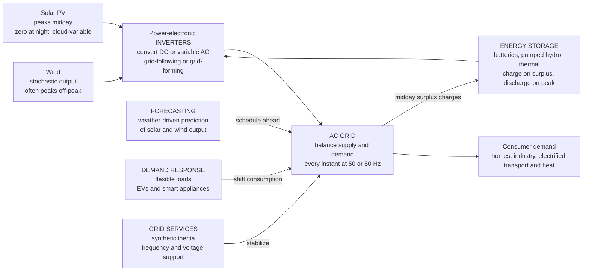

# ⚡ Renewable Energy Integration

> [!abstract] TL;DR
> The old power grid ran on **dispatchable** generation — you turn coal, gas, and hydro plants up or down to follow demand instant by instant. **Solar and wind are different: they are variable and *non-dispatchable*** — they generate when the sun shines and the wind blows, not when demand asks. As solar penetration grows, the **net load** (demand minus solar) develops a deep midday belly and a steep evening ramp — the famous **"duck curve"** — stressing conventional plants with over-generation, curtailment, and violent ramping. Making this work requires a new toolkit: **inverter-based resources** (solar, wind, and batteries connect through power electronics, not spinning machines, which erodes the grid's rotational **inertia** and raises frequency-stability concerns addressed by **grid-forming inverters** and synthetic inertia); **energy storage** (batteries, pumped hydro, thermal, hydrogen) to *shift* renewable energy in time and *firm* it; and a system layer of **forecasting, demand response, smart grids, and grid codes**. Integrating variable renewables at scale is one of the defining engineering challenges of the century — where power systems, power electronics, control, forecasting, and markets all collide with the climate.

## Intuition — analogy FIRST

The old grid was like a fleet of **dispatchable chefs**. When the dinner rush hits, you turn the stoves up; when the dining room empties, you turn them down. Supply follows hunger exactly, minute by minute, because every chef obeys the head chef's command.

But the sun and the wind **cook on their own schedule**. Solar peaks at noon whether or not anyone is hungry; wind gusts hardest at night when the kitchen is nearly empty. Neither renewable "chef" takes orders — they cook when nature says so and stop when it doesn't. Worse, a passing cloud can drop the solar chef's output by half in seconds.

Integrating renewables means running a kitchen where the stoves **flicker unpredictably** yet the guests still expect their meals on time, every time. Engineers keep this kitchen balanced by adding **batteries** (pantries that store the noon surplus for the evening rush), **smart inverters** (translators that convert the renewables' raw DC or off-frequency output into clean grid-synchronized AC and help hold voltage and frequency), and **demand flexibility** (flexible mealtimes — charging electric cars and running appliances when energy is abundant). The grid must still balance supply and demand *every single instant* — but now half the cooks answer to the weather instead of the head chef. Solving that intermittency puzzle, at continental scale, is one of the defining engineering challenges of the century.

---

## How It Works

### Core Mechanics

1. **The grid is a real-time balancing machine.** Alternating-current grids have almost no bulk energy storage of their own: generation must equal consumption *at every instant*, or the system frequency (50 Hz or 60 Hz) drifts. Too much generation and frequency rises; too little and it falls. Traditionally, operators kept balance by **dispatching** controllable plants — ramping gas turbines and hydro up and down to chase the demand curve.

2. **Renewables break the dispatch assumption.** Solar photovoltaic (PV) output follows the sun (a daily bell curve, zero at night, punched with holes by clouds); wind output is stochastic and often strongest overnight and in shoulder seasons. Both are **variable** (they change on their own) and **non-dispatchable** (you cannot command them upward — only *curtail* them downward). Supply now has a mind of its own.

3. **The net load reshapes into a duck.** What conventional plants must actually serve is the **net load** = demand − renewable generation. As solar grows, the midday net load collapses (the "belly"), then rises sharply as the sun sets while evening demand peaks (the "neck"). Plotted over a day, the silhouette looks like a duck. It forces conventional plants into deep midday minimums, over-generation and **curtailment** when there is too much solar, and brutal three-hour evening **ramps** of tens of gigawatts.

4. **Renewables connect through inverters, not spinning machines.** A coal or gas plant spins a massive synchronous generator whose rotating mass is *electromagnetically locked* to grid frequency. Solar produces DC; wind produces variable-frequency AC; batteries store DC. All three reach the grid through **power-electronic inverters** that synthesize 50/60 Hz AC. These **inverter-based resources (IBRs)** have **no inherent rotational inertia** — no spinning flywheel resisting frequency change — which changes the grid's dynamics.

5. **Storage and system tools re-couple supply to demand.** Because you cannot move the sun, you move the *energy in time*: **batteries** charge on the midday surplus and discharge into the evening peak, flattening the duck and firming variable output. Around that core sit **forecasting** (predict solar/wind hours to days ahead), **demand response** (shift flexible loads — EV charging, water heating — to sunny/windy hours), the **smart grid** and real-time markets, and **grid codes** that dictate how IBRs must ride through faults and support frequency and voltage.

### Flow / Architecture



---

## Key Concepts / Details

### Secondary Level

**Dispatchable vs non-dispatchable.** A dispatchable plant (gas, coal, hydro) is a source you can command up or down on demand. Solar and wind are **non-dispatchable**: they deliver whatever the weather allows. You can turn them *down* (curtail) but never *up* past what nature provides.

**Supply must equal demand, always.** The grid stores almost no energy on its own, so generation and consumption have to match every second. With controllable plants that is a scheduling problem; with weather-driven renewables it becomes a **moment-to-moment balancing problem**.

**Nameplate vs capacity factor.** A "100 MW" solar farm is its **nameplate** (peak) rating — what it makes at high noon on a clear day. Averaged over a year it produces far less. The **capacity factor** is the ratio of actual average output to nameplate: roughly **15–25%** for solar and **35–50%** for wind. This is why you need several megawatts of *nameplate* renewables to reliably replace one megawatt of a conventional plant.

**Storage is a pantry.** A battery lets you save cheap, abundant midday solar and serve it at the evening peak. It does not *create* energy — it **shifts it in time** — but that shift is what makes a weather-driven grid dependable.

### Undergraduate Level

**The duck curve, precisely.** Net load $= L_{\text{demand}}(t) - P_{\text{solar}}(t)$. As installed solar grows, three problems sharpen: (1) a deep **midday belly** where conventional plants must throttle to minimum load or shut off; (2) **over-generation / curtailment** when solar exceeds what the grid can absorb, so renewable energy is thrown away (sometimes at *negative* prices); and (3) a steep **evening ramp** — as solar fades and people come home, operators must ramp dispatchable plants up by tens of GW in about three hours. The duck is not a curiosity; it is the signature operational stress of high-solar grids.

**Inverter-based resources (IBRs).** Solar, wind, and batteries interface via power electronics that switch at kilohertz to synthesize a 50/60 Hz waveform. Two control philosophies:
- **Grid-following** inverters use a phase-locked loop (PLL) to *measure* the grid's existing voltage/frequency and inject current in step. They are cheap and dominant today but **need a stiff grid reference to lock onto** — they cannot form voltage on their own.
- **Grid-forming** inverters *impose* a voltage waveform (like a synchronous machine does), can operate in weak or islanded grids, **black-start** a dead network, and provide **synthetic inertia**.

**The inertia problem.** A spinning synchronous generator stores kinetic energy $E = \tfrac{1}{2}J\omega^2$ in its rotating mass. When a big generator trips, that stored energy is released instantly, slowing the *rate of change of frequency* (RoCoF) and buying seconds for controls to respond. IBRs have **no rotating mass**, so a grid dominated by them has **low inertia**: frequency swings faster and deeper after a disturbance. Remedies include **synthetic (virtual) inertia** from grid-forming inverters and **fast frequency response** from batteries, which can inject power in milliseconds — faster than any turbine.

**Energy storage fundamentals.** Storage shifts energy in time and provides fast grid services. Key metrics:
- **Power (MW)** vs **energy (MWh)**, and their ratio, **duration** (hours the unit can run at full power). A "100 MW / 400 MWh" battery is a 4-hour system.
- **Round-trip efficiency** — energy out ÷ energy in (~85–95% for Li-ion, ~70–80% for pumped hydro, lower for hydrogen).
- **C-rate** — charge/discharge power relative to capacity (1C = full discharge in one hour).
- **Cycle life** and degradation.
- **LCOE / LCOS** — levelized cost of energy/storage, the all-in cost per MWh delivered.

Technology families: **Li-ion** (dominant for grid batteries), **flow batteries** and **sodium** (long-duration candidates), **pumped hydro** (the workhorse of bulk storage), **thermal** and **compressed air**, and **hydrogen** (for seasonal shifting and hard-to-electrify sectors).

### Graduate Level

**Grid-forming control and low-inertia stability.** In a synchronous grid the swing equation $2H\,\dfrac{d\Delta f}{dt} = \Delta P$ links the imbalance $\Delta P$ to frequency change through the inertia constant $H$; low $H$ means large RoCoF. Grid-forming inverters emulate this response through control laws (droop, virtual synchronous machine, matching control), synthesizing inertia and damping. The design tension is that inverters have **limited overcurrent** (typically ~1.1–1.5× rated, versus 5–7× for a synchronous machine), which reshapes **protection**: legacy overcurrent relays may not see enough fault current to trip, so protection philosophy must change.

**Frequency stability metrics and the control hierarchy.** After a disturbance: **RoCoF** (initial slope), the **frequency nadir** (lowest point), and the settling frequency. These are arrested by a layered response — **inertial/fast frequency response** (ms–s, increasingly from batteries and grid-forming IBRs), **primary control / droop** (seconds), **secondary control / AGC** (tens of seconds to minutes), and **tertiary/economic dispatch** (minutes). As synchronous units retire, batteries increasingly provide the fastest layers.

**Curtailment, markets, and negative prices.** When variable renewables exceed absorbable load, operators curtail. In marginal-cost markets, near-zero-fuel renewables push the clearing price toward — and sometimes below — zero (negative prices where subsidies or must-run constraints incentivize generating anyway). Storage arbitrages this: buy (charge) into cheap/negative midday prices, sell (discharge) into expensive evening peaks. This price signal *is* the economic engine flattening the duck.

**Reactive power, voltage, and ride-through.** Beyond real power, IBRs must supply/absorb **reactive power** for voltage support, and satisfy **low-voltage ride-through** so a distant fault does not trip a whole fleet at once (the cause of several large disturbances). Distributed **DER** at the grid edge can push voltage up on feeders and reverse power flow, complicating protection and voltage regulation.

**System adequacy and the seasonal problem.** **Capacity credit** measures how much *firm* capacity a variable resource contributes to reliability — usually far below its nameplate. Short-duration (4-hour) batteries flatten the daily duck but **cannot solve the seasonal mismatch** (e.g., a cloudy, windless winter week). That "last few percent" of a fully decarbonized grid drives interest in **long-duration and seasonal storage** (hydrogen, iron-air, thermal), **transmission expansion** to average weather over wide areas, and flexible demand. This is where the energy transition gets genuinely hard — and where the frontier research lives.

---

## Python Demo

```python
# The duck curve and battery storage — the essence of renewable integration.
# (a) Build a day of electricity DEMAND, overlay a SOLAR generation bell,
#     and plot the NET load (demand - solar) -> the famous "duck curve"
#     with a midday belly and a steep evening ramp.
# (b) Add a grid-scale BATTERY that CHARGES on the midday surplus and
#     DISCHARGES into the evening peak, flattening the net load and shifting
#     renewable energy to when it is needed (state-of-charge over the day).
# numpy + matplotlib only.
import numpy as np
import matplotlib.pyplot as plt

# --- Time axis: one day at 15-minute resolution ---
hours = np.arange(0, 24, 0.25)          # 0.00 .. 23.75 h
dt = 0.25                                # timestep (hours)

def gauss(t, mu, sigma):
    return np.exp(-0.5 * ((t - mu) / sigma) ** 2)

# --- (a) Electricity DEMAND (GW): overnight base + morning ramp + evening peak ---
demand = (22.0                                   # overnight base load
          + 6.0 * gauss(hours, 8.0, 1.6)         # morning pickup
          + 12.0 * gauss(hours, 19.0, 2.0))      # evening peak (the daily max)

# --- SOLAR generation (GW): a bell centered at noon, zero at night ---
solar_peak = 18.0
bell = np.clip(np.sin(np.pi * (hours - 6.0) / 12.0), 0, None)  # nonzero 06:00-18:00
solar = solar_peak * bell ** 1.5                 # sharpen the midday peak

# --- NET load = demand - solar  (the "duck") ---
net_load = demand - solar

# --- (b) BATTERY: charge on midday dip, discharge on evening peak -------------
#     Strategy: peak-shave / valley-fill toward the daily average net load.
Pmax  = 6.0                              # max charge/discharge power (GW)
Emax  = 28.0                             # energy capacity (GWh) -> ~4.7 h duration
eta   = 0.88                             # round-trip efficiency (applied on charge)
soc   = 0.5 * Emax                       # start half full (GWh)
target = net_load.mean()                 # flatten toward the daily average

soc_hist   = np.zeros_like(hours)
batt_power = np.zeros_like(hours)        # >0 discharge to grid, <0 charge from grid

for i in range(len(hours)):
    desired = net_load[i] - target       # >0 => shave (discharge), <0 => fill (charge)
    p = np.clip(desired, -Pmax, Pmax)
    if p > 0:                            # DISCHARGE: deliver p to the grid
        p = min(p, soc / dt)             # limited by stored energy
        soc -= p * dt
    else:                                # CHARGE: absorb |p| from the grid
        space = (Emax - soc) / (eta * dt)
        p = -min(-p, space)              # limited by remaining capacity
        soc += eta * (-p) * dt           # losses applied on the way in
    soc = np.clip(soc, 0, Emax)
    batt_power[i] = p
    soc_hist[i]   = soc

net_with_batt = net_load - batt_power    # discharge lowers net load; charge raises it

# --- Quantify the improvement ---
win = int(3 / dt)                        # 3-hour window for the evening ramp
ramp_raw  = np.max(net_load[win:]     - net_load[:-win])
ramp_batt = np.max(net_with_batt[win:] - net_with_batt[:-win])
print(f"Peak net load   : raw {net_load.max():5.1f} GW  ->  with battery {net_with_batt.max():5.1f} GW")
print(f"Midday minimum  : raw {net_load.min():5.1f} GW  ->  with battery {net_with_batt.min():5.1f} GW")
print(f"Steepest 3-h ramp: raw {ramp_raw:5.1f} GW  ->  with battery {ramp_batt:5.1f} GW")

# --- Plots ---
fig, ax = plt.subplots(2, 2, figsize=(15, 9))

# (1) The duck curve: demand, solar, net load
ax[0, 0].plot(hours, demand, 'k', lw=2, label="demand")
ax[0, 0].plot(hours, solar, color="orange", lw=2, label="solar generation")
ax[0, 0].fill_between(hours, 0, solar, color="orange", alpha=0.2)
ax[0, 0].plot(hours, net_load, 'b', lw=2.5, label="NET load = demand - solar")
ax[0, 0].set(title="The duck curve: net load develops a midday belly + evening ramp",
             xlabel="hour of day", ylabel="power (GW)", xlim=(0, 24), xticks=range(0, 25, 3))
ax[0, 0].legend(fontsize=8); ax[0, 0].grid(alpha=0.3)

# (2) Battery flattens the net load
ax[0, 1].plot(hours, net_load, 'b', lw=2, alpha=0.5, label="net load (no storage)")
ax[0, 1].plot(hours, net_with_batt, 'g', lw=2.5, label="net load WITH battery")
ax[0, 1].axhline(target, color='k', ls=':', lw=1, label="flattening target")
ax[0, 1].set(title="Battery shaves the evening peak + fills the midday belly",
             xlabel="hour of day", ylabel="power (GW)", xlim=(0, 24), xticks=range(0, 25, 3))
ax[0, 1].legend(fontsize=8); ax[0, 1].grid(alpha=0.3)

# (3) Battery power: charge (negative) midday, discharge (positive) evening
chg = batt_power < 0
ax[1, 0].fill_between(hours, 0, batt_power, where=~chg, color="green", alpha=0.5, label="discharge (to grid)")
ax[1, 0].fill_between(hours, 0, batt_power, where=chg,  color="red",   alpha=0.5, label="charge (from surplus)")
ax[1, 0].axhline(0, color='k', lw=0.8)
ax[1, 0].set(title="Battery power: charge on midday solar surplus, discharge at peak",
             xlabel="hour of day", ylabel="battery power (GW)", xlim=(0, 24), xticks=range(0, 25, 3))
ax[1, 0].legend(fontsize=8); ax[1, 0].grid(alpha=0.3)

# (4) State of charge over the day
ax[1, 1].plot(hours, soc_hist, color="purple", lw=2.5)
ax[1, 1].fill_between(hours, 0, soc_hist, color="purple", alpha=0.15)
ax[1, 1].axhline(Emax, color='k', ls=':', lw=1, label=f"capacity {Emax:.0f} GWh")
ax[1, 1].set(title="State of charge: fills midday, empties into the evening",
             xlabel="hour of day", ylabel="stored energy (GWh)", xlim=(0, 24),
             ylim=(0, Emax * 1.1), xticks=range(0, 25, 3))
ax[1, 1].legend(fontsize=8); ax[1, 1].grid(alpha=0.3)

plt.tight_layout()
plt.savefig("renewable_integration_duck_curve.png", dpi=110)
print("Saved renewable_integration_duck_curve.png")
```

**What it shows.** Panel 1 builds the duck: a smooth demand curve, a midday solar bell, and their difference — the **net load** — which sags into a deep midday belly and then rockets up in a steep evening ramp as solar fades while demand peaks. Panel 2 overlays the battery-flattened net load: charging during the belly *raises* the midday floor and discharging into the peak *shaves* the neck, pulling the whole curve toward the flat target. Panel 3 makes the mechanism explicit — the battery draws power (red, charging) exactly when solar is surplus and delivers power (green, discharging) exactly at the evening peak. Panel 4 is the state of charge: it climbs toward full through the sunny hours and drains into the evening, the literal "pantry" cycle at the heart of grid-scale storage. The printout quantifies it: the peak net load and the brutal three-hour evening ramp both shrink substantially once storage is added.

---

## Real-World Applications

- **California (CAISO) — the birthplace of the duck.** NREL first drew the duck chart from CAISO net-load projections. California now over-generates solar at midday (curtailing gigawatt-hours and seeing negative prices) and faces one of the world's steepest evening ramps — and has responded by deploying **the largest fleet of grid batteries on Earth**, which now routinely charge on the midday belly and discharge into the 4–9 PM peak, visibly flattening the state's net load.
- **South Australia — Hornsdale Power Reserve.** The Tesla/Neoen "big battery" demonstrated that inverter-based storage can provide **fast frequency response** far quicker than any thermal plant, stabilizing a grid running at times on near-100% wind and solar; the region is a live testbed for **grid-forming inverters** and synthetic inertia in a genuinely low-inertia system.
- **Texas (ERCOT).** Explosive growth of wind, then solar, then batteries on an isolated grid with limited interconnection has made ERCOT a stress test for **inertia, ramping, and resource adequacy** — and a booming market for battery arbitrage and ancillary services.
- **Denmark and the Nordics.** Denmark meets a very high share of demand from **wind**, exporting surplus and importing when calm; it effectively uses **Norwegian and Swedish hydro reservoirs as a giant battery** through strong cross-border interconnection — averaging weather over a wide area, the cheapest "storage" of all.
- **Germany (Energiewende).** High solar and wind penetration forced the build-out of forecasting, **redispatch/curtailment** management, and market redesign, illustrating both the promise and the operational headaches of rapid renewable growth.
- **Electric vehicles and virtual power plants.** Smart EV charging, home batteries, and thermostats aggregated into **virtual power plants (VPPs)** turn millions of flexible loads and small storage units into a **demand-response** resource that shifts consumption toward sunny/windy hours and provides grid services.

---

## Common Pitfalls

- **Treating renewables as if they were dispatchable.** Solar and wind are **variable and non-dispatchable** — solar is diurnal and cloud-punched, wind is stochastic. You can only curtail them downward, never command them up. Planning capacity as if a 100 MW solar farm reliably delivers 100 MW ignores the whole balancing problem.
- **Ignoring the duck curve until it bites.** As solar penetration rises, the midday **over-generation/curtailment** and the steep **evening ramp** appear together. Grids that add solar without planning for ramping capability and storage end up throwing away clean energy at midday and scrambling for fast generation at dusk.
- **Forgetting that inverters have no inertia.** Every solar panel, wind turbine, and battery reaches the grid through **power electronics**, not spinning mass. Replacing synchronous machines with **grid-following** IBRs erodes **rotational inertia**, so frequency swings faster and deeper (high RoCoF) after a disturbance. **Grid-forming inverters** and **synthetic inertia** exist precisely to restore this — do not assume a high-IBR grid is stable by default.
- **Confusing grid-following with grid-forming inverters.** Grid-following units *need* a stiff external voltage/frequency reference to lock onto and cannot support a weak or islanded grid; grid-forming units *create* the reference, can black-start, and emulate inertia. Building a very-high-renewable grid entirely on grid-following inverters is a stability trap.
- **Underestimating protection and fault-current changes.** IBRs deliver only slightly more than rated current during faults (versus 5–7× for synchronous machines), so **legacy overcurrent protection may not trip** and **low-voltage ride-through** must be engineered — otherwise a single fault can cascade a whole fleet offline.
- **Sloppy storage metrics.** Storage is not free energy — it is time-shifting with losses. Confusing **power (MW)** with **energy (MWh)**, ignoring **duration**, **round-trip efficiency**, **C-rate**, cycle life, or comparing options without **LCOE/LCOS** leads to badly sized systems. A 4-hour battery flattens the daily duck but **cannot cover a windless winter week** — that seasonal gap needs long-duration storage, transmission, or firm capacity.
- **Nameplate ≠ real output.** Sizing on **nameplate** while ignoring **capacity factor** (roughly 15–25% solar, 35–50% wind) and **capacity credit** massively overstates how much firm, reliable power a renewable fleet provides.
- **Neglecting the system toolkit.** Renewable integration is not just "add panels." Without **forecasting**, **demand response**, a **smart grid**, **transmission/interconnection** to average weather over wide areas, sensible **grid codes**, and **DER/microgrid** coordination, high penetration becomes unmanageable. The engineering is in the *system*, not the panel.

---

## Related Concepts

- [[Semiconductor_Devices_and_Diodes]] — solar PV is a large-area semiconductor **p–n junction**; understanding the diode and photovoltaic effect explains why panels produce weather-dependent DC that inverters must convert.
- [[AC_Circuit_Analysis_and_Phasors]] — the grid is a synchronized AC system; phasors, real vs reactive power, and the 50/60 Hz frequency are exactly the quantities that inverters and storage must respect and support.
- [[Feedback_and_Control_Systems]] — grid frequency and voltage regulation, droop control, synthetic inertia, and battery fast-frequency response are all **closed-loop control** problems on a giant physical plant.
- [[Faradays_Law_and_Induction]] — the rotating synchronous generators that historically supplied grid inertia work by Faraday induction; renewables replace this spinning mass with inverters, which is the root of the inertia challenge.
- [[Solar_Radiation_and_the_Energy_Budget]] — the diurnal and seasonal solar-radiation cycle *is* the input signal to PV generation, and directly shapes the duck curve's midday belly.
- [[Pressure_Gradient_Force_and_Winds]] — wind power is driven by pressure-gradient winds; the same atmospheric dynamics make wind stochastic and explain why it often peaks off-peak and overnight.
- [[p_n_Junctions_and_Diodes]] — the materials-science view of the junction physics behind photovoltaic cells and the diodes inside inverters.
- [[Optical_Properties_and_Photonic_Materials]] — absorption, band gaps, and light–matter interaction set the efficiency ceiling of solar cells.
- [[Anthropogenic_Climate_Change]] — decarbonizing electricity (then electrifying transport and heat) is the *why* behind renewable integration; this is where EE meets the climate.
- [[Sustainability_and_Planetary_Boundaries]] — the energy transition is a systems-level response to planetary boundaries; the grid is one of its central engineered subsystems.
- [[Feedback_Loops_and_Causality]] — grid balancing, storage arbitrage, and price signals form coupled feedback loops; a systems-thinking lens clarifies why curtailment and negative prices emerge.

This note sits in the **Power and Energy Systems** section and connects to its sibling notes in prose: **Power Systems and the Grid** (the AC network, load flow, frequency/voltage control this note builds on), **Power Electronics and Converters** (the inverter hardware that all IBRs depend on), **Electric Machines and Transformers** (the synchronous generators whose retirement drives the inertia problem, and the transformers that move renewable power), **Photonics and Optoelectronics** (the device physics of solar cells), and **Motor Drives and Control** (the same power-electronic and control toolkit applied to variable-speed wind turbines and EV drivetrains).

---

## Review Questions

1. **(Secondary)** A 100 MW solar farm has a capacity factor of 20%, while a 100 MW gas plant can run whenever dispatched. Explain what "capacity factor" means, why the two plants are *not* interchangeable megawatt-for-megawatt, and give one everyday-analogy reason (using the "chefs" or "pantry" picture) why adding a battery makes the solar farm more useful to the grid.
2. **(Undergraduate)** Sketch how the **net load** changes as a region installs more and more rooftop solar, and identify the three duck-curve stress points (midday over-generation, steep evening ramp, low midday minimum). For a grid facing a 12 GW evening ramp over three hours, describe how a 4-hour battery fleet would be dispatched over the day (charge/discharge timing) and what its state of charge would look like — and explain why that same battery **cannot** solve a windless, cloudy winter week.
3. **(Graduate)** A grid is transitioning from mostly synchronous generators to mostly **grid-following** inverter-based resources. (a) Using the swing equation $2H\,d\Delta f/dt = \Delta P$, explain why the loss of rotational inertia increases RoCoF after a generator trip. (b) Explain how **grid-forming** inverters and battery **fast frequency response** mitigate this, and why grid-following inverters alone cannot. (c) Because IBRs supply only ~1.1–1.5× rated fault current, describe one way conventional **overcurrent protection** can fail in a high-IBR grid and what must change.

---

## Sources

- Masters, G. M. — *Renewable and Efficient Electric Power Systems*, 2nd ed. (Wiley) — the standard integrative text on PV, wind, and grid integration. [Wiley](https://www.wiley.com/en-us/Renewable+and+Efficient+Electric+Power+Systems%2C+2nd+Edition-p-9781118140628)
- Kroposki, B. et al. (NREL) — "Achieving a 100% Renewable Grid: Operating Electric Power Systems with Extremely High Levels of Variable Renewable Energy," *IEEE Power & Energy Magazine* (2017) — inverter-based resources, inertia, and stability. [NREL](https://www.nrel.gov/docs/fy17osti/68558.pdf)
- Denholm, P. et al. (NREL) — "Overgeneration from Solar Energy in California: A Field Guide to the Duck Chart," NREL/TP-6A20-65023 (2015) — the definitive treatment of the duck curve and storage. [NREL](https://www.nrel.gov/docs/fy16osti/65023.pdf)
- IEA — *Renewables Integration* and grid-flexibility analyses — global perspective on variability, storage, and system flexibility. [IEA](https://www.iea.org/energy-system/renewables)
- Denholm, P. et al. (NREL) — *The Challenge of Defining Long-Duration Energy Storage* and NREL grid-integration studies — storage duration, capacity credit, and seasonal firming. [NREL Grid Integration](https://www.nrel.gov/grid/)

---

#electrical-engineering #renewable-energy #grid-integration #energy-storage #duck-curve
