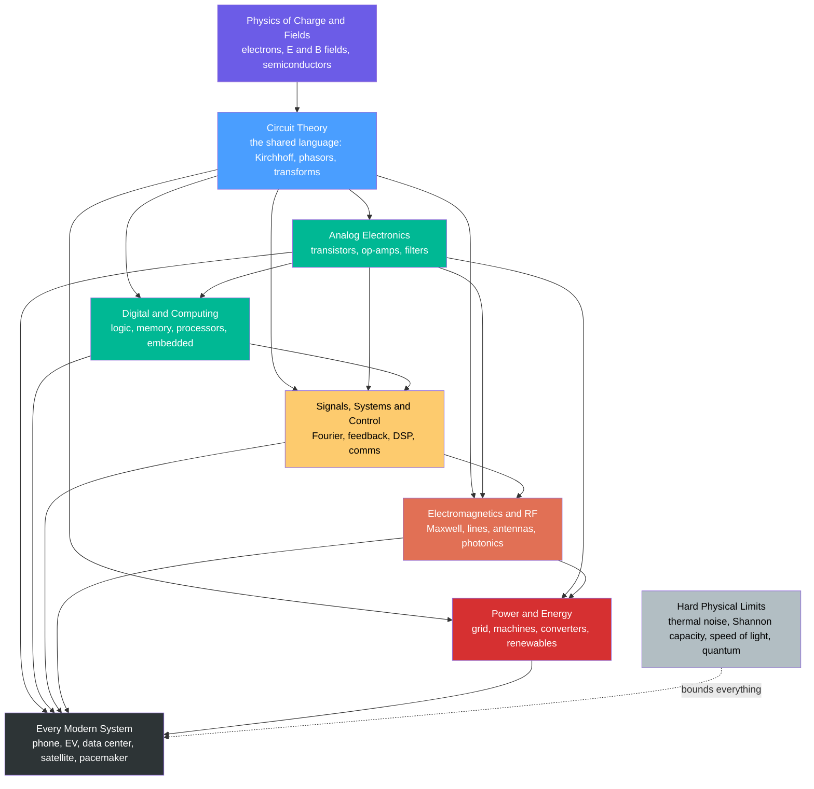

# ⚡ The Reach and Future of Electrical Engineering

> [!abstract] TL;DR
> Reach out and touch anything electronic — a phone, a lamp, a car, a heartbeat monitor — and you are touching **electrical engineering**. In barely 150 years the field went from Faraday's spinning magnet to a civilization where a sliver of silicon holds **billions** of switches, invisible waves carry your voice around the planet, and a continent-wide machine keeps the lights on to the microsecond. This capstone steps back over the whole 36-note vault, draws out its **unifying ideas** — everything rests on the physics of charge and electromagnetic fields, bounded by hard limits (thermal noise, Shannon capacity, the speed of light, quantum) — and looks forward to where EE is heading: **electrifying transport, wiring intelligence into everything, and racing toward quantum and photonic frontiers.** Software eats the world, but it runs on EE hardware.

## Intuition — analogy FIRST

**Reach out and touch anything that hums, glows, computes, or connects — and your fingertip is on electrical engineering.** The screen you are reading, the LED lighting the room, the router blinking in the hallway, the car warming up in the driveway, the pacemaker in someone's chest: every one of them is electrons and fields, *shaped on purpose* by engineers. EE is the quiet layer underneath the visible world — you almost never see it, and it almost never stops.

Now zoom out in time. **In about 150 years — a single long lifetime doubled — humanity went from Faraday twirling a magnet past a coil in 1831 to a machine the size of a fingernail holding a hundred billion switches.** No other engineering discipline compressed so much capability into so little space so fast. The trajectory has a shape: from *understanding* charge and fields, to *controlling* them one device at a time, to *integrating* millions and then billions of devices, to *networking* the whole planet, and now to *electrifying* transport and industry while reaching for entirely new substrates — the qubit and the photon.

This note is the map that steps back far enough to see the whole territory at once. The six sections of this vault are six chapters of one story — **from the electron, to the grid, to the qubit** — and this capstone reads them as a single arc, then asks: what comes next?

---

## How It Works

**The whole field grows from one root and branches into six limbs that keep feeding each other.** At the root is the *physics of charge and electromagnetic fields*: electrons, the fields $\vec{E}$ and $\vec{B}$, and the semiconductor materials that let us steer them. From that root, **circuit theory** is the shared trunk — the *language* every branch speaks. Above the trunk the field splits along a natural set of axes: **analog vs digital** (continuous signals vs quantised logic), **energy vs information** (moving power vs moving meaning), and **lumped vs distributed** (components vs waves, the boundary that appears once frequencies get high enough that a wavelength fits inside your circuit).

The six sections of this vault map exactly onto those limbs:

1. **Circuit Fundamentals** — Kirchhoff's laws, network analysis, transients, AC/phasors. *The grammar.*
2. **Analog Electronics** — diodes, BJTs, MOSFETs, op-amps, filters, oscillators. *Controlling the continuous.*
3. **Digital Electronics & Systems** — logic, sequential state, HDL, converters, memory, embedded. *Building the discrete/digital world.*
4. **Signals, Systems & Control** — LTI theory, Fourier/Laplace, feedback, DSP, communications, modulation. *Processing information and taming dynamics.*
5. **Electromagnetics & RF** — Maxwell, transmission lines, antennas, RF/microwave, photonics. *Waves, wireless, and light.*
6. **Power & Energy** — the grid, machines, power electronics, renewables, drives. *Moving energy at scale.*

The magic is that **they are not silos — a single smartphone fuses all six at once.** And one idea recurs in every limb: **feedback.** It stabilises an op-amp, sustains an oscillator, locks a PLL, steers a control loop, and holds grid frequency at 50/60 Hz. Learn feedback once and you have a key that opens all six doors.



---

## Key Concepts

### Secondary Level — the big picture in plain words

- **EE is bigger than "electronics."** Electronics (transistors, chips, gadgets) is *one* branch. EE also includes the power grid, radio and antennas, motors, and control systems. A power engineer and a chip designer are both electrical engineers.
- **Two things flow: energy and information.** Some EE moves *energy* (grid, motors, chargers); some moves *information* (Wi-Fi, DSP, the internet). Most modern devices do both, tightly interwoven.
- **The transistor is the hero.** A transistor is a tiny switch/valve. Learning to make them smaller and pack more onto a chip — **Moore's law** — drove the entire digital and computing revolution.
- **It is everywhere and invisible.** From the phone in your hand ([[Electrical_Engineering_Overview]]) to the grid across your country, EE is the substrate under modern life.

### Undergraduate Level — the arc across the six sections

- **The language (Section 1).** [[Circuit_Elements_and_Kirchhoffs_Laws]] plus [[AC_Circuit_Analysis_and_Phasors]] give you Ohm's law, KCL/KVL, impedance, and the DC-vs-AC split every later topic assumes.
- **Controlling the continuous (Section 2).** [[Semiconductor_Devices_and_Diodes]] → [[Bipolar_Junction_Transistors]] → [[MOSFETs_and_CMOS]] build up the active devices; [[Operational_Amplifiers]] package gain into a universal block for amplifying, filtering, and comparing.
- **Building the digital world (Section 3).** [[Boolean_Logic_and_Combinational_Circuits]] and [[Sequential_Logic_and_Flip_Flops]] quantise voltage into 0/1 and add memory; [[Digital_System_Design_and_HDL]] and [[Embedded_Systems_and_Microcontrollers]] scale that up to processors and products.
- **Processing information (Section 4).** [[Signals_and_LTI_Systems]] and [[Fourier_and_Laplace_in_Circuits]] turn calculus into algebra; [[Feedback_and_Control_Systems]] tames dynamics; [[Communication_Systems_Fundamentals]] moves meaning across space.
- **Waves and wireless (Section 5).** [[Maxwells_Equations_for_Engineers]] is the bedrock; [[Transmission_Lines]] and [[Waveguides_and_Antennas]] handle the *distributed* regime; [[RF_and_Microwave_Engineering]] and [[Photonics_and_Optoelectronics]] carry information on radio waves and light.
- **Moving energy (Section 6).** *Power Systems and the Grid, Electric Machines and Transformers, Power Electronics and Converters, Renewable Energy Integration,* and *Motor Drives and Control* scale everything to megawatts and the machine that lights a continent.

### Graduate Level — the unifying ideas and the boundaries

- **Everything rests on Maxwell.** Circuits are a *low-frequency approximation* of [[Maxwells_Equations_for_Engineers]]; when a wavelength shrinks to the size of your board, lumped circuit theory breaks and you must use fields. That **lumped ↔ distributed boundary** is the single most important conceptual transition in the field.
- **Feedback is the universal principle.** The same negative-feedback mathematics stabilises an amplifier, a control loop, a phase-locked loop, and grid frequency; positive feedback builds oscillators and memory. Poles, zeros, and stability margins are one theory serving all six sections ([[Feedback_and_Control_Systems]]).
- **Fundamental limits bound the whole field.** *Thermal (Johnson-Nyquist) noise* sets the analog noise floor; *Shannon capacity* $C = B\log_2(1+\text{SNR})$ caps every communication link ([[The_Gaussian_Channel_and_Shannon_Hartley]], [[Channel_Capacity_and_the_Noisy_Channel_Theorem]]); the *speed of light / Maxwell* limits timing and interconnect; *quantum effects* and *Landauer's principle* bound how small and how energy-cheap a switch can be. No clever engineering escapes these — they are the walls of the room.
- **The analog ↔ digital ↔ power ↔ wave quadrants.** Every EE system lives somewhere among these four, and the great products *cross* them: an ADC ([[Data_Converters_ADC_and_DAC]]) bridges analog to digital; a power converter bridges digital control to raw energy; an antenna bridges circuit to wave.
- **Deep interconnection.** No sub-field stands alone: a 5G handset simultaneously exercises RF front-ends, DSP, power management, control loops, antennas, and increasingly silicon photonics — all on one board.

---

## Python Demo

```python
# ============================================================
# The Electrical Engineering Dashboard: four panels, one field.
#   (1) CIRCUITS      -> series-RLC bandpass Bode magnitude (resonance)
#   (2) ELECTRONICS   -> Moore's law: transistor count vs year (log scale)
#   (3) SIGNALS/INFO  -> a two-tone + noise signal seen through its FFT
#   (4) POWER/ENERGY  -> the energy transition: renewable share S-curve
# Self-contained: numpy + matplotlib only.
# ============================================================
import numpy as np
import matplotlib.pyplot as plt

fig, ax = plt.subplots(2, 2, figsize=(13, 9))

# ---------- (1) CIRCUIT FOUNDATION: series RLC bandpass, Bode magnitude ----------
# Output taken across R: H(jw) = R / (R + j(wL - 1/(wC))) -> bandpass, peak at w0.
R, L, C = 10.0, 1e-3, 1e-6            # ohms, henries, farads
f  = np.logspace(2, 6, 2000)          # 100 Hz .. 1 MHz
w  = 2 * np.pi * f
Z_reactive = 1j * (w * L - 1.0 / (w * C))
H  = R / (R + Z_reactive)             # complex frequency response
mag_dB = 20 * np.log10(np.abs(H))
f0 = 1.0 / (2 * np.pi * np.sqrt(L * C))   # resonant frequency
Q  = (1.0 / R) * np.sqrt(L / C)           # quality factor

ax[0, 0].semilogx(f, mag_dB, color="#4a9eff", lw=2)
ax[0, 0].axvline(f0, color="k", ls="--", lw=1, label=f"f0 = {f0:,.0f} Hz,  Q = {Q:.1f}")
ax[0, 0].set_title("1. Circuits: RLC Resonance (Bode magnitude)")
ax[0, 0].set_xlabel("frequency  [Hz]")
ax[0, 0].set_ylabel("|H|  [dB]")
ax[0, 0].set_ylim(-40, 3)
ax[0, 0].legend(); ax[0, 0].grid(True, which="both", alpha=0.3)

# ---------- (2) ELECTRONICS REVOLUTION: Moore's law ----------
# Representative CPU/SoC transistor counts (approximate, public figures).
year  = np.array([1971, 1978, 1982, 1989, 1993, 2000, 2006,
                  2008, 2012, 2017, 2020, 2022, 2023])
count = np.array([2.3e3, 2.9e4, 1.34e5, 1.2e6, 3.1e6, 4.2e7, 2.91e8,
                  7.31e8, 2.6e9, 1.92e10, 1.6e10, 1.14e11, 1.34e11])
# Moore's law reference line: doubling every 2 years from the 4004.
fit = 2.3e3 * 2.0 ** ((year - 1971) / 2.0)

ax[0, 1].semilogy(year, count, "o", color="#00b894", ms=7, label="real chips")
ax[0, 1].semilogy(year, fit, "--", color="#636e72", lw=1.5,
                  label="doubling every 2 yrs")
ax[0, 1].set_title("2. Electronics: Moore's Law (transistors/chip)")
ax[0, 1].set_xlabel("year")
ax[0, 1].set_ylabel("transistor count (log)")
ax[0, 1].legend(loc="upper left"); ax[0, 1].grid(True, which="both", alpha=0.3)

# ---------- (3) SIGNALS & INFORMATION: a signal through its FFT spectrum ----------
fs = 1000.0                            # sampling rate (Hz)
t  = np.arange(0, 1.0, 1.0 / fs)       # 1 second
sig = (1.0 * np.sin(2 * np.pi * 50 * t)      # 50 Hz tone
       + 0.5 * np.sin(2 * np.pi * 120 * t))  # 120 Hz tone
rng = np.random.default_rng(0)
sig += 0.3 * rng.standard_normal(t.size)     # additive noise
N = t.size
spectrum = np.abs(np.fft.rfft(sig)) * (2.0 / N)   # single-sided amplitude
freqs = np.fft.rfftfreq(N, 1.0 / fs)

ax[1, 0].plot(freqs, spectrum, color="#e17055", lw=1.5)
ax[1, 0].set_title("3. Signals & Information: FFT of a 50+120 Hz signal in noise")
ax[1, 0].set_xlabel("frequency  [Hz]")
ax[1, 0].set_ylabel("amplitude")
ax[1, 0].set_xlim(0, 200)
ax[1, 0].annotate("50 Hz", (50, 1.0), textcoords="offset points", xytext=(6, -2))
ax[1, 0].annotate("120 Hz", (120, 0.5), textcoords="offset points", xytext=(6, -2))
ax[1, 0].grid(True, alpha=0.3)

# ---------- (4) POWER & ENERGY: the electrification / energy transition ----------
# Logistic S-curve for renewable share of electricity, a stylised transition.
yr = np.arange(2000, 2051)
L_max, k, t0 = 0.90, 0.14, 2035.0
share = 100.0 * L_max / (1.0 + np.exp(-k * (yr - t0)))
now = 2026

ax[1, 1].plot(yr, share, color="#d63031", lw=2.5)
ax[1, 1].fill_between(yr, share, alpha=0.15, color="#d63031")
ax[1, 1].axvline(now, color="k", ls=":", lw=1.2, label=f"~today ({now})")
ax[1, 1].set_title("4. Power & Energy: Renewable-share transition (S-curve)")
ax[1, 1].set_xlabel("year")
ax[1, 1].set_ylabel("renewable share of electricity  [%]")
ax[1, 1].set_ylim(0, 100)
ax[1, 1].legend(loc="upper left"); ax[1, 1].grid(True, alpha=0.3)

fig.suptitle("The Electrical Engineering Dashboard — one field, four faces",
             fontsize=14, fontweight="bold")
plt.tight_layout(rect=[0, 0, 1, 0.97])
plt.savefig("ee_capstone_dashboard.png", dpi=120)
plt.show()

# ---- console synthesis: the four numbers that define the field's reach ----
print(f"(1) RLC resonance:  f0 = {f0:,.0f} Hz,  Q = {Q:.2f}")
print(f"(2) Moore's law:    1971 -> 2023 transistor growth  = {count[-1]/count[0]:.2e} x")
print(f"(3) Spectrum peaks recovered near 50 Hz and 120 Hz from a noisy signal")
print(f"(4) Modeled renewable share in {now}: {100*L_max/(1+np.exp(-k*(now-t0))):.1f} %")
```

The dashboard is the whole vault on one screen: **a resonant circuit** (the grammar), **Moore's law** (the electronics revolution — roughly a 58-million-fold growth in switches per chip in one working lifetime), **an FFT** cleanly pulling two tones out of noise (signals and information), and **an S-curve of electrification** (power and energy tilting toward renewables). Four faces of a single discipline.

---

## Real-World Applications — the grand sweep

- **Computing** — every CPU, GPU, and phone SoC is billions of [[MOSFETs_and_CMOS]] switches laid out with HDL ([[Digital_System_Design_and_HDL]]), fed by memory and buses. The entire information age is EE hardware made cheap enough to be everywhere.
- **Communications** — global fiber backbones ([[Photonics_and_Optoelectronics]]) plus wireless ([[RF_and_Microwave_Engineering]], [[Communication_Systems_Fundamentals]], [[Analog_and_Digital_Modulation]]) knit the planet together, every link ultimately capped by Shannon.
- **Power & energy** — the grid, transformers, and inverters deliver energy at continental scale; the shift to solar, wind, batteries, and EVs puts power electronics at the center of climate solutions.
- **Healthcare** — ECG/EEG instrumentation ([[Operational_Amplifiers]]), MRI (RF + strong magnets), pacemakers and cochlear implants (embedded low-power design), and wearable sensors are EE saving lives.
- **Transport** — EVs are rolling EE labs: battery management, three-phase motor drives, regenerative braking, and radar/lidar sensing. Electrification is decarbonising the largest end-use of energy.
- **AI hardware** — the GPUs, TPUs, and NPUs training and running modern AI are EE at the bleeding edge — dense CMOS, exotic memory hierarchies ([[GPU_Architecture_and_CUDA]], [[GPU_Architecture_Basics]], [[Quantization]]), and increasingly optical interconnect. *AI is a story about EE hardware as much as about algorithms.*
- **Space** — satellites and deep-space probes are radiation-hard electronics, phased-array antennas ([[Waveguides_and_Antennas]]), solar power, and DSP-heavy communications, all at once.

---

## Common Pitfalls

- **Confusing "electronics" with all of EE.** Electronics is one branch. The grid, RF, control, and power engineering are equally EE and touch few transistors. Judging the discipline by gadgets alone misses half of it.
- **Ignoring the lumped ↔ distributed boundary.** Below a threshold frequency, wires are wires and lumped circuit theory works. Once a wavelength approaches your board size, that same wire is a [[Transmission_Lines]] with reflections and standing waves. Using the wrong model here is the classic RF/high-speed-digital failure.
- **Forgetting the analog ↔ digital reality gap.** "Digital" is a convenient abstraction painted on top of fundamentally analog physics: real edges have rise times, real logic has noise margins, and every ADC/DAC ([[Data_Converters_ADC_and_DAC]]) is where the two worlds collide. Ignore the analog underneath and your digital design fails at speed.
- **Believing physics limits are engineering problems.** Thermal noise, Shannon capacity, the speed of light, and quantum effects are *walls*, not obstacles. You cannot out-clever $C = B\log_2(1+\text{SNR})$; you can only spend bandwidth, power, or SNR to approach it.
- **Thinking "software eats the world" means hardware stopped mattering.** All software runs on EE hardware; every abstraction bottoms out in transistors, links, and power delivery. The more software does, the more the hardware substrate — and its energy budget — matters.
- **Assuming Moore's law is a law of nature.** It is an economic/engineering trend, and **Dennard scaling already ended (~2005)**, which is why clock speeds stalled and the industry pivoted to multicore, 3D stacking, chiplets, and specialised accelerators. Extrapolating naive transistor-doubling forever is wrong.
- **Underestimating that hardware is hard.** Unlike software, silicon is expensive, slow to iterate (months per tape-out), and unforgiving of mistakes. Respect for fabrication reality separates working designs from clever ideas.
- **Over-idealising components.** The ideal op-amp, the lossless line, the perfect switch — every EE tool is a first-order model that hides real non-idealities (offset, loss, parasitics). The idealisation gets you started; the non-idealities decide whether it ships.

---

## Related Concepts

*This note is the vault hub. Links span all six sections plus cross-vault foundations. (Section 6 sibling notes — Power Systems and the Grid, Electric Machines and Transformers, Power Electronics and Converters, Renewable Energy Integration, Motor Drives and Control — are referenced in prose above; they are being built and will be wikilinked once on disk.)*

**Section 1 — Circuit Fundamentals (the language)**
- [[Electrical_Engineering_Overview]] — the front door; this capstone is its bookend synthesis.
- [[Circuit_Elements_and_Kirchhoffs_Laws]] — Ohm, KCL, KVL: the grammar every branch inherits.
- [[AC_Circuit_Analysis_and_Phasors]] — impedance and the DC/AC split threaded through the whole field.

**Section 2 — Analog Electronics (controlling the continuous)**
- [[Semiconductor_Devices_and_Diodes]] — where controllable charge begins.
- [[Bipolar_Junction_Transistors]] — the first practical amplifying/switching device.
- [[MOSFETs_and_CMOS]] — the transistor Moore's law is really about; substrate of all computing.
- [[Operational_Amplifiers]] — the universal analog block and the cleanest lesson in feedback.

**Section 3 — Digital Electronics & Systems (the digital world)**
- [[Boolean_Logic_and_Combinational_Circuits]] — the digital abstraction on top of analog physics.
- [[Sequential_Logic_and_Flip_Flops]] — adding memory and state; the step toward processors.
- [[Digital_System_Design_and_HDL]] — describing billion-gate chips in code.
- [[Embedded_Systems_and_Microcontrollers]] — computation fused into the physical world.
- [[Data_Converters_ADC_and_DAC]] — the bridge where analog and digital meet.

**Section 4 — Signals, Systems & Control (processing information)**
- [[Signals_and_LTI_Systems]] — the mathematical spine of processing and control.
- [[Fourier_and_Laplace_in_Circuits]] — turning calculus into algebra; time ↔ frequency.
- [[Feedback_and_Control_Systems]] — the unifying principle across every section.
- [[Communication_Systems_Fundamentals]] — moving meaning, bounded by Shannon.
- [[Analog_and_Digital_Modulation]] — putting information onto carriers.

**Section 5 — Electromagnetics & RF (waves, wireless, light)**
- [[Maxwells_Equations_for_Engineers]] — the bedrock circuits secretly approximate.
- [[Transmission_Lines]] — where the lumped ↔ distributed boundary bites.
- [[Waveguides_and_Antennas]] — launching and catching electromagnetic waves.
- [[RF_and_Microwave_Engineering]] — the wireless world, from Wi-Fi to radar.
- [[Photonics_and_Optoelectronics]] — light as the next interconnect, beating electronic bandwidth limits.

**Cross-vault foundations & frontiers**
- [[Maxwells_Equations]] — the physics-vault statement of the field equations underneath all of EE.
- [[Fourier_Transform]] — the general transform behind DSP and communications.
- [[Sampling_Theorem]] — the rule linking the analog and digital worlds.
- [[Boolean_Algebra_and_Logic_Gates]] — the computer-architecture view of digital logic.
- [[GPU_Architecture_and_CUDA]] — where dense CMOS becomes AI compute.
- [[The_Gaussian_Channel_and_Shannon_Hartley]] — the capacity limit every EE link obeys.
- [[Channel_Capacity_and_the_Noisy_Channel_Theorem]] — the information-theory wall around communications.
- [[Quantum_Computing_Overview]] — the qubit frontier: EE's next substrate beyond the transistor.
- [[Photonic_Quantum_Computing]] — where photonics and quantum computing converge.

---

## Review Questions

1. **(Secondary / synthesis)** Someone says "electrical engineering is basically building electronic gadgets." Using at least three of the six sections of this vault, explain why that view is too narrow — and give one example of an electrical engineer who rarely touches a transistor.
2. **(Undergraduate / integration)** Take a single modern device — a 5G smartphone or an electric vehicle — and trace how it simultaneously exercises **all six** sections. For at least two subsystems, name the specific concept (e.g. impedance matching, feedback control, an ADC) and say which section it belongs to.
3. **(Graduate / limits & future)** Moore's law is slowing and Dennard scaling has ended. Pick **two** future directions from this note (e.g. chiplets/3D, specialised AI accelerators, neuromorphic or in-memory computing, silicon photonics, quantum). For each, name the *fundamental physical limit* it is trying to work around (thermal, Shannon, speed-of-light, or quantum) and argue whether it evades that limit or merely trades one resource for another.

---

## Sources

- Sedra, A. & Smith, K. — *Microelectronic Circuits* (Oxford University Press) — the canonical analog/electronics text spanning devices, transistors, and op-amps.
- Ulaby, F. & Ravaioli, U. — *Fundamentals of Applied Electromagnetics* (Pearson) — fields, transmission lines, antennas, and the lumped-to-distributed transition.
- Oppenheim, A. & Willsky, A. — *Signals and Systems* (Pearson) — the LTI/Fourier/Laplace backbone of the signals and control sections.
- IEEE — *International Roadmap for Devices and Systems (IRDS)* — the industry's forward map for computing hardware past the end of Dennard/classical Moore scaling.
- Waldrop, M. M. — "The chips are down for Moore's law," *Nature* 530, 144-147 (2016) — accessible account of "More than Moore" and the pivot to new computing paradigms.

---

#electrical-engineering #capstone #electronics #future-of-technology #electrification
