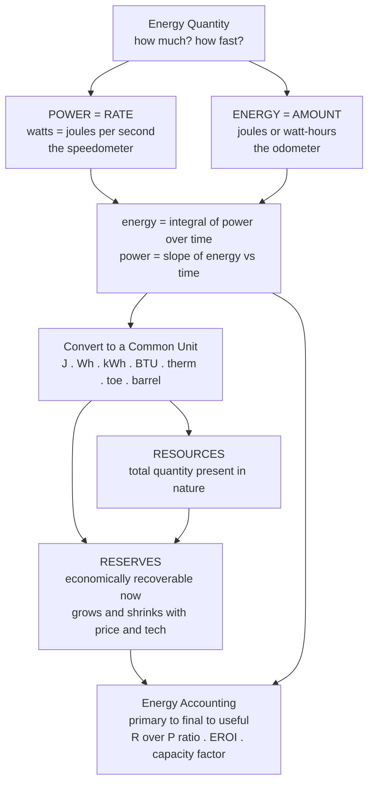

# ⚡ Energy Resources, Units, and Accounting

> [!abstract] TL;DR
> Talking about energy is a units minefield, and the single most important distinction is between **power** (a *rate* — how fast energy moves, measured in watts) and **energy** (an *amount* — how much total, measured in joules or watt-hours). Energy is the integral of power over time. Once you can convert cleanly between joules, kWh, BTU, therms, and tonnes of oil equivalent — and once you separate the energy that *exists* in nature (**resources**) from the fraction we can economically extract (**reserves**) — you can size a battery, compare a solar panel to a nation, and judge whether any energy headline is enormous or trivial. This is the first skill of energy literacy.

---

## Intuition

**Analogy — the speedometer and the odometer.** Your car has two gauges. The **speedometer** reads your *rate* of travel right now (60 mph); the **odometer** reads the *total distance* you have accumulated over the whole trip (300 miles). They measure different kinds of thing, and confusing them is nonsense — "my trip was 60 mph long" makes no sense.

Energy has exactly the same pair. **Power is the speedometer** — the instantaneous rate at which energy flows, measured in **watts** (a plant's capacity, a device's draw). **Energy is the odometer** — the total accumulated amount, measured in **watt-hours** (your monthly bill, a battery's capacity). A 100-watt bulb left on for 10 hours draws energy at a rate of 100 W the whole time, and *accumulates* 100 W × 10 h = **1000 watt-hours = 1 kWh**. The watts are the rate; multiplying by the hours turns the rate into an amount. Get this straight and a fog lifts.

And there is a second accounting question nature poses: not just how fast we use energy, but how much is *there* for us. The oil physically sitting underground (a **resource**) is a very different number from the oil we can actually pump out at a profit with today's technology (a **reserve**) — and that second number shrinks and grows with price and technology. Both distinctions — power/energy and resource/reserve — are where honest energy reasoning begins.

---

## How It Works

### Core Mechanics

1. **Separate the rate from the amount.** Power $P$ has units of energy per time: $1\ \text{watt} = 1\ \text{joule/second}$. Energy $E$ is what you get by *accumulating* power over time.
2. **Energy is the integral of power.** For steady power, $E = P \times t$. For varying power, $E = \int P\,dt$ — literally the *area under the power-versus-time curve*. Conversely, power is the derivative (slope) of energy, $P = dE/dt$.
3. **Convert to a common unit before comparing.** The SI unit is the **joule (J)**. Everyday and industry units are just different-sized joules: the **kilowatt-hour** (electricity), the **BTU** and **therm** (heat and gas), the **calorie** (food and chemistry), the **barrel** and **tonne of oil equivalent / toe** (oil), the **tonne of coal equivalent / tce**. National and global figures use the big SI multiples up to **exajoule (EJ)**.
4. **Mind the scale.** Energy quantities in the real world span roughly **twenty orders of magnitude** — from an AA battery (~10^4 J) to global annual primary energy (~6 × 10^20 J). Always sanity-check the exponent.
5. **Account for the resource base.** **Resources** = the total quantity present in nature. **Reserves** = the technically and economically *recoverable* fraction at current prices and technology. The **reserves-to-production (R/P) ratio** tells you how many years remain at today's extraction rate, and **EROI** (energy return on investment) tells you how much energy a source yields per unit of energy spent getting it.

### Flow / Architecture



---

## Key Concepts

### Secondary Level — power vs energy, and the everyday units

- **Power is a rate, energy is an amount.** Watts (W) for power; watt-hours (Wh) or joules (J) for energy. Saying a battery holds "5 kilowatts" is like saying a trip was "60 mph long" — a category error. A battery holds **kilowatt-hours**; a charger delivers **kilowatts**.
- **The master formula:** $\text{energy} = \text{power} \times \text{time}$. A 2 kW kettle run for 0.1 h uses $2 \times 0.1 = 0.2$ kWh. A 100 W bulb for 10 h uses 1 kWh.
- **The units you'll actually meet:**
  - **kilowatt-hour (kWh)** — the electricity-bill unit. $1\ \text{kWh} = 3.6\ \text{MJ}$.
  - **calorie / kilocalorie** — food and chemistry. The "Calorie" on food labels is a *kilo*calorie ≈ 4184 J.
  - **BTU** — heating and air-conditioning. ≈ 1055 J.
  - **joule (J)** — the SI base unit; lifting an apple ~1 m takes ~1 J.
- **Sanity habit:** before comparing two energy figures, put them in the *same* unit. Most "energy myths" are just a hidden unit mismatch.

### Undergraduate Level — calculus, conversions, and the accounting chain

- **Energy as an integral.** When power varies, $E = \int_{t_0}^{t_1} P(t)\,dt$ = area under the power curve. A household's fluctuating draw over a day integrates to its daily kWh. This is exactly the kind of accumulation handled in [[Applications_of_Integration]], and the joule/work definition comes from [[Work_Energy_and_Conservation]].
- **The conversion table (each unit expressed in joules):**

  | Unit | Joules | Typical use |
  |------|--------|-------------|
  | 1 J | 1 | SI base |
  | 1 Wh | 3.6 × 10³ | small devices |
  | 1 kWh | 3.6 × 10⁶ | electricity bills |
  | 1 BTU | 1.055 × 10³ | HVAC, gas |
  | 1 therm | 1.055 × 10⁸ | natural-gas billing |
  | 1 toe | 4.187 × 10¹⁰ | oil / national stats |
  | 1 barrel of oil | ~6.1 × 10⁹ | oil markets |
  | 1 tce (coal) | ~2.93 × 10¹⁰ | coal statistics |

- **SI multiples for big systems:** kilo (10³), mega (10⁶), giga (10⁹), tera (10¹²), peta (10¹⁵), exa (10¹⁸). Global annual primary energy ≈ **~620 EJ** (exajoules).
- **The energy-accounting chain:** **primary** energy (as extracted — coal, crude oil, sunlight) → **secondary** carriers after conversion (electricity, refined fuels) → **final** energy delivered to the consumer → **useful** energy after end-use efficiency (the light and motion you actually wanted). Losses occur at every arrow.
- **Resources vs reserves.** **Resources** = everything present. **Reserves** = the technically + economically recoverable subset *now*. The **R/P ratio** = reserves ÷ annual production = years remaining at current rates (a snapshot, not a countdown).
- **Capacity factor (preview):** actual energy produced ÷ energy if the plant ran at nameplate power 100% of the time. It is precisely the ratio that converts a *power* rating into an *energy* expectation — a 1 GW wind farm at a 0.35 capacity factor yields $1\ \text{GW} \times 8760\ \text{h} \times 0.35 \approx 3.1$ TWh/yr.

### Graduate Level — accounting conventions, net energy, and stocks vs flows

- **The primary-energy convention problem.** For fossil and nuclear plants, "primary energy" is the fuel's heat content, and conversion efficiency (~33–45%) is baked in. But wind, solar, and hydro produce electricity *directly* with no combustion — so what is their "primary" energy? The **physical-energy-content** method counts only the electricity generated, making renewables look small; the **substitution (partial-substitution)** method inflates them by the fossil fuel they *displace*. Comparing two energy reports without checking which convention they use is a classic source of error — renewables can appear to be 6% or 15% of the mix depending purely on accounting.
- **EROI (Energy Return On Investment)** $= \dfrac{\text{energy delivered}}{\text{energy invested to deliver it}}$. Conventional oil historically ~30:1; tar sands and corn ethanol can fall below ~5:1; a society needs a *net-energy surplus* to run everything that is not energy production itself. Below a rough EROI "cliff" (~7:1), the fraction of GDP consumed just to get energy rises sharply.
- **Exergy vs energy.** The First Law conserves *energy*, but not all joules are equally *useful*. **Exergy** is the maximum work extractable relative to the environment; electricity is nearly pure exergy, low-grade waste heat almost none. "Useful energy" accounting is really exergy accounting — this connects directly to enthalpy/energy balances in [[Energy_Balances_in_Processes]].
- **Stocks vs flows.** Fossil fuels are finite **stocks** (a fixed inventory being drawn down); renewables are diffuse but continuous **flows** (solar, wind, geothermal arrive whether we harvest them or not). The engineering challenge inverts: for stocks it is *depletion and price*, for flows it is *density, intermittency, and capture*.
- **Reserve dynamics and peak oil.** Reserves are not fixed geology — they are an *economic* quantity that grows with higher prices and better technology (reserve growth) and shrinks when prices fall. The **McKelvey box** classifies the resource base along economic-feasibility and geologic-certainty axes. Hubbert's peak-oil model predicts a production maximum from a finite stock; repeated deferrals of the predicted peak illustrate how technology (shale, deepwater) redraws the reserve boundary. The classification of these recoverable fractions is the economic-geology material in [[Economic_Geology_and_Resources]].
- **LCOE (preview).** The **levelized cost of energy** spreads all lifetime costs over all lifetime energy output ($/kWh) — the natural bridge from these physical accounts to energy economics.

---

## Python Demo

```python
# Energy accounting: (1) power integrates to energy, (2) units are just different-sized
# joules, (3) reserves-to-production ratios, and (4) the ~20-order-of-magnitude scale ladder.
import numpy as np
import matplotlib.pyplot as plt

# ---------------------------------------------------------------
# (1) POWER vs ENERGY: integrate a household's power curve over a day
# ---------------------------------------------------------------
hours = np.linspace(0, 24, 24 * 60 + 1)          # one-minute resolution over 24 h
# A synthetic but realistic domestic load: baseline + morning and evening peaks (kW)
base = 0.3
morning = 1.8 * np.exp(-0.5 * ((hours - 7.5) / 1.2) ** 2)
evening = 2.6 * np.exp(-0.5 * ((hours - 19.0) / 1.6) ** 2)
power_kW = base + morning + evening

# Energy is the AREA under the power curve: E = integral of P dt (trapezoidal rule)
daily_energy_kWh = np.trapz(power_kW, hours)     # kW * h = kWh
print(f"Peak power draw : {power_kW.max():.2f} kW   (the 'speedometer')")
print(f"Daily energy    : {daily_energy_kWh:.2f} kWh  (the 'odometer')")
print(f"Same energy in MJ: {daily_energy_kWh * 3.6:.1f} MJ")

# ---------------------------------------------------------------
# (2) UNIT CONVERSION: how many joules are in one of each unit
# ---------------------------------------------------------------
units = ["1 J", "1 Wh", "1 kWh", "1 BTU", "1 therm", "1 toe", "1 barrel", "1 tce"]
joules = np.array([1, 3.6e3, 3.6e6, 1.055e3, 1.055e8, 4.187e10, 6.1e9, 2.93e10])

# ---------------------------------------------------------------
# (3) RESERVES-TO-PRODUCTION RATIO (approx., Energy Institute Statistical Review)
# ---------------------------------------------------------------
fossils = ["Coal", "Oil", "Natural gas"]
rp_years = np.array([139, 54, 49])               # years of reserves at current production

# ---------------------------------------------------------------
# (4) SCALE LADDER: energy quantities spanning ~20 orders of magnitude (joules)
# ---------------------------------------------------------------
ladder = {
    "Lift apple 1 m": 1,
    "AA battery": 1.0e4,
    "Smartphone charge": 5.0e4,
    "Laptop battery": 2.2e5,
    "EV battery 75 kWh": 2.7e8,
    "Barrel of oil": 6.1e9,
    "US home, 1 year": 3.85e10,
    "Hiroshima bomb": 6.3e13,
    "1 GW plant, 1 year": 3.15e16,
    "Global primary, 1 yr": 6.2e20,
}
labels = list(ladder.keys())
vals = np.array(list(ladder.values()))
print(f"\nScale ladder spans ~{np.log10(vals.max() / vals.min()):.0f} orders of magnitude")

# ---------------------------------------------------------------
# PLOTS
# ---------------------------------------------------------------
fig, ax = plt.subplots(2, 2, figsize=(13, 9))

# Panel 1: power curve, shaded area = energy
ax[0, 0].plot(hours, power_kW, color="#c0392b", lw=2)
ax[0, 0].fill_between(hours, power_kW, alpha=0.25, color="#c0392b")
ax[0, 0].set_title(f"Power integrates to Energy\nshaded area = {daily_energy_kWh:.1f} kWh / day")
ax[0, 0].set_xlabel("hour of day"); ax[0, 0].set_ylabel("power draw (kW)")
ax[0, 0].set_xlim(0, 24); ax[0, 0].set_xticks(range(0, 25, 4)); ax[0, 0].grid(alpha=0.3)

# Panel 2: unit conversion (log scale)
ax[0, 1].barh(units, joules, color="#2980b9")
ax[0, 1].set_xscale("log")
ax[0, 1].set_title("Energy units are just different-sized joules")
ax[0, 1].set_xlabel("joules per unit (log scale)")
ax[0, 1].grid(axis="x", which="both", alpha=0.3)

# Panel 3: reserves-to-production ratio
bars = ax[1, 0].bar(fossils, rp_years, color=["#34495e", "#7f8c8d", "#95a5a6"])
ax[1, 0].set_title("Reserves-to-Production ratio\n(years remaining at current output)")
ax[1, 0].set_ylabel("years")
for b, y in zip(bars, rp_years):
    ax[1, 0].text(b.get_x() + b.get_width() / 2, y + 1, str(y), ha="center")
ax[1, 0].grid(axis="y", alpha=0.3)

# Panel 4: scale ladder (log scale)
ax[1, 1].barh(labels, vals, color="#16a085")
ax[1, 1].set_xscale("log")
ax[1, 1].set_title("The ~20-order-of-magnitude energy ladder")
ax[1, 1].set_xlabel("energy (joules, log scale)")
ax[1, 1].grid(axis="x", which="both", alpha=0.3)

plt.tight_layout()
plt.show()
# fig.savefig("energy_accounting.png", dpi=130, bbox_inches="tight")
```

Running it prints the peak power (rate) versus the day's accumulated energy (amount), confirms the scale ladder spans ~20 orders of magnitude, and draws four panels: power-integrated-to-energy, the joules-per-unit conversion chart, the fossil R/P ratios, and the AA-battery-to-global-consumption ladder.

---

## Real-World Applications

> **Energy Institute (formerly BP) Statistical Review of World Energy.** The single most-cited energy dataset converts every country's coal, oil, gas, nuclear, hydro, and renewables into a *common* unit — **exajoules (EJ)** and **million tonnes of oil equivalent (Mtoe)** — precisely so that a barrel of Saudi crude and a terawatt-hour of Norwegian hydro can be added on one page. It also publishes the **reserves-to-production ratios** that headline every "years of oil left" story. The Review's footnotes about *how* renewables are converted to primary energy are a live example of the accounting-convention problem.

Other everyday touch-points:
- **Your electricity bill** is charged in **kWh** (energy), while your service's breaker is rated in **amps/kW** (power) — the two limits are independent, which is why a house can hit its power limit without using much energy, and vice versa.
- **Battery and EV specs** quote capacity in **kWh** (how far) and charging in **kW** (how fast) — the same odometer/speedometer pair, and confusing them is the most common EV-spec mistake.
- **Grid planning** uses **capacity factor** to turn a wind farm's nameplate **GW** into expected annual **TWh**, and **LCOE** to compare $/kWh across sources.
- **Climate and policy** targets are stated in EJ and Gtoe; getting the unit and the primary-energy convention right is what separates a credible decarbonization scenario from an arithmetic mirage.

---

## Common Pitfalls

- **Confusing power with energy (kW vs kWh).** The number-one error. "A 10 kW solar array" is a *rate*; what it *delivers* is $10\ \text{kW} \times \text{sun-hours}$ = kWh. Always ask: is this a watt (rate) or a watt-hour (amount)?
- **"Kilowatts per hour."** Almost always wrong. Power is already energy-per-time; "kW per hour" would be a *rate of change of power*. People mean either kW (power) or kWh (energy).
- **Mixing unit families silently.** Adding therms of gas to kWh of electricity without converting, or comparing a country's toe to another's BTU, produces nonsense. Convert everything to joules first.
- **Treating reserves as fixed geology.** Reserves are an *economic* quantity that grows with price and technology; an R/P ratio of "50 years" is a snapshot at today's price and output, not a doomsday clock.
- **Ignoring the accounting layer (primary vs final vs useful).** "The world uses ~620 EJ of primary energy" overstates *delivered* service, because conversion and end-use losses discard well over half of it before it does anything useful. Compare like with like.
- **Forgetting the primary-energy convention for renewables.** Depending on the method (physical-content vs substitution), the same solar output can appear several-fold larger or smaller — check the convention before citing a share.
- **EROI blindness.** A fuel can be abundant yet a poor *net*-energy source; low-EROI resources deliver far less usable surplus than their gross output suggests.

---

## Related Concepts

- [[Work_Energy_and_Conservation]] — the physics origin of the **joule** and the work–energy definition that underlies every unit on this page.
- [[Applications_of_Integration]] — energy as the **integral of power over time** (area under the power curve) is a textbook application of the definite integral.
- [[Energy_Balances_in_Processes]] — chemical-engineering **energy accounting** via enthalpy balances; the same primary/final/useful bookkeeping applied to a process unit, and the natural home of the exergy/quality distinction.
- [[Economic_Geology_and_Resources]] — the geology behind **resources vs reserves**: how ore and fossil deposits are classified and which fraction is economically recoverable.

Within this vault (siblings, prose-only): this note is the measurement backbone for **Energy_Systems_Overview** (the map of the whole vault), **Forms_and_Conversion_of_Energy** (which forms these units quantify), **The_Global_Energy_System_and_Demand** (where the EJ/Mtoe accounting is applied at planetary scale), **Fossil_Fuels_and_Combustion** (the energy content and reserves of the fuels), and **Energy_Economics_and_Markets** (where LCOE and capacity factor turn joules into dollars).

---

## Review Questions

1. **(Secondary)** A 1500 W space heater runs for 3 hours. How much energy does it use, in kWh and in MJ? Explain why "the heater uses 1500 W per hour" is a meaningless statement.
2. **(Undergraduate)** A household's power draw is roughly 0.3 kW overnight and peaks at 3 kW in the evening. Sketch how you would compute the *daily* energy in kWh from the power curve, and name the mathematical operation involved. Then convert that daily energy into BTU and into barrels-of-oil-equivalent.
3. **(Undergraduate/Graduate)** Coal has an R/P ratio of ~139 years and oil ~54 years. Does this mean coal will "last" nearly three times as long as oil? Give at least two reasons the R/P ratio is a poor predictor of when a resource actually runs out.
4. **(Graduate)** Two reports state that renewables supply "6%" and "15%" of world primary energy for the same year. Without any data error, how can both be correct? Identify the accounting convention responsible and explain which method each report likely used.
5. **(Graduate)** A fuel is abundant (high reserves) but has an EROI of 3:1, while a scarcer fuel has an EROI of 25:1. Argue, in net-energy terms, why abundance alone does not make the first fuel a good foundation for an energy system.

---

## Sources

- MacKay, D. *Sustainable Energy — Without the Hot Air* (2009), UIT Cambridge. — the definitive treatment of energy units and back-of-envelope reasoning; free at withouthotair.com.
- Smil, V. *Energy: A Beginner's Guide* (2017), Oneworld. — power vs energy, primary/final/useful energy, and scale.
- Tester, J. et al. *Sustainable Energy: Choosing Among Options* (2nd ed., 2012), MIT Press. — resources vs reserves, R/P ratios, EROI, and system accounting.
- Energy Institute (formerly BP), *Statistical Review of World Energy* (annual). — global energy data in common units, reserves and R/P ratios. energyinst.org.
- U.S. Energy Information Administration, *Energy Units and Calculators / Monthly Energy Review*. — authoritative conversion factors (BTU, toe, kWh, joules). eia.gov.

---

#energy-systems #power-vs-energy #units #reserves #EROI
