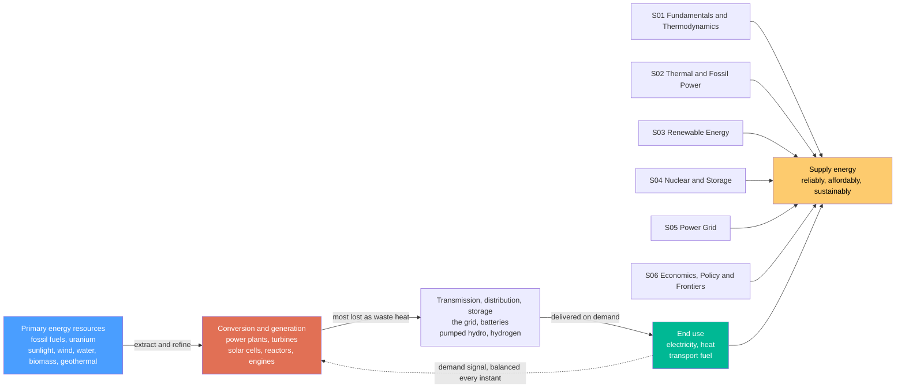

# ⚡ Energy Systems Overview: How Civilization Finds, Converts, and Delivers Power

> [!abstract] TL;DR
> **Energy is the ability to make things happen** — to move, heat, light, and power everything civilization does — and an **energy system** is the vast, mostly invisible machine that finds energy in nature, converts it into useful forms, moves it to where it is needed, and delivers it the instant you flip a switch. Follow the electricity from a wall socket *backwards* and you traverse a continent-spanning chain: wires → substations → transmission lines → a power plant burning gas or spinning in the wind, all **balanced second-by-second so supply exactly meets demand**. This note is the **hub of the Energy Systems vault**, which covers the whole chain across six pillars: **(1) Fundamentals & Thermodynamics**, **(2) Thermal & Fossil Power**, **(3) Renewable Energy**, **(4) Nuclear & Storage**, **(5) the Power Grid**, and **(6) Economics, Policy & Frontiers**. Three ideas run through all of it: the **energy trilemma** (be reliable, affordable, *and* sustainable at once), the tyranny of the **second law** (most primary energy is lost as waste heat — roughly two-thirds is rejected before it does anything useful), and the **energy transition** — rebuilding the entire global energy system to run on clean power without carbon, fast enough to stop climate change, while keeping the lights on for eight billion people. It is arguably the largest, most cross-cutting engineering challenge in history.

## Intuition

**Analogy:** Think of energy as the universal *currency* that buys every action in the modern world — every heated home, moving truck, lit screen, and running factory is "paid for" in joules — and think of the **energy system** as the enormous, hidden banking-and-logistics machine that mines that currency out of nature, mints it into spendable forms, and couriers it to your door the very instant you ask. When you flip a switch, you are placing an order that ripples backwards across a continent: down the wall wire, out to a neighborhood transformer, up onto high-voltage transmission lines, and all the way to a generator that must, *within seconds*, push a little harder to cover your demand. Nobody stockpiles electricity in a warehouse — it is manufactured and delivered in the same instant it is consumed, everywhere, all the time.

Now zoom out. That courier network is fed at one end by **primary energy resources** dug, pumped, or harvested from nature — buried sunlight in coal, oil, and gas; live sunlight on solar panels; wind, falling water, uranium, biomass, and the Earth's own heat — and it terminates at the other end in the **services** we actually want: warmth, light, motion, and computation. **Energy systems engineering is the discipline of designing and running this machine.** And right now it faces the defining task of the century: the same combustion that built the industrial world is also the single largest source of the greenhouse gases warming the planet, so the machine must be **rebuilt to run on clean power** — fast enough to matter, cheaply enough to be fair, and reliably enough that the lights never go out for the billions who depend on them.

---

## How It Works

### Core Mechanics

An energy system is a **chain of transformations** that turns raw nature into delivered service, and every link imposes its own losses and constraints:

1. **Primary energy resources — what nature offers.** The chain begins with energy that already exists in the world: **fossil fuels** (coal, oil, natural gas — ancient sunlight stored as chemical bonds), **nuclear fuel** (uranium, and one day fusion fuel), and **renewable flows** (sunlight, wind, falling water, biomass, geothermal heat). Fossil and nuclear are *stocks* you deplete; renewables are *flows* you harvest as they arrive. This is the terrain of pillars **S01–S04**.

2. **Conversion & generation — turning it into something useful.** Almost nothing is used in its raw form. **Power plants** burn fuel to boil water and spin steam turbines (thermal/fossil, **S02**); **nuclear reactors** do the same with fission heat (**S04**); **solar cells** turn photons straight into electricity, **wind turbines** turn moving air into shaft work, **hydro** turbines turn falling water into power (renewables, **S03**). Here the **second law of thermodynamics** takes its cut: any heat engine is capped by the Carnot limit and *must* dump waste heat, so a typical thermal plant throws away roughly **two-thirds of its fuel energy** before a single electron reaches the wire.

3. **Transmission, distribution & storage — moving it and buffering it.** Electricity is transmitted at **hundreds of kilovolts** (high voltage means low current, and line loss scales as $I^2R$, so high voltage means far less loss), then stepped down through substations to neighborhood feeders and finally into buildings — the **grid**, pillar **S05**. Because electricity cannot be cheaply stockpiled, the system either matches generation to demand *instant by instant*, or leans on **storage** — batteries, **pumped hydro**, thermal stores, hydrogen (**S04**) — to shift energy across time.

4. **End use — the service delivered.** The chain terminates in the three great categories of demand: **electricity** (lighting, motors, electronics), **heat** (space heating, industrial process heat), and **transport fuel** (mobility). This is where efficiency ultimately counts, because losses *compound multiplicatively* down the whole chain — source-to-service.

5. **The balancing act.** Above the physical chain sits a control problem: **supply must equal demand continuously, at scale, reliably, affordably, and now sustainably.** These goals pull against each other — the **energy trilemma** — and reconciling them under the constraint of decarbonization is the substance of pillar **S06** (energy markets, policy, efficiency, access, and the net-zero transition).

The **units** matter: **energy** is a quantity (joules, kilowatt-hours; nations consume *exajoules*, $10^{18}$ J, per year), while **power** is the *rate* of energy flow (watts, kilowatts, gigawatts). A 1 GW plant running flat-out for a year delivers about 8.8 TWh — power tells you how fast, energy tells you how much.

### Flow / Architecture



---

## Key Concepts

### Secondary Level

- **Energy makes things happen.** Anything that moves, heats, lights, or runs needs energy. We do not *create* it — we only *convert* it from one form to another (chemical in fuel, motion in a turbine, electricity in a wire, heat in a home).
- **An energy system is a delivery chain.** Nature (coal, sunlight, wind, uranium) → a power plant that converts it → wires and pipes that move it → your home, car, and phone. Every step of the chain is engineering.
- **You cannot store much electricity.** Power plants must make electricity at the *exact moment* people use it. When a city switches on its air conditioners, generators far away must instantly work harder.
- **Most energy is wasted as heat.** When a power plant burns fuel, only about *one-third* becomes electricity — the rest escapes as warm exhaust and hot water. This waste is a law of nature, not bad engineering.
- **We are changing what powers the world.** For 200 years we burned coal, oil, and gas — but that burning warms the planet. So the world is switching to clean energy (sun, wind, water, nuclear) — the **energy transition** — which is one of the biggest projects humanity has ever attempted.

### Undergraduate Level

- **Primary vs final vs useful energy.** *Primary* energy is what we extract from nature (a barrel of oil, a kilogram of uranium); *final* energy is what reaches the consumer (electricity at the meter, gasoline at the pump); *useful* energy is the service actually delivered (light, motion, warmth). Losses compound at every conversion, so useful energy is a *fraction* of primary — globally, roughly **one-third of primary energy ends up as useful service**.
- **Power vs energy, and the units.** Power (W, kW, MW, GW) is the rate; energy (J, kWh, MWh, and at national scale the **exajoule**, $10^{18}$ J, or the **quad**) is the accumulated amount. Confusing the two is the single most common energy error: a "100 MW battery" tells you nothing until you also know its MWh capacity.
- **Capacity factor.** Nameplate power $\times$ hours in a year is the *theoretical* maximum output; the **capacity factor** is the fraction actually delivered. Nuclear runs at ~90%, combined-cycle gas ~55%, onshore wind ~35%, solar PV ~15–25% — which is why installed *capacity* and delivered *energy* are very different rankings.
- **The energy trilemma.** Every energy decision balances three competing goals: **security/reliability** (keep the lights on), **affordability/equity** (energy people can pay for, and access for all), and **sustainability** (low carbon and low pollution). Optimizing one usually stresses another; policy is the art of navigating the trade-off.
- **Conversion efficiency and the second law.** No heat engine beats the **Carnot limit** $\eta_{max} = 1 - T_C/T_H$; real thermal plants land at 33–60%, dumping the rest as low-grade waste heat. This single constraint explains why the whole system is so "leaky" and why *electrification* (motors and heat pumps that sidestep combustion) is such a powerful efficiency lever.
- **Supply must equal demand — continuously.** Grid frequency (60 Hz in the Americas, 50 Hz elsewhere) is the real-time balance signal: it dips when demand outruns supply and rises when it exceeds it. Because electricity is barely stored, **matching a variable supply to a variable demand** is the central operational problem — and it gets harder as intermittent wind and solar grow.
- **The energy mix.** Today's world primary energy is still **~80% fossil** (oil, coal, gas), with nuclear, hydro, and modern renewables (wind, solar, bioenergy) making up the rest. Electricity is *decarbonizing* fastest; heat and transport lag, because they are harder to electrify.

### Graduate Level

- **Exergy vs energy — quality, not just quantity.** The first law conserves energy *quantity*; the second law degrades its *quality*. **Exergy** is the maximum useful work a stream can still deliver relative to the ambient dead state. Burning a 2000 K flame merely to warm a room to 20 °C is a first-law "success" but an *exergy catastrophe* — an enormous quality mismatch that heat pumps and cogeneration exist to fix. Honest systems analysis optimizes where **exergy is destroyed** ($\dot X_{dest} = T_0\,\dot S_{gen}$), not merely where energy goes.
- **The systems-integration problem.** Generation, transmission, storage, and demand are *interdependent*: adding variable renewables shifts value from energy to **flexibility** (fast ramping, storage, demand response, interconnection). Deep decarbonization is less a generation problem than a **whole-system optimization** across timescales — seconds (inertia, frequency regulation), hours (batteries, pumped hydro), and seasons (hydrogen, thermal, synthetic fuels).
- **Sector coupling and electrification.** The dominant decarbonization strategy is to **electrify everything** electrifiable (transport via EVs at ~90% drivetrain efficiency vs ~25% for internal combustion; heat via heat pumps at COP 3–4) and clean the electricity supply — then use those flexible electric loads to help balance the grid. Hard-to-electrify sectors (aviation, shipping, steel, cement) push toward **power-to-X** (hydrogen, ammonia, e-fuels) and carbon capture.
- **Levelized metrics and system value.** **LCOE** (levelized cost of energy) collapses capital, fuel, and O&M into a per-MWh figure, but it *hides* when and where energy is produced; **LCOS** (storage), **value-adjusted LCOE**, and **system LCOE** correct for the fact that a MWh at peak in a constrained node is worth far more than a MWh of curtailed midday solar. Marginal-cost merit-order dispatch, the "duck curve," and negative prices all follow from these dynamics.
- **EROEI, life-cycle emissions, and material limits.** Sustainability is not just operating carbon: **energy return on energy invested (EROEI)**, cradle-to-grave **life-cycle assessment**, and **critical-material** constraints (lithium, cobalt, copper, rare earths) decide whether a technology is *net* beneficial and *scalable*. A renewable system trades fuel risk for **materials and land** risk.
- **The transition as a coupled techno-economic-political system.** Net-zero is not a single technology but a decades-long reconfiguration entangling physics, economics, incumbency, and policy: carbon pricing, subsidies, learning curves (solar and batteries have fallen ~90% in a decade via Wright's-law cost declines), stranded-asset risk, energy justice, and the geopolitics of both fossil fuels and critical minerals. The **rate** of change — not just the endpoint — is the binding constraint.
- **The scale problem.** Global primary energy demand is ~600 EJ/yr and still growing with population and development. Decarbonizing it means building clean generation, grids, and storage at a pace and scale with **no historical precedent** — the reason energy systems engineering is as much about deployment logistics and finance as about device physics.

---

## Python Demo

```python
# Energy Systems Overview in one figure: WHAT the system runs on, HOW MUCH it
# wastes, and WHERE it is heading. numpy + matplotlib only.
#
#   (a) THE ENERGY MIX   -- world PRIMARY energy by source (fossil vs nuclear
#                           vs renewables): what actually powers civilization.
#   (b) THE ENERGY FLOW  -- a source-to-service bar showing that only ~1/3 of
#                           primary energy becomes useful service; ~2/3 is
#                           rejected as waste heat (the second-law "toll").
#   (c) THE TRANSITION   -- the historical + projected rise of clean energy's
#                           share of electricity: the defining shift of the era.
import numpy as np
import matplotlib.pyplot as plt

# ---- (a) World primary energy mix (approximate recent shares, percent) ----
mix = {
    "Oil":            30.0,
    "Coal":           26.0,
    "Natural gas":    23.0,   # fossil subtotal ~ 79 percent
    "Nuclear":         4.0,
    "Hydro":           7.0,
    "Wind + Solar":    6.0,
    "Bioenergy/other": 4.0,
}
colors = ["#3d3d3d", "#6b4f2a", "#e07b39", "#8338ec",
          "#2a9d8f", "#00b894", "#94d82d"]
fossil = mix["Oil"] + mix["Coal"] + mix["Natural gas"]
lowcarbon = 100.0 - fossil
print("=== (a) WORLD PRIMARY ENERGY MIX ===")
for k, v in mix.items():
    print(f"  {k:16s} {v:5.1f}%")
print(f"  -> fossil total   ~ {fossil:.0f}%")
print(f"  -> low-carbon     ~ {lowcarbon:.0f}% (nuclear + renewables)")

# ---- (b) Source-to-service flow: useful vs rejected energy ----
useful, rejected = 33.0, 67.0   # ~1/3 of primary energy ends as useful service
print("\n=== (b) SOURCE-TO-SERVICE ENERGY FLOW ===")
print(f"  primary energy in : 100")
print(f"  useful service out: {useful:.0f}   rejected as waste: {rejected:.0f}")

# ---- (c) The transition: clean share of electricity over time ----
year = np.array([1990, 2000, 2010, 2020, 2023, 2030, 2040, 2050])
clean_share = np.array([32, 35, 33, 38, 40, 55, 74, 90], dtype=float)  # percent
is_hist = year <= 2023

# ------------------------------- plotting -------------------------------
fig, (axA, axB, axC) = plt.subplots(1, 3, figsize=(17, 5.5))
fig.suptitle("Energy Systems: what powers the world, how much it wastes, "
             "and where it is going", fontsize=13, fontweight="bold")

# (a) energy mix -- horizontal stacked bar
left = 0.0
for (k, v), c in zip(mix.items(), colors):
    axA.barh(0, v, left=left, color=c, edgecolor="white", label=f"{k}  {v:.0f}%")
    if v >= 5:
        axA.text(left + v / 2, 0, f"{v:.0f}", va="center", ha="center",
                 color="white", fontsize=8, fontweight="bold")
    left += v
axA.set_xlim(0, 100)
axA.set_ylim(-0.6, 0.6)
axA.set_yticks([])
axA.set_xlabel("share of world primary energy  [percent]")
axA.set_title(f"(a) The energy mix\nstill ~{fossil:.0f}% fossil today", fontsize=11)
axA.legend(loc="upper center", bbox_to_anchor=(0.5, -0.18),
           ncol=4, fontsize=7, frameon=False)

# (b) source-to-service flow -- one bar splitting into useful vs rejected
axB.bar(0, useful, color="#00b894", label="useful service ~1/3")
axB.bar(0, rejected, bottom=useful, color="#e76f51", alpha=0.9,
        label="rejected waste heat ~2/3")
axB.text(0, useful / 2, f"{useful:.0f}%\nuseful", ha="center", va="center",
         color="white", fontsize=10, fontweight="bold")
axB.text(0, useful + rejected / 2, f"{rejected:.0f}%\nwaste heat",
         ha="center", va="center", color="white", fontsize=10, fontweight="bold")
axB.set_xlim(-1.2, 1.2)
axB.set_ylim(0, 100)
axB.set_xticks([])
axB.set_ylabel("share of primary energy  [percent]")
axB.set_title("(b) The 2nd-law toll\nmost primary energy is lost", fontsize=11)
axB.legend(loc="upper right", fontsize=8)

# (c) the transition -- clean share of electricity over time
axC.plot(year[is_hist], clean_share[is_hist], "o-", color="#2a9d8f",
         lw=2.5, label="historical")
axC.plot(year[~is_hist], clean_share[~is_hist], "o--", color="#8338ec",
         lw=2.5, label="net-zero projection")
axC.axvspan(2023, 2050, color="#8338ec", alpha=0.06)
axC.axhline(100, color="k", lw=1, alpha=0.3)
axC.annotate("the energy\ntransition",
             xy=(2040, 74), xytext=(2028, 50), fontsize=9, color="#8338ec",
             arrowprops=dict(arrowstyle="->", color="#8338ec"))
axC.set_xlabel("year")
axC.set_ylabel("clean share of electricity  [percent]")
axC.set_ylim(0, 105)
axC.set_title("(c) The transition\nclean power scaling up", fontsize=11)
axC.grid(alpha=0.3)
axC.legend(loc="lower right", fontsize=8)

plt.tight_layout(rect=[0, 0, 1, 0.93])
plt.show()
```

Running this prints the numbers and draws three panels that summarize the whole field. **Panel (a)** shows what actually powers civilization: even now the world's **primary energy is roughly 80% fossil** (oil, coal, gas), with nuclear and renewables making up the low-carbon remainder — the starting line of the transition. **Panel (b)** makes the **second-law toll** tangible: of every 100 units of primary energy the system extracts, only about **one-third emerges as useful service** while **two-thirds is rejected as waste heat** — the "leak" that dominates energy engineering and the biggest single argument for electrification and efficiency. **Panel (c)** is the **energy transition** itself: the clean share of electricity, roughly flat for decades, now bends sharply upward in net-zero pathways — the defining trajectory this vault exists to explain. Together the three panels frame the mission: *shrink the orange waste, swap the fossil mix for clean sources, and do it fast.*

---

## Real-World Applications

> **Example — the electricity grid as the whole system in miniature.** Trace one appliance's power back through the chain and the entire discipline appears at once. Your kettle draws from a wall socket fed by a **distribution** feeder, stepped down from a **transmission** line running at hundreds of kilovolts, which carries power from a mix of **generators** — a gas combined-cycle plant here, a wind farm there, a nuclear reactor providing steady baseload, solar flooding in at midday. A control room watches the **grid frequency** and, the instant national demand ticks up, commands plants to ramp so supply matches load *within seconds*. When the wind drops or the sun sets, **storage** (pumped hydro, batteries) and flexible plants fill the gap. Every pillar of this vault — thermodynamic limits on the plants (**S01–S02**), the renewable and nuclear generators (**S03–S04**), the grid and storage that deliver and balance (**S04–S05**), and the markets and policy that decide what gets built and dispatched (**S06**) — is visible in that single cup of tea.

- **National energy planning and the transition.** Governments and bodies like the **International Energy Agency** model whole-system pathways to net-zero, sizing how much wind, solar, nuclear, grid, and storage must be built and how fast — the systems-level version of everything in this vault.
- **Data-center and AI energy demand.** Hyperscale computing is now a first-order load driving new generation and grid upgrades, forcing operators to co-locate compute with clean power and manage massive, flexible demand.
- **Industrial decarbonization.** Steel, cement, and chemicals need high-temperature heat and feedstocks that resist electrification, pushing hydrogen, carbon capture, and process redesign — the hard frontier of pillar **S06**.
- **Electrification of transport and buildings.** EVs and heat pumps move demand from liquid fuels and gas onto the electric grid, coupling the transport and heating "sectors" into the power system and reshaping demand curves.
- **Rural electrification and energy access.** For the ~700 million people without reliable electricity, distributed solar-plus-battery microgrids leapfrog the century-old central-grid model — the *equity* corner of the trilemma made concrete.
- **Grid-scale storage and flexibility markets.** Batteries, pumped hydro, and demand response are increasingly traded as distinct products (frequency regulation, capacity, arbitrage) — the market machinery that lets a renewable-heavy grid stay balanced.

---

## Common Pitfalls

- **Confusing power with energy.** A "500 MW" plant or "100 MW battery" states a *rate*, not an *amount*; without hours (MWh) you cannot compare them or size a system. This is the single most common error in energy discussions.
- **Comparing capacity instead of delivered energy.** Because of **capacity factors** (solar ~20%, wind ~35%, nuclear ~90%), 1 GW of solar and 1 GW of nuclear deliver *wildly* different annual energy. Rank by energy (kWh) and cost per kWh, not nameplate.
- **Forgetting the second law ("just make it 100% efficient").** Heat engines are capped by Carnot and *must* reject waste heat; roughly two-thirds of thermal primary energy is lost before use. "Waste-free" combustion is a perpetual-motion fantasy — the lever is *how much* is wasted and whether the waste is *recovered* (cogeneration) or *avoided* (electrification).
- **Counting energy, not exergy.** "Energy is never lost" is true and misleading: quantity is conserved, but *quality* degrades. Using high-grade electricity or a hot flame for a low-grade task (tepid space heat) is thermodynamically wasteful even when it looks "efficient" on a first-law spreadsheet.
- **Ignoring the systems nature — optimizing one piece in isolation.** A "cheap" solar MWh is worthless if produced at midday when demand is low and the grid is congested; a "zero-emission" EV is only clean if the grid behind it is. Generation, grid, storage, and demand are *interdependent* — the answer is always a whole-system one.
- **Treating storage as free or lossless.** Every store has round-trip losses (batteries ~90%, pumped hydro ~75%, hydrogen far less) plus embodied energy and materials; storage buys firmness at a real efficiency and resource cost.
- **Believing efficiency alone cuts total energy or emissions (Jevons/rebound).** Cheaper energy services can *increase* consumption, partially offsetting savings. Decarbonization needs efficiency **plus** clean supply **plus**, often, demand-side measures — no single lever suffices.
- **Mistaking the endpoint for the problem — ignoring the *rate*.** "Net-zero by 2050" is a destination; the binding constraint is *how fast* we can build clean generation, grids, storage, and supply chains without breaking affordability or reliability. Speed, finance, and materials — not just device physics — decide whether the transition succeeds.

---

## Related Concepts

This note is the **hub of the Energy Systems vault**. The vault develops the full energy chain across six sibling pillars, each opened by its own note: **Fundamentals & Thermodynamics** (*Forms_and_Conversion_of_Energy* — energy forms, conversion, the laws and limits, exergy, and global demand), **Thermal & Fossil Power** (*Fossil_Fuels_and_Combustion* — combustion, steam and gas plants, cogeneration, carbon capture, emissions), **Renewable Energy** (*Solar_Photovoltaics* alongside wind, hydro, geothermal, and bioenergy), **Nuclear & Storage** (*Nuclear_Fission_Power* with fusion, batteries, pumped hydro, thermal, and hydrogen), the **Power Grid** (*The_Electric_Power_Grid* — integrating renewables, smart grids, transmission, stability, electrification), and **Economics, Policy & Frontiers** (*Energy_Economics_and_Markets*, closing with *The_Reach_and_Future_of_Energy_Systems* — decarbonization policy, efficiency, access, and the net-zero transition). Those sibling notes are referenced here in prose; the cross-vault links below point to notes that already exist elsewhere in the vault.

**Physics foundation — the laws that set the limits**
- [[Laws_of_Thermodynamics]] — the first law (energy is conserved, only converted) that every link in the chain obeys, and the second law that forces the waste-heat rejection and caps every heat engine at the Carnot limit
- [[Entropy_and_Second_Law]] — entropy generation is *why* real conversions fall below the ideal and why exergy (energy quality) is destroyed; the microscopic root of the "two-thirds lost as heat" toll

**Electrical & power engineering — where energy becomes electricity and how the grid copes**
- [[Power_Systems_and_the_Grid]] — the transmission-and-distribution machine that delivers generation to load and balances supply and demand every instant; pillar S05 seen from the electrical side
- [[Renewable_Energy_Integration]] — the intermittency, storage, and flexibility problem of putting variable wind and solar onto the grid — the operational heart of the transition

**Mechanical & sustainability engineering — the conversion machinery and its efficiency**
- [[Sustainable_and_Energy_Systems_Engineering]] — the thermodynamics-meets-decarbonization view: Carnot limits, exergy, heat pumps, waste-heat recovery, and the efficiency levers of the transition, complementing this note's systems-level framing

**Climate — why it matters**
- [[Anthropogenic_Climate_Change]] — energy production is the largest source of greenhouse-gas emissions, so decarbonizing the energy system is the central task for limiting warming; this vault is the engineer's response to that driver

---

## Review Questions

**Secondary**
1. A friend says, "Electricity comes from the wall socket, so the socket is where it is made." Trace the energy *backwards* from the socket to its origin in nature, naming at least four stages, and explain why nobody keeps a big warehouse of stored electricity ready to use. Then explain why, when a power plant burns fuel, only about one-third of the energy actually reaches you as electricity.

**Undergraduate**
2. A region can meet a new 1 GW average demand with either (a) nuclear plants at a 90% capacity factor or (b) solar farms at a 20% capacity factor. (i) How much *nameplate* capacity of each must be built to deliver the same annual *energy*, and why is this the wrong pair of numbers to compare on their own? (ii) Explain the **energy trilemma** and describe one way each option stresses a different corner of it. (iii) Using the idea that only ~1/3 of primary energy becomes useful service, explain why *electrifying* transport and heating can cut total primary-energy demand even before the grid itself is decarbonized.

**Graduate**
3. A country commits to a net-zero electricity system built mainly on wind and solar. (a) Explain, using the distinction between energy and **exergy** and the second law, why the *value* of a MWh depends on *when and where* it is produced, and why LCOE alone is an inadequate planning metric. (b) The variable supply now needs balancing across seconds, hours, and seasons — match appropriate technologies to each timescale and discuss the round-trip-efficiency and embodied-material penalties each imposes. (c) Argue why the **rate** of the transition, rather than its endpoint, is the binding engineering constraint, and identify at least three non-physics factors (finance, materials, policy, incumbency, equity) that a complete systems strategy must integrate.

---

## Sources

- J. Tester, E. Drake, M. Driscoll, M. Golay & W. Peters — *Sustainable Energy: Choosing Among Options*, 2nd ed. (MIT Press, 2012) — the definitive systems survey of every energy option
- D. J. C. MacKay — *Sustainable Energy — Without the Hot Air* (UIT Cambridge, 2008; free at withouthotair.com) — quantitative, no-nonsense arithmetic of the energy transition
- G. Boyle (ed.) — *Renewable Energy: Power for a Sustainable Future*, 3rd ed. (Oxford University Press, 2012)
- International Energy Agency — *World Energy Outlook* (annual) — global energy data, scenarios, and net-zero pathways
- V. Smil — *Energy and Civilization: A History* (MIT Press, 2017) — how energy systems built and constrain human societies

---

#energy-systems #energy-transition #power-generation #renewables #grid
