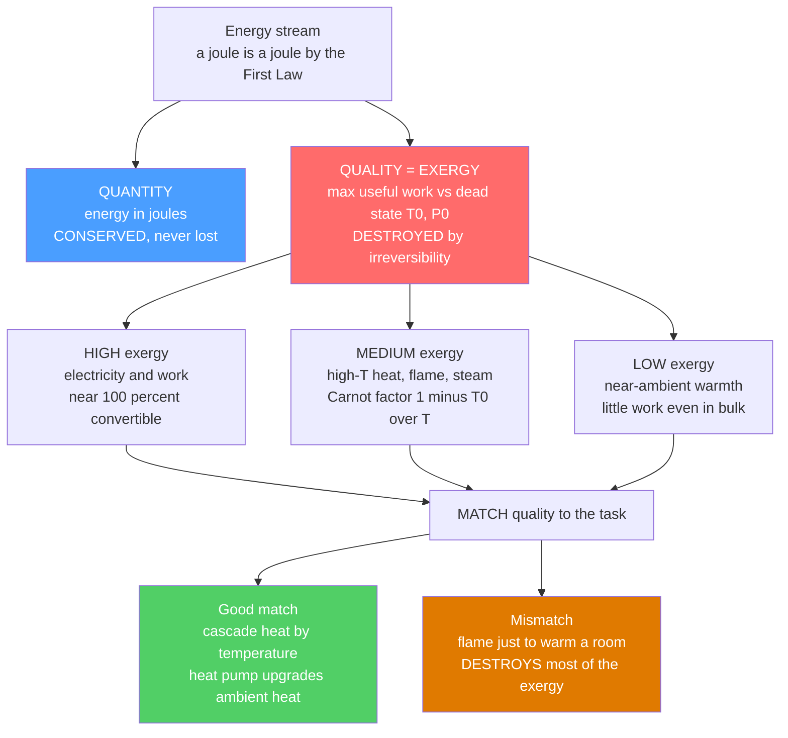

# 💎 Exergy and Energy Quality

> [!abstract] TL;DR
> Energy has two dimensions: **quantity** (joules — conserved forever by the first law) and **quality** (how much of it can actually become *useful work* — governed by the second law). **Exergy** (a.k.a. *availability*) is the measure of that quality: the **maximum useful work** you could extract from an energy stream as it comes to equilibrium with the environment (a reference **dead state** $T_0, P_0$). Electricity and mechanical work are **pure exergy** (100 percent convertible); high-temperature heat carries a Carnot fraction $1 - T_0/T$ of its energy as exergy; but **low-temperature heat near ambient has almost no exergy** even in enormous amounts. Unlike energy, **exergy is destroyed** by irreversibility (combustion, friction, heat transfer across large temperature gaps, throttling, mixing) at rate $\dot X_{dest} = T_0\,\dot S_{gen}$. An exergy balance pinpoints *where* the useful potential is really lost — waste that energy-only accounting hides as harmless "waste heat" — and it delivers the central design rule: **match energy quality to the task.** Burning a 2000 K flame to warm a room to 20 C destroys most of the fuel's exergy (a chainsaw to butter toast), which is precisely why **heat pumps, cogeneration, cascading, and waste-heat recovery** matter, and why exergy is the sophisticated lens behind efficient system design and decarbonization.

## Intuition

**Analogy:** Not all energy is created equal. A kilowatt-hour of **electricity** is worth far more than a kilowatt-hour of **lukewarm water**, even though they hold the same number of joules. The difference is **quality** — how much *useful work* the energy can actually do. Electricity is **pure gold**: it can become anything — motion, heat, light — with near-perfect efficiency. High-temperature heat is **silver**: a large fraction of it can become work. But low-temperature heat — the warmth of a room, a tepid pond — is nearly **worthless** for doing work, even in huge quantities, because thermodynamics simply will not let you extract it. **Exergy** is the measure of this quality: the maximum useful work you could squeeze out of a given lump of energy.

And here is the profound waste it exposes: **burning gas at 2000 degrees just to heat a house to 20 degrees is like using a chainsaw to butter toast** — you have destroyed an enormous amount of exergy to accomplish a task that needed almost none. Thinking in *exergy*, not just *energy*, shows where we are really wasting the good stuff — and it is the smart way to design efficient energy systems.

---

## How It Works

### Core Mechanics

1. **Keep two ledgers, not one.** Every energy stream has a **quantity** (joules, tracked by the first law and *always conserved*) and a **quality** (exergy, tracked by the second law and *destroyed* whenever something irreversible happens). Energy-only accounting sees only the first ledger and therefore hides real waste as harmless "waste heat."

2. **Define exergy against a dead state.** Exergy is always measured *relative to the environment* — a reference **dead state** at ambient $T_0$ and $P_0$. It is the **maximum useful work** a stream can deliver as it is brought reversibly into complete equilibrium with that environment. A stream already at the dead state has **zero exergy**: there is nothing left to extract.

3. **Rank the grades of energy.** **Work and electricity are pure exergy** — 100 percent convertible. **Chemical fuels** are high-exergy (their chemical exergy is close to their heating value). **Heat carries only a fraction of its energy as exergy** — the **Carnot factor** $\phi = 1 - T_0/T$: it approaches 1 for very hot heat but collapses toward **zero** as $T \to T_0$. So near-ambient heat is *low-exergy energy* no matter how many joules it contains — the reason "waste heat" is genuinely low-grade.

4. **Exergy is destroyed by irreversibility.** Unlike energy, exergy is **not conserved**. Combustion, friction, throttling, mixing, and — crucially — **heat transfer across a large temperature gap** all generate entropy and *destroy* exergy. The **Gouy-Stodola theorem** quantifies it: $\dot X_{dest} = T_0\,\dot S_{gen} \ge 0$. An **exergy balance** therefore does what an energy balance cannot: it points to *exactly which component* is squandering the useful potential.

5. **Score with second-law efficiency.** First-law (energy) efficiency $\eta_I$ compares energy out to energy in and can look flattering (a gas furnace is 90 percent *energy*-efficient). **Second-law / exergetic efficiency** $\eta_{II} = $ (useful exergy out) / (exergy in) tells the honest story — that same furnace is often under 10 percent *exergy*-efficient for low-temperature heating.

6. **Match quality to the task.** The master design rule falls straight out: use high-exergy sources for high-exergy needs, and never spend a high grade where a low grade suffices. **Cascade** energy by temperature (cogeneration: make power from high-T heat first, then use the leftover low-T heat for warmth), **upgrade** ambient heat with a little work (heat pumps), and **recover** waste heat instead of dumping it.

### Flow / Architecture



---

## Key Concepts

### Secondary Level

- **Same joules, different worth.** One kWh of electricity can run a motor, a lamp, or a heater; one kWh stored as lukewarm water can barely do anything but warm things slightly. Both are 3.6 million joules — but only the electricity is genuinely *useful*.
- **Quality means "how much can become work."** Electricity and burning fuel are **high quality**; heat near room temperature is **low quality**. Exergy is the name for the *useful part* — the most work you could ever get out.
- **Hotter heat is better heat.** The same amount of heat is far more valuable at 1000 C than at 30 C, because you can run an engine off the hot heat but almost nothing off the tepid heat.
- **"Waste heat" is real waste of quality, not quantity.** The warm exhaust from an engine or factory still holds plenty of *joules*, but very little *exergy* — that is why it is hard to reuse.
- **The big rule:** do not use gold to do a job that copper could do. Burning a hot flame just to keep a room at 20 C throws away the flame's quality — the chainsaw-to-butter-toast waste.

### Undergraduate Level

- **The dead state.** Exergy is defined *relative to the environment* $(T_0, P_0)$. At the dead state, exergy $= 0$. Choosing $T_0$ (typically ~288–298 K) matters: exergy values shift with the assumed ambient.
- **Exergy of heat (thermal exergy).** Heat $Q$ available at temperature $T$ carries exergy
  $$X_{Q} = Q\left(1 - \frac{T_0}{T}\right).$$
  The bracket is the **Carnot factor**: it $\to 1$ as $T \to \infty$ and $\to 0$ as $T \to T_0$. Near-ambient heat is almost pure "anergy" (the useless complement of exergy).
- **Exergy of work / electricity.** Pure exergy: $X_W = W$ (Carnot factor of 1). This is why electricity is the premium energy currency.
- **Flow exergy of a stream.** For an open control volume, the specific flow exergy is
  $$\psi = (h - h_0) - T_0\,(s - s_0) + \tfrac{1}{2}V^2 + gz,$$
  the maximum work obtainable per unit mass as the stream relaxes to the dead state.
- **Exergy is destroyed, energy is not.** The exergy balance for a control volume is
  $$\underbrace{\sum \dot X_{in}}_{\text{heat, work, mass}} - \sum \dot X_{out} - \dot X_{dest} = \frac{dX_{cv}}{dt},\qquad \dot X_{dest} = T_0\,\dot S_{gen} \ge 0.$$
  The **Gouy-Stodola** term $T_0\,\dot S_{gen}$ is the exergy annihilated by internal irreversibility.
- **Two efficiencies, two stories.** First-law $\eta_I = E_{out}/E_{in}$; second-law $\eta_{II} = X_{out,useful}/X_{in}$. A 90 percent-*energy*-efficient boiler heating a 21 C room can be only ~2 percent *exergy*-efficient — the gap is the exergy quietly destroyed by burning a flame to make barely-warm heat.

### Graduate Level

- **Four components of exergy.** Total exergy = **physical (thermomechanical)** + **chemical** + kinetic + potential. Physical exergy vanishes at $(T_0, P_0)$; **chemical exergy** vanishes only at full chemical equilibrium with the environment. Standard **chemical exergy** tables (Szargut) give fuels a chemical exergy close to their lower heating value (natural gas $\approx 1.04 \times$ LHV; the exergy-to-LHV ratio is near unity for most hydrocarbons).
- **Destruction vs loss.** **Exergy destruction** is *internal* irreversibility ($T_0 S_{gen}$); **exergy loss** is exergy carried *out* of the boundary in a waste stream to the environment (hot flue gas, cooling water). A complete accounting tracks both; conflating them is a classic error.
- **Component-level diagnosis.** In a fossil power plant, first-law analysis blames the condenser (it dumps ~60 percent of the *energy*). Exergy analysis tells the truth: the **combustor/boiler destroys the most exergy** — combustion is deeply irreversible and heat crosses an enormous $\Delta T$ from a ~2000 K flame to ~800 K steam. The condenser's *energy* loss is huge but its *exergy* content is small (the heat is near ambient). This inversion is the entire reason exergy analysis exists.
- **Cascading and cogeneration.** Combined heat and power (CHP) extracts **work from high-T heat first**, then routes the rejected **low-T heat** to space or process heating — using each grade of energy at its own quality level. Exergy analysis quantifies the gain over separate generation and boiler heating.
- **Heat pumps as exergy upgraders.** A heat pump spends a little **exergy (work)** to lift a large flow of low-exergy **ambient heat** to a slightly higher, useful temperature. The reversible bound is $\mathrm{COP}_{HP} = T_H/(T_H - T_C)$, which for a 21 C room against a 15 C ambient is ~49 — showing how *little* work is thermodynamically required, and how far real COPs of 3–5 still sit below the ideal.
- **Exergoeconomics (thermoeconomics).** Assign monetary cost to exergy streams so that plants can be optimized where exergy destruction has a *price*; combined with cumulative-exergy and life-cycle (extended-exergy) methods, this grounds sustainability metrics in the second law rather than raw energy tallies.
- **Link to free energy.** For an isothermal-isobaric process at $(T_0, P_0)$, the maximum non-expansion (useful) work equals the decrease in **Gibbs free energy** — connecting exergy to the [[Thermodynamic_Potentials]] and to [[Chemical_Process_Thermodynamics]].

---

## Python Demo

```python
# Exergy and energy quality in one figure.
#
#   LEFT  panel -> EXERGY FRACTION OF HEAT vs TEMPERATURE
#       The fraction of a heat stream that is genuinely useful work is the
#       Carnot factor  phi(T) = 1 - T0/T  (T0 = ambient dead state).
#       Near-ambient heat has ~0 exergy; a hot flame ~85 percent; pure
#       electricity/work sits at 100 percent (a horizontal reference).
#
#   RIGHT panel -> EXERGY DESTRUCTION for a mismatched task
#       Task: deliver 1 kW of 21 C space heat. The exergy the task ACTUALLY
#       needs is tiny (Carnot factor of a 21 C room ~2 percent). Three supply
#       options pour in wildly different amounts of exergy; the gap above the
#       dashed "exergy actually needed" line is exergy DESTROYED -- the waste
#       an energy-only analysis completely hides.
#
# Requires: numpy, matplotlib
import numpy as np
import matplotlib.pyplot as plt

T0     = 288.15   # K, dead-state / ambient temperature (15 C)
T_room = 294.15   # K, delivered space-heat temperature (21 C)

# ---------- (a) exergy fraction of heat vs temperature ----------
T   = np.linspace(T0, 2300.0, 500)
phi = 1.0 - T0 / T                 # Carnot factor = exergy fraction of heat

streams = {                        # label : (temperature K, colour)
    "space heat 21 C": (T_room, "#1f77b4"),
    "hot water 60 C":  (333.15, "#17becf"),
    "steam ~430 C":    (700.0,  "#ff7f0e"),
    "flame ~1730 C":   (2000.0, "#d62728"),
}

# ---------- (b) exergy needed vs supplied to heat a room ----------
phi_room = 1.0 - T0 / T_room       # exergy fraction of 21 C heat (~0.020)
Q_heat   = 1.0                     # kW of heat delivered to the room
X_needed = Q_heat * phi_room       # minimum (reversible) exergy for the task

fuel_exergy_factor = 0.93          # fuel chemical exergy per unit heating value
eta_boiler = 0.90                  # gas boiler energy efficiency
COP_hp     = 4.0                   # heat-pump coefficient of performance

options = {                        # label : exergy supplied (kW)
    "Electric\nresistance": 1.0 * Q_heat,                     # 1 kW electricity = 1 kW exergy
    "Gas boiler\n90 pct":   (Q_heat / eta_boiler) * fuel_exergy_factor,
    "Heat pump\nCOP 4":     Q_heat / COP_hp,                  # electricity in = pure exergy
}

print("=== exergy to deliver 1 kW of 21 C space heat (T0 = 15 C) ===")
print(f"  exergy the task actually needs : {X_needed*1000:6.1f} W")
for name, X_in in options.items():
    destroyed = X_in - X_needed
    eta_II    = X_needed / X_in
    tag = name.replace(chr(10), ' ')
    print(f"  {tag:22s}: supply {X_in*1000:7.1f} W   destroy {destroyed*1000:7.1f} W   eta_II {100*eta_II:5.1f} pct")

# ------------------------------ plotting ------------------------------
fig, (axL, axR) = plt.subplots(1, 2, figsize=(14, 6))
fig.suptitle("Exergy and Energy Quality: same joules, very different usefulness",
             fontsize=14, fontweight="bold")

# LEFT: exergy fraction of heat vs temperature
axL.plot(T, 100 * phi, color="#2a9d8f", lw=2.5,
         label="exergy fraction of heat  1 - T0/T")
axL.axhline(100, color="#6a4c93", lw=2.0, ls="--",
            label="electricity / work = pure exergy")
axL.fill_between(T, 0, 100 * phi, color="#2a9d8f", alpha=0.10)
for lab, (Ts, col) in streams.items():
    ys = 100 * (1.0 - T0 / Ts)
    axL.scatter([Ts], [ys], color=col, zorder=5, s=45)
    axL.annotate(f"{lab}\n{ys:.0f} pct", xy=(Ts, ys),
                 xytext=(Ts + 60, ys - 7), fontsize=8, color=col)
axL.set_xlabel("temperature of the heat  T  [K]   (dead state T0 = 288 K)")
axL.set_ylabel("useful-work fraction  [percent]")
axL.set_title("(a) heat quality climbs with temperature", fontsize=11)
axL.set_ylim(0, 106)
axL.legend(loc="upper left", fontsize=8)
axL.grid(alpha=0.3)

# RIGHT: exergy destruction bar chart
labels   = list(options.keys())
supplied = np.array([options[k] for k in labels])
xpos     = np.arange(len(labels))
axR.bar(xpos, 1000 * supplied, color=["#d62728", "#e07a00", "#2a9d8f"],
        alpha=0.85, label="exergy supplied")
axR.axhline(1000 * X_needed, color="k", lw=2.0, ls="--",
            label=f"exergy actually needed ~ {1000*X_needed:.0f} W")
for i, s in enumerate(supplied):
    axR.annotate(f"destroyed\n{1000*(s - X_needed):.0f} W",
                 xy=(i, 1000 * s), xytext=(i, 1000 * s + 25),
                 ha="center", fontsize=8)
axR.set_xticks(xpos)
axR.set_xticklabels(labels, fontsize=9)
axR.set_ylabel("exergy  [W]  to deliver 1 kW of 21 C heat")
axR.set_title("(b) mismatch destroys exergy energy analysis hides", fontsize=11)
axR.set_ylim(0, 1200)
axR.legend(loc="upper right", fontsize=8)
axR.grid(alpha=0.3, axis="y")

plt.tight_layout(rect=[0, 0, 1, 0.95])
plt.show()
```

The **left panel** plots the exergy fraction of heat, $\phi = 1 - T_0/T$, against temperature: near the ambient dead state it hugs **zero** (tepid heat is nearly worthless), a 60 C hot-water tank offers only ~14 percent, steam ~59 percent, a ~2000 K flame ~86 percent — and **electricity sits at the 100 percent ceiling** as pure exergy. The **right panel** exposes the hidden waste: to deliver 1 kW of 21 C space heat, the task *actually needs* only ~20 W of exergy (dashed line), yet an **electric resistance heater pours in 1000 W** and a **gas boiler ~1030 W** — destroying ~98 percent of it — while a **heat pump** at COP 4 needs just 250 W, roughly **four times more exergy-efficient** because it *upgrades* free ambient heat instead of manufacturing warmth from scratch. Energy analysis would call the resistance heater "100 percent efficient"; exergy analysis reveals it as one of the most wasteful ways to heat a building.

---

## Real-World Applications

> **Example:** **Cogeneration (combined heat and power) and district energy** are exergy-matching made industrial. A standalone power plant burns a ~2000 K flame, extracts work down to ~40 percent efficiency, and dumps the rest as low-exergy warm water — a colossal *quantity* of energy but small *exergy*. A CHP plant instead **cascades by temperature**: it takes the work from the high-grade heat first, then delivers the rejected low-grade heat (still 80–120 C) through a **district heating** network to warm thousands of buildings. Each grade of energy is used at its own quality level, pushing total fuel utilization above 80 percent and slashing exergy destruction versus running a power plant and a field of boilers separately.

- **Power-plant diagnosis.** Exergy analysis famously overturns first-law intuition: the biggest *exergy* destroyer in a fossil plant is the **combustor/boiler** (irreversible combustion plus heat transfer across a giant $\Delta T$), not the condenser — so raising firing temperature and combined cycles buy far more than polishing the low-grade end.
- **Heat pumps for buildings.** Because space heating needs almost no exergy, a heat pump that *upgrades ambient heat* with a little electricity (COP 3–5) is exergetically several times better than resistance heating or combustion — the core thermodynamic case for **electrifying heat**.
- **Low-temperature district heating (4th generation).** Distributing heat at 40–60 C instead of 90+ C reduces the exergy content of the delivered heat to match the low-exergy demand, cutting losses and enabling waste-heat and renewable sources.
- **Industrial waste-heat recovery.** Recuperators, economizers, and bottoming Organic Rankine Cycles recapture exergy from flue gas before it degrades to ambient — reusing medium-grade heat instead of destroying it.
- **Cryogenics and LNG.** Very cold streams carry **"cold exergy"** (the Carnot factor is positive below ambient too); LNG regasification can recover it to drive power or refrigeration rather than wasting it.

These themes recur across this section's companion notes on *Thermodynamics of Energy Conversion*, *Forms and Conversion of Energy*, *Cogeneration and District Energy*, *Energy Efficiency and Demand Management*, and *Thermal and Chemical Energy Storage* — where exergy is the common yardstick of how well each system matches quality to task.

---

## Common Pitfalls

- **Confusing energy efficiency with exergy efficiency.** A gas furnace at "90 percent efficiency" can be under 10 percent *exergy*-efficient for low-temperature heating. The first number flatters; the second is the honest measure of how much *useful potential* survived.
- **Believing "energy is never lost" means "no waste."** The first law conserves *quantity*; the second law degrades *quality*. Waste heat still contains energy — it simply can no longer do useful work. Exergy, not energy, is the currency of "what can still be done."
- **Treating ambient heat as valuable.** A huge tank of 25 C water near a 20 C environment holds enormous *joules* but almost **zero exergy** — you cannot run an engine off it. Quantity without quality is not a useful energy resource.
- **Forgetting or misreading the dead state.** Exergy is meaningless without a specified $(T_0, P_0)$. Values shift with the chosen ambient, and a stream can only be driven "downhill" to that dead state — never below it for free.
- **Conflating exergy destruction with exergy loss.** *Destruction* is internal irreversibility ($T_0 S_{gen}$); *loss* is exergy leaving in a waste stream to the environment. A correct balance tracks both separately.
- **Assuming exergy is conserved.** It is not. Unlike energy, exergy is *destroyed* by every real (irreversible) process — that destruction is the whole point of the analysis.
- **Blaming the condenser instead of the combustor.** Following the first-law "biggest loss" leads you to the low-grade heat dump; the second law shows the real thermodynamic damage happens in combustion and high-$\Delta T$ heat transfer.
- **Approximating fuel exergy carelessly.** Chemical exergy is close to, but not equal to, the heating value; for detailed accounting use standard chemical-exergy values rather than plugging in the LHV.

---

## Related Concepts

**Physics vault — the second-law foundations**
- [[Entropy_and_Second_Law]] — entropy generation is exactly what *destroys* exergy; $\dot X_{dest} = T_0\,\dot S_{gen}$ is the Gouy-Stodola bridge from entropy to lost work
- [[Laws_of_Thermodynamics]] — the first law conserves the *quantity* of energy while the second law governs its *quality*; exergy fuses the two into one accounting
- [[Thermodynamic_Potentials]] — Gibbs and Helmholtz free energies are the maximum-useful-work potentials that exergy generalizes to an arbitrary environment

**Engineering vaults — where exergy is applied**
- [[Engineering_Thermodynamics]] — the ME companion that introduces exergy, second-law efficiency, and the Gouy-Stodola theorem in cycle and control-volume analysis
- [[Chemical_Process_Thermodynamics]] — chemical exergy of fuels and the link between maximum useful work and Gibbs free energy in reacting systems

**Information Theory vault — the shared root of "quality"**
- [[Entropy_in_Thermodynamics_and_Statistical_Mechanics]] — the entropy that limits both information and available work, tying exergy destruction to the deeper physics of irreversibility

---

## Review Questions

**Secondary**
1. You have two energy sources of *exactly the same* number of joules: a car battery (electricity) and a large tank of lukewarm water. Which one could power a fan, and why does having the same joules not make them equally useful? Explain what "energy quality" means in your own words.

**Undergraduate**
2. Heat is available as (a) 1 kJ from a 1500 K furnace and (b) 1 kJ from 40 C water, with the environment at $T_0 = 290$ K. (i) Compute the exergy of each using the Carnot factor $1 - T_0/T$. (ii) A 90 percent-*energy*-efficient gas boiler delivers heat to a 22 C room in a 5 C ambient — estimate its *exergetic* efficiency and explain the enormous gap between the two efficiency numbers. (iii) Why is a heat pump exergetically superior for the same task?

**Graduate**
3. A first-law audit of a coal power plant reports that the **condenser** rejects ~60 percent of the input energy and the **combustor** loses "only a few percent," concluding the condenser is the place to improve. (a) Using exergy concepts, explain why this conclusion is wrong and identify where the *exergy* is actually destroyed. (b) Apply the Gouy-Stodola relation $\dot X_{dest} = T_0\,\dot S_{gen}$ to argue quantitatively why combustion and high-$\Delta T$ heat transfer dominate exergy destruction. (c) Explain how *cascading* (combined cycles, cogeneration) attacks the real losses that the first-law view misses, and why the condenser's large *energy* loss carries little *exergy*.

---

## Sources

- A. Bejan — *Advanced Engineering Thermodynamics*, 4th ed. (Wiley, 2016) — exergy, entropy generation minimization, Gouy-Stodola theorem
- M. J. Moran, H. N. Shapiro, D. D. Boettner & M. B. Bailey — *Fundamentals of Engineering Thermodynamics*, 9th ed. (Wiley, 2018) — exergy (availability) chapter
- I. Dincer & M. A. Rosen — *Exergy: Energy, Environment and Sustainable Development*, 3rd ed. (Elsevier, 2021)
- Y. A. Cengel & M. A. Boles — *Thermodynamics: An Engineering Approach*, 9th ed. (McGraw-Hill, 2019) — exergy and second-law efficiency
- J. Szargut, D. R. Morris & F. R. Steward — *Exergy Analysis of Thermal, Chemical, and Metallurgical Processes* (Hemisphere, 1988) — standard chemical exergy reference

---

#energy-systems #exergy #energy-quality #second-law #availability
