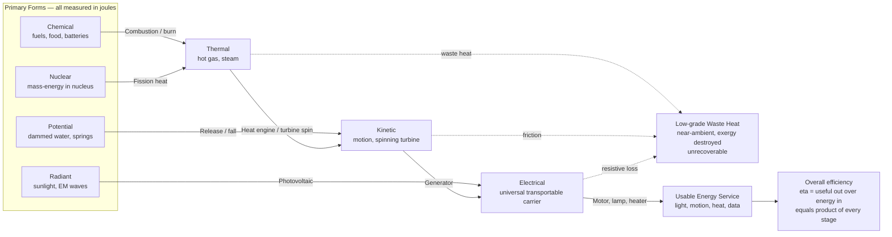

# ⚡ Forms and Conversion of Energy

> [!abstract] TL;DR
> **Energy comes in a handful of currencies** — **chemical** (fuels, food, batteries), **nuclear** (mass-energy in the nucleus), **kinetic/mechanical** (motion), **potential** (dammed water, springs), **thermal** (heat), **electrical** (moving charge), and **radiant** (sunlight) — all interconvertible, all measured in **joules**, all conserved by the **first law**. Every energy technology is a **chain of conversions** from a primary resource to a useful form: burn (chemical to thermal), spin (thermal to mechanical), generate (mechanical to electrical), and deliver (electrical to light, motion, or heat). Each stage has a **conversion efficiency** = useful out / energy in, and the **overall efficiency is the product** of every stage — so fewer, higher-quality steps win. The catch is the **second law**: conversions through heat can never be perfect (the **Carnot limit**), and every step spills some energy as low-grade **waste heat** that can never be recovered. Understanding the forms, their conversions, and the **energy-density** tradeoffs between carriers is the foundation of all energy engineering and every decarbonization choice.

## Intuition

**Analogy:** Energy is like **water that can take many shapes** — it never disappears, it just keeps **pouring from one bucket into another**. The chemical energy locked in coal **pours into heat** when you burn it; the heat pours into the **motion** of steam and a spinning turbine; the motion pours into **electricity** in a generator; the electricity pours into **light** in a bulb. Every power technology is really just a clever chain of these pourings — a sequence of energy **conversions** from the form nature gives us to the form we can use.

The catch, and it is a big one: **every time you pour energy from one bucket to another, some spills as useless waste heat and can never be scooped back up.** So the whole game of energy engineering is stringing together conversions that **spill as little as possible** — because the fewer the steps and the smaller the spills, the more of nature's energy actually does useful work, and the less fuel (and emissions) a service costs.

---

## How It Works

### Core Mechanics

1. **The forms are the currencies.** Nature hands us energy in **primary** forms — the **chemical** bonds of fossil fuels and biomass, the **nuclear** binding energy of uranium, the **radiant** flux of sunlight, the **kinetic** energy of wind and flowing water, the **gravitational potential** of elevated or dammed water, and geothermal **thermal** energy. All are measured in the same unit, the **joule** ($1\ \text{J} = 1\ \text{N·m} = 1\ \text{W·s}$), and the first law guarantees they are freely interconvertible in principle — energy is conserved, never created or destroyed.

2. **Electricity is the universal intermediary.** Among all the forms, **electrical energy** is the one we can transport almost losslessly over long distances, switch instantly, and reconvert into nearly any other form on demand. That is why so many conversion chains funnel *through* electricity: it is the flexible hub of the modern energy system, even though it must always be **generated** from another form (it is a **carrier**, not a primary resource).

3. **A technology is a chain of conversions.** Each device performs one transformation: **combustion** (chemical to thermal), a **heat engine or turbine** (thermal to mechanical), a **generator** (mechanical to electrical), a **photovoltaic** cell (radiant to electrical), **electrolysis / fuel cells** (electrical to/from chemical), a **motor** (electrical to mechanical), a **lamp** (electrical to radiant), and a **resistive heater** (electrical to thermal). A real power plant or appliance is several of these bolted in series.

4. **Efficiency multiplies down the chain.** Each stage has an efficiency $\eta_i = E_{\text{useful,out}} / E_{\text{in}}$. Because each stage feeds the next, the **overall** efficiency is the **product**:
$$\eta_{\text{overall}} = \eta_1 \cdot \eta_2 \cdots \eta_n = \prod_{i=1}^{n} \eta_i.$$
Products of fractions shrink fast: a five-stage chain of 0.9-each stages delivers only $0.9^5 \approx 0.59$. This is why **short chains and high-quality stages** dominate good design.

5. **The second law taxes every pour.** Any stage that passes through **heat** is bounded by the **Carnot limit** $\eta_{\max} = 1 - T_C/T_H$ (tie to [[Engineering_Thermodynamics]] and [[Entropy_and_Second_Law]]), and *every* real stage generates entropy and sheds some energy as **low-grade waste heat**. That waste heat still exists (first law), but it is at near-ambient temperature and can do almost no work — its **quality** (exergy) is destroyed. The engineering distinction between **high-quality** energy (work, electricity) and **low-quality** energy (near-ambient heat) is what conversion is really trading away.

6. **Carriers differ by energy density.** Once converted, energy must be **stored and moved** as a carrier — electricity, a fuel, or heat. Fuels are ranked by **energy density**: energy per **mass** (gravimetric, MJ/kg) and per **volume** (volumetric, MJ/L). Liquid hydrocarbons pack roughly **46 MJ/kg**; the best batteries about **0.9 MJ/kg** — a ~50x gap that explains why fossil fuels dominate transport and why batteries are heavy for aviation. Keep **power** (rate, watts) distinct from **energy** (amount, joules or kWh): a carrier can hold a lot of energy yet deliver it slowly, or vice versa.

### Flow / Architecture



---

## Key Concepts

### Secondary Level

- **Energy has forms, and they swap into each other.** Chemical energy in food, motion energy in a moving ball, heat energy in a warm room, light energy from the Sun — the same "stuff" wearing different clothes. Burning, spinning, and generating are just ways of changing its outfit.
- **Energy is never lost, but it can be wasted.** The first law says the total always adds up. Yet after every change, some energy ends up as **warmth** you cannot use — spread out and cooled to room temperature. That is why a phone gets warm and a car engine needs a radiator.
- **Everything is measured in joules.** One food Calorie is about 4184 joules; one kWh (a unit on your electricity bill) is 3.6 million joules. Because all forms share the unit, you can compare a battery to a tank of gasoline directly.
- **Efficiency is "how much you actually get."** A car turns only about a quarter of its fuel's energy into motion; an old light bulb turned only about 5 percent of its electricity into light. The rest became waste heat.

### Undergraduate Level

- **Chain efficiency is a product, not an average.** For stages in series, $\eta_{\text{overall}} = \prod_i \eta_i$. A single poor stage (an incandescent bulb at 0.05) can dominate the whole result no matter how good the others are — the reason a coal-to-incandescent-light chain delivers under 2 percent of the coal's energy as light.
- **Heat is the bottleneck form.** Converting **to** heat is easy and near-100-percent (a resistive heater); converting **from** heat to work is capped by **Carnot** $\eta_{\max}=1-T_C/T_H$, typically 40 to 60 percent for real plants. This asymmetry — first law says energy is conserved, second law says heat-to-work is limited — is the core of energy engineering. See [[Laws_of_Thermodynamics]].
- **Energy vs power vs energy density.** Energy (J, kWh) is a **quantity**; power (W = J/s) is a **rate**; energy density (MJ/kg, MJ/L) is quantity **per unit mass or volume**. A carrier's suitability depends on all three plus cost: aviation needs high gravimetric density (fuel weight is lifted), grid storage cares more about cost per kWh.
- **Direct vs indirect conversion.** A generator converts mechanical to electrical *indirectly* through Faraday induction; a photovoltaic or fuel cell or thermoelectric converts *directly* with no moving heat-engine stage — often dodging the Carnot ceiling but facing their own material limits (e.g., the Shockley-Queisser limit for single-junction PV).
- **Exergy is the "useful" bookkeeping.** Energy is conserved (first law) but **exergy** — the maximum work extractable relative to the ambient environment — is *destroyed* at every irreversible step. Electricity is nearly 100 percent exergy; waste heat at 30 C is nearly 0 percent. Efficiency measured in exergy exposes where the real losses hide.

### Graduate Level

- **First law vs second law framing of a converter.** A steady-flow converter obeys $\dot{E}_{\text{in}} = \dot{E}_{\text{out}}$ (energy balance) *and* $\dot{S}_{\text{gen}} \ge 0$ (entropy production). The **first-law efficiency** $\eta_I = \dot{W}_{\text{useful}}/\dot{E}_{\text{in}}$ can be high while the **second-law (exergetic) efficiency** $\eta_{II} = \dot{X}_{\text{out}}/\dot{X}_{\text{in}}$ is low — e.g., a natural-gas furnace burning a 2000 K flame to heat a 50 C room has $\eta_I \approx 0.9$ but $\eta_{II} \approx 0.1$, a huge quality mismatch that a heat pump would recover.
- **Why chains funnel through electricity — despite the Carnot toll.** Electricity is the highest-quality bulk carrier (near-pure exergy, near-lossless transport, instant switching), so systems accept a Carnot-limited heat-to-electricity stage to gain that flexibility downstream. The rise of **direct** solar PV and wind (mechanical/radiant straight to electrical, no combustion) removes the thermal bottleneck entirely, which is a structural efficiency advantage of the renewable transition.
- **Energy density and the transport hierarchy.** Gravimetric density sets the ceiling for **flight** (payload fraction), volumetric for **shipping and range**, and cost per kWh for **stationary storage**. Hydrogen has the highest gravimetric density of any chemical fuel (~142 MJ/kg) yet dismal volumetric density even compressed or liquefied (~5 to 8.5 MJ/L vs diesel's ~38), which is why hydrogen is bulky and hard to store despite being "energy-dense" by mass.
- **Emergy and full-chain accounting.** Decarbonization decisions require tracing the *entire* chain — primary-energy input, conversion losses at each stage, delivered service, and life-cycle emissions per unit service — not just the device rating. The same "efficient" motor is only as clean as the electricity feeding it; the useful metric is **primary energy (and CO2) per unit of delivered service**, which the chain-product efficiency directly determines.

---

## Python Demo

```python
# Forms and conversion of energy: (a) how useful energy DWINDLES down a
# conversion chain (overall efficiency = product of stages), and (b) the
# energy DENSITY of carriers that explains fuel choices.
import numpy as np
import matplotlib.pyplot as plt

# =====================================================================
# (a) CONVERSION CHAIN & EFFICIENCY
# Each stage keeps only a fraction eta_i of the energy it receives, so the
# useful energy still surviving is the RUNNING PRODUCT of stage efficiencies.
# Overall efficiency = product of all stages.
# =====================================================================

# LONG, LOSSY chain: coal lump -> incandescent light bulb
long_stages = [
    ("Primary coal",      1.00),   # 100 units of chemical energy in
    ("Combustion",        0.88),   # chemical  -> thermal
    ("Boiler + turbine",  0.45),   # thermal   -> mechanical (Carnot-limited)
    ("Generator",         0.98),   # mechanical-> electrical
    ("Grid delivery",     0.93),   # electrical-> electrical (transmitted)
    ("Incandescent bulb", 0.05),   # electrical-> visible light
]

# SHORT, EFFICIENT chain: modern gas plant -> LED lamp
short_stages = [
    ("Primary gas",   1.00),
    ("CCGT plant",    0.60),       # chemical -> electrical (combined cycle)
    ("Grid delivery", 0.93),
    ("LED lamp",      0.40),       # electrical -> visible light
]

def running_useful(stages):
    """Percent of primary energy still useful AFTER each stage."""
    effs = np.array([e for _, e in stages])
    return np.cumprod(effs) * 100.0            # running product, as percent

long_names  = [n for n, _ in long_stages]
short_names = [n for n, _ in short_stages]
long_useful  = running_useful(long_stages)
short_useful = running_useful(short_stages)

print(f"Long  chain overall efficiency: {long_useful[-1]:.2f}%")
print(f"Short chain overall efficiency: {short_useful[-1]:.2f}%")

# =====================================================================
# (b) FORMS & ENERGY DENSITY
# Gravimetric (MJ/kg) and volumetric (MJ/L) density of common carriers.
# Fossil fuels ~46 MJ/kg; best batteries ~0.9 MJ/kg -> ~50x heavier.
# =====================================================================
#   name                     grav MJ/kg   vol MJ/L
carriers = [
    ("Hydrogen 700 bar",        142.0,       4.8),
    ("Liquid hydrogen",         142.0,       8.5),
    ("Natural gas CNG",          53.0,       9.0),
    ("Gasoline",                 46.0,      34.0),
    ("Diesel",                   45.6,      38.0),
    ("Coal",                     30.0,      20.0),
    ("Wood, dry",                16.0,      10.0),
    ("Li-ion battery",            0.90,      2.4),
    ("Lead-acid battery",         0.14,      0.4),
    ("Flywheel, steel",           0.20,      0.5),
]
c_names = [c[0] for c in carriers]
c_grav  = np.array([c[1] for c in carriers])
c_vol   = np.array([c[2] for c in carriers])

# ---------------------------------------------------------------------
# PLOTS
# ---------------------------------------------------------------------
fig, ax = plt.subplots(2, 2, figsize=(14, 10))

# (1) Waterfall of the long chain: useful energy dwindling stage by stage
ax1 = ax[0, 0]
x = np.arange(len(long_names))
ax1.bar(x, long_useful, color="#4a9eff", edgecolor="black", label="useful energy left")
waste = np.concatenate([[0.0], long_useful[:-1] - long_useful[1:]])
ax1.bar(x, waste, bottom=long_useful, color="#ff6b6b", alpha=0.75,
        edgecolor="black", label="spilled as waste heat this stage")
for xi, v in zip(x, long_useful):
    ax1.text(xi, v + 2, f"{v:.1f}%", ha="center", fontsize=8, fontweight="bold")
ax1.set_xticks(x); ax1.set_xticklabels(long_names, rotation=30, ha="right", fontsize=8)
ax1.set_ylabel("Percent of primary energy")
ax1.set_title("(a) Coal to incandescent light: useful energy dwindles")
ax1.legend(fontsize=8); ax1.grid(True, axis="y", alpha=0.3)

# (2) Overall efficiency: short efficient chain vs long lossy chain
ax2 = ax[0, 1]
ax2.plot(range(len(long_useful)), long_useful, "o-", color="#ff6b6b",
         label=f"long chain ({long_useful[-1]:.1f}%)")
ax2.plot(range(len(short_useful)), short_useful, "s-", color="#51cf66",
         label=f"short chain ({short_useful[-1]:.1f}%)")
ax2.set_xlabel("Conversion stage index")
ax2.set_ylabel("Useful energy remaining (%)")
ax2.set_title("(b) Fewer, higher-quality stages win")
ax2.legend(); ax2.grid(True, alpha=0.3)

# (3) Gravimetric energy density (log scale) -- why aviation loves fuel
ax3 = ax[1, 0]
order = np.argsort(c_grav)
ax3.barh(np.array(c_names)[order], c_grav[order], color="#f6c85f", edgecolor="black")
ax3.set_xscale("log")
ax3.set_xlabel("Energy per mass  [MJ/kg]  (log scale)")
ax3.set_title("(c) Gravimetric density: fuels ~50x batteries")
ax3.grid(True, axis="x", which="both", alpha=0.3)

# (4) Gravimetric vs volumetric -- hydrogen: light per kg, bulky per litre
ax4 = ax[1, 1]
ax4.scatter(c_grav, c_vol, s=70, color="#845ef7", zorder=3)
for n, g, v in zip(c_names, c_grav, c_vol):
    ax4.annotate(n, (g, v), textcoords="offset points", xytext=(5, 4), fontsize=7)
ax4.set_xscale("log"); ax4.set_yscale("log")
ax4.set_xlabel("Gravimetric  [MJ/kg]")
ax4.set_ylabel("Volumetric  [MJ/L]")
ax4.set_title("(d) The carrier map: transport needs both")
ax4.grid(True, which="both", alpha=0.3)

plt.tight_layout()
plt.savefig("forms_and_conversion_of_energy.png", dpi=120)
plt.show()
```

The waterfall makes the second law visceral: by the time coal's chemical energy reaches an incandescent filament as visible light, under **2 percent** survives — the rest spilled as waste heat, mostly at the Carnot-limited turbine stage. The short gas-to-LED chain delivers roughly **13x** more light per unit of primary energy simply by having fewer, higher-quality stages. The density plots explain fuel choices: hydrogen wins on **MJ/kg** yet loses badly on **MJ/L**, batteries lose on both, and liquid hydrocarbons sit in the convenient high-high corner that has anchored transport for a century.

---

## Real-World Applications

- **Thermal power plants (coal, gas, nuclear).** The canonical chain: fuel to heat to steam to spinning turbine to generator to grid. Even a state-of-the-art combined-cycle gas plant tops out near **60 percent** electrical efficiency because the thermal-to-mechanical stage is Carnot-bound; the rest leaves through cooling towers as waste heat.
- **Electric vehicles vs internal-combustion cars.** An EV chain (grid to battery to inverter to motor to wheels) reaches **~75 to 85 percent** from plug to wheel; a gasoline car (fuel to combustion to crankshaft to drivetrain) manages only **~20 to 30 percent** tank-to-wheel — the structural reason EVs use far less primary energy per km, even accounting for a fossil grid.
- **Rooftop solar and home batteries.** A direct radiant-to-electrical chain (PV ~20 percent) avoids combustion entirely; pairing with a Li-ion battery (round-trip ~90 percent) and a motor or LED keeps the chain short and skips the Carnot toll — the efficiency logic behind distributed renewables.
- **Combined heat and power (CHP / cogeneration).** Instead of dumping a plant's waste heat, CHP captures it for district heating or industrial process heat, pushing **total** energy utilization above 80 percent by matching the *quality* of each output (electricity for work, low-grade heat for warmth) — an exergy-driven design.
- **Aviation fuel choice.** Because every kilogram of fuel must be lifted, aircraft demand the highest **gravimetric** density available; jet kerosene's ~43 MJ/kg is why battery-electric flight is confined to small short-range aircraft — the ~50x mass penalty of batteries is a hard physics wall, not an engineering detail.

---

## Common Pitfalls

- **Confusing energy with power.** A "10 kWh battery" (energy) says nothing about how fast it can deliver (kW, power). A carrier can store huge energy yet discharge slowly, or vice versa. Always separate the **amount** (J, kWh) from the **rate** (W).
- **Averaging chain efficiencies instead of multiplying them.** Overall efficiency is the **product** $\prod \eta_i$, not the mean. A single 5 percent stage caps the whole chain no matter how good the rest — the arithmetic that dooms the incandescent bulb.
- **Treating all joules as equal (ignoring quality/exergy).** A joule of electricity and a joule of 30 C waste heat are *not* interchangeable — one can do work, the other essentially cannot. First-law efficiency can look great while the process is destroying exergy wholesale (e.g., electric resistance heating of a room).
- **Believing energy is "used up."** Energy is conserved (first law); it is never consumed, only **degraded** in quality. What we actually consume is *low-entropy, high-exergy* energy, discarding it as high-entropy waste heat. "Saving energy" really means avoiding needless exergy destruction.
- **Quoting energy density without saying gravimetric or volumetric.** Hydrogen is "energy-dense" per kg but sparse per litre; the two metrics drive opposite conclusions. Compressed vs liquid vs onboard-tank-included figures also differ wildly — always state the basis.
- **Ignoring the primary-energy chain behind "efficient" devices.** A 95-percent-efficient motor fed by a 35-percent-efficient grid delivers ~33 percent primary-to-service. Rating a single stage in isolation hides where the real losses (and emissions) live.

---

## Related Concepts

- [[Laws_of_Thermodynamics]] — the first law makes energy conserved and interconvertible across all forms; the second law imposes the Carnot ceiling and the unavoidable waste-heat tax that defines conversion.
- [[Entropy_and_Second_Law]] — quantifies *why* heat-to-work conversions can never be perfect and why every real stage spills low-grade heat that cannot be recovered.
- [[Work_Energy_and_Conservation]] — the mechanical-physics foundation for kinetic and potential energy and the conservation principle underpinning all form-to-form conversion.
- [[Engineering_Thermodynamics]] — applies these forms and conversions to real machines (turbines, engines, generators), scoring them by thermal efficiency, COP, and exergy.
- [[Chemical_Thermodynamics]] — governs the chemical-energy form: bond enthalpies, Gibbs free energy, and the combustion and electrochemical conversions that start most energy chains.

This note is the entry point for the **Energy Fundamentals** section. In prose (sibling notes to come): it sets up `Energy_Systems_Overview` (the vault map), feeds directly into `Thermodynamics_of_Energy_Conversion` (the heat-engine mechanics of the thermal-to-mechanical stage) and `Exergy_and_Energy_Quality` (the formal accounting of the high-quality vs low-quality distinction raised here), and grounds the carrier deep-dives `Batteries_and_Electrochemical_Storage` (the electrical-to-chemical-to-electrical form) and `Hydrogen_and_Fuel_Cells` (the electrical-to-chemical carrier whose energy-density tradeoff this note quantifies).

---

## Review Questions

1. **(Secondary)** Trace the energy through a coal power plant lighting a bulb, naming the *form* at each step. At which step is the most energy wasted, and where does the wasted energy go?
2. **(Undergraduate)** A conversion chain has four stages with efficiencies 0.90, 0.45, 0.98, and 0.40. What is the overall efficiency, and why does adding a fifth 0.90 stage hurt less than fixing the 0.45 stage?
3. **(Undergraduate)** Explain why converting electricity *to* heat is nearly 100 percent efficient but converting heat *to* electricity is capped near 40 to 60 percent. Which law is responsible?
4. **(Graduate)** A gas furnace heats a room with first-law efficiency 0.90 but second-law (exergetic) efficiency ~0.10. Explain the gap, and describe a device that would deliver the same warmth with far higher exergetic efficiency.
5. **(Graduate)** Hydrogen has ~142 MJ/kg yet is considered a poor transport fuel for range-limited vehicles. Reconcile this with its energy density, and state which density metric governs aviation, shipping, and stationary storage respectively.

---

## Sources

- Tester, Drake, Driscoll, Golay, Peters — *Sustainable Energy: Choosing Among Options*, 2nd ed. (MIT Press). Systematic treatment of energy forms, conversion chains, and efficiency.
- MacKay, D.J.C. — *Sustainable Energy — Without the Hot Air* (UIT Cambridge, free online). Numerate accounting of energy forms, densities, and end-to-end conversion.
- Cengel & Boles — *Thermodynamics: An Engineering Approach* (McGraw-Hill). First and second law, conversion efficiency, and the Carnot limit for heat engines.
- Smil, V. — *Energy and Civilization: A History* (MIT Press). The long view of energy forms, carriers, and conversion technologies driving human societies.
- Smil, V. — *Energy: A Beginner's Guide* (Oneworld). Accessible survey of forms, densities, and conversions.

---

#energy-systems #energy-conversion #efficiency #energy-density #forms-of-energy
