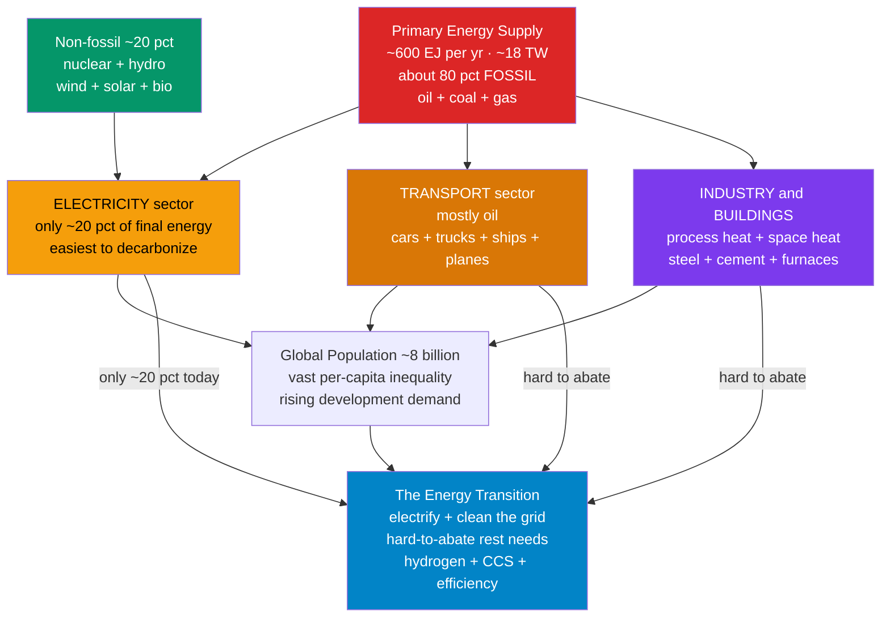

# ⚡ The Global Energy System and Demand

> [!abstract] TL;DR
> Humanity runs on a colossal flow of energy — roughly **600 exajoules of primary energy per year (~18 TW of continuous power)**, the equivalent of giving every person on Earth **dozens of tireless energy "slaves."** Despite decades of clean-energy growth, about **80 %** of that supply still comes from **burning fossil fuels** (oil, coal, gas), which is the dominant source of **~three-quarters of greenhouse-gas emissions.** The energy is consumed by three great end-uses — **electricity, transport, and industry/buildings heat** — and the crux of the whole climate problem is that **electricity is only ~20 % of final energy;** the large remainder is fuels burned *directly* for cars, planes, steel, and furnaces, the **hard-to-abate** sectors that are far harder to decarbonize. Layered on top is vast **inequality**: billions use too little energy and rightly want more. This note is the map — *how much, from what, for what, by whom* — that makes every downstream energy technology meaningful.

## Intuition — analogy FIRST

Imagine that each morning an invisible workforce reports for duty at your home. They pull your car down the highway, heat your shower, cook your food, smelt the steel in your building, fly your holiday flight, and run the data center answering your search. In pre-industrial times this work was done by human muscle and draft animals — a person can sustain only about **100 watts** of mechanical labor, so a farmer's entire family might command a handful of "helpers." Today the **average human on Earth commands the equivalent of ~20 tireless workers**, and the **average American commands nearly 90.** These are the **"energy slaves"** — the mechanical stand-ins that fossil-fueled machines quietly provide around the clock.

Now zoom out to the whole planet and two staggering facts jump out. **First**, this army of energy slaves is overwhelmingly powered by **setting things on fire** — coal, oil, and gas, just as it has been for two centuries — and that fire is the single biggest reason the climate is changing. **Second**, the part of this system that is *easiest* to clean up with solar and wind — **electricity** — is only about a **fifth** of the total; the huge remainder is fuel burned directly to move vehicles and make heat, which no solar panel plugs into. Understanding this global picture is like reading the map before a long expedition: it tells you the *scale* of the terrain (enormous), the *starting fuel* (mostly fossil), the *destinations* (power, transport, heat), and which mountain passes are hard (the hard-to-abate sectors). Everything else in energy is a route across this map.

---

## How It Works

The global energy system is best read as a **balance sheet**: primary energy comes *in* from a small set of sources, gets converted and delivered, and flows *out* to a small set of end-uses that serve ~8 billion people. Three numbers dominate every conversation: **~80 % fossil supply**, **~20 % electricity in final demand**, and **~10×** the per-capita inequality between rich and poor. The transition must clean up *all three* demand sectors — but only the electricity slice has a mature, cheap solution today.



**The scale.** Total world primary energy supply is roughly **600–620 EJ/yr**, which averaged over a year is about **18 terawatts** of continuous power — the output of ~18,000 large power plants running non-stop. Divided by 8 billion people, that is **~2,250 W per person on average**, versus the ~100 W a human body can sustain in labor: hence the "**energy slaves**" framing popularized by Buckminster Fuller and Vaclav Smil. Demand has grown roughly **in step with population and prosperity** for two centuries and, despite efficiency gains, continues to rise as developing economies industrialize (the accounting conventions for these numbers are covered in the sibling note *Energy_Resources_Units_and_Accounting*).

**The supply mix — still ~80 % fire.** Break primary energy down by source and the picture is sobering: **oil (~31 %), coal (~26 %), and natural gas (~23 %)** together supply about **80 %**. The non-fossil ~20 % is split among **hydro (~7 %), nuclear (~4 %), wind + solar (~5 %), and bioenergy/other (~4 %).** Wind and solar are growing fastest, but they are *adding* to the total faster than they are *displacing* fossil fuels — global fossil consumption has kept climbing in absolute terms. This combustion is the dominant driver of emissions (see the sibling *Emissions_and_the_Climate_Impact_of_Energy*).

**Where the energy goes — the demand sectors.** Follow the energy to its end-uses and you find three great destinations. **(1) Electricity/power generation** — versatile, increasingly cleanable, but only ~20 % of *final* energy. **(2) Transport** — almost entirely oil (cars, trucks, ships, planes), ~28 % of final energy. **(3) Industry & buildings heat** — process heat for steel, cement, and chemicals plus space and water heating, the largest lump of all. The decisive insight: **most energy is burned directly as fuel, not delivered as electricity.** You cannot decarbonize what you cannot electrify unless you invent a substitute fuel or capture the carbon.

**Demand patterns.** Energy demand is not smooth. It varies by **time** (daily peaks, seasonal heating/cooling swings, baseload vs peak), by **energy intensity** (energy per unit of GDP — falling steadily with efficiency and structural shift toward services), and by **drivers** (population, wealth, technology, and the industrial *structure* of an economy). These patterns shape grid design and are why storage and flexibility matter downstream.

**Inequality and development.** Per-capita energy use spans more than an order of magnitude — a typical American uses **~10× more** than a typical Indian and **~30× more** than the poorest nations. Roughly **hundreds of millions still lack electricity access** and billions rely on dirty cooking fuels. Development *requires* more energy, creating the central tension of **energy justice**: rich countries built prosperity on cheap fossil energy, and poorer countries rightly demand the same growth without inheriting the emissions bill (see the sibling *Energy_Access_and_Global_Development*).

**The transition framing.** The strategy that falls out of this map is threefold: **electrify everything you can** (EVs, heat pumps), **clean the electricity** you feed them (solar, wind, nuclear, grid), and **find bespoke solutions for the hard-to-abate remainder** (hydrogen, carbon capture, and relentless efficiency). The scale and sectoral shape — enormous, ~80 % fossil, mostly non-electric — is *why* the transition is so hard (the sibling *The_Energy_Transition_and_Net_Zero* develops the pathways). It is not "just build solar"; it is rebuilding transport, industry, and heat too.

---

## Key Concepts / Details

### Secondary Level
- **Primary vs final energy.** *Primary* energy is what we extract from nature (crude oil, raw coal, sunlight); *final* energy is what reaches the user after conversion losses (electricity at the socket, petrol in the tank). Roughly a third of primary energy is lost as waste heat in conversion — especially in thermal power plants.
- **The three demand sectors.** Memorize them: **Power** (electricity), **Transport** (moving people/goods), **Heat/Industry** (making things and warming buildings). Together they are the entire pie.
- **~80 / ~20 / ~20.** Three headline ratios: **~80 %** of supply is fossil; **~20 %** of final energy is electricity; and electricity is *also* the ~20 % that is easiest to clean. The overlap is a coincidence worth remembering because it explains the whole difficulty.
- **Energy slaves.** Modern life feels effortless because machines do the muscle-work of dozens of humans per person — that is what "using a lot of energy" actually means in human terms.

### Undergraduate Level
- **Units and magnitudes.** Global supply ≈ **600 EJ/yr ≈ 18 TW ≈ 170,000 TWh/yr**. Learn to move between EJ, TWh, Mtoe, and TW; a factor-of-10 error is the most common mistake in energy analysis (unit conventions live in *Energy_Resources_Units_and_Accounting*).
- **Energy intensity & the Kaya identity.** Emissions ≈ Population × (GDP/person) × (Energy/GDP) × (CO₂/Energy). This decomposition shows the four levers: fewer people (not a policy), less wealth (undesirable), **lower energy intensity** (efficiency), and **lower carbon intensity** (clean supply). The transition is fundamentally about the last two.
- **Load profiles.** Demand has a **baseload** (always-on) and **peak** (e.g., evening, hot afternoons). Historically met by dispatchable thermal plants; with variable renewables the challenge shifts to **matching intermittent supply to time-varying demand**, motivating storage and demand response.
- **Hard-to-abate sectors.** Aviation, shipping, long-haul trucking, steel, cement, and high-temperature process heat resist electrification because they need **high energy density** or **very high temperatures** or **chemical feedstock carbon** — hence hydrogen, ammonia, biofuels, and CCS are proposed instead of batteries.

### Graduate Level
- **The energy balance / Sankey view.** National and global systems are formally tracked as an **energy balance table** (IEA methodology): rows of sources, columns of transformation and end-use, with conversion losses explicit. A Sankey diagram makes the ~35 % thermal-generation loss and the sectoral split visible — essential for spotting where interventions actually move the needle.
- **Primary-energy accounting methods.** Comparing a solar farm (no thermal losses) to a coal plant is method-dependent: the **"physical content"**, **"substitution"**, and **"direct equivalent"** methods can shift renewables' apparent share by a factor of ~2–3. Always ask which convention a chart uses before interpreting "renewables are X %."
- **Rebound and Jevons' paradox.** Efficiency lowers the cost of an energy service, which can *increase* consumption — historically, coal-efficiency gains raised total coal use. Net-zero planning must assume energy demand is **endogenous**, not fixed, and price/structural policy is needed alongside technology.
- **Sectoral coupling & deep decarbonization.** The frontier is **electrifying end-uses and coupling sectors** — using clean power for heat pumps, EVs, and green-hydrogen electrolysis — so that decarbonizing *one* clean grid cascades across power, transport, and heat. This reframes the ~20 % electricity share as a **growing** share: deep-decarbonization scenarios roughly *double or triple* electricity's slice of final energy by 2050.

---

## Python Demo

```python
# The Global Energy System: supply mix, where energy goes,
# per-capita inequality, and the historical growth + renewables wedge.
# Figures are illustrative, rounded from IEA / Our World in Data (~2023).
import numpy as np
import matplotlib.pyplot as plt

# ---- (1) World PRIMARY ENERGY supply mix (share of ~600 EJ/yr) ----
sources   = ["Oil", "Coal", "Nat. Gas", "Hydro", "Nuclear", "Wind+Solar", "Bio+Other"]
shares    = np.array([31, 26, 23, 7, 4, 5, 4], dtype=float)   # percent, sums ~100
is_fossil = np.array([1, 1, 1, 0, 0, 0, 0], dtype=bool)
fossil_share = shares[is_fossil].sum()
print(f"Fossil share of primary energy: {fossil_share:.0f} pct")

# ---- (2) Where the energy goes: FINAL energy by end-use ----
enduse       = ["Electricity", "Transport", "Industry heat", "Buildings heat", "Other"]
enduse_share = np.array([20, 28, 22, 24, 6], dtype=float)      # percent

# ---- (3) Per-capita primary energy: the great inequality ----
countries = ["USA", "Germany", "China", "World avg", "India", "Nigeria", "Ethiopia"]
kwh_pc    = np.array([77000, 44000, 30000, 21000, 7000, 4000, 2500], dtype=float)
world_avg = 21000.0

# "Energy slaves": average continuous power per person / one human's ~100 W of labor
avg_power_W   = kwh_pc * 1000.0 / 8760.0      # kWh/yr -> average watts
energy_slaves = avg_power_W / 100.0
for c, s in zip(countries, energy_slaves):
    print(f"{c:>10}: ~{s:5.0f} energy slaves")

# ---- (4) Historical growth + the renewables wedge (the transition) ----
years      = np.array([1900, 1925, 1950, 1975, 2000, 2023])
fossil     = np.array([21, 35, 75, 200, 340, 495], dtype=float)   # EJ/yr
nuc_hydro  = np.array([1, 3, 8, 25, 55, 75], dtype=float)
renewables = np.array([0.1, 0.2, 0.5, 1, 8, 50], dtype=float)     # modern wind/solar/bio

# =============================================================
fig, ax = plt.subplots(2, 2, figsize=(13, 9))

# (1) Supply mix -- fossil dominance
colors1 = ["#7f1d1d" if f else "#059669" for f in is_fossil]
ax[0, 0].bar(sources, shares, color=colors1)
ax[0, 0].set_title(f"World Primary Energy Mix  (fossil = {fossil_share:.0f} pct)")
ax[0, 0].set_ylabel("Share of primary energy [pct]")
ax[0, 0].tick_params(axis="x", rotation=30)
ax[0, 0].text(2.6, 27, "RED = fossil (~80 pct)", color="#7f1d1d", fontsize=9)

# (2) Final energy by end-use -- electricity is a minority
colors2 = ["#f59e0b" if u == "Electricity" else "#6b7280" for u in enduse]
ax[0, 1].bar(enduse, enduse_share, color=colors2)
ax[0, 1].set_title("Where Energy Goes: Final Energy by End-Use")
ax[0, 1].set_ylabel("Share of final energy [pct]")
ax[0, 1].tick_params(axis="x", rotation=30)
ax[0, 1].text(1.1, 20, "Electricity only ~20 pct\n(rest = hard-to-abate\nheat & transport)",
              color="#b45309", fontsize=9)

# (3) Per-capita inequality
ax[1, 0].barh(countries[::-1], kwh_pc[::-1], color="#0284c7")
ax[1, 0].axvline(world_avg, color="#dc2626", ls="--", lw=1.5, label="World average")
ax[1, 0].set_title("Per-Capita Primary Energy: The Great Inequality")
ax[1, 0].set_xlabel("kWh per person per year")
ax[1, 0].legend()

# (4) Growth + renewables wedge
ax[1, 1].stackplot(years, fossil, nuc_hydro, renewables,
                   labels=["Fossil", "Nuclear + Hydro", "Modern renewables"],
                   colors=["#7f1d1d", "#6366f1", "#059669"])
ax[1, 1].set_title("Global Primary Energy Growth & the Renewables Wedge")
ax[1, 1].set_xlabel("Year")
ax[1, 1].set_ylabel("Primary energy [EJ/yr]")
ax[1, 1].legend(loc="upper left")

plt.tight_layout()
plt.savefig("global_energy_system.png", dpi=110)
plt.show()
```

**What the plots reveal.** Panel (1) shows the brute fact that **~80 % of supply is fossil** — the green renewable bars are still small. Panel (2) shows electricity as a **minority slice** dwarfed by the combined hard-to-abate heat and transport. Panel (3) shows per-capita use spanning **>30×** from the USA to Ethiopia, with the world average line sitting low. Panel (4) shows total energy **quadrupling since 1950** with a thin but accelerating **renewables wedge** — the transition beginning, but from a very fossil-heavy base. The printout also converts consumption into **"energy slaves,"** making the human scale of the numbers tangible (~88 for the USA vs ~3 for Ethiopia).

---

## Real-World Applications

- **IEA World Energy Outlook & national energy strategies.** Governments and the IEA build **scenarios** (Stated Policies, Announced Pledges, Net Zero by 2050) directly on this supply/demand map to project investment, emissions, and security. The ~80 %/~20 % structure is the baseline every scenario must bend.
- **Corporate net-zero and Scope 1/2/3 accounting.** Companies decompose their footprint into **electricity (Scope 2, cleanable via renewable procurement)** versus **direct fuel combustion and supply-chain heat/transport (Scope 1 and 3, hard-to-abate)** — a direct application of the electricity-minority insight.
- **Grid planning and the "duck curve."** Utilities use daily/seasonal **load profiles** plus the rising share of variable solar/wind to plan storage, transmission, and flexible generation — the demand-pattern concepts made operational.
- **Development finance and energy access.** Institutions like the World Bank use **per-capita energy and access data** to target electrification (e.g., Sub-Saharan Africa), balancing development-driven demand growth against emissions — the energy-justice tension in practice.
- **Steel, cement, aviation, and shipping decarbonization.** The identification of **hard-to-abate sectors** channels R&D toward green hydrogen (H₂-DRI steel), electric arc furnaces, sustainable aviation fuel, and CCS — precisely because these end-uses cannot simply "plug into solar."

---

## Common Pitfalls

- **Confusing electricity with total energy.** The single most common error: seeing "40 % of electricity is now renewable" and concluding the energy problem is nearly solved. Electricity is only **~20 % of final energy**, so a clean grid still leaves ~80 % of the *fuel-burning* system untouched. Always ask "electricity, or all energy?"
- **Mixing up primary and final energy.** Renewables look bigger in *final* energy and smaller in *primary* energy (because they skip thermal conversion losses). Charts using different accounting methods can differ by 2–3×; never compare shares across methods without checking.
- **Assuming renewables are displacing fossils.** Solar and wind are growing fast, but global fossil consumption has kept **rising in absolute terms** — new clean energy has mostly met *additional* demand rather than replacing incumbents. "Fastest-growing" is not "shrinking the other."
- **Ignoring the hard-to-abate remainder.** Optimism that "we just need to build more solar" collapses on contact with steelmaking, cement, aviation, shipping, and high-temperature process heat, which have no cheap electric substitute today.
- **Treating demand as fixed.** Efficiency gains can trigger **rebound (Jevons' paradox)**, and developing-world growth pushes demand *up*. Projections that hold demand constant systematically understate the challenge.
- **Averaging away inequality.** "World average" per-capita energy hides a >10× spread. Policy that ignores the billions who need *more* energy is neither just nor politically viable.

---

## Related Concepts

This note is the foundational map for the **Energy Systems** vault. Its sibling notes develop each thread in depth: *Energy_Systems_Overview* frames the whole discipline; *Energy_Resources_Units_and_Accounting* pins down the EJ/TWh/Mtoe units and primary-vs-final conventions used here; *Emissions_and_the_Climate_Impact_of_Energy* traces the ~80 % fossil supply to its ~three-quarters share of greenhouse gases; *The_Energy_Transition_and_Net_Zero* develops the electrify-clean-abate strategy; and *Energy_Access_and_Global_Development* expands the inequality and energy-justice dimension.

Cross-vault connections (verified to exist):

- [[Anthropogenic_Climate_Change]] — fossil combustion in this energy system is *the* dominant driver of the warming quantified there; the two notes are two faces of one problem.
- [[Emissions_and_the_Climate_Impact_of_Energy]] — sibling that converts the supply mix into the emissions ledger.
- [[Climate_Politics_and_Environmental_Governance]] — the governance and treaty layer (Paris, carbon pricing) responding to this system's emissions.
- [[Geopolitics_and_Power_Politics]] — oil, gas, and critical-mineral supply chains make the energy map a geopolitical map.
- [[Sustainability_and_Planetary_Boundaries]] — energy use is the largest driver of the climate-change planetary boundary and a systems-view of overshoot.
- [[Development_Economics]] — the wealth-and-development driver behind rising energy demand and the growth-vs-emissions tension.
- [[Externalities_and_Pigouvian_Tax]] — the economic framing of why fossil combustion (an unpriced externality) dominates, and how carbon pricing corrects it.

---

## Review Questions

1. **(Secondary)** The world's electricity is getting cleaner every year. Explain why this alone does **not** solve most of the climate problem, using the ~20 % figure.
2. **(Secondary)** What is an "energy slave," and roughly how many does the average person on Earth command versus the average American? What does this tell you about modern life?
3. **(Undergraduate)** Using the Kaya identity, name the four levers on energy-related emissions and explain why the energy transition focuses on **energy intensity** and **carbon intensity** rather than the other two.
4. **(Undergraduate)** A country wants to compare the "share of renewables" in its energy mix using two different reports that disagree by a factor of two. Give a concrete reason this can happen even with identical underlying data.
5. **(Graduate)** Deep-decarbonization scenarios often show electricity's share of final energy *doubling or tripling* by 2050 while total energy demand *falls*. Reconcile these two trends and explain the role of sector coupling and efficiency.
6. **(Graduate)** Given a fixed budget, argue for where a nation should concentrate decarbonization effort: cleaning its (already ~40 % clean) grid further, or attacking hard-to-abate heat and transport. Justify with the sectoral structure of demand and the concept of marginal abatement.

---

## Sources

- International Energy Agency — [*World Energy Outlook*](https://www.iea.org/reports/world-energy-outlook-2024) (annual global energy supply/demand scenarios and balances).
- Vaclav Smil — [*Energy and Civilization: A History*](https://mitpress.mit.edu/9780262536165/energy-and-civilization/) (MIT Press, 2017) (scale, energy slaves, historical demand growth).
- David J. C. MacKay — [*Sustainable Energy — Without the Hot Air*](https://www.withouthotair.com/) (UIT Cambridge, 2008) (order-of-magnitude, per-capita, sector-by-sector accounting).
- Our World in Data — [*Energy*](https://ourworldindata.org/energy) (open datasets: primary energy mix, per-capita use, historical growth).
- IEA — [*Energy Statistics Data Browser / World Energy Balances*](https://www.iea.org/data-and-statistics) (sectoral final-energy and electricity-share data).

---

#energy-systems #global-energy #energy-demand #fossil-fuels #decarbonization
