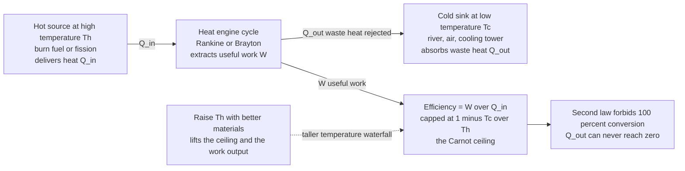

# 🔥 Thermodynamics of Energy Conversion: The Carnot Tax on Turning Heat into Power

> [!abstract] TL;DR
> Two laws govern every power plant and engine. The **first law** (energy is conserved) says you cannot create energy, only convert it — so you can *account* for every joule in the fuel. The **second law** is the cruel one: whenever you turn **heat into work** — which is exactly what most power plants do (burn fuel or fission → make heat → extract work → generate electricity) — you can **never convert all of it**. The maximum fraction depends only on temperatures: the **Carnot efficiency** $\eta_{max} = 1 - T_c/T_h$, set by the hot source $T_h$ and cold sink $T_c$. A plant burning fuel at 1500 °C and dumping heat to a 25 °C river can, at absolute best, convert about **83%** of the heat to work — and real plants get far less. This is why roughly **two-thirds of the energy in the fuel we burn is thrown away as waste heat** up cooling towers, worldwide, unavoidably. The second law is the invisible hand shaping every efficiency limit in the energy system — and the reason **heat pumps** (which *move* heat, COP > 1) and **direct-electric renewables** (which skip the heat engine entirely) are such efficiency game-changers.

## Intuition

**Analogy:** There is a **cosmic tax on turning heat into useful work, and no engineer can dodge it.** Imagine you own a water wheel, and the only way to make it spin is to let water fall from a high tank to a low one. The *more useful work* you can extract depends entirely on the **height difference** between the two tanks — not on how much water you have. For a heat engine the "height" is a **temperature difference**: heat naturally flows "downhill" from a hot source to a cold sink, and an engine skims off some of that flow as work. The catch is that the water must actually *arrive at the bottom tank* — you cannot catch every drop mid-air. Likewise, an engine **must dump leftover heat into a cold reservoir**; it can never convert the whole flow to work.

The hotter your heat source and the colder your surroundings, the taller the "waterfall" and the more work you can extract — that is the **Carnot limit**. Burn fuel at 1500 °C and reject to a 25 °C river, and the tax leaves you at most ~83% of the heat as work; real plants, fighting friction and finite-time losses, keep far less. This single fact explains cooling towers, why power engineers chase ever-higher combustion temperatures with exotic superalloys, and why most of the fuel humanity burns ends up as warm air and warm water.

---

## How It Works

### Core Mechanics

1. **First law — energy in equals energy out.** Over any device, $Q_{in} = W_{out} + Q_{out}$. Energy is never destroyed, only moved and transformed. This gives you the *accounting*: sum the fuel's chemical energy going in, the electricity coming out, and the waste heat rejected — they must balance. But the first law alone would happily permit a 100%-efficient engine; it says nothing about **quality**.

2. **Second law — heat flows hot→cold, and you cannot convert it all to work.** Entropy of an isolated system never decreases. Two operational consequences for energy conversion: heat spontaneously flows only from hot to cold (never the reverse without work), and **no cyclic engine can turn heat entirely into work** (Kelvin–Planck statement). Some heat $Q_{out}$ *must* be rejected to a cold sink. That rejected heat is the physically mandated "tax."

3. **The Carnot ceiling.** For any heat engine operating between a hot reservoir at $T_h$ and a cold reservoir at $T_c$ (absolute temperatures, in kelvin), the efficiency cannot exceed
$$\eta_{Carnot} = 1 - \frac{T_c}{T_h}.$$
It depends *only* on the two temperatures — not on the fuel, the fluid, or the cleverness of the design. Raise $T_h$ (hotter combustion, hotter steam) or lower $T_c$ (colder cooling water) and the ceiling rises. This is why turbine-inlet temperatures drive materials science: superalloys, single-crystal blades, and ceramic thermal-barrier coatings all exist to push $T_h$ higher.

4. **Real efficiency is below Carnot.** Friction, finite-temperature heat transfer, throttling, and turbulence are **irreversibilities** that generate entropy and destroy work potential. A useful "power-optimized" estimate is the endoreversible (Curzon–Ahlborn) efficiency $\eta_{CA} = 1 - \sqrt{T_c/T_h}$, which sits below Carnot and lands surprisingly close to real plants — because Carnot efficiency is only reached at zero power output (infinitely slow).

5. **Power cycles implement the heat engine.** Real plants realize the engine as a **thermodynamic cycle** running a working fluid around a loop: the **Rankine** cycle (steam — boiler, turbine, condenser, pump; the source of most of the world's electricity), the **Brayton** cycle (gas turbines and jet engines), and the **combined cycle** that stacks a Brayton topping cycle on a Rankine bottoming cycle to reach ~60% — beating either single cycle by using the gas turbine's hot exhaust as the boiler's heat source.

6. **Heat pumps flip the arrow — COP > 1.** Run the loop backwards and you *spend* work to shove heat uphill from cold to hot. The payoff is the **coefficient of performance** $\text{COP} = Q_{delivered}/W_{in}$, which is **greater than 1** (typically 3–5) because the machine *relocates* existing heat rather than making it. A heat pump can deliver 4 kW of heating for 1 kW of electricity — the reason electrified heating can beat combustion.

7. **Exergy — energy has quality.** The second law implies not all joules are equal. **Work and electricity are high-quality** (fully convertible to anything). **Heat is low-quality**, worth only its Carnot-convertible fraction $1 - T_c/T$. Exergy is the second-law bookkeeping that tracks this quality; it explains why turning premium electricity into low-grade heat with a resistor is thermodynamically wasteful, and why renewables that produce electricity *directly* (solar PV, wind) sidestep the Carnot penalty entirely.

### Flow / Architecture



---

## Key Concepts

### Secondary (intuitive foundation)
- **Energy is conserved (first law).** Fuel energy in = useful output + waste heat. Nothing vanishes; it just changes form and quality.
- **Most electricity comes from heat engines.** Coal, gas, nuclear, and biomass plants all do the same thing: make heat, then extract work. Solar PV and wind are the exceptions — they skip heat.
- **You cannot convert all heat to work.** Every heat engine must throw away some heat. That is why power plants have **cooling towers** or sit next to rivers, and why ~60–70% of fuel energy globally leaves as warm exhaust.
- **Hotter source + colder surroundings = more work.** A bigger temperature gap means a bigger "waterfall" to skim work from.

### Undergraduate (the working relations)
- **Carnot efficiency:** $\eta_{Carnot} = 1 - T_c/T_h$ (kelvin), the absolute ceiling for any heat engine. Depends only on temperatures.
- **Thermal efficiency of a real cycle:** $\eta_{th} = W_{net}/Q_{in} = 1 - Q_{out}/Q_{in}$, always below $\eta_{Carnot}$ because of irreversibilities.
- **Kelvin–Planck vs Clausius statements** of the second law — no engine converts heat wholly to work; no device moves heat cold→hot without work input. They are logically equivalent.
- **Power cycles:** Rankine (steam), Brayton (gas), and combined cycle (~60%). Each is a clockwise loop on a T-s diagram whose enclosed area is the net work.
- **Refrigerators and heat pumps:** $\text{COP}_{R} = Q_{cold}/W_{in}$, $\text{COP}_{HP} = Q_{hot}/W_{in} = \text{COP}_R + 1$; both exceed 1 because heat is moved, not created.

### Graduate (quality, generation, and limits)
- **Exergy (availability):** the maximum work extractable relative to a dead state at $T_0$; for a heat stream $Q$ at temperature $T$, exergy $= Q(1 - T_0/T)$. Work and electricity are ~100% exergy; low-grade heat is mostly anergy.
- **Second-law (exergetic) efficiency:** $\eta_{II} = \eta_{th}/\eta_{Carnot}$ — how close a device gets to its own thermodynamic ceiling, a fairer scorecard than first-law efficiency alone.
- **Entropy generation and the Gouy–Stodola theorem:** lost work $= T_0\,\dot{S}_{gen}$. Every irreversibility (finite-$\Delta T$ heat transfer, throttling, mixing, friction) destroys exergy in direct proportion to entropy generated.
- **Endoreversible / finite-time thermodynamics:** the Curzon–Ahlborn efficiency $\eta_{CA} = 1 - \sqrt{T_c/T_h}$ gives the efficiency at *maximum power* — a more realistic benchmark than the zero-power Carnot limit.
- **Why electrification beats combustion thermodynamically:** a heat pump delivering heat at $T_h$ from ambient $T_c$ can supply several units of heat per unit of electricity, so even after the power plant's own Carnot loss, electrified heat can out-perform on-site burning — and PV/wind avoid the heat-engine step altogether.

---

## Python Demo

```python
# Thermodynamic limits of energy conversion.
# (a) The Carnot ceiling vs hot-source temperature, with real power plants
#     plotted below it to show the unavoidable gap.
# (b) Heat-pump COP vs temperature lift: moving heat (COP > 1) beats making it.
import numpy as np
import matplotlib.pyplot as plt

# ---- Panel (a): the Carnot ceiling on any heat engine ---------------------
Tc = 298.15                        # K, cold sink (25 C river / cooling tower)
Th = np.linspace(350, 2000, 500)   # K, hot-source temperature
eta_carnot = 1.0 - Tc / Th                 # hard upper bound (dimensionless)
eta_ca     = 1.0 - np.sqrt(Tc / Th)        # endoreversible (max-power) bound

# Real plants: name -> (hot-source temperature in K, achieved efficiency)
plants = {
    "Coal steam (~565 C)":        (565 + 273.15, 0.40),
    "Nuclear PWR (~330 C)":       (330 + 273.15, 0.33),
    "Combined-cycle gas (~1500 C)": (1500 + 273.15, 0.60),
}

fig, (ax1, ax2) = plt.subplots(1, 2, figsize=(13, 5))

ax1.plot(Th, eta_carnot, lw=2.5, color="crimson",
         label="Carnot ceiling  1 - Tc/Th")
ax1.plot(Th, eta_ca, lw=2, ls="--", color="darkorange",
         label="Endoreversible bound  1 - sqrt(Tc/Th)")
ax1.fill_between(Th, eta_carnot, 1.0, color="crimson", alpha=0.06)
ax1.text(1550, 0.90, "FORBIDDEN\n(second law)", color="crimson",
         ha="center", fontsize=10)

for name, (Th_p, eta_p) in plants.items():
    ax1.scatter([Th_p], [eta_p], s=90, zorder=5)
    ax1.annotate(f"{name}\n{eta_p*100:.0f}%", (Th_p, eta_p),
                 textcoords="offset points", xytext=(8, -30), fontsize=8)
    ax1.vlines(Th_p, eta_p, 1 - Tc / Th_p, color="gray", ls=":", lw=1)

ax1.set_xlabel("Hot-source temperature  Th  (K)")
ax1.set_ylabel("Thermal efficiency")
ax1.set_title("Higher Th lifts the ceiling;\nreal plants sit well below it")
ax1.set_ylim(0, 1)
ax1.legend(loc="lower right", fontsize=8)
ax1.grid(alpha=0.3)

# ---- Panel (b): heat-pump COP vs temperature lift -------------------------
Tcold = 273.15                       # K, outdoor source at 0 C
lift  = np.linspace(5, 60, 400)      # K, temperature lift (delivered - source)
Th_hp = Tcold + lift
cop_carnot_hp = Th_hp / (Th_hp - Tcold)      # ideal heating COP = Th / lift
eta_2nd = 0.45                                # typical second-law efficiency
cop_real = 1 + eta_2nd * (cop_carnot_hp - 1)

ax2.plot(lift, cop_carnot_hp, lw=2.5, color="teal",
         label="Ideal (Carnot) heating COP")
ax2.plot(lift, cop_real, lw=2, ls="--", color="seagreen",
         label="Real COP (~45% of Carnot)")
ax2.axhline(1.0, color="gray", lw=1.5, ls=":")
ax2.text(42, 1.2, "resistive heating (COP = 1)", color="gray", fontsize=8)
ax2.fill_between(lift, 1.0, cop_real, where=(cop_real > 1),
                 color="seagreen", alpha=0.08)
ax2.set_xlabel("Temperature lift  Th - Tc  (K)")
ax2.set_ylabel("Coefficient of performance  COP")
ax2.set_title("Moving heat beats making it:\nCOP > 1 shrinks as the lift grows")
ax2.set_ylim(0, 12)
ax2.legend(loc="upper right", fontsize=8)
ax2.grid(alpha=0.3)

plt.tight_layout()
plt.savefig("thermo_energy_conversion.png", dpi=120)
plt.show()

# ---- Printed summary ------------------------------------------------------
print("Carnot ceiling with cold sink Tc = 25 C (298 K):")
for name, (Th_p, eta_p) in plants.items():
    eta_max = 1 - Tc / Th_p
    print(f"  {name:26s} Th={Th_p:6.1f} K  Carnot={eta_max*100:5.1f}%  "
          f"real={eta_p*100:5.1f}%  2nd-law-eff={eta_p/eta_max*100:5.1f}%")

lift_demo = 30.0
th = Tcold + lift_demo
print(f"\nHeat pump: 0 C source, {lift_demo:.0f} K lift ->")
print(f"  ideal COP = {th/lift_demo:.2f}, real COP ~ "
      f"{1 + eta_2nd*(th/lift_demo - 1):.2f}  (vs 1.0 for a resistance heater)")
```

Running this prints the Carnot ceiling for each plant type, the real efficiency, and the second-law efficiency (real / Carnot). It shows the ~83% ceiling for a 1500 °C source, why coal (lower steam temperature) is capped lower, and how a 0 °C-source heat pump delivering a 30 K lift moves several units of heat per unit of electricity — the thermodynamic case for electrified heating.

---

## Real-World Applications

- **Combined-cycle gas plants (~60%).** The most efficient thermal power on the grid stacks a Brayton gas turbine (hot exhaust ~600 °C) feeding a Rankine steam bottoming cycle — two heat engines in series, each Carnot-limited, together beating either alone. High turbine-inlet temperature (~1500 °C) is what raises the ceiling.
- **Coal and nuclear steam plants (~33–40%).** Lower peak temperatures (metallurgical limits for coal boilers, reactor safety limits for nuclear cores) mean lower Carnot ceilings and lower efficiency — nuclear PWRs run near 33% precisely because their steam is relatively cool.
- **Cooling towers and once-through river cooling.** Not an afterthought but a thermodynamic *necessity*: the second law demands a cold sink to reject $Q_{out}$. The plume of warm vapor is the visible signature of the Carnot tax being paid.
- **Heat pumps for building heat.** Delivering COP 3–5, they are the single biggest efficiency lever in decarbonizing space heating, replacing gas furnaces and resistive heaters by *moving* ambient heat rather than burning fuel.
- **Waste-heat recovery and cogeneration (CHP).** Since so much energy leaves as heat, capturing it — district heating, organic Rankine cycles on industrial exhaust, combined heat and power — reclaims low-grade energy the primary cycle could not convert.
- **Direct-electric renewables (solar PV, wind).** They generate electricity without a heat-engine step, so they are **not** bound by Carnot at all — a core thermodynamic argument for why an electrified, renewables-heavy grid can be more efficient end-to-end than combustion.

---

## Common Pitfalls

- **Confusing first-law with second-law efficiency.** A device can be "energy efficient" by the first law (little heat lost to the wall) yet destroy huge work potential by degrading high-quality energy to low-grade heat. Always ask which efficiency, and compare against the Carnot ceiling, not against 100%.
- **Thinking COP > 1 breaks energy conservation.** It does not. A heat pump *moves* existing ambient heat with a little work; the delivered heat is the sum of the work in plus the heat pulled from the cold source. Nothing is created — the first law holds exactly.
- **Comparing electricity to fuel heat 1:1.** One joule of electricity is not equivalent to one joule of fuel heat: the electricity may already have "paid" a Carnot penalty at the power plant. Honest comparisons use **primary-energy** or **exergy** accounting, not naive joule counting.
- **Assuming you can just raise $T_h$ for free.** Higher combustion and steam temperatures lift the Carnot ceiling but slam into materials limits — creep, oxidation, melting. Every degree of turbine-inlet temperature is bought with expensive superalloys, blade cooling, and ceramic coatings.
- **Forgetting that $T_c$ matters too.** Efficiency depends on the cold sink as well. Plants run measurably worse on hot summer days when cooling water is warm — the "waterfall" gets shorter at the bottom.
- **Treating all energy as equal quality.** Lumping electricity, high-temperature heat, and lukewarm waste heat into one "energy" bucket hides the second law. Exergy analysis is what reveals where useful work is actually being destroyed.

---

## Related Concepts

- [[Laws_of_Thermodynamics]] — the physics statement of the first and second laws that this note applies to energy conversion.
- [[Entropy_and_Second_Law]] — the entropy foundation behind why heat cannot be fully converted to work, and the origin of the Carnot ceiling.
- [[Engineering_Thermodynamics]] — the mechanical-engineering treatment of energy, work, and cycle analysis underlying power-plant design.
- [[Power_and_Refrigeration_Cycles]] — the concrete Rankine, Brayton, combined, and vapor-compression cycles that implement these heat engines and heat pumps.
- [[Chemical_Process_Thermodynamics]] — process-industry thermodynamics, including energy and exergy balances across chemical plants.
- [[Sustainable_and_Energy_Systems_Engineering]] — the systems-level view of efficiency, waste-heat recovery, and decarbonization that builds on these limits.

Within this vault, this note is the thermodynamic backbone for the sibling notes on Forms and Conversion of Energy, Exergy and Energy Quality (the second-law quality accounting previewed here), Steam and Rankine Power Plants, Gas Turbines and Combined Cycle, and Energy Efficiency and Demand Management.

---

## Review Questions

1. **(Secondary)** A power plant burns fuel that contains 100 units of energy but delivers only about 40 units as electricity. Where do the other ~60 units go, and why is releasing that waste heat unavoidable rather than an engineering flaw?
2. **(Undergraduate)** A gas turbine has a turbine-inlet temperature of 1500 °C and rejects heat to 25 °C air. Compute the Carnot efficiency. A real combined-cycle plant reaches about 60%. Explain the gap and name two changes that push real efficiency closer to the limit.
3. **(Graduate)** Using exergy / energy-quality reasoning, explain why a heat pump with COP 4 delivering 55 °C water is *not* thermodynamically equivalent to a resistance heater delivering the same heat — and argue why electrifying heat can beat on-site combustion even after accounting for the Carnot losses already paid at the power plant.

---

## Sources

- Çengel, Y. A., & Boles, M. A. — *Thermodynamics: An Engineering Approach* (McGraw-Hill). [Publisher](https://www.mheducation.com/highered/product/thermodynamics-engineering-approach-cengel-boles.html)
- Moran, M. J., Shapiro, H. N., Boettner, D. D., & Bailey, M. B. — *Fundamentals of Engineering Thermodynamics* (Wiley). [Publisher](https://www.wiley.com/en-us/Fundamentals+of+Engineering+Thermodynamics%2C+9th+Edition-p-9781119391388)
- Tester, J. W., Drake, E. M., Driscoll, M. J., Golay, M. W., & Peters, W. A. — *Sustainable Energy: Choosing Among Options* (MIT Press). [Publisher](https://mitpress.mit.edu/9780262017473/sustainable-energy/)
- Bejan, A. — *Advanced Engineering Thermodynamics* (Wiley). [Publisher](https://www.wiley.com/en-us/Advanced+Engineering+Thermodynamics%2C+4th+Edition-p-9781119052098)

---

#energy-systems #thermodynamics #carnot #heat-engine #efficiency-limit
