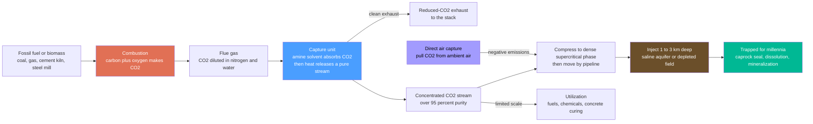

# 🏭 Carbon Capture, Utilization, and Storage (CCUS): Putting the Carbon Back

> [!abstract] TL;DR
> Burning carbon *inevitably* makes CO2 — that is the chemistry of combustion, not a fixable flaw — so if we cannot stop making it, the next idea is to **catch the CO2 before it escapes and bury it back underground where the carbon came from**. **Carbon Capture, Utilization, and Storage (CCUS)** does exactly that: bolt equipment onto a power plant, cement kiln, or steel mill that scrubs CO2 out of the exhaust (usually by absorbing it into a chemical solvent, then heating that solvent to release a pure CO2 stream), compress the CO2 into a dense fluid, pipe it away, and inject it a mile or more into deep rock — a saline aquifer or a depleted oil field — where caprock, dissolution, and mineralization trap it for millennia. It is a **giant reverse-mining operation**. The appeal is enormous: it is one of the very few ways to cut the "unavoidable" CO2 that is *intrinsic* to making cement, steel, and chemicals, it lets existing fossil plants keep running with far lower emissions, and — via **direct air capture (DAC)** and **bioenergy with CCS (BECCS)** — it is essentially the *only* way to achieve **negative emissions** that most net-zero scenarios require. The catch is equally real: capturing CO2 costs money and burns extra energy (the **energy penalty**), so it has been slow, expensive, and stubbornly hard to scale — a technology of great promise and equally great difficulty, central to every argument about *how fast* the world can decarbonize.

## Intuition

**Analogy:** Imagine a factory whose chimney pours out smoke you are no longer allowed to release — but you cannot turn off the fire, because the fire *is* the product. What do you do? You install a filter on the chimney that grabs the offending gas, squeeze that gas into a small dense package, truck it back to the very quarry the raw material was dug from, and stuff it deep into the ground under a rock lid so it stays put. That is **carbon capture and storage**: since burning fossil carbon *inevitably* produces CO2 the way a fire inevitably produces smoke, CCUS catches the CO2 at the source, compresses it, and pumps it a mile down into porous rock to be **trapped for thousands of years** — quite literally putting the carbon back where humanity dug it up.

The "filter" is usually not a mesh but a **chemical sponge**: the exhaust is bubbled through a liquid (typically an *amine* solution) that chemically grabs CO2 molecules and lets everything else pass; then the loaded liquid is heated in a second vessel, which makes it *let go* of the CO2 as a nearly pure stream that can be compressed and stored. Wringing out that sponge takes heat, and making that heat means burning *more* fuel — which is why capture always carries an **energy penalty** and a cost, and why CCUS is at once one of the most powerful and one of the most contested tools in the decarbonization toolbox.

---

## How It Works

### Core Mechanics

CCUS is a chain of four steps — **capture, compress, transport, store (or use)** — bolted onto a source that would otherwise vent CO2 straight to the sky:

1. **Capture — separate CO2 from everything else.** A power plant's flue gas is mostly nitrogen and water vapor with only ~4–15% CO2, so the hard part is *pulling the CO2 out of a dilute mixture*. Four main routes exist:
   - **Post-combustion capture** — the dominant *retrofit*: scrub CO2 out of the flue gas *after* burning, typically with an **amine solvent** that chemically absorbs CO2 in an absorber column, then releases a concentrated stream when the solvent is heated (regenerated) in a stripper. This is classic chemical **absorption and stripping**.
   - **Pre-combustion capture** — gasify the fuel to a syngas, shift it to hydrogen plus CO2, and separate the CO2 *before* combustion (as in **IGCC** plants), leaving a hydrogen fuel that burns to water.
   - **Oxy-fuel combustion** — burn the fuel in nearly pure oxygen instead of air, so the exhaust is almost entirely CO2 and water; condense out the water and the remaining CO2 stream is easy to capture.
   - **Direct air capture (DAC)** — extract CO2 straight from *ambient air*, where it is a mere ~0.04% (420 ppm). Enormously more dilute and energy-intensive than flue gas, but location-flexible and, crucially, capable of **negative emissions**.
2. **Compress — turn the gas into a dense fluid.** The captured CO2 is compressed above its critical point (roughly 74 bar, 31 °C) into a **supercritical / dense phase** — as heavy as a liquid but flowing like a gas — so a pipeline or well moves far more mass per unit volume.
3. **Transport — move it to the storage site.** Dense CO2 is shipped by **pipeline** (the cheapest at scale), or by ship, rail, or truck for smaller volumes, from the emitter to a suitable geological formation.
4. **Store or utilize — put it away for good.** The CO2 is **injected 1–3 km underground** into deep **saline aquifers** (porous rock saturated with salty water) or **depleted oil and gas reservoirs**, where four trapping mechanisms hold it over time: an impermeable **caprock** seal (structural trapping), residual trapping in pore throats, **dissolution** into the brine, and slow **mineralization** into carbonate rock. Sites are monitored for leakage for decades. Early projects paid for themselves via **enhanced oil recovery (EOR)**, injecting CO2 to push out more oil. Alternatively, **utilization (CCU)** turns the CO2 into fuels, chemicals, or cured concrete — usually at small scale and often *not* permanent.

The reason CCUS is *hard* lives in step 1 and its downstream cost: separating and regenerating the solvent consumes **energy**, so the host plant must burn extra fuel and gives up a chunk of its net efficiency — the **energy penalty** — which both shrinks output and raises the cost per tonne of CO2 dealt with. And because that extra fuel *itself* emits CO2, the amount you actually **avoid** is always less than the amount you **capture**.

### Flow / Architecture



---

## Key Concepts

### Secondary Level

- **Burning carbon always makes CO2.** When coal, oil, or gas burns, its carbon joins with oxygen to make carbon dioxide. You cannot burn the fuel *without* making CO2 — it is basic chemistry, not a flaw to fix.
- **The idea: catch it and bury it.** If we cannot stop making CO2, we can try to *catch* it before it leaves the chimney and *put it back underground*, deep below the surface, where it stays trapped for thousands of years. That is **carbon capture and storage**.
- **How the catching works.** The exhaust is passed through a special liquid that soaks up CO2 like a sponge. Heating the liquid squeezes the CO2 back out as a pure stream, which is then squeezed into a dense fluid, piped away, and pumped a mile underground into rock with a solid "lid" on top.
- **Why we bother.** Some things — like making cement and steel — release CO2 no matter what, and are very hard to run on clean electricity. CCUS is one of the few ways to cut *those* emissions. Special versions can even pull CO2 back out of the air.
- **Why it is hard.** Catching CO2 uses a lot of extra energy and money, so the plant has to burn more fuel to run the equipment. It has been slow and expensive to build, so it remains a promising but difficult technology.

### Undergraduate Level

- **The separation problem.** Flue gas from a coal or gas plant is only ~4–15% CO2 (the rest is mostly nitrogen); ambient air is a mere ~0.04%. The whole engineering challenge is separating CO2 from a **dilute** mixture, which is intrinsically energy-costly — the more dilute the source, the more energy per tonne captured (flue gas ≪ air).
- **The four capture routes.** *Post-combustion* (amine scrubbing of flue gas — the leading retrofit); *pre-combustion* (gasify and separate CO2 before burning, as in IGCC); *oxy-fuel* (burn in pure O2 to get a concentrated CO2 exhaust); and *direct air capture* (pull CO2 from the atmosphere). Each trades capture cost against how concentrated the CO2 stream is.
- **The energy penalty.** Regenerating the solvent (boiling CO2 back out) and compressing the CO2 consume energy the plant would otherwise sell. A typical coal plant's net efficiency drops from ~40% toward ~30% — a **~10 percentage-point** hit, i.e. roughly **20–30% *relative*** loss of output. That penalty is the dominant cost driver of CCUS.
- **Captured vs avoided — the accounting trap.** Because the plant burns extra fuel to run capture, it *generates* more CO2 per unit of useful output. So "90% capture" does **not** mean 90% fewer emissions: the amount **avoided** (vs an ordinary plant) is always *less* than the amount **captured**. Honest reporting must state avoided, not just captured.
- **Transport and geological storage.** CO2 is compressed to a **supercritical** dense phase, pipelined, and injected into **deep saline aquifers** or **depleted oil/gas fields**. It is held by a low-permeability **caprock** seal plus residual, solubility, and mineral trapping — with the security of storage *increasing* over time as CO2 dissolves and mineralizes. Sites need long-term **monitoring, measurement, and verification (MMV)** against leakage.
- **CCU and EOR.** *Utilization* converts CO2 into fuels, chemicals, or cured concrete, but at limited scale and often without permanent removal. *Enhanced oil recovery* injects CO2 to boost oil output — an early revenue source, though its net-climate benefit is debated since it also produces more oil.
- **Negative emissions.** **BECCS** (grow biomass that absorbs CO2, burn it for energy, then capture and store that CO2) and **DAC** remove CO2 that is *already* in the atmosphere — the only ways to go *below* zero, which nearly every 1.5–2 °C scenario relies on to offset residual and past emissions.

### Graduate Level

- **Thermodynamic minimum vs real energy cost.** The *minimum* work to separate CO2 from a mixture is set by the mixing entropy, $w_{min} = RT\ln(1/y_{CO2})$ per mole, so it rises steeply as the mole fraction $y_{CO2}$ falls — a few kJ/mol from flue gas but far more from air. Real amine systems dissipate several times this minimum in the **reboiler heat** needed to reverse the exothermic CO2–amine reaction and vaporize water, so the practical energy is dominated by *regeneration*, not by absorption. Reducing the reboiler duty (novel solvents, water-lean and phase-change solvents, solid sorbents, membranes) is the core R&D frontier.
- **The efficiency-penalty economics.** With reference efficiency $\eta_0$ and a capture-induced penalty, net efficiency falls to $\eta_{net}$, raising CO2 *generated* per MWh to $e_{gen} = f_C/\eta_{net}$ (fuel carbon intensity $f_C$). Emissions **avoided** $= e_{ref} - (1-c)\,e_{gen}$ are strictly less than emissions **captured** $= c\,e_{gen}$; hence **cost per tonne avoided > cost per tonne captured**, and the gap widens as the penalty grows. This is why "$/tonne avoided" is the only fair metric for comparing abatement options.
- **Hard-to-abate industry is the strongest case.** In **cement**, roughly *60%* of CO2 comes from calcining limestone ($\text{CaCO}_3 \rightarrow \text{CaO} + \text{CO}_2$) — a *process* emission independent of the fuel, which no amount of clean electricity removes. Steel (blast-furnace chemistry), some chemicals, and refining are similar. For these **intrinsic** emissions, CCUS is one of very few options, giving it durable relevance even in a highly electrified world.
- **Storage capacity, permanence, and containment risk.** Global deep-saline capacity is very large (thousands of Gt in principle), but *bankable, well-characterized* capacity near sources is the binding constraint. Risks include **caprock integrity**, **fault reactivation and induced seismicity** from pore-pressure increase, well-bore leakage, and CO2 plume migration — all requiring reservoir modeling, pressure management, and multi-decade MMV. Storage security is dynamic: structural trapping dominates early, then dissolution and mineralization make the CO2 progressively more immobile.
- **Negative-emissions realism.** BECCS is limited by sustainable **biomass and land** (competing with food and ecosystems) and by lifecycle emissions of the supply chain; DAC is limited by its **energy intensity** (which must come from clean, additional energy to be net-negative) and cost. Both are essential to net-zero *accounting* yet face scale, cost, and integrity-of-removal (MRV, permanence, additionality) challenges — the reason "removals" and "reductions" must not be conflated.
- **The moral-hazard and lock-in debate.** Critics argue CCUS can **prolong fossil dependence**, divert capital from cheaper renewables, and provide a license to keep emitting; proponents counter that for *hard-to-abate* sectors and *legacy* CO2 there is no substitute, and that removals are physically required. The resolution is contextual: CCUS is high-value for process emissions and negative emissions, weaker as a reason to build new unabated fossil generation the grid could decarbonize more cheaply.
- **System integration and deployment gap.** CCUS needs shared **CO2 transport-and-storage infrastructure** (hubs and clusters), pore-space regulation, liability frameworks, and carbon prices or subsidies (e.g. 45Q-style credits) to be viable. Despite decades of promise, deployed capacity remains **orders of magnitude** below the ~1 Gt/yr-plus that net-zero pathways envisage by mid-century — the classic promise-versus-reality gap that makes the *rate* of scale-up the central open question.

---

## Python Demo

```python
# CCUS economics in one figure: the ENERGY PENALTY, the CAPTURED-vs-AVOIDED gap,
# and the CARBON BALANCE of a fossil plant with capture. numpy + matplotlib only.
#
#   (a) ENERGY PENALTY -- as the CO2 capture rate rises, the plant must divert
#                         energy to run capture, so its NET efficiency falls
#                         (e.g. ~40% -> ~30% at 90% capture).
#   (b) COST PER TONNE -- $/t CAPTURED vs $/t AVOIDED. Because extra fuel is
#                         burned, avoided < captured, so $/t avoided is HIGHER
#                         and diverges as capture approaches its limit.
#   (c) CARBON BALANCE -- net CO2 to the atmosphere WITHOUT vs WITH CCS, showing
#                         that "90% captured" is NOT "90% avoided": the energy
#                         penalty adds extra generated CO2.
import numpy as np
import matplotlib.pyplot as plt

# ---------------- model parameters (illustrative coal plant) ----------------
eta0   = 0.40     # reference net efficiency, no capture
fuel_C = 0.342    # t CO2 per MWh of FUEL thermal energy (coal ~ 95 kg CO2/GJ)
pen90  = 0.10     # efficiency-point penalty at 90% capture -> 0.40 drops to 0.30
dCOE90 = 35.0     # extra cost of electricity at 90% capture [$/MWh]

# sweep the CO2 capture rate from 0 to 95%
c = np.linspace(0.0, 0.95, 200)

# energy penalty grows ~linearly with the amount of CO2 captured
eta_net = eta0 - (pen90 / 0.90) * c            # net efficiency after capture

# CO2 intensities [t CO2 / MWh_electric]
e_ref = fuel_C / eta0                           # reference plant, no capture
e_gen = fuel_C / eta_net                        # MORE fuel burned -> MORE CO2 made
e_cap = c * e_gen                               # captured (sent to storage)
e_emit = (1 - c) * e_gen                        # still emitted to atmosphere
e_avoid = e_ref - e_emit                        # AVOIDED vs the reference plant

# cost of electricity premium grows ~linearly with capture
dCOE = (dCOE90 / 0.90) * c                       # [$/MWh]
with np.errstate(divide="ignore", invalid="ignore"):
    cost_cap = np.where(e_cap  > 1e-6, dCOE / e_cap,  np.nan)   # $/t captured
    cost_av  = np.where(e_avoid > 1e-6, dCOE / e_avoid, np.nan)  # $/t avoided

# ---- headline numbers at the design point c = 0.90 ----
i90 = np.argmin(np.abs(c - 0.90))
print("=== CCUS at 90% capture (illustrative coal plant) ===")
print(f"  net efficiency      : {eta0*100:.0f}%  ->  {eta_net[i90]*100:.0f}%"
      f"   (energy penalty {(eta0-eta_net[i90])*100:.0f} points)")
print(f"  CO2 generated       : {e_gen[i90]:.3f} t/MWh   (ref {e_ref:.3f} t/MWh)")
print(f"  CO2 captured (store): {e_cap[i90]:.3f} t/MWh")
print(f"  CO2 still emitted   : {e_emit[i90]:.3f} t/MWh")
print(f"  CO2 AVOIDED vs ref  : {e_avoid[i90]:.3f} t/MWh"
      f"   ({100*e_avoid[i90]/e_ref:.0f}% real reduction, not 90%)")
print(f"  cost per t captured : ${cost_cap[i90]:.0f}")
print(f"  cost per t AVOIDED  : ${cost_av[i90]:.0f}   <-- the honest figure")

# --------------------------------- plotting ---------------------------------
fig, (axA, axB, axC) = plt.subplots(1, 3, figsize=(17, 5.5))
fig.suptitle("Carbon Capture & Storage: the energy penalty, the captured-vs-"
             "avoided gap, and the carbon balance",
             fontsize=13, fontweight="bold")

# (a) energy penalty: net efficiency vs capture rate
axA.axhline(eta0 * 100, color="#555", ls="--", lw=1.5, label="reference (no capture)")
axA.plot(c * 100, eta_net * 100, color="#e17055", lw=2.6, label="with capture")
axA.annotate("energy\npenalty", xy=(90, eta_net[i90]*100),
             xytext=(55, 32.5), fontsize=9, color="#e17055",
             arrowprops=dict(arrowstyle="<->", color="#e17055"))
axA.vlines(90, eta_net[i90]*100, eta0*100, color="#e17055", lw=6, alpha=0.25)
axA.set_xlabel("CO2 capture rate  [percent]")
axA.set_ylabel("net plant efficiency  [percent]")
axA.set_title("(a) The energy penalty\ncapture eats into net output", fontsize=11)
axA.set_ylim(25, 42)
axA.grid(alpha=0.3); axA.legend(loc="lower left", fontsize=8)

# (b) cost per tonne: captured vs avoided
axB.plot(c * 100, cost_cap, color="#2a9d8f", lw=2.6, label="$/t CO2 captured")
axB.plot(c * 100, cost_av,  color="#8338ec", lw=2.6, label="$/t CO2 avoided")
axB.fill_between(c * 100, cost_cap, cost_av, color="#8338ec", alpha=0.10)
axB.scatter([90, 90], [cost_cap[i90], cost_av[i90]], color="k", zorder=5, s=25)
axB.set_xlabel("CO2 capture rate  [percent]")
axB.set_ylabel("cost  [$ per tonne CO2]")
axB.set_title("(b) Captured is cheap, avoided is dear\navoided cost is the honest one",
              fontsize=11)
axB.set_xlim(20, 95); axB.set_ylim(0, 90)
axB.grid(alpha=0.3); axB.legend(loc="upper left", fontsize=8)

# (c) carbon balance: without vs with CCS (captured vs avoided distinction)
labels = ["No CCS", "With CCS\n(90% capture)"]
emit  = [e_ref,        e_emit[i90]]     # to atmosphere
cap   = [0.0,          e_cap[i90]]      # to storage
axC.bar(labels, emit, color="#e76f51", label="emitted to atmosphere")
axC.bar(labels, cap, bottom=emit, color="#00b894", label="captured -> stored")
axC.axhline(e_ref, color="#555", ls="--", lw=1.3)
axC.annotate(f"avoided\n{e_avoid[i90]:.2f} t/MWh",
             xy=(1, e_emit[i90]), xytext=(0.30, 0.45), fontsize=9, color="#c0392b",
             arrowprops=dict(arrowstyle="->", color="#c0392b"))
axC.text(1, e_gen[i90] + 0.03, f"total generated {e_gen[i90]:.2f}\n(extra fuel!)",
         ha="center", fontsize=8, color="#6b4f2a")
axC.set_ylabel("CO2  [t per MWh electricity]")
axC.set_title("(c) Carbon balance\n'90% captured' is only ~87% avoided", fontsize=11)
axC.set_ylim(0, 1.30)
axC.legend(loc="upper left", fontsize=8)

plt.tight_layout(rect=[0, 0, 1, 0.92])
plt.show()
```

Running this prints the headline numbers and draws three panels that together explain why CCUS is powerful *and* hard. **Panel (a)** is the **energy penalty**: as the capture rate climbs, the plant siphons off more energy to regenerate solvent and compress CO2, so net efficiency slides from ~40% toward ~30% — a real loss of saleable output that is the biggest single cost of capture. **Panel (b)** shows why the metric you quote matters: CO2 is fairly cheap *per tonne captured*, but because the extra fuel raises total emissions, the honest **cost per tonne avoided** is higher and diverges as capture approaches its limit. **Panel (c)** makes the **captured-versus-avoided** distinction concrete: a plant advertised as "90% capture" burns enough extra fuel that its *total* CO2 rises, so the real reduction versus an ordinary plant is closer to **~87%**, not 90% — the difference is the carbon cost of the energy penalty. The lesson: *shrink the penalty, and always report avoided, not captured.*

---

## Real-World Applications

> **Example — the Sleipner project, the archetype of geological CO2 storage.** Since **1996**, Norway's Sleipner gas field in the North Sea has stripped CO2 out of its produced natural gas (the gas contains too much CO2 to sell) and, instead of venting it, injected roughly **~1 million tonnes per year** into the **Utsira Formation**, a deep saline sandstone aquifer about 800–1000 m below the seabed, capped by an impermeable shale. Driven by Norway's offshore CO2 tax, it became the world's first commercial-scale dedicated CO2 storage project, and decades of **seismic monitoring** have tracked the CO2 plume spreading beneath the caprock — the real-world proof that supercritical CO2 can be injected, contained, and *watched* in a deep formation over decades. It embodies every step of this note: capture (from the gas stream), compression, injection, caprock trapping, and long-term monitoring.

- **Post-combustion retrofits on power plants.** Boundary Dam (Canada) and Petra Nova (USA) demonstrated full-scale amine capture on coal units — proving the chemistry at gigawatt scale while also exposing the cost and reliability challenges that have slowed replication.
- **Cement and steel decarbonization.** Because ~60% of cement's CO2 is *process* emission from calcining limestone, capture is one of the only routes to low-carbon cement; projects like Norway's Brevik cement plant and various steel pilots target these otherwise-unavoidable emissions — the strongest structural case for CCUS.
- **Natural-gas processing and blue hydrogen.** Separating CO2 from raw gas (Sleipner, Gorgon) and from **steam-methane reforming** to make "blue" hydrogen are among the cheapest capture applications, because the CO2 stream is already relatively concentrated.
- **Direct air capture plants.** Facilities such as Climeworks' Orca and Mammoth in Iceland pull CO2 from ambient air and mineralize it into basalt — tiny today and energy-hungry, but the template for engineered **negative emissions**.
- **CO2 transport-and-storage hubs.** Shared infrastructure like the UK's and Norway's cluster projects (e.g. Northern Lights) aggregates CO2 from many emitters into common pipelines and offshore storage — the "hub and cluster" model needed to make CCUS economic at scale.
- **Enhanced oil recovery.** For decades, CO2-EOR in the US Permian Basin has been the largest commercial use of captured CO2, injecting it to sweep out extra oil — historically the main revenue that made capture pay, though its net-climate value is contested.

---

## Common Pitfalls

- **Confusing "captured" with "avoided."** "90% capture" is *not* a 90% emissions cut. Running the capture plant burns extra fuel, so the plant generates more CO2; the **avoided** amount (vs an ordinary plant) is always less than the **captured** amount. Always demand the avoided figure.
- **Ignoring the energy penalty.** Capture is not free thermodynamically: regenerating the solvent and compressing CO2 typically costs ~10 efficiency points (40% → 30%), meaning more fuel, more mining, more water, and higher cost per MWh. A "carbon-neutral" claim that omits the penalty is incomplete.
- **Assuming all CO2 sources are equally easy.** Capture cost scales with *dilution*: concentrated streams (gas processing, ammonia, ethanol) are cheap; dilute flue gas is moderate; **ambient air (DAC) is the hardest and most energy-intensive** of all. Lumping them together badly distorts cost estimates.
- **Treating storage as infinite and risk-free.** Global pore space is large, but *bankable, well-characterized, near-source* capacity is limited, and injection carries real risks — **caprock failure, fault reactivation and induced seismicity, well leakage, plume migration** — requiring careful site selection, pressure management, and decades of monitoring, measurement, and verification.
- **Forgetting that DAC/BECCS need *clean, additional* energy.** Direct air capture powered by fossil energy can emit more than it removes; BECCS depends on genuinely sustainable biomass. Negative emissions are only real if the energy behind them is clean and the removal is permanent, additional, and verified.
- **Overstating utilization (CCU) as climate mitigation.** Turning CO2 into fuels or chemicals usually **re-releases** it soon (fuels) and rarely stores it permanently; most CCU is not a durable sink. Only **storage** (or durable mineralization) reliably keeps carbon out of the air.
- **The moral-hazard blind spot — using CCUS to justify new unabated fossil.** For *hard-to-abate* process emissions and *legacy* CO2, CCUS is often the only tool; but for grid electricity that renewables can decarbonize more cheaply, building new unabated fossil "because we could add capture later" risks costly lock-in. Match the tool to the emission.

---

## Related Concepts

This note sits in the **Thermal & Fossil Power** pillar (S02) of the Energy Systems vault, alongside its section siblings — *Fossil_Fuels_and_Combustion* (the combustion chemistry that makes CO2 inevitable in the first place, the root cause CCUS responds to), *Steam_and_Rankine_Power_Plants* (the thermal plants that host post-combustion capture and pay the efficiency penalty), *Emissions_and_the_Climate_Impact_of_Energy* (the emissions inventory CCUS aims to shrink), *Hydrogen_and_Fuel_Cells* (pre-combustion capture yields "blue" hydrogen, coupling CCUS to the hydrogen economy), and *The_Energy_Transition_and_Net_Zero* (where DAC and BECCS supply the negative emissions net-zero pathways require). Those siblings are referenced here in prose; the links below point to notes that already exist elsewhere in the vault.

**Energy Systems foundations — the chain CCUS is bolted onto**
- [[Energy_Systems_Overview]] — the whole find-convert-deliver energy chain; CCUS is the emissions-scrubbing addition on the conversion and industrial links
- [[Thermodynamics_of_Energy_Conversion]] — the Carnot limit and second law that both cap plant efficiency and *set the minimum work to separate CO2*, explaining the energy penalty
- [[Forms_and_Conversion_of_Energy]] — combustion converts chemical energy of fuel into heat and work, and CO2 is the unavoidable by-product that CCUS then chases
- [[Energy_Resources_Units_and_Accounting]] — the energy and carbon accounting that underlies the captured-versus-avoided distinction and cost-per-tonne metrics

**Chemical engineering — the separation unit operations that *are* capture**
- [[Absorption_and_Stripping]] — the exact gas-absorption/solvent-regeneration process used in amine post-combustion capture: absorb CO2 in a column, strip it back out with heat
- [[Adsorption_Drying_and_Crystallization]] — solid-sorbent capture and temperature/pressure-swing adsorption, an alternative to liquid solvents used in DAC and next-generation systems
- [[Membrane_Separations]] — membrane-based CO2 separation, a competing capture route that trades reboiler heat for pressure-driven permeation
- [[Chemical_Thermodynamics]] — the reaction equilibria and enthalpies of the CO2-solvent chemistry that dictate how much regeneration energy the capture step demands

**Geoscience — where the CO2 goes and what can go wrong**
- [[Sedimentary_Rocks_and_Environments]] — the porous reservoir rocks (sandstones) and impermeable caprock seals (shales) of sedimentary basins that make deep saline aquifers and depleted fields suitable storage
- [[Induced_Seismicity_and_Georesource_Geophysics]] — how fluid injection raises pore pressure and can reactivate faults, the induced-seismicity risk central to safe, monitored CO2 storage

**Climate — why any of this matters**
- [[Anthropogenic_Climate_Change]] — energy and industry are the largest CO2 sources driving warming; CCUS is a direct engineering response, and DAC/BECCS the only routes to net-negative

---

## Review Questions

**Secondary**
1. Explain, in your own words, why a coal power plant *cannot* burn its fuel without producing carbon dioxide. Then describe the basic idea of carbon capture and storage in four steps — catching the CO2, squeezing it, moving it, and burying it — and say why we might want to do this even though it costs extra energy and money. Finally, name one thing (other than a power plant) that is very hard to make *without* releasing CO2.

**Undergraduate**
2. A coal plant with a net efficiency of 40% adds post-combustion capture, dropping its efficiency to about 30% while capturing 90% of the CO2 in its exhaust. (i) Explain physically *why* adding capture lowers the plant's efficiency (the "energy penalty"). (ii) Using the idea that the plant now burns more fuel per unit of electricity, explain why the CO2 **avoided** is *less* than the CO2 **captured**, and why "90% capture" therefore does not mean a 90% emissions cut. (iii) Given that separation gets harder as the CO2 gets more dilute, rank these sources by expected capture cost, easiest first: raw natural gas (~10%+ CO2), coal flue gas (~12% CO2), and ambient air (~0.04% CO2) — and justify the ranking.

**Graduate**
3. A country must decide where to deploy limited CCUS funding. (a) Using the distinction between *combustion* emissions and *process* emissions, explain why capturing CO2 from a **cement plant** may be a far better use of CCUS than capturing it from a grid power plant that renewables could decarbonize, and what this implies about the "moral hazard" critique. (b) A DAC company claims its plant achieves "negative emissions." State the conditions on its **energy source**, **permanence of storage**, and **additionality** that must all hold for that claim to be physically true, and explain how BECCS faces analogous but different limits. (c) Sketch the trapping mechanisms (structural, residual, solubility, mineral) that secure injected CO2 over time, and explain why the *containment risk* of geological storage generally *decreases* with time even though the injected mass increases — and what monitoring you would require to verify it.

---

## Sources

- IPCC — *Special Report on Carbon Dioxide Capture and Storage* (Cambridge University Press, 2005) — the foundational scientific assessment of CCS capture, transport, and geological storage
- J. Tester, E. Drake, M. Driscoll, M. Golay & W. Peters — *Sustainable Energy: Choosing Among Options*, 2nd ed. (MIT Press, 2012) — CCS within the full systems view of energy options and their trade-offs
- International Energy Agency — *CCUS in Clean Energy Transitions* (IEA, 2020) — deployment status, costs, hard-to-abate applications, and the scale-up gap
- M. Boot-Handford et al. — "Carbon capture and storage update," *Energy & Environmental Science* 7, 130–189 (2014) — comprehensive technical review of capture technologies, transport, and storage
- Global CCS Institute — *Global Status of CCS* (annual reports) — up-to-date project inventory, capacity, and policy context

---

#energy-systems #carbon-capture #CCS #direct-air-capture #decarbonization
