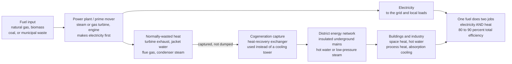

# ♨️ Cogeneration and District Energy: One Fuel Doing Two Jobs

> [!abstract] TL;DR
> A conventional power plant is thermodynamically forced to throw away **most of its fuel's energy as low-grade waste heat** — roughly 55 to 60 percent goes up cooling towers or into a river, doing nothing. **Cogeneration** (also called **combined heat and power**, or **CHP**) is the simple, brilliant fix: build the plant near where heat is needed and **actually use that "waste" heat** for space heating, hot water, or industrial process heat. Now a single fuel input delivers **both** electricity and heat, and the total fuel-**utilization** efficiency leaps from ~40 percent (power only, heat wasted) to **80 to 90 percent** (both used). **District energy** is the delivery network that makes this work at city scale: insulated underground pipes carry hot water or steam (or chilled water) from a central plant to whole neighborhoods of homes, hospitals, and factories — enabling economies of scale, fuel flexibility, and the use of waste, geothermal, or renewable heat. The deep principle is **exergy**, or energy *quality*: use high-temperature heat to make electricity *first*, then cascade the leftover medium- and low-temperature heat down to heating tasks, rather than squandering a 1500 °C flame directly on 70 °C tap water. Cogeneration and district energy are among the highest-impact efficiency measures in the entire energy system — nearly *doubling* the useful energy squeezed from every unit of fuel.

## Intuition

**Analogy:** Imagine your car's engine on a freezing winter day. Burning gasoline spins the wheels, but the engine also gets *scorching hot* — and a normal power plant is like a car that dumps every bit of that engine heat into the outside air while you shiver. Cogeneration is like piping the engine's heat into the cabin to warm you *at the same time* it drives the car: the **same fuel now does two jobs at once**, and you burn no extra gas to stay warm. Scale that idea up to a whole city. Instead of one power plant out in the countryside dumping its heat into a river, while every building downtown burns *its own separate fuel* in furnaces and boilers to make heat, you build the plant right next to the city and run its hot water through pipes to warm every home, hospital, and factory. One fire, two useful outputs.

That is the essence of it. A power plant *must* reject heat somewhere — the second law of thermodynamics guarantees it — so the only question is whether that heat warms a river nobody cares about or warms the buildings that would otherwise burn *more* fuel. Cogeneration chooses the second. **District energy** is simply the plumbing that carries the reclaimed heat to where people live and work. Together they turn the biggest "loss" in the energy system into its second product.

---

## How It Works

### Core Mechanics

1. **Start from the loss.** Every thermal power plant is a heat engine, and every heat engine is bound by the Carnot ceiling — it *must* dump leftover heat to a cold sink. A modern condensing power plant converts perhaps 40 percent of its fuel to electricity and **rejects the other ~55 to 60 percent as low-temperature waste heat** at the condenser. Cogeneration does not defeat this loss; it *captures and uses* the rejected heat instead of dumping it.

2. **Raise the condenser temperature, then use the heat.** The trick is to reject the engine's heat at a *useful* temperature (say 80 to 120 °C hot water, or low-pressure steam) rather than at a useless one (a 30 °C cooling tower). This is done with **extraction/back-pressure steam turbines** (bleed steam off the turbine before it fully expands), **gas turbines / combined-cycle plants** with a **heat-recovery steam generator** on the exhaust, **reciprocating engines** (recover jacket-water and exhaust heat), or **fuel cells** (high-grade electrochemical waste heat). There is a small electricity penalty — you sacrifice a little power output to keep the heat hot enough to use — but you gain a *large* amount of useful heat.

3. **Topping vs bottoming cycles.** In a **topping cycle** (the common case) fuel makes electricity *first* and the rejected heat is used for heating — power is the premium product, heat the by-product. In a **bottoming cycle** the process comes first: a high-temperature industrial process (a furnace, a cement kiln) runs on the fuel, and its hot exhaust then drives a turbine to make electricity as the by-product.

4. **The power-to-heat ratio.** Every CHP plant is characterized by how much electricity it makes per unit of heat. A gas turbine or engine is "power-rich" (ratio ~0.8 to 1.5); a back-pressure steam turbine is "heat-rich" (ratio ~0.2 to 0.5). Matching this ratio to the site's actual electricity-versus-heat demand is the central design decision — a mismatch means either wasted heat or a shortfall of one product.

5. **Utilization efficiency, not thermal efficiency.** The right scorecard is **fuel-utilization efficiency** = (useful electricity + useful heat) / fuel energy. A power-only plant scores ~40 percent; a good CHP plant scores **80 to 90 percent** because *both* outputs count. The primary-energy *saving* versus making the same electricity and heat separately is typically 15 to 30 percent.

6. **District energy — the network.** A central plant sends hot water or steam through insulated underground **supply mains** to many buildings; each building draws heat through a **heat exchanger** at a substation, and the cooled water returns to the plant to be reheated. This decouples *where heat is produced* from *where it is used*, enabling one large, efficient, well-controlled plant to replace thousands of small inefficient boilers — and letting the network tap **waste heat, geothermal, large heat pumps, solar thermal, or waste-to-energy** that no single building could use alone.

7. **The exergy logic — cascade energy by quality.** High-temperature heat is *high-quality* (high exergy): it can be converted to work/electricity. Low-temperature heat is *low-quality*: good only for heating. The thermodynamically smart move is a **cascade** — use the hottest heat to make electricity first, then use the progressively cooler leftover heat for process steam, then space heating, then preheating — extracting maximum value at each rung before letting the energy fall to the next. Burning a 1500 °C flame *directly* to make 70 °C hot water is a first-law "success" but an exergy catastrophe; cogeneration is the fix.

8. **Trigeneration.** Add an **absorption chiller** — a device that makes *cold* from *heat* — and the same plant delivers electricity, heating, **and** cooling (combined cooling, heat and power, CCHP). This is powerful because it puts the waste heat to work in summer, when heating demand collapses, smoothing the seasonal mismatch that otherwise idles a CHP plant half the year.

### Flow / Architecture



---

## Key Concepts

### Secondary (intuitive foundation)

- **Power plants waste most of their fuel as heat.** Only about a third to 40 percent of a burning fuel's energy becomes electricity; the rest escapes as warm water and warm air. This is a law of nature, not sloppy engineering.
- **Cogeneration uses that wasted heat.** Instead of dumping the heat, a CHP plant pipes it to nearby buildings for heating and hot water — so one fuel does two jobs and almost nothing is wasted.
- **District heating is the pipe network.** A single big plant heats water and sends it underground to a whole neighborhood, replacing thousands of small furnaces. Whole countries — Denmark, Sweden, Iceland, Finland — heat most of their cities this way.
- **Two useful outputs beat one.** A power-only plant is ~40 percent efficient; a cogeneration plant is 80 to 90 percent efficient *because the heat counts too*. That means less fuel burned, lower bills, and fewer emissions for the same warmth and power.

### Undergraduate (the working relations)

- **Fuel-utilization efficiency:** $\eta_{util} = (W_{elec} + Q_{useful}) / Q_{fuel}$. This is the correct metric for CHP — it credits both products, unlike the electric-only thermal efficiency $\eta_{th} = W_{elec}/Q_{fuel}$.
- **Power-to-heat ratio:** $C = W_{elec}/Q_{useful}$. Gas turbines and engines are power-rich (high $C$); back-pressure steam turbines are heat-rich (low $C$). The ratio must be matched to site demand.
- **Primary-energy savings (PES):** compare CHP fuel to the fuel that *separate* production would burn — electricity at a reference power-plant efficiency $\eta_{e,ref}$ plus heat at a reference boiler efficiency $\eta_{b,ref}$. $\text{PES} = 1 - \dfrac{Q_{fuel,CHP}}{W/\eta_{e,ref} + Q/\eta_{b,ref}}$, typically 15 to 30 percent.
- **Prime movers:** back-pressure and extraction-condensing **steam turbines**; **gas turbines** and **combined-cycle** plants with a heat-recovery steam generator (HRSG); **reciprocating engines** (jacket + exhaust recovery); **fuel cells**. Each has a characteristic power-to-heat ratio and heat-grade.
- **Topping vs bottoming cycle:** topping = power first, heat second (most CHP); bottoming = process heat first, power from the exhaust (heavy industry).
- **District network basics:** supply/return temperatures, a distribution pump, insulated pre-insulated pipe, building substations with heat exchangers, and heat metering. Lower supply temperature means lower pipe losses and enables low-grade heat sources.

### Graduate (quality, systems, and limits)

- **Exergy accounting and the quality cascade.** For heat at temperature $T$ relative to a dead state $T_0$, the exergy (work-equivalent) fraction is $\varphi = 1 - T_0/T$. High-$T$ heat is nearly all exergy; low-$T$ heat is nearly all *anergy*. Cogeneration and the district temperature-cascade are the engineered expression of the rule "**match energy quality to task**" — skim the high-exergy top for electricity, deliver the low-exergy remainder to space heat.
- **The electricity-versus-heat trade-off.** Extracting or back-pressuring a turbine to keep heat hot costs electrical output. The **z-factor** (loss of power per unit of heat delivered) quantifies this; a well-designed CHP plant accepts a small $z$ to gain a large heat output, and the *net* exergy efficiency still rises because the rejected heat now carries useful exergy instead of being destroyed at the condenser.
- **Generations of district heating (1G to 4G/5G).** First-generation networks used high-pressure steam; successive generations dropped temperatures (hot water, then medium, then low). **4th-generation** low-temperature networks (~50 to 70 °C supply) are the enabler for **renewable and waste heat**: they can be fed by large heat pumps, solar thermal, data-center waste heat, and industrial low-grade heat that hotter networks could never use. **5G** ambient-loop networks let buildings both draw and reject heat, sharing thermal loads across a district.
- **Absorption cooling and trigeneration.** A lithium-bromide or ammonia **absorption chiller** is a heat-driven refrigerator (COP ~0.7); feeding it CHP waste heat converts summer heat surplus into cooling, flattening the seasonal load and raising annual utilization.
- **Second-law (exergetic) efficiency.** First-law utilization can read 85 percent while exergetic efficiency is far lower, because most of the delivered *heat* is low-exergy. The honest optimization minimizes **exergy destruction** ($\dot{X}_{dest} = T_0 \dot{S}_{gen}$), which is why decarbonized district heat increasingly favors heat pumps and waste heat over burning premium fuel for low-grade warmth.
- **Systems constraints.** CHP economics hinge on the **spark spread** (electricity price minus fuel cost) and on a co-located, year-round heat sink. Heat cannot travel far (pipe losses, capital), so heat demand must sit near the plant; seasonal mismatch, high network capital cost, and the "chicken-and-egg" of network build-out are the recurring barriers.

---

## Python Demo

```python
# Cogeneration & district energy: why using the "waste" heat wins.
# (a) SEPARATE production (power plant + boiler, heat wasted) vs COGENERATION
#     (one plant supplying BOTH), for the same delivered electricity and heat.
#     -> compares fuel input, utilization efficiency, and primary-energy saving.
# (b) The EXERGY / QUALITY CASCADE: energy quality (1 - T0/T) falls with
#     temperature, so smart design skims high-grade heat for electricity FIRST,
#     then cascades the leftover down to district heating.
import numpy as np
import matplotlib.pyplot as plt

# ---------------------------------------------------------------------------
# (a) SEPARATE vs COGENERATION for the same useful outputs
# ---------------------------------------------------------------------------
# The cogeneration plant: 100 units of fuel in ->
eta_e_chp  = 0.35            # electrical efficiency  -> 35 units electricity
eta_th_chp = 0.50            # useful-heat efficiency -> 50 units heat
fuel_chp   = 100.0
E = fuel_chp * eta_e_chp     # electricity delivered  (units)
H = fuel_chp * eta_th_chp    # useful heat delivered  (units)
util_chp   = (E + H) / fuel_chp          # utilization efficiency (85%)
p2h        = E / H                        # power-to-heat ratio

# The SEPARATE reference system delivering the SAME E and H:
eta_e_ref  = 0.50            # modern condensing power plant (electricity only)
eta_boiler = 0.90           # separate gas boiler (heat only)
fuel_e_sep = E / eta_e_ref              # fuel to make the electricity
fuel_h_sep = H / eta_boiler             # fuel to make the heat
fuel_sep   = fuel_e_sep + fuel_h_sep
util_sep   = (E + H) / fuel_sep
PES        = 1.0 - fuel_chp / fuel_sep   # primary-energy saving

print("=== (a) SEPARATE vs COGENERATION (same outputs) ===")
print(f"  delivered:  {E:.0f} elec + {H:.0f} heat   (power-to-heat ratio {p2h:.2f})")
print(f"  SEPARATE  : fuel {fuel_sep:5.1f}  "
      f"(elec {fuel_e_sep:.1f} + boiler {fuel_h_sep:.1f})  "
      f"util {util_sep*100:4.1f}%")
print(f"  COGEN     : fuel {fuel_chp:5.1f}                          "
      f"util {util_chp*100:4.1f}%")
print(f"  -> primary-energy saving = {PES*100:4.1f}%  "
      f"(fuel cut by {fuel_sep - fuel_chp:.1f} units)")

# ---------------------------------------------------------------------------
# (b) EXERGY / QUALITY CASCADE:  phi = 1 - T0/T  (work-equivalent fraction)
# ---------------------------------------------------------------------------
T0 = 288.15                              # dead-state (ambient) 15 C, kelvin
T_curve = np.linspace(300.0, 1800.0, 400)
phi_curve = 1.0 - T0 / T_curve           # exergy fraction of heat at T

# discrete temperature "rungs" of a real cogeneration cascade:
rungs = {
    "Combustion flame\n(make electricity)":  1500 + 273.15,
    "Turbine exhaust\n(process steam)":        550 + 273.15,
    "Process heat\n(industry)":                250 + 273.15,
    "District hot water\n(space heat)":         90 + 273.15,
    "Return line\n(preheat)":                   50 + 273.15,
}
print("\n=== (b) EXERGY QUALITY CASCADE (T0 = 15 C) ===")
for name, T in rungs.items():
    label = name.replace(chr(10), " ")
    print(f"  {label:34s} T={T-273.15:6.0f} C   phi = {1 - T0/T:5.3f}")

# ---------------------------------------------------------------------------
# Plot
# ---------------------------------------------------------------------------
fig, (ax1, ax2) = plt.subplots(1, 2, figsize=(14, 5.5))

# (a) grouped/stacked bars: separate (split into elec-fuel + heat-fuel) vs cogen
ax1.bar(0, fuel_e_sep, color="#8338ec", label="fuel for electricity")
ax1.bar(0, fuel_h_sep, bottom=fuel_e_sep, color="#e07b39", label="fuel for heat")
ax1.bar(1, fuel_chp, color="#00b894", label="cogeneration (one fuel, both)")
ax1.hlines(fuel_chp, -0.4, 1.4, color="gray", ls=":", lw=1.5)
ax1.annotate("", xy=(0.5, fuel_chp), xytext=(0.5, fuel_sep),
             arrowprops=dict(arrowstyle="<->", color="crimson", lw=2))
ax1.text(0.55, (fuel_chp + fuel_sep) / 2,
         f"fuel saved\n{PES*100:.0f}%", color="crimson", fontsize=10, va="center")
ax1.text(0, fuel_sep + 3, f"util {util_sep*100:.0f}%", ha="center", fontsize=9)
ax1.text(1, fuel_chp + 3, f"util {util_chp*100:.0f}%", ha="center", fontsize=9,
         fontweight="bold")
ax1.set_xticks([0, 1])
ax1.set_xticklabels(["SEPARATE\npower plant + boiler", "COGENERATION\none plant"])
ax1.set_ylabel("primary fuel input  [units]")
ax1.set_title(f"(a) Same {E:.0f} elec + {H:.0f} heat delivered:\n"
              f"cogeneration burns far less fuel")
ax1.set_ylim(0, fuel_sep * 1.18)
ax1.legend(loc="upper right", fontsize=8)

# (b) exergy cascade curve + rungs
ax2.plot(T_curve - 273.15, phi_curve, lw=2.5, color="crimson",
         label="heat quality  phi = 1 - T0/T")
ax2.fill_between(T_curve - 273.15, 0, phi_curve, color="crimson", alpha=0.06)
for name, T in rungs.items():
    phi = 1 - T0 / T
    ax2.scatter([T - 273.15], [phi], s=70, zorder=5, color="#2a3d66")
    ax2.annotate(name, (T - 273.15, phi), textcoords="offset points",
                 xytext=(6, 6), fontsize=7.5)
ax2.axvspan(600, 1600, color="#8338ec", alpha=0.05)
ax2.axvspan(0, 130, color="#e07b39", alpha=0.06)
ax2.text(1080, 0.05, "high grade ->\nelectricity", color="#8338ec",
         ha="center", fontsize=8)
ax2.text(65, 0.62, "low grade ->\ndistrict heat", color="#c0621a",
         ha="center", fontsize=8)
ax2.set_xlabel("heat temperature  [degrees C]")
ax2.set_ylabel("exergy fraction  phi  (work-equivalent share)")
ax2.set_title("(b) Cascade energy by QUALITY:\nskim electricity first, heat last")
ax2.set_ylim(0, 1)
ax2.grid(alpha=0.3)
ax2.legend(loc="lower right", fontsize=8)

plt.tight_layout()
plt.savefig("cogeneration_district_energy.png", dpi=120)
plt.show()
```

Running this prints and plots the whole argument. **Panel (a):** to deliver the same 35 units of electricity and 50 units of heat, the *separate* system (a 50 percent-efficient power plant plus a 90 percent-efficient boiler) burns about **126 units of fuel** at a combined utilization of ~68 percent, while a single **cogeneration** plant burns just **100 units** at ~85 percent utilization — a **primary-energy saving of about 20 percent**, with the fuel savings shown by the red arrow. **Panel (b):** the exergy fraction $\varphi = 1 - T_0/T$ makes "energy quality" concrete — heat at a 1500 °C flame is ~84 percent work-equivalent, but heat at 90 °C district-water is only ~21 percent. Burning that flame *straight* into hot water would destroy most of its work potential, so the thermodynamically smart plant **cascades**: skim the high-grade top for electricity, then hand the degraded low-grade heat to the district network. That cascade is exactly what cogeneration does.

---

## Real-World Applications

> **Example — Denmark's district-heating grid.** More than 60 percent of Danish homes are heated by district networks fed largely by **CHP plants and waste-to-energy incinerators**, backed increasingly by large heat pumps, solar thermal, and waste heat. A single plant such as Copenhagen's Amager Bakke burns municipal waste to make electricity *and* pipes its heat to hundreds of thousands of dwellings — the textbook demonstration that a nation can heat its cities from what a power-only system would have thrown away. Iceland (geothermal district heat), Sweden, Finland, and much of the former Soviet bloc run comparable systems.

- **Combined-cycle CHP for industry and campuses.** A gas turbine's ~600 °C exhaust drives a heat-recovery steam generator; the steam runs a turbine for extra power *and* supplies process heat or campus heating. Universities, hospitals, and chemical plants use on-site CHP for resilience and to reach 80-plus percent fuel utilization.
- **Reciprocating-engine CHP.** Gas-engine gensets recover jacket-water and exhaust heat for hospitals, hotels, greenhouses, and apartment blocks — modular, fast-responding, and well suited to variable heat loads.
- **Industrial cogeneration (self-generation).** Pulp-and-paper, refining, food processing, and chemicals self-supply electricity and process steam from one boiler/turbine train — often a *bottoming* cycle recovering power from high-temperature process exhaust.
- **Trigeneration in data centers and airports.** Adding absorption chillers turns CHP heat into cooling, so the plant stays useful in summer — data centers in particular pair CHP with absorption cooling and increasingly export server waste heat into 4th-generation district networks.
- **Waste-heat district networks (4G/5G).** Low-temperature networks recover heat from data centers, metro tunnels, sewage, and industry via heat pumps — a key **decarbonization** route for heating, the hard-to-electrify sector, without burning premium fuel for low-grade warmth.

---

## Common Pitfalls

- **Confusing thermal efficiency with utilization efficiency.** A CHP plant's electric-only efficiency looks *mediocre* (often ~35 percent) precisely because it is trading some power for heat. Judge it by **fuel-utilization efficiency** (electricity + useful heat), where it scores 80 to 90 percent — otherwise you will wrongly conclude cogeneration is inefficient.
- **Counting heat that has no home.** Utilization efficiency only counts heat that is *actually used*. A CHP plant sized to electrical demand but sited where no one needs the heat dumps it anyway and performs no better than a normal power plant. **Heat must have a real, nearby, sustained load.**
- **Ignoring the seasonal mismatch.** Heat demand collapses in summer while electricity demand may not, so a heat-following CHP plant can sit idle half the year, wrecking its economics. Trigeneration (absorption cooling), thermal storage, or a heat-and-power blend is the usual remedy.
- **Mismatching the power-to-heat ratio.** Picking a power-rich gas turbine for a heat-rich site (or vice versa) forces you to either waste heat or import power, erasing the savings. Size the prime mover to the *demand profile*, not the nameplate.
- **Treating all heat as equal (ignoring exergy).** Delivering 400 °C steam to a task that needs 60 °C water destroys exergy needlessly. Match the network supply temperature to the *lowest* grade that serves the load — the reason 4th-generation low-temperature networks outperform legacy high-temperature steam ones.
- **Underestimating network capital and heat loss.** District pipes are expensive to build and lose heat over distance, so cogeneration favors **dense** heat loads near the plant. Long, thin, low-density networks can lose the very savings that justified them — the "chicken-and-egg" of network build-out is a real barrier.
- **Assuming CHP is automatically green.** Fossil-fired CHP still emits carbon; it merely emits *less per unit of useful energy*. The decarbonization win comes from feeding networks with **waste heat, biomass, geothermal, or large heat pumps** — the network is the enabler, the heat source is what determines the emissions.

---

## Related Concepts

- [[Thermodynamics_of_Energy_Conversion]] — the Carnot ceiling and the mandatory waste-heat rejection that cogeneration exists to *reclaim*; also the exergy/energy-quality foundation behind the cascade principle.
- [[Engineering_Thermodynamics]] — the cycle-analysis machinery (steam and gas cycles, energy and exergy balances) used to design and rate CHP prime movers.
- [[Power_and_Refrigeration_Cycles]] — the Rankine and Brayton cycles that CHP modifies with extraction/back-pressure, and the absorption-refrigeration cycle behind trigeneration cooling.
- [[Heat_Exchangers_and_HVAC]] — the heat-recovery exchangers, substations, and building-side HVAC that transfer reclaimed heat into the district network and into rooms.
- [[Sustainable_and_Energy_Systems_Engineering]] — the decarbonization view of waste-heat recovery, heat pumps, and efficiency levers into which district energy fits as a city-scale tool.
- [[Urban_and_Infrastructure_Systems]] — the city-scale networked-infrastructure and systems-thinking lens on district energy as shared urban infrastructure with strong economies of scale.

Within the Energy Systems vault, this note is the efficiency companion to its **Thermal & Fossil Power** siblings — Steam and Rankine Power Plants and Gas Turbines and Combined Cycle (the prime movers CHP adapts), Exergy and Energy Quality (the quality-cascade principle developed in full), Energy Efficiency and Demand Management (the demand-side view), and Geothermal Energy (a prime clean heat source for district networks) — all referenced here in prose because they are neighboring section notes.

---

## Review Questions

1. **(Secondary)** A power plant in the countryside burns fuel and warms a nearby river with its leftover heat, while every building in the city burns its own gas to stay warm. Explain, in plain terms, how cogeneration and a district-heating network could let *one* fuel do *both* jobs — and why that burns less fuel overall.
2. **(Undergraduate)** A cogeneration plant takes 100 units of fuel and delivers 35 units of electricity and 50 units of useful heat. (i) Compute its fuel-utilization efficiency and its power-to-heat ratio. (ii) To deliver the same electricity and heat *separately* you would use a 50 percent-efficient power plant and a 90 percent-efficient boiler — compute the total separate fuel and the primary-energy saving of the CHP plant. (iii) Explain why the plant's electric-only efficiency of 35 percent is a misleading way to judge it.
3. **(Graduate)** Using the exergy fraction $\varphi = 1 - T_0/T$, explain why delivering district heat at 90 °C from a 1500 °C flame is a first-law "success" but a second-law disaster, and how a topping-cycle cascade fixes it. Then argue why **4th-generation low-temperature** district networks (fed by heat pumps and waste heat) can be a *better* long-run decarbonization strategy for heating than ever-more-efficient fossil CHP — and what the key barriers are.

---

## Sources

- J. Tester, E. Drake, M. Driscoll, M. Golay & W. Peters — *Sustainable Energy: Choosing Among Options*, 2nd ed. (MIT Press, 2012). [Publisher](https://mitpress.mit.edu/9780262017473/sustainable-energy/)
- S. Frederiksen & S. Werner — *District Heating and Cooling* (Studentlitteratur, 2013) — the standard reference on district-energy systems and generations. [WorldCat](https://search.worldcat.org/title/857364844)
- Y. A. Çengel & M. A. Boles — *Thermodynamics: An Engineering Approach* (McGraw-Hill) — cogeneration, back-pressure/extraction cycles, and utilization efficiency. [Publisher](https://www.mheducation.com/highered/product/thermodynamics-engineering-approach-cengel-boles.html)
- International Energy Agency — *Combined Heat and Power* and district-energy analyses (IEA, ongoing). [IEA CHP](https://www.iea.org/energy-system/energy-efficiency-and-demand/combined-heat-and-power)
- H. Lund et al. — "4th Generation District Heating (4GDH)," *Energy* 68 (2014) 1–11 — the low-temperature, renewable-ready network concept. [DOI](https://doi.org/10.1016/j.energy.2014.02.089)

---

#energy-systems #cogeneration #CHP #district-heating #waste-heat
