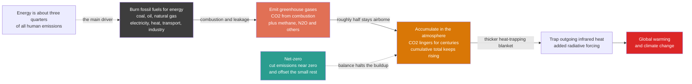

# 🌫️ Emissions and the Climate Impact of Energy: The Atmospheric Blanket We Are Building

> [!abstract] TL;DR
> **The energy system is the single largest cause of climate change** — producing and using energy to power, heat, and move civilization emits about **three-quarters of all human greenhouse gases**, chiefly **CO₂ from burning fossil carbon**, with **methane** (from gas and coal) and other gases adding to the load. The dangerous property is that **CO₂ accumulates**: a large fraction lingers in the atmosphere for **centuries**, so it is the **cumulative total** we have ever emitted — the **carbon budget** — that sets the eventual warming, not any single year's rate. That means holding emissions steady still thickens the heat-trapping blanket, and only cutting them to **net-zero** (near-zero emissions plus removal of the residual) actually *stops* the buildup. To tell real climate solutions from greenwashing you have to **quantify honestly**: measured by **lifecycle carbon intensity** (grams of CO₂-equivalent per kWh), coal is worst (~820), gas about half (~490), while **solar, wind, nuclear, and hydro are all near-zero (~10–50)** — clean electricity is roughly **one to two orders of magnitude** cleaner than fossil per unit of energy. This note connects the energy technologies of the vault to their climate consequences, and it is the reason the entire transition is urgent.

## Intuition

**Analogy:** Burning fossil fuels for energy is like slowly filling the atmosphere with an **invisible blanket**. Every ton of coal, every barrel of oil, every cubic meter of gas we burn releases CO₂ that does not blow away with the next weather system — it **lingers in the air for centuries**, thickening a layer that lets sunlight in but traps the planet's outgoing heat. And energy is by far the biggest culprit: about **three-quarters of humanity's greenhouse emissions** come from producing and using energy — the electricity, heat, and motion that run modern life.

The sobering twist is that this blanket **accumulates**. Most pollution washes out of the air in days or weeks, but CO₂ is different: what matters is the **total amount we have ever dumped**, so every year of emissions makes the problem **permanently worse**, and *even holding emissions perfectly steady still keeps adding to the blanket*. That is why **net-zero** — cutting emissions to nearly nothing and balancing the small remainder with removal — is the only way to stop the blanket from growing, and why the whole energy transition is really a **race to stop adding to it** before the warming becomes catastrophic. Understanding which energy choices emit how much is exactly how you separate genuine climate solutions from empty gestures.

---

## How It Works

### Core Mechanics

The link from an energy choice to a warmer planet runs through five steps, and the crucial one — accumulation — is the step most people skip:

1. **Combustion releases greenhouse gases.** Burning a hydrocarbon fuel oxidizes its carbon into **CO₂** (the dominant gas) and its hydrogen into water, releasing chemical energy as heat. The more carbon per unit of energy a fuel contains, the more CO₂ it emits: **coal** (almost pure carbon) is worst, **oil** is intermediate, **natural gas** (mostly CH₄, a hydrogen-rich molecule) is the least-emitting fossil fuel per unit of heat. Alongside CO₂ come **methane** (leaked from gas and oil systems and vented from coal mines), **nitrous oxide (N₂O)**, and others.

2. **The gases trap outgoing heat.** Sunlight passes through the atmosphere and warms the surface; the surface re-radiates that energy as **infrared**. Greenhouse gases absorb and re-emit this outgoing infrared, reducing how fast heat escapes to space. The resulting energy imbalance at the top of the atmosphere is the **radiative forcing** — the physics is developed in the climate notes; here the point is simply *more greenhouse gas means a thicker blanket*.

3. **CO₂ accumulates — the key property.** Unlike smoke or soot, CO₂ is not scrubbed out quickly. Roughly **half** of each year's emissions is absorbed by ocean and land sinks within decades, but a stubborn **~20–30% persists for centuries to millennia**. So CO₂ **piles up**: the atmospheric concentration is the running *integral* of all past emissions minus what the sinks have removed.

4. **Cumulative emissions set the warming — the carbon budget.** Because accumulation dominates, peak warming is very nearly proportional to the **total CO₂ ever emitted**, not to the annual rate. This near-linear relationship gives the **carbon budget**: a finite total we can emit for a given temperature limit (about **500 GtCO₂** from 2020 for a coin-flip chance at 1.5 °C). Spend the budget and the temperature target is gone — regardless of how slowly you spent it.

5. **Only net-zero stops the buildup.** Since steady emissions still add to the blanket, stabilizing the climate requires driving net emissions to **zero** — cutting them near to nothing (clean electricity + electrification + efficiency) and offsetting the hard-to-abate residual with **carbon capture or removal**. This is why "net-zero," not "less," is the physically necessary target.

**Measuring and comparing.** To act, you must quantify. Three tools do the work: **carbon intensity** (CO₂ per kWh) ranks *sources*; **lifecycle assessment (LCA)** counts *all* emissions — mining, manufacturing, construction, operation, decommissioning — not just the smokestack, which is the only fair way to compare a wind turbine (no fuel, but steel and concrete) against a gas plant; and **global warming potential (GWP)** converts non-CO₂ gases into "CO₂-equivalent" so methane and N₂O can be added to the ledger.

### Flow / Architecture



---

## Key Concepts

### Secondary Level

- **Energy is the main cause.** About **three-quarters (~73%)** of the greenhouse gases humans release come from **energy** — burning coal, oil, and gas to make electricity, heat buildings and factories, and power cars, trucks, ships, and planes. Fix energy and you fix most of the problem.
- **CO₂ is the main gas.** Burning anything made of carbon releases **carbon dioxide**. Coal makes the most per unit of energy, gas the least of the fossil fuels. **Methane** — the main ingredient of natural gas — also leaks straight into the air and is a powerful warmer.
- **The blanket builds up.** CO₂ stays in the air for **hundreds of years**, so it keeps piling up. This is different from ordinary pollution that clears in a few days. Every year we burn fuel, the blanket gets a little thicker — and it stays thicker.
- **Clean energy is far cleaner.** Sun, wind, water, and nuclear power emit **almost no** greenhouse gas while running. Counting everything it takes to build them, they are still **10 to 100 times cleaner** per unit of electricity than coal or gas.
- **Net-zero is the goal.** Because the blanket keeps building as long as we emit, we must get emissions **down to nearly zero** and cancel out whatever is left. Only then does the atmosphere stop getting warmer. That is what **"net-zero"** means.
- **Other harms too.** Burning fossil fuels also fills the air with soot and smog that **damage health** — millions of early deaths every year — on top of the climate damage.

### Undergraduate Level

- **The energy share, precisely.** Of total human greenhouse-gas emissions (~**50 GtCO₂-eq/yr**), the **energy sector is ~73%**: electricity and heat (~30% of the total), transport (~15%), manufacturing and construction (~12%), buildings (~6%), and other energy uses. Agriculture, land use, and industrial processes make up the non-energy remainder. The takeaway: **decarbonizing energy is most of the job.**
- **Carbon intensity of a fuel.** Emissions per unit of *heat* released: coal ≈ **95 gCO₂/MJ**, oil ≈ 73, natural gas ≈ 56. Per unit of *electricity*, the plant's efficiency matters too — a 60%-efficient gas combined-cycle plant emits far less per kWh than a 35%-efficient old coal unit, which is why both fuel *and* conversion efficiency (see [[Thermodynamics_of_Energy_Conversion]]) set the smokestack figure.
- **Lifecycle carbon intensity (gCO₂-eq/kWh).** The fair, whole-system number (IPCC AR5 medians): **coal ≈ 820**, **gas (CCGT) ≈ 490**, **hydro ≈ 24**, **solar PV ≈ 41–48**, **nuclear ≈ 12**, **wind ≈ 11–12**. Fossil sources are dominated by *operational* combustion; clean sources are dominated by *upfront* manufacturing and construction (steel, concrete, silicon) with near-zero operating emissions — hence the ~50–100× gap.
- **Global Warming Potential (GWP).** A common yardstick that expresses each gas relative to CO₂ over a chosen horizon. **Methane** has GWP₁₀₀ ≈ **28–30** but GWP₂₀ ≈ **80+**, because it is potent but short-lived (~12-year atmospheric lifetime); **N₂O** ≈ 273 (GWP₁₀₀). The horizon choice is a genuine policy lever: judged over 20 years, curbing methane leaks buys fast near-term relief.
- **The carbon budget arithmetic.** Peak warming ≈ **TCRE × cumulative CO₂**, where the Transient Climate Response to Emissions is ~**0.45 °C per 1000 GtCO₂**. This near-linearity is why a *budget* exists at all: ~**500 GtCO₂** remains (from 2020, 50% odds for 1.5 °C); at ~40 GtCO₂/yr it is exhausted in little over a **decade**.
- **Emissions accounting — Scopes and boundaries.** Corporate/GHG-Protocol accounting splits emissions into **Scope 1** (direct, on-site combustion), **Scope 2** (purchased electricity/heat), and **Scope 3** (everything up- and down-stream — supply chain, product use). Nationally, **territorial** accounting (emissions inside your borders) differs from **consumption-based** accounting (emissions embodied in what you *consume*, including imports) — the reason a country can "cut" emissions merely by importing its steel.
- **The decarbonization levers.** Deep cuts come from a small set of moves: **clean the electricity supply** (swap fossil generation for renewables + nuclear), **electrify end uses** (EVs, heat pumps — which also *raise system efficiency*, see the energy overview), **improve efficiency**, **control methane leaks** (often cheap and fast), and apply **carbon capture or removal** to the residual that resists the first four.

### Graduate Level

- **Near-linearity of warming in cumulative emissions.** The **TCRE** (Transient Climate Response to cumulative Emissions) is remarkably path-independent: warming tracks the running total of CO₂ almost regardless of the emission *trajectory*, because the ocean's diminishing heat uptake and CO₂'s slow drawdown roughly cancel. This is the deep physical reason a **carbon budget** — rather than a concentration or rate target — is the natural currency of mitigation, and why the **Zero-Emission Commitment (ZEC)** is near zero (warming largely halts when emissions halt).
- **Short-lived vs long-lived forcers and GWP\*.** Conventional GWP mishandles short-lived gases: a *constant* methane flux adds a roughly *constant* warming (not an ever-growing one), whereas *constant* CO₂ emissions cause *rising* warming. **GWP\*** was introduced to map a change in the *rate* of a short-lived gas onto CO₂-equivalent *cumulative* emissions, better representing methane's true warming impact and clarifying that **cutting** methane can deliver genuine cooling on decadal timescales — high-leverage for the fossil energy sector's fugitive emissions.
- **Lifecycle assessment methodology and its traps.** LCA results depend heavily on **system boundary**, **allocation** rules (co-products), the assumed **grid mix** for manufacturing energy, capacity factor, and lifetime. Attributional LCA (average bookkeeping) and **consequential** LCA (marginal, what-changes-if) can diverge sharply — e.g., whether new solar displaces coal or gas at the margin. Contentious cases: **reservoir hydro** in tropical wetlands (biogenic CH₄ from flooded biomass can rival fossil intensity), **bioenergy** carbon-neutrality claims (timing of regrowth, indirect land-use change), and the embodied carbon of **storage** and grid reinforcement needed to firm variable renewables.
- **Marginal vs average emissions and the "clean EV" question.** The climate value of electrifying a load depends on the **marginal** generator that responds, not the grid average. Charging an EV at night on a coal-heavy margin can, transiently, be dirtier than the average figure suggests; time- and location-resolved **marginal emissions factors** are essential for honest attribution and for optimizing flexible demand.
- **Residual emissions, CDR, and the meaning of "net."** Net-zero tolerates a residual (aviation, shipping, cement-process CO₂, some agriculture) offset by **carbon dioxide removal** — afforestation, BECCS, direct air capture, enhanced weathering. Crucial distinctions: **avoided emissions ≠ removals**; **temporary** biological storage ≠ **durable** geological storage; and large-scale reliance on future removals is a **moral-hazard** risk that can license present-day delay. The credibility of any net-zero claim rests on the size, permanence, and additionality of the assumed residual and offsets.
- **Committed emissions and stranded assets.** Existing fossil infrastructure carries **committed emissions** — the CO₂ it will emit over its remaining lifetime if run to plan. The committed emissions of *already-built* plants are comparable to the entire remaining 1.5 °C budget, which is why the budget framing implies **early retirement** (stranded assets) rather than merely halting new construction — a techno-economic and political constraint as binding as the physics.
- **Air pollution co-benefits and the aerosol paradox.** Fossil combustion's particulate and precursor emissions (PM₂.₅, SO₂, NOₓ) cause an estimated **several million premature deaths per year** — a public-health case for decarbonization independent of climate. Yet the same **sulfate aerosols** exert a *cooling* radiative forcing (~−1 W/m²) that has **masked** part of greenhouse warming; cleaning the air therefore *unmasks* warming even as it saves lives — a genuine coupling between air-quality and climate policy.

---

## Python Demo

```python
# Emissions & the climate impact of energy in three panels:
#   (a) LIFECYCLE CARBON INTENSITY by source -- the ~100x gap between fossil
#       and clean electricity (IPCC AR5 WG III median gCO2-eq/kWh).
#   (b) ANNUAL EMISSIONS pathways -- holding flat vs a net-zero decline.
#   (c) THE CARBON BUDGET -- cumulative emissions vs the finite 1.5 C budget,
#       showing that a flat path BLOWS the budget while only net-zero stays
#       inside it. numpy + matplotlib only.
import numpy as np
import matplotlib.pyplot as plt

# ============================================================
# (a) LIFECYCLE CARBON INTENSITY BY SOURCE  [gCO2-eq / kWh]
#     Counts construction + fuel + operation, not just the smokestack.
# ============================================================
sources   = ["Coal", "Gas\nCCGT", "Hydro", "Solar PV", "Nuclear", "Wind"]
intensity = np.array([820.0, 490.0, 24.0, 45.0, 12.0, 11.0])   # gCO2-eq/kWh
is_fossil = np.array([True, True, False, False, False, False])
bar_colors = ["#3d3d3d" if f else "#2a9d8f" for f in is_fossil]

print("=== (a) LIFECYCLE CARBON INTENSITY (gCO2-eq/kWh) ===")
for s, v in zip([x.replace("\n", " ") for x in sources], intensity):
    print(f"  {s:10s} {v:6.0f}")
print(f"  coal / wind ratio = {intensity[0] / intensity[-1]:.0f}x")

# ============================================================
# (b)+(c) THE CARBON BUDGET  [GtCO2]
#     Remaining budget for ~1.5 C from 2020 ~ 500 GtCO2 (50% odds).
# ============================================================
budget = 500.0                      # GtCO2 remaining from 2020
e0     = 40.0                       # GtCO2/yr in 2020
years  = np.arange(2020, 2071)

# Scenario 1: emissions held FLAT at 40 Gt/yr (the "steady is fine" fallacy)
flat = np.full_like(years, e0, dtype=float)

# Scenario 2: NET-ZERO -- linear decline 40 Gt (2020) -> 0 by 2050,
#             then a modest net-negative removal tail after 2050
netzero = np.where(years <= 2050, e0 * (1.0 - (years - 2020) / 30.0), -3.0)

cum_flat    = np.cumsum(flat)       # GtCO2 accumulated since 2020
cum_netzero = np.cumsum(netzero)

i_bust    = int(np.argmax(cum_flat >= budget))
year_bust = years[i_bust]
print("\n=== (b/c) CARBON BUDGET ===")
print(f"  remaining 1.5C budget from 2020 : {budget:.0f} GtCO2")
print(f"  flat 40 Gt/yr exhausts it in    : {year_bust}  (~{budget/e0:.0f} yr)")
print(f"  net-zero peak cumulative        : {cum_netzero.max():.0f} GtCO2 "
      f"(stays under {budget:.0f})")

# ------------------------------- plotting -------------------------------
fig, (axA, axB, axC) = plt.subplots(1, 3, figsize=(17, 5.6))
fig.suptitle("Emissions & the climate impact of energy: clean is ~100x cleaner, "
             "and the budget is finite", fontsize=13, fontweight="bold")

# (a) carbon intensity bars
bars = axA.bar(range(len(sources)), intensity, color=bar_colors,
               edgecolor="white")
for b, v in zip(bars, intensity):
    axA.text(b.get_x() + b.get_width() / 2, v + 12, f"{v:.0f}",
             ha="center", va="bottom", fontsize=9, fontweight="bold")
axA.set_xticks(range(len(sources)))
axA.set_xticklabels(sources, fontsize=9)
axA.set_ylabel("lifecycle emissions  [gCO2-eq / kWh]")
axA.set_ylim(0, 900)
axA.set_title("(a) Carbon intensity by source\nfossil vs clean, lifecycle",
              fontsize=11)
axA.text(0.97, 0.80, "coal is ~75x\ndirtier than wind", transform=axA.transAxes,
         ha="right", va="top", fontsize=9, color="#dc2626",
         bbox=dict(boxstyle="round", fc="#fde8e8", ec="#dc2626"))
from matplotlib.patches import Patch
axA.legend(handles=[Patch(color="#3d3d3d", label="fossil"),
                    Patch(color="#2a9d8f", label="clean")],
           loc="upper right", fontsize=9)

# (b) annual emissions pathways
axB.plot(years, flat, color="#dc2626", lw=2.5, label="hold flat at 40 Gt/yr")
axB.plot(years, netzero, color="#2a9d8f", lw=2.5, label="net-zero by 2050")
axB.axhline(0, color="k", lw=1, alpha=0.4)
axB.fill_between(years, netzero, 0, where=(netzero < 0),
                 color="#2a9d8f", alpha=0.2)
axB.annotate("net removal\n(net-negative)", xy=(2060, -3), xytext=(2052, -14),
             fontsize=8, color="#2a9d8f",
             arrowprops=dict(arrowstyle="->", color="#2a9d8f"))
axB.set_xlabel("year")
axB.set_ylabel("annual emissions  [GtCO2 / yr]")
axB.set_title("(b) Emission pathways\nsteady is NOT safe", fontsize=11)
axB.grid(alpha=0.3)
axB.legend(loc="upper right", fontsize=9)

# (c) cumulative emissions vs the budget
axC.plot(years, cum_flat, color="#dc2626", lw=2.5, label="flat path (cumulative)")
axC.plot(years, cum_netzero, color="#2a9d8f", lw=2.5,
         label="net-zero path (cumulative)")
axC.axhline(budget, color="#8338ec", lw=2, ls="--",
            label=f"1.5 C budget = {budget:.0f} Gt")
axC.axvline(year_bust, color="#dc2626", lw=1, ls=":")
axC.annotate(f"budget blown\n~{year_bust}", xy=(year_bust, budget),
             xytext=(year_bust + 3, budget * 0.55), fontsize=9, color="#dc2626",
             arrowprops=dict(arrowstyle="->", color="#dc2626"))
axC.set_xlabel("year")
axC.set_ylabel("cumulative emissions since 2020  [GtCO2]")
axC.set_title("(c) The carbon budget\naccumulation is what counts", fontsize=11)
axC.grid(alpha=0.3)
axC.legend(loc="upper left", fontsize=8)

plt.tight_layout(rect=[0, 0, 1, 0.93])
plt.show()
```

Running this prints the intensity table and budget arithmetic, then draws the argument in three panels. **Panel (a)** is the honest comparison that defeats greenwashing: on a full **lifecycle** basis, coal (~820) and gas (~490) tower over hydro, solar, nuclear, and wind (~11–48) — clean electricity is **roughly 50–100× cleaner per kWh**, and the residual for renewables is manufacturing, not operation. **Panel (b)** exposes the "steady is fine" fallacy: a flat 40 Gt/yr line *looks* stable, but it is still pouring CO₂ into a blanket that never clears. **Panel (c)** is the punchline — **cumulative** emissions are what set the warming: the flat path crosses the finite **~500 GtCO₂** 1.5 °C budget in the early **2030s**, while only the **net-zero** decline (with a net-negative tail) keeps the running total inside the budget. Together the panels say: *choose low-carbon-intensity sources, and bend the curve to net-zero fast, because the budget is spent in cumulative tons, not good intentions.*

---

## Real-World Applications

> **Example — comparing a gas plant and a wind farm the *right* way.** A utility choosing between a new **combined-cycle gas plant** and a **wind farm** cannot compare smokestacks alone: the wind farm has *no* smokestack but embodies real emissions in its steel, concrete, and rare-earth magnets. **Lifecycle assessment** settles it — the gas plant lands near **490 gCO₂-eq/kWh** (overwhelmingly operational combustion), the wind farm near **11 gCO₂-eq/kWh** (almost entirely upfront manufacturing, amortized over 20–25 years of fuel-free operation). The wind farm is ~**45× cleaner** per kWh over its life. Add the gas plant's **upstream methane leakage** — even a 2–3% leak rate can erase much of gas's "cleaner-than-coal" advantage on a 20-year GWP basis — and the ranking is decisive. This is exactly the calculation behind real grid-planning and carbon-disclosure decisions.

- **National inventories and the IPCC/UNFCCC.** Every country reports emissions using standardized **IPCC inventory methods**, feeding the global stocktake under the **Paris Agreement**; the energy sector is the dominant line item in nearly every national inventory.
- **Corporate net-zero and Scope 1/2/3 disclosure.** Companies pledge net-zero and report under the **GHG Protocol** and frameworks like **SBTi**; for most firms, **Scope 3** (supply-chain and product-use energy) dwarfs their direct emissions — and is where the hard, honest accounting lives.
- **Methane satellites and leak control.** Instruments like **MethaneSAT / TROPOMI** now detect fugitive methane plumes from oil-and-gas fields and pipelines from orbit, turning **leak reduction** into one of the cheapest, fastest climate wins the energy sector has.
- **Carbon pricing and border adjustments.** **Emissions-trading systems** and carbon taxes put a price on the CO₂/kWh of each source, tilting dispatch toward clean plants; **carbon border adjustments** target the gap between **territorial** and **consumption-based** accounting for imported, embodied emissions.
- **Grid carbon-intensity signals.** Real-time services (e.g., **Electricity Maps, WattTime**) publish live **gCO₂/kWh** for regional grids so that flexible loads — EV charging, data centers, smart appliances — can shift consumption to cleaner, lower-marginal-emission hours.
- **Lifecycle labels for technology choices.** LCA underpins EV-vs-combustion comparisons, hydrogen "colors" (green vs blue vs grey), and building-material choices, giving policymakers and buyers a defensible cradle-to-grave carbon number instead of a marketing claim.

---

## Common Pitfalls

- **Thinking "steady emissions" is safe.** Because CO₂ **accumulates**, holding emissions flat still thickens the blanket every year — the atmosphere keeps warming toward the level implied by the *cumulative* total. Only **net-zero** stabilizes the climate; "emit less" merely slows the buildup, it does not stop it.
- **Judging clean sources by their smokestack instead of their lifecycle.** Solar and wind have *zero* operating emissions but real *embodied* carbon in manufacturing; fossil plants are the reverse. Comparing only operation flatters fossil fuels. Always compare **cradle-to-grave gCO₂-eq/kWh**.
- **Ignoring methane leakage when praising gas.** Gas burns cleaner than coal *at the plant*, but **fugitive methane** from extraction and pipelines is a potent, short-lived greenhouse gas. A few percent leakage — judged on a 20-year GWP — can wipe out much of gas's climate advantage. "Cleaner than coal" is not "clean."
- **Confusing GWP horizons.** Methane's impact looks small on a 100-year horizon (GWP ≈ 28) and large on a 20-year one (GWP ≈ 80+). Quoting a single number without its horizon hides the fact that **cutting methane buys fast near-term cooling** — a key, cheap lever.
- **Confusing avoided emissions with removals.** Building a solar farm *avoids* future emissions; it does not *remove* CO₂ already in the air. Net-zero needs both, but they are not interchangeable — and **temporary** biological storage (a forest that can burn) is not equivalent to **durable** geological storage.
- **Using grid-average emissions where marginal applies.** The climate benefit of a *new* flexible load (an EV, a data center) depends on the **marginal** generator that ramps to serve it, not the grid average. Average factors can badly misstate the real effect of adding or shifting demand.
- **Treating "net-zero by 2050" as the whole plan.** The endpoint is not the constraint — the **cumulative budget** is. A pledge that emits heavily in the 2020s and back-loads cuts can blow the budget even while nominally reaching net-zero on time. The **area under the emissions curve**, not just its endpoint, decides the warming.
- **Forgetting territorial vs consumption accounting.** A country can appear to decarbonize by **offshoring** its heavy industry and importing the embodied emissions. Territorial inventories miss this; only consumption-based accounting reveals the full footprint.

---

## Related Concepts

This note sits in the vault's **Thermal & Fossil Power** pillar and connects the energy technologies to their climate consequences. Its immediate siblings — referenced here in prose — develop the pieces in depth: *Fossil_Fuels_and_Combustion* (the combustion chemistry that produces the CO₂ quantified here), *Carbon_Capture_Utilization_and_Storage* (the technology for the "offset the residual" half of net-zero), *The_Global_Energy_System_and_Demand* (the scale of the energy use driving these emissions), *The_Energy_Transition_and_Net_Zero* (the pathway to stop the accumulation), and *Energy_Policy_and_Decarbonization* (carbon pricing, standards, and the levers that bend the curve). The cross-links below point to notes that already exist elsewhere in the vault.

**Energy-systems foundation — where the emissions come from**
- [[Energy_Systems_Overview]] — the hub of this vault; energy production is the largest emissions source, so this note is the climate "why" behind the whole energy chain
- [[Thermodynamics_of_Energy_Conversion]] — conversion efficiency sets emissions per kWh: the same fuel burned at 60% vs 35% efficiency emits far less CO₂, and the second-law waste heat is the flip side of the combustion that releases it

**Climate physics — how the emissions warm the planet (Meteorology vault)**
- [[Anthropogenic_Climate_Change]] — the climate-science companion to this note: the observed warming, the Keeling curve, attribution, and the carbon budget seen from the atmosphere's side
- [[Greenhouse_Effect_and_Radiative_Forcing]] — the radiative physics that turns accumulating CO₂ into a heat-trapping forcing; the mechanism behind "trap outgoing infrared"
- [[Climate_Sensitivity_and_Feedbacks]] — converts a given forcing (from a given cumulative emission) into eventual warming; the coefficient that makes the carbon budget finite

**Carbon cycle and deep-time analogues**
- [[Biogeochemical_Cycles]] — the carbon cycle whose ocean and land sinks absorb ~half of emissions and whose slow return flux gives CO₂ its centuries-long atmospheric lifetime
- [[Mass_Extinctions_and_Paleoclimate]] — deep-time episodes of rapid carbon release (e.g., the PETM) that serve as geological analogues for injecting fossil carbon into the atmosphere

---

## Review Questions

**Secondary**
1. Roughly what fraction of humanity's greenhouse-gas emissions comes from **energy**, and name the three biggest energy uses that produce them. A friend says, "If we just keep our emissions at today's level instead of raising them, the climate will stop getting worse." Using the idea of an accumulating **blanket**, explain why this is wrong and what we would actually have to do to stabilize the climate.

**Undergraduate**
2. You must compare a new **gas combined-cycle plant** (~490 gCO₂-eq/kWh) with a **wind farm** (~11 gCO₂-eq/kWh) for a utility. (i) Explain why comparing their *smokestack* emissions alone is unfair, and what **lifecycle assessment** changes. (ii) The wind farm's emissions are almost all "embodied" and the gas plant's almost all "operational" — explain what that means physically and why it produces the ~45× gap. (iii) The gas plant has ~2.5% upstream **methane leakage**; using the difference between GWP₁₀₀ (~28) and GWP₂₀ (~80+), explain why the *choice of time horizon* changes how bad that leakage looks and why methane control is a fast climate lever.

**Graduate**
3. A nation pledges **net-zero by 2050** but plans heavy emissions through the 2020s, back-loading its cuts. (a) Using the near-linear relationship between peak warming and **cumulative** CO₂ (TCRE), explain why the *shape* of the pathway — the area under the curve — can violate the 1.5 °C carbon budget even if the 2050 endpoint is met on time. (b) The plan relies on large-scale **carbon dioxide removal** to reach "net." Distinguish avoided emissions from removals and temporary from durable storage, and explain the **moral-hazard** critique of budgeting for future removals today. (c) The nation's territorial inventory shows falling emissions while it imports more steel and cement. Explain how **consumption-based accounting** and **committed emissions** from existing infrastructure would change the picture, and why the budget framing implies early asset retirement rather than merely halting new builds.

---

## Sources

- IPCC (2022). *Climate Change 2022: Mitigation of Climate Change (AR6 WG III)* — Summary for Policymakers and Annex III lifecycle emissions data. Cambridge University Press.
- Ritchie, H., Roser, M., & Rosado, P. (2020, updated). "CO₂ and Greenhouse Gas Emissions." *Our World in Data* — sectoral breakdown (~73% from energy), carbon intensities, and cumulative-emissions data.
- Tester, J., Drake, E., Driscoll, M., Golay, M., & Peters, W. (2012). *Sustainable Energy: Choosing Among Options*, 2nd ed. MIT Press — energy-emissions and lifecycle framing.
- International Energy Agency (annual). *CO₂ Emissions in Energy* and *Global Methane Tracker* — energy-sector emissions and fugitive-methane data.
- Allen, M. R. et al. (2018). "A solution to the misrepresentations of CO₂-equivalent emissions of short-lived climate pollutants under ambitious mitigation" (GWP\*). *npj Climate and Atmospheric Science*, 1, 16.

---

#energy-systems #emissions #carbon-intensity #carbon-budget #net-zero
