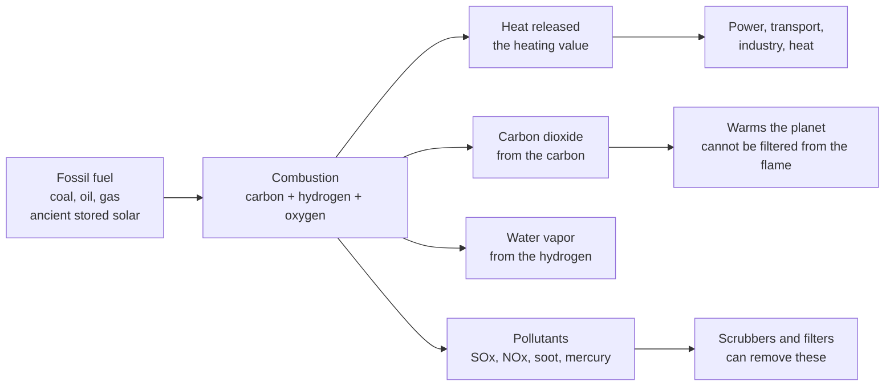

# 🔥 Fossil Fuels and Combustion

> [!abstract] TL;DR
> **Coal, oil, and natural gas** are hydrocarbon fuels formed from ancient plants and plankton buried, heated, and compressed over hundreds of millions of years — chemically concentrated **ancient sunlight**. They dominate the world's energy (roughly 80 percent of primary supply) because they are astonishingly **energy-dense**, cheap, and easy to store and move. **Combustion** is the exothermic oxidation of their carbon and hydrogen: $\text{C}+\text{O}_2\rightarrow\text{CO}_2$ and $2\text{H}_2+\text{O}_2\rightarrow 2\text{H}_2\text{O}$, releasing the fuel's **heating value** as heat. The catch is fundamental: **carbon dioxide is the unavoidable product of getting energy from carbon** — you cannot filter it out of the flame, only capture it afterward. Because natural gas carries more of its energy in hydrogen and less in carbon, it emits roughly **half the CO2 per kilowatt-hour of coal**, with oil in between — the single fact ("carbon intensity") that frames fuel-switching, efficiency, carbon capture, and the entire push toward non-combustion energy.

## Intuition

**Analogy:** A liter of gasoline holds about as much usable energy as a strong person doing hard physical labor for a full day — and it costs about a dollar, fits in a bottle, and never gets tired. That is the whole story of why fossil fuels built the modern world. They are **ancient sunlight in a bottle**: solar energy that living things captured by photosynthesis, then geology spent eons cooking and squeezing into a fuel so concentrated that a substance you can pour or shovel outperforms armies of workers and animals.

**Burning them just runs photosynthesis in reverse, fast.** Where plants used sunlight to pull carbon out of CO2 and lock it into hydrocarbons, combustion slams that carbon and hydrogen back together with oxygen, dumping the stored solar energy out as heat — and handing back the same **CO2** the plants once removed. The energy is the gift; the CO2 is the bill. And unlike soot or sulfur, which you can scrub from the exhaust, the CO2 is not a contaminant you can engineer away — it *is* the point of burning carbon. Understanding what these fuels are, how much energy they release, and exactly what comes out of the smokestack is the starting point for both **running** today's energy system and **dismantling** it.

---

## How It Works

### What fossil fuels are

- **Coal** — solid; buried terrestrial plant matter compressed over 300+ million years. Ranked by maturity from **lignite** (young, wet, low energy) through **sub-bituminous** and **bituminous** to **anthracite** (old, hard, nearly pure carbon, highest energy). Higher rank means more carbon, less moisture and volatiles, and a higher heating value.
- **Oil (petroleum)** — liquid mixture of hydrocarbons from marine plankton buried and "cooked" in the oil window (~60–120 °C). Graded by density (light vs heavy) and sulfur (sweet vs sour). A **refinery** distills and cracks crude into gasoline, diesel, jet fuel, and feedstocks. **Conventional** oil flows from porous rock; **unconventional** sources (shale via hydraulic fracturing, tar/oil sands) need aggressive extraction.
- **Natural gas** — mostly **methane (CH₄)**; the lightest, most hydrogen-rich fossil fuel. Found in conventional reservoirs and, increasingly, in **shale** released by fracking. Transported by pipeline or chilled to **LNG** for shipping.

### Why they dominate

High **energy density** (especially liquids for transport, where batteries still struggle), **low cost**, **easy storage** (a tank sits full indefinitely with no self-discharge), and a century of **built-out infrastructure** — pipelines, refineries, ports, engines, power plants. These advantages are why fossil fuels still supply the large majority of transport, electricity, industrial heat, and space heating.

### Combustion — the chemistry

1. **It is oxidation of C and H.** The fuel's carbon burns to carbon dioxide and its hydrogen burns to water, both strongly **exothermic**. The energy released per unit mass is the **heating value** (calorific value).
2. **Higher vs lower heating value (HHV vs LHV).** Combustion makes water vapor. If you condense it back to liquid you recover its latent heat and report the **higher heating value**; if the water leaves as vapor up the stack (the usual real case) you report the **lower heating value**. The gap is a few percent for coal but ~10 percent for hydrogen-rich natural gas.
3. **Stoichiometry and air-fuel ratio.** Each fuel needs a definite amount of oxygen. For methane, $\text{CH}_4 + 2\,\text{O}_2 \rightarrow \text{CO}_2 + 2\,\text{H}_2\text{O}$; since air is only ~21 percent O₂, you need about 9.5 moles of air per mole of methane, a mass **air-fuel ratio** near 17.
4. **Excess air.** Real burners supply **more** air than stoichiometric so every fuel molecule finds oxygen and combustion is **complete**. Too little air gives **incomplete combustion** — carbon monoxide (CO), soot, and wasted energy; too much air wastes heat warming nitrogen that goes up the stack.
5. **Flue gas.** The exhaust is mostly nitrogen (along for the ride), plus CO2, water vapor, leftover O₂, and trace pollutants.

### The emissions — fundamental vs controllable

- **CO2 is unavoidable and proportional to carbon.** Burn carbon, get carbon dioxide — there is no combustion chemistry that avoids it. **Per unit of energy**, natural gas emits the least (its energy comes partly from hydrogen), coal the most, oil in between. This ratio is the **carbon intensity** (kg CO2 per kWh), and it is why "gas is cleaner than coal per kWh" is literally true.
- **Pollutants are side effects you *can* control.** **SOx** comes from fuel sulfur (scrubbers), **NOx** forms from nitrogen in the combustion air at high flame temperature (low-NOx burners, catalytic reduction), plus **particulates** and **mercury** (filters, electrostatic precipitators). Unlike CO2, these are removable.

### Flow / Architecture



---

## Key Concepts

**Secondary (intuition level)**
- **Fossil fuel** — coal, oil, or gas: buried ancient life turned into concentrated chemical energy.
- **Combustion** — burning; rapidly combining a fuel's carbon and hydrogen with oxygen to release heat.
- **Heating value** — how much heat you get from burning one kilogram of a fuel.
- **The CO2 trade-off** — burning carbon always makes carbon dioxide; you cannot filter it out of the flame.

**Undergraduate (working level)**
- **Coal rank / crude grade** — lignite→anthracite and light-sweet→heavy-sour classify maturity, energy content, and sulfur.
- **HHV vs LHV** — higher heating value counts the latent heat of condensing product water; lower does not.
- **Stoichiometric air-fuel ratio and excess air** — the exact O₂ needed for complete combustion, and the surplus supplied in practice.
- **Complete vs incomplete combustion** — enough air gives CO2 and H₂O; too little gives CO and soot.
- **Carbon intensity** — CO2 emitted per unit of energy; scales with the fuel's carbon-to-hydrogen ratio, so gas ≈ half of coal per kWh.

**Graduate (systems level)**
- **First-principles carbon intensity** — from a fuel's ultimate analysis (mass fractions of C and H) and heating value, $\text{kg CO}_2/\text{MJ} = f_C \cdot \tfrac{44}{12} / \text{LHV}$, explaining exactly why gas beats coal.
- **Flue-gas analysis (Orsat, dry basis)** — dry CO2 percentage falls as excess air rises; maximum dry CO2 (~11.7 percent for methane) occurs at stoichiometric.
- **NOx formation regimes** — thermal (Zeldovich), prompt, and fuel-bound NOx, each with different temperature and mixing dependence.
- **Fuel-switching limits** — coal→gas roughly halves power-sector CO2 per kWh but still emits; deep decarbonization needs carbon capture, efficiency, or non-combustion energy.
- **Reserves vs resources** — proven, economically recoverable reserves versus the far larger resource base whose recoverability depends on price and technology.

---

## Python Demo

```python
# Fossil fuels and combustion: (a) compute heating value + carbon intensity from
# stoichiometry, and (b) flue-gas CO2 vs excess air for methane combustion.
# numpy + matplotlib only.

import numpy as np
import matplotlib.pyplot as plt

# ------------------------------------------------------------------
# (a) HEATING VALUE & CARBON INTENSITY (computed from carbon content)
# ------------------------------------------------------------------
# Representative fuels: mass fraction of carbon, and lower heating value (MJ/kg).
# Modeled from ultimate analysis / model compounds:
#   coal (bituminous), oil (diesel ~ CH1.8), natural gas (methane CH4).
fuels   = ["Coal\n(bituminous)", "Oil\n(diesel)", "Natural gas\n(methane)"]
C_frac  = np.array([0.72, 0.855, 0.749])   # kg carbon per kg fuel
LHV     = np.array([27.0, 42.8, 50.0])     # MJ per kg fuel

# Every kg of carbon burns to 44/12 kg of CO2 (molar masses CO2=44, C=12).
CO2_per_kg_fuel = C_frac * (44.0 / 12.0)          # kg CO2 / kg fuel
carbon_int_MJ   = CO2_per_kg_fuel / LHV           # kg CO2 / MJ
carbon_int_kWh  = carbon_int_MJ * 3.6             # kg CO2 / kWh  (1 kWh = 3.6 MJ)

print("Fuel            LHV(MJ/kg)  kgCO2/kg  kgCO2/kWh")
for f, h, c, k in zip(["Coal", "Oil", "Gas"], LHV, CO2_per_kg_fuel, carbon_int_kWh):
    print(f"{f:14s} {h:8.1f} {c:10.2f} {k:9.3f}")
# Gas emits ~half the CO2 per kWh of coal -> "gas is cleaner than coal per kWh".

# ------------------------------------------------------------------
# (b) COMBUSTION STOICHIOMETRY: methane flue-gas CO2 vs excess air
#   CH4 + 2 O2 -> CO2 + 2 H2O ; air = 21% O2, 79% N2 by mole.
# ------------------------------------------------------------------
lam = np.linspace(1.0, 2.5, 100)   # lambda = actual air / stoichiometric air
# Per mole CH4 at excess-air factor lambda:
CO2   = np.ones_like(lam)                 # 1 mol CO2
O2ex  = 2.0 * (lam - 1.0)                 # leftover O2
N2    = 2.0 * lam * (79.0 / 21.0)         # nitrogen carried in with the air
dry   = CO2 + O2ex + N2                   # dry flue gas (Orsat: exclude H2O)
CO2_pct_dry = 100.0 * CO2 / dry           # dry CO2 percentage

# Stoichiometric air-fuel ratio (mass) for methane, for reference:
AFR_mass = (2.0 / 0.21) * 28.97 / 16.04   # ~17.2 kg air per kg fuel
print(f"\nStoichiometric air-fuel ratio (methane): {AFR_mass:.1f} kg air / kg fuel")
print(f"Max dry CO2 (lambda=1): {CO2_pct_dry[0]:.1f} %")

# ------------------------------------------------------------------
# Plot
# ------------------------------------------------------------------
fig, ax = plt.subplots(1, 3, figsize=(15, 4.5))
x = np.arange(len(fuels))
colors = ["#4d4d4d", "#8c564b", "#1f77b4"]

ax[0].bar(x, LHV, color=colors)
ax[0].set_xticks(x); ax[0].set_xticklabels(fuels)
ax[0].set_ylabel("Lower heating value (MJ/kg)")
ax[0].set_title("(a) Energy content per kg of fuel")

ax[1].bar(x, carbon_int_kWh, color=colors)
ax[1].set_xticks(x); ax[1].set_xticklabels(fuels)
ax[1].set_ylabel("Carbon intensity (kg CO2 / kWh)")
ax[1].set_title("(b) CO2 per unit energy: gas ~ half of coal")
for xi, v in zip(x, carbon_int_kWh):
    ax[1].text(xi, v + 0.005, f"{v:.2f}", ha="center")

ax[2].plot(lam, CO2_pct_dry, lw=2, color="#d62728")
ax[2].set_xlabel("Excess air factor  lambda  (1 = stoichiometric)")
ax[2].set_ylabel("Dry flue-gas CO2 (%)")
ax[2].set_title("(c) More excess air dilutes flue-gas CO2 (methane)")
ax[2].grid(alpha=0.3)

plt.tight_layout()
plt.savefig("fossil_fuels_combustion.png", dpi=120)
print("\nSaved fossil_fuels_combustion.png")
```

**What it shows.** Panel (a): natural gas packs the most energy per kilogram, coal the least. Panel (b): despite that, the decisive number is CO2 per kWh — coal ≈ 0.35, oil ≈ 0.26, gas ≈ 0.20 kg CO2/kWh, so gas emits roughly **half of coal** because more of its energy comes from hydrogen. Panel (c): flue-gas CO2 is highest at stoichiometric (~11.7 percent for methane) and falls as excess air dilutes the exhaust — the everyday lever behind combustion tuning and flue-gas measurement.

---

## Real-World Applications

- **Coal-to-gas switching in power grids.** Between 2010 and 2020, cheap shale gas displacing coal cut US power-sector CO2 substantially — a direct consequence of the carbon-intensity gap in panel (b). It is a real, cheap emissions cut, and also proof of its own limit: halving emissions is not eliminating them.
- **Refinery and combustion tuning.** Boiler and furnace operators trim **excess air** to a few percent above stoichiometric — enough to avoid CO and soot, little enough to avoid heating nitrogen you then vent. Continuous flue-gas O₂/CO2 sensors close this loop, exactly the trade-off in panel (c).
- **Transport's liquid-fuel lock-in.** Gasoline's and diesel's energy density (~43 MJ/kg, panel a) is why cars, trucks, ships, and aircraft ran on them for a century; batteries at ~0.5–1 MJ/kg only recently became competitive for light vehicles, and still not for aviation.
- **Emissions control hardware.** Flue-gas desulfurization scrubbers (SOx), selective catalytic reduction (NOx), and electrostatic precipitators (particulates and mercury) clean coal-plant exhaust — but none touch CO2, which is why **carbon capture and storage** exists as a separate, expensive, downstream step.

---

## Common Pitfalls

- **Confusing energy density with cleanliness.** Natural gas has the *highest* heating value per kg yet the *lowest* CO2 per kWh — the two are not the same axis. Energy density is about C+H content; carbon intensity is about the C-to-H ratio.
- **Thinking CO2 can be "filtered" from the flame.** SOx, NOx, and soot are removable contaminants; CO2 is the stoichiometric product of oxidizing carbon. There is no burner design that avoids it — capture happens *after* combustion, never instead of it.
- **Mixing up HHV and LHV.** Efficiency and emission-factor numbers silently assume one or the other. Comparing a gas plant quoted on LHV against a coal plant on HHV can flip a conclusion; always state the basis.
- **Running too rich (too little air).** Incomplete combustion wastes fuel energy and spikes CO and soot; running too lean wastes heat up the stack. Real burners live in a narrow excess-air band.
- **Confusing reserves with resources.** "Reserves" are what is economically recoverable *now*; the resource base is far larger and shifts with price and technology (fracking turned uneconomic shale into vast reserves overnight). Neither is a fixed physical constant.

---

## Related Concepts

Fossil fuels and combustion are the foundation of this section on thermal and fossil power. The heat released here drives *Steam and Rankine Power Plants* (burning fuel to boil water and spin a turbine) and *Gas Turbines and Combined Cycle* (burning gas directly in the working fluid, then recovering exhaust heat). The unavoidable CO2 established here is the target of *Carbon Capture, Utilization, and Storage* and the subject of *Emissions and the Climate Impact of Energy*, while the chemical-energy-to-heat step sits inside the broader picture of *Forms and Conversion of Energy*.

- [[Reactive_Systems_and_Combustion_Balances]] — the full accounting of combustion stoichiometry, excess air, air-fuel ratio, and flue-gas (Orsat) analysis used above.
- [[Stoichiometry_and_the_Mole]] — the mole ratios ($\text{CH}_4 + 2\text{O}_2 \rightarrow \dots$) that fix how much oxygen a fuel needs and how much CO2 it makes.
- [[Chemical_Thermodynamics]] — why combustion is exothermic; the enthalpy of reaction that *is* the heating value.
- [[Chemical_Kinetics]] — reaction rates, ignition, and flame propagation that decide whether combustion is fast, complete, and stable.
- [[Sedimentary_Rocks_and_Environments]] — the burial settings where organic matter became coal, oil, and gas source rocks.
- [[Economic_Geology_and_Resources]] — how fossil-fuel deposits form, and the reserves-versus-resources distinction that governs supply.

---

## Review Questions

**Secondary.** In one sentence each: what are fossil fuels made from, why do they release energy when burned, and why is carbon dioxide unavoidable when you burn them?

**Undergraduate.** Natural gas holds *more* energy per kilogram than coal, yet burning it emits *less* CO2 per kilowatt-hour. Explain why both statements are true at once, referring to the carbon-to-hydrogen ratio and to what happens to each element during combustion.

**Graduate (scenario).** A utility can meet the same electricity demand by (i) switching a coal plant to natural gas, (ii) adding post-combustion carbon capture to the coal plant, or (iii) improving the coal plant's thermal efficiency by 5 percentage points. Using carbon intensity (kg CO2/kWh) and the idea that CO2 is stoichiometrically tied to carbon burned, rank these on emissions cut per kWh, and explain why fuel-switching helps but cannot, by itself, reach near-zero emissions.

---

## Sources

- Tester, Drake, Driscoll, Golay, Peters. *Sustainable Energy: Choosing Among Options* (MIT Press) — energy content, resources, and combustion fundamentals.
- Turns. *An Introduction to Combustion: Concepts and Applications* (McGraw-Hill) — stoichiometry, air-fuel ratio, heating values, flame chemistry.
- Smil. *Energy and Civilization: A History* (MIT Press) — the historical role and dominance of fossil energy.
- International Energy Agency. *World Energy Outlook* and *CO2 Emissions* reports — primary-energy shares, carbon intensities, and emission factors. [iea.org](https://www.iea.org)
- U.S. Energy Information Administration. *Carbon Dioxide Emissions Coefficients* — per-fuel CO2 emission factors. [eia.gov](https://www.eia.gov/environment/emissions/co2_vol_mass.php)

---

#energy-systems #fossil-fuels #combustion #heating-value #carbon-intensity
