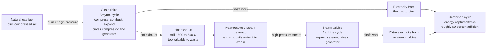

# ⚙️ Gas Turbines and Combined Cycle: The Jet Engine That Powers the Grid and Backs Up Renewables

> [!abstract] TL;DR
> A modern natural-gas power plant is essentially a **jet engine bolted to the ground**, spinning a generator instead of pushing an airplane. It runs the **Brayton cycle** — compress air, burn gas at constant pressure, expand the hot gas through a turbine that drives both the compressor *and* a generator — and it can **start and ramp in minutes**, unlike a lumbering steam plant that needs hours. A simple-cycle gas turbine tops out around **35 to 42%** efficiency, because its exhaust leaves blazing hot (~500 to 600 °C) and carries a huge amount of energy away. The brilliant efficiency trick that makes gas the most efficient fossil generator ever built is the **combined cycle**: pipe that hot exhaust into a **heat-recovery steam generator** to boil water and run a *second*, **steam (Rankine) turbine** — extracting work from the same fuel **twice**. Stacked, the two cycles reach about **60 to 64%**, where either alone caps near 40%. The math is simple: $\eta_{cc} = \eta_{Brayton} + (1-\eta_{Brayton})\cdot\eta_{Rankine}$. Combined-cycle gas turbines (CCGTs) are the flexible, relatively-cleaner-than-coal **workhorse of modern fossil power** — and their fast ramping makes them the natural **dispatchable backup for intermittent wind and solar**, and the centerpiece of gas's contested role as a "bridge fuel."

## Intuition

**Analogy:** A natural-gas power plant is basically a **jet engine bolted to the ground**. Instead of blasting hot exhaust out the back to shove a plane forward, it uses that same blast of hot, high-pressure gas to spin a turbine wheel that turns an electrical generator. Because it is small, light for its power, and has no giant mass of water and metal to heat up, you can **light it and get to full power in minutes** — the same reason a fighter jet can go from idle to afterburner in seconds, and the exact opposite of a coal or nuclear steam plant, which must slowly warm tonnes of boiler and steel over many hours before it can carry load.

Now the efficiency trick that makes modern gas plants brilliant. A jet engine simply throws its still-scorching exhaust away — a plane cannot carry a second engine to catch it. But a *stationary* plant can. The gas turbine's exhaust is still **500-plus degrees**, far too hot to waste, so you route it over water pipes to **boil steam and run a second, steam turbine** — capturing energy from the same fuel a **second time**. This "**combined cycle**" stacks a gas turbine on top of a steam turbine and reaches roughly **60% efficiency**, where either engine alone gives up around 40%. That combination — highest fossil efficiency plus the ability to ramp fast — is exactly why combined-cycle gas plants are the flexible workhorse that increasingly fills the gaps when the wind drops and the sun sets.

---

## How It Works

### Core Mechanics

1. **The gas turbine is a stationary jet engine running the Brayton cycle.** Three continuous steps flow around a shaft: a **compressor** squeezes incoming air to high pressure (pressure ratios of ~15 to 30); a **combustor** sprays in natural gas (or liquid fuel) and burns it at roughly constant pressure, spiking the temperature to the **turbine-inlet temperature (TIT)**; and a **turbine** expands the hot, high-pressure gas, extracting shaft work. Crucially, that turbine drives *two* things on the same shaft — the compressor (which eats over half the turbine's output) and the **electrical generator** (the net useful power). This is the same machine as an aircraft engine; only the last stage differs (a generator instead of a propelling nozzle).

2. **Why simple-cycle efficiency is only ~35 to 42%.** The exhaust leaving the turbine is still very hot — typically **500 to 600 °C** — and that thermal energy is thrown straight to the atmosphere. A large fraction of the fuel's energy literally flies out the stack. Simple-cycle turbines are therefore modest in efficiency but **cheap, compact, and lightning-fast to start**, which is why they serve as **peakers** and fast-response reserves.

3. **The combined-cycle trick: recover the exhaust.** Instead of venting that 500-to-600 °C exhaust, a **combined-cycle gas turbine (CCGT)** feeds it into a **heat-recovery steam generator (HRSG)** — a boiler with no flame, heated purely by the turbine exhaust. The HRSG raises high-pressure steam that drives a **steam turbine (Rankine cycle)** and its own generator. The gas turbine is the **topping** cycle; the steam turbine is the **bottoming** cycle. The same fuel now produces electricity **twice**.

4. **The efficiency-stacking equation.** If the gas turbine converts a fraction $\eta_{Brayton}$ of the fuel energy to work, the leftover $(1-\eta_{Brayton})$ leaves as exhaust heat. The bottoming steam cycle recovers a fraction $\eta_{Rankine}$ of *that*:
$$\eta_{cc} = \eta_{Brayton} + (1-\eta_{Brayton})\cdot\eta_{Rankine}.$$
Plug in a 40% gas turbine and a 33% steam bottoming cycle: $\eta_{cc} = 0.40 + 0.60\times0.33 \approx 0.60$. Two engines, each individually capped near 40%, combine to **~60%** — the highest efficiency of any fossil (indeed any thermal) power plant, and the reason CCGT dominates new gas capacity.

5. **The key performance drivers.** Efficiency and power climb with the **turbine-inlet temperature** — hotter firing means more work per unit of air and a hotter exhaust to feed the bottoming cycle. But higher TIT pushes materials to their limits, which is why gas turbines are a showcase of high-temperature engineering: **single-crystal nickel superalloy blades**, internal **air cooling**, and ceramic **thermal-barrier coatings** that let blade metal survive gas hotter than its own melting point. **Pressure ratio** and **part-load** behaviour matter too — efficiency sags at low load, so operators prefer to run CCGTs near design point.

6. **The flexibility value — the reason gas complements renewables.** Gas turbines and CCGTs **start and ramp far faster** than steam-only plants: an aeroderivative unit can reach full power in minutes, a CCGT in tens of minutes to a couple of hours, while a coal plant needs many hours from cold. That makes gas the ideal **dispatchable** resource to fill the gaps left by variable wind and solar — ramping up as a cloud bank rolls in or the evening peak arrives, and backing down when renewables surge. This flexibility, plus gas's lower carbon per kWh than coal, underpins its contested role as a **"bridge fuel."**

### Flow / Architecture



---

## Key Concepts

### Secondary Level

- **A gas power plant is a jet engine on the ground.** It burns gas to make a blast of hot, high-pressure gas, and that blast spins a turbine wheel connected to a generator that makes electricity.
- **It starts fast.** Because it is light and compact, it can go from off to full power in **minutes** — unlike coal or nuclear steam plants that take **hours**. That speed is its superpower.
- **On its own it wastes a lot of heat.** The exhaust comes out very hot, and all that heat used to be thrown away — so a plain gas turbine only turns about a third of the fuel into electricity.
- **The combined-cycle trick catches the waste.** Route the hot exhaust into a boiler, make steam, and run a **second turbine**. Now the same fuel makes electricity **twice**, and efficiency jumps to about **60%** — the best of any plant that burns fuel.
- **Gas plants back up wind and solar.** When clouds cover the sun or the wind dies, a gas plant can ramp up quickly to keep the lights on, then back down when renewables return. Gas also releases **less carbon dioxide per unit of electricity than coal**, though it is still a fossil fuel.

### Undergraduate Level

- **Brayton cycle mechanics.** Ideal Brayton efficiency depends on pressure ratio: $\eta_{Brayton} = 1 - r_p^{-(\gamma-1)/\gamma}$, where $r_p$ is the compressor pressure ratio and $\gamma$ the specific-heat ratio. Real gas turbines fall below this because of compressor/turbine inefficiency and the enormous **back-work ratio** — the compressor consumes over half the turbine's gross output.
- **Simple-cycle vs combined-cycle.** Simple cycle: ~35 to 42%, fast-starting, cheap, used for peaking. Combined cycle adds an HRSG and steam turbine to reach **~60 to 64%** at the cost of more capital and slower (but still fast, versus coal) start-up.
- **The stacking formula.** $\eta_{cc} = \eta_{Brayton} + (1-\eta_{Brayton})\,\eta_{Rankine}$ — the bottoming cycle harvests a fraction of the topping cycle's rejected heat. This is two heat engines in series, each **Carnot-limited**, together beating either alone.
- **Turbine-inlet temperature is the master variable.** Higher TIT raises both the specific work and the exhaust temperature that feeds the bottoming cycle, so efficiency climbs — but it is bounded by blade metallurgy (creep, oxidation, melting), motivating superalloys, blade cooling, and thermal-barrier coatings.
- **Configurations.** *Single-shaft* (gas turbine, steam turbine, and generator on one shaft) vs *multi-shaft*; **aeroderivative** turbines (adapted from jet engines, extremely fast-starting, high efficiency, smaller) vs heavy-duty **industrial frame** machines (larger, cheaper per MW, workhorses of CCGTs).
- **Emissions basics.** Natural gas emits roughly **half the CO₂ per kWh of coal** because of its higher hydrogen-to-carbon ratio and the plant's higher efficiency. But upstream **methane leakage** (a potent greenhouse gas) can erode that advantage, and gas remains a net CO₂ emitter.

### Graduate Level

- **Second-law framing.** Both topping and bottoming cycles are bounded by their own Carnot ceilings ($1 - T_c/T_h$). The genius of the combined cycle is exergetic: the gas turbine's high-temperature exhaust still carries large **exergy** (available work), and the HRSG captures much of it that a single cycle would destroy. Minimising **pinch-point** temperature differences and using **multi-pressure HRSGs** (typically triple-pressure with reheat) reduces entropy generation in the heat-recovery process and pushes combined efficiency toward the mid-60s.
- **HRSG design and the pinch point.** The HRSG is a heat exchanger between a cooling gas stream and boiling/superheating water. The **pinch point** (minimum gas-to-steam temperature difference at the evaporator) trades capital (surface area) against recovered exergy. Multiple pressure levels let the steam extraction track the gas cooling curve more closely, recovering more low-grade heat.
- **Part-load and cycling penalties.** Efficiency degrades at part load (compressor operating off design, firing temperature reduced via variable inlet guide vanes). Frequent **cycling** to follow renewables imposes thermal-fatigue and creep-fatigue damage on thick-walled HRSG components and turbine hot sections — a real O&M cost of the "flexibility" role, tying directly to high-temperature failure mechanisms.
- **The flexibility economics of a renewables-heavy grid.** As variable renewables grow, grid value shifts from bulk energy to **ramping, fast start, and dispatchability**. CCGTs and simple-cycle peakers monetise this via capacity markets, ancillary services, and price spreads; their **residual-load-following** role (serving net load = demand minus wind and solar) is what keeps a high-renewables grid stable — until storage and demand response displace it.
- **Decarbonisation pathways for gas.** Three routes are actively developed: **hydrogen co-firing / full hydrogen combustion** (burning H₂ instead of methane, with combustion, flame-stability, and NOx challenges); **post-combustion carbon capture (CCS)** on the exhaust (an efficiency and cost penalty); and using CCGTs as declining **peaking/backup** capacity behind renewables. Each reflects the tension between gas's flexibility value and its emissions.
- **Advanced cycles.** Reheat gas turbines, intercooled-recuperated aeroderivatives, and emerging **supercritical CO₂** bottoming cycles aim to squeeze the topping/bottoming stack further; integrated gasification combined cycle (IGCC) extends the concept to solid fuels.

---

## Python Demo

```python
# Gas turbines and the combined cycle: WHY stacking two heat engines wins,
# HOW efficiency climbs with turbine-inlet temperature, and WHY gas plants
# ramp fast enough to back up renewables.  numpy + matplotlib only.
import numpy as np
import matplotlib.pyplot as plt

# ---- the efficiency-stacking model -------------------------------------
# Combined cycle = a Brayton (gas) TOPPING cycle whose waste heat drives a
# Rankine (steam) BOTTOMING cycle.  If the gas turbine converts a fraction
# eta1 of the fuel, the leftover (1 - eta1) leaves as exhaust heat; the steam
# cycle recovers a fraction eta2 of THAT.  Hence:
#     eta_combined = eta1 + (1 - eta1) * eta2
def combined_eff(eta1, eta2):
    return eta1 + (1.0 - eta1) * eta2

T_amb  = 300.0    # K, ambient / compressor inlet
T_cond = 320.0    # K, steam condenser (cold sink of the bottoming cycle)

# Design-point single-cycle efficiencies (dimensionless)
eta_gas_only   = 0.40    # modern simple-cycle gas turbine
eta_steam_only = 0.33    # a standalone subcritical steam plant
eta_cc_design  = combined_eff(eta_gas_only, eta_steam_only)
print(f"Design point:  gas-only {eta_gas_only:.0%},  steam-only {eta_steam_only:.0%},"
      f"  COMBINED {eta_cc_design:.1%}")

# ---- combined efficiency vs turbine-inlet temperature (TIT) -------------
TIT_C = np.linspace(1100, 1650, 300)      # deg C, turbine-inlet temperature
TIT_K = TIT_C + 273.15

eps1 = 0.48                                # Brayton as a fraction of Carnot
eta1 = eps1 * (1.0 - T_amb / TIT_K)        # rises with hotter firing

T_exhaust = 0.40 * TIT_K + 150.0           # K, exhaust feeding the HRSG (~500-600 C)
eps2 = 0.52                                # Rankine as a fraction of Carnot
eta2 = eps2 * (1.0 - T_cond / T_exhaust)   # bottoming-cycle efficiency

eta_cc = combined_eff(eta1, eta2)          # stacked efficiency vs TIT

# ---- flexibility: cold-start time to full power, by plant type ---------
plant_names = ["Aeroderivative\ngas turbine", "Simple-cycle\ngas turbine",
               "Combined-cycle\ngas turbine", "Coal steam\nplant"]
start_min   = np.array([5.0, 12.0, 60.0, 480.0])   # minutes, cold start to full load

# ------------------------------- plotting -------------------------------
fig, (axA, axB, axC) = plt.subplots(1, 3, figsize=(17, 5.2))
fig.suptitle("Gas turbines and the combined cycle: capture the fuel's energy "
             "twice, and ramp fast", fontsize=13, fontweight="bold")

# (a) stacking bar -- combined beats either single cycle
bars = ["Gas turbine\nalone", "Steam turbine\nalone", "Combined\ncycle"]
vals = [eta_gas_only, eta_steam_only, eta_cc_design]
cols = ["#e07b39", "#2a9d8f", "#8338ec"]
axA.bar(bars, vals, color=cols, edgecolor="white")
# show the stacking on the third bar: steam recovers part of the gas waste heat
axA.bar(bars[2], eta_gas_only, color="#e07b39", edgecolor="white")
axA.bar(bars[2], eta_cc_design - eta_gas_only, bottom=eta_gas_only,
        color="#2a9d8f", edgecolor="white")
for i, v in enumerate(vals):
    axA.text(i, v + 0.012, f"{v:.0%}", ha="center", fontweight="bold")
axA.text(2, eta_gas_only / 2, "gas\nshare", ha="center", va="center",
         color="white", fontsize=8)
axA.text(2, eta_gas_only + (eta_cc_design - eta_gas_only) / 2, "steam\nbonus",
         ha="center", va="center", color="white", fontsize=8)
axA.set_ylabel("thermal efficiency")
axA.set_ylim(0, 0.72)
axA.set_title("(a) Stacking two cycles\nrecovers waste heat -> ~60%")

# (b) combined efficiency vs turbine-inlet temperature
axB.plot(TIT_C, eta_cc, lw=2.5, color="#8338ec", label="combined cycle")
axB.plot(TIT_C, eta1, lw=2.0, ls="--", color="#e07b39", label="gas turbine alone")
axB.fill_between(TIT_C, eta1, eta_cc, color="#2a9d8f", alpha=0.15,
                 label="steam bottoming bonus")
axB.set_xlabel("turbine-inlet temperature  [deg C]")
axB.set_ylabel("thermal efficiency")
axB.set_ylim(0.30, 0.70)
axB.set_title("(b) Hotter firing lifts efficiency\n(bounded by blade materials)")
axB.legend(loc="lower right", fontsize=8)
axB.grid(alpha=0.3)

# (c) flexibility -- cold-start time to full load (log scale)
ccols = ["#00b894", "#e07b39", "#8338ec", "#3d3d3d"]
axC.barh(plant_names, start_min, color=ccols, edgecolor="white")
axC.set_xscale("log")
for i, v in enumerate(start_min):
    label = f"{v:.0f} min" if v < 90 else f"{v/60:.0f} h"
    axC.text(v * 1.12, i, label, va="center", fontsize=9)
axC.set_xlabel("cold-start time to full power  [minutes, log scale]")
axC.set_title("(c) Gas ramps in minutes vs\nhours for steam -> backs up renewables")
axC.set_xlim(2, 2000)
axC.invert_yaxis()

plt.tight_layout(rect=[0, 0, 1, 0.93])
plt.show()

# ---- printed summary ----------------------------------------------------
for tit in (1100, 1300, 1500, 1650):
    k = tit + 273.15
    e1 = eps1 * (1 - T_amb / k)
    tex = 0.40 * k + 150.0
    e2 = eps2 * (1 - T_cond / tex)
    print(f"TIT {tit:4d} C:  gas-only {e1:.1%},  exhaust {tex-273.15:4.0f} C,"
          f"  COMBINED {combined_eff(e1, e2):.1%}")
```

Running this prints the design point (gas 40%, steam 33%, combined ~60%) and draws three panels. **Panel (a)** is the core idea: the combined-cycle bar is literally the gas-turbine bar plus a "steam bonus" segment recovered from the exhaust — two ~40%-class engines stacking to ~60%, more than either alone. **Panel (b)** shows combined efficiency climbing with **turbine-inlet temperature** (the gas-alone curve rises, and the shaded steam-bottoming bonus rides on top), illustrating why manufacturers chase ever-hotter firing with exotic materials. **Panel (c)** makes the **flexibility** story tangible: on a log scale, gas turbines reach full power in **minutes to about an hour**, while a coal steam plant needs the better part of a day from cold — the concrete reason gas is the fast, dispatchable partner that fills the gaps when wind and solar swing.

---

## Real-World Applications

> **Example — a modern CCGT filling the evening ramp behind solar.** On a sunny grid, midday solar floods the system and net load (demand minus renewables) collapses; then, as the sun sets over a couple of hours, that net load rockets upward — the notorious "duck-curve" ramp. A **combined-cycle gas turbine** is the machine built to meet it: it holds efficiently at part load through the day, then its gas turbine ramps hard while the HRSG and steam turbine follow, delivering hundreds of megawatts within tens of minutes to cover the evening peak exactly when solar disappears. The same plant runs at **~60% efficiency** when steady, roughly half the CO₂ per kWh of the coal unit it displaced. Every mechanism in this note appears at once: the Brayton topping cycle, the recovered-exhaust Rankine bottoming cycle, the high firing temperature that buys the efficiency, and the fast ramp that makes it the renewables' backup.

- **Baseload and mid-merit electricity.** Large heavy-duty CCGTs (often 400 MW to over 1 GW per block) are the efficient workhorses of many modern grids, running long hours at high capacity factor where gas is cheap.
- **Peaking and reserves.** Simple-cycle and **aeroderivative** gas turbines provide fast-start peaking power and spinning/non-spinning reserve, earning value from their minutes-to-full-power capability rather than fuel efficiency.
- **Renewables integration / residual-load following.** As wind and solar grow, CCGTs increasingly serve the *variable* residual load — ramping and cycling to keep supply matched to a swinging net demand, the operational partner to intermittent renewables.
- **Cogeneration and combined heat and power.** Many gas turbines run in **CHP** mode, using the HRSG steam for industrial process heat or district heating instead of (or alongside) a steam turbine, pushing total fuel utilisation well above 80%.
- **Mechanical drive and offshore/industrial power.** Aeroderivative turbines drive large compressors on gas pipelines and LNG trains, and provide compact power on offshore platforms and remote sites where fast start and small footprint matter.
- **The "bridge fuel" and its decarbonisation options.** Utilities deploy CCGTs as lower-carbon-than-coal capacity while planning **hydrogen co-firing**, **carbon capture retrofits**, or a managed decline into pure backup as clean generation and storage scale.

---

## Common Pitfalls

- **Confusing simple-cycle with combined-cycle efficiency.** A plain gas turbine is only ~35 to 42% efficient; the ~60% figure is *specifically* the combined cycle with its steam bottoming plant. Quoting one number for the other overstates or understates by a full 20 points.
- **Adding the two efficiencies directly.** Combined efficiency is **not** $\eta_1 + \eta_2$. The bottoming cycle only sees the *rejected* heat, so $\eta_{cc} = \eta_1 + (1-\eta_1)\eta_2$. Naively summing 40% + 33% gives a nonsensical 73% instead of the correct ~60%.
- **Assuming you can raise turbine-inlet temperature for free.** Higher TIT lifts efficiency but slams into creep, oxidation, and melting of the blades. Every extra degree is bought with single-crystal superalloys, internal cooling air (which itself costs efficiency), and ceramic thermal-barrier coatings — the province of high-temperature materials failure.
- **Ignoring the cycling penalty of the flexibility role.** Praising CCGTs for backing up renewables while forgetting that frequent starts and load swings inflict **thermal- and creep-fatigue** damage on thick HRSG headers and turbine hot parts — raising maintenance cost and cutting component life.
- **Treating gas as "clean."** Gas emits roughly half the CO₂ per kWh of coal, but it is still a fossil emitter, and **upstream methane leakage** (a far more potent greenhouse gas over short horizons) can erode much of the climate advantage if leak rates are high.
- **Forgetting the ambient-temperature and part-load derating.** Gas-turbine output and efficiency fall on hot days (less-dense inlet air) and at part load. Nameplate ratings are quoted at standard conditions; real dispatch, especially in flexible cycling service, runs below them.
- **Comparing capital cost without efficiency and flexibility.** Simple-cycle plants are cheaper to build but burn more fuel per kWh; CCGTs cost more but run far more efficiently. The right comparison weighs capital against fuel, expected running hours, and the value of fast start.

---

## Related Concepts

**Energy-systems foundation — the limits and framing**
- [[Thermodynamics_of_Energy_Conversion]] — the Carnot ceiling and second-law "tax" that caps every heat engine; the combined cycle is the practical answer to that tax, stacking two Carnot-limited cycles to beat either alone.

**Mechanical engineering — the cycle analysis and turbomachinery**
- [[Power_and_Refrigeration_Cycles]] — the formal Brayton, Rankine, and combined-cycle analysis on T-s diagrams that this note applies to power generation.
- [[Pumps_Compressors_and_Turbines]] — the turbomachinery (axial compressors and turbines) whose aerodynamics, blade design, and efficiency set gas-turbine performance and the crippling back-work ratio.

**Aerospace engineering — the airborne cousin of the same machine**
- [[Gas_Turbine_Engine_Cycles]] — the aircraft-engine Brayton cycle; a stationary power gas turbine is the same thermodynamic machine ending in a generator instead of a propelling nozzle.
- [[Air_Breathing_Propulsion]] — the propulsion framing of the Brayton core, sharing compressors, combustors, and hot-section materials with power-generation turbines.

**Materials science — why turbine-inlet temperature is bounded**
- [[Fatigue_Creep_and_High_Temperature_Failure]] — the creep, thermal fatigue, and oxidation limits on hot-section blades that cap firing temperature and drive single-crystal superalloys, blade cooling, and thermal-barrier coatings.

Within the Energy Systems vault, this note sits in the **Thermal & Fossil Power** pillar and is referenced in prose by its section siblings: *Fossil_Fuels_and_Combustion* (the combustion and fuel side feeding the turbine), *Steam_and_Rankine_Power_Plants* (the bottoming steam cycle in full detail), *Cogeneration_and_District_Energy* (using the HRSG heat for process and district loads), *Grid_Integration_of_Renewables* (why fast-ramping gas backs up variable wind and solar), and *Hydrogen_and_Fuel_Cells* (hydrogen-firing as a decarbonisation path for gas turbines).

---

## Review Questions

**Secondary**
1. A gas power plant is often described as "a jet engine bolted to the ground." Explain what that means, why such a plant can start in minutes while a coal plant needs hours, and describe in plain words the "combined-cycle" trick that lets the same fuel make electricity twice.

**Undergraduate**
2. A gas turbine achieves 38% efficiency and rejects its exhaust to a steam bottoming cycle that recovers 34% of the heat it receives. (i) Compute the combined-cycle efficiency and explain why the answer is *not* 38% + 34%. (ii) Name two design changes that would raise the combined efficiency and, for each, state the physical penalty or limit it runs into. (iii) Explain why a simple-cycle gas turbine, despite its lower efficiency, is still widely deployed.

**Graduate**
3. A grid is adding large amounts of solar, creating a steep evening net-load ramp. (a) Explain, using the topping/bottoming exergy picture, why a CCGT is well suited to this residual-load-following role, and what limits how fast it can ramp compared with a simple-cycle unit. (b) Discuss the O&M consequences of running an efficiency-optimised CCGT in frequent cycling service, connecting them to high-temperature failure mechanisms in the HRSG and turbine hot section. (c) Evaluate two decarbonisation pathways for the plant (hydrogen firing and post-combustion carbon capture), identifying the key technical penalty of each and the role of upstream methane leakage in the overall climate case for gas.

---

## Sources

- Y. A. Çengel & M. A. Boles — *Thermodynamics: An Engineering Approach* (McGraw-Hill) — Brayton, Rankine, and combined-cycle analysis with the topping/bottoming stacking derivation.
- M. P. Boyce — *Gas Turbine Engineering Handbook* (Butterworth-Heinemann) — comprehensive treatment of industrial and aeroderivative gas-turbine design, materials, and performance.
- R. Kehlhofer, F. Hannemann, F. Stirnimann & B. Rukes — *Combined-Cycle Gas & Steam Turbine Power Plants* (PennWell) — the definitive reference on CCGT configuration, HRSG design, and part-load behaviour.
- J. W. Tester, E. M. Drake, M. J. Driscoll, M. W. Golay & W. A. Peters — *Sustainable Energy: Choosing Among Options* (MIT Press) — gas power in the systems and decarbonisation context.

---

#energy-systems #gas-turbine #combined-cycle #brayton #dispatchable
