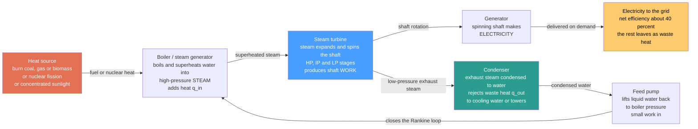

# 🔥 Steam and Rankine Power Plants: How Boiling Water Makes Most of the World's Electricity

> [!abstract] TL;DR
> Most of the world's electricity is still made by **boiling water**. It sounds absurdly primitive, but it is the beating heart of nearly every coal, nuclear, biomass, geothermal, and concentrated-solar plant — and of the steam half of a combined-cycle gas plant. A **heat source** boils water in a **boiler** into high-pressure, superheated **steam**; the steam blasts through a **turbine** and spins it (like wind spinning a pinwheel, but with the fury of superheated steam); the turbine turns a **generator** that makes electricity; then the used steam is **condensed** back to water in a **condenser** — dumping its leftover heat into a river or cooling tower (those iconic white plumes) — and a **pump** returns the water to the boiler. This closed **boil → spin → condense → pump** loop is the **Rankine cycle**, and it has been the workhorse of electricity for over a century. Its efficiency is stuck around **40%** (best supercritical plants reach ~47%) by the **second law of thermodynamics** — so **~55–60% of the fuel's energy escapes as warm water and steam** — which is exactly why cleaner, more efficient designs (supercritical steam, reheat, regeneration, and combined cycles) matter so much.

## Intuition

**Analogy:** Picture a child's pinwheel. Blow on it and it spins; connect that spinning to a tiny dynamo and you have made electricity from your breath. A steam power plant is the same idea scaled up to titanic fury: instead of a breath, it uses a jet of **superheated steam** at hundreds of degrees and hundreds of atmospheres, and instead of a pinwheel it uses a **multi-stage turbine** the length of a bus. Burn coal or gas, split uranium atoms, or focus a field of mirrors — whatever the heat source, the trick is the same: **turn heat into a high-pressure gas that can push a wheel around.** Water is the messenger of choice because boiling it soaks up an enormous amount of heat, and because once the steam has spent its energy you can cool it back to liquid and use it all over again.

That reuse is the unglamorous but essential final act. After the steam has done its work it is still a gas taking up huge volume, and you cannot pump a gas back into the boiler cheaply. So you must **condense** it back to water — which means dumping its leftover heat somewhere cold, into a river, the sea, or the air through a **cooling tower** (the source of those famous steam plumes that people mistake for smoke). Then a small pump lifts the liquid back up to boiler pressure and the loop begins again: **boil, spin, condense, pump.** The cruel catch, written into the laws of physics, is that the heat you dump in the condenser is *wasted* — and it is a lot of heat. That single unavoidable leak is why a power plant burning a mountain of coal delivers only about 40% of that fuel's energy as electricity, and why the story of thermal power is one long fight to shrink the leak.

---

## How It Works

### Core Mechanics

A Rankine steam plant is a **closed loop** of one working fluid — water — carried through four devices in sequence. The water changes phase twice per lap (liquid to vapor in the boiler, vapor to liquid in the condenser), and each device does one job:

1. **Heat source → boiler (add heat $q_{in}$).** Any high-temperature heat works: burning **coal, oil, gas, or biomass**; the heat of **nuclear fission**; the Earth's own heat (**geothermal**); or **concentrated sunlight** focused by mirrors. That heat flows into a **boiler / steam generator**, where high-pressure liquid water is heated, boiled, and then **superheated** into dry, high-pressure steam. Superheating (pushing the steam well above its boiling temperature) raises the average temperature at which heat is added and keeps the steam dry when it later expands — protecting the turbine blades from erosion by water droplets.

2. **Turbine (extract work $w_{out}$).** The superheated steam is unleashed into a **turbine**, where it expands from high to low pressure. As it expands it accelerates and pushes on rows of angled blades, spinning the shaft — this is where **heat becomes mechanical work.** Real plants use several turbine stages in series — **high-pressure (HP)**, **intermediate-pressure (IP)**, and **low-pressure (LP)** — because the steam's volume swells enormously as it expands, so later stages need much larger blades.

3. **Generator (make electricity).** The spinning turbine shaft turns a **generator**, converting mechanical rotation into **electrical power** delivered to the grid. This is the payoff of the whole loop.

4. **Condenser (reject waste heat $q_{out}$).** The exhausted low-pressure steam still carries most of its energy, but as low-grade heat. It flows into a **condenser** — a giant heat exchanger cooled by river/sea water or a cooling tower — where it gives up that heat to the cooling medium and **condenses back to liquid water.** Keeping the condenser cold (near-vacuum, low pressure) lowers the temperature of heat rejection and squeezes out more work; the price is **rejecting a huge amount of waste heat** and consuming a lot of cooling water. This is the second law's mandatory toll.

5. **Pump (close the loop).** A **feed pump** raises the condensed liquid back to boiler pressure and returns it to the boiler. Because liquid water is nearly incompressible, **pump work is tiny** compared to the turbine's output — one of the reasons the Rankine cycle uses a fluid that condenses to liquid before being re-pressurized.

**The efficiency and its ceiling.** Over one lap the internal energy returns to its start, so the **net work equals the net heat**: $w_{net} = q_{in} - q_{out}$, and the **thermal efficiency** is
$$\eta = \frac{w_{net}}{q_{in}} = 1 - \frac{q_{out}}{q_{in}}.$$
No cycle running between a hot source at $T_H$ and a cold sink at $T_L$ can beat the **Carnot ceiling** $\eta_{Carnot} = 1 - T_L/T_H$. Because a steam plant rejects heat only slightly above ambient ($T_L \approx 300$ K) and is limited at the top by what **turbine blades and boiler tubes can survive** ($T_H \approx 850$–900 K, held by superalloys), real efficiency lands near **40%**. Every efficiency trick — **superheat, higher/supercritical boiler pressure, reheat, and regeneration (feedwater heating)** — is a maneuver to raise the *average* temperature of heat addition or lower that of rejection, nudging the cycle toward Carnot without ever reaching it.

### Flow / Architecture



---

## Key Concepts

### Secondary Level

- **Most electricity is boiled into being.** Coal, nuclear, geothermal, and solar-thermal plants all do the same thing: use heat to **boil water into steam**, let the steam **spin a turbine**, and let the turbine spin a **generator** that makes electricity. The heat source changes; the steam engine at the core does not.
- **Steam is a muscular messenger.** Water is used because boiling it stores a huge amount of heat, and because you can cool the steam back into water and use it again forever. It is a **reusable loop**, not a one-shot burn.
- **The cooling towers are not smokestacks.** Those giant hourglass towers billowing white clouds are **dumping waste heat**, not pollution — the plume is just condensing water vapor. Every steam plant must throw away leftover heat to a river, the sea, or the air.
- **Four steps, over and over.** **Boil** the water (boiler), **spin** the turbine (turbine), **condense** the steam back to water (condenser), **pump** it back up (pump). This never-ending loop is the **Rankine cycle.**
- **Most of the fuel is wasted.** A power plant burning a train-load of coal turns only about **40%** of that energy into electricity; the other **~60%** escapes as warm water and steam. That waste is a law of nature, which is why more efficient designs and cleaner energy matter so much.

### Undergraduate Level

- **The four Rankine states.** Numbering the standard order: **1** saturated liquid leaving the condenser; **1→2** isentropic **pump** ($w_p = v_1(P_2 - P_1)$, small because water is nearly incompressible); **2→3** constant-pressure **boiler** heat addition, $q_{in} = h_3 - h_2$; **3→4** isentropic **turbine** expansion, $w_t = h_3 - h_4$; **4→1** constant-pressure **condenser** heat rejection, $q_{out} = h_4 - h_1$. Then $\eta = (w_t - w_p)/q_{in}$.
- **Efficiency from the closed loop.** Over one cycle $\oint dU = 0$, so $w_{net} = q_{in} - q_{out}$ and $\eta = 1 - q_{out}/q_{in}$. On a **T–s diagram** the cycle is a closed loop whose enclosed area is exactly $w_{net}$; the area *below* the heat-rejection leg is the wasted $q_{out}$.
- **Three levers to raise efficiency, and why each works.** **Superheat** (raise turbine-inlet temperature) increases the mean temperature of heat addition and keeps turbine-exit steam dry; **raise boiler pressure** (up to and beyond the critical point) raises the temperature at which boiling heat is added; **lower condenser pressure** (vacuum condensers, cold cooling water) lowers the temperature of heat rejection. All three widen the gap toward the Carnot ceiling.
- **Reheat.** Expand the steam partway through the turbine, send it **back to the boiler to be reheated**, then finish the expansion. This lets the plant use very high boiler pressure while keeping the final steam dry, and it raises the mean heat-addition temperature — worth a few points of efficiency and standard on large units.
- **Regeneration (feedwater heating).** **Bleed** some partly expanded steam from the turbine to preheat the feedwater before it enters the boiler. This avoids adding heat to cold water (which drags down the mean temperature of heat addition), and it is the single biggest efficiency improvement in modern plants — real units use six to eight feedwater heaters.
- **Carnot benchmark.** $\eta_{Carnot} = 1 - T_L/T_H$ depends only on the reservoir temperatures. With $T_L \approx 300$ K (condenser) and $T_H \approx 850$ K (superheated steam), the Carnot ceiling is ~64%; irreversibilities (finite-temperature heat transfer in the boiler, throttling, friction, turbine/pump inefficiencies) knock real plants down to ~40%.
- **Why phase change matters.** Water's huge **latent heat** lets the boiler add and the condenser reject heat at nearly constant temperature, keeping both close to the isothermal ideal, and letting a modest mass flow of water move gigawatts of power.

### Graduate Level

- **Supercritical and ultra-supercritical steam.** Above the **critical point** (22.06 MPa, 374 °C) water has no distinct boiling phase — it passes smoothly from liquid-like to gas-like. **Supercritical** plants run ~24 MPa / 565 °C (~42–45% efficiency); **ultra-supercritical (USC)** push to ~30 MPa / 600 °C (~45–47%); **advanced USC** research targets 700 °C using nickel-superalloy tubing for ~50%. Each rise in steam temperature demands more exotic, creep-resistant **materials** — the true limit on Rankine efficiency is metallurgical, not thermodynamic.
- **Isentropic component efficiencies.** Real turbines and pumps are not reversible: $\eta_{turb} = (h_3 - h_4)/(h_3 - h_{4s})$ and $\eta_{pump} = (h_{2s} - h_1)/(h_2 - h_1)$. Add boiler and condenser pressure drops, mechanical and generator losses; the ideal T–s loop becomes a smaller, slanted, rounded loop. Turbine isentropic efficiency (~90%) dominates the departure from ideal.
- **Exergy analysis pinpoints the real losses.** First-law efficiency hides *where* work potential is destroyed. The largest **exergy destruction** in a Rankine plant is the **boiler / combustor**, where a ~1800 °C flame transfers heat to ~550 °C steam — an enormous temperature mismatch that irreversibly degrades high-quality chemical energy. This is *why* even a "perfect" 47% plant is thermodynamically leaky, and why combustion-driven steam has a hard efficiency ceiling that combined cycles partly escape.
- **The combined cycle escape hatch.** A gas turbine (Brayton) burns fuel at ~1500 °C but exhausts at ~600 °C — far too hot to waste. Feeding that exhaust into a **heat-recovery steam generator** to run a **Rankine bottoming cycle** stacks the two, spanning a temperature range no single cycle can, and reaching **~60% efficiency**. This is why the steam Rankine cycle survives not only in standalone thermal plants but as the *bottoming half* of the most efficient fossil plants ever built (referenced in prose: Gas_Turbines_and_Combined_Cycle).
- **Cooling and water as a binding constraint.** The condenser must reject ~1.5× the plant's electrical output as low-grade heat. **Once-through** cooling (river/sea) is cheapest but thermally pollutes and needs enormous flow; **wet cooling towers** trade water *consumption* (evaporation) for lower withdrawal; **dry (air) cooling** saves water but raises the condenser temperature and *cuts efficiency*. Water availability increasingly limits where large thermal plants can be sited, especially in a warming climate.
- **Operational character: baseload and slow ramps.** Large steam plants are GW-scale, capital-heavy **baseload** machines with high **thermal inertia** — thick boiler drums and turbine rotors that must be heated and cooled slowly to avoid thermal-fatigue cracking. This makes them slow to start and slow to ramp, an increasingly costly limitation on grids with variable wind and solar that demand fast, flexible generation (referenced in prose: Cogeneration_and_District_Energy, which instead *uses* the rejected heat rather than dumping it).
- **The mean-temperature unifier.** Every improvement collapses to one identity: $\eta = 1 - \bar{T}_{out}/\bar{T}_{in}$, where the $\bar{T}$ are entropy-weighted mean temperatures. Superheat, reheat, regeneration, and supercritical pressure all **raise $\bar{T}_{in}$**; vacuum condensers and cold cooling water **lower $\bar{T}_{out}$**. Nothing else is going on.

---

## Python Demo

```python
# Steam / Rankine power plants, numpy + matplotlib only (no scipy, no property libs).
#
#   (a) T-s DIAGRAM of a Rankine cycle (pump -> boiler -> superheat -> turbine ->
#       condenser) drawn on a representative water saturation dome, with the
#       enclosed loop area = net work per kilogram highlighted.
#   (b) EFFICIENCY LADDER: thermal efficiency eta = w_net / q_in for a sequence of
#       real designs (saturated -> superheat -> high-pressure -> supercritical +
#       reheat), shown against the unreachable CARNOT ceiling -- the cycle
#       approaches but never touches it.
#   (c) HEAT REJECTION: for the best design, the fraction of fuel heat that becomes
#       useful WORK (~43-47%) vs the fraction unavoidably REJECTED to the condenser
#       (~55-57%) -- the second-law "toll" that warms the cooling water.
#
# State-point enthalpies/entropies are representative steam-table values (kJ/kg,
# kJ/kg-K); the saturation dome is schematic but consistent with them.
import numpy as np
import matplotlib.pyplot as plt

# ----------------------------------------------------------------------
# Efficiency of a SIMPLE Rankine cycle from its four state enthalpies
# ----------------------------------------------------------------------
def rankine_simple(h1, h2, h3, h4):
    w_turb = h3 - h4          # turbine work OUT
    w_pump = h2 - h1          # pump work IN (small)
    q_in   = h3 - h2          # boiler heat IN
    w_net  = w_turb - w_pump
    return w_net, q_in, w_net / q_in

# Efficiency of a REHEAT Rankine cycle (HP turbine -> reheat -> LP turbine)
def rankine_reheat(h1, h2, h3, h4, h5, h6):
    w_turb = (h3 - h4) + (h5 - h6)          # HP + LP turbine work
    w_pump = h2 - h1
    q_in   = (h3 - h2) + (h5 - h4)          # boiler + reheater heat
    w_net  = w_turb - w_pump
    return w_net, q_in, w_net / q_in

# --- Design ladder (representative steam-table enthalpies, kJ/kg) ---
A = rankine_simple(191.83, 194.83, 2804.2, 1949.3)   # saturated 3 MPa / 10 kPa
B = rankine_simple(191.83, 194.83, 3231.7, 2200.0)   # superheat 3 MPa 400C / 10 kPa
C = rankine_simple(191.83, 206.90, 3583.1, 2114.0)   # high-P 15 MPa 600C / 10 kPa
D = rankine_reheat(191.83, 206.90, 3583.1, 3155.0,   # supercritical-class 15 MPa 600C
                   3690.1, 2335.0)                    #   reheat to 2 MPa 600C / 10 kPa
labels = ["A saturated\n3 MPa", "B superheat\n3 MPa 400C",
          "C high-P\n15 MPa 600C", "D reheat\n15 MPa 600C x2"]
etas   = [A[2], B[2], C[2], D[2]]

# Carnot ceiling between the hot steam (600 C = 873.15 K) and condenser (45.8 C = 318.96 K)
T_hot, T_cold = 873.15, 318.96
eta_carnot = 1.0 - T_cold / T_hot

print("RANKINE EFFICIENCY LADDER")
for lab, e in zip(labels, etas):
    print(f"  {lab.replace(chr(10),' '):26s}  eta = {e*100:5.1f}%")
print(f"  Carnot ceiling (873 K -> 319 K)  = {eta_carnot*100:5.1f}%  (unreachable)\n")

# Best real design (D): work vs rejected heat
eta_best = D[2]
work_frac, reject_frac = eta_best, 1.0 - eta_best
print("HEAT REJECTION (best design D)")
print(f"  useful work to grid : {work_frac*100:4.1f}%")
print(f"  rejected to condenser: {reject_frac*100:4.1f}%  (warms the cooling water)")

# ----------------------------------------------------------------------
# Representative saturated-water dome for the T-s plot (T in C, s in kJ/kg-K)
# ----------------------------------------------------------------------
Ts = np.array([0.01,  50,   100,  150,  200,  250,  300,  350,  373.95])
sf = np.array([0.000, 0.704,1.307,1.842,2.331,2.794,3.255,3.780,4.407])   # sat liquid
sg = np.array([9.156, 8.075,7.355,6.837,6.430,6.072,5.706,5.211,4.407])   # sat vapor
dome_s = np.concatenate([sf, sg[::-1]])
dome_T = np.concatenate([Ts, Ts[::-1]])

# Design C state points on the T-s plane (s [kJ/kg-K], T [C])
p1  = (0.6493, 45.8)    # 1 sat liquid, 10 kPa (condenser exit)
p2  = (0.6493, 47.0)    # 2 pumped to 15 MPa (isentropic, near-vertical)
p2f = (3.6848, 342.0)   # start of boiling at 15 MPa
p2g = (5.3098, 342.0)   # end of boiling at 15 MPa
p3  = (6.6796, 600.0)   # 3 superheated steam, 15 MPa / 600 C (turbine inlet)
p4  = (6.6796, 45.8)    # 4 turbine exit, wet, 10 kPa
rankine = [p1, p2, p2f, p2g, p3, p4, p1]

# ----------------------------------------------------------------------
# Plot
# ----------------------------------------------------------------------
fig, ax = plt.subplots(1, 3, figsize=(18, 5.6))
fig.suptitle("Steam / Rankine power plant: the cycle, the efficiency ceiling, "
             "and the unavoidable waste heat", fontsize=13, fontweight="bold")

# --- (a) Rankine T-s ---
ax[0].plot(dome_s, dome_T, color="gray", lw=1.5, label="water saturation dome")
xs = [p[0] for p in rankine]; ys = [p[1] for p in rankine]
ax[0].plot(xs, ys, "o-", color="crimson", lw=2.2, ms=6)
ax[0].fill(xs, ys, color="crimson", alpha=0.12)
for (s, T), name in zip([p1, p2f, p3, p4],
                        ["1 pump in", "2 boiler", "3 turbine in", "4 turbine out"]):
    ax[0].annotate(name, (s, T), textcoords="offset points", xytext=(6, 6), fontsize=8)
ax[0].set_title(f"(a) Rankine cycle on T-s  (design C)\nshaded area = net work,  "
                f"eta = {C[2]*100:.1f}%")
ax[0].set_xlabel("entropy  s  [kJ/kg-K]"); ax[0].set_ylabel("temperature  T  [C]")
ax[0].legend(fontsize=8); ax[0].grid(alpha=0.3)

# --- (b) Efficiency ladder vs Carnot ceiling ---
x = np.arange(len(labels))
bars = ax[1].bar(x, [e*100 for e in etas], color="#4a9eff", edgecolor="white")
ax[1].axhline(eta_carnot*100, color="crimson", ls="--", lw=2,
              label=f"Carnot ceiling {eta_carnot*100:.0f}%")
for xi, e in zip(x, etas):
    ax[1].text(xi, e*100 + 1, f"{e*100:.0f}%", ha="center", fontsize=9, fontweight="bold")
ax[1].set_xticks(x); ax[1].set_xticklabels(labels, fontsize=7.5)
ax[1].set_ylim(0, 70)
ax[1].set_ylabel("thermal efficiency  [percent]")
ax[1].set_title("(b) Superheat, pressure and reheat\nclimb toward Carnot, never reach it")
ax[1].legend(fontsize=8, loc="upper left"); ax[1].grid(alpha=0.3, axis="y")

# --- (c) Heat rejection breakdown (best design) ---
ax[2].bar(0, work_frac*100, color="#00b894", label="useful work to grid")
ax[2].bar(0, reject_frac*100, bottom=work_frac*100, color="#e76f51", alpha=0.9,
          label="rejected to condenser")
ax[2].text(0, work_frac*100/2, f"{work_frac*100:.0f}%\nelectricity",
           ha="center", va="center", color="white", fontsize=10, fontweight="bold")
ax[2].text(0, work_frac*100 + reject_frac*100/2, f"{reject_frac*100:.0f}%\nwaste heat",
           ha="center", va="center", color="white", fontsize=10, fontweight="bold")
ax[2].set_xlim(-1.2, 1.2); ax[2].set_ylim(0, 100); ax[2].set_xticks([])
ax[2].set_ylabel("share of fuel heat  [percent]")
ax[2].set_title("(c) The second-law toll\nmost fuel heat is dumped, not used")
ax[2].legend(fontsize=8, loc="upper right")

plt.tight_layout(rect=[0, 0, 1, 0.93])
plt.show()
```

Running this prints the efficiency ladder — **A saturated ≈ 33%**, **B superheat ≈ 34%**, **C high-pressure superheat ≈ 43%**, **D with reheat ≈ 45%** — against a **Carnot ceiling of ~64%** it never touches, making the central lesson concrete: *superheat, higher boiler pressure, and reheat each raise the mean temperature of heat addition and climb toward — but cannot reach — the thermodynamic limit.* **Panel (a)** draws design C as a clockwise loop hugging the steam dome; the **shaded interior is the net work per kilogram of steam.** **Panel (b)** shows the ladder of real designs stopping well short of the red Carnot line — the gap is mostly mandated by physics, not sloppy engineering. **Panel (c)** makes the toll visceral: even the best design turns only **~45% of the fuel's heat into electricity** while **~55% is rejected to the condenser** — the warm water and steam plumes that are the signature, and the great inefficiency, of thermal power.

---

## Real-World Applications

> **Example — a supercritical coal-fired plant, the mature peak of Rankine engineering.** A modern ultra-supercritical unit pulverizes coal to a powder and burns it in a furnace whose walls are lined with water tubes. The water is pumped above the critical pressure (~25–30 MPa) and heated past 600 °C, becoming a supercritical fluid with no distinct boiling phase, then routed through **HP, IP, and LP turbine** stages — with a **reheat** trip back to the boiler between HP and IP, and **six-to-eight regenerative feedwater heaters** bleeding steam to preheat the returning water. The turbines spin a generator at 3000 or 3600 rpm, exhausting into a vacuum **condenser** cooled by a river or a hyperbolic cooling tower. The result is **~45–47% efficiency** — near the metallurgical limit of steel and nickel superalloys — versus ~33% for an older subcritical plant, which for the same electricity means roughly a quarter less coal burned and CO2 emitted. Every efficiency lever in this note is present in one machine.

- **Nuclear power plants.** Almost all reactors are steam plants: fission heat boils water (directly in a BWR, or via a steam generator in a PWR) to drive a Rankine turbine. Because reactor materials cap the steam temperature lower than a fossil furnace can, nuclear steam cycles run cooler and land at ~33–37% efficiency (referenced in prose: Nuclear_Fission_Power).
- **Concentrated solar power (CSP).** Fields of mirrors focus sunlight onto a receiver to heat a fluid (molten salt) to ~565 °C, which boils water for a conventional steam turbine — often with **thermal storage** so the Rankine plant keeps running after sunset. The heat source is the sun; the power block is pure Rankine.
- **Geothermal and biomass plants.** Geothermal plants flash or use hot rock/brine to raise steam; biomass plants burn wood, agricultural residue, or waste. Both are Rankine steam plants distinguished only by their heat source.
- **Combined-cycle gas plants (the steam bottoming half).** A gas turbine's ~600 °C exhaust drives a heat-recovery steam generator and a **Rankine bottoming cycle**, lifting overall efficiency to ~60% — the most efficient thermal generation in service (referenced in prose: Gas_Turbines_and_Combined_Cycle).
- **Marine and naval propulsion.** Large ships and many warships (including nuclear-powered carriers and submarines) use steam turbine plants; the reactor or boiler raises steam that drives propulsion turbines through a Rankine loop.
- **Cogeneration / combined heat and power.** Instead of dumping the condenser's ~55% waste heat, industrial and district-heating plants extract lower-pressure steam to deliver *useful* heat, pushing total fuel utilization above 80% (referenced in prose: Cogeneration_and_District_Energy).

---

## Common Pitfalls

- **Thinking the cooling towers emit smoke or pollution.** The white plumes from hyperbolic cooling towers are **condensing water vapor** rejecting *waste heat*, not exhaust gases. Confusing the cooling system with the flue stack is one of the most common public misconceptions about power plants.
- **Believing efficiency could reach 100% with better engineering.** The ~40–47% ceiling is set by the **second law** and the metallurgy that limits steam temperature. A plant that rejects no heat to a cold sink is a perpetual-motion machine; the lever is *shrinking* the waste (higher $T_H$, lower $T_L$, combined cycles) or *reusing* it (cogeneration), not eliminating it.
- **Chasing Carnot as a target rather than a ceiling.** $\eta_{Carnot} = 1 - T_L/T_H$ is the unbeatable maximum. A real 45% plant is not "55% badly designed" — much of the gap is thermodynamically mandated, and the biggest recoverable loss is the **boiler's** flame-to-steam temperature mismatch (an exergy loss), not turbine friction.
- **Ignoring that the throttle-free Rankine still wastes most heat in the condenser.** Unlike a refrigerator's throttle, the Rankine cycle's dominant loss is not a valve but the **mandatory heat rejection** in the condenser. Assuming a bigger turbine or a "perfect" pump could close the gap misreads where the energy actually goes.
- **Forgetting turbine-exit wetness.** Expanding steam too far into the wet region erodes low-pressure turbine blades with water droplets. This is *why* plants **superheat and reheat** — not just for efficiency but to keep the steam dry enough (typically >88–90% quality) to protect the blades. Skipping this in a design analysis gives an unbuildable cycle.
- **Treating water and cooling as free.** The condenser rejects ~1.5× the electrical output as heat, requiring large **cooling-water** withdrawal or evaporative loss. Siting, thermal pollution limits, and drought increasingly constrain thermal plants; dry cooling saves water but *lowers* efficiency by raising condenser temperature.
- **Assuming steam plants can ramp like gas turbines.** Thick-walled boilers and massive turbine rotors have huge **thermal inertia**; forcing fast starts or steep ramps causes thermal-fatigue cracking. Large steam plants are **baseload** machines — a growing mismatch with grids that need fast flexibility for variable renewables.
- **Confusing supercritical with "boiling harder."** Above the **critical point** there *is no boiling* — no distinct liquid/vapor phases and no latent heat plateau. Supercritical operation is a different regime, not just higher-pressure boiling, and it is chosen precisely to raise the mean temperature of heat addition.

*(Sibling notes in this Thermal & Fossil Power section — Fossil_Fuels_and_Combustion, Gas_Turbines_and_Combined_Cycle, Cogeneration_and_District_Energy, Nuclear_Fission_Power, and Thermodynamics_of_Energy_Conversion — supply the combustion chemistry that fires the boiler, the Brayton topping cycle whose exhaust the steam cycle recovers, the district-heat reuse of the rejected heat, the nuclear heat source for the same steam loop, and the underlying thermodynamic limits framing all of it.)*

---

## Related Concepts

**The cycle itself — mechanical-engineering view**
- [[Power_and_Refrigeration_Cycles]] — the full thermodynamic-cycle treatment of the Rankine cycle (state points, superheat/reheat/regeneration, and the Brayton and combined cycles) that this note frames from the *power-plant* side
- [[Pumps_Compressors_and_Turbines]] — the turbomachinery that physically realizes the Rankine loop: the feed pump that pressurizes the water and the multi-stage steam turbine that extracts the work

**Physics foundation — the laws that set the ceiling**
- [[Laws_of_Thermodynamics]] — the first law ($w_{net} = q_{in} - q_{out}$) the cycle balances and the second law that *forces* the condenser's waste-heat rejection and caps efficiency at the Carnot limit
- [[Entropy_and_Second_Law]] — entropy is the horizontal axis of the T–s diagram; entropy generation in the boiler's flame-to-steam heat transfer is the biggest reason a real plant falls short of Carnot

**Where the work goes**
- [[Electric_Machines_and_Transformers]] — the generator that turns the turbine's shaft work into grid electricity, the final conversion in the boil-spin-condense-pump chain

**Systems context**
- [[Energy_Systems_Overview]] — the vault hub: steam Rankine plants are the dominant node in the "conversion & generation" link of the whole energy chain and the largest single source of the two-thirds-lost-as-heat toll

---

## Review Questions

**Secondary**
1. Using the pinwheel analogy, explain how a coal plant, a nuclear plant, and a solar-thermal plant all make electricity in fundamentally the *same* way despite having completely different fuels. Then explain what the giant cooling towers are actually doing, why the plumes are not smoke, and why a plant burning a train-load of coal still delivers only about 40% of that energy as electricity.

**Undergraduate**
2. A simple ideal Rankine cycle runs between a boiler at 15 MPa (superheated to 600 °C) and a condenser at 10 kPa, giving $\eta \approx 43\%$. (a) Name three independent design changes that would raise the efficiency and, using the mean-temperature idea $\eta = 1 - \bar{T}_{out}/\bar{T}_{in}$, explain *why* each works. (b) A colleague proposes raising the condenser pressure to 100 kPa to avoid the vacuum equipment. What happens to efficiency and to the steam's exit wetness, and why? (c) Given condenser-exit enthalpy $h_1 = 191.83$, pump-exit $h_2 = 206.9$, turbine-inlet $h_3 = 3583.1$, and turbine-exit $h_4 = 2114$ kJ/kg, compute the turbine work, pump work, boiler heat, and thermal efficiency, and state what fraction of the fuel heat is rejected in the condenser.

**Graduate**
3. A utility must decide between an ultra-supercritical coal plant (~47% efficiency) and a natural-gas combined-cycle plant (~60% efficiency). (a) Using an **exergy** argument, explain why standalone steam Rankine efficiency is capped near the high-40s even with perfect turbines, identifying where the largest work-potential destruction occurs. (b) Explain how the combined cycle *escapes* part of that ceiling by pairing a Brayton topping cycle with a Rankine bottoming cycle, and derive $\eta_{cc} = \eta_B + \eta_R - \eta_B\eta_R$. (c) On a grid with growing wind and solar, both plants are baseload machines with high thermal inertia. Explain why the **slow ramp rate** of large steam cycles is an increasing economic liability, and discuss two ways (cogeneration; combined-cycle flexibility) the rejected condenser heat or the plant's operation could be made more valuable.

---

## Sources

- Y. A. Çengel & M. A. Boles — *Thermodynamics: An Engineering Approach*, 9th ed. (McGraw-Hill, 2019) — Ch. 10, vapor and combined power cycles (Rankine, reheat, regeneration, supercritical)
- M. M. El-Wakil — *Powerplant Technology* (McGraw-Hill, 1984) — the classic plant-level treatment of boilers, turbines, condensers, and cooling
- M. J. Moran, H. N. Shapiro, D. D. Boettner & M. B. Bailey — *Fundamentals of Engineering Thermodynamics*, 9th ed. (Wiley, 2018)
- J. Tester, E. Drake, M. Driscoll, M. Golay & W. Peters — *Sustainable Energy: Choosing Among Options*, 2nd ed. (MIT Press, 2012) — thermal generation in the whole-system context
- IEA — *Coal-Fired Power* and *World Energy Outlook* (annual) — efficiency, capacity, and emissions of the global thermal fleet

---

#energy-systems #rankine-cycle #steam-turbine #power-plant #thermal-efficiency
