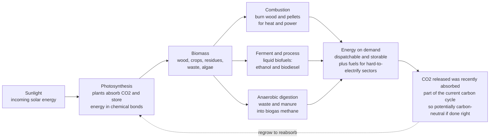

# 🌱 Bioenergy and Biofuels: The Storable, Land-Based Renewable

> [!abstract] TL;DR
> **Bioenergy is solar energy stored in living matter.** Plants are nature's solar panels: **photosynthesis** packs sunlight into chemical bonds, and when you burn wood, ferment corn into **ethanol**, press oils into **biodiesel**, or digest waste into **biogas**, you release that recently-captured sunshine as energy. The appeal is a neat carbon story — unlike fossil fuels (ancient sunlight releasing carbon locked away for eons), **biomass is part of the *current* carbon cycle**: the CO2 released when you burn it was pulled from the air by the plant just last season, so *in principle* it can be roughly **carbon-neutral** (grow, burn, regrow). Biomass is also uniquely valuable in two ways electricity is not: it is **dispatchable and storable** — the renewable you can burn on demand — and it yields **liquid and gaseous fuels** for the sectors electrification struggles to reach (aviation, shipping, heavy transport, high-heat industry), plus a route to *negative* emissions via **BECCS**. But bioenergy is the **most contested renewable**, because that neat carbon story unravels fast: energy crops compete with **food and forests** for land and water, biomass has a **low power density** (it needs vast land compared with solar), and getting the **carbon accounting** wrong — especially **land-use change** — can make some biofuels little better than, or even *worse* than, the fossil fuels they replace. It is renewable, storable, and flexible, but land-hungry and only as clean as it is carefully done — a limited-but-valuable, use-wisely piece of the decarbonization portfolio.

## Intuition

**Analogy:** Think of a plant as a slow, cheap, self-assembling **solar panel** — one that runs on sunlight, water, and air, builds itself for free, and stores its harvest not in a battery but in **wood, sugar, starch, and oil**. Every log in a fireplace and every kernel of corn is a little tank of last summer's sunshine. Set it alight, ferment it, or let microbes digest it, and you are simply cashing out solar energy that was banked a few months ago. That is all bioenergy is: **releasing recently-stored sunlight.**

Here is the twist that makes it interesting *and* controversial. When you burn a log, the CO2 that goes up the chimney is the *same* CO2 the tree pulled out of the air while it was growing — so if you grow another tree to replace it, the books balance and the fuel is roughly **carbon-neutral**. Burning coal breaks that cycle: it hands back carbon that a swamp buried three hundred million years ago, which today's biosphere has no plan to reabsorb. So biomass sits *inside* the current carbon cycle while fossil fuels reach *outside* it. The catch is that the neat "grow, burn, regrow" loop only closes if you are honest about *everything else*: the diesel in the tractor, the gas in the fertilizer factory, the forest you cleared to plant the crop, and the food that field is no longer growing. Get those wrong and the "carbon-neutral" fuel can quietly become **dirtier than gasoline**. Bioenergy is the renewable whose environmental value depends less on physics than on **bookkeeping and land**.

---

## How It Works

### The resource: biomass as stored recent sunlight

**Biomass** is any organic matter that stores recent solar energy captured by **photosynthesis** — wood and forestry residues, energy crops (corn, sugarcane, oil palm, switchgrass), agricultural residues (straw, bagasse, husks), organic wastes (manure, food waste, sewage), and, at the frontier, **algae**. Because the carbon in biomass was in the atmosphere *last season*, returning it by combustion or decay recirculates carbon already in play — the defining contrast with fossil carbon that has been out of circulation for geological time.

### Conversion routes: turning biomass into useful energy

There are three broad families, distinguished by whether you attack the biomass with **heat**, **microbes**, or **chemistry**:

1. **Combustion (direct thermal)** — simply *burn* wood, pellets, or residues for heat and power. This is the **oldest and still by far the largest** bioenergy use worldwide (cooking and heating with wood; industrial biomass boilers; **co-firing** biomass with coal; dedicated biomass power stations). Cheap and mature, but the biomass must be dry and the plant is only as clean as its sourcing.
2. **Biochemical (microbes do the work)** —
   - **Fermentation** of sugars and starches into **ethanol**: yeast eats the sugar from corn (USA) or sugarcane (Brazil) and excretes ethanol, which is distilled and **blended into gasoline** (E10, E85). Sugarcane is easy; corn needs an enzymatic starch-to-sugar step first.
   - **Anaerobic digestion** of wet wastes and manure into **biogas**: in the absence of oxygen, microbial communities break organic matter into a **methane**-rich gas used for heat, power, or *upgraded* to pipeline-quality **biomethane**. It doubles as waste treatment.
3. **Thermochemical (heat without full combustion)** —
   - **Gasification** partially oxidizes biomass at high temperature into **syngas** (CO + H2), which can be burned or catalytically converted to fuels.
   - **Pyrolysis** heats biomass with *no* oxygen into liquid **bio-oil**, char, and gas.
   - **Transesterification** reacts vegetable oils or animal fats with methanol over a catalyst to make **biodiesel** (fatty-acid methyl esters).
   - **Advanced routes** — **cellulosic** ethanol (from woody, non-food fiber), algal fuels, and **hydrotreated "drop-in" renewable diesel** and **sustainable aviation fuel (SAF)** that are chemically near-identical to petroleum fuels and need no engine changes.

### The value: what bioenergy does that other renewables cannot

- **Dispatchable and storable.** A woodpile, an ethanol tank, or a full biogas holder sits there until you need it — unlike solar and wind, biomass energy is **on-demand** and doubles as long-duration storage.
- **Liquid and gaseous fuels for hard-to-electrify sectors.** Aviation, shipping, long-haul trucking, and high-temperature industrial heat are painful to run on batteries; energy-dense **liquid biofuels** are one of the few low-carbon options.
- **A use for wastes** — turning manure, landfill gas, and crop residues into energy while managing the waste.
- **Negative emissions via BECCS.** Grow biomass that absorbs CO2, burn it for energy, then **capture and store** that CO2 underground, and you have pulled carbon *out* of the air — one of the few routes to net-negative emissions.

### The controversy: why "carbon-neutral" is conditional

The clean carbon story depends on assumptions that often fail:

- **Land and food competition** — energy crops compete with **food** production ("food-versus-fuel") and with **forests** and natural ecosystems for finite land and water.
- **Low power density** — photosynthesis is inefficient (well under 1 percent of sunlight ends up as harvestable fuel), so biomass yields **far less energy per hectare** than a solar farm on the same land.
- **Water, fertilizer, and biodiversity** — irrigation, nitrogen fertilizer (itself made from natural gas and a source of N2O), and monoculture pressure on habitats.
- **The carbon-accounting problem** — the decisive issue. **Lifecycle emissions** from farming, processing, and transport eat into the savings, and **land-use change** can erase them entirely: clear a forest or drain a peatland to plant an energy crop and you release a huge **carbon debt** that can take decades or centuries of "carbon-neutral" burning to repay. **Indirect land-use change (ILUC)** — displacing food production elsewhere, which then clears *new* land — can, in the worst estimates, make some biofuels **worse than the fossil fuel** they replace. "Carbon-neutral" only holds with careful sourcing (**residues and wastes, no land clearing**) and honest, full **lifecycle accounting** — which is why the *best-use* debate (residues and wastes for aviation and industry, versus burning standing forests for power) is central.

### Flow / Architecture



---

## Key Concepts

### Secondary Level

- **Biomass is stored sunlight.** Plants use sunlight to build wood, sugar, and oil. Burning them or fermenting them releases that stored energy — it is like using solar power you saved up last summer.
- **The carbon cycle idea.** When you burn a plant, the carbon dioxide that comes out is the *same* CO2 the plant took *in* while growing. Grow a new plant and it soaks that CO2 back up, so in principle the fuel can be roughly **carbon-neutral** — very different from coal, which releases carbon buried millions of years ago.
- **Three ways to use biomass.** *Burn* it for heat and power; *ferment* crops into liquid fuel (**ethanol**) or press plant oils into **biodiesel**; or let microbes *digest* waste into a gas (**biogas**) you can burn.
- **Why it is special.** Unlike sunshine and wind, you can **store** biomass and burn it whenever you want, and it makes **liquid fuel** for planes, ships, and trucks that are hard to run on batteries.
- **Why it is argued over.** Growing fuel crops takes a lot of **land and water** that could grow food or be forest — and if you clear a forest to plant them, you can end up *worse* than just using oil.

### Undergraduate Level

- **Photosynthetic efficiency and power density.** Plants convert only a small fraction of sunlight into stored chemical energy, so the **power density** of bioenergy (watts of usable energy per square metre of land) is low — typically a fraction of a W/m² for energy crops, versus roughly 10 W/m² for solar PV. This is why bioenergy is **land-intensive**: the same fuel demand needs vastly more land than an equivalent solar farm.
- **The conversion families.** *Combustion* (heat/power, largest use, co-firing); *biochemical* (**fermentation** → ethanol from sugar/starch; **anaerobic digestion** → biogas from wet waste); *thermochemical* (**gasification** → syngas; **pyrolysis** → bio-oil; **transesterification** → biodiesel from oils/fats). Feedstock chemistry dictates the route: sugars ferment easily, cellulose resists, oils transesterify.
- **First-generation vs advanced biofuels.** *First-generation* uses food crops (corn/sugarcane ethanol, oilseed biodiesel) — mature but food-competing. *Advanced/second-generation* uses **cellulosic** and waste feedstocks and **drop-in** renewable diesel and **SAF** — lower land and food pressure but harder and costlier to produce.
- **Dispatchability and the hard-to-abate case.** Bioenergy is **storable and on-demand**, and it is the principal renewable source of **energy-dense liquid fuels** for aviation, shipping, and heavy transport — sectors where direct electrification is difficult.
- **Lifecycle emissions (LCA).** A biofuel's climate benefit is *not* the tailpipe CO2 (that is biogenic, recently absorbed) but the **net lifecycle** emissions: fossil energy in farming, fertilizer manufacture and N2O, harvesting, processing, and transport — all measured in **gCO2e per MJ** against a fossil baseline.
- **Land-use change and carbon debt.** Converting forest, grassland, or peatland to energy cropping releases stored soil and biomass carbon — a one-time **carbon debt** that years of substitution must repay before any net benefit begins. **Direct** LUC is on the land you plant; **indirect (ILUC)** is the land cleared elsewhere to replace displaced food.

### Graduate Level

- **Energy return on investment (EROI) and net energy.** Bioenergy's value hinges on **EROI** — energy delivered divided by fossil energy invested. Corn ethanol's EROI is famously low (often quoted near 1–2, i.e. barely net-positive after farming, drying, and distillation), whereas sugarcane ethanol is much higher (roughly 8–10) because bagasse fuels the mill. A low EROI means most of the "renewable" energy is really repackaged fossil input — a key screen on whether a route is worth pursuing.
- **The carbon-neutrality assumption and its failure modes.** "Biomass is carbon-neutral" is a *modelling convention* (biogenic CO2 counted as zero at the stack) that holds only if (i) regrowth actually reabsorbs the carbon on a policy-relevant timescale, (ii) no land-use-change debt was incurred, and (iii) the biomass would not have sequestered more carbon left standing (the **counterfactual/additionality** problem). Burning slow-growing forest for power can create a **temporal carbon debt** of decades, during which atmospheric CO2 is *higher* than the fossil case it replaced.
- **ILUC and the Searchinger critique.** Indirect land-use change (Searchinger et al., 2008) showed that crop-based biofuels, by displacing food onto newly cleared land globally, can carry emissions that **eliminate or reverse** their apparent savings. ILUC factors are large, uncertain, and model-dependent — the single most contentious number in biofuel policy, and the reason regulations (EU RED II, California LCFS) attach ILUC penalties and sustainability criteria.
- **Feedstock hierarchy and best-use.** A defensible sustainability ranking prioritizes **wastes and residues** (near-zero land and LUC burden, and they avoid methane from decay) and **marginal-land energy crops**, and is skeptical of **food crops on prime land** and **whole-tree forest biomass**. Scarce sustainable biomass should be steered to uses with *no better alternative* — **SAF, shipping, and high-heat industry** — rather than to power generation, which renewables can decarbonize more cheaply.
- **BECCS and negative emissions.** **Bioenergy with carbon capture and storage** couples biomass energy to geological CO2 storage to remove atmospheric carbon. It is central to most 1.5–2 °C integrated-assessment pathways, but is bounded by **sustainable biomass and land** (competing with food and ecosystems), by **supply-chain lifecycle emissions** that must stay low for the net to be negative, and by storage integrity and monitoring — the same constraints that make "removals" easy on paper and hard in practice.
- **Thermodynamic and areal limits.** Because global net primary productivity is finite and human appropriation of it is already large, the **sustainable technical potential** of bioenergy is capped well below total energy demand. Bioenergy is therefore best framed not as a primary energy backbone but as a **limited, high-value niche fuel and negative-emissions tool** — deployed where its unique storability and liquid-fuel form are irreplaceable, and constrained everywhere its land and carbon costs bite.

---

## Python Demo

```python
# Bioenergy in two pictures: (a) LAND / POWER DENSITY -- how much usable power each
# route delivers per square metre of land, exposing biomass's LOW power density
# versus solar PV; and (b) LIFECYCLE CARBON BALANCE -- net grams CO2e per MJ for
# several biofuels versus a gasoline baseline, showing how savings depend on
# practice and can even go NEGATIVE (worse than fossil) with land-use change.
# numpy + matplotlib only.

import numpy as np
import matplotlib.pyplot as plt

# ==================================================================
# (a) POWER DENSITY  [watts of usable energy per square metre of land]
#     Illustrative values (order-of-magnitude, after MacKay and IEA):
#     photosynthesis is inefficient, so bioenergy routes deliver a
#     FRACTION of a W/m^2, while solar PV delivers ~10 W/m^2.
# ==================================================================
routes   = ["Corn\nethanol", "Wood /\nforestry", "Sugarcane\nethanol", "Solar PV\n(same land)"]
power_wm2 = np.array([0.22, 0.50, 0.60, 10.0])   # W per m^2
colors_a  = ["#c9a227", "#6b4f2a", "#2a9d8f", "#f4a300"]

land_ratio = power_wm2[-1] / power_wm2[:-1]      # how many x more land biomass needs
print("=== Power density (W/m^2) and land intensity vs solar PV ===")
for r, p in zip(routes, power_wm2):
    print(f"  {r.replace(chr(10),' '):22s}: {p:6.2f} W/m^2")
for r, x in zip(routes[:-1], land_ratio):
    print(f"  -> {r.replace(chr(10),' '):19s} needs ~{x:4.0f}x the land of solar PV "
          f"for the same power")

# ==================================================================
# (b) LIFECYCLE CARBON BALANCE  [g CO2-equivalent per MJ of fuel]
#     Net WELL-TO-WHEEL intensity vs a fossil gasoline baseline.
#     Biogenic combustion CO2 is ~carbon-neutral (recently absorbed),
#     so what remains are supply-chain + land-use-change emissions.
# ==================================================================
fuels = ["Gasoline\n(fossil)", "Corn ethanol\n(no land change)",
         "Sugarcane\nethanol", "Waste / residue\nbiofuel",
         "Corn ethanol\n+ land-use change"]
# component emissions (g CO2e / MJ): farming/inputs, processing, land-use change
farming    = np.array([ 0.0, 24.0, 12.0,  4.0, 24.0])
processing = np.array([ 0.0, 34.0, 15.0, 10.0, 34.0])
land_use   = np.array([ 0.0,  6.0,  4.0,  1.0, 42.0])   # ILUC debt is the big lever
# fossil extraction+refining baseline for gasoline:
fossil_wtt = np.array([94.0,  0.0,  0.0,  0.0,  0.0])

net = farming + processing + land_use + fossil_wtt
baseline = net[0]                                        # gasoline
savings_pct = 100.0 * (baseline - net) / baseline

print("\n=== Lifecycle carbon intensity (g CO2e / MJ) and savings vs gasoline ===")
for f, n, s in zip(fuels, net, savings_pct):
    tag = "SAVES" if s > 0 else "WORSE THAN FOSSIL"
    print(f"  {f.replace(chr(10),' '):32s}: {n:6.1f}  ({s:+5.0f}% -> {tag})")

# ==================================================================
# Plot
# ==================================================================
fig, (axA, axB) = plt.subplots(1, 2, figsize=(15, 6))
fig.suptitle("Bioenergy: low power density (land-hungry) and a carbon balance "
             "that depends on how it is done", fontsize=13, fontweight="bold")

# --- (a) power density ---
bars = axA.bar(routes, power_wm2, color=colors_a)
axA.set_ylabel("Usable power density  [W / m^2]")
axA.set_title("(a) Power density: biomass needs vastly more land than solar")
for b, p in zip(bars, power_wm2):
    axA.text(b.get_x() + b.get_width()/2, p + 0.15, f"{p:.2f}",
             ha="center", fontsize=9)
axA.annotate("solar PV delivers\n~20-45x more energy\nper hectare of land",
             xy=(3, 10), xytext=(1.1, 7.2), fontsize=9, color="#b26b00",
             arrowprops=dict(arrowstyle="->", color="#b26b00"))
axA.grid(axis="y", alpha=0.3)

# --- (b) lifecycle carbon balance (stacked) vs gasoline baseline ---
x = np.arange(len(fuels))
axB.bar(x, fossil_wtt, color="#7f8c8d", label="fossil extraction + refining")
axB.bar(x, farming,    bottom=fossil_wtt, color="#8fbf5f", label="farming + inputs")
axB.bar(x, processing, bottom=fossil_wtt + farming, color="#4a9eff",
        label="processing + transport")
axB.bar(x, land_use,   bottom=fossil_wtt + farming + processing, color="#e17055",
        label="land-use change")
axB.axhline(baseline, color="#c0392b", ls="--", lw=1.6,
            label="gasoline baseline (break-even)")
axB.set_xticks(x)
axB.set_xticklabels(fuels, fontsize=8)
axB.set_ylabel("Lifecycle carbon intensity  [g CO2e / MJ]")
axB.set_title("(b) Net savings hinge on land use -- ILUC can make it WORSE")
for xi, n in zip(x, net):
    axB.text(xi, n + 2, f"{n:.0f}", ha="center", fontsize=8)
axB.legend(loc="upper center", fontsize=7.5, ncol=2)
axB.set_ylim(0, 130)

plt.tight_layout(rect=[0, 0, 1, 0.93])
plt.savefig("bioenergy_and_biofuels.png", dpi=120)
print("\nSaved bioenergy_and_biofuels.png")
```

**What it shows.** Panel (a) is the land story: corn ethanol delivers only ~0.2 W/m² and even efficient sugarcane ~0.6 W/m², while solar PV on the *same land* delivers ~10 W/m² — so biomass needs roughly **20–45x more land** for the same energy, the physical root of the food-and-land controversy. Panel (b) is the carbon story: strip away the biogenic tailpipe CO2 (recently absorbed) and what is left is supply-chain and land-use emissions. **Sugarcane and waste-based fuels** save a lot versus gasoline; **corn ethanol without land clearing** saves modestly; but **corn ethanol with land-use change** piles on a large ILUC debt and lands *above* the gasoline line — the case where a "renewable" fuel is **worse than the fossil fuel it replaces**. The lesson of both panels: bioenergy's climate value is set by **land and accounting**, not by the fact that it grows.

---

## Real-World Applications

> **Example — Brazil's sugarcane ethanol program (Proálcool), the archetype of a working biofuel.** Since the 1970s Brazil has fermented sugarcane into ethanol at national scale, running a fleet of **flex-fuel** cars on blends up to pure ethanol. It works far better than corn ethanol for two structural reasons this note explains: sugarcane's sugar ferments *directly* (no energy-hungry starch conversion), and the crushed cane fibre (**bagasse**) is burned to power the mill, so little fossil energy is imported — giving a high **EROI** (~8–10) and lifecycle savings of roughly 60–70 percent versus gasoline *when grown on non-forest land*. It embodies the whole chain: photosynthesis, fermentation, combustion of residue for process heat, and a dispatchable liquid fuel — while its expansion pressure on land is exactly the sustainability concern the theory flags.

- **Corn ethanol in the United States.** The world's largest biofuel program blends corn ethanol into gasoline (E10). It is a real fuel and rural-economy engine, but its **low EROI** and modest — sometimes negligible after **ILUC** — carbon savings make it the textbook case of the food-versus-fuel and carbon-accounting debates.
- **Wood pellets and biomass power (co-firing and dedicated plants).** Utilities such as the UK's Drax converted coal units to burn imported wood pellets. Whether this cuts emissions depends entirely on **sourcing and the carbon-debt timescale** — residues and fast-regrowth wood can be low-carbon; whole-tree harvesting of slow-growing forest can be worse than the coal it replaced for decades.
- **Anaerobic digestion / biogas.** Farms, landfills, and wastewater plants digest manure, food waste, and sludge into **biogas** for on-site heat and power, or upgrade it to **biomethane** for the gas grid — capturing methane that would otherwise leak from decaying waste, a double climate win.
- **Sustainable aviation fuel (SAF) and renewable diesel.** Hydrotreated waste oils, fats, and (increasingly) advanced feedstocks yield **drop-in** jet and diesel fuel chemically near-identical to petroleum — the main near-term low-carbon option for **aviation and shipping**, where electrification is hardest and biomass's liquid-fuel form is irreplaceable.
- **BECCS pilots.** Ethanol plants (whose fermentation emits a nearly pure CO2 stream) and biomass power plants paired with **carbon capture** — e.g. Illinois' ADM ethanol-CCS facility — are the earliest real **negative-emissions** deployments, the template net-zero pathways rely on.

---

## Common Pitfalls

- **Treating "biomass is carbon-neutral" as a physical law.** It is a *bookkeeping convention* that biogenic combustion CO2 is offset by regrowth. It only holds if regrowth actually reabsorbs the carbon on a relevant timescale, no land was cleared, and the biomass would not have stored more carbon left standing. Burn a slow forest and you create a decades-long **carbon debt** during which the atmosphere is *worse off* than the fossil case.
- **Ignoring land-use change (direct and indirect).** The tailpipe CO2 is the easy part; the emissions that decide everything are **farming, processing, and especially land-use change**. Clearing forest or peatland, or displacing food onto new land (**ILUC**), can erase or reverse the savings entirely. A biofuel's carbon score is meaningless without a full lifecycle and land-use accounting.
- **Confusing energy yield with net (fossil-free) energy.** A route can *produce* a lot of ethanol while consuming almost as much fossil energy to grow, dry, and distill it — a **low EROI**. Corn ethanol's near-breakeven EROI means much of the "renewable" energy is really repackaged natural gas and diesel. Always ask for energy *returned* over energy *invested*.
- **Forgetting the power-density (land) constraint.** Photosynthesis is inefficient, so bioenergy is intrinsically **land-hungry** — often 20–45x more land than solar PV for the same energy. Global sustainable biomass is capped well below total energy demand, so bioenergy cannot be a primary backbone; it is a **limited, high-value niche**.
- **Using scarce biomass for the wrong job.** Burning premium biomass for grid power — which cheap solar and wind can decarbonize — wastes a resource that is *irreplaceable* for **aviation, shipping, and high-heat industry**. The best-use principle: steer limited sustainable biomass (ideally **wastes and residues**) to sectors with no better low-carbon option.
- **Overcounting BECCS.** Negative emissions are only real if the biomass is *sustainable*, the *supply-chain lifecycle* emissions are genuinely low, and the CO2 is *permanently* stored and *additional*. BECCS is easy to assume in a model and hard to deliver at scale — land, lifecycle, and storage-integrity limits all bite.

---

## Related Concepts

This note sits in the **Renewable Energy** pillar (S03) of the Energy Systems vault. Its section siblings are referenced here in prose. Bioenergy is the storable, land-based counterpart to *Solar_Photovoltaics* — the very technology it loses to on power density, since a solar farm delivers far more energy per hectare than any energy crop. It is the biosphere's version of the combustion covered in *Fossil_Fuels_and_Combustion*, the crucial difference being that biomass carbon is *recent* (inside the current carbon cycle) rather than *ancient*, which is precisely the distinction that makes emissions accounting — the subject of *Emissions_and_the_Climate_Impact_of_Energy* — decisive for whether a biofuel helps at all. Paired with *Carbon_Capture_Utilization_and_Storage*, bioenergy becomes **BECCS**, one of the few routes to negative emissions; and it competes and complements with *Hydrogen_and_Fuel_Cells* as a low-carbon fuel for the hard-to-electrify sectors. Those siblings are referenced in prose; the links below point to notes that already exist elsewhere in the vault.

**Biology — where the stored energy and the carbon cycle come from**
- [[Photosynthesis]] — the light and carbon-fixation reactions that pack solar energy into the chemical bonds of biomass; the "solar panel" step that makes bioenergy possible and sets its low efficiency ceiling
- [[Biogeochemical_Cycles]] — the global carbon cycle that distinguishes *recent* biogenic carbon (recirculated) from *ancient* fossil carbon (added to the atmosphere), the basis of the carbon-neutrality claim
- [[Ecosystems_and_Energy_Flow]] — net primary productivity and energy flow through trophic levels, which cap how much biomass ecosystems can sustainably yield for energy

**Chemistry and chemical engineering — the conversion routes**
- [[Metabolism_and_Bioenergetics]] — the microbial metabolism behind **fermentation** (sugars to ethanol) and **anaerobic digestion** (organic matter to biogas methane)
- [[Structure_Bonding_and_Functional_Groups]] — the ester chemistry underlying **transesterification** of plant oils and fats into biodiesel, and the sugars and cellulose that dictate which feedstocks ferment easily
- [[Ideal_Reactors_Batch_CSTR_PFR]] — fermenters and anaerobic digesters as engineered **bioreactors**; batch and continuous reactor design governs biofuel yield and throughput
- [[Catalysis_and_Heterogeneous_Reactions]] — the catalysts that drive transesterification to biodiesel and the gasification/pyrolysis and hydrotreating routes to syngas, bio-oil, and drop-in SAF
- [[Reactive_Systems_and_Combustion_Balances]] — the combustion stoichiometry and air-fuel balances for burning wood, pellets, and residues for heat and power, the oldest and largest bioenergy use

---

## Review Questions

**Secondary**
1. Explain in your own words why burning wood can be "carbon-neutral" but burning coal is not, using the idea that a plant took CO2 *out* of the air while it grew. Then name the three main ways we get energy from biomass (burning, fermenting, digesting), give one example of each, and state one reason bioenergy is special (something solar and wind cannot do) and one reason people argue about it.

**Undergraduate**
2. A policymaker says "biofuels are automatically carbon-neutral because plants absorb the CO2 back." (i) Explain why the tailpipe CO2 is *not* the right thing to count, and what a **lifecycle** assessment (gCO2e/MJ) counts instead. (ii) Using the concepts of **power density** and **EROI**, explain why corn ethanol is far more contested than sugarcane ethanol or waste-based biofuel. (iii) Given that sustainable biomass is limited, argue whether scarce biomass should be burned for grid electricity or reserved for aviation fuel, and justify your answer.

**Graduate**
3. A country must allocate a fixed, limited supply of sustainable biomass across competing uses. (a) Using **land-use change** and **ILUC**, explain how a crop-based biofuel can end up with *higher* lifecycle emissions than the gasoline it replaces, and why the "carbon debt" of clearing forest can take decades to repay — referencing the counterfactual/additionality problem of what the land would otherwise do. (b) Construct a defensible **feedstock hierarchy** and **best-use** ranking, explaining why wastes/residues destined for aviation or industry beat food crops burned for power that renewables could supply. (c) State the three conditions (biomass sustainability, low supply-chain lifecycle emissions, permanent and additional storage) under which **BECCS** genuinely delivers negative emissions, and explain why each is hard to guarantee at scale.

---

## Sources

- J. Twidell & T. Weir — *Renewable Energy Resources*, 3rd ed. (Routledge) — biomass resources, conversion routes (combustion, fermentation, digestion, thermochemical), and yields
- J. Tester, E. Drake, M. Driscoll, M. Golay & W. Peters — *Sustainable Energy: Choosing Among Options* (MIT Press) — bioenergy within the full systems view, EROI, and lifecycle trade-offs
- D. MacKay — *Sustainable Energy — Without the Hot Air* (UIT Cambridge; free at withouthotair.com) — the power-density and land-area arithmetic that frames biomass's scale limits
- IEA Bioenergy / IEA — *Technology and outlook reports on bioenergy and biofuels* — deployment, sustainability criteria, SAF, and best-use analysis. [ieabioenergy.com](https://www.ieabioenergy.com)
- IPCC — *Special Report on Climate Change and Land (2019)* and AR6 mitigation chapters — bioenergy potential, land competition, land-use change, and BECCS assessment

---

#energy-systems #bioenergy #biofuels #biomass #carbon-cycle
