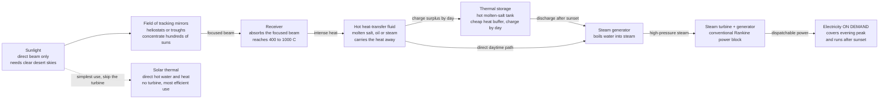

# ☀️ Concentrated Solar Power and Solar Thermal: Capturing the Sun as Heat for Dispatchable Power

> [!abstract] TL;DR
> A photovoltaic panel turns sunlight straight into **current**; **concentrated solar power (CSP)** instead turns it into **heat** — using a field of mirrors to focus hundreds of suns onto a single receiver, reaching **400–1000 °C**, then running a perfectly ordinary **steam turbine** off that heat. Why bother, when panels are cheaper per kilowatt-hour? Because heat is **cheap to store**. Pour the sun's warmth into giant tanks of **molten salt** during the day, and the plant keeps making electricity for hours after sunset — CSP is **dispatchable, firm solar**, curing photovoltaics' single biggest weakness (electricity is expensive to store; heat is not). Its humbler cousin, **solar thermal**, skips electricity entirely and uses the sun's warmth *directly* — **solar water heaters** and process heat — the simplest and most efficient use of sunlight there is. Both capture the sun as **heat rather than current**, trading higher cost and a need for clear desert skies for the priceless ability to **store and dispatch** energy on demand.

## Intuition

**Analogy:** Every child who has held a magnifying glass over a dry leaf knows the trick: gather a wide patch of sunlight and squeeze it down to a tiny bright dot, and the dot gets hot enough to **start a fire**. Concentrated solar power is that magnifying glass built at industrial scale — except instead of a leaf, the burning-hot spot boils a fluid to run a steam engine. A field of mirrors, each one tracking the sun across the sky, throws its reflected light onto a single point or line. Stack up hundreds of mirrors and you concentrate **hundreds of suns' worth of heat** onto one small receiver, which glows at temperatures that would melt lead. That fierce heat drives a conventional power plant, exactly like the steam plants that burn coal — only the "fuel" is focused sunlight.

Here is the twist that makes it worth the trouble. A solar panel makes electricity the instant light hits it, and **nothing** the moment the sun sets — and storing that electricity in batteries is expensive. CSP makes *heat* first, and heat is almost embarrassingly cheap to store: just pour it into a giant insulated tank of **molten salt**, like a colossal thermos flask. Fill the flask during the blazing afternoon, then at night open the tap and keep boiling water and spinning the turbine long after dark. That is the killer feature — **solar electricity on demand, even at night.** And the simplest cousin of all, plain **solar thermal**, does not even bother with the turbine: it just lets the sun warm the water for your shower or heat your building directly. When all you need is heat, catching the sun *as* heat is the most efficient thing you can possibly do.

---

## How It Works

### Core Mechanics

CSP is a **heat pipeline** with a solar furnace at one end and a steam turbine at the other. The chain has five links, and the third one — **storage** — is the reason the whole architecture exists.

1. **Collect and concentrate the beam.** A field of sun-tracking mirrors gathers **direct beam sunlight** — the sharp, shadow-casting component called **direct normal irradiance (DNI)** — and reflects it all onto a small **receiver**. Only the *beam* can be focused; the soft diffuse light of a hazy sky cannot be brought to a point, which is why CSP demands the cloudless skies of deserts. The **concentration ratio** $C$ — how many times the mirror area exceeds the receiver area — sets everything downstream: the higher $C$, the hotter the receiver can get before it radiates its heat back to the sky.

2. **Turn concentrated light into high-temperature heat.** At the receiver, absorbed sunlight becomes heat in a circulating **heat-transfer fluid** — synthetic oil, water/steam, or molten salt — reaching **~400 °C** in a parabolic trough or **~565 °C** (up toward 1000 °C in advanced designs) in a power tower. Hotter fluid means a hotter heat source for the turbine, and by **Carnot's law** a hotter source means higher possible efficiency — so temperature, driven by concentration, is the master variable.

3. **Store the heat (the whole point).** During the sunny hours the field collects **more** heat than the turbine can use — it is deliberately **oversized** (the "solar multiple"). The surplus is pumped into a hot **molten-salt tank**. Because salt costs a few dollars per kilogram and holds heat densely, a few hours of storage is far cheaper than the equivalent battery. This buffer **decouples** when the sun shines from when the plant generates.

4. **Boil water and spin a turbine.** Hot fluid (straight from the field by day, or from the storage tank after sunset) flows through a **steam generator** that boils water into high-pressure steam, which drives a conventional **steam turbine and generator** — the same **Rankine power block** as any thermal plant. Heat becomes electricity here.

5. **Dispatch on demand.** Because the heat was stored, the operator chooses *when* to run the turbine: hold generation for the **evening demand peak** after the sun is gone, or run steadily through the night. This is what makes CSP **dispatchable / firm** — a controllable generator, not a weather-driven one.

**And the simpler branch — solar thermal (non-electric).** Strip away the turbine entirely and you have **solar thermal heating**: a **flat-plate** or **evacuated-tube collector** on a roof warms water directly for showers, space heating, or industrial **process heat**. With no heat engine and no Carnot penalty, a good collector converts **60–80%** of incident sunlight into useful heat — the single most efficient way to use the sun, precisely because it never tries to make the hard, high-quality product (electricity) out of the easy one (warmth).

### Flow / Architecture



---

## Key Concepts

### Secondary Level

- **Sunlight becomes heat, not current.** A solar *panel* makes electricity directly from light. Concentrated solar power instead uses **mirrors like a giant magnifying glass** to make the sunlight fiercely **hot**, then uses that heat to boil water and spin a turbine — the same way a coal plant works, but with the sun as the flame.
- **Mirrors that follow the sun.** Fields of mirrors tilt through the day to keep the reflected light aimed at one **receiver**. Hundreds of mirrors focused on one spot pile up **hundreds of suns' worth of heat**, hot enough to run a power plant.
- **The superpower is storing heat.** Heat is **cheap to store** — you just keep it in a giant insulated tank of hot melted salt. So a CSP plant can save the sun's heat during the day and **keep making electricity after dark**. That is something ordinary solar panels cannot do cheaply.
- **Solar on demand, even at night.** Because it stores heat, CSP can deliver power exactly when people need it — like the early evening when everyone comes home — instead of only when the sun is up. This is called **dispatchable** power.
- **The simplest cousin: solar water heaters.** You do not always need electricity. A **solar water heater** on a roof just lets the sun warm your water directly — cheap, simple, and the most efficient way to use sunlight when heat is all you want.
- **Where it works.** CSP needs strong, direct, cloudless sun, so it belongs in **deserts** (Spain, Morocco, the US Southwest, the Middle East, Australia), not cloudy climates.

### Undergraduate Level

- **The four main configurations.** **Parabolic trough** (long curved mirror focuses sun onto a receiver *tube* running along the focal line — mature, ~400 °C, moderate $C \approx 70$–100); **power tower / central receiver** (a field of flat **heliostats** focuses on a single receiver atop a tower — *point* focus, higher $C$ and ~565 °C+, better efficiency and storage); **linear Fresnel** (flat strips approximating a trough — cheaper, lower performance); and **parabolic dish / Stirling** (small point-focus dishes with an engine at the focus — very high $C$ and temperature, but hard to store and scale).
- **Line focus vs point focus.** A trough focuses to a **line**, so its concentration and temperature are limited; a tower focuses to a **point**, reaching far higher $C$ and temperature. Higher temperature raises the Carnot ceiling of the power block — which is why towers are the frontier.
- **Concentration ratio sets temperature.** More concentration $C$ means more absorbed flux per unit receiver area, which the receiver balances by getting hotter (and radiating more). Roughly, the **stagnation temperature** follows from $\alpha\,C\,I = \varepsilon\,\sigma\,(T^4 - T_{amb}^4)$: quadrupling $C$ raises the equilibrium temperature by about $\sqrt 2$. Temperature drives efficiency, so $C$ is the master design knob.
- **The power block is just Rankine.** Downstream of the receiver, CSP is an ordinary **steam Rankine plant** — boiler, turbine, condenser, pump — so all its efficiency levers (superheat, reheat, condenser vacuum) and its ~35–43% thermal efficiency apply directly. CSP is a *heat source* bolted onto conventional thermal generation.
- **Thermal energy storage is the killer feature.** Storing **heat** in molten salt costs on the order of \$20–30 per kWh-thermal — an order of magnitude cheaper than storing the equivalent **electricity** in batteries. This is CSP's defining advantage over photovoltaics: PV must store its output as costly electrical energy, while CSP stores it *upstream*, as cheap heat, before the turbine.
- **Solar multiple and capacity factor.** The **solar multiple** is the ratio of the solar field's peak thermal output to the turbine's thermal demand. A field sized at SM = 1 with no storage has a capacity factor of only ~25%; oversizing to SM ≈ 2–3 and adding storage lets the turbine run far longer, pushing **capacity factor to 40–70%+** and shifting output into the evening.
- **DNI, not GHI.** CSP can only use **direct normal irradiance** (the focusable beam), unlike PV which also harvests **diffuse** light (global horizontal irradiance). This is why a hazy or cloudy site kills CSP but only dents PV, and why CSP is a **desert** technology.
- **Solar thermal heating collectors.** **Flat-plate** collectors (a black absorber under glass) suit domestic hot water in mild climates; **evacuated-tube** collectors (vacuum insulation around each absorber) cut convective losses and work in colder climates and at higher temperatures. Both feed the enormous, easily-decarbonized demand for **low-grade heat** — water and space heating — that dwarfs electricity in many buildings.

### Graduate Level

- **The thermodynamic limit on concentration.** Concentration cannot be arbitrarily high: the **second law** (via conservation of étendue / the brightness theorem) caps it. For a sun with angular radius $\theta_s \approx 0.267°$, the maximum concentration is $C_{max} = 1/\sin^2\theta_s \approx 46{,}200$ for a 3-D point-focus system and $\sqrt{C_{max}} \approx 215$ for a 2-D line-focus (trough). Exceeding this would let a receiver grow *hotter than the sun's surface*, violating the second law. Real systems reach a fraction of this because of optical errors, tracking slop, and finite acceptance angle.
- **Stagnation temperature and the receiver energy balance.** With optical efficiency $\eta_{opt}$ and DNI $I$, absorbed flux is $\eta_{opt}\,C\,I\,\alpha$ and re-radiated loss (dominant at high $T$) is $\varepsilon\,\sigma\,T^4$. The stagnation (no-load) temperature is $T_{stag} = \left(\eta_{opt}\,C\,I\,\alpha / (\varepsilon\,\sigma) + T_{amb}^4\right)^{1/4}$. Because loss scales as $T^4$, radiation sets a hard ceiling that only higher $C$ can push back — this is the quantitative version of "more mirrors, hotter receiver."
- **The collector–Carnot product and optimal operating temperature.** Overall CSP efficiency is the product of a **collector efficiency that falls with temperature** and a **Carnot efficiency that rises with temperature**: $\eta(T) = \underbrace{\left(\eta_{opt}\,\alpha - \dfrac{\varepsilon\,\sigma\,T^4}{C\,I}\right)}_{\text{collector}} \cdot \underbrace{\left(1 - \dfrac{T_{amb}}{T}\right)}_{\text{Carnot}}$. This product has a **maximum at an intermediate temperature** — run too cool and the engine is feeble; run too hot and the receiver bleeds heat by radiation. The optimum temperature and peak efficiency both **rise with concentration**, which is the fundamental case for high-$C$ power towers.
- **Molten "solar salt" chemistry and its constraints.** The workhorse is **60% NaNO₃ / 40% KNO₃**, which **freezes at ~220 °C** (so every pipe and tank needs freeze-protection heat tracing — a notorious O&M headache) and **decomposes above ~565 °C** (capping the turbine inlet temperature and thus efficiency). Next-generation storage chases higher ceilings with **chloride salts, liquid metals, or solid particles** to enable **supercritical CO₂ (sCO₂) Brayton** power blocks at 700 °C+ for ~50% conversion efficiency.
- **Two-tank vs thermocline storage.** The standard **two-tank** design keeps separate hot (~565 °C) and cold (~290 °C) tanks and pumps salt between them. A cheaper **single-tank thermocline** stratifies hot salt above cold in one vessel (often filled with rock/sand filler to displace costly salt), trading capital cost for the engineering challenge of maintaining a sharp thermal gradient over many charge/discharge cycles.
- **Selective absorber surfaces.** Receivers use **spectrally selective coatings** — high absorptance $\alpha \approx 0.95$ across the solar spectrum but low emittance $\varepsilon$ in the thermal infrared — to soak up sunlight while suppressing $\sigma\,T^4$ re-radiation. This decoupling of absorption from emission is what lets a receiver run hot without radiating away its gains; it is the same physics as a good solar-thermal absorber, scaled up.
- **Dispatchability and grid value.** CSP-with-storage is a **firm, flexible** generator whose value on a renewables-heavy grid is not its raw kWh cost (higher than PV) but its **capacity credit** and ability to supply the post-sunset **net-load peak** — the "duck curve" ramp that strands cheap midday PV. Techno-economically, CSP increasingly makes sense **paired with PV**: cheap PV covers daylight while CSP stores heat and dispatches into the evening, a hybrid that beats either alone.
- **Why CSP stayed niche while PV won.** PV's learning curve crushed its cost far faster than CSP's, so **PV dominates for energy**. CSP survives for the distinct product PV cannot cheaply deliver — **dispatchable solar** — and for **high-temperature industrial heat** and **solar fuels** (thermochemical hydrogen), where its ability to reach 1000 °C+ is unmatched by any other renewable.

---

## Python Demo

```python
# Concentrated Solar Power + Solar Thermal, numpy + matplotlib only.
#
#   (a) DISPATCHABILITY via THERMAL STORAGE: simulate a CSP plant with an
#       oversized solar field (solar multiple > 1) and a molten-salt tank.
#       Surplus daytime heat charges the tank; after sunset the turbine keeps
#       running on stored heat. Overlay a same-rated PV plant, whose output
#       simply COLLAPSES TO ZERO at night -> the visual core of "firm solar".
#   (b) STORAGE STATE-OF-CHARGE over 24 h: the salt tank fills by day, then
#       drains through the evening -- the buffer that time-shifts the energy.
#   (c) CONCENTRATION -> TEMPERATURE -> EFFICIENCY: as the concentration ratio
#       C rises, the receiver's achievable temperature and the best overall
#       (collector x Carnot) efficiency both climb -- the case for power towers.
import numpy as np
import matplotlib.pyplot as plt

# ----------------------------------------------------------------------
# (a)+(b)  24-hour CSP-with-storage dispatch simulation
# ----------------------------------------------------------------------
hours = np.linspace(0.0, 24.0, 24 * 12 + 1)   # 5-minute steps
dt = hours[1] - hours[0]                       # hours per step

def solar_bell(t):
    """Normalised collected solar power: sun up 06:00-18:00, smooth bell, 0 at night."""
    x = np.clip((t - 6.0) / 12.0, 0.0, 1.0)    # 0 at 06:00, 1 at 18:00
    s = np.sin(np.pi * x) ** 1.3               # slightly peaked midday bell
    s = np.where((t < 6.0) | (t > 18.0), 0.0, s)
    return s

# Plant sizing
P_rated   = 100.0                 # MW-electric turbine rating
eta_block = 0.40                  # power-block (Rankine) efficiency
Q_block   = P_rated / eta_block   # MW-thermal to run the turbine at rated (250 MW)
SM        = 2.4                   # solar multiple: field peak thermal / Q_block
Q_solar   = SM * Q_block * solar_bell(hours)   # MW-thermal collected by the field
E_max     = 8.0 * Q_block         # 8 hours of full-load thermal storage (MWh-th)

# Greedy dispatch: run turbine at rated whenever solar + storage can supply it.
soc = 0.0
P_csp, soc_hist = [], []
for q in Q_solar:
    if q >= Q_block:                       # surplus sun -> run + charge tank
        to_turb = Q_block
        room    = (E_max - soc) / dt
        soc    += min(q - Q_block, room) * dt
    else:                                  # weak/no sun -> top up from storage
        draw    = min(Q_block - q, soc / dt)
        soc    -= draw * dt
        to_turb = q + draw
    P_csp.append(min(eta_block * to_turb, P_rated))
    soc_hist.append(soc)
P_csp   = np.array(P_csp)
soc_hist = np.array(soc_hist)

# PV plant of the SAME electrical rating: output follows the sun, ZERO at night.
P_pv = P_rated * solar_bell(hours)

cf_csp = P_csp.mean() / P_rated
cf_pv  = P_pv.mean()  / P_rated
# hours the CSP turbine still runs AFTER sunset (18:00)
after_dark = ((hours > 18.0) & (P_csp > 1.0)).sum() * dt

print("CSP-WITH-STORAGE vs PV  (same 100 MW rating)")
print(f"  CSP capacity factor : {cf_csp*100:5.1f}%")
print(f"  PV  capacity factor : {cf_pv*100:5.1f}%")
print(f"  CSP still generating after sunset for ~{after_dark:.1f} h on stored heat\n")

# ----------------------------------------------------------------------
# (c)  Concentration ratio -> receiver temperature -> best efficiency
# ----------------------------------------------------------------------
sigma = 5.670e-8      # Stefan-Boltzmann  [W/m^2/K^4]
I_dni = 1000.0        # direct normal irradiance [W/m^2]
alpha = 0.95          # receiver absorptance
eps   = 0.10          # receiver (selective-surface) thermal emittance
eta_o = 0.65          # optical efficiency of the mirror field
T_amb = 300.0         # K

C = np.logspace(0.5, 4.3, 400)     # concentration ratio ~3 .. 20000

# stagnation temperature: absorbed flux = re-radiated flux (no useful load)
T_stag = (eta_o * C * I_dni * alpha / (eps * sigma) + T_amb**4) ** 0.25

# best OVERALL efficiency = max over T of  collector(T) x Carnot(T)
T_grid = np.linspace(320.0, 2200.0, 600)
best_eta, best_T = np.zeros_like(C), np.zeros_like(C)
for i, c in enumerate(C):
    collector = eta_o * alpha - eps * sigma * T_grid**4 / (c * I_dni)
    carnot    = 1.0 - T_amb / T_grid
    overall   = np.clip(collector, 0.0, None) * np.clip(carnot, 0.0, None)
    j = int(np.argmax(overall))
    best_eta[i], best_T[i] = overall[j], T_grid[j]

# label typical CSP families on the concentration axis
families = {"Trough\n~80": 80, "Fresnel\n~40": 40, "Tower\n~800": 800, "Dish\n~3000": 3000}

# ----------------------------------------------------------------------
# Plot
# ----------------------------------------------------------------------
fig, ax = plt.subplots(1, 3, figsize=(18, 5.6))
fig.suptitle("Concentrated solar power: storage makes it dispatchable, and "
             "concentration makes it hot", fontsize=13, fontweight="bold")

# (a) dispatch: CSP time-shifted vs PV collapsing at night
ax[0].fill_between(hours, 0, Q_solar / Q_block * P_rated, color="#fdcb6e",
                   alpha=0.35, label="solar heat collected (scaled)")
ax[0].plot(hours, P_pv,  color="#e17055", lw=2.2, ls="--", label="PV output (zero at night)")
ax[0].plot(hours, P_csp, color="#4a9eff", lw=2.6, label="CSP output (dispatched)")
ax[0].axvspan(18, 24, color="gray", alpha=0.12)
ax[0].axvspan(0, 6,  color="gray", alpha=0.12)
ax[0].text(21, 12, "after\nsunset", ha="center", fontsize=8, color="dimgray")
ax[0].set_xlim(0, 24); ax[0].set_ylim(0, P_rated * 1.15)
ax[0].set_xticks(range(0, 25, 4))
ax[0].set_xlabel("hour of day"); ax[0].set_ylabel("power  [MW]")
ax[0].set_title(f"(a) Storage time-shifts solar into the night\n"
                f"CSP CF {cf_csp*100:.0f}%  vs  PV CF {cf_pv*100:.0f}%")
ax[0].legend(fontsize=8, loc="upper right"); ax[0].grid(alpha=0.3)

# (b) storage state-of-charge
ax[1].fill_between(hours, 0, soc_hist / E_max * 100, color="#2a9d8f", alpha=0.5)
ax[1].plot(hours, soc_hist / E_max * 100, color="#2a9d8f", lw=2.4)
ax[1].set_xlim(0, 24); ax[1].set_ylim(0, 105); ax[1].set_xticks(range(0, 25, 4))
ax[1].set_xlabel("hour of day"); ax[1].set_ylabel("molten-salt tank charge  [percent of max]")
ax[1].set_title("(b) The salt tank fills by day,\ndrains through the evening")
ax[1].grid(alpha=0.3)

# (c) concentration -> temperature and best efficiency
axT = ax[2]
l1, = axT.plot(C, T_stag - 273.15, color="#e76f51", lw=2.4, label="stagnation temperature")
axT.set_xscale("log")
axT.set_xlabel("concentration ratio  C  [suns]")
axT.set_ylabel("receiver temperature  [C]", color="#e76f51")
axT.tick_params(axis="y", labelcolor="#e76f51")
axT.set_ylim(0, 2200)
axE = axT.twinx()
l2, = axE.plot(C, best_eta * 100, color="#4a9eff", lw=2.4, label="best overall efficiency")
axE.set_ylabel("best overall efficiency  [percent]", color="#4a9eff")
axE.tick_params(axis="y", labelcolor="#4a9eff"); axE.set_ylim(0, 70)
for name, cval in families.items():
    axT.axvline(cval, color="gray", ls=":", lw=1)
    axT.text(cval, 1950, name, rotation=0, ha="center", fontsize=7, color="dimgray")
axT.set_title("(c) More concentration -> hotter receiver\n-> higher achievable efficiency")
axT.legend(handles=[l1, l2], fontsize=8, loc="center right")

plt.tight_layout(rect=[0, 0, 1, 0.93])
plt.show()
```

Running this prints the punchline in numbers — the **PV plant's capacity factor sits near 25% and its output is flatly zero every night, while the CSP-with-storage plant reaches ~55–65% and keeps generating several hours after sunset on stored heat.** **Panel (a)** shows it visually: the PV curve (dashed) rises and crashes with the sun, but the CSP curve (solid blue) is *held flat at rated power deep into the shaded evening*, fed by the salt tank — this is dispatchable, firm solar. **Panel (b)** traces the storage state-of-charge filling through the afternoon surplus and draining through the night — the buffer that does the time-shifting. **Panel (c)** makes the concentration argument concrete: as $C$ climbs from trough-scale (~80) to tower- and dish-scale (hundreds to thousands), the receiver's achievable **temperature rises** and, with it, the **best overall efficiency** — the fundamental reason power towers chase ever-higher concentration.

---

## Real-World Applications

> **Example — a molten-salt power tower, dispatchable solar in the flesh.** At a plant like **Crescent Dunes** (Nevada) or the towers of **Noor Ouarzazate** (Morocco) and **Cerro Dominador** (Chile), thousands of mirror **heliostats** spread across a square kilometre of desert, each on a two-axis tracker, aim their reflections at a single receiver on a tower hundreds of metres tall. Cold molten salt (~290 °C) is pumped up, flashed to **~565 °C** by the concentrated flux glowing at the receiver, and sent to a hot storage tank. From there it boils water for a conventional **steam turbine**. With **~10 hours of storage** the plant runs at full output well past midnight — Cerro Dominador is designed to deliver essentially **24-hour solar power** — turning the desert sun into firm, on-demand electricity in a way no photovoltaic-plus-battery installation of the era could match on cost per stored kWh. Every concept in this note is embodied in one machine: concentration, receiver temperature, molten-salt storage, dispatch.

- **Parabolic-trough fleets (the mature workhorse).** California's **SEGS** plants (operating since the 1980s) and Spain's **Andasol** made troughs the most-deployed CSP; Andasol pioneered **7.5 hours of molten-salt storage**, proving the storage concept at grid scale. Troughs at ~400 °C feed ordinary steam Rankine blocks — the referenced-in-prose Steam_and_Rankine_Power_Plants technology, with sunlight as the boiler's fire.
- **Solar water heaters (the quiet giant).** Hundreds of millions of rooftop **flat-plate and evacuated-tube** collectors — dominant in **China**, and mandated on new buildings in places like Israel and parts of Spain — supply domestic hot water with 60–80% efficiency and no heat engine. This is the single largest deployment of solar thermal energy on Earth, decarbonising low-grade heat far more cheaply than electricity ever could.
- **Solar process heat and cooling.** Industrial facilities use concentrating and flat collectors for **process heat** (food, textiles, mining, desalination pre-heating) and drive **absorption chillers** for solar cooling — matching sunlight's daytime peak to air-conditioning demand.
- **CSP paired with PV.** New hybrid projects (e.g., in the Middle East and North Africa, such as Dubai's **DEWA/Noor Energy 1**) co-locate cheap **PV** for daytime energy with **CSP-plus-storage** for evening dispatch — using PV for volume and CSP for firmness, the referenced-in-prose Grid_Integration_of_Renewables strategy of complementing intermittent with dispatchable supply.
- **Solar fuels and high-temperature research.** Concentrating towers and dishes reach **>1000 °C**, enough to drive **thermochemical cycles** that split water or CO₂ into hydrogen and syngas — a frontier use where only concentrated sunlight (not PV, not wind) supplies the temperature.
- **Thermal storage as the shared idea.** CSP's molten-salt tanks are a canonical case of the referenced-in-prose Thermal_and_Chemical_Energy_Storage principle — that storing energy as *heat* is dramatically cheaper than storing it as electricity — and the same insight now drives standalone "heat batteries" and geothermal hybrids alongside the referenced-in-prose Geothermal_Energy that likewise feeds a Rankine block.

---

## Common Pitfalls

- **Confusing CSP with photovoltaics.** They are *different physics*. PV is a semiconductor device turning photons directly into current (referenced in prose: Solar_Photovoltaics); CSP is mirrors → heat → steam turbine. "Solar farm" ambiguously covers both, but only CSP produces high-temperature heat and only CSP stores energy cheaply as heat.
- **Thinking CSP can use any sunlight.** Concentration only works on the **direct beam (DNI)**; diffuse light from a hazy or cloudy sky **cannot be focused to a point**. A site with high total sunlight but frequent haze can be great for PV and useless for CSP. CSP is a desert technology for a physical, not economic, reason.
- **Assuming more concentration always wins for free.** Higher $C$ raises temperature, but temperature raises **$T^4$ radiation losses** and demands exotic materials, precise tracking, and freeze-protected salt loops. There is a thermodynamic **optimum operating temperature**, not "hotter is always better," and an absolute second-law ceiling on $C$ itself.
- **Treating molten salt as trouble-free.** Solar salt **freezes at ~220 °C**, so every pipe, valve, and tank must be **heat-traced** to prevent a catastrophic solid plug, and it **decomposes above ~565 °C**, capping efficiency. Storage is CSP's superpower *and* its biggest operations-and-maintenance headache.
- **Sizing the field without a solar multiple.** A field matched exactly to the turbine (SM = 1) has no surplus to store and a poor capacity factor. Dispatchability requires **deliberately oversizing** the field (SM ≈ 2–3) so the afternoon surplus can charge storage — a cost that only pays off *because* the stored heat is later dispatched into valuable evening hours.
- **Expecting CSP to beat PV on raw energy cost.** It usually cannot, and that is the wrong comparison. CSP competes on **dispatchability and capacity credit** — firm power after sunset — not on cheapest kWh. Benchmarking it against PV's levelised cost while ignoring the value of storage misjudges where it belongs on the grid.
- **Ignoring the Rankine ceiling.** CSP's power block is a steam Rankine cycle, so it inherits Rankine's ~35–43% efficiency and its need for **condenser cooling water** — a real constraint in the arid deserts CSP favours, often forcing efficiency-cutting **dry cooling**. The solar field does not escape the second law downstream.
- **Overlooking the humble, high-value solar-thermal branch.** Fixating on electricity misses that **direct solar heating** (water, space, process heat) is the *most efficient* use of sunlight and targets an enormous, easily-decarbonised heat demand. Not every solar problem should be solved by first making electricity.

*(Sibling notes in this Renewable Energy section — Solar_Photovoltaics, Thermal_and_Chemical_Energy_Storage, Grid_Integration_of_Renewables, and Geothermal_Energy, together with Steam_and_Rankine_Power_Plants in the Thermal & Fossil Power section — supply, respectively, the direct-conversion alternative CSP is contrasted against, the cheap-heat storage principle that is CSP's whole reason for being, the grid rationale for pairing firm CSP with intermittent PV, another heat-source-plus-Rankine renewable, and the steam power block CSP bolts its solar furnace onto.)*

---

## Related Concepts

**The power block — how stored heat becomes electricity**
- [[Power_and_Refrigeration_Cycles]] — the Rankine (and, in advanced designs, supercritical-CO₂ Brayton) cycle that CSP's receiver heat drives; CSP is a solar heat source feeding a conventional heat engine
- [[Laws_of_Thermodynamics]] — Carnot's $\eta = 1 - T_L/T_H$ is *why* CSP chases high receiver temperature, and the second law both mandates the condenser's waste heat and caps the achievable concentration ratio
- [[Entropy_and_Second_Law]] — the étendue/brightness argument that sets $C_{max}$ (a receiver cannot become hotter than the sun) is a second-law statement, and exergy explains why turning concentrated sunlight into work is inherently lossy

**The heat itself — collection and loss**
- [[Convection_and_Radiation]] — the receiver's dominant loss is $\varepsilon\sigma T^4$ **radiation** (plus convection), the very term that sets the stagnation temperature and the optimum operating point
- [[Solar_Radiation_and_the_Energy_Budget]] — the direct-beam (DNI) resource CSP depends on, and why atmospheric scattering into diffuse light makes cloudy sites unusable for concentration

**The optics — focusing the beam**
- [[Lenses_Mirrors_and_Imaging]] — parabolic troughs and dishes are imaging concentrators; their focal geometry is exactly the mirror imaging treated here, scaled to a solar furnace
- [[Reflection_Refraction_and_Fermats_Principle]] — the law of reflection that every heliostat obeys to steer the sun's beam onto a fixed receiver as the sun moves

**Systems context**
- [[Energy_Systems_Overview]] — the vault hub: CSP occupies the "dispatchable renewable generation" node, and solar thermal the "direct low-grade heat" node, of the whole energy chain

---

## Review Questions

**Secondary**
1. Using the magnifying-glass analogy, explain how a concentrated solar power plant makes electricity, and how that differs from a rooftop solar panel. Then explain CSP's one big advantage: why can it keep making electricity *after the sun goes down* when ordinary solar panels cannot? What is being stored, and why is that cheaper than storing electricity?

**Undergraduate**
2. A CSP developer is choosing between a **parabolic trough** (~400 °C, concentration ~80) and a **power tower** (~565 °C, concentration ~800). (a) Explain, using the Carnot relation and the idea that concentration sets achievable temperature, why the tower can reach higher power-block efficiency. (b) The plant will be sized with a **solar multiple of 2.5 and 10 hours of molten-salt storage**. Explain what the solar multiple means, why the field is deliberately oversized, and how storage raises the capacity factor and shifts output to the evening. (c) The site has very high total sunlight but frequent thin haze. Would you still build CSP there? Justify your answer using the difference between DNI and diffuse radiation.

**Graduate**
3. Consider the receiver energy balance $\eta_{opt}\,\alpha\,C\,I = \varepsilon\,\sigma\,(T^4 - T_{amb}^4)$ and the overall efficiency $\eta(T) = \big(\eta_{opt}\alpha - \varepsilon\sigma T^4/(C I)\big)\big(1 - T_{amb}/T\big)$. (a) Explain physically why $\eta(T)$ has an interior maximum, and how the **optimal operating temperature and peak efficiency shift as $C$ increases** — connecting this to why power towers pursue higher concentration than troughs. (b) State the second-law limit on $C$ for point- and line-focus systems and explain, via étendue/brightness, why it exists. (c) Molten "solar salt" freezes at ~220 °C and decomposes at ~565 °C. Discuss how these two limits bound CSP efficiency, what next-generation storage media and **supercritical-CO₂** power blocks aim to change, and why — despite PV being cheaper per kWh — a utility building a renewables-heavy grid might still procure CSP-with-storage. What complementary role does pairing CSP with PV play?

---

## Sources

- J. A. Duffie & W. A. Beckman — *Solar Engineering of Thermal Processes*, 4th ed. (Wiley, 2013) — the standard reference on collectors, concentration, and solar-thermal systems
- J. Tester, E. Drake, M. Driscoll, M. Golay & W. Peters — *Sustainable Energy: Choosing Among Options*, 2nd ed. (MIT Press, 2012) — CSP and solar thermal in whole-system context
- D. J. C. MacKay — *Sustainable Energy — Without the Hot Air* (UIT Cambridge, 2009) — desert CSP, land-area, and storage back-of-envelope reasoning
- IRENA — *Renewable Power Generation Costs* and *Concentrating Solar Power* technology briefs — cost, capacity factor, and storage trends of the global CSP fleet
- NREL — *Concentrating Solar Power* resources and the SolarPACES project database — configurations, molten-salt storage, and plant performance data

---

#energy-systems #concentrated-solar #solar-thermal #thermal-storage #dispatchable
