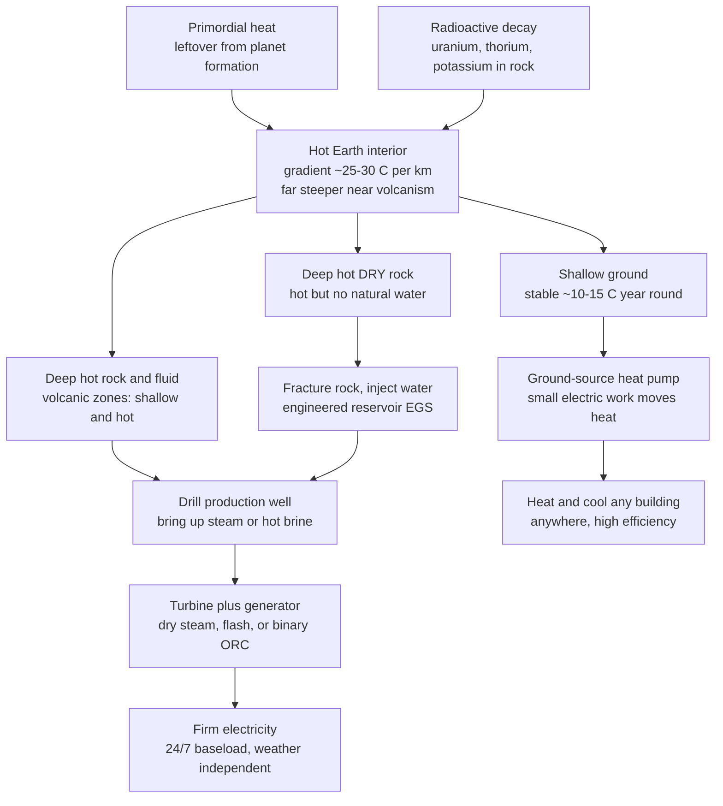

# 🌋 Geothermal Energy: The Planet's Furnace

> [!abstract] TL;DR
> The Earth beneath your feet is a colossal, slowly cooling store of heat — **primordial** warmth left over from the planet's fiery formation plus a steady trickle of **radioactive decay** in the rocks — leaking about **47 TW** to the surface. Geothermal energy taps that heat. Where the heat is close to the surface (volcanic hotspots like Iceland), you drill a well, scalding steam or hot brine rises, and it spins a turbine: clean electricity that runs **24/7 at ~90 percent capacity factor**, rain or shine, night or day. That **firmness** — dispatchable, weather-independent, always-on clean power — is geothermal's superpower and its key edge over intermittent solar and wind. Its historic limitation was **geography**: you needed to live somewhere volcanic. Two ideas break that limit. **Ground-source heat pumps** use the shallow ground's stable year-round temperature as a heat source and sink to heat and cool *any* building *anywhere*, at a coefficient of performance of 3 to 5. **Enhanced Geothermal Systems (EGS)** drill deep and hydraulically fracture **hot dry rock** to build an artificial reservoir, potentially unlocking the Earth's vast deep heat almost everywhere. The planet is a furnace; we are learning to plug into it.

## Intuition

**Analogy:** Picture the Earth as a giant ball bearing pulled from a forge and left to cool for four and a half billion years. The surface has long gone cold, but the inside is still glowing hot — partly leftover heat from when the ball was made, partly a slow internal fire of radioactive atoms that keeps topping it up. That heat is *constantly* seeping outward. In most places the warmth is buried kilometres deep, so you barely feel it. But in volcanic hotspots the fire is close to the skin: drill a shallow well and out comes steam ready to do work. Because the ball's inner fire never flickers — it does not care whether the sun is up or the wind is blowing — the power you draw from it is rock-steady, all day, every day.

That "always-on" quality is the whole point. Solar dies at night, wind stalls when the air goes calm, but the Earth's heat is *firm*: a plug you can rely on around the clock. And you do not even need a volcano to benefit. A few metres down, the ground stays at a mild, constant temperature all year — cooler than a summer afternoon, warmer than a winter night — so a **heat pump** can lean on that stable ground to heat your house in January and cool it in July, far more efficiently than fighting the outside air. Geologists tap the deep fire for power; heat pumps tap the shallow calm for comfort; and engineers drilling into hot dry rock are trying to make the deep fire available to everyone.

---

## How It Works

### Core Mechanics

1. **The resource — a planet full of heat.** Earth's interior is hot from two sources: **primordial heat** (gravitational energy of accretion and core formation, released 4.5 billion years ago) and ongoing **radiogenic heat** (decay of long-lived $^{238}$U, $^{235}$U, $^{232}$Th, $^{40}$K). Together they push roughly **47 TW** out through the surface — dwarfing humanity's ~18 TW of total power use, though spread thin over the whole planet.

2. **The geothermal gradient.** Temperature rises with depth at an average of **~25 to 30 °C per kilometre** in continental crust. Near plate boundaries, volcanism, and hotspots the gradient is far steeper — often 50 to 100+ °C/km — so a useful temperature is reached at shallow, cheap-to-drill depth. This is why geography historically decided who got geothermal power.

3. **Electricity generation — three plant types.** In high-temperature (usually volcanic) fields you drill production wells and use the rising fluid to run a turbine:
   - **Dry steam** — the reservoir yields dry, superheated steam that goes straight to the turbine (the oldest and simplest type; Larderello, The Geysers).
   - **Flash steam** — high-pressure hot brine (>180 °C) is depressurised so part of it "flashes" to steam that drives the turbine; the brine is reinjected. The most common modern type.
   - **Binary (Organic Rankine Cycle)** — lower-temperature fluid (~100 to 180 °C) heats a secondary working fluid with a low boiling point (isobutane, isopentane) through a heat exchanger; that fluid vaporises and drives the turbine. Binary opens up moderate-temperature resources and keeps corrosive brine sealed underground.

4. **Firm, baseload power.** Unlike solar and wind, a geothermal plant runs continuously at a **capacity factor near 90 percent**, independent of weather or time of day. It is **dispatchable** — controllable, always-on clean power — which makes it uniquely valuable as intermittent renewables grow.

5. **Direct use and heat pumps — geothermal for everyone.**
   - **Direct use**: piping naturally hot water for district heating, greenhouses, aquaculture, industrial drying, and spas — no turbine required.
   - **Ground-source (geothermal) heat pumps**: a few metres down, ground temperature is stable year-round (~10 to 15 °C in temperate zones). A heat pump uses a small amount of electrical work to *move* heat between a building and this stable ground, delivering 3 to 5 units of heating or cooling per unit of electricity. Crucially this works **anywhere**, not just volcanic areas — a major, underappreciated efficiency technology.

6. **The frontier — Enhanced Geothermal Systems (EGS).** Most of the planet is hot but **dry** at depth: hot rock with no natural water or permeability. EGS drills deep, then **hydraulically fractures** the hot dry rock to create an artificial reservoir, injects water down one well, lets it heat up in the fractures, and produces superheated fluid from another. This could unlock geothermal **almost everywhere**, vastly expanding the resource. Related frontiers include **super-hot / supercritical** wells (very deep, very high energy density) and **closed-loop / advanced geothermal (AGS)**, which circulate fluid through sealed underground pipes with no fracturing.

### Flow / Architecture



---

## Key Concepts

### Secondary (intuitive foundation)

- **The Earth is a stored furnace.** Its interior is hot from the planet's birth plus a slow internal fire of radioactive decay. That heat constantly leaks toward the cold surface.
- **The deeper you go, the hotter it gets** — the **geothermal gradient**, about 25 to 30 °C for every kilometre down, and much steeper near volcanoes.
- **In volcanic places you can drill for steam.** Bring up steam or hot water, spin a turbine, and make clean electricity — the way Iceland does.
- **Geothermal is always on.** It runs day and night, in any weather, at roughly 90 percent of full output. That is its biggest advantage over sun and wind, which come and go. It is **firm** power.
- **Heat pumps work anywhere.** Just below the surface the ground stays a mild, steady temperature all year. A ground-source heat pump uses that stable ground to heat your home in winter and cool it in summer, very efficiently — no volcano needed.
- **Cracking hot dry rock (EGS)** could let us drill deep and make geothermal work far beyond volcanic regions, tapping the Earth's enormous deep heat.

### Undergraduate (the working relations)

- **Geothermal gradient and heat flow.** The temperature rise with depth is $dT/dz$; conductive heat flux follows **Fourier's law** $q = -k\,dT/dz$, with rock conductivity $k \approx 2$ to $4\ \mathrm{W\,m^{-1}\,K^{-1}}$. Elevated gradients (volcanism, thin crust, magma at depth) let you reach power temperatures at shallow depth — the single biggest driver of a site's economics.
- **Resource temperature classes → plant type.** Very hot dry steam → **dry-steam** plant; hot brine >180 °C → **flash** (single or double flash); moderate 100 to 180 °C → **binary / Organic Rankine Cycle**. Lower resource temperature means lower Carnot-limited efficiency, so binary plants are less efficient per unit of heat but tap a far larger resource.
- **Capacity factor and baseload.** $\text{CF} = \dfrac{\text{energy produced}}{\text{nameplate} \times \text{hours}}$. Geothermal delivers **CF ≈ 0.90**, versus ~0.35 for wind and ~0.20 to 0.25 for solar PV. High CF plus dispatchability makes geothermal **firm** capacity, worth more to a grid than the same nameplate of intermittent generation.
- **Heat-pump coefficient of performance.** A ground-source heat pump's heating COP is $\text{COP}_h = \dfrac{Q_{\text{delivered}}}{W_{\text{compressor}}}$, bounded by Carnot $\text{COP}_{h,\text{Carnot}} = \dfrac{T_h}{T_h - T_c}$. Because the stable ground stays warm in winter (larger $T_c$) and cool in summer (smaller $T_h$), the temperature lift $T_h - T_c$ is *smaller* than for an air-source unit fighting extreme outside air — so COP is higher and steadier year-round (typically 3 to 5 versus 2 to 3 for air-source in cold weather).
- **Reinjection.** Spent geofluid is pumped back into the reservoir to maintain pressure, dispose of dissolved salts and gases, and sustain the resource. A geothermal field is a managed **injection/production doublet**, not a bottomless well.

### Graduate (systems, frontier, and limits)

- **Enhanced Geothermal Systems (EGS).** Hydraulic stimulation opens or shears fractures in hot dry rock to create permeability. Key design variables: **reservoir surface area** for heat exchange, **flow impedance** between wells, **thermal drawdown** rate (how fast produced temperature falls as the near-well rock cools), and **water loss** to the formation. The economic prize is enormous — the deep hot-rock resource dwarfs conventional hydrothermal fields — but sustained, low-impedance, low-seismicity reservoirs remain hard to engineer.
- **Induced seismicity.** Fluid injection raises pore pressure and can unclamp faults, triggering earthquakes — the failure that shut down the Basel (2006) and Pohang (2017, $M_w$ 5.5) projects. Managing it requires traffic-light protocols, careful injection-rate control, and avoiding critically stressed faults. See [[Induced_Seismicity_and_Georesource_Geophysics]].
- **Resource sustainability.** Geothermal is renewable on management timescales *if not over-pumped*: extract heat faster than it conducts in from surrounding rock and the local reservoir cools (thermal drawdown, "breakthrough"). Fields are managed for decades of sustainable output with reinjection, not treated as inexhaustible.
- **Fluid chemistry.** Geofluids carry dissolved silica, carbonates (scaling), chlorides (corrosion), and **non-condensable gases** ($\mathrm{CO_2}$, $\mathrm{H_2S}$). This drives materials selection, scale inhibition, and emissions handling; projects like **Carbfix** in Iceland reinject $\mathrm{CO_2}$ and $\mathrm{H_2S}$ back into basalt where they mineralise.
- **Thermodynamics of low-grade conversion.** Binary/ORC plants operate across a modest temperature difference, so the exergy of the geofluid is limited and second-law efficiency is low; working-fluid selection and heat-exchanger design (pinch, dry vs wet cooling) dominate performance.
- **Frontier concepts.** **Super-hot / supercritical** wells (e.g. Iceland Deep Drilling Project, ~450 to 600 °C) promise an order-of-magnitude more power per well. **Closed-loop / advanced geothermal (AGS)** circulates fluid through sealed underground pipe loops — no fracturing, so far less seismicity and no water loss — at the cost of conduction-limited heat capture. Modern EGS increasingly borrows **horizontal drilling and multi-stage fracturing** from the shale industry to raise reservoir contact area.
- **Grid role.** In a high-variable-renewables system geothermal supplies **firm, dispatchable** clean energy and capacity value that complements solar and wind, reducing the storage and overbuild needed to keep the lights on — a role otherwise filled by gas or nuclear.

---

## Python Demo

```python
# Geothermal energy — two figures that capture the whole story:
# (a) THE GEOTHERMAL GRADIENT: temperature vs depth for typical crust vs a
#     volcanic zone, with the temperature thresholds for heat pumps, direct
#     use, binary (ORC) power, and flash/dry-steam power. Shows WHY volcanic
#     regions reach power temperatures at far shallower (cheaper) depth.
# (b) FIRM BASELOAD vs WEATHER: one week of output for geothermal (flat ~90%
#     capacity factor) versus solar PV and wind — geothermal's "always-on"
#     superpower made visible.
import numpy as np
import matplotlib.pyplot as plt

fig, (ax1, ax2) = plt.subplots(1, 2, figsize=(14, 5.5))

# ---------------------------------------------------------------------------
# (a) GEOTHERMAL GRADIENT: temperature vs depth
# ---------------------------------------------------------------------------
Ts = 15.0                             # surface temperature, deg C
depth = np.linspace(0, 6, 300)        # km
grad_normal, grad_volcanic = 28.0, 90.0   # deg C per km
T_normal   = Ts + grad_normal   * depth
T_volcanic = Ts + grad_volcanic * depth

ax1.plot(T_normal,   depth, lw=2.5, color="#2a6f97", label="Typical crust  ~28 C/km")
ax1.plot(T_volcanic, depth, lw=2.5, color="#d00000", label="Volcanic zone  ~90 C/km")

# useful-temperature thresholds for each geothermal use
thresholds = [(90, "direct use / district heat", "#e07b39"),
              (150, "binary ORC power",          "#8338ec"),
              (220, "flash / dry-steam power",    "#c1121f")]
for T_need, label, col in thresholds:
    ax1.axvline(T_need, color=col, ls=":", lw=1.4)
    ax1.text(T_need + 3, 5.7, label, rotation=90, va="bottom", ha="left",
             fontsize=7.5, color=col)

# depth at which each curve reaches the 220 C flash threshold (drilling cost)
for grad, col, name in [(grad_volcanic, "#d00000", "volcanic"),
                        (grad_normal,  "#2a6f97", "typical")]:
    d_flash = (220 - Ts) / grad
    if d_flash <= 6:
        ax1.scatter([220], [d_flash], color=col, s=60, zorder=5)
        ax1.annotate(f"{d_flash:.1f} km", (220, d_flash),
                     textcoords="offset points", xytext=(7, -3),
                     fontsize=8, color=col, fontweight="bold")
    else:
        print(f"  {name} crust reaches 220 C at {d_flash:.1f} km (off-chart, "
              f"far deeper -> much costlier to drill)")

# heat-pump zone: shallow, thermally stable ground
ax1.axhspan(0, 0.2, color="#00b894", alpha=0.30)
ax1.text(150, 0.11, "heat-pump zone: shallow stable ground (any region)",
         fontsize=7.5, color="#00796b", va="center")

ax1.set_xlim(0, 320)
ax1.set_ylim(6, 0)                    # invert: depth increases downward
ax1.set_xlabel("Temperature  [deg C]")
ax1.set_ylabel("Depth  [km]")
ax1.set_title("(a) Geothermal gradient:\nvolcanic zones reach power temps far shallower")
ax1.legend(loc="lower left", fontsize=8)
ax1.grid(alpha=0.3)

# ---------------------------------------------------------------------------
# (b) FIRM BASELOAD vs WEATHER-DEPENDENT OUTPUT (one week, hourly)
# ---------------------------------------------------------------------------
rng   = np.random.default_rng(42)
hours = np.arange(168)                # one week
tod   = hours % 24                    # hour of day

# geothermal: flat, firm ~90% capacity factor (tiny operational wobble)
geo = np.clip(0.90 + 0.01 * rng.standard_normal(hours.size), 0, 1)

# solar PV: diurnal daylight bump scaled by daily cloudiness
daylight = np.clip(np.sin((tod - 6) / 12 * np.pi), 0, None)
cloud    = np.repeat(0.4 + 0.6 * rng.random(8), 24)[:hours.size]
solar    = daylight * cloud * 0.85

# wind: volatile, mean ~0.35 (smoothed noise -> gusty multi-hour swings)
wind = np.convolve(rng.random(hours.size), np.ones(9) / 9, mode="same")
wind = np.clip(0.10 + wind * 0.5, 0.02, 0.95)

ax2.plot(hours, geo   * 100, lw=2.5, color="#c1121f",
         label=f"Geothermal   avg {geo.mean()*100:.0f}%")
ax2.plot(hours, solar * 100, lw=1.8, color="#f9a825",
         label=f"Solar PV     avg {solar.mean()*100:.0f}%")
ax2.plot(hours, wind  * 100, lw=1.8, color="#2a9d8f",
         label=f"Wind         avg {wind.mean()*100:.0f}%")
ax2.axhline(geo.mean() * 100, color="#c1121f", ls=":", lw=1)
ax2.set_xlim(0, 167)
ax2.set_ylim(0, 100)
ax2.set_xlabel("Hour of the week")
ax2.set_ylabel("Capacity factor  [percent of nameplate]")
ax2.set_title("(b) Geothermal is FIRM:\nflat 24/7 output vs weather-driven solar and wind")
ax2.legend(loc="upper right", fontsize=8)
ax2.grid(alpha=0.3)

plt.tight_layout()
plt.savefig("geothermal_energy.png", dpi=120)
plt.show()

print(f"\nCapacity factors over the week:")
print(f"  geothermal {geo.mean()*100:5.1f}%   solar {solar.mean()*100:5.1f}%   "
      f"wind {wind.mean()*100:5.1f}%")
print("Geothermal delivers steady round-the-clock power; solar and wind do not.")
```

Running this produces the two panels. **Panel (a)** shows why geography mattered: to reach the ~220 °C needed for a flash/dry-steam plant, a **volcanic gradient (~90 °C/km) gets there at about 2.3 km**, while typical crust (~28 °C/km) does not reach it until ~7.3 km — far deeper and dramatically more expensive to drill. The shaded shallow band marks the **heat-pump zone**, whose stable ground temperature is available in *any* region. **Panel (b)** is geothermal's thesis in one picture: its output is a flat ~90 percent line all week, while solar collapses every night and wind swings unpredictably — the firmness that makes geothermal a uniquely valuable complement to intermittent renewables.

---

## Real-World Applications

> **Example — Iceland.** Straddling the Mid-Atlantic Ridge with magma near the surface, Iceland has an extraordinarily steep geothermal gradient. Flash and binary plants such as **Hellisheiði** and **Krafla** supply roughly a quarter of the nation's electricity, while direct-use district-heating networks warm about **90 percent of Icelandic homes** — the world's cleanest, cheapest space heating. It is the textbook demonstration of a country plugging directly into the planet's furnace; the co-located **Carbfix** project even mineralises the plant's $\mathrm{CO_2}$ and $\mathrm{H_2S}$ back into basalt.

- **The Geysers, California** — the world's largest geothermal field, a rare **dry-steam** resource generating ~700 MW; reinjection of treated wastewater sustains reservoir pressure.
- **Larderello, Italy** — the birthplace of geothermal power (first electricity from steam in 1904, first commercial plant 1913), still operating on dry steam a century later.
- **Olkaria, Kenya** — flash plants on the East African Rift now supply a large and growing share of Kenya's grid, showing geothermal's role for firm, clean baseload in a developing economy. New Zealand (Wairakei, the first flash plant), the Philippines, and Indonesia run comparable rift/volcanic-arc fields.
- **Ground-source heat pumps** — millions of installations worldwide (large fleets in the US, Sweden, and Switzerland) heat and cool buildings **anywhere**, leaning on stable shallow-ground temperature for COP 3 to 5 — the most broadly deployable form of "geothermal."
- **EGS demonstrations** — **Soultz-sous-Forêts** (France) proved the concept in granite; the US DOE's **Utah FORGE** is a dedicated EGS field laboratory; and **Fervo Energy** has used horizontal drilling and multi-stage fracturing borrowed from shale to hit commercial-scale flow rates in Nevada and Utah — the clearest sign yet that EGS could take geothermal far beyond volcanic regions.

---

## Common Pitfalls

- **Assuming geothermal only works in volcanic areas.** True for conventional *hydrothermal power*, but **ground-source heat pumps** work anywhere, and **EGS** aims to unlock hot dry rock almost everywhere. Conflating "conventional geothermal power" with "all geothermal" badly undersells the resource.
- **Confusing heat pumps with deep geothermal power.** A ground-source heat pump moves low-grade heat for building comfort using a shallow loop; a geothermal power plant taps a deep high-temperature reservoir to spin a turbine. Different depths, temperatures, technologies, and scales — do not use one's numbers for the other.
- **Ignoring induced seismicity.** Fluid injection into fractured rock raises pore pressure and can trigger earthquakes; this ended the Basel and Pohang projects. EGS must site away from critically stressed faults and use traffic-light injection protocols.
- **Treating the resource as infinitely renewable.** Over-pump a field and the local reservoir cools faster than heat conducts back in (thermal drawdown / breakthrough). Sustainable output requires reinjection and pumping within the field's natural heat-recharge rate.
- **Overlooking fluid chemistry.** Geofluids scale (silica, carbonate), corrode (chlorides), and carry non-condensable gases ($\mathrm{CO_2}$, $\mathrm{H_2S}$). Ignoring chemistry wrecks equipment and understates emissions and disposal costs.
- **Underestimating drilling cost and risk.** Drilling is the dominant, up-front, non-recoverable cost, and it rises steeply with depth; a dry or under-productive well can sink a project. Resource risk, not turbine technology, is geothermal's main financing barrier.
- **Judging geothermal by nameplate, not capacity factor.** Its value lies in being **firm** — ~90 percent capacity factor and dispatchable. Comparing MW of geothermal to MW of solar ignores that a geothermal megawatt shows up around the clock.
- **Assuming geothermal is strictly zero-emission.** Reservoirs release some $\mathrm{CO_2}$ and $\mathrm{H_2S}$; emissions are far below fossil plants but not always zero. Reinjection and mineralisation (Carbfix) close much of the gap.

---

## Related Concepts

- [[Earths_Internal_Heat_and_Geothermal_Gradient]] — the resource itself: primordial plus radiogenic heat, the ~47 TW budget, and the geothermal gradient this note exploits.
- [[Terrestrial_Heat_Flow_and_Thermal_Evolution]] — the geophysics of how that heat conducts and convects to the surface, setting where high-gradient resources occur.
- [[Power_and_Refrigeration_Cycles]] — the Rankine cycle behind steam turbines, the Organic Rankine Cycle behind binary plants, and the refrigeration cycle (run in reverse) that is the ground-source heat pump.
- [[Induced_Seismicity_and_Georesource_Geophysics]] — the injection-triggered earthquakes that are EGS's central risk, and how they are monitored and managed.
- [[Laws_of_Thermodynamics]] — the Carnot limit that caps geothermal turbine efficiency and sets the ceiling on heat-pump COP; the second law drives all the heat outflow.
- [[Conduction_Heat_Transfer]] — Fourier conduction governs the geothermal gradient, reservoir thermal drawdown, and closed-loop heat capture.
- [[Convection_and_Radiation]] — convection and advection carry heat within reservoirs and across heat exchangers in binary plants and heat pumps.
- [[Plate_Boundaries_and_Plate_Motions]] — why steep gradients and shallow magma cluster at plate boundaries and hotspots, the prime hydrothermal sites.
- [[Mantle_Convection_and_Hotspots]] — the deep engine that brings heat near the surface in hotspots such as Iceland and Yellowstone.
- [[Volcanism_and_Volcanic_Hazards]] — the shallow magma bodies that make the highest-grade geothermal fields possible.

Within the Energy Systems vault this note is the *firm renewable* among its Renewable Energy siblings: it complements the weather-dependent output of Solar Photovoltaics and the variable, water-driven Hydropower and Marine Energy by supplying always-on baseload; its high-grade steam feeds the same turbine logic as Cogeneration and District Energy (a prime clean heat source for district networks); it pairs naturally with Thermal and Chemical Energy Storage to firm up a low-carbon grid; and ground-source heat pumps are a workhorse of Sector Coupling and Electrification of heat — all referenced here in prose because they are neighbouring section notes.

---

## Review Questions

1. **(Secondary)** Why can a geothermal power plant keep producing electricity at 3 a.m. in a snowstorm when a solar farm cannot? Explain where the heat comes from and what "firm" or "baseload" power means — then explain how a ground-source heat pump lets a house in a non-volcanic region still benefit from the ground's heat.
2. **(Undergraduate)** A region has a geothermal gradient of 30 °C/km and a surface temperature of 15 °C. (i) At what depth does the rock reach the ~150 °C needed for a binary (ORC) plant? (ii) A volcanic field nearby has a gradient of 90 °C/km — at what depth does *it* reach 150 °C, and why does that difference dominate the economics? (iii) Given geothermal's ~90 percent capacity factor versus wind's ~35 percent, explain why comparing the two by nameplate megawatts alone is misleading.
3. **(Graduate)** Enhanced Geothermal Systems promise to make geothermal available almost everywhere by fracturing hot dry rock. Explain the mechanism, then discuss the three hardest engineering and social constraints — induced seismicity, thermal drawdown, and drilling cost/risk — and how each has shaped real projects (e.g. Basel, Pohang, Fervo, Utah FORGE). Where does closed-loop (AGS) sit in this trade-space?

---

## Sources

- R. DiPippo — *Geothermal Power Plants: Principles, Applications, Case Studies and Environmental Impact*, 4th ed. (Butterworth-Heinemann, 2016) — the standard reference on dry-steam, flash, and binary plant design. [Publisher](https://www.elsevier.com/books/geothermal-power-plants/dipippo/978-0-08-100879-9)
- J. Tester, E. Drake, M. Driscoll, M. Golay & W. Peters — *Sustainable Energy: Choosing Among Options*, 2nd ed. (MIT Press, 2012); Tester led the MIT "The Future of Geothermal Energy" EGS study. [Publisher](https://mitpress.mit.edu/9780262017473/sustainable-energy/)
- D. J. C. MacKay — *Sustainable Energy — Without the Hot Air* (UIT Cambridge, 2009), Ch. 16 (Geothermal). [Free online](https://www.withouthotair.com/)
- IRENA — *Geothermal Energy* technology and outlook analyses. [IRENA Geothermal](https://www.irena.org/Energy-Transition/Technology/Geothermal-energy)
- IEA — *Geothermal* tracking and analysis. [IEA Geothermal](https://www.iea.org/energy-system/renewables/geothermal)

---

#energy-systems #geothermal #baseload #heat-pumps #enhanced-geothermal
