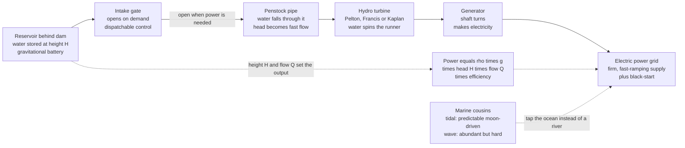

# 💧 Hydropower and Marine Energy: The Dispatchable Giant of Renewables, Plus the Ocean's Untapped Motion

> [!abstract] TL;DR
> Hydropower is the **oldest trick in the renewable book** — let falling water do the work. Dam a river and the water piled up behind the dam becomes a **charged battery of gravity**: release it down a pipe through a turbine, and the weight of falling water spins a generator into life. The power it delivers depends on just **two things you can picture directly** — how **far** the water falls (the *head*, $H$) and how **much** flows per second (the *flow*, $Q$) — combined in one clean equation, $P = \rho\,g\,H\,Q\,\eta$. Hydropower is the **giant of renewables**: it still generates **more clean electricity than all solar and wind combined**, and unlike them it is **dispatchable** — open the gates when you need power, close them when you don't — which makes it the grid's most valuable **flexible, fast-ramping, black-start** clean resource. Its costs are geography (you need rivers and topography) and ecology (blocked fish, drowned valleys, reservoir methane, sediment starvation, drought risk). Its ocean-going cousins try to tap the sea's motion: **tidal** energy is driven by the moon and so is *utterly predictable* but geographically confined and costly, while **wave** energy is a *vast, energy-dense resource* that remains stubbornly hard and expensive to harness. The unifying fact: **water is heavy, and heavy things falling or moving carry a lot of energy.**

## Intuition

**Analogy:** Hydropower is the oldest trick in the renewable book — **let falling water do the work**. Watermills have ground grain this way for two thousand years. Dam a river, and the lake piled up behind the dam is like a **charged battery made of gravity**: every tonne of water sitting up there is stored energy, just waiting to fall. Open a gate at the bottom and let that water rush down through a spinning wheel — a turbine — and the sheer **weight of the falling water turns the wheel**, which turns a generator, which turns out electricity. Nothing is burned; nothing is heated; the sun already did the work of lifting that water into the clouds and dropping it as rain on the high ground.

Now picture what sets the power. Two things, and only two, that you can feel in your hands. First, **how far the water falls** — the height, or *head*: a trickle off a tall cliff hits hard; the same trickle over a low step barely nudges the wheel. Second, **how much water flows** each second — a garden hose versus a burst dam. Multiply the two and you have the power. That is the whole secret: **head times flow**. And here is hydropower's superpower over its glamorous cousins solar and wind: the reservoir is a **battery you control**. The sun sets and the wind drops on their own schedule, but you can **open the gates the instant the grid needs power and close them the instant it doesn't** — hydropower is *dispatchable*, the flexible clean muscle that balances everything else. Out at sea, engineers chase the same idea in two harder forms: the **tides**, which rise and fall like clockwork because the **moon** pulls them — so predictable you can print a timetable years ahead — and the **waves**, a huge, restless store of energy that is maddeningly difficult and expensive to capture. In every case the lesson is the same: **water is heavy, and heavy things falling or moving carry a lot of energy.**

---

## How It Works

### Core Mechanics

1. **Store gravitational energy as height.** A dam raises the water level, so a mass $m$ of water sits at an elevation $H$ (the **head**) above the turbine. It holds gravitational potential energy $E = m g H$. The reservoir is literally an **energy store measured in metres of drop times tonnes of water** — a battery whose "charge" is the volume held behind the wall.

2. **Convert head into fast-moving water.** Open the intake and water pours down a large pipe — the **penstock**. As it descends, potential energy trades for kinetic energy exactly as in a falling body (this is Bernoulli's principle at work): pressure and speed build so that by the bottom the water is a concentrated, high-energy jet or high-pressure flow.

3. **Spin a turbine.** The moving water drives a **hydro turbine** — a bladed runner sized to the site. The turbine converts the water's energy into rotating shaft power. Three families dominate, chosen by the head-and-flow combination: **Pelton** wheels (impulse turbines) for *very high head, low flow* mountain sites; **Francis** turbines (reaction) for the broad *medium head, medium flow* middle ground; and **Kaplan** turbines (adjustable-blade propellers) for *low head, high flow* rivers.

4. **Generate electricity.** The turbine shaft turns a **synchronous generator**, producing grid-frequency AC. Because a hydro generator is directly coupled to the grid and can start from a standstill unaided, hydro plants also provide **black-start** capability — restarting a collapsed grid from zero.

5. **The two levers, in one equation.** The available electrical power is
$$P = \rho\, g\, H\, Q\, \eta,$$
where $\rho \approx 1000\ \text{kg/m}^3$ is water density, $g = 9.81\ \text{m/s}^2$, $H$ is the net head (m), $Q$ is the volumetric flow ($\text{m}^3/\text{s}$), and $\eta \approx 0.85\text{–}0.92$ is the overall turbine-generator efficiency. **Head and flow are the only two knobs** — a giant dam wins on head, a mighty river wins on flow, and the largest plants win on both.

6. **Dispatch on demand.** Crucially, a reservoir plant decouples *when the rain fell* from *when the power is used*. Operators **open the gates to ramp up in seconds to minutes** at the evening peak and **close them to bank the water** when demand is low. This dispatchability — plus fast ramping and grid-balancing services — is what makes hydro uniquely valuable among renewables. **Run-of-river** plants lack big storage and must follow the river's natural flow; **pumped storage** (covered separately) actively pumps water uphill to store surplus grid energy — the grid's dominant battery.

7. **The marine cousins.** The same "moving water spins a turbine" idea reaches into the ocean. **Tidal** schemes capture the *predictable* rise and fall driven by the moon and sun — either a **barrage** that traps a high tide behind a wall and releases it through turbines (potential energy, $E \propto \text{range}^2$), or **tidal-stream turbines** planted in fast tidal currents like underwater wind turbines (kinetic energy, $P \propto v^3$). **Wave** devices harvest the up-and-down and back-and-forth of surface waves — a larger, more energy-dense but far harsher and less predictable resource still stuck in the pilot stage.

### Flow / Architecture



---

## Key Concepts

### Secondary Level

- **Falling water spins a wheel.** A dam holds a lake high up; let that water fall down a pipe and it turns a turbine wheel connected to a generator that makes electricity. The sun lifted the water as rain, so the "fuel" is free and clean.
- **Two things set the power: how far it falls and how much flows.** A tall drop (*head*) or a big flood of water (*flow*) both mean more power. A giant dam has both, so it makes a lot of electricity.
- **Hydropower is the biggest renewable.** It makes **more clean electricity than all the world's solar panels and wind turbines put together** — it is mature, cheap, and lasts for a century.
- **You can turn it on and off.** Unlike the sun and wind, you *control* a dam: open the gates for power at the evening peak, close them to save water for later. That control makes hydro the grid's most flexible clean resource, and it can even restart a blacked-out grid.
- **It has real downsides.** Dams flood valleys and homes, block fish from swimming upstream, trap the mud rivers carry, and can dry up in a drought. You also need the right geography — a river and a hillside.
- **The ocean has energy too.** The **tides** rise and fall like clockwork because the **moon** pulls the sea — so predictable you can print the timetable years ahead. **Waves** carry huge energy but are messy and hard to capture. Both are early, expensive technologies compared with river hydropower.

### Undergraduate Level

- **The governing equation.** $P = \rho g H Q \eta$. Because hydropower is **not a heat engine**, it *sidesteps the Carnot limit entirely* — well-designed turbines reach **85–92%** efficiency, far above any thermal plant. The only losses are friction (penstock head loss), turbine hydraulics, and generator/copper losses.
- **Turbine selection by specific speed.** The dimensionless **specific speed** $N_s = N\sqrt{P}/H^{5/4}$ picks the machine: **Pelton** (impulse, low $N_s$) for high head (hundreds of metres) and low flow; **Francis** (reaction, mid $N_s$) for the huge medium-head middle ground; **Kaplan/propeller** (high $N_s$) for low head (a few metres) and large flow. Choosing wrongly cripples efficiency.
- **Plant types.** *Reservoir/storage* (a large impoundment gives energy storage and full **dispatchability**), *run-of-river* (minimal storage, output follows the natural hydrograph, less flexible but less disruptive), and *pumped storage* (two reservoirs; pump uphill to store, release to generate — the grid's dominant energy storage, treated separately).
- **Capacity factor and firm capacity.** Hydro capacity factors vary widely (20–60%) with hydrology, but the *value* lies less in energy volume than in **firm, dispatchable capacity** and ancillary services: frequency regulation, spinning reserve, voltage support, and black-start.
- **Tidal barrage vs tidal stream.** A **barrage** exploits the tidal *range*: potential energy per cycle scales as $E \propto A\,R^2$ (basin area $A$, range $R$) — so it favours a few sites with exceptionally large ranges (Bay of Fundy, Severn, Rance). A **tidal-stream turbine** exploits the tidal *current*: like a wind turbine underwater, $P \propto \rho A v^3$, but seawater is ~800× denser than air, so modest currents carry large power.
- **Wave energy basics.** The power crossing a metre of wave crest is $P \approx \frac{\rho g^2}{64\pi} H_s^2 T_e$ (per metre of crest), scaling with the *square* of significant wave height $H_s$ and linearly with energy period $T_e$. Good coastlines carry **30–70 kW/m** — abundant, but the resource is stochastic (weather-driven, unlike tides) and the marine environment is punishing.
- **Environmental accounting.** Hydro is low-carbon but **not zero-carbon**: flooded vegetation in warm reservoirs decays anaerobically to emit **methane**; dams block **fish migration** and **sediment transport** (starving downstream deltas), alter thermal and flow regimes, and displace communities. These are the real trade-offs against the clean, dispatchable output.

### Graduate Level

- **Head-loss and system design.** Net head is gross head minus penstock friction loss, $h_f = f\frac{L}{D}\frac{v^2}{2g}$ (Darcy–Weisbach). Sudden gate closure causes **water hammer** — pressure transients ($\Delta p = \rho a \Delta v$, with $a$ the pressure-wave speed) that can burst pipes; **surge tanks** and controlled valve timing tame them. Optimising penstock diameter trades pipe cost against friction loss over a century of operation.
- **Cavitation and the Thoma number.** Reaction turbines (Francis, Kaplan) suffer **cavitation** when local pressure drops below vapour pressure, imploding bubbles that pit runners and erode efficiency. The **Thoma cavitation coefficient** $\sigma = (H_{atm} - H_{vap} - H_s)/H$ constrains the draft-tube/setting elevation; the plant of a low-head Kaplan may sit *below* tailwater level to keep $\sigma$ safe.
- **Dispatch optimisation.** Reservoir operation is a stochastic-dynamic-programming problem: allocate a finite water "budget" across time to maximise value while honouring flood control, irrigation, navigation, environmental (minimum ecological) flows, and hydrological uncertainty. The **water value** (shadow price of stored water) links each cubic metre to the marginal electricity price it can displace — the reason hydro is the *swing* producer that balances variable renewables.
- **Reservoir greenhouse gases and lifetime.** Tropical reservoirs can be significant **biogenic methane** sources (decaying flooded biomass, plus degassing at turbines/spillways); lifecycle emissions vary from near-nil (cold, steep, small-footprint) to comparable-to-gas (large, shallow, tropical). **Sedimentation** progressively fills reservoirs, capping useful life (decades to centuries) and forcing sediment-management or dam decommissioning; downstream **sediment starvation** drives delta subsidence and coastal erosion.
- **Tidal-stream limits and arrays.** Free-stream turbines face a Betz-like efficiency ceiling, but in a *constrained channel* the extractable power depends on the whole basin's dynamics — over-extraction reduces the very tidal flux it feeds on, so array-scale resource assessment must couple turbine drag back into the tidal hydrodynamics. Two-way (flood-and-ebb) barrage generation, sluicing, and pumping schedules further optimise energy capture against the $R^2$ range dependence.
- **Wave-device physics and survivability.** Point absorbers, oscillating water columns (OWCs), attenuators, and overtopping devices each tune to the spectral peak; the engineering tension is between **resonant capture width** (which wants a compliant, responsive device) and **survivability** in 100-year storm waves that carry orders of magnitude more force than the design sea state. This mismatch — plus corrosion, biofouling, and mooring loads — keeps wave energy pre-commercial with high LCOE.
- **Systems role and climate vulnerability.** In a high-renewables grid, hydro is the premier **flexibility and firming** asset — but it is **climate-exposed**: shifting precipitation, snowpack loss, and prolonged drought degrade both energy and firm capacity, precisely when heat-driven demand peaks. Marine energy (especially phase-diverse tidal streams around a coastline) offers *predictable, weather-decorrelated* generation that can complement wind and solar, but at present cost and scale it remains a niche within the renewable portfolio.

---

## Python Demo

```python
# Hydropower and marine energy:
#   (a) THE TWO LEVERS -- power P = rho*g*H*Q*eta over the head-flow plane,
#       spanning micro-hydro to the largest dams on Earth.
#   (b) DISPATCHABILITY -- a reservoir plant SHAPES its output to follow demand,
#       while run-of-river can only deliver a flat, fixed inflow.
#   (c) TIDAL PREDICTABILITY -- power tracks tidal-range squared, giving a clean,
#       clockwork spring-neap cycle you can forecast years ahead.
# numpy + matplotlib only.
import numpy as np
import matplotlib.pyplot as plt

rho, g, eta = 1000.0, 9.81, 0.90     # water density, gravity, turbine-gen efficiency

def hydro_power_MW(H, Q, eff=eta):
    # P = rho * g * H * Q * eff, converted to megawatts
    return rho * g * H * Q * eff / 1e6

# ---- (a) the two levers: power over the head (m) x flow (m^3/s) plane ----
H = np.logspace(np.log10(2.0),  np.log10(800.0),   260)     # head, metres
Q = np.logspace(np.log10(0.5),  np.log10(40000.0), 260)     # flow, m^3/s
HH, QQ = np.meshgrid(H, Q)
logP = np.log10(hydro_power_MW(HH, QQ))                       # log10(MW)

# real plants: (head_m, flow_m3s, label)
plants = [(10.0,    15.0,   "micro / run-of-river\n~1 MW"),
          (180.0,   1100.0, "Hoover Dam\n~2 GW"),
          (80.0,    30000.0,"Three Gorges\n~22 GW"),
          (500.0,   5.0,    "high-head Pelton\n~22 MW")]

# ---- (b) dispatchability: reservoir hydro follows a double-peaked demand -
hours  = np.linspace(0, 24, 24*8)
demand = (1.00
          + 0.30*np.exp(-0.5*((hours - 8.0)/1.6)**2)     # morning peak
          + 0.55*np.exp(-0.5*((hours - 19.0)/1.8)**2)    # evening peak
          - 0.25*np.exp(-0.5*((hours - 3.5)/2.5)**2))    # overnight trough
demand *= 450.0                                           # scale to MW
ror       = np.full_like(hours, 260.0)                    # run-of-river: fixed inflow
reservoir = np.clip(demand - ror, 0.0, None)             # dispatchable hydro fills the gap

# ---- (c) tidal power: sum of M2 + S2 constituents -> spring-neap beat ----
days = np.linspace(0, 30, 30*72)
T_M2, T_S2 = 12.42/24.0, 12.00/24.0                       # tidal periods, in days
A_M2, A_S2 = 1.00, 0.35                                   # constituent amplitudes, m
elev  = A_M2*np.cos(2*np.pi*days/T_M2) + A_S2*np.cos(2*np.pi*days/T_S2)  # tide height
power = elev**2                                           # barrage power ~ range^2
power /= power.max()                                      # normalise to peak

# --------------------------------- plotting ------------------------------
fig = plt.figure(figsize=(17, 5.4))
fig.suptitle("Hydropower: head x flow sets the power, and a reservoir makes it "
             "dispatchable; tides are clockwork-predictable",
             fontsize=13, fontweight="bold")

# (a) head-flow power map
axA = fig.add_subplot(1, 3, 1)
levels = np.linspace(logP.min(), logP.max(), 22)
cf = axA.contourf(H, Q, logP, levels=levels, cmap="viridis")
cb = fig.colorbar(cf, ax=axA)
cb.set_label("power  [log10 MW]")
for Hp, Qp, lab in plants:
    axA.plot(Hp, Qp, "o", color="white", mec="black", ms=8)
    axA.annotate(lab, (Hp, Qp), textcoords="offset points", xytext=(6, 6),
                 fontsize=7.5, color="white",
                 bbox=dict(boxstyle="round,pad=0.2", fc="black", alpha=0.55))
axA.set_xscale("log"); axA.set_yscale("log")
axA.set_xlabel("head  H  [m]"); axA.set_ylabel("flow  Q  [m^3/s]")
axA.set_title("(a) The two levers: P = rho g H Q eta\nhead and flow both raise power")

# (b) dispatchability: stack run-of-river + reservoir to meet demand
axB = fig.add_subplot(1, 3, 2)
axB.stackplot(hours, ror, reservoir,
              labels=["run-of-river (fixed inflow)", "reservoir hydro (dispatchable)"],
              colors=["#7fb3d5", "#2874a6"], alpha=0.9)
axB.plot(hours, demand, "k--", lw=2.0, label="grid demand")
axB.set_xlabel("hour of day"); axB.set_ylabel("power  [MW]")
axB.set_xlim(0, 24); axB.set_ylim(0, demand.max()*1.15)
axB.set_title("(b) Dispatchable: the reservoir ramps\nto follow demand; ROR cannot")
axB.legend(loc="upper left", fontsize=7.5)
axB.grid(alpha=0.3)

# (c) tidal predictability: spring-neap cycle in the power
axC = fig.add_subplot(1, 3, 3)
axC.plot(days, power, lw=1.0, color="#117a65")
axC.fill_between(days, power, color="#117a65", alpha=0.25)
# mark a spring (large-range) and a neap (small-range) window
axC.axvspan(0.0, 1.0, color="#e67e22", alpha=0.18)
axC.axvspan(7.4, 8.4, color="#8e44ad", alpha=0.18)
axC.text(0.5, 1.03, "spring\n(big range)", ha="center", fontsize=7.5, color="#a04000")
axC.text(7.9, 0.55, "neap\n(small range)", ha="center", fontsize=7.5, color="#6c3483")
axC.set_xlabel("time  [days]"); axC.set_ylabel("tidal power  [normalised]")
axC.set_xlim(0, 30); axC.set_ylim(0, 1.15)
axC.set_title("(c) Tides are predictable:\npower ~ range^2, clockwork spring-neap")

plt.tight_layout(rect=[0, 0, 1, 0.92])
plt.show()

# ---------------------------- printed summary ----------------------------
print("Hydropower  P = rho*g*H*Q*eta   (eta = %.2f)" % eta)
for Hp, Qp, lab in plants:
    lab1 = lab.replace(chr(10), " ")
    print(f"  H={Hp:6.0f} m,  Q={Qp:8.0f} m^3/s  ->  P = {hydro_power_MW(Hp,Qp):9.1f} MW   [{lab1}]")
peak_MW = demand.max()
print(f"\nDispatch: demand peaks at {peak_MW:.0f} MW; run-of-river caps at 260 MW, "
      f"so reservoir hydro must supply up to {peak_MW-260:.0f} MW at the evening peak.")
print("Tidal: peak-to-neap power ratio ~ ((A_M2+A_S2)/(A_M2-A_S2))**2 = "
      f"{((A_M2+A_S2)/(A_M2-A_S2))**2:.1f}x  -- fully predictable from the moon.")
```

Running this prints each plant's power from the single equation and draws three panels. **Panel (a)** is the core idea: power over the **head-flow plane**, on log axes, with four real machines pinned on it — a ~1 MW run-of-river unit, a ~22 MW high-head Pelton, Hoover Dam (~2 GW, mostly *head*), and Three Gorges (~22 GW, mostly *flow*). The colour climbs toward the top-right corner, showing that **both levers, head and flow, multiply into power**. **Panel (b)** makes **dispatchability** tangible: a fixed run-of-river band sits flat while the **reservoir hydro ramps up and down to follow the double-peaked demand**, exactly filling the morning and evening peaks — the flexibility no fixed-inflow or weather-driven source can offer. **Panel (c)** shows **tidal predictability**: with power scaling as tidal-*range squared* and two constituents (M2 and S2) beating against each other, the output traces a clean **spring-neap cycle** every ~14.8 days — a curve you can forecast years ahead from lunar tables alone.

---

## Real-World Applications

> **Example — Norway's hydro-battery balancing a renewable Europe.** Norway generates **~90% of its electricity from hydropower**, much of it from deep-reservoir plants, and this fleet behaves like a continent-scale flexible battery. When wind surges across the North Sea and prices fall, Norwegian operators *hold water* behind their dams; when the wind drops and Germany or Britain needs power, they **open the gates and export within minutes** across HVDC interconnectors. Every mechanism in this note is on display: gravitational storage in the reservoirs, Francis and Pelton turbines matched to Norway's steep heads, ~90% conversion efficiency that beats any thermal plant, and above all **dispatchability** — the ability to firm up variable wind and solar on demand. It is the clearest illustration of why hydro's grid value exceeds its raw kilowatt-hours.

- **The giant baseload-and-balancing dams.** *Three Gorges* (China, ~22.5 GW — the largest power station on Earth), *Itaipú* (Brazil/Paraguay, ~14 GW), and *Hoover Dam* (USA) supply bulk clean energy plus peaking flexibility, flood control, irrigation, and navigation from a single structure.
- **Run-of-river and small hydro.** Alpine and Himalayan run-of-river plants deliver low-impact power that tracks the seasonal hydrograph; micro- and mini-hydro electrify remote communities off-grid with a few kilowatts to a few megawatts.
- **Grid services and black-start.** Hydro provides frequency regulation, spinning reserve, and **black-start** — restarting a collapsed grid, since a hydro unit needs no external power to spin up. Fast ramping makes it the natural partner to variable wind and solar.
- **Tidal barrages.** *La Rance* (France, 240 MW, operating since **1966**) and *Sihwa Lake* (South Korea, 254 MW, the largest tidal power station) trap high tides behind a wall and generate on the ebb (and flood) — predictable, but limited to a handful of high-range estuaries.
- **Tidal-stream arrays.** *MeyGen* in Scotland's Pentland Firth plants seabed turbines in fast tidal currents like an underwater wind farm — delivering **predictable, weather-decorrelated** power that complements wind and solar.
- **Wave-energy pilots.** *Mutriku* (Spain, an oscillating-water-column breakwater) and developers such as *CorPower* and *Wave Swell* test point absorbers and OWCs; the resource is abundant (30–70 kW/m on good coasts) but the technology remains **pre-commercial**, dogged by storm survivability and cost.

---

## Common Pitfalls

- **Confusing energy with power.** The *reservoir volume* stores **energy** (kWh); *head times flow* sets the instantaneous **power** (kW). A tiny high-head plant can have great power but drain quickly; a vast shallow lake stores huge energy but at low head. Keep $E = mgH$ (store) and $P = \rho g H Q \eta$ (rate) distinct.
- **Calling hydropower "zero-carbon."** It is *low*-carbon, not zero. **Reservoir methane** from decaying flooded vegetation — especially in warm, shallow, tropical impoundments — can push lifecycle emissions toward those of a gas plant. Cold, steep, small-footprint schemes are far cleaner.
- **Applying the Carnot limit to hydro.** Hydropower is **not a heat engine**, so it bypasses the thermodynamic Carnot ceiling entirely and reaches 85–92% efficiency. Do not "correct" a hydro efficiency down to thermal-plant levels — the physics is direct mechanical conversion.
- **Confusing tidal with wave energy.** **Tides** are *gravitational and utterly predictable* (moon and sun, forecastable for decades); **waves** are *wind-driven and stochastic* (weather-dependent, intermittent). Their predictability, physics ($E \propto R^2$ vs $P \propto H_s^2 T$), and maturity are entirely different — treating them as one resource is a common error.
- **Assuming a bigger dam is always better.** Larger reservoirs mean more **sedimentation** (shortening useful life and starving downstream deltas), greater **methane** potential, more habitat and community **displacement**, and worse fish-passage and flow-regime disruption. Scale amplifies both the benefits and the ecological costs.
- **Forgetting climate and drought vulnerability.** Hydro depends on precipitation and snowpack; **multi-year droughts slash both energy and firm capacity** — often exactly when heat-driven demand peaks. Treating hydro output as always-available ignores its growing climate exposure.
- **Mis-selecting the turbine.** Using a Pelton where a Kaplan belongs (or vice versa) collapses efficiency. Head and flow — via **specific speed** — dictate the machine: Pelton for high head/low flow, Francis for the middle, Kaplan for low head/high flow.

---

## Related Concepts

**Energy-systems foundation — why hydro sits apart from thermal power**
- [[Forms_and_Conversion_of_Energy]] — hydropower is a *direct* mechanical conversion of gravitational potential energy to electricity, with no heat-engine step, which is why it beats the efficiency of every combustion or steam plant.
- [[Thermodynamics_of_Energy_Conversion]] — the Carnot ceiling that caps thermal plants; hydropower's importance is that it **sidesteps that limit entirely**, reaching 85–92% efficiency by never turning energy into heat.
- [[Energy_Systems_Overview]] — the map of the whole energy system into which hydropower slots as the largest renewable and the premier dispatchable clean resource.

**Physics — the energy the reservoir stores**
- [[Work_Energy_and_Conservation]] — the gravitational potential energy $E = mgH$ and its exchange with kinetic energy that a dam banks and a penstock releases; the conservation principle underlying the whole machine.

**Fluid mechanics — how the water reaches and drives the turbine**
- [[Bernoulli_and_Energy_in_Flows]] — the head-to-velocity-to-pressure trade in the penstock that turns a still reservoir into a high-energy flow at the turbine inlet.
- [[Pumps_Compressors_and_Turbines]] — the turbomachinery family (Pelton, Francis, Kaplan) whose blade design, specific speed, and efficiency govern hydro performance; pumped storage runs the same machines in reverse.
- [[Internal_and_Pipe_Flow]] — the friction (Darcy–Weisbach) head loss and water-hammer transients in the penstock that set net head and demand surge-tank protection.

**Oceanography — the marine cousins' driving forces**
- [[Tides_and_Tidal_Dynamics]] — the moon-and-sun-driven tidal rise and fall (and its spring-neap cycle) that makes tidal energy uniquely *predictable*, the physics a barrage or tidal-stream turbine taps.
- [[Surface_Gravity_Waves]] — the wind-generated surface waves whose energy flux ($\propto H_s^2 T$) wave-energy devices try to capture — abundant but stochastic and harsh.

Within the Energy Systems vault this note sits in the **Renewable Energy** pillar and is referenced in prose by its section siblings: *Wind_Energy* (the other great variable renewable that hydro is ideally placed to balance), *Pumped_Hydro_and_Mechanical_Storage* (the same turbines run in reverse as the grid's dominant battery), *Grid_Integration_of_Renewables* (why fast-ramping, dispatchable hydro is the workhorse that firms up variable wind and solar), *Geothermal_Energy* (the other firm, non-combustion renewable), and *The_Electric_Power_Grid* (the network into which hydro delivers firm capacity, frequency regulation, and black-start).

---

## Review Questions

**Secondary**
1. Explain in plain words why hydropower is described as "a battery made of gravity," name the **two things** that decide how much power a hydro plant makes, and describe **one advantage** hydropower has over solar and wind that comes from being able to open and close the gates.

**Undergraduate**
2. A hydro plant has a net head of 120 m and a flow of 400 m³/s, with an overall efficiency of 90%. (i) Compute the electrical power output in MW using $P = \rho g H Q \eta$. (ii) The site could instead be developed as either a *high-head, low-flow* or a *low-head, high-flow* scheme — state which turbine type suits each and why. (iii) Explain why hydropower reaches ~90% efficiency while a gas plant is capped near 60%, referring explicitly to the absence of a heat-engine step.

**Graduate**
3. A grid is adding large amounts of variable wind and solar and wants to lean on its existing reservoir hydro fleet for balancing. (a) Using the concept of a reservoir's **water value**, explain how operators decide *when* to release water, and why this makes hydro the "swing" producer that firms up renewables. (b) Discuss two limits on treating this fleet as unlimited flexibility — one hydrological/climatic and one ecological. (c) The utility is also evaluating tidal-stream turbines and wave devices to diversify. Contrast the two on **predictability**, the scaling of their power ($P \propto v^3$ for tidal stream vs $P \propto H_s^2 T_e$ for waves), and technological maturity, and argue which better complements a wind-and-solar-heavy grid.

---

## Sources

- P. Breeze — *Hydropower* (Academic Press / Elsevier) — a focused, modern survey of hydroelectric technology, plant types, turbines, and the environmental and system context.
- J. Twidell & T. Weir — *Renewable Energy Resources* (Routledge) — rigorous treatment of the hydro power equation, turbine selection, and tidal and wave energy physics.
- D. J. C. MacKay — *Sustainable Energy — Without the Hot Air* (UIT Cambridge; free at withouthotair.com) — clear back-of-envelope estimates of hydro, tidal, and wave resource potential and their real-world scale.
- IEA — *Hydropower Special Market Report* (International Energy Agency) — global status, capacity, flexibility value, and outlook for hydropower.
- IRENA — *Ocean Energy: Technology Readiness, Patents, Deployment Status and Outlook* (International Renewable Energy Agency) — the state of tidal and wave energy technology, cost, and deployment.

---

#energy-systems #hydropower #tidal-energy #wave-energy #dispatchable-renewable
