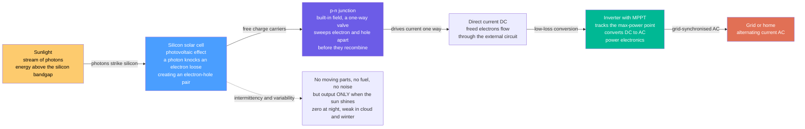

# ☀️ Solar Photovoltaics: Turning Sunlight Straight into Electricity — and the Night-Time Problem

> [!abstract] TL;DR
> A **solar panel** does something that still ought to astonish us: it converts sunlight **directly** into electricity with **no moving parts, no fuel, and no noise** — just light in, current out. The trick is the **photovoltaic effect**: sunlight is a stream of energy packets (**photons**), and when a photon with enough energy strikes a specially-doped slab of **silicon** it knocks an **electron** loose; the panel's built-in electrical one-way valve — the **p-n junction** — forces those freed electrons to flow out as **direct current (DC)** before they can settle back, and an **inverter** turns that DC into grid-friendly **AC**. Two revolutions define modern solar. First, **cost**: PV has plunged from absurdly expensive to the **cheapest source of electricity in history** in barely a decade — a fall so steep (**Swanson's law**: roughly **20% cheaper per doubling** of cumulative capacity) that it has rewritten the future of energy. Second, and inseparable from it, the **limitation**: solar only works **when the sun shines** — peaking at noon, zero at night, weaker in clouds and winter — so its story is really two stories: **cheap panels**, and the **intermittency** challenge (the **duck curve**, storage, and flexible grids) of what to do at night. Understanding the photovoltaic effect, the cost-learning-curve revolution, *and* the intermittency problem is the key to why solar is transforming the global energy system.

## Intuition

**Analogy:** Imagine a slab of treated sand that silently drinks sunlight and, without a single moving part, spits out electric current from the other side — no flame, no boiler, no turbine, no sound. That is a solar panel, and the "magic" inside it is the **photovoltaic effect**. Think of sunlight not as a smooth wave but as a **hail of tiny energy packets** — photons — raining down on the silicon. Each packet that lands hard enough **knocks an electron free** from an atom, the way a struck billiard ball breaks from the rack. On its own that freed electron would just wander and settle back down, doing nothing. So the cell is built with a hidden **one-way valve** — the **p-n junction**, a built-in electrical slope baked into the silicon — that shoves every freed electron in a single direction, out through the wire, around your circuit, and back. A continuous rain of photons becomes a continuous, one-directional flow of electrons: **light in, current out.** No heat engine, no combustion — the sun's energy is converted straight to electricity in one step.

Now the two things that make solar the defining energy story of our time. The first is a miracle of **economics**: every time the world has doubled the total number of panels ever made, they have gotten about a **fifth cheaper**, over and over, for fifty years — a compounding avalanche that has turned solar from a costly novelty for satellites into the **cheapest electricity humanity has ever produced**, now blanketing rooftops and deserts alike. The second is a stubborn fact of **physics**: the panel is utterly dependent on the sky. It gushes power at midday, tapers off toward evening, and produces **exactly nothing at night** — no sun, no electrons. So the whole promise of solar comes wrapped around a single hard problem: the panels are almost free, but the sun clocks off every evening, and civilization does not. Everything hard about running the world on solar — batteries, grids, the strange dip-and-spike shape called the **duck curve** — flows from that one sentence: *it only works when the sun shines.*

---

## How It Works

### Core Mechanics

A photovoltaic cell is a **semiconductor p-n junction** — the same device physics as a diode — engineered to absorb light instead of merely conducting. Follow the energy from photon to grid:

1. **A photon arrives with energy $E = h\nu$.** Sunlight delivers a broad spectrum of photons. A cell is made of a semiconductor (almost always **silicon**) with a characteristic **bandgap** energy $E_g$ — the minimum energy needed to lift an electron from the bound **valence band** to the mobile **conduction band**. Silicon's gap is about **1.1 eV**.

2. **Absorption creates an electron-hole pair.** A photon with energy **above the bandgap** ($h\nu > E_g$) can be absorbed, promoting one electron across the gap and leaving behind a positively-charged **hole**. Now there is a free negative charge (electron) and a free positive charge (hole), both able to move. Photons *below* the gap pass straight through (wasted, too weak); energy *above* the gap is absorbed but the excess is lost as heat (**thermalization**) — the two loss channels behind the single-junction efficiency limit.

3. **The p-n junction separates the pair.** The cell is doped **n-type** on one side (extra electrons) and **p-type** on the other (extra holes). Where they meet, a **built-in electric field** forms across the depletion region — the "one-way valve." When an electron-hole pair is created near this field, the field sweeps the **electron toward the n-side** and the **hole toward the p-side**, *before* they can recombine. This charge separation is what makes a solar cell more than a light-warmed resistor.

4. **Current flows through the external circuit.** The separated charges pile up as a voltage across the cell's terminals; connect a load and the electrons stream out of the n-contact, through your wire and appliance, and back into the p-contact — a steady **direct current (DC)**. This is **light directly to electricity**: no heat, no steam, no spinning shaft, no Carnot toll on the conversion itself.

5. **Cells become modules become arrays.** A single silicon cell makes only ~0.5–0.7 V, so cells are wired in series into a **module (panel)**, and panels into **arrays** sized from a rooftop's few kilowatts to a desert farm's gigawatts. The array's output rides an **I-V curve**; a **maximum-power-point tracker (MPPT)** continuously adjusts the operating voltage to sit at the knee of that curve where power $P = IV$ is greatest.

6. **The inverter makes grid AC.** Panels produce DC, but the grid and most appliances run on **alternating current (AC)**. A **power-electronics inverter** (see the balance-of-system, referenced in prose: *Grid_Integration_of_Renewables*) converts DC to grid-synchronized AC and houses the MPPT. Everything besides the panels — inverter, wiring, mounting, transformers — is the **balance-of-system (BOS)**, an increasingly dominant share of total cost as panels themselves have become nearly free.

**The catch, built into steps 1–6:** every joule depends on photons *arriving*. Output tracks the sun — a bell curve peaking at solar noon, zero after sunset, suppressed by clouds and low winter sun. The **capacity factor** (average output ÷ rated peak) is only about **10–25%**, versus 50–90% for dispatchable plants. That is not inefficiency; it is **intermittency**, and it is the whole engineering problem of running on solar.

### Flow / Architecture



---

## Key Concepts

### Secondary Level

- **Light straight to electricity.** A solar panel turns sunlight directly into electric current — no fuel, no fire, no moving parts, no sound. That is genuinely different from every other big power source, which boils water to spin a turbine.
- **Sunlight comes in packets.** Light is made of tiny energy bundles called **photons**. When a photon hits the special silicon in a solar cell, it **knocks an electron loose** — and freed electrons flowing in one direction *are* electricity.
- **The one-way valve.** Left alone, a knocked-loose electron would just settle back. The cell has a built-in electrical "downhill slope" (the **p-n junction**) that pushes every freed electron out the same way, so they flow as useful current instead of fizzling.
- **Panels got astonishingly cheap.** In barely a decade, solar plunged from one of the most expensive ways to make power to the **cheapest electricity in history**. That price crash is why solar is now spreading across rooftops and deserts worldwide.
- **But only in the daytime.** A panel makes the most power at midday, less in the morning and evening, and **zero at night** — and less on cloudy days and in winter. So the big question for a solar-powered world is: *what do we do after sunset?* (The answer: batteries, big grids, and flexible backup.)

### Undergraduate Level

- **Bandgap and the absorption threshold.** A cell absorbs a photon only if $h\nu \ge E_g$. Silicon's $E_g \approx 1.12$ eV corresponds to ~1100 nm — it absorbs visible and near-infrared light and is transparent to longer wavelengths. The gap sets *both* the maximum voltage (~$E_g/q$) and which part of the solar spectrum is usable.
- **The I-V curve and its landmarks.** A cell's current-voltage characteristic runs from the **short-circuit current** $I_{sc}$ (all current, zero voltage) to the **open-circuit voltage** $V_{oc}$ (all voltage, zero current), with a **knee** in between. The **maximum power point (MPP)** sits at the knee; the **fill factor** $FF = P_{mpp}/(I_{sc}V_{oc})$ measures how "square" the curve is (~0.7–0.85 for good cells). Efficiency $\eta = P_{mpp} / (\text{incident power})$.
- **MPPT and the inverter.** Because $I_{sc}$ scales with irradiance and $V_{oc}$ drifts with temperature, the MPP *moves* all day. A **maximum-power-point tracker** in the inverter continuously re-finds the knee, and the inverter converts the DC to grid AC. Panels *lose* efficiency as they heat up — a hot rooftop panel can sit 20–30 °C above ambient, cutting output several percent.
- **Capacity factor and why solar is "part-time."** $CF = \frac{\text{annual energy produced}}{\text{rated power} \times 8760\,h}$. Solar PV lands at **~10–25%** (desert vs cloudy climate). A "1 MW" solar farm therefore delivers, on average, only 100–250 kW — a crucial distinction between **nameplate capacity** and **energy delivered**.
- **LCOE — the cost that fell.** The **levelized cost of electricity** spreads a project's lifetime cost over its lifetime energy. Utility-scale PV LCOE has collapsed to **~$0.03–0.06/kWh** in sunny regions — below new coal and gas — which is what "cheapest electricity in history" means in practice.
- **The technology zoo.** **Crystalline silicon** dominates (~95% of the market): **monocrystalline** (higher efficiency, ~20–22% modules) and **polycrystalline** (cheaper, slightly lower). **Thin-film** (**CdTe**, **CIGS**) uses less material on flexible substrates. **Perovskites** and **silicon-perovskite tandems** are the emerging frontier, chasing higher efficiency at low cost.

### Graduate Level

- **The Shockley-Queisser limit.** For a *single-junction* cell in unconcentrated sunlight, detailed-balance analysis caps efficiency at **~33.7%** near $E_g \approx 1.34$ eV. The ceiling comes from two irreducible spectral losses: **sub-bandgap** photons ($h\nu < E_g$) are not absorbed, and **super-bandgap** photons thermalize their excess energy $h\nu - E_g$ to heat. Radiative recombination sets the remaining balance. Real silicon modules (~20%) sit below this; lab champion silicon cells reach ~26–27%.
- **Beating the limit: multi-junction and tandems.** **Multi-junction** cells stack subcells of different bandgaps so each harvests a slice of the spectrum near its own gap, slashing thermalization loss; under concentration they exceed **45%**. **Silicon-perovskite tandems** aim to bring this idea to terrestrial cost, targeting >30% at silicon-like price — the most active efficiency frontier.
- **Swanson's law — the experience curve behind the revolution.** PV module price follows an **experience (learning) curve**: cost falls a roughly constant fraction per *doubling of cumulative production*. The **progress ratio** is ~0.8, i.e. **~20% cheaper per doubling** (learning rate ~20%). Formally $C(X) = C_0 (X/X_0)^{\log_2(PR)}$, a straight line on log-log axes. Fifty years and ~30 doublings have driven module price from ~$100/W to well under $0.30/W — the steepest sustained cost decline of any energy technology, and the reason solar deployment is now self-reinforcing.
- **Intermittency, variability, and the duck curve.** Solar output is **deterministically periodic** (diurnal, seasonal) *and* **stochastically variable** (clouds). As PV penetration rises, midday generation depresses **net load** (demand minus solar) into a deep belly, followed by a steep evening **ramp** as the sun sets and demand peaks — the **duck curve** (CAISO's now-canonical shape). This forces fast-ramping backup, **curtailment** of excess midday solar, and time-shifting via **storage** (referenced in prose: *Batteries_and_Electrochemical_Storage*) or demand response.
- **Grid integration is the real cost.** Because PV is **non-dispatchable** and **inverter-based** (no rotating mass), high penetration stresses the grid: reduced **system inertia** and frequency stability, reverse power flow on distribution feeders, transmission to move desert solar to cities, and the economics of **"cannibalization"** — solar suppresses the midday prices it earns, so *marginal* value falls even as LCOE falls (referenced in prose: *Grid_Integration_of_Renewables*, *Energy_Economics_and_Markets*).
- **Beyond the cell: land, materials, and lifecycle.** Utility solar needs **land** (~2–4 acres/MW) and, for tracking arrays, spacing; concerns include silver and (for thin-film) tellurium/indium supply, embodied energy (**energy payback ~1–2 years**), and **end-of-life recycling** of a fast-growing panel fleet. None of these overturn the economics, but all shape *where and how fast* solar scales.

---

## Python Demo

```python
# Solar PV: intermittency (the reason storage exists) and the cost revolution
# (the reason solar is everywhere). numpy + matplotlib only.
#
#   (a) DAILY / SEASONAL OUTPUT -- a PV array's power is a bell curve peaking at
#       solar noon and ZERO at night, taller/wider in summer, short/weak in winter.
#       We compute the annual CAPACITY FACTOR = (energy produced)/(rated * hours).
#   (b) THE DUCK CURVE -- subtract midday solar from a two-humped demand profile and
#       the NET LOAD sags into a belly at noon and ramps steeply into the evening,
#       the canonical challenge of a solar-heavy grid.
#   (c) SWANSON'S LAW -- module price falls ~20% per DOUBLING of cumulative capacity
#       (learning rate ~20%): a straight line on log-log axes, the steepest sustained
#       cost decline in energy history.
import numpy as np
import matplotlib.pyplot as plt

# ----------------------------------------------------------------------
# (a) Daily PV output over 24 h, for three seasons
# ----------------------------------------------------------------------
t = np.linspace(0, 24, 24 * 60)          # minutes across a day, in hours
P_rated = 1.0                            # normalise to a 1-unit (per-kW) array

def pv_day(daylength_h, peak_scale, noon=12.0):
    """Clipped-sine clear-sky output: zero outside daylight, bell within."""
    sunrise = noon - daylength_h / 2
    sunset  = noon + daylength_h / 2
    phase = np.pi * (t - sunrise) / daylength_h        # 0..pi across the day
    p = np.where((t >= sunrise) & (t <= sunset), np.sin(phase), 0.0)
    return P_rated * peak_scale * np.clip(p, 0, None)

# Summer: long day, high sun; Equinox: medium; Winter: short day, low sun angle
P_summer  = pv_day(15.0, 1.00)
P_equinox = pv_day(12.0, 0.80)
P_winter  = pv_day( 9.0, 0.50)

# Annual capacity factor: average the three representative days, integrate energy
dt = t[1] - t[0]                                   # hours per sample
energy = np.array([np.trapz(P, dx=dt) for P in (P_summer, P_equinox, P_winter)])
season_weight = np.array([0.25, 0.50, 0.25])       # summer, 2x equinox, winter
annual_energy = (energy * season_weight).sum()     # kWh/day, weighted mean day
capacity_factor = annual_energy / (P_rated * 24.0)

print("SOLAR PV -- daily output and intermittency")
for name, P in [("summer", P_summer), ("equinox", P_equinox), ("winter", P_winter)]:
    print(f"  {name:8s}: peak {P.max():.2f} kW,  daily energy {np.trapz(P,dx=dt):.2f} kWh")
print(f"  annual capacity factor ~ {capacity_factor*100:4.1f}%  "
      f"(a '1 kW' panel averages only ~{capacity_factor:.2f} kW)\n")

# ----------------------------------------------------------------------
# (b) The duck curve: demand minus solar = net load
# ----------------------------------------------------------------------
th = np.linspace(0, 24, 24 * 12)
# Two-humped demand: a morning bump and a larger evening peak, on a baseload
demand = (1.6
          + 0.25 * np.exp(-0.5 * ((th - 7.5) / 1.4) ** 2)     # morning ramp-up
          + 0.60 * np.exp(-0.5 * ((th - 19.0) / 1.6) ** 2))   # evening peak
# Growing solar fleet: a midday bell (scale it up to show deeper duck)
solar_pen = 1.15 * np.clip(np.sin(np.pi * (th - 6) / 12), 0, None)
net_load = demand - solar_pen

# ----------------------------------------------------------------------
# (c) Swanson's law experience curve
# ----------------------------------------------------------------------
PR = 0.80                                   # progress ratio: 20% cheaper per doubling
b = np.log2(PR)                             # experience-curve exponent (~ -0.322)
X = np.logspace(0, 6, 300)                  # cumulative capacity, MW (1 -> 1,000,000)
C0 = 100.0                                  # ~$100/W at the reference early scale
cost = C0 * (X / X[0]) ** b                 # $/W
# A few illustrative historical waypoints along the same curve
years   = [1976, 1990, 2005, 2015, 2023]
cum_MW  = [1,    50,   4000, 1.8e5, 1.1e6]
pts_cost = C0 * (np.array(cum_MW) / X[0]) ** b

doublings = np.log2(X[-1] / X[0])
print("SWANSON'S LAW -- cost learning curve")
print(f"  progress ratio {PR:.2f}  ->  {int(round((1-PR)*100))}% cheaper per doubling")
print(f"  over {doublings:.0f} doublings: ${C0:.0f}/W  ->  ${cost[-1]:.2f}/W "
      f"({C0/cost[-1]:.0f}x cheaper)")

# ----------------------------------------------------------------------
# Plot
# ----------------------------------------------------------------------
fig, ax = plt.subplots(1, 3, figsize=(18, 5.4))
fig.suptitle("Solar PV: cheap panels, but only when the sun shines "
             "-- intermittency and the cost revolution", fontsize=13, fontweight="bold")

# (a) daily/seasonal output
ax[0].plot(t, P_summer,  color="#e17055", lw=2, label="summer  long day")
ax[0].plot(t, P_equinox, color="#f0a500", lw=2, label="equinox  medium")
ax[0].plot(t, P_winter,  color="#4a9eff", lw=2, label="winter  short, low sun")
ax[0].fill_between(t, P_summer, color="#e17055", alpha=0.10)
ax[0].axvspan(0, 6, color="navy", alpha=0.06); ax[0].axvspan(18, 24, color="navy", alpha=0.06)
ax[0].text(3, 0.9, "night\nzero output", ha="center", fontsize=8, color="navy")
ax[0].set_title(f"(a) Daily output vs season\nannual capacity factor ~ {capacity_factor*100:.0f}%")
ax[0].set_xlabel("hour of day"); ax[0].set_ylabel("power  [per kW rated]")
ax[0].set_xlim(0, 24); ax[0].set_xticks(range(0, 25, 4))
ax[0].legend(fontsize=8, loc="upper right"); ax[0].grid(alpha=0.3)

# (b) duck curve
ax[1].plot(th, demand,   color="#2d3436", lw=2, ls="--", label="gross demand")
ax[1].plot(th, net_load, color="#00b894", lw=2.4, label="net load  (demand - solar)")
ax[1].fill_between(th, net_load, demand, where=(solar_pen > 0),
                   color="#fdcb6e", alpha=0.35, label="solar generation")
ax[1].annotate("midday belly", (12.5, net_load[np.argmin(np.abs(th-12.5))]),
               xytext=(9.5, 0.55), fontsize=8,
               arrowprops=dict(arrowstyle="->", color="green"))
ax[1].annotate("steep evening ramp", (17.5, 1.3), xytext=(12, 2.15), fontsize=8,
               arrowprops=dict(arrowstyle="->", color="crimson"))
ax[1].set_title("(b) The duck curve\nsolar carves a belly, evening ramp remains")
ax[1].set_xlabel("hour of day"); ax[1].set_ylabel("power  [normalised]")
ax[1].set_xlim(0, 24); ax[1].set_xticks(range(0, 25, 4))
ax[1].legend(fontsize=8, loc="upper left"); ax[1].grid(alpha=0.3)

# (c) Swanson's law learning curve (log-log)
ax[2].loglog(X, cost, color="#6c5ce7", lw=2.4, label=f"experience curve  PR={PR}")
ax[2].scatter(cum_MW, pts_cost, color="crimson", zorder=5, s=45)
for yr, xm, cc in zip(years, cum_MW, pts_cost):
    ax[2].annotate(f"{yr}\n${cc:.2f}/W", (xm, cc), textcoords="offset points",
                   xytext=(6, 6), fontsize=7.5)
ax[2].set_title("(c) Swanson's law\n~20% cheaper per doubling of capacity")
ax[2].set_xlabel("cumulative PV capacity  [MW, log]")
ax[2].set_ylabel("module price  [$/W, log]")
ax[2].legend(fontsize=8, loc="lower left"); ax[2].grid(alpha=0.3, which="both")

plt.tight_layout(rect=[0, 0, 1, 0.93])
plt.show()
```

Running this prints the seasonal output and an **annual capacity factor of ~20%** — the concrete meaning of "part-time" power: a "1 kW" panel averages only about a fifth of a kilowatt over the year, because it makes nothing at night and less in winter. **Panel (a)** shows the bell curves — tall and wide in summer, short and weak in winter, flat-zero through both night bands. **Panel (b)** turns that midday bulge into the **duck curve**: subtracting solar from a two-humped demand profile digs a deep midday **belly** in net load while leaving the **evening peak** intact, so the grid must ramp hard exactly as the sun sets — the single clearest picture of why a solar-heavy grid *needs storage and flexibility*. **Panel (c)** plots **Swanson's law** as a straight line on log-log axes: ~20% off per doubling of cumulative capacity drives module price from ~$100/W to under $0.30/W across ~20 doublings — the steepest, most sustained cost collapse in energy history, and the reason the "expensive novelty" became the cheapest electricity ever produced.

---

## Real-World Applications

> **Example — a utility-scale solar farm, PV at gigawatt deserts.** A modern utility plant tiles hundreds of hectares with **crystalline-silicon** modules, often on **single-axis trackers** that tilt east-to-west to follow the sun and squeeze a few more percent of energy from the day. Thousands of panels wire into strings feeding **central or string inverters** that run **MPPT** and convert DC to medium-voltage AC, stepped up by transformers onto the transmission grid. Thanks to **Swanson's-law** cost declines, such plants now win power auctions at **~$0.02–0.05/kWh**, undercutting new fossil generation — the physical embodiment of "cheapest electricity in history." Their Achilles' heel is exactly the one in this note: output is a **bell curve** that vanishes at night, so operators increasingly **co-locate battery storage** (referenced in prose: *Batteries_and_Electrochemical_Storage*) to shift midday surplus into the evening ramp and firm the plant's output.

- **Rooftop and distributed PV.** Homes and businesses put panels on the roof with a small string or micro-inverter, offsetting daytime consumption and exporting surplus. Distributed solar is what makes the **duck curve** appear on real distribution feeders (referenced in prose: *Grid_Integration_of_Renewables*).
- **Off-grid and solar home systems.** A panel, a charge controller, and a battery bring electricity to homes and clinics far from any grid. For **energy access** across sub-Saharan Africa and South Asia, cheap PV plus a lithium battery has done more, faster, than grid extension ever could.
- **Space power.** The original PV market: satellites and the ISS run on high-efficiency **multi-junction** cells, where cost matters less than watts-per-kilogram and radiation tolerance — the technology that later fell down Swanson's law to terrestrial scale.
- **Concentrated solar's cousin.** PV converts photons *directly*; by contrast, **concentrated solar power** uses mirrors to make heat and drive a steam turbine (referenced in prose: *Concentrated_Solar_and_Solar_Thermal*), trading PV's simplicity for built-in thermal storage.
- **The renewables portfolio.** Solar's midday peak often complements **wind's** stronger night-and-winter output (referenced in prose: *Wind_Energy*); pairing them, plus storage and transmission, is the core recipe for a low-carbon grid (referenced in prose: *Energy_Economics_and_Markets*).

---

## Common Pitfalls

- **Confusing nameplate capacity with energy delivered.** A "100 MW" solar farm does *not* produce 100 MW around the clock; at a ~20% **capacity factor** it averages ~20 MW and delivers energy only in daylight. Sizing storage or comparing to a gas plant on nameplate alone badly overstates what solar supplies.
- **Treating intermittency as an efficiency problem.** Solar's ~20% capacity factor is not "80% wasted panel" — it is the sun being absent. The fix is not a better cell but **storage, transmission, flexible backup, and demand shifting.** Conflating the two leads to the wrong investments.
- **Ignoring the duck curve at high penetration.** The first few percent of solar is easy; past ~15–20% penetration the **midday belly and evening ramp** dominate, forcing **curtailment** of cheap midday power and stressing fast-ramping plants. Planning as if more solar always displaces fuel one-for-one misses the ramp problem entirely.
- **Assuming panels hit their rated efficiency in the field.** Nameplate is measured at 25 °C and standard irradiance. Real panels run **hot** (output falls ~0.3–0.5%/°C), get dusty (**soiling**), degrade ~0.5%/year, and see clouds and haze. Field yield is meaningfully below the sticker.
- **Overweighting cell efficiency, underweighting system cost.** Since panels became nearly free, the **balance-of-system** (inverter, wiring, mounting, land, permitting, "soft costs") now dominates. A 2%-more-efficient panel matters far less than cutting BOS and financing cost — the real levers on modern LCOE.
- **Forgetting sub-bandgap and thermalization losses when reasoning about the limit.** The single-junction **Shockley-Queisser ~33%** ceiling is not sloppy engineering; it is set by photons below the gap (unabsorbed) and above it (excess lost as heat). Only **multi-junction/tandem** designs escape it, and only by adding cost or complexity.
- **Believing solar alone can run a grid.** Cheap panels solve the *cost* of daytime energy but say nothing about **night, clouds, and seasons.** A solar-dominant system is only as good as the storage, grids, and flexible generation that firm it — the "second story" is not optional.

*(Sibling notes in this Renewable Energy section — Concentrated_Solar_and_Solar_Thermal, Wind_Energy, Grid_Integration_of_Renewables — supply the mirror-and-turbine alternative to direct PV, the complementary variable resource whose output often fills solar's night-time gap, and the system-level machinery of storage, transmission, and flexibility that intermittency demands; Batteries_and_Electrochemical_Storage and Energy_Economics_and_Markets supply the time-shifting technology and the market signals — LCOE, value cannibalization, capacity — that decide how far and fast solar scales.)*

---

## Related Concepts

**The device physics — why a slab of silicon makes current**
- [[Semiconductors_Intrinsic_and_Extrinsic]] — the doped-silicon foundation: intrinsic carriers, n-type and p-type doping, and the **bandgap** that decides which photons a cell can absorb
- [[p_n_Junctions_and_Diodes]] — the **p-n junction** is the cell's "one-way valve"; the built-in field that separates photo-generated electron-hole pairs is the same junction physics as a diode, run in photovoltaic mode
- [[Semiconductors_and_Devices]] — the condensed-matter view of band structure, carrier transport, and junction devices underlying every PV cell
- [[Photoelectric_Effect_and_Compton]] — the quantum root of the photovoltaic effect: light as **photons** with energy $h\nu$ that must exceed a threshold to liberate an electron

**From cell to grid — the power-plant / electrical view**
- [[Power_Electronics_and_Converters]] — the **inverter** that converts panel DC to grid AC and runs the maximum-power-point tracking, the essential balance-of-system link
- [[Renewable_Energy_Integration]] — the electrical-engineering treatment of connecting variable inverter-based solar (and wind) to the grid: inertia, frequency stability, and the intermittency this note frames from the energy-systems side

**Systems context**
- [[Energy_Systems_Overview]] — the vault hub: solar PV is the fastest-growing node in the "conversion & generation" link of the whole energy chain, and the S03 Renewable Energy pillar opens here
- [[Thermodynamics_of_Energy_Conversion]] — the contrast that makes PV remarkable: thermal plants pay the Carnot toll boiling water, while PV converts photons to electrons *directly*, sidestepping the heat engine entirely

---

## Review Questions

**Secondary**
1. Using the "hail of energy packets" analogy, explain step by step how a solar panel turns sunlight into an electric current — what a photon does when it hits the silicon, what the "one-way valve" (p-n junction) is for, and why the panel needs one at all. Then explain the two big things everyone should know about solar: why it got so cheap, and why running the whole world on it is still hard.

**Undergraduate**
2. A "1 kW" rooftop array in a temperate climate has an annual **capacity factor** of about 18%. (a) How many kWh does it generate in a year, and why is that far less than $1\,\text{kW} \times 8760\,\text{h}$? (b) Sketch its output over a summer day and a winter day and explain the difference in terms of daylength and sun angle. (c) Silicon's bandgap is ~1.1 eV: explain, in terms of **sub-bandgap** and **super-bandgap** photons, why a single-junction cell cannot convert most of the solar spectrum, and name one technology that does better and how.

**Graduate**
3. A utility's grid reaches 30% instantaneous solar penetration at midday. (a) Draw and explain the **duck curve** for net load, identifying the midday belly and the evening ramp, and explain why simply building *more* solar makes the ramp problem worse rather than better. (b) Solar module LCOE has fallen below $0.03/kWh via **Swanson's law**, yet the *marginal value* of added solar falls as penetration rises. Explain this **value-cannibalization** effect and why LCOE alone is an incomplete metric. (c) Propose and compare two mitigations — utility-scale **battery storage** and long-distance **transmission** — for turning cheap-but-intermittent midday PV into firm, dispatchable evening power, noting the trade-offs of each.

---

## Sources

- J. Nelson — *The Physics of Solar Cells* (Imperial College Press, 2003) — the standard graduate text on the photovoltaic effect, absorption, recombination, and the detailed-balance limit
- M. A. Green — *Solar Cells: Operating Principles, Technology and System Applications* (UNSW, 1982; reprinted) — the classic device- and system-level treatment of silicon PV, I-V curves, and fill factor
- D. J. C. MacKay — *Sustainable Energy — Without the Hot Air* (UIT Cambridge, 2009) — the numbers-first, whole-system view of solar's land use, capacity factor, and role in a low-carbon energy mix (free at withouthotair.com)
- IEA — *Renewables* and *World Energy Outlook* (annual) and IEA-PVPS *Trends in Photovoltaic Applications* — deployment, cost, capacity factors, and the cost-learning curve
- IRENA — *Renewable Power Generation Costs* (annual) — LCOE trends showing utility PV becoming the cheapest new electricity in many regions

---

#energy-systems #solar #photovoltaics #renewable-energy #intermittency
