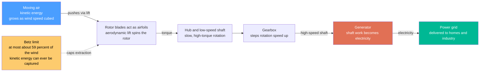

# 🌬️ Wind Energy: Harvesting the Cube of the Wind Within the Betz Limit

> [!abstract] TL;DR
> A wind turbine is **a fan run in reverse**: instead of spending electricity to push air, it lets moving air push its blades and turns that motion into electricity. Two facts dominate everything else. First, the power carried in the wind grows with the **cube of wind speed** — $P = \tfrac{1}{2}\rho A v^3$ — so **doubling the wind gives eight times the power**, which is why siting on windy ridges, open plains, and *offshore* matters enormously and why a gentle breeze is nearly worthless. Second, no turbine can take *all* the wind's energy: if it did, the air would stop dead and block the flow behind it, so the theoretical ceiling is the **Betz limit of about 59.3 percent** (real machines reach ~40 to 50 percent). Modern turbines are gigantic three-bladed airfoils — rotors sweeping a circle of sky wider than a football field is long — because bigger rotors ($A \propto D^2$) catch more wind, and going **offshore** taps stronger, steadier winds and higher capacity factors. Like solar, wind is now among the **cheapest new electricity ever built**, but it is **variable**: it blows when it blows, not when demand asks, so integrating it means transmission, storage, and flexible backup. Understanding the cube law, the Betz limit, and the variability challenge explains why wind — with solar — is a central pillar of decarbonization.

## Intuition

**Analogy:** A wind turbine is simply **a fan run backwards**. An ordinary fan spends electricity to spin blades that push air; a turbine lets *moving air* push the blades and, through the same shaft, spins a generator that *makes* electricity. Same machine, arrow of energy reversed.

But the physics hides two surprises that make wind unlike a lightbulb or a battery. The **first surprise** is how violently the payoff depends on wind speed: the energy in moving air scales with the *cube* of speed, so a wind that is merely *twice* as fast carries *eight* times the power. That single fact is why a lazy summer breeze is nearly worthless while a windy offshore gale is a goldmine, and why engineers obsess over siting turbines on ridgelines, open plains, and out at sea, and mount them on ever-taller towers where the wind runs faster and smoother. The **second surprise** is that you can never take *all* of the wind's energy. To capture energy you must slow the air down — but if you slowed it to a dead stop, the stopped air would pile up and block the wind coming behind it, and the flow would simply detour around your rotor. So some wind *must* keep moving to clear the way, and the best any turbine can theoretically do is capture about **59 percent** of the wind's power — the **Betz limit**. Real turbines reach roughly 40 to 50 percent. That is why modern turbines are colossal — blades longer than a football field, sweeping a huge circle of sky — because if you cannot take a bigger *fraction*, you take a bigger *bite*, and going offshore feeds them stronger, steadier wind. Like solar, wind is clean and now dirt-cheap, but **variable**: it delivers on the weather's schedule, not yours.

---

## How It Works

### Core Mechanics

1. **Wind carries kinetic energy, and a turbine is a converter.** Air of density $\rho$ moving at speed $v$ carries kinetic energy; a mass flow of that air streams through the disc swept by the rotor. A turbine converts a fraction of that kinetic energy into **shaft work**, and a generator converts the shaft work into **electricity**. Nothing is burned and no heat engine is involved — this is a *direct* mechanical harvest of a flowing fluid, so it dodges the Carnot ceiling that caps thermal plants.

2. **The blades are airfoils, and they work by lift, not by being pushed.** A common misconception is that wind simply *shoves* the blades like a sail. In fact each blade is a slender **airfoil**, like an aircraft wing, and the relative wind over its curved cross-section generates **aerodynamic lift** — a force largely *perpendicular* to the local airflow — that pulls the blade around the rotor plane. Lift-driven rotors spin far faster and more efficiently than pure drag ("shove") devices, which is why every large turbine uses slender lifting blades rather than cups or paddles.

3. **The power equation — where the cube law comes from.** The power available in the wind passing through a rotor of swept area $A$ is
$$P_{wind} = \tfrac{1}{2}\,\rho\,A\,v^3.$$
Three levers set it: air **density** $\rho$ (higher at sea level, in cold air, and lower at altitude); swept **area** $A = \tfrac{\pi}{4}D^2$, which grows with the *square* of rotor diameter — the reason turbines keep getting bigger; and wind **speed** $v$, which enters as the **cube** and therefore dominates. Doubling $D$ quadruples the harvest; doubling $v$ multiplies it by eight. Speed and siting win.

4. **The Betz limit — you cannot take it all.** To extract energy the rotor must slow the air, but slowing it too much chokes the flow. Betz's analysis (a momentum-and-energy balance on the streamtube through the rotor) shows the extracted fraction — the **power coefficient** $C_p$ — is maximized when the rotor slows the wind to *two-thirds* of its upstream speed, giving
$$C_{p,\max} = \frac{16}{27} \approx 0.593.$$
No turbine of any design can beat **~59.3 percent**; real horizontal-axis machines reach $C_p \approx 0.40\text{–}0.50$ at their best tip-speed ratio, losing the rest to wake rotation, finite blades, and drag.

5. **The machine.** The dominant design is the **horizontal-axis, three-blade** turbine: a **rotor** of airfoil blades on a **hub**, a slow high-torque **low-speed shaft**, usually a **gearbox** (or a large direct-drive generator) to reach generator speed, the **generator** itself, plus **yaw** control (turning the whole nacelle to face the wind) and **pitch** control (twisting the blades to regulate power and shed load), all atop a tall **tower**. Its behaviour is summarized by the **power curve**: zero below the **cut-in** speed (~3 m/s), a steep cube-law-like rise, a flat plateau at **rated** power (blades pitch to spill excess wind), and a hard shutdown at the **cut-out** speed (~25 m/s) to protect the machine in storms.

6. **Deployment and variability.** **Onshore** wind is often the cheapest new electricity available; **offshore** wind costs more to build but taps **stronger, steadier winds**, allows even larger turbines, and delivers a **higher capacity factor** — the fast-growing frontier. Turbines cluster into **wind farms**, where downstream machines sit in the slower, more turbulent **wakes** of those upwind, so spacing trades land use against wake losses. Across a year a turbine delivers only a **capacity factor** of ~25 to 50 percent of its nameplate (higher offshore), because the wind is **variable and only partly predictable** — the central challenge that grid integration, transmission, storage, and flexible backup exist to solve.

### Flow / Architecture



---

## Key Concepts

### Secondary Level

- **A turbine is a fan running backwards.** A fan uses electricity to push air; a wind turbine lets moving air push its blades and makes electricity instead.
- **Faster wind is worth far more than you would guess.** The power in the wind grows with the *cube* of its speed, so wind that is twice as fast carries **eight times** the power. This is why turbines go on windy hills, open plains, and out at sea — and why a gentle breeze is almost useless.
- **You cannot catch all the wind.** If a turbine took every bit of the wind's energy, the air would stop and clog the flow behind it. The best any turbine can do is capture about **59 percent** — a hard limit of nature called the **Betz limit** (real ones get about 40 to 50 percent).
- **Bigger rotors catch more wind.** Because you cannot take a bigger *fraction* of the wind, you take a bigger *bite* — so blades keep growing, now longer than a football field.
- **Wind is clean and cheap but comes and goes.** It makes power only when the wind blows, which may not be when people need it. So we need power lines, batteries, and backup plants to fill the gaps.

### Undergraduate Level

- **The power equation and its three levers.** $P_{wind} = \tfrac{1}{2}\rho A v^3$. Air density $\rho$, swept area $A = \tfrac{\pi}{4}D^2$ (so power $\propto D^2$), and speed $v$ (power $\propto v^3$). The cubic dependence on speed is why site selection and hub height dominate energy yield, and the squared dependence on diameter is why turbines keep growing.
- **The power coefficient and the Betz limit.** Actual electrical power is $P = C_p\,\tfrac{1}{2}\rho A v^3$, where $C_p$ is the **power coefficient**. Betz's momentum theory caps $C_p$ at $16/27 \approx 0.593$; well-designed rotors reach ~0.45 near their optimal **tip-speed ratio** $\lambda = \omega R / v$ (blade-tip speed divided by wind speed).
- **Lift, not drag, drives the rotor.** Blades are airfoils; lift (roughly perpendicular to the *relative* wind, which combines the free wind with the blade's own motion) provides the useful torque. This is why turbine tips move several times faster than the wind, and why blade design borrows directly from aircraft-wing aerodynamics.
- **The power curve.** Four regimes: **cut-in** (~3 m/s, below which torque is too weak), a rising **partial-load** region (control maximizes $C_p$), the **rated** plateau (pitch control spills excess power to protect the generator), and **cut-out** (~25 m/s, shut down for safety). Rated power is a *design choice* balancing turbine cost against how often high winds occur.
- **Capacity factor.** The fraction of nameplate energy actually delivered over a year: onshore ~25 to 40 percent, offshore ~40 to 55 percent. It is *not* an efficiency — it reflects how often the wind is strong enough — and it is what makes installed *capacity* and delivered *energy* rank very differently.
- **Onshore vs offshore.** Offshore winds are stronger and steadier (less surface roughness, no terrain), permitting bigger turbines and higher capacity factors, at the cost of foundations, marine installation, and subsea cables. Fixed-bottom foundations suit shallow seas; **floating** platforms open the deep-water resource.

### Graduate Level

- **Deriving the Betz limit.** Model the rotor as an actuator disc in a streamtube. With **axial induction factor** $a$ (the fractional slowdown at the disc, so disc speed is $v(1-a)$ and far-wake speed is $v(1-2a)$), mass and momentum balance give extracted power $P = 2\rho A v^3 a(1-a)^2$, hence $C_p = 4a(1-a)^2$. Maximizing over $a$ yields $a = 1/3$ and $C_{p,\max} = 16/27$. The optimum slows the wind to two-thirds upstream speed — take more and the choked flow diverts around the disc.
- **Blade element momentum (BEM) theory.** Real design couples momentum theory with **blade-element** aerodynamics: each radial station is an airfoil section with local angle of attack set by the vector sum of free wind and rotational speed. BEM (with tip-loss, wake-rotation, and Glauert high-induction corrections) predicts torque, thrust, and $C_p(\lambda,\theta)$, and underlies both blade shape and pitch/torque control laws.
- **Control across the power curve.** Below rated, controllers hold the **optimal tip-speed ratio** (variable-speed operation via a power-electronic converter) to keep $C_p$ at its peak, so torque tracks $\propto \omega^2$. Above rated, **pitch-to-feather** regulation caps power and thrust while shedding aerodynamic load, protecting the drivetrain and structure. Full-converter and doubly-fed induction generators decouple rotor speed from grid frequency.
- **Wakes, arrays, and the farm.** A turbine leaves a momentum-deficit, higher-turbulence **wake** (modelled by Jensen/Gaussian deficit or higher-fidelity CFD). Downstream machines see reduced $v$ (cube-law-amplified energy loss) and elevated fatigue loading, so **layout optimization** and, increasingly, **wake steering** (deliberate yaw misalignment to deflect wakes) trade single-turbine output for higher whole-farm yield.
- **Variability, forecasting, and system integration.** Wind output is a stochastic, weather-driven, spatially-correlated signal, poorly correlated with demand and only *partly* forecastable. Integration demands reserves, ramping capacity, **transmission** (the best wind resource is often far from load centers), geographic smoothing, storage, curtailment, and — as inverter-based wind displaces synchronous machines — **synthetic inertia** and grid-forming controls to sustain frequency stability.
- **Economics and life cycle.** Wind has among the lowest **LCOE** of any generation, a poster child of learning-curve cost declines. But value is *time- and place-dependent*: correlated wind can suppress its own market price (cannibalization), and honest accounting includes **land/visual/acoustic** impact, **wildlife** (bird and bat) effects, offshore marine ecology, siting/permitting, and **materials** — especially the end-of-life challenge of recycling large **composite blades**.

---

## Python Demo

```python
# Wind energy in one figure: WHY wind speed dominates (the cube law), WHERE
# the ceiling is (the Betz limit), and HOW a variable wind resource turns into
# real average output (the capacity factor).  numpy + matplotlib only.
import numpy as np
import matplotlib.pyplot as plt

# ---- turbine + air parameters ------------------------------------------
rho   = 1.225                    # kg/m^3, air density at sea level
D     = 120.0                    # m, rotor diameter (each blade ~ 60 m)
A     = np.pi / 4 * D**2         # m^2, swept area (grows as D^2)
P_rated = 3.5e6                  # W, rated / nameplate electrical power
v_ci, v_r, v_co = 3.0, 12.0, 25.0    # cut-in, rated, cut-out speeds [m/s]
BETZ  = 16.0 / 27.0              # = 0.5926..., the Betz limit

# ---- (a) the physics: power in the wind, the Betz cap, the power curve ---
v = np.linspace(0.0, 30.0, 600)              # wind speed [m/s]
P_wind = 0.5 * rho * A * v**3                # kinetic power flux through rotor [W]
P_betz = BETZ * P_wind                       # theoretical max any turbine can take

def power_curve(v):
    """Real turbine electrical output vs wind speed [W]."""
    P = np.zeros_like(v)
    ramp = (v >= v_ci) & (v < v_r)           # cube-law-like rise between cut-in and rated
    P[ramp] = P_rated * (v[ramp]**3 - v_ci**3) / (v_r**3 - v_ci**3)
    flat = (v >= v_r) & (v <= v_co)          # rated plateau: blades pitch to spill wind
    P[flat] = P_rated
    return P                                  # zero below cut-in and above cut-out

P_turbine = power_curve(v)

# ---- (b) variability: a Weibull wind climate -> capacity factor ----------
def weibull_pdf(v, k, lam):
    return (k / lam) * (v / lam)**(k - 1) * np.exp(-(v / lam)**k)

k = 2.0                                       # Weibull shape (k=2 is a Rayleigh climate)
sites = {"Onshore  (scale 9)": 9.0, "Offshore (scale 11)": 11.0}

vg = np.linspace(0.01, 30.0, 4000)           # fine grid for numerical integration
Pg = power_curve(vg)
print("=== Same 3.5 MW turbine, two wind climates ===")
cf = {}
for name, lam in sites.items():
    pdf = weibull_pdf(vg, k, lam)
    mean_power = np.trapz(Pg * pdf, vg)       # average electrical output [W]
    mean_wind  = np.trapz(vg * pdf, vg)       # mean wind speed [m/s]
    cf[name] = mean_power / P_rated
    print(f"  {name:20s}  mean wind {mean_wind:4.1f} m/s   "
          f"avg output {mean_power/1e6:4.2f} MW   capacity factor {cf[name]:.0%}")

# ------------------------------- plotting -------------------------------
fig, (axA, axB) = plt.subplots(1, 2, figsize=(15, 6))
fig.suptitle("Wind energy: the cube law and the Betz limit, and why wind's "
             "variability sets the real output", fontsize=13, fontweight="bold")

# (a) cube law, Betz limit, real power curve
axA.plot(v, P_wind / 1e6, color="#adb5bd", lw=2, ls=":",
         label=r"power IN the wind  $P=\frac{1}{2}\rho A v^3$  (cube law)")
axA.plot(v, P_betz / 1e6, color="#e76f51", lw=2, ls="--",
         label=f"Betz limit  {BETZ:.3f} x wind power")
axA.plot(v, P_turbine / 1e6, color="#2a9d8f", lw=3,
         label="real turbine power curve")
for vx, lab in [(v_ci, "cut-in"), (v_r, "rated"), (v_co, "cut-out")]:
    axA.axvline(vx, color="k", lw=0.8, alpha=0.35)
    axA.text(vx, 9.6, lab, rotation=90, va="top", ha="right", fontsize=8)
axA.annotate("double the wind\n-> 8x the power",
             xy=(10.0, 0.5 * rho * A * 10.0**3 / 1e6), xytext=(3.4, 7.6),
             fontsize=9, color="#555",
             arrowprops=dict(arrowstyle="->", color="#555"))
axA.set_xlabel("wind speed  [m/s]")
axA.set_ylabel("power  [MW]")
axA.set_xlim(0, 30)
axA.set_ylim(0, 10)
axA.set_title("(a) Power curve, cube law & Betz limit")
axA.legend(loc="upper left", fontsize=8)
axA.grid(alpha=0.3)

# (b) Weibull wind distribution + energy contribution + capacity factor
lam = 9.0
pdf = weibull_pdf(v, k, lam)
axB.fill_between(v, pdf, color="#4a9eff", alpha=0.25,
                 label=f"wind-speed frequency (Weibull, scale {lam:.0f})")
axB.plot(v, pdf, color="#4a9eff", lw=2)
for vx, lab in [(v_ci, "cut-in"), (v_r, "rated"), (v_co, "cut-out")]:
    axB.axvline(vx, color="k", lw=0.8, alpha=0.35)
    axB.text(vx, weibull_pdf(6.4, k, lam) * 1.02, lab, rotation=90,
             va="top", ha="right", fontsize=8)
axB.set_xlabel("wind speed  [m/s]")
axB.set_ylabel("probability density  [s/m]")
axB.set_xlim(0, 30)
axB.set_title("(b) Wind is variable -> capacity factor")

# overlay the energy contribution P(v) x f(v): the integrand of average output
axB2 = axB.twinx()
axB2.plot(v, power_curve(v) * pdf / 1e6, color="#8338ec", lw=2.5,
          label="energy contribution  P(v) x f(v)")
axB2.set_ylabel("energy contribution  [MW x s/m]", color="#8338ec")
axB2.tick_params(axis="y", labelcolor="#8338ec")

# capacity-factor summary box (upper-right region is empty on both curves)
box = "same turbine, two climates\n" + \
      "\n".join(f"{n}:  CF {c:.0%}" for n, c in cf.items())
axB.text(0.97, 0.97, box, transform=axB.transAxes, ha="right", va="top",
         fontsize=9, bbox=dict(boxstyle="round", fc="#fff7e6", ec="#fdcb6e"))

h1, l1 = axB.get_legend_handles_labels()
h2, l2 = axB2.get_legend_handles_labels()
axB.legend(h1 + h2, l1 + l2, loc="upper right",
           bbox_to_anchor=(0.98, 0.72), fontsize=8)

plt.tight_layout(rect=[0, 0, 1, 0.94])
plt.show()
```

Running this prints the two capacity factors and draws two panels. **Panel (a)** is the physics: the dotted grey **cube-law** curve rockets upward (the arrow marks how doubling the wind octuples the power), the dashed **Betz** curve sits at 0.593 of it as an unbreakable ceiling, and the solid **power curve** shows what a real turbine does — flat zero below cut-in, a steep cube-law-like climb, a **rated plateau** where the blades pitch to spill surplus wind, and an abrupt drop at **cut-out** for storm safety. **Panel (b)** is the variability story: the blue **Weibull** distribution shows how often each wind speed actually occurs, and the purple **energy-contribution** curve — the wind climate *convolved with* the power curve — reveals that most annual energy comes from moderate-to-strong winds near rated, not from the far more common light breezes (the cube law again). Integrating that product gives the **capacity factor**, and the box shows why the *same* turbine yields far more in a windier **offshore** climate (higher scale) than onshore — the single clearest argument for going out to sea.

---

## Real-World Applications

> **Example — an offshore wind farm as the cube law and Betz limit made industrial.** A modern offshore project such as Hornsea (in the UK North Sea) or Dogger Bank plants dozens to hundreds of turbines whose rotors now exceed 220 m in diameter — blades longer than a football field — each rated 10 to 15 MW. Everything in this note is visible at once. The turbines sit *offshore* precisely because the cube law rewards the stronger, steadier sea wind with a **capacity factor above 50 percent**, far higher than a typical onshore site; the giant rotors exist because energy scales as $D^2$, so a bigger bite compensates for the Betz-capped fraction they can never exceed; each blade is an **airfoil** whose pitch is actively trimmed along the power curve; the turbines are **spaced** hundreds of meters apart, with layouts and even deliberate yaw "wake steering" chosen to keep upwind machines from starving those behind them; and a subsea high-voltage cable carries the power a long way to shore — the transmission cost of putting the best wind resource far from cities.

- **Onshore wind farms — cheapest new electricity.** Across the US Great Plains, Iberia, and much of the world, onshore wind is the lowest-LCOE new generation, delivered by 3 to 6 MW turbines on 80 to 160 m towers, often sharing land with farming.
- **Offshore and floating wind — the growing frontier.** Fixed-bottom farms in shallow seas (North Sea, US East Coast, China) scale to gigawatt projects; **floating** platforms unlock deep water off Japan, California, and the Atlantic, vastly expanding the accessible resource.
- **Repowering and ever-larger turbines.** Old sites are "repowered" with fewer, far larger, higher-capacity-factor machines, and manufacturers keep enlarging rotors to harvest more area and reach smoother high-altitude wind.
- **Hybrid and co-located systems.** Wind is increasingly paired with **battery storage** and, geographically, with solar (which often peaks when wind lulls), smoothing output and firming delivery for the grid.
- **Distributed and off-grid wind.** Small turbines power remote telecom sites, farms, islands, and microgrids, sometimes alongside diesel or solar, where grid extension is uneconomic.
- **Grid operations and forecasting.** System operators run wind-power forecasts hours to days ahead and schedule reserves, transmission, and flexible plant around them — the operational face of managing a variable resource at scale.

---

## Common Pitfalls

- **Ignoring the cube law and comparing sites by average wind alone.** Because power scales as $v^3$, a site with 20 percent higher mean wind yields far more than 20 percent more energy, and gusty distributions beat steady ones of the same mean. A modest speed advantage or a taller tower is worth a great deal — this is the single most important intuition in wind siting.
- **Thinking you can beat the Betz limit.** No rotor, no matter how clever, exceeds $C_p = 16/27 \approx 0.593$; claims of "revolutionary" turbines capturing 70 or 80 percent violate momentum conservation. The real engineering target is approaching Betz (reaching $C_p \approx 0.45\text{–}0.50$), not exceeding it.
- **Confusing capacity factor with efficiency.** A 35 percent capacity factor does not mean the turbine is 35 percent efficient — it means the *wind* was strong enough often enough to deliver 35 percent of nameplate energy over the year. A turbine can be near-Betz efficient *and* have a modest capacity factor simply because the wind is intermittent.
- **Assuming blades work by being pushed (drag) rather than by lift.** Treating a turbine as a sail badly underestimates performance and misexplains why tips move several times faster than the wind. Lift-based airfoils, not drag, drive every large machine.
- **Comparing wind capacity to firm capacity.** "1 GW of wind" is not equivalent to 1 GW of dispatchable plant: it delivers variable energy, not on-demand power. Planning must count *energy* and *firm/flexible* capacity separately, and provision reserves, storage, and transmission accordingly.
- **Forgetting wake losses in array design.** Downstream turbines run in the slower, more turbulent wakes of upwind ones; cube-law amplification makes even a small speed deficit a large energy loss, and the added turbulence drives fatigue. Spacing and layout are first-order design decisions, not afterthoughts.
- **Overlooking the material and end-of-life burden.** Giant composite blades are hard to recycle, and scaling wind means scaling steel, copper, rare-earth magnets, and blade waste — real sustainability and supply-chain constraints behind an otherwise clean technology.

---

## Related Concepts

**Aerodynamics — why the blades work**
- [[Airfoils_and_Wing_Theory]] — a turbine blade is a rotating airfoil; the lift-and-angle-of-attack theory that explains aircraft wings is exactly what generates the torque that spins the rotor.
- [[Lift_Drag_and_Aerodynamics]] — the lift-versus-drag balance on a blade section sets the power coefficient, the optimal tip-speed ratio, and why lift-driven rotors beat drag ("shove") devices.

**Turbomachinery and the drivetrain**
- [[Pumps_Compressors_and_Turbines]] — a wind turbine is a specialized turbine extracting work from a moving fluid; the same actuator-disc and blade-element ideas connect it to the broader family of turbomachines.

**Electrical generation and grid integration**
- [[Electric_Machines_and_Transformers]] — the generator that converts the rotor's shaft work into electricity, and the power-electronic converters that let variable-speed rotors deliver grid-quality power.
- [[Renewable_Energy_Integration]] — the intermittency, forecasting, reserves, and storage problem of putting variable wind (and solar) onto the grid — the operational heart of why wind needs a flexible system around it.

**Energy-systems foundation**
- [[Thermodynamics_of_Energy_Conversion]] — the conversion-and-limits framing of the whole energy chain; unlike thermal plants, wind harvests kinetic energy directly and sidesteps the Carnot ceiling, but meets its own hard cap in the Betz limit.

Within the Energy Systems vault this note opens the **Renewable Energy** pillar and is referenced in prose by its section siblings: *Solar_Photovoltaics* (wind's twin low-cost, variable renewable, often anti-correlated in timing), *Hydropower_and_Marine_Energy* (the other kinetic-fluid harvest, from falling water and tides), *Grid_Integration_of_Renewables* (managing wind's variability across the power system), *Batteries_and_Electrochemical_Storage* (the storage that firms variable wind output), and *The_Electric_Power_Grid* (the transmission-and-balancing machine that carries wind from remote resource to load and keeps supply matched to demand).

---

## Review Questions

**Secondary**
1. A wind turbine is often called "a fan run backwards." Explain what that means. Then, using the fact that the power in the wind grows with the *cube* of wind speed, explain why engineers put turbines on windy ridges and out at sea rather than in a calm valley — and why a gentle breeze is nearly worthless. Finally, explain in plain words why a turbine can never capture *all* of the wind's energy.

**Undergraduate**
2. A turbine has a 120 m rotor and operates in wind at 8 m/s (air density 1.225 kg/m³). (i) Compute the power available in the wind through the swept area, and the theoretical maximum the turbine could extract given the Betz limit. (ii) If the machine's power coefficient is $C_p = 0.45$, what electrical power does it produce, and why is that below the Betz value? (iii) The same turbine is quoted with a 35 percent capacity factor. Explain why capacity factor is *not* the same as $C_p$, and what physical fact it actually reflects.

**Graduate**
3. A developer must choose between an onshore site (mean wind 7 m/s) and an offshore site (mean wind 9.5 m/s) for the same turbine model. (a) Using the actuator-disc result $C_p = 4a(1-a)^2$, show that the extraction optimum is $a = 1/3$ and hence $C_{p,\max} = 16/27$, and explain physically why slowing the wind further reduces output. (b) Explain, invoking the cube law and the Weibull wind climate, why the offshore site's higher mean wind produces a *disproportionately* higher capacity factor, and what additional costs offset that gain. (c) The offshore farm displaces synchronous thermal plant with inverter-based turbines. Discuss two system-level integration challenges this creates (for example frequency/inertia, transmission, or forecasting) and how a modern wind farm addresses them.

---

## Sources

- J. F. Manwell, J. G. McGowan & A. L. Rogers — *Wind Energy Explained: Theory, Design and Application*, 2nd ed. (Wiley) — the standard textbook covering aerodynamics, the Betz limit, control, and system integration.
- T. Burton, N. Jenkins, D. Sharpe & E. Bossanyi — *Wind Energy Handbook*, 2nd ed. (Wiley) — comprehensive engineering reference on rotor aerodynamics, loads, drivetrains, and grid connection.
- D. J. C. MacKay — *Sustainable Energy — Without the Hot Air* (UIT Cambridge, 2008; free at withouthotair.com) — quantitative, back-of-envelope arithmetic of wind resource and its scale.
- IRENA — *Renewable Power Generation Costs* and *Future of Wind* reports — global cost, capacity-factor, and offshore-wind data and trends.
- Global Wind Energy Council (GWEC) — *Global Wind Report* (annual) — installed capacity, onshore/offshore deployment, and market outlook.

---

#energy-systems #wind-energy #betz-limit #renewable-energy #offshore-wind
