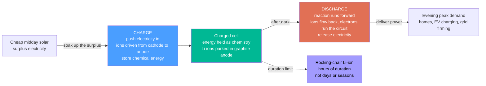

# 🔋 Batteries and Electrochemical Storage: Bottling Electricity as Chemistry

> [!abstract] TL;DR
> A **battery stores electricity as chemistry and gives it back on demand**. Inside sit two piles of atoms that *want* to react with each other — but you force them to react only by passing their electrons through *your* circuit, so the reaction's energy comes out as usable current. **Discharging** lets that spontaneous reaction run forward and release energy; **charging** shoves it backwards and stores energy — that reversibility is what makes a *rechargeable* (secondary) cell. The dominant technology, the **lithium-ion battery** in your phone, laptop, and electric car, works like a **rocking chair**: it shuttles tiny **Li⁺ ions** back and forth between a graphite anode and a metal-oxide cathode, with high energy density and ~90–95% round-trip efficiency. Batteries matter enormously for energy because they cure renewables' fatal flaw — the sun sets and the wind drops, but a battery can **soak up cheap solar at noon and pour it back after dark**, solving the "duck curve," firming the grid, and providing split-second frequency response. And like solar panels, lithium-ion costs have **collapsed ~90% in a decade**, quietly turning cheap storage into the linchpin of a grid that runs on sun and wind. Their hard limits: **duration** (superb for hours, impractical for days-to-weeks or seasonal storage — the job of pumped hydro, hydrogen, and thermal stores) and the **materials** they demand (lithium, nickel, cobalt).

## Intuition

**Analogy:** Picture **two piles of atoms that badly want to react with each other** — like a spring-loaded chemical mousetrap. If you just let them touch, they snap together and dump their energy as useless heat. A battery's trick is to keep the two piles *apart* and only let them react through a **detour you control**: the atoms are allowed to trade electrons, but the electrons must travel the long way round — out one terminal, through your phone or motor, and back in the other terminal. The reaction still "snaps," but now its energy comes out as a steady **electric current** doing your work instead of as waste heat. That is **discharging**: the spontaneous reaction runs forward and releases stored chemical energy as electricity.

**Charging** simply runs the movie backwards: you push electricity *in* to force the reaction the wrong way, re-cocking the chemical mousetrap so it is ready to snap again. A rechargeable **lithium-ion** battery does this with a beautifully simple mechanism — a **rocking chair**. Tiny lithium ions rock back and forth between two "shelves" (the electrodes); charging parks them on one shelf, discharging lets them slide to the other while their electrons power your circuit. Nothing is consumed or plated; the ions just shuttle. That is why a good lithium cell can rock back and forth *thousands* of times. And the reason batteries have become a big deal for **energy** is timing: a battery lets you buy energy cheap when the sun is blazing at noon and **spend it after sunset** — storing intermittent renewables in time so a grid can run on weather.

---

## How It Works

### Core Mechanics

A battery is an **electrochemical cell** built from three parts: two **electrodes** (the **anode** and the **cathode**) and an **electrolyte** between them that lets *ions* pass but blocks *electrons*. A **separator** physically keeps the electrodes from touching. The whole design is a way to *force a redox reaction to route its electrons through an external wire*:

1. **The chemistry wants to happen.** The two electrode materials sit at different chemical "energy levels": one is eager to give up electrons (be **oxidized**), the other eager to accept them (be **reduced**). Left to touch, they would react directly and waste the energy as heat.
2. **Separation makes the electrons detour.** Because the electrolyte blocks electrons but the separator blocks direct contact, the *only* path for electrons is the **external circuit**. Ions carry the charge *inside* the cell; electrons carry it *outside* through your load — and that external electron flow is the useful current.
3. **Discharge — energy out.** The spontaneous reaction runs forward: the anode oxidizes and pushes electrons out through the circuit to the cathode, while positive ions drift through the electrolyte to keep charge balanced. This converts **chemical → electrical** energy. The cell voltage times the current times time is the energy you extract.
4. **Charge — energy in.** An external supply forces electrons the *other* way, driving the reaction backwards (**electrolytic** mode), converting **electrical → chemical** energy and re-storing it. A cell that can do this repeatably is a **secondary** (rechargeable) battery; one that cannot is **primary** (single-use).
5. **The numbers that describe a cell.** **Voltage** (V, set by the electrode chemistry), **capacity** (amp-hours, Ah — how much charge it holds), **energy** (watt-hours, Wh = V × Ah), **power** and **C-rate** (how fast you can charge/discharge), **round-trip efficiency** (Wh out ÷ Wh in, ~90–95% for Li-ion), **cycle life** (how many charge/discharge cycles before it fades), **depth of discharge** (how far you drain it), and **self-discharge** (slow leakage while idle).

**Lithium-ion — the rocking chair.** In the dominant technology, the anode is **graphite** and the cathode is a lithium **metal oxide** (NMC — nickel-manganese-cobalt — for high energy; **LFP** — lithium-iron-phosphate — for safety, cycle life, and cheapness). Charging **intercalates** Li⁺ ions into the graphite (Li⁺ slot in between carbon layers); discharging shuttles them back into the cathode lattice while electrons power the load. Because ions merely *insert* rather than plate or dissolve, the electrodes barely change shape and the cell survives thousands of cycles — high energy density, high efficiency, and (now) low cost, at the price of **degradation** and a **thermal-runaway** fire risk that a **battery management system (BMS)** must police.

**The grid job.** Because you cannot move *when* the sun shines, a battery moves the *energy in time*: **charge on the midday solar surplus, discharge into the evening peak** — the direct cure for the "duck curve." Batteries also deliver near-instant **frequency regulation** and fast reserve, **peak shaving**, backup, and **firming** of variable renewables — which is why grid-scale batteries are the fastest-growing partner to solar and wind, while EV batteries hint at **vehicle-to-grid**.

### Flow / Architecture



---

## Key Concepts

### Secondary Level

- **A battery bottles electricity as chemistry.** Inside are two materials that want to react. The battery makes their electrons flow through *your* device to do work, instead of letting them react directly and waste the energy as heat.
- **Discharge gives energy; charge stores it.** Using the battery lets the reaction run forward and release electricity. Plugging it in pushes the reaction backwards and stores energy again. A battery you can recharge is called **rechargeable**.
- **Lithium-ion is the champion.** Your phone, laptop, and electric car all run on lithium-ion batteries. They work like a **rocking chair**, sliding tiny lithium particles back and forth between two ends — so they can be recharged thousands of times.
- **Why batteries matter for clean energy.** Solar power is cheap at noon but useless at night; wind comes and goes. A battery **stores the extra daytime sunshine and hands it back after dark**, so the lights stay on even when the sun and wind quit.
- **The catch: they run out of "duration."** Batteries are great for storing a few *hours* of energy, but storing enough to cover *days* or a whole winter would be far too big and expensive — so other stores (dams, hydrogen, heat) handle the long haul.

### Undergraduate Level

- **Anode, cathode, electrolyte.** The **anode** is oxidized (gives up electrons) during discharge; the **cathode** is reduced (gains them); the **electrolyte** carries ions internally but blocks electrons, forcing electrons through the **external circuit**. A **separator** prevents an internal short. Direct contact would waste the energy as heat — separation is what makes it *electricity*.
- **The performance vocabulary.** **Voltage** (V) is set by the electrode chemistry; **capacity** in amp-hours (Ah) is charge stored; **energy** in watt-hours (Wh = V × Ah). **C-rate** measures how fast you cycle (1C = full charge/discharge in one hour). **Specific energy** (Wh/kg) and **energy density** (Wh/L) decide range and size; **specific power** (W/kg) decides how hard you can push it.
- **Round-trip efficiency and losses.** You never get out all you put in. **Round-trip efficiency** (RTE = Wh_out / Wh_in) is ~90–95% for lithium-ion, lower for many alternatives. Losses appear as heat from internal resistance and overpotential; higher C-rates mean bigger losses.
- **Cycle life, depth of discharge, self-discharge.** **Cycle life** is how many charge/discharge cycles before capacity fades to (say) 80%. Draining deeper (**depth of discharge**) and cycling hotter/faster shorten life. **Self-discharge** is the slow leak of stored charge while idle (low for Li-ion, high for some chemistries).
- **Lithium-ion as intercalation ("rocking chair").** Li⁺ ions **intercalate** — slot reversibly between graphite layers on charge, return to the metal-oxide cathode (NMC or LFP) on discharge — while electrons do the external work. Because nothing plates or dissolves, cycle life is high. NMC maximizes energy density; **LFP** trades some energy for safety, longer life, and lower cost (no cobalt), which is why LFP now dominates stationary storage.
- **Grid roles — shifting energy in time.** **Energy arbitrage / solar shifting**: charge when power is cheap and abundant (midday solar), discharge at the expensive evening peak — flattening the **duck curve**. Batteries also provide **frequency regulation** (respond in milliseconds to keep the grid at 50/60 Hz), **peak shaving**, **backup**, and **firming** of variable renewables. They connect to the grid through **inverters**, not spinning machines.
- **The duration limit and why other stores exist.** Batteries are cheapest per unit of **power** and shine at **short duration** (minutes to a few hours). Covering **days-to-weeks** or **seasonal** gaps with batteries would need impossibly much stored energy, motivating **pumped hydro**, **hydrogen**, and **thermal** storage for the long haul (all covered in sibling notes).

### Graduate Level

- **Cell thermodynamics.** Open-circuit voltage links to Gibbs free energy by $\Delta G = -nFE_{cell}$ (n electrons, Faraday constant F), and to concentrations by the **Nernst equation** $E = E^{\circ} - \tfrac{RT}{nF}\ln Q$. The theoretical **specific energy** is set by the cell voltage and the equivalent weight of the active materials — which is *why* lithium (lightest metal, most negative reduction potential) is chemically ideal for high energy density. Real usable energy is lower because of inactive mass (electrolyte, separator, current collectors, packaging) and voltage sag under load.
- **Kinetics and losses — the polarization curve.** Terminal voltage departs from equilibrium by **overpotentials**: activation (charge-transfer, **Butler–Volmer**), ohmic (electrolyte + contact resistance), and concentration (mass-transport / diffusion limits at high C-rate). Power and efficiency trade off against each other; the accessible energy shrinks as you demand more power. Li⁺ transport is limited by **solid-state diffusion** into the electrode particles — the same physics as Fick's laws in materials.
- **Degradation mechanisms.** Capacity fade and impedance growth come from **SEI (solid-electrolyte interphase) growth** consuming lithium and electrolyte at the anode, **lithium plating** (dangerous at low temperature / fast charge, can nucleate dendrites), **cathode particle cracking** and transition-metal dissolution, and electrolyte decomposition. **Calendar aging** (time, temperature, state-of-charge) adds to **cycle aging**. Managing temperature and avoiding the extremes of state-of-charge extend life — the BMS's core job.
- **Safety and thermal runaway.** Above a critical temperature, exothermic reactions (SEI breakdown, cathode oxygen release, electrolyte combustion) feed back on themselves — **thermal runaway** — releasing a self-sustaining fire that is hard to extinguish. Mitigations: LFP chemistry (far more stable), cell/pack design, thermal management, venting, and a **battery management system** balancing cells and enforcing safe voltage/current/temperature windows.
- **Flow batteries and decoupling power from energy.** In a **flow battery** (e.g. vanadium redox), the energy-bearing electrolytes live in *external tanks* and are pumped past inert electrodes. This **decouples power (stack size) from energy (tank size)**, so scaling to **long duration** (many hours) is cheap in energy terms — a structural answer to the duration problem, at the cost of lower energy density and round-trip efficiency.
- **Storage economics — LCOS and the duration wall.** The right metric is **levelized cost of storage (LCOS)**, dollars per delivered MWh, which separates a **power cost ($/kW)** from an **energy cost ($/kWh)**. Lithium-ion has low power cost but energy cost that scales linearly with duration, so its LCOS rises steeply past ~4–8 hours — this is the quantitative reason batteries lose to pumped hydro, hydrogen, and thermal for multi-day and seasonal storage even as they dominate short duration.
- **Materials, supply, and recycling.** Scaling to terawatt-hours strains **lithium, nickel, and cobalt** (cobalt also raising ethical/supply concerns), driving the shift to cobalt-free **LFP**, emerging **sodium-ion** (abundant, cheaper, lower energy density), and frontier **solid-state** cells (solid electrolyte enabling lithium-metal anodes for higher energy and safety). **Recycling** (recovering Li/Ni/Co) is becoming essential to close the loop as the first EV fleets retire.
- **The cost-decline revolution.** Lithium-ion pack prices fell from roughly **$1,100/kWh in 2010 to ~$140/kWh by the early 2020s** — about **90%**, tracking a steep experience (learning) curve like solar PV. Cheap, efficient, fast short-duration storage is the pivot that lets a renewable-heavy grid shift solar and wind to when they are needed and firm them second-by-second — arguably as important to the energy transition as cheap solar itself.

---

## Python Demo

```python
# Batteries for the grid, in one figure. numpy + matplotlib only.
#
#   (a) SOLAR SHIFTING + STATE OF CHARGE -- a battery smooths a day: it charges
#       on the midday solar surplus and discharges into the evening peak,
#       SHIFTING energy in time (the core grid value). Round-trip efficiency
#       losses are included, so energy out < energy in.
#   (b) COST DECLINE -- lithium-ion pack price collapsed ~90% in a decade,
#       the quiet revolution that makes cheap storage the linchpin of a
#       renewable grid.
#   (c) RAGONE -- energy vs power density across storage technologies, showing
#       why Li-ion sits in the sweet spot and why supercaps, flow, and fuel
#       cells occupy different niches.
import numpy as np
import matplotlib.pyplot as plt

# ================= (a) SOLAR SHIFTING WITH STATE OF CHARGE =================
dt   = 0.25                          # time step [h]
t    = np.arange(0, 24, dt)          # a 24-hour day

# Demand [MW]: low overnight, a small morning bump, a big evening peak
demand = (6.0
          + 2.2 * np.exp(-((t - 8.0) / 1.6) ** 2)     # morning
          + 5.0 * np.exp(-((t - 19.5) / 2.0) ** 2))   # evening peak

# Solar [MW]: a midday bell, zero at night
solar = 11.0 * np.exp(-((t - 12.5) / 2.6) ** 2)
solar[(t < 6.5) | (t > 18.5)] = 0.0

residual = demand - solar             # net load the grid sees BEFORE the battery

# ---- battery parameters ----
cap   = 12.0                          # usable energy capacity [MWh]
p_max = 4.0                           # max charge/discharge power [MW]
rte   = 0.90                          # round-trip efficiency
eta   = np.sqrt(rte)                  # split evenly across charge & discharge
soc0  = 0.15 * cap                    # start nearly empty

# ---- greedy dispatch: absorb solar surplus, serve the evening deficit ----
soc      = np.zeros_like(t); soc[0] = soc0
p_batt   = np.zeros_like(t)           # >0 = discharging (to grid), <0 = charging
s        = soc0
for i in range(len(t)):
    if residual[i] < 0:                                   # solar SURPLUS -> charge
        p_ch = min(-residual[i], p_max, (cap - s) / (eta * dt))
        s   += p_ch * eta * dt                            # store, minus charge loss
        p_batt[i] = -p_ch
    else:                                                 # DEFICIT -> discharge
        p_dis = min(residual[i], p_max, (s * eta) / dt)
        s    -= (p_dis / eta) * dt                        # draw, minus discharge loss
        p_batt[i] = p_dis
    soc[i] = s

grid_after = residual - p_batt        # net load AFTER the battery (flatter!)

e_charged   = -np.sum(p_batt[p_batt < 0]) * dt            # MWh drawn in
e_delivered =  np.sum(p_batt[p_batt > 0]) * dt            # MWh handed back
print("=== (a) Solar shifting over one day ===")
print(f"  energy charged into battery : {e_charged:.2f} MWh")
print(f"  energy delivered to evening  : {e_delivered:.2f} MWh")
print(f"  realized round-trip eff.     : {100*e_delivered/e_charged:.1f}%  (target {100*rte:.0f}%)")
print(f"  evening peak, no battery     : {residual.max():.2f} MW")
print(f"  evening peak, with battery   : {grid_after.max():.2f} MW"
      f"   ({100*(1-grid_after.max()/residual.max()):.0f}% lower)")

# ================= (b) LITHIUM-ION COST DECLINE =================
years = np.array([2010, 2012, 2014, 2016, 2018, 2020, 2022, 2023])
price = np.array([1100,  630,  600,  290,  180,  140,  150,  139])  # $/kWh, ~BNEF
drop  = 100 * (1 - price[-1] / price[0])
print("\n=== (b) Li-ion pack price ===")
print(f"  {years[0]}: ${price[0]}/kWh  ->  {years[-1]}: ${price[-1]}/kWh"
      f"   ({drop:.0f}% decline)")

# ================= (c) RAGONE: energy vs power density =================
techs = ["Supercapacitor", "Li-ion (NMC)", "Li-ion (LFP)", "Lead-acid",
         "NiMH", "Flow (vanadium)", "H2 fuel cell"]
e_dens = np.array([5,   220, 160,  35,   80,   25,   800])   # Wh/kg
p_dens = np.array([6000, 1200, 700, 250, 500, 120, 120])     # W/kg

# ================================ plotting ================================
fig, (axA, axB, axC) = plt.subplots(1, 3, figsize=(17.5, 5.6))
fig.suptitle("Batteries for the grid: shifting solar in time, the ~90% cost "
             "collapse, and where Li-ion sits on the Ragone map",
             fontsize=13, fontweight="bold")

# (a) solar shifting + SOC
axA.plot(t, demand,     color="#e76f51", lw=2.2, label="demand")
axA.plot(t, solar,      color="#f4a300", lw=2.2, label="solar")
axA.plot(t, grid_after, color="#2a9d8f", lw=2.6, label="net load after battery")
axA.fill_between(t, residual, grid_after,
                 where=(p_batt < 0), color="#4a9eff", alpha=0.30, label="charging")
axA.fill_between(t, grid_after, residual,
                 where=(p_batt > 0), color="#e17055", alpha=0.30, label="discharging")
axA.set_xlabel("hour of day"); axA.set_ylabel("power  [MW]")
axA.set_title("(a) Charge at noon, discharge at dusk\nthe battery flattens the peak",
              fontsize=11)
axA.set_xlim(0, 24); axA.set_xticks(range(0, 25, 4)); axA.grid(alpha=0.3)
axA.legend(loc="upper left", fontsize=7.5)
# overlay state of charge on a twin axis
axA2 = axA.twinx()
axA2.plot(t, 100 * soc / cap, color="#6c3baa", lw=2.0, ls="--", label="state of charge")
axA2.set_ylabel("state of charge  [percent]", color="#6c3baa")
axA2.tick_params(axis="y", labelcolor="#6c3baa"); axA2.set_ylim(0, 105)
axA2.legend(loc="upper right", fontsize=7.5)

# (b) cost decline
axB.plot(years, price, "o-", color="#8338ec", lw=2.6, ms=7)
axB.set_yscale("log")
axB.annotate(f"about {drop:.0f} percent drop",
             xy=(2023, price[-1]), xytext=(2014.5, 260), fontsize=10, color="#8338ec",
             arrowprops=dict(arrowstyle="->", color="#8338ec"))
for x, y in zip(years[::2], price[::2]):
    axB.text(x, y * 1.14, f"${y}", ha="center", fontsize=7.5)
axB.set_xlabel("year"); axB.set_ylabel("Li-ion pack price  [$ per kWh, log]")
axB.set_title("(b) The cost collapse\ncheap storage, like cheap solar", fontsize=11)
axB.grid(alpha=0.3, which="both")

# (c) Ragone plot
axC.scatter(e_dens, p_dens, s=90, color="#264653", zorder=5)
for name, x, y in zip(techs, e_dens, p_dens):
    axC.annotate(name, (x, y), textcoords="offset points",
                 xytext=(6, 5), fontsize=8)
axC.set_xscale("log"); axC.set_yscale("log")
axC.set_xlabel("specific energy  [Wh/kg, log]  ->  longer duration")
axC.set_ylabel("specific power  [W/kg, log]  ->  faster")
axC.set_title("(c) Ragone map\nLi-ion: high energy AND decent power", fontsize=11)
axC.grid(alpha=0.3, which="both")

plt.tight_layout(rect=[0, 0, 1, 0.92])
plt.show()
```

Running this prints the day's energy balance and draws three panels. **Panel (a)** is the whole point of grid batteries: the battery **charges on the midday solar surplus** (blue) and **discharges into the evening peak** (orange), so the net load the grid must serve (green) is dramatically flatter than the raw residual — the battery has *shifted energy in time*. The dashed purple **state-of-charge** curve climbs through the day and empties into the evening, and the printout confirms that **energy delivered is less than energy charged** by exactly the round-trip-efficiency loss (~90%). **Panel (b)** shows the **~90% collapse** in lithium-ion pack price over a decade on a log axis — the quiet revolution that turned storage from a curiosity into the linchpin of a renewable grid. **Panel (c)** is a **Ragone map**: lithium-ion occupies the desirable middle-high ground (good energy *and* good power), supercapacitors trade energy for enormous power, and flow batteries and fuel cells push toward energy (duration) at low power — a one-glance picture of why each technology has its niche.

---

## Real-World Applications

> **Example — the Hornsdale Power Reserve, the battery that changed the grid conversation.** In 2017, Tesla built a ~100 MW / 129 MWh lithium-ion battery beside a wind farm in South Australia — at the time the largest in the world. Its headline job was **frequency regulation and fast reserve**: when a large generator or interconnector trips, grid frequency plunges within *seconds*, and Hornsdale injects power in **milliseconds** — orders of magnitude faster than any thermal plant can ramp. It repeatedly caught frequency-disturbance events, slashed the cost of grid-stabilization services by tens of millions of dollars a year, and proved that a battery is not just an energy store but a **grid-stabilizing machine**. It embodies this note: an inverter-coupled electrochemical store providing the fast, short-duration services a renewable-heavy grid needs.

- **Consumer electronics.** Every phone, laptop, tablet, and cordless tool runs on lithium-ion — the high energy density (Wh/kg and Wh/L) that made portable computing practical is the same property now being scaled to the grid.
- **Electric vehicles.** EV traction packs (tens of kWh, often NMC for range or **LFP** for cost and longevity) are the largest driver of battery demand and of the cost-decline curve; retired EV packs feed **second-life** stationary storage, and **vehicle-to-grid** turns parked cars into distributed grid batteries.
- **Grid-scale solar shifting and firming.** Utility batteries increasingly pair with solar to **charge at midday and discharge into the evening peak** — directly solving the "duck curve" — and to firm variable renewables so they can be dispatched like conventional plants (see *Renewable_Energy_Integration*).
- **Frequency regulation and fast reserve.** Because inverters respond in milliseconds, batteries dominate the fast-frequency-response and regulation markets, providing the split-second balancing that grids lose as spinning synchronous generators retire.
- **Behind-the-meter and backup.** Home systems (e.g. residential wall batteries) and commercial storage do peak shaving, self-consumption of rooftop solar, and backup during outages; data centers and telecom rely on batteries for uninterruptible power.
- **Long-duration alternatives at the frontier.** **Flow batteries** (vanadium redox) decouple power from energy for cheap multi-hour storage; **sodium-ion** targets abundant, cheap materials; and grid operators pair batteries with **pumped hydro, hydrogen, and thermal** stores for the days-to-seasons duration batteries cannot economically reach.

---

## Common Pitfalls

- **Confusing energy with power (kWh vs kW).** A battery's **kWh** (how much energy it holds, hence duration) and **kW** (how fast it delivers, hence power) are independent specs. A "big battery" for frequency response can be high-power but low-energy; a "big battery" for overnight shifting needs high energy. Sizing one when you needed the other is the classic mistake.
- **Ignoring round-trip efficiency and self-discharge.** You never get out all you put in (~90–95% for Li-ion, worse for many alternatives), and idle cells slowly leak charge. Energy-balance and economic calculations that assume 100% RTE overstate delivered energy and undervalue the losses that heat the pack.
- **Assuming batteries solve *all* storage.** Lithium-ion is superb for **hours** but its energy cost scales linearly with duration, so it becomes uneconomic for **days-to-weeks or seasonal** storage. Treating batteries as the answer to a winter wind lull is a category error — that is the job of pumped hydro, hydrogen, and thermal stores.
- **Cycling too deep, too hot, or too fast.** Deep depth-of-discharge, high temperature, and high C-rate all accelerate **degradation** (SEI growth, plating, cracking). Rating a system by its *nameplate* capacity while cycling it abusively leads to premature fade — real designs derate and thermally manage to hit cycle-life targets.
- **Underestimating thermal runaway.** A single abused, defective, or punctured cell can trigger a self-sustaining fire that propagates cell-to-cell. Safety is a *system* property — cell chemistry (LFP is far safer), pack design, thermal management, and the **BMS** — not an afterthought. Cheap or poorly managed packs are a real fire risk.
- **Reporting capacity without state-of-health context.** A battery's usable capacity fades with age and cycles; quoting beginning-of-life capacity for a years-old pack overstates what it can actually deliver. Calendar and cycle aging must both be accounted for over the asset's life.
- **Forgetting the materials and supply chain.** Terawatt-hour scaling strains lithium, nickel, and (especially) cobalt, with real geopolitical and ethical constraints. Plans that assume infinitely cheap cells ignore supply, the shift to LFP/sodium-ion, and the growing necessity of **recycling**.

---

## Related Concepts

This note lives in the **Nuclear & Storage** pillar (S04) of the Energy Systems vault and takes the *grid-storage / energy-systems* view of batteries, complementing the electrochemistry and materials notes elsewhere. Its section siblings are referenced here **in prose**: *Solar_Photovoltaics* (the cheap, intermittent midday generation batteries exist to shift in time), *Pumped_Hydro_and_Mechanical_Storage* and *Thermal_and_Chemical_Energy_Storage* (the long-duration stores that pick up where batteries' hours run out), *Hydrogen_and_Fuel_Cells* (electrochemical *and* chemical storage for the seasonal scale batteries cannot reach), and *Grid_Integration_of_Renewables* (the system layer where storage, forecasting, and demand response combine). The links below point to notes that already exist elsewhere in the vault.

**Energy Systems foundations — where storage fits in the chain**
- [[Energy_Systems_Overview]] — the whole find-convert-deliver-balance chain; batteries are the fast, short-duration *balancing* element that lets a weather-driven grid meet demand instant by instant
- [[Thermodynamics_of_Energy_Conversion]] — the energy-conversion and second-law framing behind round-trip efficiency and why every store loses some energy as heat
- [[Forms_and_Conversion_of_Energy]] — a battery converts **chemical ↔ electrical** energy; this note catalogs those forms and the conversions between them
- [[Energy_Resources_Units_and_Accounting]] — the Wh / kWh / MWh accounting and cost-per-unit metrics used to compare storage against generation

**The electrochemistry beneath the store**
- [[Electrochemistry]] — the redox / galvanic-vs-electrolytic cell, standard potentials, $\Delta G = -nFE$, and the Nernst equation that *set* a battery's voltage and energy; this note applies that chemistry to grid-scale storage
- [[Corrosion_and_Electrochemical_Degradation]] — the electrochemical materials degradation (analogous interfacial reactions) that underlies battery aging, SEI growth, and electrode breakdown

**The power-electronics and grid interface**
- [[Renewable_Energy_Integration]] — the duck curve, curtailment, inertia, and firming that batteries directly address as the fast-growing partner to solar and wind
- [[Power_Electronics_and_Converters]] — the inverters/converters through which every battery connects to the AC grid; storage is only as good as its power-electronic interface

---

## Review Questions

**Secondary**
1. In your own words, explain how a battery "bottles electricity as chemistry." Use the two-piles-of-atoms idea to say why the electrons have to travel through your phone or motor instead of reacting directly. Then explain the difference between **charging** and **discharging**, why a **lithium-ion** battery is like a "rocking chair," and one reason batteries are so useful for solar and wind power.

**Undergraduate**
2. A grid battery pairs with a solar farm. (i) Sketch, in words, how the battery **shifts** energy across a day — what it does at midday versus at the evening peak — and how this flattens the "duck curve." (ii) The battery is charged with 100 MWh but only delivers 90 MWh back to the grid. What is its **round-trip efficiency**, where did the missing energy go, and how would a higher **C-rate** change the answer? (iii) Explain why a battery's **energy** rating (kWh) and **power** rating (kW) are independent, and give one grid job that needs high power but little energy, and one that needs the reverse.

**Graduate**
3. A utility must choose storage for two jobs: (a) millisecond **frequency regulation**, and (b) covering a **five-day** winter wind lull. (i) Explain, using the distinction between a **power cost ($/kW)** and an **energy cost ($/kWh)** and the idea of **levelized cost of storage**, why lithium-ion is ideal for (a) but uneconomic for (b), and what technologies you would consider for (b) instead. (ii) Describe two **degradation mechanisms** in a lithium-ion cell and how state-of-charge, temperature, and C-rate influence them, and explain the role of the **battery management system** in extending life and preventing **thermal runaway**. (iii) Explain how a **flow battery** *decouples power from energy*, and why that structural feature makes it better suited than a conventional Li-ion pack to long-duration storage — while still leaving the seasonal scale to hydrogen, pumped hydro, or thermal stores.

---

## Sources

- D. Linden & T. B. Reddy (eds.) — *Linden's Handbook of Batteries*, 4th ed. (McGraw-Hill, 2011) — the standard reference on battery chemistries, performance metrics, and design
- R. A. Huggins — *Energy Storage: Fundamentals, Materials and Applications*, 2nd ed. (Springer, 2016) — electrochemical storage principles alongside mechanical, thermal, and chemical stores
- J. Tester, E. Drake, M. Driscoll, M. Golay & W. Peters — *Sustainable Energy: Choosing Among Options*, 2nd ed. (MIT Press, 2012) — storage within the full systems view of energy options and the duration problem
- BloombergNEF — *Battery Price Survey* (annual) — the definitive tracking of the lithium-ion pack cost decline (roughly $1,100/kWh in 2010 to ~$140/kWh by the early 2020s)
- International Energy Agency — *Batteries and Secure Energy Transitions* / *Grid-Scale Storage* (IEA, 2024) — deployment status, grid roles, materials, and the storage-in-the-transition outlook

---

#energy-systems #batteries #lithium-ion #energy-storage #grid-storage
