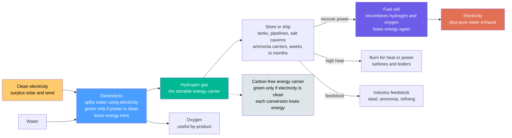

# 💧 Hydrogen and Fuel Cells: The Storable Carbon-Free Energy Carrier for Hard-to-Electrify Sectors

> [!abstract] TL;DR
> Hydrogen is not an energy *source* you dig up — it is an energy **carrier**, a "rechargeable fuel" you *manufacture*, store, and later cash back in for power. Run electricity through water and you split it into hydrogen and oxygen (**electrolysis**); later, combine that hydrogen back with oxygen in a **fuel cell** and you recover electricity, with **pure water as the only exhaust** — no carbon at all. So hydrogen is like a battery you can pour into a tank: use cheap surplus **solar and wind** to make it, stockpile it for weeks or months, then convert it back to electricity, burn it for heat, or feed it to industry. Its superpower is reaching the places electricity struggles to go — making **steel** and **ammonia/fertilizer**, fueling **ships** and perhaps planes, and storing clean energy across **seasons**. Two hard truths keep it honest. First, **efficiency**: every conversion loses energy, so the full power→hydrogen→power round-trip returns only about **30–40%** of what you put in (versus ~90% for a battery) — which is exactly why hydrogen belongs to the *hard* jobs electrification cannot easily do, not to jobs a wire or a battery already does well. Second, **the color matters**: only **green** hydrogen (made from clean electricity) truly helps the climate — the vast majority made today is **grey**, split from fossil gas while venting CO2. Understanding electrolysis → storage → fuel cell, the "colors" (only green helps), and the efficiency penalty (why it is for hard-to-abate uses, not everything) is the key to hydrogen's real, focused role in decarbonization — beyond the hype.

## Intuition

**Analogy:** Think of hydrogen as a **rechargeable fuel** — a battery you can fill a tank with. A normal battery stores electricity as chemistry *inside* a sealed box you cannot pour out. Hydrogen breaks that box open: you spend electricity to "charge" ordinary water — splitting it into hydrogen gas and oxygen — and then you can bottle that hydrogen, pipe it across a country, or stash it underground for six months. When you want the energy back, you let the hydrogen recombine with oxygen from the air inside a **fuel cell**, and out comes electricity again, with nothing but **clean water dripping from the tailpipe**. Charge with surplus sunshine on a windy spring afternoon; discharge on a still, freezing December night. The "electricity" has been turned into a *storable, shippable gas* and back — carbon never enters the loop.

That is hydrogen's whole appeal and its whole catch, in one breath. The **appeal**: unlike electricity, which is maddeningly hard to store in bulk and impossible to stuff into a blast furnace, hydrogen is a physical fuel — you can hoard it for seasons, sail it across oceans, burn it for furnace-grade heat, or react it into steel and fertilizer. It reaches the corners of the economy a copper wire never will. The **catch**: every time you convert energy from one form to another you pay a toll, and hydrogen makes you pay *twice* — once to split the water, once to recombine it — so more than half your original electricity vanishes as waste heat before it comes back as power. A battery, charging and discharging directly, keeps nearly all of it. So hydrogen is not a universal replacement for electricity; it is the **specialist tool** for the jobs electrons cannot reach. And one more thing decides whether any of it helps the planet: the *color*. Hydrogen made from clean electricity is **green** and genuinely carbon-free; hydrogen cracked out of natural gas — which is how almost all of it is made today — is **grey**, and pumps CO2 into the sky just like the fossil fuel it came from.

---

## How It Works

### Core Mechanics

Hydrogen is an **energy vector**: a middleman you *make* from a primary source, *store*, and *use*. Follow the loop from clean electron to recovered power:

1. **Production — split water with electricity (electrolysis).** An **electrolyzer** passes a current through water, driving the reaction $2\,\text{H}_2\text{O} \rightarrow 2\,\text{H}_2 + \text{O}_2$. If the electricity is renewable, the result is **green hydrogen** — the clean route, carbon-free end to end. Three electrolyzer families dominate: **alkaline** (mature, cheap, liquid-KOH), **PEM** (proton-exchange membrane; compact, fast-responding, pairs well with variable renewables, but uses scarce platinum-group catalysts), and **solid-oxide (SOEC)** (runs hot, ~700–850 °C, and can borrow *heat* to cut the electricity bill). This step alone loses ~25–35% of the input energy.

2. **The alternative (dirty) routes — the "hydrogen colors."** Today ~95% of the world's hydrogen is **not** made from water at all. **Grey hydrogen** comes from **steam-methane reforming (SMR)** of natural gas ($\text{CH}_4 + 2\,\text{H}_2\text{O} \rightarrow \text{CO}_2 + 4\,\text{H}_2$) and emits ~10 kg CO2 per kg H2. **Blue hydrogen** is grey plus **carbon capture** bolted on, cutting (not eliminating) those emissions. **Turquoise** splits methane by pyrolysis into hydrogen and *solid* carbon. Only **green** (and, partially, low-leakage blue) actually helps the climate — the color is not marketing, it is the carbon footprint.

3. **Storage and transport — hoard the gas.** Hydrogen is compressed to **350–700 bar**, liquefied at a brutal **–253 °C (20 K)**, stored in **salt caverns** for seasonal-scale volumes, or chemically bound into **carriers** like **ammonia** or liquid organic hydrogen carriers (LOHCs) for shipping. This is the step that turns "electricity you must use now" into "energy you can keep for months" — hydrogen's decisive advantage over batteries.

4. **Use — cash the hydrogen back in.** The flagship device is the **fuel cell**: an electrochemical cell that recombines $2\,\text{H}_2 + \text{O}_2 \rightarrow 2\,\text{H}_2\text{O}$ and delivers the released energy *directly as electricity* — the exact reverse of electrolysis — with **water as the only exhaust**. **PEMFCs** power vehicles (quiet, quick-starting); **SOFCs** run hot and efficient for stationary power. Alternatively, hydrogen can be **burned** in turbines and boilers for heat and power, or used as a **chemical feedstock** to make steel (direct reduction of iron) and ammonia. Recovering electricity loses another ~40–50%.

5. **The unavoidable arithmetic.** Multiply the losses: electrolysis (~70%) × compression/storage (~90%) × fuel cell (~55%) ≈ **~35% round-trip**. A lithium battery returns ~90%. That gap is not a flaw to be engineered away — it is thermodynamics charging you a toll at every conversion — and it is the single most important fact governing *where hydrogen makes sense*: reserve it for the **hard-to-electrify** jobs (industrial feedstock, high heat, heavy transport, seasonal storage), and let wires and batteries handle everything they already do better.

### Flow / Architecture



---

## Key Concepts

### Secondary Level

- **Hydrogen is a "made" fuel, not a mined one.** There are no hydrogen wells. Hydrogen is a way to *carry* energy — you spend energy to make it, then get energy back later. Think of it as a rechargeable fuel, or a battery you can pour into a tank.
- **Split water to make it.** Run electricity through water and it breaks apart into hydrogen and oxygen gas. That splitting is called **electrolysis**. If the electricity came from solar or wind, the hydrogen is clean.
- **A fuel cell gives the energy back.** A **fuel cell** does the reverse: it lets hydrogen and oxygen recombine and produces electricity, with only **pure water** coming out. No smoke, no carbon, and it is quiet.
- **You can also store it and ship it.** Because it is a gas, hydrogen can be squeezed into tanks and kept for months, or piped across a country — something ordinary electricity cannot do.
- **The color tells you if it is clean.** **Green** hydrogen is made from clean electricity and helps the climate. **Grey** hydrogen is made from natural gas and releases carbon dioxide — and that is how most hydrogen is made today.
- **The catch: it wastes energy.** Every step loses some energy, so making hydrogen and turning it back into electricity throws away more than half. That is why hydrogen is best saved for hard jobs — like making steel or fueling ships — that batteries and wires cannot easily do.

### Undergraduate Level

- **Carrier, not source — the energy-vector idea.** Like electricity itself, hydrogen stores and moves energy but must first be *produced* from a primary source. Its value is **versatility**: one carrier can become electricity (fuel cell), heat (combustion), or molecules (feedstock).
- **The physics of the fuel.** Hydrogen has an enormous energy density *per kilogram* (~120 MJ/kg lower heating value, ~3× gasoline) but a terrible density *per liter* — as a gas it is extremely bulky, which is why it must be compressed to 350–700 bar, liquefied at 20 K, or carried as ammonia. **Storage and transport, not combustion, are hydrogen's hardest engineering problems.**
- **Electrolyzer families.** *Alkaline* (mature, low-cost, tolerant), *PEM* (compact, fast dynamic response ideal for variable renewables, but needs Pt/Ir catalysts), and *solid-oxide (SOEC)* (high-temperature, highest electrical efficiency because it substitutes heat for some electricity). Real-world electrolysis efficiency is ~65–75%.
- **The fuel cell is not a heat engine.** A fuel cell converts chemical energy to electricity **electrochemically and directly**, so it is *not* bound by the Carnot limit that caps combustion plants — practical efficiencies reach ~50–60%. **PEMFC** (low-temp, vehicles) and **SOFC** (high-temp, stationary, can do combined heat and power) are the workhorses.
- **The hydrogen colors — a carbon-intensity code.** *Grey* (SMR of gas, ~10 kg CO2/kg H2), *blue* (grey + CCS, ~1–4 kg), *green* (renewable electrolysis, near zero), *turquoise* (methane pyrolysis to solid carbon), *pink* (nuclear-powered electrolysis). **Only green and genuinely low-leakage blue advance decarbonization.**
- **Round-trip efficiency vs batteries.** Power→H2→power returns only ~30–40%; a lithium battery returns ~90% and pumped hydro ~80%. So for *short* daily cycling, batteries crush hydrogen. Hydrogen wins only where its *storability at scale and over time* outweighs the round-trip penalty — long-duration and seasonal storage, or non-electric end uses.
- **Where hydrogen actually wins.** **Industrial feedstock and high heat** (green hydrogen for **ammonia/fertilizer**, **steel** via hydrogen direct-reduced iron replacing coke, refining, chemicals); **heavy transport** (shipping via hydrogen/ammonia, long-haul, possibly aviation via e-fuels); and **long-duration / seasonal storage** (power-to-gas: bank a summer's surplus renewables for winter). These are precisely the "hard-to-abate" sectors electrification struggles with.

### Graduate Level

- **Thermodynamics of water splitting.** For $\text{H}_2\text{O} \rightarrow \text{H}_2 + \tfrac{1}{2}\text{O}_2$, the *reversible* work is $\Delta G^\circ = 237$ kJ/mol, corresponding to a minimum cell voltage $E_{rev} = \Delta G / (nF) = 1.23$ V. But the *enthalpy* is $\Delta H^\circ = 286$ kJ/mol, giving a **thermoneutral voltage** of $1.48$ V; the difference $T\Delta S$ can be supplied as **heat**. This is why high-temperature **SOEC** electrolysis needs *less electricity* — it lets thermal energy carry the entropic term — and why efficiency must always be quoted against a stated basis (**HHV vs LHV**).
- **Overpotentials and catalysis.** Real electrolyzers run well above 1.48 V because of **activation overpotentials** (sluggish oxygen-evolution kinetics at the anode dominate), **ohmic** losses, and **mass-transport** limits. PEM anodes rely on scarce **iridium** for OER; alkaline uses nickel. Fuel cells show the mirror-image **polarization curve** — activation, ohmic, and concentration-loss regions below the Nernst potential — with slow **oxygen-reduction (ORR)** kinetics as the key loss, driving platinum loading and cost. Catalysis is the central materials frontier for both.
- **The exergy cascade.** Track *availability*, not just energy: electrolysis dissipates exergy in overpotentials; compression/liquefaction (liquefaction alone can consume ~30% of hydrogen's energy content) adds more; the fuel cell dissipates again in its irreversibilities. The ~35% round-trip is the compounded product of these second-law losses — a structural feature, not an engineering oversight.
- **The molecule fights back.** Hydrogen's tiny molecule causes **leakage** through seals and welds, **embrittlement** of steels and pipelines, and — being an *indirect* greenhouse gas (it extends atmospheric methane's lifetime via OH depletion) — carries a nonzero warming penalty when it escapes. Its low volumetric density forces energy-costly compression, cryogenics, or chemical carriers, none free.
- **Sector coupling and power-to-X.** Green hydrogen is the linchpin of **coupling** the power sector to industry and transport: surplus renewables → electrolysis → hydrogen → **ammonia** (decarbonizing Haber–Bosch, ~1–2% of global CO2), **DRI steel** (replacing coking coal), **e-fuels** (hydrogen + captured CO2 → synthetic kerosene), and **seasonal storage** in salt caverns. It converts a stranded, must-use-now electricity glut into a storable, tradable commodity.
- **The economics and the "hydrogen ladder" debate.** **Levelized cost of hydrogen (LCOH)** is dominated by electricity price, electrolyzer capex, and **capacity factor** (cheap power is worthless if the electrolyzer sits idle). Green H2 remains costlier than grey but is falling as electrolyzers scale down a learning curve. The influential critique — Liebreich's **"clean hydrogen ladder"** — argues hydrogen is *inevitable* for feedstock, steel, ammonia, and shipping (top rungs) but a *poor* choice for cars and home heating (bottom rungs) where electrification wins on efficiency and cost. The rational role is **narrow and high-value**, not a wholesale "hydrogen economy" replacing electricity.
- **Hype versus the focused case.** Successive "hydrogen economy" waves overpromised hydrogen everywhere. The mature view triangulates: hydrogen is *essential* precisely where nothing else works (hard-to-abate feedstock/heat, long-haul heavy transport, inter-seasonal storage) and *inferior* where electrons already win. Matching the tool to the task — not the round-trip efficiency in isolation — is the whole game.

---

## Python Demo

```python
# Hydrogen: WHY it is a specialist tool, in one figure. numpy + matplotlib only.
#
#   (a) POWER-TO-HYDROGEN-TO-POWER round-trip efficiency, as a WATERFALL of losses:
#       electrolysis (~70%) -> compression/storage (~90%) -> fuel cell (~55%)
#       leaves only ~35% of the original electricity. Batteries return ~90%.
#       => hydrogen suits LONG-DURATION / hard-to-electrify uses, not daily cycling.
#   (b) HYDROGEN COLORS: carbon intensity of each production route -- only GREEN
#       (and low-leakage BLUE) actually help the climate; GREY dominates today.
#   (c) END-USE MAP: where hydrogen WINS (steel, ammonia, shipping, seasonal storage)
#       vs where direct ELECTRIFICATION wins (cars, heating, short storage).
import numpy as np
import matplotlib.pyplot as plt

# ---------------- (a) round-trip efficiency waterfall ----------------
eta_electrolysis = 0.70    # split water with electricity
eta_storage      = 0.90    # compression / storage / transport
eta_fuelcell     = 0.55    # recombine H2 + O2 -> electricity
stages = ["Electricity\nin", "after\nelectrolysis", "after\ncompression",
          "after\nfuel cell"]
level  = np.array([1.0,
                   eta_electrolysis,
                   eta_electrolysis * eta_storage,
                   eta_electrolysis * eta_storage * eta_fuelcell]) * 100
roundtrip = level[-1]
battery_rt = 90.0          # lithium-ion round trip for comparison

print("POWER -> HYDROGEN -> POWER round-trip")
print(f"  electrolysis {eta_electrolysis*100:.0f}%  x  storage {eta_storage*100:.0f}%"
      f"  x  fuel cell {eta_fuelcell*100:.0f}%")
print(f"  => hydrogen round-trip ~ {roundtrip:.0f}%   vs battery ~ {battery_rt:.0f}%")
print(f"  more than HALF the input electricity is lost -> use for HARD jobs only\n")

# ---------------- (b) hydrogen colors: carbon intensity ----------------
colors_name = ["Grey\n(gas, SMR)", "Blue\n(gas + CCS)", "Turquoise\n(pyrolysis)",
               "Green\n(renewables)"]
carbon_int  = [10.0, 3.0, 3.5, 0.5]     # kg CO2 per kg H2 (illustrative)
bar_col     = ["#7f8c8d", "#4a9eff", "#48dbb4", "#2ecc71"]

# ---------------- (c) end-use: hydrogen vs electrification ----------------
uses  = ["Ammonia /\nfertilizer", "Steel (DRI)", "Seasonal\nstorage", "Shipping",
         "Aviation /\ne-fuels", "High-temp\nheat", "Long-haul\ntrucks",
         "Regional\nrail", "Home\nheating", "Short-duration\nstorage",
         "Passenger\ncars"]
# +1 = strongly favors HYDROGEN, -1 = strongly favors direct ELECTRIFICATION
score = np.array([1.0, 0.9, 0.9, 0.7, 0.6, 0.7, 0.2, -0.7, -0.8, -0.9, -0.9])
order = np.argsort(score)
uses  = [uses[i] for i in order]
score = score[order]
use_col = ["#2ecc71" if s > 0 else "#e17055" for s in score]

# ------------------------------- plotting -------------------------------
fig, (axA, axB, axC) = plt.subplots(1, 3, figsize=(18, 5.6))
fig.suptitle("Hydrogen is a SPECIALIST carrier: heavy round-trip losses, "
             "a color that decides its cleanliness, and a narrow winning niche",
             fontsize=13, fontweight="bold")

# (a) waterfall of the efficiency chain
xpos = np.arange(len(stages))
axA.bar(xpos, level, color=["#fdcb6e", "#4a9eff", "#00b894", "#6c5ce7"], width=0.6)
for x, lv in zip(xpos, level):
    axA.text(x, lv + 1.5, f"{lv:.0f}", ha="center", fontsize=10, fontweight="bold")
# loss arrows between stages
for i in range(len(level) - 1):
    axA.annotate("", xy=(i + 1, level[i + 1]), xytext=(i + 1, level[i]),
                 arrowprops=dict(arrowstyle="->", color="crimson", lw=1.6))
    axA.text(i + 1.02, (level[i] + level[i + 1]) / 2,
             f"-{level[i]-level[i+1]:.0f}", color="crimson", fontsize=8, va="center")
axA.axhline(battery_rt, color="#2d3436", ls="--", lw=1.4)
axA.text(0.05, battery_rt + 1.5, f"battery round-trip ~{battery_rt:.0f}",
         color="#2d3436", fontsize=8)
axA.set_xticks(xpos); axA.set_xticklabels(stages, fontsize=8)
axA.set_ylabel("energy remaining  [percent of input]")
axA.set_title(f"(a) Power to hydrogen to power\nround-trip only ~{roundtrip:.0f}, "
              f"vs ~{battery_rt:.0f} for a battery", fontsize=11)
axA.set_ylim(0, 105); axA.grid(alpha=0.3, axis="y")

# (b) hydrogen colors carbon intensity
axB.bar(colors_name, carbon_int, color=bar_col, width=0.65, edgecolor="k", lw=0.6)
for i, v in enumerate(carbon_int):
    axB.text(i, v + 0.25, f"{v:.1f}", ha="center", fontsize=9, fontweight="bold")
axB.axhline(0.5, color="#2ecc71", ls=":", lw=1.4)
axB.set_ylabel("carbon intensity  [kg CO2 per kg H2]")
axB.set_title("(b) The hydrogen 'colors'\nonly green truly helps the climate",
              fontsize=11)
axB.set_ylim(0, 11.5); axB.grid(alpha=0.3, axis="y")

# (c) end-use diverging bar
ypos = np.arange(len(uses))
axC.barh(ypos, score, color=use_col, edgecolor="k", lw=0.4)
axC.axvline(0, color="k", lw=1.0)
axC.set_yticks(ypos); axC.set_yticklabels(uses, fontsize=8)
axC.set_xlim(-1.15, 1.15)
axC.set_xlabel("favors electrification   <---   |   --->   favors hydrogen")
axC.set_title("(c) Match the tool to the task\nhydrogen for the hard-to-electrify",
              fontsize=11)
axC.text(0.62, 0.3, "H2 wins", color="#2ecc71", fontsize=9, fontweight="bold")
axC.text(-1.05, len(uses) - 1.3, "wires /\nbatteries win", color="#e17055",
         fontsize=9, fontweight="bold")
axC.grid(alpha=0.3, axis="x")

plt.tight_layout(rect=[0, 0, 1, 0.92])
plt.show()
```

Running this prints the round-trip arithmetic and draws three panels that together explain hydrogen's real role. **Panel (a)** is the **power→hydrogen→power waterfall**: each conversion — electrolysis (~70%), compression/storage (~90%), fuel cell (~55%) — shaves off energy in red, leaving only **~35%** of the electricity you started with, against a battery's dashed **~90%** line. That single picture is why hydrogen is a *poor* choice for short daily cycling and a *sensible* one only where storability at scale outweighs the loss. **Panel (b)** decodes the **hydrogen colors**: grey hydrogen from natural gas emits ~10 kg CO2 per kg H2, blue trims that with capture, and only **green** (renewable electrolysis) approaches zero — proof that "hydrogen" is not automatically clean; the *color*, i.e. the production route, decides. **Panel (c)** is the **end-use map**: hydrogen wins decisively for ammonia, steel, seasonal storage, and shipping (green bars, right) but loses to direct electrification for cars, home heating, and short-duration storage (orange bars, left) — the visual form of the "hydrogen ladder." The lesson threading all three: hydrogen is a **specialist carbon-free carrier**, and its value comes from *matching it to the hard jobs electrons cannot do*, not from deploying it everywhere.

---

## Real-World Applications

> **Example — green-hydrogen steelmaking, the flagship hard-to-abate case.** Making steel the old way runs iron ore through a blast furnace with **coking coal**, which chemically strips the oxygen from the ore and, in doing so, emits ~1.8 tonnes of CO2 per tonne of steel — roughly **7–8% of all global emissions** come from steel alone, and no amount of clean *electricity* removes it, because the coal is a **chemical reducing agent**, not just a heat source. Sweden's **HYBRIT** project (SSAB, LKAB, Vattenfall) and Germany's **H2 Green Steel / thyssenkrupp** efforts replace that coke with **green hydrogen**: hydrogen reduces the iron ore in a **direct-reduction (DRI)** shaft — $\text{Fe}_2\text{O}_3 + 3\,\text{H}_2 \rightarrow 2\,\text{Fe} + 3\,\text{H}_2\text{O}$ — so the by-product is **water vapor instead of carbon dioxide**, and the sponge iron is then melted in an electric arc furnace. This is hydrogen doing exactly what nothing else can: acting as a carbon-free *feedstock and reductant* for a process that is otherwise chemically wedded to fossil carbon. It embodies every idea in this note — green hydrogen from renewable electrolysis, used as a molecule (not just fuel), to decarbonize a genuinely hard-to-abate sector.

- **Ammonia and fertilizer — the biggest existing hydrogen market.** The **Haber–Bosch** process already consumes ~1–2% of world energy making ammonia (fertilizer) from hydrogen that is almost all **grey**. Swapping that grey hydrogen for **green** directly decarbonizes global food production, and ammonia doubles as a dense, shippable **hydrogen carrier** and a candidate marine fuel.
- **Fuel-cell vehicles and heavy transport.** **PEMFC** cars (Toyota Mirai, Hyundai Nexo) and, more durably, **fuel-cell buses, trucks, trains, and forklifts** use hydrogen where battery weight or fast refueling matters. **Shipping** and long-haul freight — hard for batteries on energy-density grounds — are the strongest transport cases, often via ammonia or methanol carriers.
- **Long-duration and seasonal energy storage (power-to-gas).** Projects store surplus summer renewables as hydrogen in **salt caverns** (e.g. the US ACES Delta / Utah hub, European HyStock) to be reconverted to power in winter — bridging the multi-week gap that batteries cannot economically span. This ties hydrogen to chemical and seasonal storage in a decarbonized grid.
- **Stationary fuel cells and combined heat and power.** **SOFC** systems (Bloom Energy, and Japan's residential ENE-FARM units) provide efficient on-site electricity and heat, valued for reliability and quiet, emission-free operation where the hydrogen or reformed fuel is available.
- **Blue hydrogen and refineries today.** Existing refineries and ammonia plants are the current hydrogen giants, running on grey SMR; adding **carbon capture** to make **blue** hydrogen is a nearer-term bridge (its climate value hinges on high capture rates and low upstream methane leakage) — the concrete link between hydrogen production and CO2 storage.

---

## Common Pitfalls

- **Calling hydrogen "clean" without asking its color.** Hydrogen is only as clean as its production route. Most hydrogen today is **grey** (from natural gas, emitting ~10 kg CO2/kg H2). A "hydrogen car" running on grey hydrogen can be *dirtier* than a diesel. Always ask: green, blue, or grey?
- **Ignoring the round-trip efficiency penalty.** Power→H2→power returns only ~30–40%. Proposing hydrogen for tasks a **battery** (~90%) or a **wire** already handles wastes over half your clean electricity. Hydrogen's efficiency loss is only justified where its storability or its non-electric end use is essential.
- **Treating hydrogen as a drop-in for natural gas everywhere.** Hydrogen's tiny molecule **leaks**, **embrittles** steel pipelines, and has ~1/3 the volumetric energy of methane, so existing gas infrastructure cannot simply switch over. Blending and dedicated H2 pipelines have real materials and safety limits.
- **Forgetting storage and transport are the hard part.** The chemistry of the fuel cell is elegant; getting hydrogen *to* it is not. Compression to 700 bar, liquefaction at 20 K (which itself eats ~30% of the energy), or conversion to ammonia and back all impose cost and loss that dominate real projects. Underestimating this sinks business cases.
- **Confusing "hydrogen economy" hype with hydrogen's real niche.** Hydrogen will **not** heat most homes or power most cars — electrification wins those on efficiency and cost. Overselling hydrogen as a universal fuel discredits its genuinely irreplaceable roles (steel, ammonia, shipping, seasonal storage). Match the tool to the task.
- **Assuming blue hydrogen is automatically low-carbon.** Blue hydrogen's climate benefit collapses if the capture rate is modest or if **upstream methane leakage** is high. Its footprint must be assessed end-to-end, not assumed from the "capture" label.
- **Ignoring the electricity source and capacity factor for green H2.** Green hydrogen made from a **grid still running on gas** is not green, and an electrolyzer running only a few hours a day produces very expensive hydrogen. Green H2's economics live or die on **cheap, abundant, high-utilization clean power** — the same surplus renewables that make it worthwhile.

---

## Related Concepts

This note anchors the **energy-storage** half of the Nuclear & Energy Storage pillar (S04) of the Energy Systems vault, and it is best read alongside its section siblings, referenced here in prose. *Batteries_and_Electrochemical_Storage* is hydrogen's efficiency-champion rival — the ~90% round-trip battery that beats hydrogen for short daily cycling, leaving hydrogen the long-duration and non-electric jobs; *Thermal_and_Chemical_Energy_Storage* places hydrogen within the broader family of chemical energy stores (power-to-gas as a chemical battery) and inter-seasonal options; *Nuclear_Fusion_Energy* is a complementary carbon-free *source* whose surplus could one day power **pink** electrolysis; *Sector_Coupling_and_Electrification* is the systems frame for exactly when to run a wire (electrify) versus make a molecule (hydrogen); and *The_Energy_Transition_and_Net_Zero* is where hydrogen's focused role — filling the gaps electrification cannot reach — is weighed against every other decarbonization lever. The links below point to notes that already exist elsewhere in the vault.

**Energy-systems foundations — carrier, conversion, and the efficiency toll**
- [[Energy_Systems_Overview]] — the find-convert-store-deliver energy chain; hydrogen is a *carrier* that lives in the storage-and-delivery links, not a primary source
- [[Forms_and_Conversion_of_Energy]] — the carrier-versus-source distinction and the chemical-to-electrical conversions that electrolysis and fuel cells embody
- [[Thermodynamics_of_Energy_Conversion]] — the second-law reason every conversion loses energy, which compounds into hydrogen's ~35% round-trip; also why a fuel cell, being electrochemical, escapes the Carnot limit that caps combustion plants

**The electrochemistry and catalysis that make it work**
- [[Electrochemistry]] — the redox half-reactions, cell voltages, and Nernst relation behind *both* the electrolyzer (electricity splits water) and the fuel cell (water-forming reaction yields electricity) — one device run forwards and backwards
- [[Catalysis_and_Heterogeneous_Reactions]] — the platinum-group and nickel catalysts (and their sluggish oxygen kinetics) that govern electrolyzer and fuel-cell efficiency, and the steam-methane-reforming catalysis behind grey hydrogen

**Production, colors, and the fossil link**
- [[Carbon_Capture_Utilization_and_Storage]] — the CCS that converts *grey* hydrogen into *blue*, coupling the hydrogen economy to CO2 storage; the two notes reference each other on the pre-combustion / SMR route
- [[Solar_Photovoltaics]] — the cheap surplus solar (and wind) whose curtailed midday glut is the natural feedstock for green-hydrogen electrolysis
- [[Renewable_Energy_Integration]] — the grid-side view of using variable renewables to run electrolyzers, turning must-use-now electricity into a storable gas

---

## Review Questions

**Secondary**
1. Explain, in your own words, why hydrogen is described as an energy *carrier* rather than an energy *source*, using the "rechargeable fuel" idea. Then describe the two key devices — the **electrolyzer** that *makes* hydrogen and the **fuel cell** that *uses* it — and say what comes out of a fuel cell's tailpipe. Finally, explain what the "colors" green and grey tell you about a batch of hydrogen, and why the color matters for the climate.

**Undergraduate**
2. A grid operator has a large midday surplus of solar electricity it would otherwise curtail. (a) Trace the energy through a power→hydrogen→power loop with electrolysis at 70%, storage/compression at 90%, and a fuel cell at 55%, and compute the round-trip efficiency; compare it to a lithium battery at ~90%. (b) Given that gap, explain *why* the operator might still choose hydrogen for **seasonal** storage but a battery for **overnight** storage. (c) The same hydrogen could instead be sold to a fertilizer plant currently using grey hydrogen. Explain why this "non-electric" use may be a *better* use of the hydrogen than reconverting it to power, referencing the round-trip loss.

**Graduate**
3. A country is drafting its hydrogen strategy. (a) Using the thermodynamics of water splitting ($\Delta G^\circ = 237$ kJ/mol, $\Delta H^\circ = 286$ kJ/mol), explain the difference between the reversible voltage (1.23 V) and the thermoneutral voltage (1.48 V), and why **high-temperature SOEC** electrolysis can reduce the *electricity* demand per kilogram of hydrogen. (b) Apply the "hydrogen ladder" logic to rank these four uses from strongest to weakest case for hydrogen — passenger cars, ammonia synthesis, home heating, steelmaking — and justify each ranking in terms of both round-trip efficiency and the availability of an electric alternative. (c) A minister proposes subsidizing **blue** hydrogen as a bridge. State the two conditions (on capture rate and on upstream methane leakage) that must hold for blue hydrogen to be genuinely low-carbon, and explain the "captured versus avoided" trap that makes a headline capture percentage potentially misleading.

---

## Sources

- J. Larminie & A. Dicks — *Fuel Cell Systems Explained*, 2nd ed. (Wiley, 2003) — the standard engineering text on fuel-cell thermodynamics, polarization curves, PEMFC and SOFC design
- J. Tester, E. Drake, M. Driscoll, M. Golay & W. Peters — *Sustainable Energy: Choosing Among Options*, 2nd ed. (MIT Press, 2012) — hydrogen and fuel cells within the full systems view of energy carriers, storage, and their trade-offs
- International Energy Agency — *The Future of Hydrogen* (IEA, 2019) — the landmark assessment of production routes, the "colors," costs, end-use sectors, and the realistic role of hydrogen in decarbonization
- IRENA — *Green Hydrogen: A Guide to Policy Making* and *Green Hydrogen Cost Reduction* (IRENA, 2020–2022) — electrolyzer technology, LCOH drivers, learning curves, and the hard-to-abate use cases
- M. Liebreich — "The Clean Hydrogen Ladder" (BloombergNEF / Liebreich Associates, 2021) — the influential framework ranking hydrogen end uses from unavoidable to uncompetitive versus electrification

---

#energy-systems #hydrogen #fuel-cells #electrolysis #power-to-gas
