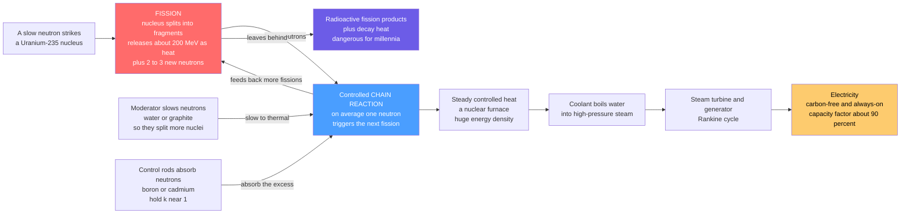

# ⚛️ Nuclear Fission Power: Splitting Atoms for Firm, Carbon-Free Electricity

> [!abstract] TL;DR
> Nuclear fission extracts a staggering amount of energy from a tiny amount of matter: a single **fuel pellet the size of a fingertip holds roughly as much energy as a ton of coal**. The trick is splitting heavy atoms — fire a slow neutron at a **uranium-235** (or **plutonium-239**) nucleus and it splits (**fission**), converting a whisker of mass into ~**200 MeV** of energy ($E = mc^2$) plus **2–3 fresh neutrons** and radioactive fragments; those neutrons split more nuclei — a self-sustaining **chain reaction**. The reactor's entire job is to hold that chain reaction ticking at a **steady, controlled pace** (multiplication factor $k \approx 1$ — not runaway, not dying) to make **heat**, which boils water to spin a Rankine turbine, exactly like a coal plant but with a nuclear furnace instead of a fire. The payoff is immense: **carbon-free electricity, running 24/7 regardless of weather, from almost no fuel** — the highest-**capacity-factor** (~90%), most **energy-dense**, **firm** clean source we have. The catches are equally distinctive: **radioactive waste** dangerous for millennia, **decay heat** that demands cooling even after shutdown, the **rare-but-catastrophic accident** (Three Mile Island, Chernobyl, Fukushima), the **weapons-proliferation** link, and **eye-watering, escalating capital cost** with long build times. Nuclear is the most concentrated, reliable clean energy humanity has built — and the most feared.

## Intuition

**Analogy:** Imagine standing at the top of a tall staircase holding a single sugar cube, and being told that letting it fall down the steps will release as much energy as burning a wheelbarrow of firewood. That is the strangeness of nuclear fission: **the energy is not in the chemistry of the atom's outer electrons (that is fire), it is locked in the nucleus itself** — a million times deeper. Now imagine that when the sugar cube hits the first step, it not only releases its energy but *knocks two more sugar cubes off the shelf*, which each knock off two more, and so on. That runaway cascade is a **chain reaction**. Left alone it doubles and doubles in a blink — that is a bomb. But if you station catchers on the staircase who grab *just enough* falling cubes so that on average **exactly one** goes on to trigger the next fall, the cascade holds a steady, controllable rhythm, releasing heat at a constant rate for years. That steady rhythm is a **nuclear reactor**.

Everything else is a conventional power plant wearing a strange hat. The controlled cascade makes **heat**; the heat boils water; the steam spins a turbine; the turbine spins a generator; you get electricity. Swap the coal furnace of an ordinary steam plant for a reactor core and you have a nuclear plant — same boiling water, same turbine, just a different fire. The payoff for using a nuclear "fire" is enormous: a fingertip of fuel replaces a train-car of coal, it emits no carbon, and it runs day and night in any weather. But the strangeness has a dark side that ordinary fires do not: the spent cubes stay dangerously "hot" (radioactive) for thousands of years, they keep smoldering (**decay heat**) even after you stop the cascade so you must never stop cooling them, the same physics can be bent toward weapons, and building the machine safely enough to trust is breathtakingly expensive. Nuclear power is the sharpest bargain in energy — the most concentrated clean power we know how to make, wrapped around the deepest fears we hold.

---

## How It Works

### Core Mechanics

A fission reactor is a machine for holding a chain reaction at the knife-edge of **self-sustaining but not growing**, and harvesting the heat.

1. **Fission — mass becomes energy.** A **fissile** nucleus (**U-235**, **Pu-239**) that absorbs a slow neutron becomes unstable and splits into two mid-sized **fission fragments**, releasing ~**200 MeV** of energy plus **2–3 free neutrons** and gamma rays. The energy comes straight from **mass-energy equivalence** ($E = mc^2$): the products weigh about 0.1% less than the reactants, and that missing mass reappears as the kinetic energy of the flying fragments — which is simply **heat**. Per kilogram this is ~$8 \times 10^{13}$ J, millions of times the energy density of any chemical fuel.

2. **The chain reaction.** Each fission spits out 2–3 neutrons; if on average **exactly one** goes on to cause another fission, the reaction sustains itself. This balance is the **neutron multiplication factor** $k$: $k < 1$ **subcritical** (chain dies out), $k = 1$ **critical** (steady power — the operating point), $k > 1$ **supercritical** (power rises). The reactor's whole control problem is holding $k \approx 1$.

3. **The moderator — slow neutrons split better.** Fission-born neutrons are *fast* (~2 MeV), but U-235's appetite for neutrons (its fission cross-section) is hundreds of times larger for *slow, thermal* neutrons (~0.025 eV). A **moderator** — ordinary **water**, **heavy water**, or **graphite** — slows the neutrons by elastic collisions, dramatically raising the odds of the next fission. Most reactors are **thermal reactors** for this reason.

4. **Control rods — the throttle.** Rods of strongly neutron-absorbing material (**boron**, **cadmium**, **hafnium**) slide into the core to soak up neutrons and lower $k$; withdrawing them raises $k$. This is the throttle and the brake. Crucially, a small fraction (~0.65% for U-235) of neutrons are **delayed** — emitted seconds later by decaying fission fragments — which slows the reactor's response enough for mechanical control to be possible at all.

5. **The reactor as a heat source.** The controlled fissions heat the fuel; a **coolant** (pressurized water, boiling water, gas, or liquid metal) carries the heat out of the core and raises **steam**. From there it is a textbook **Rankine steam plant** — steam drives a turbine-generator, is condensed, and pumped back. The nuclear core simply **replaces the boiler's fire**. Because fuel and reactor materials cap the steam temperature lower than a fossil furnace, nuclear cycles run at ~33–37% thermal efficiency.

6. **Decay heat — why you can never fully switch off.** Even after the chain reaction is stopped (rods fully in, $k \ll 1$), the accumulated radioactive **fission products keep decaying**, generating ~**6–7% of full thermal power** at the instant of shutdown, falling over hours and days. For a large reactor that is still *hundreds of megawatts of heat* that **must** be removed, or the fuel overheats and melts. Losing this cooling is exactly what destroyed the cores at **Fukushima**.

### Flow / Architecture



---

## Key Concepts

### Secondary Level

- **The energy hides in the nucleus, not the flame.** Burning coal rearranges *electrons* (chemistry). Fission splits the *nucleus* itself, tapping a reservoir a million times deeper. That is why a fuel pellet the size of a fingertip carries as much energy as a ton of coal, and a golf-ball of uranium can power a person's whole lifetime of electricity.
- **Fission is splitting a heavy atom.** Fire a neutron at a uranium-235 atom and it splits into two smaller atoms, releasing energy **and 2–3 more neutrons**. Those neutrons hit more uranium atoms, which split and release still more neutrons — a self-feeding **chain reaction**.
- **A reactor is a chain reaction on a leash.** Let the chain reaction double freely and you get a bomb; let it fade and it dies. A reactor keeps it perfectly steady — a **moderator** slows the neutrons so they split atoms more easily, and **control rods** slide in to absorb the extra neutrons, holding the reaction at a constant simmer for years.
- **The reactor is just a strange furnace.** The steady chain reaction makes **heat**; the heat **boils water** into steam; the steam **spins a turbine**; the turbine spins a **generator** that makes electricity. It is a normal steam power plant with a nuclear fire instead of a coal fire.
- **The payoff: clean, always-on power from almost nothing.** Nuclear emits **no carbon**, runs **24 hours a day in any weather**, uses a tiny amount of fuel and land, and is the largest source of low-carbon electricity in history alongside hydro.
- **The catches: waste, accidents, cost, and fear.** The spent fuel stays dangerously radioactive for **thousands of years**; it keeps generating heat even after shutdown and must be cooled; a rare accident (**Chernobyl, Fukushima**) can be catastrophic; the technology is tied to weapons; and building plants safely is **very expensive and slow**. Statistically nuclear is among the safest energy sources per unit of electricity — but it is among the most feared.

### Undergraduate Level

- **Fissile vs fissionable, and enrichment.** **Fissile** nuclei (U-235, Pu-239, U-233) fission with *slow* neutrons; **fertile** nuclei (U-238, Th-232) do not fission usefully but can *breed* fissile material by capturing a neutron. Natural uranium is only **0.7% U-235** (99.3% U-238), so most reactors use **enriched** fuel (~3–5% U-235). Weapons need ~90% — the large enrichment gap between reactor fuel and weapons material is why a power reactor **cannot** explode like a bomb.
- **The multiplication factor and criticality.** $k_{eff}$ is the ratio of neutrons in one generation to the previous. $k<1$ subcritical, $k=1$ critical (steady), $k>1$ supercritical. The infinite-medium value factors as the **four-factor formula** $k_\infty = \eta \, \epsilon \, p \, f$ (reproduction, fast-fission, resonance-escape, thermal-utilization); a finite reactor loses neutrons to leakage, $k_{eff} = k_\infty \cdot P_{NL}$. **Critical mass** — the minimum fuel to reach $k=1$ — depends on geometry, enrichment, and neutron reflectors.
- **Moderation and cross-sections.** The thermal fission cross-section of U-235 is ~**584 barns** versus ~1 barn geometric — enormous. Moderators slow fast neutrons to thermal energies where this cross-section is huge. Good moderators are **light** (efficient energy transfer per collision) and **weakly absorbing**: ordinary water (needs enriched fuel), heavy water (can run on natural uranium), graphite.
- **Delayed neutrons make control possible.** If reactors relied only on **prompt** neutrons (emitted in ~$10^{-14}$ s), power would change on microsecond timescales — uncontrollable. But ~**0.65%** of U-235 neutrons are **delayed** (emitted seconds later by fission-product decay). Operating on the margin between prompt-subcritical and delayed-critical stretches the reactor's response to **seconds**, which is what lets control rods, and human operators, keep up.
- **Reactor types.** **PWR** (pressurized water) and **BWR** (boiling water) are **light-water reactors** — the dominant ~85% of the fleet; a PWR keeps its primary loop liquid under high pressure and boils a separate secondary loop, a BWR boils water directly in the core. **CANDU** (heavy-water) runs on **natural uranium** and refuels online. **Gas-cooled** (CO₂ or helium) and **liquid-metal fast** reactors round out the family.
- **The fuel cycle.** Mining and milling → **enrichment** (centrifuges) → fuel fabrication into ceramic UO₂ pellets in zirconium-alloy rods → irradiation in the reactor (~4–6 years, ~45–60 GWd/tonne **burnup**) → spent fuel. The **back end** is either **once-through** (store spent fuel, geological disposal — US, Sweden, Finland) or **reprocessing** (chemically recover unused uranium and plutonium for MOX fuel — France, Japan).
- **Firm, baseload, energy-dense.** Nuclear plants run near full output continuously with a **capacity factor ~90%** — the highest of any source — making them **firm/baseload/dispatchable** clean power, weather-independent (unlike wind and solar) and land-light. This is the same "firm clean" role geothermal plays, but at gigawatt scale.
- **Decay heat.** At shutdown, fission-product decay still produces ~**7%** of full thermal power, decaying roughly as $t^{-0.2}$: ~1–2% after an hour, still ~0.5% after a day. This heat **must be removed** by continuous cooling for weeks; a failure to do so (loss of coolant, station blackout) leads to fuel damage or **meltdown**.

### Graduate Level

- **Reactivity feedback and inherent safety.** Safe reactors are dominated by **negative feedback**. As fuel heats, **Doppler broadening** of U-238's resonance absorption peaks captures more neutrons, dropping reactivity almost instantly (the **fuel temperature / Doppler coefficient**) — a fast, physics-guaranteed brake. **Moderator/void coefficients** matter too: in a light-water reactor, boiling reduces moderation and drops power (**negative void coefficient** — stabilizing). The Soviet **RBMK** at Chernobyl had a **positive void coefficient** — voids *increased* reactivity — a design flaw central to the 1986 runaway.
- **Point kinetics and reactor period.** The **point-kinetics equations** couple prompt neutron population to delayed-neutron precursor concentrations. Reactivity $\rho = (k-1)/k$ measured in dollars ($\$1 = \beta$, the delayed fraction). Below **prompt critical** ($\rho < \beta$), the stable **reactor period** (e-folding time) is set by delayed neutrons and is manageably slow; **at or above prompt critical** ($\rho \ge \beta$) the reactor runs on prompt neutrons alone and power excursions become explosively fast — the boundary that must never be crossed.
- **Defense-in-depth and severe accidents.** Safety is layered: the ceramic fuel matrix, the **cladding**, the **reactor pressure vessel**, and the **containment building**, backed by redundant, diverse cooling systems. The design-basis threat is the **loss-of-coolant accident (LOCA)** and the residual **decay-heat removal** problem. **Three Mile Island (1979)** was a partial meltdown *contained* by the building (negligible release); **Chernobyl (1986)** combined a positive void coefficient, a flawed experiment, and *no Western-style containment*; **Fukushima (2011)** was a **station blackout** — the tsunami drowned the backup generators, decay-heat cooling was lost, and three cores melted. Modern **Gen III+** designs (AP1000, EPR) add **passive safety** — gravity- and convection-driven cooling that needs no power for days.
- **Back end: waste and its time horizon.** Spent fuel contains short-lived, intensely radioactive **fission products** (Cs-137, Sr-90 — dominate heat and hazard for ~300 years) and long-lived **transuranic actinides** (Pu, Am, Np — drive the million-year hazard). Strategies: **direct geological disposal** in stable rock (Finland's **Onkalo** is the first operating deep repository; the US **Yucca Mountain** was stalled politically) versus **reprocessing + partitioning & transmutation** to burn the long-lived actinides in fast reactors, cutting the hazard timescale to centuries. Waste **volume is small** (a lifetime of one person's nuclear electricity fits in a soda can), but its longevity and heat make disposal a genuine, unsolved-at-scale challenge.
- **Fast reactors, breeding, and thorium.** **Fast reactors** (no moderator, liquid-metal cooled) can **breed** more fissile Pu-239 from abundant U-238 (breeding ratio > 1), extending uranium resources ~60-fold, and can **transmute** actinide waste. The **thorium/U-233** cycle offers abundant fuel and less plutonium. The trade: fast/breeder systems raise **proliferation** concerns (separated plutonium) and engineering difficulty (sodium coolant reacts with water/air).
- **Economics — the real bottleneck.** Nuclear's cost is almost entirely **overnight capital cost** and **long construction time**, financed at interest; fuel and operations are cheap. Recent Western first-of-a-kind builds (Vogtle, Flamanville, Hinkley Point C) suffered massive overruns and delays ("**negative learning**"), while South Korea and China build more cheaply and on schedule. **Small Modular Reactors (SMRs)** bet on **factory-built, standardized** units to convert megaprojects into repeatable products, trading economy-of-scale for economy-of-*multiples* and passive safety.
- **Risk perception vs record.** Per unit of electricity, nuclear's mortality (including Chernobyl and Fukushima) is **comparable to wind and solar and far below fossil fuels** — coal's air pollution alone kills orders of magnitude more per TWh. The gap between this statistical safety and intense public fear (dread of radiation, catastrophic-but-rare accidents, weapons association, the **linear-no-threshold** low-dose debate) is itself a decisive factor in nuclear's contested role in decarbonization.
- **Gen IV and the frontier.** Six broad **Generation IV** families — molten-salt (MSR), sodium- and lead-cooled fast, high-temperature gas (for industrial heat and hydrogen), and supercritical-water — target passive safety, higher temperatures, better fuel use, and waste reduction. Combined with SMRs, they define the debate over whether fission can become cheap and flexible enough to complement intermittent renewables at scale.

---

## Python Demo

```python
# Nuclear fission power, numpy + matplotlib only.
#
#   (a) ENERGY DENSITY: the whole point of nuclear -- uranium fission releases
#       MILLIONS of times more energy per kilogram than any chemical fuel.
#       Computed from first principles (200 MeV per U-235 fission) on a LOG scale.
#   (b) THE CHAIN REACTION: neutron population over generations for k < 1
#       (subcritical, dies out), k = 1 (critical, steady -- the reactor's job),
#       and k > 1 (supercritical, grows without bound). Shows WHY control = k~=1.
#   (c) DECAY HEAT after shutdown (Wigner-Way): even with the chain reaction
#       stopped, fission products keep generating ~7% of full power, decaying
#       slowly -- why cooling can never stop (the Fukushima problem).
import numpy as np
import matplotlib.pyplot as plt

# ----------------------------------------------------------------------
# (a) Energy density -- U-235 fission from first principles
# ----------------------------------------------------------------------
NA   = 6.022e23          # atoms per mole
MeV  = 1.602e-13         # joules per MeV
E_fission = 200 * MeV    # ~200 MeV released per U-235 fission

atoms_per_kg_U235 = (1000.0 / 235.0) * NA          # atoms in 1 kg of U-235
u235_J_per_kg     = atoms_per_kg_U235 * E_fission  # J/kg if fully fissioned
u235_MJ_per_kg    = u235_J_per_kg / 1e6

# Chemical fuels (MJ/kg, typical specific energies)
fuels  = ["Wood", "Coal", "Crude oil", "Natural gas", "U-235\nfission"]
MJ_kg  = [16.0,   30.0,   42.0,        55.0,          u235_MJ_per_kg]
colors = ["#8d6e63", "#455a64", "#795548", "#0288d1", "#ff6b6b"]

print("ENERGY DENSITY")
print(f"  U-235 fully fissioned : {u235_MJ_per_kg:,.0f} MJ/kg "
      f"({u235_J_per_kg:.2e} J/kg)")
print(f"  vs coal (30 MJ/kg)    : {u235_MJ_per_kg/30.0:,.0f} x more energy per kg\n")

# ----------------------------------------------------------------------
# (b) Chain reaction -- neutron population N_n = N0 * k^n
# ----------------------------------------------------------------------
gens = np.arange(0, 41)
N0   = 1.0
cases = {"k = 0.95  subcritical (dies out)": (0.95, "#2a9d8f"),
         "k = 1.00  critical (steady)":      (1.00, "#4a9eff"),
         "k = 1.02  supercritical (grows)":  (1.02, "#e17055")}

# ----------------------------------------------------------------------
# (c) Decay heat after shutdown -- Wigner-Way approximation
#     P_decay/P0 = 0.0622 * (t**-0.2 - (t + t_op)**-0.2)
# ----------------------------------------------------------------------
t     = np.logspace(0, 7, 500)   # 1 s to 1e7 s (~4 months) after shutdown
t_op  = 1e8                       # ~3 years of operation before shutdown
decay = 0.0622 * (t**-0.2 - (t + t_op)**-0.2)   # fraction of full thermal power

# For a 3 GW-thermal reactor, decay heat in MW
P0_MW = 3000.0
marks = {"1 min": 60, "1 hour": 3600, "1 day": 86400, "1 week": 604800}
print("DECAY HEAT after shutdown (3 GW-thermal core)")
for name, ts in marks.items():
    f = 0.0622 * (ts**-0.2 - (ts + t_op)**-0.2)
    print(f"  {name:7s}: {f*100:4.2f}% of full power = {f*P0_MW:6.1f} MW still to cool")

# ----------------------------------------------------------------------
# Plot
# ----------------------------------------------------------------------
fig, ax = plt.subplots(1, 3, figsize=(18, 5.6))
fig.suptitle("Nuclear fission power: energy density, the controlled chain "
             "reaction, and decay heat", fontsize=13, fontweight="bold")

# --- (a) Energy density (log) ---
bars = ax[0].bar(fuels, MJ_kg, color=colors, edgecolor="white")
ax[0].set_yscale("log")
ax[0].set_ylabel("energy density  [MJ per kg]  (log scale)")
ax[0].set_title("(a) A fingertip of fuel = a ton of coal\nfission is millions of times denser")
for b, v in zip(bars, MJ_kg):
    txt = f"{v:,.0f}" if v < 1e4 else f"{v:.1e}"
    ax[0].text(b.get_x() + b.get_width()/2, v*1.4, txt,
               ha="center", fontsize=8, fontweight="bold")
ax[0].set_ylim(1, u235_MJ_per_kg*10)
ax[0].grid(alpha=0.3, axis="y", which="both")

# --- (b) Chain reaction ---
for label, (k, c) in cases.items():
    ax[1].plot(gens, N0 * k**gens, "o-", color=c, ms=3, lw=1.8, label=label)
ax[1].axhline(N0, color="gray", ls=":", lw=1)
ax[1].set_yscale("log")
ax[1].set_xlabel("neutron generation  n")
ax[1].set_ylabel("neutron population  N = N0 * k^n  (log)")
ax[1].set_title("(b) The reactor's job: hold k ~= 1\nnot a bomb (k>1), not dead (k<1)")
ax[1].legend(fontsize=8, loc="center left"); ax[1].grid(alpha=0.3, which="both")

# --- (c) Decay heat ---
ax[2].semilogx(t, decay*100, color="#6c5ce7", lw=2.2)
ax[2].fill_between(t, decay*100, alpha=0.15, color="#6c5ce7")
for name, ts in marks.items():
    f = 0.0622 * (ts**-0.2 - (ts + t_op)**-0.2)
    ax[2].plot(ts, f*100, "o", color="crimson", ms=5)
    ax[2].annotate(name, (ts, f*100), textcoords="offset points",
                   xytext=(4, 8), fontsize=7.5)
ax[2].set_xlabel("time after shutdown  [seconds]")
ax[2].set_ylabel("decay heat  [percent of full power]")
ax[2].set_title("(c) You can never switch it fully off\ndecay heat must be cooled for weeks")
ax[2].grid(alpha=0.3, which="both")

plt.tight_layout(rect=[0, 0, 1, 0.93])
plt.show()
```

Running this prints that a kilogram of fully fissioned U-235 releases about **82 million MJ/kg** — roughly **2.7 million times** the energy density of coal — the single fact that defines nuclear power. **Panel (a)** makes that gulf visible only because the axis is logarithmic; on a linear axis the chemical fuels would be an invisible sliver. **Panel (b)** shows the three fates of a chain reaction: at **k = 0.95 it dies out**, at **k = 1.02 it explodes upward**, and only at **k = 1.00 does it hold steady** — dramatizing that the reactor's entire control task is pinning $k$ to 1 (which delayed neutrons make humanly possible). **Panel (c)** drives home the counterintuitive danger: even after the rods slam in and the chain reaction stops, **~7% of full power keeps pouring out as decay heat** — hundreds of megawatts in a large core — falling only slowly over hours and days, which is *why* cooling must never stop and why losing it (Fukushima) is catastrophic.

---

## Real-World Applications

> **Example — the Pressurized Water Reactor (PWR), the workhorse of the fleet.** In a PWR, ceramic **UO₂ pellets** (~4–5% U-235) stacked in zirconium-alloy rods form the core, submerged in **ordinary water** that is both **coolant and moderator**, held at ~155 bar so it stays liquid at ~320 °C. This **primary loop** carries fission heat to a **steam generator**, where a physically separate **secondary loop** boils into steam that drives a Rankine turbine-generator — keeping radioactive water away from the turbine hall. **Control rods** of boron/cadmium and **boric acid** dissolved in the coolant trim reactivity; the strongly **negative fuel-temperature (Doppler) coefficient** provides an instant, physics-guaranteed brake against power surges. A single unit delivers ~1 GW of carbon-free electricity at ~90% capacity factor for 60+ years. Every concept in this note — enrichment, moderation, criticality control, the Rankine heat sink, decay-heat cooling, containment — is embodied in this one machine, the most-built power reactor in history.

- **France — a decarbonized grid at national scale.** France generates ~**70% of its electricity from nuclear** (a fleet of standardized PWRs built rapidly in the 1970s–80s after the oil shocks), giving it among the **lowest-carbon and cheapest** grid electricity in Europe — the clearest proof that fission can decarbonize a large economy's power.
- **Naval propulsion.** Nuclear-powered **submarines and aircraft carriers** use compact, highly-enriched PWRs that run for years or decades without refueling — the reactor's extreme energy density gives near-unlimited range and lets submarines stay submerged indefinitely.
- **Fukushima Daiichi (2011) — the decay-heat lesson.** A magnitude-9 earthquake safely scrammed the reactors (chain reaction stopped in seconds), but the ensuing **tsunami flooded the backup diesel generators**, causing a **station blackout**. With no power to run cooling pumps, **decay heat** boiled off the water, exposed and melted three cores, and zirconium-steam reactions produced hydrogen that exploded — a textbook demonstration that *stopping fission is not enough; you must keep cooling*.
- **Chernobyl (1986) — the design lesson.** A reckless test drove an **RBMK** reactor with a **positive void coefficient** and no Western-style containment into a prompt-critical power excursion; the graphite moderator caught fire and dispersed fission products widely — the defining case of how design flaws (positive feedback, no containment) turn an accident into a catastrophe.
- **Small Modular Reactors (SMRs).** Designs like NuScale, GE-Hitachi BWRX-300, and Rolls-Royce SMR aim to **factory-build** standardized ~50–300 MW units with **passive safety**, betting that repeatable manufacturing tames the capital-cost and construction-delay problems that plague gigawatt megaprojects.
- **Advanced / Gen IV demonstrators.** Molten-salt reactors, sodium-cooled fast reactors (TerraPower's Natrium), and high-temperature gas reactors target passive safety, waste reduction via **breeding/transmutation**, and high-temperature **industrial heat and hydrogen** production beyond just electricity.

---

## Common Pitfalls

- **Thinking a power reactor can explode like a bomb.** It cannot. A bomb needs ~**90%** enriched U-235 assembled supercritical in microseconds; reactor fuel is ~**3–5%** enriched and physically cannot achieve a nuclear explosion. The worst reactor accidents are *steam/hydrogen explosions and meltdowns*, not nuclear detonations — a crucial distinction constantly blurred in public discussion.
- **Assuming you can switch a reactor "off" instantly.** Inserting the control rods stops the *chain reaction* but not the **decay heat** — ~7% of full power keeps flowing from decaying fission products and must be cooled for weeks. Ignoring this is precisely the failure mode of Fukushima; a reactor is never truly "off."
- **Treating all reactor designs as equivalent.** Safety depends critically on **reactivity feedback**. Light-water reactors have a *negative* void coefficient (boiling reduces power — self-stabilizing); the Soviet RBMK had a *positive* one (self-amplifying). Generalizing "Chernobyl proves nuclear is unsafe" ignores that its specific flaw is absent from and forbidden in Western designs.
- **Misjudging the waste by volume vs. by longevity.** Nuclear waste is remarkably **small in volume** (all US spent fuel would cover one football field a few meters deep) but the real problem is **longevity** — long-lived actinides stay hazardous for ~10⁴–10⁵ years, demanding geological disposal. Arguments that fixate on either volume or longevity alone miss the point.
- **Confusing nameplate capacity with delivered energy.** Nuclear's ~**90% capacity factor** means it actually *delivers* close to its rated power around the clock — unlike wind (~35%) or solar (~15–25%). Comparing plants by nameplate MW without capacity factor badly understates nuclear's real energy contribution and its **firm/baseload** value.
- **Forgetting delayed neutrons when reasoning about control.** With prompt neutrons alone, reactor power would change on microsecond timescales — impossible to control. The ~0.65% **delayed** fraction stretches the response to *seconds*. Reasoning about "criticality" without distinguishing **delayed-critical** (controllable) from **prompt-critical** (runaway) misunderstands why reactors are operable at all.
- **Underestimating *or* overestimating the risk.** Per TWh, nuclear is among the **safest** sources (far below fossil fuels), yet it carries genuine **catastrophic tail risk**, waste, and proliferation concerns. Both dismissing nuclear as uniquely deadly and dismissing its real hazards as trivial are errors; the honest position weighs a very low expected harm against rare high-consequence events.
- **Ignoring proliferation and cost, the true constraints.** The physics of fission is proven and safe designs exist; the binding obstacles to expansion are **capital cost/build time** and the **proliferation** link (enrichment and reprocessing produce weapons-usable material). Debating nuclear purely on reactor safety, while ignoring economics and proliferation, misses what actually limits it.

*(Sibling notes in this Nuclear & Energy Storage section and across the Energy Systems vault — Nuclear_Fusion_Energy for the complementary "other" nuclear path that fuses light nuclei instead of splitting heavy ones, Steam_and_Rankine_Power_Plants for the identical turbine/condenser power block the reactor feeds, Geothermal_Energy as the other firm, weather-independent clean baseload source, The_Electric_Power_Grid for how firm nuclear complements intermittent renewables, and Energy_Policy_and_Decarbonization for the contested role of nuclear in climate strategy — together frame fission as one firm, carbon-free node in the whole energy system.)*

---

## Related Concepts

**The nuclear physics beneath the power plant**
- [[Nuclear_Reactions_Fission_Fusion]] — the physics deep-dive on the fission reaction itself: Q-values, the ~200 MeV per event, cross-sections, the four-factor formula, and the binding-energy curve this note uses as a "black box" heat source
- [[Nuclear_Structure]] — the binding-energy-per-nucleon curve (peaking at iron-56) that explains *why* splitting heavy nuclei like uranium releases energy at all
- [[Radioactive_Decay]] — the decay of fission products that produces both the long-lived **waste hazard** and the **decay heat** that must be cooled after shutdown

**The energy source**
- [[Relativistic_Dynamics]] — the mass-energy equivalence $E = mc^2$ (rest energy $E_0 = mc^2$) that turns the ~0.1% mass defect of each fission into ~200 MeV of usable heat

**The complementary nuclear path**
- [[Nuclear_Fusion_and_the_Lawson_Criterion]] — fission's mirror image: fusing *light* nuclei (D-T) releases even more energy per kilogram with far less long-lived waste, but requires igniting a plasma — the physics of the "other" nuclear energy this fission note is contrasted against

---

## Review Questions

**Secondary**
1. Using the staircase-and-sugar-cube analogy, explain (a) what fission is, (b) what a chain reaction is, and (c) the difference between a nuclear bomb and a nuclear reactor. Then explain in plain terms why a reactor is "just a strange furnace" — trace the path from a splitting uranium atom to electricity coming out of a wall socket, and name two big advantages and two big drawbacks of making power this way.

**Undergraduate**
2. A light-water reactor operates in steady state. (a) State the value of the effective multiplication factor $k_{eff}$ and explain what $k<1$, $k=1$, and $k>1$ physically mean for the neutron population and reactor power. (b) Explain the roles of the **moderator** and **control rods**, and why slowing neutrons *increases* the fission rate. (c) Only ~0.65% of fission neutrons are "delayed." Explain why this tiny fraction is what makes the reactor controllable, and what "prompt critical" means and why it must be avoided. (d) After a reactor is scrammed (rods fully inserted), why does it still generate ~7% of full power, and what real accident resulted from failing to remove this heat?

**Graduate**
3. A utility is comparing a gigawatt-scale PWR against a portfolio of wind + solar + batteries to decarbonize a grid. (a) Using **capacity factor**, **firmness**, and **energy density**, argue for the distinctive value nuclear provides that intermittent renewables do not, and identify what nuclear provides that a coal plant also provides but a solar farm does not. (b) Explain, via **reactivity feedback** (Doppler and void coefficients), why a modern LWR is *inherently* self-stabilizing, and contrast this with the RBMK design flaw at Chernobyl. (c) Nuclear's marginal fuel/operating cost is low but its **capital cost** and build time are high and have been *rising* in the West. Explain why this makes financing and construction risk — not reactor physics — the binding constraint, and how **SMRs** and passive-safety Gen III+/IV designs propose to attack it. (d) Weighing very low deaths-per-TWh against catastrophic tail risk, long-lived **waste**, and **proliferation**, construct the honest case both for and against expanding fission as a decarbonization tool.

---

## Sources

- J. R. Lamarsh & A. J. Baratta — *Introduction to Nuclear Engineering*, 3rd ed. (Prentice Hall, 2001) — the standard reactor-physics and reactor-engineering text (criticality, four-factor formula, reactor types, fuel cycle)
- K. S. Krane — *Introductory Nuclear Physics* (Wiley, 1988) — fission mechanism, Q-values, cross-sections, and the binding-energy foundation
- D. J. C. MacKay — *Sustainable Energy — Without the Hot Air* (UIT Cambridge, 2009), Ch. 24 & E — nuclear's energy density, land/materials footprint, and role in a low-carbon system
- IAEA — *Nuclear Power Reactors in the World* (annual) and *Power Reactor Information System (PRIS)* — global fleet data, capacity factors, and reactor-type statistics
- World Nuclear Association — *Information Library* (nuclear fuel cycle, reactor technologies, safety, SMRs) and *Nuclear Power in the World Today*

---

#energy-systems #nuclear #fission #baseload #low-carbon
