# 🌟 Nuclear Fusion Energy: Building a Star on Earth

> [!abstract] TL;DR
> **Nuclear fusion** makes energy the way the **Sun** does — not by *splitting* heavy atoms (fission) but by **fusing light ones**: smashing hydrogen nuclei together so hard they merge into helium, releasing even *more* energy per kilogram than fission and leaving no long-lived waste. Fuse deuterium and tritium and you climb the nuclear **binding-energy curve**, converting a sliver of mass into $17.6\,\text{MeV}$ of energy via $E=mc^2$. As an *energy source* the appeal is almost mythical: fuel from **seawater** (deuterium) and **lithium** (to breed tritium) is effectively limitless, there is **no carbon**, **no meltdown** (the plasma just fizzles if disturbed — there is no runaway chain reaction), and **no long-lived high-level waste** (only shorter-lived activation of the reactor structure). The catch is brutal: because nuclei are positively charged and violently repel, you must heat the fuel to **100–150 million °C** — hotter than the Sun's core — and then hold that superhot **plasma** dense enough and long enough for the reaction to pay off, a triple bargain captured by the **Lawson criterion**. Doing that has been the hardest engineering problem of the last 70 years, earning fusion its joke reputation as "always 30 years away." But recent milestones — **NIF's 2022 ignition** (more energy out of the fuel than the laser put in) and record tokamak runs — have made star-power feel closer than ever, even as *practical, economical, net-electricity* fusion remains decades out. Fusion is the energy of the future — and, its critics quip, always will be.

## Intuition

**Analogy:** A fission reactor is like a controlled *demolition* — you take something big and heavy (uranium) and let it break apart, harvesting the energy that falls out. **Fusion is the opposite: it is welding.** You take the smallest, lightest pieces there are — hydrogen nuclei — and force them to *join*. And just as welding two bars together can lock in more energy than snapping one bar in half, fusing light nuclei releases even more energy per kilogram than splitting a heavy one. Nature already runs this welding shop at industrial scale: **every star**, including our Sun, shines because its core is fusing hydrogen into helium. Fusion energy is simply the dream of building a small, tame star on Earth and plugging it into the grid.

The reason it is so hard is the same reason welding needs a blowtorch. Two hydrogen nuclei both carry positive charge, so as you push them together they shove back *harder and harder* — like trying to press the same poles of two magnets until they touch. The only way through is to hurl them together so fast that they cross the gap before the repulsion can stop them, and "fast enough" means heating the fuel to **a hundred million degrees**, at which point it is no longer a gas but a **plasma** — a charged soup of bare nuclei and free electrons. Heating it that hot turns out to be the *easy* part; a microwave beam can do it. The murderously hard part is *holding* that plasma — hotter than anything else in the solar system — together long enough, and densely enough, that the fusion energy it produces exceeds the energy pouring out of it. Win that race and you have the ultimate clean-energy machine. Lose it, as we have for seventy years, and you have the world's most expensive way to make a very brief star.

---

## How It Works

### Core Mechanics

As an energy system, fusion is a chain that turns *seawater into electricity* by momentarily recreating stellar conditions:

1. **Get the fuel.** The workhorse reaction is **deuterium–tritium (D-T)**. **Deuterium** is a heavy isotope of hydrogen extracted straight from **seawater** (about 1 atom in 6,500 — enough to power humanity for billions of years). **Tritium** is radioactive and does not occur naturally, so it is **bred inside the reactor** by letting fusion neutrons strike a **lithium blanket** ($\text{n} + {}^6\text{Li} \rightarrow {}^4\text{He} + \text{T}$). Lithium is abundant, so the fuel supply is effectively **inexhaustible**.
2. **Heat to a plasma.** The fuel is heated to **100–150 million °C** — roughly ten times the Sun's core temperature (Earth reactors compensate for far lower density with much higher temperature). At this point it is a fully ionized **plasma**.
3. **Overcome repulsion and fuse.** The nuclei's thermal speed, aided by quantum **tunnelling** through the Coulomb barrier, lets a lucky fraction get close enough for the short-range **strong nuclear force** to snap them together into helium.
4. **Release energy.** Each D-T fusion yields $17.6\,\text{MeV}$: a $3.5\,\text{MeV}$ **helium nucleus (alpha)** that stays trapped and **reheats the plasma** (self-heating), plus a $14.1\,\text{MeV}$ **neutron** that streams out, carrying ~80% of the energy.
5. **Confine long enough to profit.** A hot plasma wants to fly apart and radiate its heat away instantly. To net energy you must keep it hot, dense, *and* bottled up simultaneously — the **Lawson criterion** (triple product $n T \tau_E$). Two engineering routes do this: **magnetic confinement** (a magnetic "bottle" holds a thin plasma for seconds, e.g. a **tokamak**) and **inertial confinement** (lasers crush a fuel pellet to enormous density for a fraction of a nanosecond, e.g. **NIF**).
6. **Convert to electricity.** The escaping neutrons deposit their energy as **heat** in the lithium blanket; that heat **boils water**, the steam spins a **turbine**, and the generator makes **electricity** — a conventional thermal cycle bolted onto an unconventional heat source.

The prize is what this chain does *not* produce: **no CO₂**, **no chain reaction to run away** (stop feeding fuel and the reaction stops within seconds — a meltdown is physically impossible), and **no long-lived high-level waste** — only the reactor's own structure becomes mildly radioactive (activation products) with half-lives of decades, not the hundreds of thousands of years of fission's actinides. The physics is settled; the *engineering* of doing it continuously, economically, and at power-plant scale is what remains.

### Flow / Architecture

```mermaid
graph LR
    FUEL["Fuel from seawater<br/>deuterium plus lithium-bred tritium<br/>virtually limitless"]
    HEAT["Heat to 100 to 150 million C<br/>hydrogen becomes a plasma"]
    CONFINE["Confine the hot plasma<br/>magnetic bottle or laser implosion<br/>long enough to pay off"]
    FUSE["Nuclei overcome repulsion and fuse<br/>D plus T makes helium"]
    ENERGY["Release energy<br/>fast neutron plus 3.5 MeV alpha<br/>climbs the binding-energy curve"]
    BLANKET["Neutron hits the lithium blanket<br/>deposits heat and breeds new tritium"]
    STEAM["Blanket heat boils water into steam"]
    TURBINE["Steam turbine spins a generator"]
    GRID["Electricity to the grid<br/>no carbon, no meltdown, no long-lived waste"]

    FUEL --> HEAT --> CONFINE --> FUSE --> ENERGY
    ENERGY --> BLANKET --> STEAM --> TURBINE --> GRID
    ENERGY -->|"alpha self-heating loop"| CONFINE
    BLANKET -->|"tritium recycled"| FUEL

    style HEAT fill:#e17055,color:#fff
    style CONFINE fill:#4a9eff,color:#fff
    style ENERGY fill:#f59f00,color:#000
    style GRID fill:#00b894,color:#fff
```



---

## Key Concepts

### Secondary Level

- **Fusion is the Sun's trick.** Stars make energy by *joining* light atoms (hydrogen into helium), not by splitting heavy ones. Fusion energy means doing the same thing in a machine on Earth.
- **It gives *more* energy per kilogram than fission** — and far, *far* more than burning coal or gas. A cup of seawater's deuterium holds as much fusion energy as barrels of oil.
- **Why it is clean.** The main "ash" of D-T fusion is **helium** — a harmless gas. There is **no carbon dioxide**, and the fuel makes **no long-lived radioactive waste** like a fission plant does.
- **Why it can't melt down.** A fusion plasma holds only a tiny amount of fuel at any instant. If anything goes wrong, the plasma just **cools and fizzles out** — there is no chain reaction to run away, so no Chernobyl-style disaster is possible.
- **Why it is so hard.** To make the nuclei join, you must heat the fuel to about **100 million degrees** — hotter than the Sun's centre — and then *hold that heat* long enough. Nothing solid can touch it, so we trap it with magnetic fields or crush it with lasers. Getting more energy out than we put in has taken 70 years and is still not a finished, everyday power plant.

### Undergraduate Level

- **Where the energy comes from — the binding-energy curve.** Plot binding energy *per nucleon* against mass number $A$: it rises steeply from hydrogen, peaks near **iron-56 (~8.8 MeV/nucleon)**, then falls slowly. *Fusing* nuclei on the far-left (light) side moves them **up** the curve toward iron; *fissioning* heavy nuclei on the right also moves up. Both release the energy of the "missing mass" via $E=mc^2$. Because the left side is so steep, fusion of light nuclei releases the **most energy per kilogram** of any nuclear process.
- **The D-T reaction.** $\text{D} + \text{T} \rightarrow {}^4\text{He} + \text{n} + 17.6\,\text{MeV}$. It is the *easiest* fusion reaction — the lowest temperature needed — which is why every near-term reactor targets it. The cost: 80% of the energy leaves as a fast neutron (which activates reactor materials), and tritium must be **bred** from lithium because it is radioactive with a 12.3-year half-life.
- **The three conditions — the Lawson criterion.** Net energy is not about temperature alone. You must simultaneously achieve high enough **temperature** $T$ (~10–20 keV), **density** $n$, and **energy confinement time** $\tau_E$. Their product, the **triple product** $n T \tau_E$, must exceed roughly $3\times10^{21}\ \text{keV}\cdot\text{s}/\text{m}^3$ for ignition. You cannot cheat: a shortfall in one factor cannot be fully repaid by another.
- **Gain, breakeven, ignition.** The energy **gain** $Q = P_\text{fusion}/P_\text{heating}$. $Q=1$ is **scientific breakeven**; $Q\to\infty$ is **ignition** (the alpha particles alone keep the plasma hot, no external heating needed). A commercial plant needs a much higher $Q$ still, because turning fusion heat into grid electricity and running the magnets/lasers is itself lossy.
- **Two confinement routes.** **Magnetic confinement** (tokamak, stellarator) holds a *thin* plasma ($n\sim10^{20}\,\text{m}^{-3}$) for *seconds* with powerful magnetic fields. **Inertial confinement** (lasers, e.g. NIF) crushes a fuel pellet to *colossal* density ($n\sim10^{31}\,\text{m}^{-3}$) for a *fraction of a nanosecond*. Different physics regimes, same Lawson finish line.

### Graduate Level

- **Fuel abundance and energy density, quantified.** D-T releases $\sim3.4\times10^{14}\,\text{J}$ per kg of fuel — about **four million times** the energy density of gasoline and **several times** that of fissioning uranium-235 per kg of *nuclear fuel*. Deuterium is 0.0156% of hydrogen (33 g/m³ of seawater), giving an effectively unbounded resource; the binding constraint is **tritium breeding**, requiring a tritium breeding ratio (TBR) > 1 in the blanket, which drives the whole neutronics of reactor design.
- **The neutron problem is *the* engineering problem.** The $14.1\,\text{MeV}$ D-T neutron flux (~$10^{18}\,\text{n/m}^2\text{s}$ at the first wall) causes **displacement damage** (tens of dpa/year), transmutation, gas production (He/H embrittlement), and **activation** of structural materials. Fusion's "no long-lived waste" claim is *material-dependent*: it holds only with **reduced-activation** steels and advanced alloys (e.g. EUROFER, SiC composites) whose activation products decay within ~100 years — a materials-qualification challenge with no existing 14-MeV neutron test source at power-plant fluence (the motivation for IFMIF-DONES).
- **Plasma $Q$ versus engineering $Q$ — reading the headlines correctly.** The physics gain ignores every real-world inefficiency. **Engineering gain** $Q_\text{eng}=P_\text{electric out}/P_\text{electric in}$ must further pay for thermal-to-electric conversion (~35–40%, Carnot-limited), heating-system and magnet efficiency, and large **recirculating power**. A commercial reactor needs plasma $Q\gtrsim20$–$40$ to reach $Q_\text{eng}>1$. **NIF's December 2022 shot** produced $3.15\,\text{MJ}$ of fusion from $2.05\,\text{MJ}$ of *laser* energy on target ($Q_\text{target}\approx1.5$) — a genuine, historic **ignition** — but the lasers themselves drew ~300 MJ from the wall, so $Q_\text{eng}\ll1$. Conflating target gain, plasma gain, and wall-plug gain is the single most common misreading of fusion news.
- **Inherent safety and proliferation.** There is no criticality and no decay-heat runaway: the total in-vessel fuel inventory is grams, and loss of confinement *terminates* the reaction. The principal hazards are the **tritium inventory** (mobile, β-emitting) and the **activated structure** — real but categorically different from fission's actinide waste and meltdown risk. Proliferation risk is low but nonzero (neutron sources can breed fissile material), a safeguards consideration for fuel-cycle design.
- **Where fusion sits in a decarbonized grid.** If it arrives, fusion is **firm, dispatchable, zero-carbon** baseload with a tiny land and fuel footprint — complementary to variable wind and solar and competing with fission and long-duration storage. Its viability hinges not on physics but on **capital cost per kW** and **capacity factor**: an inherently complex, high-tech plant must still beat ever-cheaper renewables plus storage. The current wave of **private fusion investment** (billions since ~2021) bets that compact high-temperature-superconductor magnets and modern materials can close the cost gap that public programs, on a slow "always 30 years away" funding profile, never could.

---

## Python Demo

```python
# Nuclear fusion as an ENERGY SOURCE, in three figures (numpy + matplotlib only):
#   (a) BINDING-ENERGY-PER-NUCLEON curve (semi-empirical mass formula), peaking
#       at iron -- WHY both fusing light nuclei and fissioning heavy ones release
#       energy, and why the steep light side makes fusion so energy-rich per kg.
#   (b) ENERGY DENSITY of fusion fuel vs fission vs chemical fuels (log scale) --
#       fusion (D-T) beats everything per kilogram, seawater as a near-limitless tank.
#   (c) LAWSON TRIPLE-PRODUCT PROGRESS across decades -- how experiments have
#       climbed toward breakeven (Q=1) and ignition, i.e. why hope has revived.
import numpy as np
import matplotlib.pyplot as plt

# ============================================================================
# (a) BINDING ENERGY PER NUCLEON  B/A(A)  via the semi-empirical mass formula
#     For each mass number A, pick the Z along the valley of stability.
# ============================================================================
aV, aS, aC, aA = 15.75, 17.8, 0.711, 23.7          # MeV, Bethe-Weizsaecker terms
A = np.arange(2, 240)
Z = np.round(A / (1.98 + 0.0155 * A**(2/3)))       # most-stable Z(A) approx
B = (aV*A                                            # volume
     - aS*A**(2/3)                                   # surface
     - aC*Z*(Z-1)/A**(1/3)                           # Coulomb
     - aA*(A - 2*Z)**2 / A)                          # asymmetry
BA = B / A                                           # binding energy per nucleon
A_peak = A[np.argmax(BA)]
print(f"(a) Binding energy per nucleon peaks near A = {A_peak} "
      f"(iron region), B/A = {BA.max():.2f} MeV/nucleon")

# ============================================================================
# (b) ENERGY DENSITY of fuels [J per kg]  (illustrative textbook values)
# ============================================================================
u = 1.66053906660e-27          # kg per atomic mass unit
MeV = 1.602176634e-13          # J per MeV
fuels = {
    "Wood":              16e6,
    "Coal":              30e6,
    "Gasoline":          46e6,
    "Natural gas":       55e6,
    # Fission of one U-235 nucleus (~200 MeV) per 235 u of fuel:
    "U-235 fission":     200*MeV / (235*u),
    # D-T fusion: 17.6 MeV per reaction; fuel mass = (2+3) u = 5 u:
    "D-T fusion":        17.6*MeV / (5*u),
}
names = list(fuels.keys())
vals  = np.array([fuels[k] for k in names])          # J/kg
print("\n(b) Energy density [MJ/kg]:")
for k, v in fuels.items():
    print(f"    {k:16s}: {v/1e6:12,.0f} MJ/kg")
print(f"    D-T fusion is ~{fuels['D-T fusion']/fuels['Gasoline']:.2e}x gasoline, "
      f"~{fuels['D-T fusion']/fuels['U-235 fission']:.1f}x U-235 per kg of fuel")

# ============================================================================
# (c) LAWSON TRIPLE-PRODUCT PROGRESS  n*T*tau_E [keV.s/m^3] vs year (illustrative)
# ============================================================================
milestones = [
    ("T3 (1968)",     1968, 2e17),
    ("Alcator (1978)",1978, 3e18),
    ("TFTR (1994)",   1994, 5e20),
    ("JET (1997)",    1997, 1.0e21),
    ("JT-60U (1998)", 1998, 1.5e21),
    ("EAST (2010s)",  2015, 2e21),
    ("JET DT (2021)", 2021, 2.2e21),
    ("NIF ignition",  2022, 5e21),
    ("ITER (goal)",   2035, 6e21),
]
yr   = np.array([m[1] for m in milestones])
ntt  = np.array([m[2] for m in milestones])
Q1   = 1e21     # ~ scientific breakeven scale
Qign = 3e21     # ~ ignition triple product (D-T)

# ============================================================================
# PLOTS
# ============================================================================
fig, (axA, axB, axC) = plt.subplots(1, 3, figsize=(18, 5.6))
fig.suptitle("Nuclear Fusion Energy: the binding-energy source, the fuel it "
             "unlocks, and the 70-year climb to breakeven",
             fontsize=13, fontweight="bold")

# (a) binding-energy curve
axA.plot(A, BA, color="#2c3e50", lw=2.4)
axA.axvline(A_peak, color="#e17055", ls="--", lw=1.4)
axA.annotate("iron peak\nmost tightly bound", xy=(A_peak, BA.max()),
             xytext=(A_peak+35, 6.7), fontsize=9, color="#e17055",
             arrowprops=dict(arrowstyle="->", color="#e17055"))
axA.annotate("FUSION\nlight nuclei climb up", xy=(6, BA[4]),
             xytext=(15, 3.0), fontsize=9, color="#4a9eff",
             arrowprops=dict(arrowstyle="->", color="#4a9eff"))
axA.annotate("FISSION\nheavy nuclei climb up", xy=(235, BA[-1]),
             xytext=(120, 5.4), fontsize=9, color="#8338ec",
             arrowprops=dict(arrowstyle="->", color="#8338ec"))
axA.set_xlabel("mass number  A")
axA.set_ylabel("binding energy per nucleon  [MeV]")
axA.set_title("(a) Why fusion releases energy\nboth roads climb toward iron", fontsize=11)
axA.set_ylim(0, 9.5); axA.grid(alpha=0.3)

# (b) energy density (log)
colors = ["#8d6e63","#607d8b","#455a64","#546e7a","#8338ec","#f59f00"]
axB.barh(names, vals, color=colors, log=True)
for i, v in enumerate(vals):
    axB.text(v*1.4, i, f"{v/1e6:,.0f} MJ/kg", va="center", fontsize=8)
axB.set_xlabel("energy density  [J per kg]  (log scale)")
axB.set_title("(b) Fusion fuel is the densest of all\nseawater as a near-limitless tank",
              fontsize=11)
axB.set_xlim(1e6, 1e16); axB.grid(alpha=0.3, axis="x")

# (c) Lawson progress
axC.axhspan(Q1, Qign, color="gold", alpha=0.15)
axC.axhline(Q1,   color="#e17055", ls="--", lw=1.4, label="breakeven scale  Q=1")
axC.axhline(Qign, color="#00b894", ls="--", lw=1.6, label="ignition  n.T.tau_E ~ 3e21")
axC.scatter(yr, ntt, color="navy", zorder=5, s=40)
axC.plot(yr, ntt, color="navy", lw=1.0, alpha=0.5)
for name, y, v in milestones:
    axC.annotate(name, (y, v), textcoords="offset points",
                 xytext=(5, 6), fontsize=7.5)
axC.set_yscale("log")
axC.set_xlabel("year")
axC.set_ylabel("triple product  n.T.tau_E  [keV.s/m^3]")
axC.set_title("(c) The 70-year climb to breakeven\nwhy hope has revived", fontsize=11)
axC.set_ylim(1e17, 2e22); axC.grid(alpha=0.3)
axC.legend(loc="lower right", fontsize=8)

plt.tight_layout(rect=[0, 0, 1, 0.93])
plt.show()
```

Running this prints the headline numbers and draws three panels that together explain fusion *as an energy source*. **Panel (a)** is the physical root of the whole enterprise: the binding-energy-per-nucleon curve peaks at iron, so *fusing* light nuclei (climbing the steep left side) and *fissioning* heavy ones (the gentle right side) both release the "missing" mass as energy — and the steepness of the light side is exactly why fusion is so energy-rich. **Panel (b)** cashes that out: D-T fusion fuel carries roughly **four million times** the energy per kilogram of gasoline and several times that of fissioning uranium — and because deuterium comes from seawater, the tank is effectively bottomless. **Panel (c)** is the reason the field's mood has changed: the Lawson **triple product** has climbed by *four orders of magnitude* since the 1960s, and recent shots (JET's D-T records, NIF's 2022 ignition) sit right at the breakeven-to-ignition band — the finish line ITER aims to cross. Physics possible; engineering-at-scale pending.

---

## Real-World Applications

> **Example — ITER, the world's bet on magnetic-confinement power.** ITER, under construction in France by a 35-nation partnership, is the largest **tokamak** ever built. Its explicit *energy* goal is to demonstrate a **burning plasma** at **$Q=10$** — producing $500\,\text{MW}$ of fusion power from $50\,\text{MW}$ of injected heating — for pulses of hundreds of seconds. Crucially, ITER is a *physics and engineering* demonstrator, **not** a power plant: it makes no electricity and its wall-plug balance is negative by design. Its job is to prove the plasma physics ($Q=10$, alpha-dominated self-heating), test **tritium-breeding blanket** modules, and qualify materials under 14-MeV neutron bombardment — the exact hurdles this note flags. The follow-on **DEMO**-class machines are the first intended to put fusion electricity on the grid.

- **Tokamaks racing to net gain — JET, EAST, KSTAR, SPARC.** JET holds the fusion-energy record ($59\,\text{MJ}$, 2021) and validated D-T operation; China's EAST and Korea's KSTAR have sustained high-temperature plasmas for record durations; **SPARC** (Commonwealth Fusion Systems) uses **high-temperature-superconductor** magnets to target $Q>2$ in a far more compact, cheaper device — the private sector's flagship bet on faster, smaller machines.
- **Inertial confinement — NIF (Lawrence Livermore).** In December 2022, NIF's 192 lasers crushed a D-T pellet to achieve **scientific ignition** — $3.15\,\text{MJ}$ of fusion output from $2.05\,\text{MJ}$ of laser energy on target, the first controlled fusion to yield net energy *from the fuel*. Primarily a stockpile-stewardship facility, it nonetheless proved a milestone the energy community had chased for decades.
- **Stellarators — Wendelstein 7-X.** Germany's W7-X uses intricately twisted 3-D coils to confine plasma *without* a driven plasma current, trading fearsome coil-manufacturing complexity for intrinsically **steady-state, disruption-free** operation — the attribute a continuous power plant ultimately needs.
- **Private fusion companies — Commonwealth, TAE, Helion, Tokamak Energy, General Fusion.** Since ~2021, billions in venture capital have flowed into compact, fast-iterating designs (HTS-magnet tokamaks, field-reversed configurations, magnetized-target fusion, direct-conversion D-³He). Their explicit pitch is *economical* fusion electricity in the 2030s — the market's wager that the "always 30 years away" era is ending.
- **The Sun and stars — the existence proof.** Fusion power is not speculative physics: [[Stellar_Structure_and_Energy_Generation|every star]] runs it continuously via [[Stellar_Nucleosynthesis|nucleosynthesis]], confining fuel gravitationally for billions of years. The engineering challenge is reproducing that on Earth without a star's worth of gravity.

---

## Common Pitfalls

- **Confusing fusion with fission.** They are near-opposites. Fission *splits heavy* nuclei (uranium, plutonium) and produces long-lived radioactive waste and a criticality/meltdown risk; fusion *joins light* nuclei (hydrogen isotopes), produces helium plus a neutron, has no chain reaction to run away, and leaves only shorter-lived activation of the structure. Both cash in the binding-energy curve, but from opposite ends.
- **Thinking temperature is the whole battle.** Reaching 150 million degrees is comparatively easy; the killer is holding the plasma **dense enough and long enough at the same time**. Fusion is a **confinement** problem, and the scoreboard is the **Lawson triple product**, not temperature alone.
- **Misreading "breakeven" and "$Q$" in the news.** A headline "fusion produced more energy than went in" almost always means *plasma* or *target* gain — energy out of the fuel versus energy delivered to it — **not** the wall-plug balance. NIF's 2022 ignition ($Q_\text{target}\approx1.5$) still drew ~300 MJ from the grid to fire lasers that delivered 2 MJ. A power plant needs a far higher gain to overcome conversion and recirculating losses.
- **Calling fusion "waste-free."** It produces **no long-lived high-level waste and no CO₂**, but the 14-MeV neutrons **activate** the reactor structure, and **tritium** is a radioactive, mobile fuel. With reduced-activation materials the waste decays in ~100 years — categorically better than fission, but not literally zero.
- **Assuming D-T is the obvious end goal.** D-T ignites most easily, but 80% of its energy is a fast neutron that damages and activates the walls and forces tritium breeding. Aneutronic fuels (D-³He, p-¹¹B) dodge this but demand far higher temperatures and a much harder Lawson target — a real engineering fork, not a settled choice.
- **Treating fusion as an imminent grid solution.** Even optimistic timelines put *commercial, economical, net-electricity* fusion in the 2030s–2040s. It cannot help meet **near-term** climate targets; that job falls to renewables, storage, efficiency, and existing low-carbon sources. Fusion is a bet on the *second half* of the century.

---

## Related Concepts

This note is the **energy-systems / power-prospect** view of fusion — its promise, status, and place in the future energy mix. Within the Energy Systems vault it sits in the **Nuclear & Energy Storage** pillar (S04) beside its section siblings — *Nuclear_Fission_Power* (fusion's mirror image: splitting heavy nuclei, today's mature nuclear technology and the yardstick for waste and safety comparisons), *Hydrogen_and_Fuel_Cells* (a complementary clean-energy vector, and the fuel a fusion-electric grid could produce cheaply), *The_Energy_Transition_and_Net_Zero* (where firm, zero-carbon fusion would fit alongside renewables and storage), and *The_Reach_and_Future_of_Energy_Systems* (the long-horizon outlook in which fusion is the ultimate aspiration). Those siblings are referenced here in prose. For the **deep physics** behind every claim, this note leans on the dedicated **Plasma_and_Fusion** vault; the links below point to notes that already exist elsewhere in the vault.

**The physics of fusion — the Plasma_and_Fusion vault (deep dive)**
- [[Nuclear_Fusion_and_the_Lawson_Criterion]] — the quantitative heart: the triple product, breakeven, ignition, and $Q$ that this note summarizes qualitatively
- [[Tokamak_Physics]] — the leading magnetic-confinement design (ITER, SPARC, JET); how a magnetic bottle holds the plasma
- [[Magnetic_Confinement_Concepts]] — the general principle of trapping a hot plasma with magnetic fields
- [[Stellarators_and_Alternative_Confinement]] — the twisted-coil, steady-state alternative to the tokamak (Wendelstein 7-X)
- [[Inertial_Confinement_Fusion]] — the laser-implosion route that achieved NIF's 2022 ignition
- [[Fusion_Reactor_Engineering_and_Breeding]] — tritium breeding blankets, neutron damage, and the materials challenge that dominates reactor design
- [[Fusion_Fuel_Cycles_and_Aneutronic_Fusion]] — D-T versus D-³He and p-¹¹B, and why "easiest to ignite" is not "easiest to engineer"
- [[The_Path_to_Fusion_Energy]] — the roadmap from experiments through DEMO to a commercial power plant
- [[Plasma_Physics_Overview]] — the state of matter fusion fuel must become

**Nuclear physics — where the energy comes from**
- [[Nuclear_Reactions_Fission_Fusion]] — reaction kinematics and $Q$-values; fusion and fission as mirror images across the iron peak
- [[Nuclear_Structure]] — the binding-energy-per-nucleon curve and iron peak that make fusion of light nuclei energetically favorable

**Stellar fusion — the existence proof**
- [[Stellar_Structure_and_Energy_Generation]] — how stars balance gravity against fusion power; nature's Lawson solution
- [[Stellar_Nucleosynthesis]] — the fusion chains that forge the elements, extending the binding-energy climb toward iron
- [[The_Sun]] — the pp-chain reactor next door, confining fuel gravitationally for billions of years

**Energy-systems context — where fusion would plug in**
- [[Energy_Systems_Overview]] — the find-convert-deliver chain into which fusion would slot as a firm, zero-carbon heat source
- [[Thermodynamics_of_Energy_Conversion]] — the Carnot-limited thermal cycle (blanket heat → steam → turbine) that converts fusion neutrons into electricity
- [[Forms_and_Conversion_of_Energy]] — nuclear-to-thermal-to-electrical conversion, the sequence a fusion plant executes
- [[Energy_Resources_Units_and_Accounting]] — the energy-density and resource accounting that makes seawater deuterium effectively limitless
- [[Emissions_and_the_Climate_Impact_of_Energy]] — the carbon emissions fusion would avoid, motivating its role in a decarbonized grid

---

## Review Questions

**Secondary**
1. Using the welding-versus-demolition analogy, explain the difference between nuclear **fusion** and nuclear **fission**, and say which one the **Sun** uses. Then give two reasons fusion would be an attractive energy source (think about the *fuel* and the *waste*), and one reason it is so hard to do (think about *temperature*). Finally, explain in one sentence why a fusion plant cannot "melt down" the way a fission plant can.

**Undergraduate**
2. (i) Sketch the binding-energy-per-nucleon curve and use it to explain why *both* fusing light nuclei and fissioning heavy nuclei release energy, and why fusion releases the most energy per kilogram. (ii) State the three quantities in the **Lawson criterion** and explain why reaching 150 million °C is *not* sufficient for net energy. (iii) A news article reports "a fusion experiment produced more energy than was put in." Explain why this claim could be true for the *plasma* or *target* while the *wall-plug* energy balance is still deeply negative, and define the different $Q$ values involved.

**Graduate**
3. A utility is deciding whether to reserve a role for fusion in a mid-century net-zero grid. (a) Argue why fusion's *engineering gain* $Q_\text{eng}$ — not its plasma $Q$ — is the economically decisive figure, and list the loss mechanisms (conversion efficiency, heating/magnet efficiency, recirculating power) that force plasma $Q$ well above 20 for viability. (b) The "no long-lived waste" claim is material-dependent: explain how the 14-MeV D-T neutron flux creates the *activation* and *tritium* hazards, why reduced-activation materials are essential to the claim, and how this differs categorically from fission's actinide waste. (c) Given ever-cheaper renewables plus storage, identify the *system* attributes (firmness, land/fuel footprint, capacity factor, dispatchability) on which fusion would have to compete, and explain why the recent private-investment wave bets on **compact HTS-magnet** designs to close the cost gap.

---

## Sources

- Chen, F. F. — *Introduction to Plasma Physics and Controlled Fusion*, 3rd ed. (Springer, 2016) — accessible foundation on fusion reactions, plasma confinement, and the Lawson criterion.
- Freidberg, J. P. — *Plasma Physics and Fusion Energy* (Cambridge University Press, 2007) — the standard on the fusion power balance, triple product, and reactor engineering.
- MacKay, D. J. C. — *Sustainable Energy — Without the Hot Air* (UIT Cambridge, 2009) — quantitative, systems-level placement of fusion within the whole energy picture (free at withouthotair.com).
- ITER Organization — *ITER Physics and Engineering Basis* and public reports (iter.org) — the $Q=10$ burning-plasma goal, tritium breeding, and reactor engineering.
- IAEA — *Fusion Physics* (ed. Kikuchi, Lackner & Tran, 2012) and Nuclear Fusion journal reports — authoritative status of magnetic and inertial confinement research.

---

#energy-systems #fusion #plasma #lawson-criterion #clean-energy
