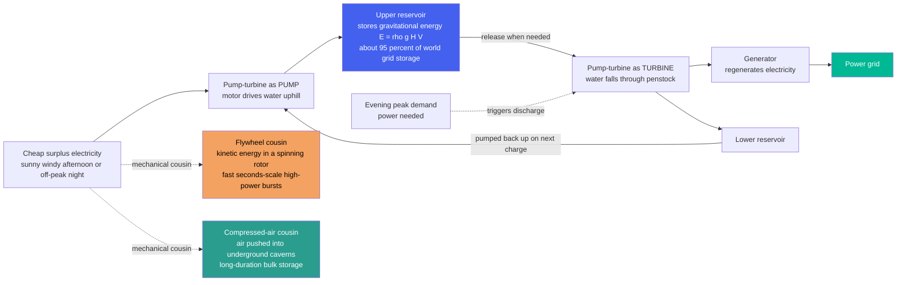

# 🏔️ Pumped Hydro and Mechanical Storage: Storing the Grid as Gravity, Motion, and Air

> [!abstract] TL;DR
> The world's biggest "battery" isn't a battery at all — it's **water on a hill**. **Pumped hydro storage (PHS)** is beautifully simple: when electricity is cheap and plentiful (a sunny, windy afternoon or a low-demand night), use it to **pump water uphill** into a high reservoir; when you need power back (the evening peak), let that water **fall back down through turbines** to regenerate electricity. You are storing energy as *gravity* — a lake perched high up is a giant charged battery holding $E = \rho g H V$ joules of gravitational potential energy. This unglamorous trick stores about **90–95% of all the world's grid energy storage** — vastly more than every lithium battery on Earth combined — because it is **cheap per kWh, extremely durable (50+ years), and can store energy for many hours or even days**, with a **round-trip efficiency of ~75–85%**. Its mechanical cousins store energy in other physical forms: spinning **flywheels** (kinetic energy in a heavy rotor, for split-second-to-minute bursts of very high power) and **compressed air energy storage (CAES)** (air squeezed into underground caverns, for long-duration bulk). Together, this mechanical-storage backbone covers the *long-duration bulk* (PHS, CAES) and *fast-response* (flywheels) ends of the storage spectrum that batteries do not — the timescales a renewable grid must span. The catch for pumped hydro is **geography** — you need two reservoirs at different heights and water — which is why engineers are hunting for new sites (closed-loop, off-river, underground, seawater) and new mechanical tricks to store the grid's fast-growing need.

## Intuition

**Analogy:** Imagine you have a bucket, a water tank on your roof, and a cheap electric pump. Whenever electricity is dirt-cheap — say the middle of a sunny afternoon when the solar panels are flooding the grid — you switch the pump on and haul water up to the roof tank. You are not *using* the water; you are simply **storing the cheap energy as height**. Later, at dinnertime, when everyone switches on their stove and electricity is expensive and scarce, you open a valve and let the water rush back down, spinning a little generator on the way and giving you electricity back. You have just bought energy when it was cheap and sold it when it was dear, using nothing but *water and a hill*. Scale that bucket up to a mountain lake holding ten million tonnes of water three hundred metres above a valley, and you have **pumped hydro storage** — the single largest energy-storage system humanity has ever built, and the reason the lights stay on when the wind drops.

The trick works because **height is stored energy**. Lift a mass $m$ up by a height $H$ and you have invested $mgH$ joules into it; let it fall and you get (most of) that energy back. A full upper reservoir is a *charged* battery; an empty one is a *flat* battery; and "charging" and "discharging" are just pumping up and flowing down. Its cousins swap the *form* of the stored energy: a **flywheel** stores it as the spin of a heavy wheel ($\tfrac{1}{2}I\omega^2$) so it can be released in a violent instant, and **compressed air** stores it as the pressure of gas crammed into a cave, to be let out slowly like a giant pneumatic spring. The physics is old and humble — a waterwheel, a spinning top, a bicycle pump — but the *scale* is what makes it the quiet giant of the clean-energy grid.

---

## How It Works

### Core Mechanics

Pumped hydro is a **reversible hydroelectric plant with two reservoirs at different elevations**, running the same machinery in two directions:

1. **Charge (pump water up).** When electricity is surplus or cheap, the plant runs its **pump-turbines as pumps**: the grid drives a motor, the motor drives the pump, and water is lifted from the **lower reservoir** to the **upper reservoir**. Electrical energy is converted into **gravitational potential energy**, $E = \rho g H V$, where $\rho$ is water density (~1000 kg/m³), $g$ is gravity, $H$ is the effective head (height difference), and $V$ is the usable water volume. The upper lake is now a charged battery.
2. **Store (do nothing, cheaply).** The energy simply *sits there* as a raised body of water. Losses are tiny — a little evaporation and seepage — so pumped hydro can hold its charge for **hours, days, even weeks** with almost no self-discharge, unlike batteries that slowly drain.
3. **Discharge (let water fall).** When power is needed and expensive, the water is **released down a penstock through the same pump-turbines, now run as turbines**, spinning a generator and feeding electricity back to the grid. The plant can go from standstill to full output in **seconds to a couple of minutes** — far faster than a thermal plant.
4. **Round-trip efficiency.** You never get all the energy back: the pump wastes some energy on the way up (friction, turbulence) and the turbine wastes some on the way down. The **round-trip efficiency** is the product, $\eta_{rt} = \eta_{pump} \times \eta_{turbine} \approx 0.75\text{–}0.85$. So storing 1 MWh returns about 800 kWh — a modest tax for the enormous capacity, duration, and 50-year lifetime you buy.

The economic engine is **energy arbitrage and time-shifting**: buy (pump) low, sell (generate) high, and in doing so *flatten* the grid's supply-demand mismatch — soaking up midday solar and midnight wind, then releasing it into the evening peak.

**The mechanical cousins** store the same electricity in different physical forms, covering the parts of the storage map PHS cannot:

- **Compressed Air Energy Storage (CAES).** Surplus power runs a **compressor** that crams air into an underground cavern (often a solar-mined salt dome) at high pressure. To discharge, the pressurized air is released through a **turbine**. Compressing air *heats* it and expanding it *cools* it, so the handling of that heat defines the variants: **diabatic** CAES throws the compression heat away and adds natural-gas heating on expansion (like Huntorf and McIntosh), while **adiabatic (A-CAES)** *stores* the compression heat and returns it, chasing higher efficiency without fuel. Like PHS, CAES is **long-duration, bulk, and geology-dependent**.
- **Flywheels.** A **massive rotor spun up to very high speed** in a low-friction (often magnetically levitated, vacuum-housed) enclosure stores **kinetic energy** $E = \tfrac{1}{2}I\omega^2$. Because you can extract that spin almost instantly, flywheels deliver **enormous power for a very short time** — seconds to minutes — making them ideal for **frequency regulation, ride-through, and power quality**, *not* for storing bulk energy overnight.
- **Gravity storage (novel).** The purest generalization of "water on a hill": lift heavy solid weights (or rail cars, or suspended masses in a shaft) with surplus power and drop them to regenerate — a family of experimental concepts trying to escape PHS's geographic constraints.

Placed on a **power-versus-duration map**, the portfolio sorts itself: **flywheels** occupy the high-power, short-duration corner; **batteries** sit in the medium-power, medium-duration middle; and **pumped hydro and CAES** own the **bulk, long-duration** territory that firms a renewable grid across a full day and beyond.

### Flow / Architecture



---

## Key Concepts

### Secondary Level

- **The biggest battery is water on a hill.** When electricity is cheap and plentiful, a pumped-hydro plant uses it to pump water from a low lake up to a high lake. The water just sits there, holding the energy as height.
- **Getting the power back.** When people need electricity — like at dinnertime — the plant lets the water fall back down through a turbine, spinning a generator and turning the stored "height energy" back into electricity.
- **Why it is so useful.** It is cheap, it lasts 50 years or more, and it can hold a *lot* of energy for many hours or even days. That is why pumped hydro stores about **95% of all the world's stored grid electricity** — far more than all the phone-and-car batteries put together.
- **You lose a little.** You don't get all the energy back — pumping and generating each waste a bit — so you keep about **80%** of what you put in. That is a small price for such a big, long-lasting store.
- **The catch is geography.** You need two lakes at different heights and enough water. Not every place has that, so engineers look for new sites and other tricks.
- **The cousins.** A **flywheel** stores energy in a heavy spinning wheel and gives it back in a burst for a few seconds — great for quick fixes. **Compressed air** squeezes air into an underground cave and lets it out later — good for storing lots of energy for a long time.

### Undergraduate Level

- **The energy equation.** Stored energy is $E = \rho g H V$ (joules), so a plant's capacity scales with both **head** $H$ and **usable volume** $V$. A useful sanity check: $1\ \text{MWh} = 3.6\times10^9\ \text{J}$, so a reservoir of $10^7\ \text{m}^3$ at $300\ \text{m}$ head holds $\rho g H V = 1000\cdot 9.81\cdot 300\cdot 10^7 \approx 2.9\times10^{13}\ \text{J} \approx 8\ \text{GWh}$.
- **Power vs energy are independent.** The **power** rating (MW) is set by the flow rate through the turbines and the head; the **energy** capacity (MWh) is set by the reservoir volume. **Duration = energy / power**. PHS decouples these — you can add hours of storage by enlarging the reservoir without changing the turbines — which is exactly why it excels at long duration.
- **Round-trip efficiency.** $\eta_{rt} = \eta_{pump}\,\eta_{turbine} \approx 0.75\text{–}0.85$. Every stored MWh returns ~0.8 MWh; the lost 20% is dissipated as heat in pumping, penstock friction, and generation. This is *far* better than any thermal cycle and competitive with batteries, at a fraction of the cost per kWh of capacity.
- **Energy arbitrage.** The plant charges when the marginal price of electricity is low (surplus renewables, off-peak) and discharges when it is high (peak demand). It profits from the **price spread**, and in doing so provides grid services: **peak shaving, time-shifting, and renewable firming**. The arbitrage is only worthwhile if the price spread exceeds the round-trip loss.
- **The four grid services.** Beyond arbitrage, PHS supplies **spinning reserve, black-start capability, voltage support, and frequency regulation** (especially with modern **variable-speed** and **ternary** units that can pump and generate near-continuously).
- **CAES thermodynamics.** Compressing air raises its temperature; storing that heat and returning it on expansion is the difference between low-efficiency **diabatic** CAES (~40–54%, needs supplemental gas heating) and higher-efficiency **adiabatic** CAES (~60–70%, fuel-free). This ties CAES economics directly to heat management.
- **Flywheel physics.** Stored energy $E = \tfrac{1}{2}I\omega^2$ grows with the **square of angular speed**, so flywheels are pushed to very high rpm; the limit is the **tensile strength** of the rotor (hoop stress $\propto \rho r^2 \omega^2$), which is why modern flywheels use high-strength composite rims. Their niche is **high power for short duration** (seconds–minutes), not bulk energy.
- **The geographic constraint.** PHS needs **topography + water rights + environmental clearance**. This drives modern variants: **closed-loop** (two purpose-built reservoirs, no river), **off-river**, **underground** (using mines or caverns as the lower reservoir), and **seawater** PHS (ocean as the lower reservoir, as demonstrated at Okinawa).

### Graduate Level

- **The storage-duration spectrum and the "duration wall."** Storage technologies partition the **power–energy plane**. Costs scale differently: battery cost scales roughly with **energy** (each added kWh needs more cells), whereas PHS/CAES add energy cheaply (a bigger reservoir or cavern) while power hardware is fixed. Hence there is a **crossover duration** (typically ~4–10 h) beyond which mechanical bulk storage undercuts electrochemical storage on levelized cost — the economic reason PHS dominates *long-duration* storage and batteries dominate *short-duration*.
- **Round-trip efficiency decomposition.** $\eta_{rt}$ is a product of motor/generator efficiency, pump/turbine hydraulic efficiency (each ~0.9), and penstock/friction head losses that scale with flow. Best-efficiency-point operation matters: pump-turbines are optimized for a design head and flow, so partial-load operation and the mismatch between best pump and best turbine geometry (a reversible **Francis pump-turbine** compromises both) set the practical ceiling near 80–85%. Separate **ternary sets** (a distinct pump and turbine on one shaft) and **variable-speed** drives recover efficiency and add hydraulic-short-circuit flexibility at higher capital cost.
- **CAES exergy and the heat problem.** Ideal isothermal compression/expansion would make CAES lossless in principle, but real machines are near-adiabatic and generate large **compression heat** ($T_2/T_1 = (P_2/P_1)^{(\gamma-1)/\gamma}$). Diabatic plants **discard** this exergy and must **reheat** on expansion (burning gas), capping efficiency and adding emissions; **adiabatic CAES** stores the heat in a thermal reservoir (packed-bed or molten media) to reheat the expanding air, and **isothermal CAES** attempts near-isothermal compression via heat exchange with a liquid — each a different attack on the same exergy-destruction problem. The **constant-pressure (compensated) cavern** using a water column further stabilizes turbine inlet conditions.
- **Flywheel design limits and self-discharge.** The specific energy of a flywheel is bounded by material **specific strength**: $E/m \approx K\,\sigma/\rho$ (shape factor $K$, tensile strength $\sigma$, density $\rho$) — favoring low-density, high-strength composites. The dominant limitation is **standby loss**: even with magnetic bearings and vacuum housing, aerodynamic and bearing drag drain a flywheel in minutes to hours, which structurally confines it to **power applications** (frequency regulation, UPS ride-through) rather than energy applications.
- **Grid-integration role across timescales.** A high-renewable grid faces variability from **sub-second (frequency), through intra-day (solar diurnal), to multi-day (weather fronts and wind lulls)**. No single technology spans all scales: **flywheels/supercaps** handle sub-second to seconds, **batteries** handle minutes to a few hours, and **PHS/CAES** handle the multi-hour-to-multi-day bulk shifting; the residual seasonal gap points toward **power-to-gas / hydrogen**. Firm, low-carbon supply therefore requires a **portfolio** matched to the duration-vs-power map, not a single "best" store.
- **Siting, capacity, and the resource question.** The technical PHS resource is enormous — global surveys (e.g. off-river closed-loop atlases) identify orders of magnitude more candidate sites than needed — but *bankable* sites face land, water, ecological, and social constraints. The frontier is therefore **closed-loop, off-river, underground, retrofitted-mine, and seawater** PHS that decouple storage from natural river hydrology and reduce environmental footprint, alongside modular gravity concepts seeking to remove the topographic requirement entirely.
- **Why the mechanical backbone is strategic.** Because PHS is **cheap per kWh, long-lived (50–100 yr), non-degrading (no cycle-life fade), and long-duration**, it anchors the storage stack that decarbonization requires. As wind and solar penetration rises and the **need shifts from short-duration arbitrage to multi-hour and multi-day firming**, the value of exactly the duration range PHS and CAES occupy grows — making the *unglamorous giant* of energy storage, and the search for new sites and new mechanical concepts, central to a reliable clean grid.

---

## Python Demo

```python
# Mechanical grid storage in two pictures. numpy + matplotlib only.
#
#   (a) PUMPED-HYDRO ARBITRAGE + RESERVOIR LEVEL
#       A reversible pump-turbine plant buys (pumps) energy when the daily
#       electricity price is LOW and sells (generates) when it is HIGH.
#       We plot the price curve, the charge/discharge dispatch, and the
#       reservoir's stored-energy level, and compute E = rho*g*H*V, the
#       round-trip efficiency, and the arbitrage profit.
#
#   (b) STORAGE TECHNOLOGY MAP (power vs discharge duration)
#       Flywheels -> high power, seconds; batteries -> medium/hours;
#       CAES & pumped hydro -> bulk, long duration. This is WHY the grid
#       needs a portfolio: no single box covers all timescales.
import numpy as np
import matplotlib.pyplot as plt
from matplotlib.patches import Rectangle

# =================== (a) pumped-hydro plant & day-ahead prices ===================
rho, g = 1000.0, 9.81          # water density [kg/m^3], gravity [m/s^2]
H      = 300.0                 # effective head [m]
V      = 9.0e6                 # usable reservoir volume [m^3]
E_J    = rho * g * H * V       # gravitational potential energy [J]
E_cap  = E_J / 3.6e9           # -> energy capacity [MWh]   (1 MWh = 3.6e9 J)

P_rated  = 1000.0             # pump / turbine power rating [MW]
eta_pump = 0.90               # charging (motor-pump) efficiency
eta_turb = 0.90               # discharging (turbine-generator) efficiency
eta_rt   = eta_pump * eta_turb # round-trip efficiency ~0.81

# a duck-curve day: cheap overnight & midday-solar, dear in the evening peak
hours = np.arange(24)
price = np.array([28,26,25,24,26,30,40,55,60,52,40,26,
                  22,20,24,34,52,78,95,88,70,54,40,32], float)  # [$/MWh]

charge_thr, discharge_thr, dt = 30.0, 60.0, 1.0   # thresholds [$/MWh], step [h]

soc      = np.zeros(len(hours) + 1)   # reservoir stored energy [MWh]
soc[0]   = 0.30 * E_cap               # start 30% full
dispatch = np.zeros(len(hours))       # grid-side power [MW], + generate / - pump

for t in range(len(hours)):
    if price[t] <= charge_thr and soc[t] < E_cap:          # PUMP (charge)
        gain = min(eta_pump * P_rated * dt, E_cap - soc[t]) # energy into reservoir
        soc[t + 1]  = soc[t] + gain
        dispatch[t] = -(gain / eta_pump) / dt               # grid draw (negative)
    elif price[t] >= discharge_thr and soc[t] > 0:          # GENERATE (discharge)
        draw = min((P_rated / eta_turb) * dt, soc[t])       # energy out of reservoir
        soc[t + 1]  = soc[t] - draw
        dispatch[t] = (draw * eta_turb) / dt                # grid delivery (positive)
    else:                                                   # idle
        soc[t + 1]  = soc[t]

drawn     = -np.sum(np.minimum(dispatch, 0)) * dt          # MWh pumped from grid
delivered =  np.sum(np.maximum(dispatch, 0)) * dt          # MWh generated to grid
cost      = -np.sum(np.minimum(dispatch, 0) * price) * dt  # pumping cost [$]
revenue   =  np.sum(np.maximum(dispatch, 0) * price) * dt  # generation revenue [$]

print("=== Pumped-hydro storage plant ===")
print(f"  stored energy  E = rho*g*H*V = {E_J:.3e} J = {E_cap:.0f} MWh = {E_cap/1000:.2f} GWh")
print(f"  power rating           : {P_rated:.0f} MW")
print(f"  duration at full power : {E_cap / P_rated:.1f} h")
print(f"  round-trip efficiency  : {eta_rt*100:.0f}%  (pump {eta_pump*100:.0f}% x turbine {eta_turb*100:.0f}%)")
print(f"  energy pumped from grid : {drawn:.0f} MWh   (cost ${cost:,.0f})")
print(f"  energy generated to grid: {delivered:.0f} MWh   (revenue ${revenue:,.0f})")
print(f"  arbitrage profit        : ${revenue - cost:,.0f}   (buy low, sell high)")
print(f"  reservoir end vs start  : {soc[-1]:.0f} vs {soc[0]:.0f} MWh")

# =============================== plotting ================================
fig = plt.figure(figsize=(17, 5.4))
axA = fig.add_subplot(1, 3, 1)   # price + dispatch
axB = fig.add_subplot(1, 3, 2)   # reservoir level
axC = fig.add_subplot(1, 3, 3)   # technology map
fig.suptitle("Pumped hydro & mechanical storage: buy-low/sell-high arbitrage, "
             "the reservoir as a battery, and the storage-duration map",
             fontsize=13, fontweight="bold")

# (a) dispatch bars (blue=pump, red=generate) with the price line on a twin axis
bar_col = ["#c0392b" if d > 0 else ("#2980b9" if d < 0 else "#cccccc") for d in dispatch]
axA.bar(hours, dispatch, color=bar_col, width=0.82, zorder=2)
axA.axhline(0, color="k", lw=0.8)
axA.set_xlabel("hour of day")
axA.set_ylabel("grid power  [MW]   (+ generate / - pump)")
axA.set_title("(a) Energy arbitrage dispatch\npump when cheap, generate when dear", fontsize=11)
axA.set_xlim(-0.6, 23.6); axA.set_ylim(-1250, 1250); axA.grid(alpha=0.25, axis="y")
axp = axA.twinx()
axp.plot(hours, price, color="#111111", lw=2.2, marker="o", ms=3.5, zorder=3)
axp.set_ylabel("electricity price  [$/MWh]"); axp.set_ylim(0, 110)
axp.axhline(charge_thr, color="#2980b9", ls=":", lw=1.2)
axp.axhline(discharge_thr, color="#c0392b", ls=":", lw=1.2)
axp.text(0.2, charge_thr + 1, "pump below", color="#2980b9", fontsize=7.5)
axp.text(0.2, discharge_thr + 1, "generate above", color="#c0392b", fontsize=7.5)

# (b) reservoir stored-energy level as a "state of charge" over the day
axB.fill_between(np.arange(len(soc)), soc, step="post", color="#4361ee", alpha=0.30)
axB.plot(np.arange(len(soc)), soc, drawstyle="steps-post", color="#4361ee", lw=2.4)
axB.axhline(E_cap, color="#c0392b", ls="--", lw=1.4, label="reservoir full")
axB.axhline(0, color="#555", ls="-", lw=0.8)
axB.set_xlabel("hour of day")
axB.set_ylabel("stored energy in upper reservoir  [MWh]")
axB.set_title("(b) The reservoir IS the battery\nfills overnight & midday, empties at peak", fontsize=11)
axB.set_xlim(0, 24); axB.set_ylim(0, E_cap * 1.12); axB.grid(alpha=0.25); axB.legend(loc="lower right", fontsize=8)

# (c) storage technology map: power [MW] vs discharge duration [h], log-log boxes
#     (name, dur_min_h, dur_max_h, P_min_MW, P_max_MW, color)
techs = [
    ("Flywheel",        0.002, 0.25,   0.1,   20,   "#e63946"),
    ("Li-ion battery",  0.25,  8.0,    1.0,   300,  "#f4a261"),
    ("CAES",            2.0,   30.0,   10.0,  500,  "#2a9d8f"),
    ("Pumped hydro",    4.0,   200.0,  100.0, 3000, "#4361ee"),
]
for name, d0, d1, p0, p1, col in techs:
    axC.add_patch(Rectangle((d0, p0), d1 - d0, p1 - p0,
                            facecolor=col, alpha=0.32, edgecolor=col, lw=2.0))
    axC.text(np.sqrt(d0 * d1), np.sqrt(p0 * p1), name,
             ha="center", va="center", fontsize=8.5, fontweight="bold", color=col)
axC.set_xscale("log"); axC.set_yscale("log")
axC.set_xlim(1e-3, 3e2); axC.set_ylim(5e-2, 5e3)
for x, lab in [(1/60.0, "seconds"), (1.0, "hours"), (24.0, "days")]:
    axC.axvline(x, color="#999", ls=":", lw=0.9)
    axC.text(x, 3.3e3, lab, ha="center", fontsize=7.5, color="#666")
axC.set_xlabel("discharge duration  [hours, log scale]")
axC.set_ylabel("power rating  [MW, log scale]")
axC.set_title("(c) Storage-duration map\nflywheel=fast, PHS/CAES=bulk, battery=between", fontsize=11)
axC.grid(alpha=0.25, which="both")

plt.tight_layout(rect=[0, 0, 1, 0.92])
plt.show()
```

Running this prints the plant's headline numbers and draws three panels. **Panel (a)** is the **arbitrage dispatch**: the black line is the daily price, and the bars show the plant *pumping* (blue, drawing power) whenever the price dips below the charge threshold — overnight and during the midday solar glut — and *generating* (red, delivering power) during the sharp evening price peak. It literally buys energy low and sells it high. **Panel (b)** shows the same story from the reservoir's point of view: the upper lake is the battery, its stored energy climbing as it fills overnight (hitting the full line), dipping for a morning discharge, topping up again at midday, then draining hard through the evening peak — a visible **state of charge**. **Panel (c)** is the **storage-duration map** that explains the whole ecosystem: flywheels occupy the high-power, seconds-scale corner (fast bursts); pumped hydro and CAES own the long-duration, bulk territory to the right; and batteries fill the middle. Because no single box spans every timescale, a renewable grid needs the *portfolio* — and pumped hydro, cheap and long-lived, anchors the bulk end.

---

## Real-World Applications

> **Example — Bath County, the "world's largest battery."** The Bath County Pumped Storage Station in Virginia (USA), commissioned in 1985, is the archetype and long the largest of its kind. Two reservoirs about **380 m apart in elevation** feed six reversible **pump-turbines** totaling roughly **3 GW of power** and storing on the order of **24 GWh of energy** — enough to run at full output for about eight hours. It charges overnight and during low-demand periods (historically absorbing baseload nuclear and coal, increasingly renewables) and discharges into the daily peaks of the mid-Atlantic grid, providing bulk time-shifting, spinning reserve, and frequency regulation at a round-trip efficiency near 80%. It embodies every mechanic in this note: $E = \rho g H V$, reversible pump-turbines, multi-hour duration, and a design life measured in half-centuries.

- **Dinorwig, Wales — fast-response peaking.** Built inside a slate mountain, Dinorwig ("Electric Mountain") can ramp from zero to ~1.7 GW in about **16 seconds**, guarding the UK grid against sudden generation loss and demand surges (famously the surges after popular TV broadcasts) — a showcase of PHS's near-instant dispatch and black-start value.
- **Huntorf & McIntosh — the two commercial CAES plants.** Germany's Huntorf (1978) and Alabama's McIntosh (1991) store compressed air in **solution-mined salt caverns** and run **diabatic** cycles (burning gas to reheat the expanding air), proving CAES at grid scale and motivating today's **adiabatic** and hydrogen-fueled successors.
- **Beacon Power flywheel plants — frequency regulation.** Flywheel facilities in New York and Pennsylvania provide **fast frequency regulation** to PJM/NYISO, absorbing and injecting power on a **second-by-second** basis with millions of full cycles and no chemical degradation — the classic *power, not energy* application.
- **Okinawa seawater PHS — escaping geography.** Japan's Okinawa Yanbaru plant demonstrated **seawater pumped hydro**, using the ocean as the lower reservoir — a template for island and coastal storage that removes the need for two freshwater reservoirs.
- **Fengning, China — the new scale record.** China, now building the majority of the world's new PHS, brought online the Fengning station (~3.6 GW), part of a national push that is rapidly expanding global pumped-storage capacity to firm its enormous wind and solar buildout.
- **Closed-loop and retrofitted-mine projects.** Off-river **closed-loop** PHS (two purpose-built reservoirs, no dammed river) and proposals to reuse **abandoned mines** as lower reservoirs are the frontier for siting storage without new river impoundments — directly attacking PHS's geographic constraint.

---

## Common Pitfalls

- **Confusing power with energy (MW vs MWh).** A storage plant has *two* independent ratings: how *fast* it can deliver (MW) and how *much* it holds (MWh). **Duration = MWh / MW.** A flywheel can be high-MW yet tiny-MWh (seconds of duration); pumped hydro is the opposite. Sizing storage without separating these two numbers is the single most common error.
- **Treating storage as generation.** Storage *makes no net energy* — it returns less than it absorbs ($\eta_{rt} < 1$). It is a **buffer** that shifts energy in time, not a source. Calling a battery or PHS plant a "power source" hides the round-trip loss and the fact that the stored energy had to be generated somewhere else first.
- **Ignoring the round-trip penalty in arbitrage.** Arbitrage only pays if the **price spread exceeds the round-trip loss**. Buying at \$50/MWh to sell at \$55/MWh through an 80% round-trip plant *loses money* (you must sell ~\$62 just to break even on energy). The efficiency tax sets the minimum viable spread.
- **Assuming pumped hydro can be sited anywhere.** PHS is **geography-bound** — it needs elevation difference, water, and land. This is its defining limitation, and the reason closed-loop, seawater, underground, and modular-gravity variants exist. Planning a grid as if PHS were freely deployable everywhere is a fantasy.
- **Forgetting CAES's heat problem.** Compressing air heats it; if that heat is discarded (diabatic CAES) the plant must **burn fuel to reheat** on expansion, slashing efficiency and adding emissions. Quoting CAES as "clean, high-efficiency storage" without specifying diabatic vs adiabatic is misleading.
- **Expecting flywheels to store bulk energy.** Flywheels **self-discharge in minutes to hours** and store little energy per unit mass. They are magnificent for *power* (frequency regulation, ride-through) and useless for *overnight energy shifting*. Matching a flywheel to a bulk-storage job is a category error.
- **Underrating self-discharge and cycle life differences.** Pumped hydro barely self-discharges and never "wears out" its energy capacity (no cycle-life fade), giving it a huge lifetime-cost edge that a snapshot capital-cost comparison against batteries completely misses.

---

## Related Concepts

This note sits in the **Nuclear & Energy Storage** section (S04) of the Energy Systems vault, and it is the *storage* counterweight to the *generation* notes elsewhere in the vault. Its section and vault siblings are referenced here in prose. **Batteries and Electrochemical Storage** is its natural partner — the short-to-medium-duration, medium-power middle of the storage-duration map that pumped hydro and CAES bracket on the long-duration end; the two are complementary, not competing. **Hydropower and Marine Energy** shares the exact turbine-and-head hydraulics of pumped hydro (indeed pumped hydro *is* reversible hydropower), differing only in that PHS moves the *same* water up and down rather than harvesting a natural flow. **Thermal and Chemical Energy Storage** (molten salt, hydrogen, power-to-gas) covers the parts of the duration spectrum — including *seasonal* storage — that mechanical storage cannot economically reach. **Grid Integration of Renewables** is the reason all of this matters: variable wind and solar create the supply-demand mismatches across sub-second to multi-day timescales that this storage portfolio exists to smooth. And **The Electric Power Grid** is the system into which every one of these stores dispatches, providing arbitrage, reserves, black start, and frequency regulation. Those siblings are prose-only; the links below point to notes that already exist elsewhere in the vault.

**Energy Systems foundations — where storage fits in the energy chain**
- [[Energy_Systems_Overview]] — the find-convert-store-deliver energy chain; storage is the *time-shifting* link that lets supply and demand meet
- [[Forms_and_Conversion_of_Energy]] — pumped hydro stores energy as **gravitational potential**, flywheels as **kinetic**, and CAES as **compressed-gas** energy; storage is just holding a chosen energy form and converting it back
- [[Thermodynamics_of_Energy_Conversion]] — the second-law losses in the pump-and-turbine cycle that set the ~75–85% round-trip efficiency, and the exergy destruction behind CAES's heat problem
- [[Energy_Resources_Units_and_Accounting]] — the MW-vs-MWh, capacity-vs-energy, and duration accounting that underlies every storage comparison

**Fluids & turbomachinery — the hardware that moves the water and air**
- [[Pumps_Compressors_and_Turbines]] — the reversible **pump-turbine** at the heart of PHS and the **compressor/turbine** train of CAES; how head, flow, and rotational speed set power and efficiency
- [[Engineering_Fluid_Mechanics]] — Bernoulli, head, and penstock friction losses that determine the effective head $H$ and the hydraulic efficiency of the plant

**Mechanics — the physics of the store**
- [[Work_Energy_and_Conservation]] — the $E = mgh$ gravitational potential energy of a raised reservoir and the $\tfrac{1}{2}I\omega^2$ kinetic energy of a flywheel: the conservation principles the whole idea rests on
- [[Rotational_Dynamics]] — moment of inertia $I$ and angular velocity $\omega$ that set a flywheel's stored energy and its high-power discharge
- [[Balancing_and_Rotordynamics]] — the critical speeds, bearing loads, and rotor-integrity limits (hoop stress) that cap how fast a storage flywheel can safely spin

**Thermodynamics — the heat inside compressed-air storage**
- [[Engineering_Thermodynamics]] — the compression heating, expansion cooling, and heat-recovery that distinguish diabatic from adiabatic CAES and set its round-trip efficiency

---

## Review Questions

**Secondary**
1. Explain, in your own words, how a pumped-hydro plant works as a giant battery: what happens when electricity is cheap, what happens when electricity is expensive, and why we call the full upper reservoir a "charged" battery. Then explain why pumped hydro stores far more of the world's grid energy than all lithium batteries combined, and name the one thing (about *where* you can build it) that limits it. Finally, describe one job a spinning flywheel is good at that a pumped-hydro plant is not.

**Undergraduate**
2. A pumped-hydro plant has an effective head of $H = 250\ \text{m}$, a usable reservoir volume of $V = 8\times10^6\ \text{m}^3$, a power rating of 500 MW, and a round-trip efficiency of 80%. (i) Compute the stored energy $E = \rho g H V$ in joules and convert it to MWh (use $1\ \text{MWh} = 3.6\times10^9\ \text{J}$). (ii) Compute the plant's discharge **duration** at full power, and explain why power (MW) and energy (MWh) are *independent* ratings that can be sized separately. (iii) If the plant charges at a price of \$40/MWh, what is the *minimum* price at which it must sell (generate) just to break even on energy alone, given the 80% round-trip efficiency? Explain physically where the lost 20% goes.

**Graduate**
3. A system planner must firm a grid with high wind and solar penetration across three timescales: **sub-second frequency regulation**, **intra-day (multi-hour) solar shifting**, and **multi-day wind lulls**. (a) Using the power-versus-duration map, assign flywheels, batteries, and pumped hydro / CAES to the timescales they serve best, and justify each assignment in terms of *power density, energy capacity, self-discharge, and cost scaling* (why battery cost scales with energy while PHS/CAES add energy cheaply). (b) Explain the concept of a **crossover duration** beyond which mechanical bulk storage undercuts batteries on levelized cost, and what determines it. (c) For CAES specifically, contrast **diabatic**, **adiabatic**, and **isothermal** designs in terms of how each handles the exergy of compression heat, and explain why this single thermodynamic choice dominates CAES's round-trip efficiency and carbon footprint. (d) Identify the residual storage gap that *none* of these mechanical technologies fill, and name the technology class that targets it.

---

## Sources

- J. Tester, E. Drake, M. Driscoll, M. Golay & W. Peters — *Sustainable Energy: Choosing Among Options*, 2nd ed. (MIT Press, 2012) — energy storage within the full systems view of options, capacities, and trade-offs
- R. A. Huggins — *Energy Storage: Fundamentals, Materials and Applications*, 2nd ed. (Springer, 2016) — mechanical, thermal, and electrochemical storage principles side by side
- E. Barbour, I. A. G. Wilson, J. Radcliffe, Y. Ding & Y. Li — "A review of pumped hydro energy storage development in significant international electricity markets," *Renewable and Sustainable Energy Reviews* 61, 421–432 (2016)
- M. Budt, D. Wolf, R. Span & J. Yan — "A review on compressed air energy storage: Basic principles, past milestones and recent developments," *Applied Energy* 170, 250–268 (2016)
- International Energy Agency / International Hydropower Association — energy-storage and pumped-storage status reports (IEA *Energy Storage* tracking; IHA *Hydropower Status Report*)

---

#energy-systems #pumped-hydro #energy-storage #flywheel #compressed-air
