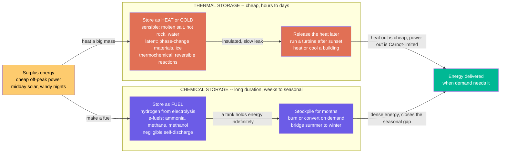

# 🔥 Thermal and Chemical Energy Storage: Banking Heat Cheaply, and Storing Energy as Fuel for the Seasons

> [!abstract] TL;DR
> Not everything we store has to come back as electricity. Very often the **cheapest** way to save energy for later is to store **heat** (or **cold**) directly — heat something up when power is cheap and let a big insulated mass hold it for hours. **Thermal energy storage (TES)** does exactly this at grid scale: giant tanks of **molten salt** at a solar plant keep the turbine spinning after sunset; blocks of **concrete or crushed rock** heated to hundreds of degrees bank surplus wind as heat; **ice** made cheaply at night cools buildings all day. It is cheap because heat is cheap to store — no exotic battery chemistry, just a big well-lagged lump. There are three flavours: **sensible** heat (raise a material's temperature), **latent** heat (melt or freeze a **phase-change material** at constant temperature), and **thermochemical** (drive a reversible reaction). The catch: heat **leaks** away over days, and if you turn it *back* into electricity you pay the **Carnot** toll. The second idea is to store energy as a **fuel** — a chemical you can stockpile almost **indefinitely** and burn or convert whenever you want. That is the appeal of **hydrogen** and **synthetic e-fuels**: unlike a battery that self-discharges over weeks, a tank of fuel holds its energy for **months**, which makes chemical storage the leading candidate for the single hardest problem in a renewable grid — storing energy across **seasons**, from summer sun to winter demand. Deciding *what* to store (heat vs electricity vs fuel) and *for how long* is at the heart of solving intermittency.

## Intuition

**Analogy:** Picture the two oldest tricks for keeping energy around. The first is the **hot-water tank** in your cupboard, or an old-fashioned **night-storage heater**: you switch it on when electricity is cheap, it soaks a big lump of water or ceramic brick up to temperature, and hours later that warmth is still there for you to use. You did not build a battery — you just **heated up a heavy, well-wrapped object** and let it coast. That is the whole idea of **thermal energy storage**, only scaled from a cupboard to a power station. Swap the hot-water tank for a **10,000-tonne tank of molten salt** glowing at 565 degrees, and a solar plant can keep making electricity for hours after the sun has gone down. Swap it for a **silo of crushed rock** heated by surplus wind, or a **vat of ice** frozen with cheap midnight power to air-condition an office tower through the afternoon. It is cheap for the same reason your hot-water tank is cheap: **heat is cheap to store.** You do not need lithium or cobalt — you need a big mass and good insulation. The price you pay is that the warmth slowly **seeps out** over days, and if you insist on turning the heat back into electricity, a heat engine can only recover a fraction of it.

The second trick is even older: **store the energy as a fuel.** A log of firewood, a tank of petrol, a cylinder of hydrogen — a chemical stockpile just *sits there*, holding its energy in molecular bonds, losing essentially nothing, for as long as you like. A charged battery quietly leaks itself flat over weeks; a full fuel tank is still full next spring. That is the killer feature of **chemical storage**: you can make hydrogen with surplus summer solar, store it in an underground cavern, and burn it back to power in the depths of winter. Batteries and pumped hydro are wonderful for smoothing out **hours**; they cannot economically hold energy for **months**. Fuel can. So the storage a renewable grid actually needs is a **portfolio across timescales** — flywheels and batteries for seconds to hours, pumped hydro and thermal for hours to days, and **chemical fuel for the weeks-to-seasonal gap** that nothing else can fill. Heat storage is the cheap short-term buffer; fuel storage is the bridge from summer to winter.

---

## How It Works

### Core Mechanics

Both families answer the same question — *where does the surplus energy go, and how do we get it back?* — but they park it in different places: **heat** in a hot (or cold) mass, or **chemical bonds** in a fuel.

**Thermal energy storage (TES) — park the energy as heat or cold.** There are three physical routes:

1. **Sensible heat: raise a material's temperature.** The stored energy is $E = m\,c\,\Delta T$ — mass times **specific heat capacity** times temperature rise. Charge by heating the medium; discharge by pulling the heat back out through a heat exchanger. The workhorses are **molten nitrate salt** (a two-tank system: a "cold" tank at ~290 °C and a "hot" tank at ~565 °C), **pressurised hot water**, and solid **packed beds of rock, gravel, or concrete**. Underground and **aquifer thermal energy storage (ATES/BTES)** use the earth itself as the mass. Sensible storage is dead simple and cheap; the energy density is modest and set by how high a $\Delta T$ the material tolerates.

2. **Latent heat: melt or freeze a phase-change material.** A **phase-change material (PCM)** absorbs a large chunk of energy — the **latent heat of fusion** — while it melts at a *constant* temperature, and releases it on freezing. This packs more energy into a smaller volume and delivers it at a steady temperature. The everyday grid example is **ice**: freeze it cheaply at night, use its melting to cool a building by day. Other PCMs (salt hydrates, paraffins, molten metals) target heating and industrial temperatures.

3. **Thermochemical: drive a reversible reaction.** A reversible endothermic/exothermic reaction (or a sorption process) stores energy in *chemical potential* — charge by driving the reaction one way with heat, discharge by running it back. Energy density is the highest of the three and, crucially, storage can be nearly **loss-free** once the reactants are separated, but the engineering is the hardest and it is still largely emerging.

**The two catches of heat storage.** First, a hot mass is always **leaking** heat to its surroundings — self-discharge follows roughly $\Delta T(t) = \Delta T_0\,e^{-t/\tau}$, with a time constant $\tau$ set by insulation and by the surface-to-volume ratio (bigger, better-lagged tanks leak slower). Over hours that leak is small; over weeks it drains the store. Second, heat is **low-quality energy**: if you reconvert it to electricity with a heat engine, the **Carnot** ceiling $\eta \le 1 - T_{cold}/T_{hot}$ caps the round-trip — a molten-salt store at 565 °C recovers only ~40% of stored heat as power, versus ~85–95% for a battery. This is why TES shines when the **output you want is heat** (dispatchable solar heat, building heating/cooling, process heat), and is a compromise when the output must be electricity. That electricity-in / heat-store / electricity-or-heat-out concept — the emerging **"Carnot battery"** or **pumped thermal** storage — trades the Carnot penalty for the very low cost of a big thermal mass.

**Chemical / fuel storage — park the energy in molecular bonds.** Use surplus electricity to *make a fuel*, store the fuel, then burn or convert it on demand:

4. **Charge — power to fuel.** **Electrolysis** splits water into **hydrogen** using surplus renewable power (power-to-gas; the electrochemistry lives in the sibling note). Hydrogen can be used directly or synthesised further into **e-fuels** — **methane** (power-to-gas via methanation), **ammonia**, or **methanol** (power-to-liquids) — which are easier to ship and store than loose hydrogen.

5. **Store — indefinitely.** A fuel's defining virtue is **negligible self-discharge** and very high **energy density** (per mass, hydrogen carries ~140 MJ/kg — orders of magnitude above any battery). A cavern or tank of fuel holds its energy for **months** with almost no loss. This is what makes chemical storage the only economically credible answer for **long-duration** and **seasonal** storage.

6. **Discharge — burn or convert.** Feed the fuel to a **fuel cell** (back to electricity), a **turbine or engine** (power or heat), or an **industrial process** (feedstock, high-temperature heat). Round-trip electricity-to-fuel-to-electricity is inefficient (~30–45%), so fuel is spent on the *rare, long* gaps that batteries cannot cover, not on daily cycling.

**The storage-duration landscape.** Put every technology on one axis of **discharge duration**: **flywheels and batteries** cover seconds to hours; **pumped hydro, compressed air (CAES), and thermal** cover hours to days; **chemical / hydrogen** covers weeks to seasonal. The energy-capacity cost ($/kWh) falls steeply as you move right — because for a fuel you just add cheap tank or cavern *volume*, whereas a battery must add expensive cells. That downward slope is exactly why chemical storage is the frontrunner for the long-duration and **seasonal gap** — the summer-to-winter mismatch — that a renewable-dominated grid must close.

### Flow / Architecture



---

## Key Concepts

### Secondary Level

- **You do not always need a battery.** The cheapest way to keep energy for later is often to store **heat**. Warm up a big object when power is cheap, wrap it well, and the warmth is still there hours later — exactly like a hot-water tank or a night-storage heater, just enormous.
- **Grid-scale examples.** A solar plant heats a giant tank of **molten salt** by day and uses that stored heat to make electricity after sunset. Wind farms can heat **crushed rock** to hundreds of degrees. Buildings freeze **ice** with cheap night power and melt it to run their air-conditioning by day.
- **Why heat storage is cheap.** You do not need rare metals or fancy chemistry — just a **big mass and good insulation.** The downside is that the heat slowly **leaks out** over days, and turning heat back into electricity only gets a fraction of it back.
- **Storing energy as fuel.** The other big idea is to store energy as a **fuel** you can stockpile — like **hydrogen**. Unlike a battery, which slowly goes flat over weeks, a tank of fuel keeps its energy for **months** with almost no loss.
- **The hardest problem: the seasons.** Batteries are great for a few hours. But how do you save summer's extra sunshine for a cold, dark winter? Fuel can sit in a tank for months, so **chemical storage is the best bet for storing energy across whole seasons** — the toughest storage challenge of all.

### Undergraduate Level

- **Sensible heat and the storage equation.** Stored energy $E = m\,c\,\Delta T$. High **specific heat** $c$ and a wide usable $\Delta T$ both help. Water has a huge $c$ (~4.2 kJ/kg·K) but a narrow liquid range; **molten salt** ($c \approx 1.5$ kJ/kg·K) and **rock/concrete** ($c \approx 0.8$–0.9 kJ/kg·K) have lower $c$ but tolerate $\Delta T$ of hundreds of degrees, so they store far more total energy per tonne.
- **Latent heat and PCMs.** A **phase-change material** stores its **latent heat of fusion** $L$ at (nearly) constant temperature: $E = m\,L$ over the transition, on top of any sensible heat. This gives higher energy density and isothermal delivery — ideal where you want a steady temperature (e.g. ice at 0 °C for cooling).
- **Self-discharge as heat loss.** A hot store cools by conduction/convection/radiation. Lumped-capacitance gives $\Delta T(t) = \Delta T_0 e^{-t/\tau}$, with $\tau = mc/(hA)$. Because $\tau$ grows with volume but loss scales with surface area, **large, well-insulated tanks leak proportionally slower** — but even the best lose meaningfully over weeks, which is why TES is intrinsically a **short-duration** technology.
- **The Carnot penalty on round-trip electricity.** Reconverting stored heat at $T_{hot}$ to electricity, rejecting to ambient $T_{cold}$, is capped at $\eta_{Carnot} = 1 - T_{cold}/T_{hot}$. A 565 °C store gives $\eta_{Carnot} \approx 0.64$, and real turbines reach ~0.4. So TES has an excellent round-trip if the **output is heat**, but a Carnot-limited one if the output is **power**.
- **Carnot batteries / pumped thermal.** These deliberately accept the Carnot penalty to exploit cheap thermal mass: electricity drives a heat pump to make a hot (and cold) reservoir; a heat engine later runs between them. Attractive because the storage medium (rock, water, salt) is far cheaper per kWh than electrochemical cells.
- **Chemical storage and self-discharge.** A fuel stores energy in bonds with **negligible self-discharge** and very high specific energy (H$_2$ ~120–142 MJ/kg LHV/HHV). **Round-trip** power-to-fuel-to-power efficiency is low (~30–45%), so fuel is reserved for **long, rare** gaps rather than daily cycling — you trade efficiency for the ability to store for months.
- **Matching technology to duration.** Flywheels/batteries: seconds–hours. Pumped hydro / CAES / thermal: hours–days. Chemical/hydrogen: weeks–seasonal. A reliable renewable grid needs the **whole portfolio**; the frontier is the **long-duration and seasonal** end where only fuels are cheap enough.

### Graduate Level

- **Energy density versus cost, and why fuels win at long duration.** The economics of storage split into a **power** cost ($/kW, the charge/discharge machinery) and an **energy** cost ($/kWh, the storage medium). Batteries bundle the two — more energy means more cells. Thermal and (especially) chemical **decouple** them: adding hours to a molten-salt store is just more salt and a bigger tank; adding *months* to a hydrogen store is just a bigger cavern. The levelised cost of storage therefore falls with duration for fuels and rises for batteries — the crossover, typically around **~10–100 hours**, defines the **long-duration energy storage (LDES)** regime.
- **Exergy and the quality of stored heat.** Stored heat carries **exergy** $\,dEx = dQ\,(1 - T_{cold}/T_{hot})$ — its convertible-to-work fraction. A store at 565 °C is high-exergy (can drive a turbine); waste heat at 40 °C is nearly exergy-free (good only for direct heating). Rational TES design **matches temperature to end use** — high-grade storage for power and industrial heat, low-grade for space heating — rather than degrading exergy needlessly (the second-law critique of "storing electricity as low-grade heat").
- **Two-tank versus thermocline, and the exergy of stratification.** Two-tank molten-salt cleanly separates hot and cold inventory but needs two vessels; a single-tank **thermocline** exploits buoyant **stratification** (hot on top) with cheap solid filler, cutting cost but suffering thermocline degradation and exergy loss as the gradient blurs. Managing stratification is a heat-transfer and fluid-dynamics optimisation problem.
- **Round-trip thermodynamics of Carnot batteries.** Pumped-thermal round-trip efficiency is $\eta_{rt} = \eta_{HP}\,\eta_{HE}$, the product of heat-pump COP-driven charging and heat-engine discharging. With realistic component efficiencies $\eta_{rt} \approx 0.5$–0.7 — below batteries but at potentially far lower $/kWh, and siting-unconstrained (unlike pumped hydro). Adding a **cold** reservoir (e.g. liquid-air energy storage, LAES) raises the effective temperature ratio and $\eta_{rt}$.
- **Power-to-X and the seasonal-storage economics.** Green hydrogen via electrolysis, optionally upgraded to **ammonia/methane/methanol**, is the leading seasonal-storage vector because fuel self-discharge is ~zero over months. But the compounded conversion losses (electrolysis ~65–75%, storage, then fuel-cell/turbine ~50–60%) give a poor round-trip, so the value case rests on **very cheap surplus renewable input** and **very few, deep cycles per year** — firming multi-week wind lulls and the summer-to-winter deficit, not arbitraging daily price spreads.
- **The seasonal mismatch and the "last gap".** In high-latitude, heating-dominated systems, solar supply peaks in summer while heat demand peaks in winter — a **six-month phase offset** that no hours-to-days technology can bridge. Closing it requires either seasonal **thermal** stores (large BTES/ATES fields, pit storage) for the *heat* market or seasonal **chemical** stores for the *electricity/fuel* market. This "last gap" — the final few percent of a fully-decarbonised system — is disproportionately expensive and is where LDES research is concentrated.
- **System-level portfolio optimisation.** Choosing the storage mix is a capacity-expansion problem trading each technology's power cost, energy cost, round-trip efficiency, self-discharge, and cycle life against the residual-load duration curve. The robust result across studies: a **diverse portfolio** — batteries for diurnal, pumped hydro/CAES/thermal for multi-day, and hydrogen/e-fuels for seasonal — dominates any single technology, because no one store is cheapest across all timescales.

---

## Python Demo

```python
# Thermal & chemical energy storage: cheap heat that leaks in days, versus fuel
# that holds its energy for months -- and the storage-duration landscape that
# shows why chemical storage owns the long-duration / seasonal gap.
# numpy + matplotlib only.
#
#   (a) SENSIBLE HEAT  E = m*c*dT : how much energy a tonne of each medium banks
#       as you raise its temperature -- water has huge c but a tiny dT range,
#       while rock and molten salt store far more by tolerating a huge dT.
#   (b) SELF-DISCHARGE over 90 days: a hot thermal store LEAKS (dT ~ exp(-t/tau)),
#       a battery holds far better short-term, and a fuel is essentially flat for
#       months -- the physical reason thermal = short-duration, fuel = seasonal.
#   (c) THE DURATION LANDSCAPE: energy-capacity cost ($/kWh) vs discharge duration.
#       Cost falls steeply toward long durations because a fuel just needs cheap
#       tank/cavern volume -- so chemical storage fills the SEASONAL gap.
import numpy as np
import matplotlib.pyplot as plt

# ----------------------------------------------------------------------
# (a) Sensible heat stored in 1 tonne of each medium: E = m*c*dT
# ----------------------------------------------------------------------
m = 1000.0                                   # 1 tonne of storage medium, kg
J_PER_KWH = 3.6e6                            # J per kWh

media = {                                    # name: (specific heat J/kg/K, usable dT K, colour)
    "Water  (liquid)":       (4186.0,  80.0, "#4a9eff"),
    "Concrete":              ( 880.0, 400.0, "#636e72"),
    "Rock / basalt bed":     ( 840.0, 500.0, "#b2542a"),
    "Molten nitrate salt":   (1500.0, 275.0, "#e17055"),
}

print("SENSIBLE HEAT STORAGE  --  E = m*c*dT  for 1 tonne")
stored_kwh = {}
for name, (c, dT, _) in media.items():
    E = m * c * dT / J_PER_KWH               # kWh at full usable dT
    stored_kwh[name] = E
    print(f"  {name:22s}: c={c:5.0f} J/kg/K, usable dT={dT:5.0f} K  ->  {E:6.1f} kWh/tonne")

# Carnot penalty if the hot salt store is reconverted to ELECTRICITY
T_hot = 565.0 + 273.0                         # molten-salt hot tank, K
T_amb = 300.0                                 # ambient sink, K
carnot = 1.0 - T_amb / T_hot
eta_turbine = 0.40                            # realistic steam-turbine round-trip
print(f"\n  Reconvert 565 C heat to power: Carnot ceiling {carnot*100:4.1f}%, "
      f"real ~{eta_turbine*100:.0f}%  (vs ~90% for a battery)")

# ----------------------------------------------------------------------
# (b) Self-discharge over 90 days: thermal leaks, battery holds, fuel is flat
# ----------------------------------------------------------------------
days = np.linspace(0, 90, 400)
tau_thermal = 40.0                            # well-insulated tank time constant, days
tau_battery = 990.0                           # Li-ion ~3%/month self-discharge
tau_fuel    = 3000.0                          # hydrogen: tiny leak, months of storage
ret_thermal = np.exp(-days / tau_thermal)
ret_battery = np.exp(-days / tau_battery)
ret_fuel    = np.exp(-days / tau_fuel)

print("\nENERGY RETAINED after ...        1 day   1 week  1 month  3 months")
for label, r in [("thermal (hot store)", ret_thermal),
                 ("battery (Li-ion)   ", ret_battery),
                 ("fuel (hydrogen)    ", ret_fuel)]:
    pick = [np.interp(d, days, r) for d in (1, 7, 30, 90)]
    print(f"  {label}:  " + "  ".join(f"{p*100:5.1f}%" for p in pick))

# ----------------------------------------------------------------------
# (c) Storage-duration landscape: energy-capacity cost vs discharge duration
# ----------------------------------------------------------------------
# name: (typical duration hours [lo, hi], representative $/kWh energy capacity, colour)
techs = {
    "Flywheel":              ([0.02, 0.25],  4000.0, "#fdcb6e"),
    "Li-ion battery":        ([1.0,   8.0],   250.0, "#00b894"),
    "Pumped hydro":          ([6.0,  24.0],    35.0, "#0984e3"),
    "CAES":                  ([6.0,  48.0],    45.0, "#6c5ce7"),
    "Thermal (molten salt)": ([6.0,  16.0],    40.0, "#e17055"),
    "Hydrogen / e-fuel":     ([100.0, 3000.0],  3.0, "#d63031"),
}

# ----------------------------------------------------------------------
# Plot
# ----------------------------------------------------------------------
fig, ax = plt.subplots(1, 3, figsize=(18, 5.4))
fig.suptitle("Thermal storage is cheap but leaks in days; chemical fuel holds "
             "energy for months -- the seasonal-storage answer",
             fontsize=13, fontweight="bold")

# (a) sensible heat bar chart
names = list(stored_kwh.keys())
vals  = [stored_kwh[n] for n in names]
cols  = [media[n][2] for n in names]
bars  = ax[0].barh(names, vals, color=cols)
for b, n in zip(bars, names):
    c, dT, _ = media[n]
    ax[0].text(b.get_width() + 2, b.get_y() + b.get_height()/2,
               f"dT={dT:.0f} K", va="center", fontsize=8)
ax[0].set_title("(a) Sensible heat  E = m*c*dT\nper tonne, at full usable dT")
ax[0].set_xlabel("energy stored  [kWh / tonne]")
ax[0].grid(alpha=0.3, axis="x")

# (b) self-discharge over 90 days
ax[1].plot(days, ret_thermal*100, color="#e17055", lw=2.4,
           label="thermal store  (leaks in days)")
ax[1].plot(days, ret_battery*100, color="#00b894", lw=2.4,
           label="battery  (good short-term)")
ax[1].plot(days, ret_fuel*100,    color="#d63031", lw=2.4,
           label="fuel / hydrogen  (flat for months)")
ax[1].axvspan(0, 1, color="grey", alpha=0.12)
ax[1].text(4.5, 12, "hours-days:\nthermal fine", fontsize=8, color="#e17055")
ax[1].text(46, 70, "weeks-months:\nonly fuel survives", fontsize=8, color="#d63031")
ax[1].set_title("(b) Self-discharge: energy retained over time")
ax[1].set_xlabel("time stored  [days]")
ax[1].set_ylabel("energy retained  [percent]")
ax[1].set_xlim(0, 90); ax[1].set_ylim(0, 105)
ax[1].legend(fontsize=8, loc="center right"); ax[1].grid(alpha=0.3)

# (c) duration landscape (log-log), with the seasonal gap shaded
for name, (dur, cost, col) in techs.items():
    mid = np.sqrt(dur[0] * dur[1])            # geometric-mean duration
    ax[2].plot(dur, [cost, cost], color=col, lw=6, alpha=0.55,
               solid_capstyle="round")        # duration range as a bar
    ax[2].scatter([mid], [cost], color=col, s=55, zorder=5, edgecolor="k", lw=0.5)
    ax[2].annotate(name, (mid, cost), textcoords="offset points",
                   xytext=(0, 9), ha="center", fontsize=7.5)
ax[2].axvspan(100, 5000, color="#d63031", alpha=0.08)
ax[2].text(300, 1500, "long-duration /\nseasonal gap", fontsize=8.5,
           color="#d63031", ha="center")
ax[2].set_xscale("log"); ax[2].set_yscale("log")
ax[2].set_title("(c) Duration landscape\ncost falls toward seasonal -> fuel wins")
ax[2].set_xlabel("discharge duration  [hours, log]")
ax[2].set_ylabel("energy-capacity cost  [$/kWh, log]")
ax[2].set_xlim(0.01, 5000); ax[2].set_ylim(1, 8000)
ax[2].grid(alpha=0.3, which="both")

plt.tight_layout(rect=[0, 0, 1, 0.93])
plt.show()
```

Running this prints, and then draws, the two halves of the storage story. **Panel (a)** makes the sensible-heat trade-off concrete: water has a huge specific heat but is stuck in a narrow liquid range, so a tonne banks only ~93 kWh, while **rock** and **molten salt** — with lower $c$ but a $\Delta T$ of hundreds of degrees — store *more* total energy per tonne, which is why high-temperature solids and salts, not water, run grid-scale heat storage. The printout also spells out the **Carnot toll**: that 565 °C salt returns only ~40% of its heat as electricity, versus ~90% for a battery — fine if you want heat out, costly if you want power. **Panel (b)** is the heart of the matter: over 90 days a thermal store leaks away to almost nothing (short-duration by physics), a battery holds well for a while but still self-discharges, and a **fuel stays essentially full for months** — the single clearest picture of why chemical storage, not heat or batteries, is the seasonal answer. **Panel (c)** plots the **duration landscape**: energy-capacity cost collapses as you move toward longer durations, because a fuel just needs more cheap cavern volume, so **hydrogen and e-fuels** sit alone in the shaded **long-duration / seasonal gap** that batteries and pumped hydro cannot economically reach.

---

## Real-World Applications

> **Example — molten-salt storage at a concentrated-solar plant (dispatchable solar after dark).** Plants such as Spain's Gemasolar and the Crescent Dunes and Cerro Dominador towers surround a receiver with a field of mirrors that concentrate sunlight to heat **molten nitrate salt** to ~565 °C. That hot salt fills an insulated **hot tank**; on demand — including for hours *after sunset* — it is pumped through a steam generator to run a turbine, then returned to the **cold tank** at ~290 °C. This is **sensible-heat TES** doing precisely what this note describes: it turns an intermittent solar resource into **dispatchable** power by banking energy as heat, exploiting the fact that a giant insulated salt tank is far cheaper per kWh than a battery bank of equal energy. Because the plant already runs a steam turbine, the Carnot penalty is simply the plant's normal thermal efficiency — the store adds hours of dispatch almost for free. (The mirror-and-receiver front end is covered in prose by *Concentrated_Solar_and_Solar_Thermal*.)

- **Ice and chilled-water storage for buildings.** Commercial cooling systems freeze **ice** or chill water with cheap, off-peak night electricity, then melt/circulate it to air-condition the building through the expensive afternoon peak — a **latent/sensible** store that shifts load, cuts peak demand charges, and lets chillers run when the grid is cleanest and cheapest. (The HVAC machinery is treated in prose alongside district energy, e.g. *Cogeneration_and_District_Energy*.)
- **Storage heaters and domestic hot-water tanks.** The original consumer TES: night-storage heaters charge ceramic bricks on cheap tariffs and release the warmth by day, and hot-water cylinders act as a thermal buffer for heat pumps — shifting electric heating load off the peak.
- **Firebricks, hot rock, and industrial process heat.** Startups and utilities heat **firebrick, crushed rock, or graphite** to 600–1500 °C with surplus wind and solar, then draw the heat back as hot air, steam, or radiant heat to decarbonise **industrial process heat** — the large, hard-to-electrify heat demand of cement, chemicals, and food. Cheap refractory mass makes multi-hour to multi-day heat storage economic.
- **Carnot batteries / pumped thermal and liquid air.** Emerging "electricity-in, heat-store, electricity-out" systems (pumped-thermal, and **liquid-air energy storage** as demonstrated by Highview Power) accept a Carnot-limited round-trip in exchange for very cheap, siting-flexible storage media — an alternative to pumped hydro that is not tied to mountains and reservoirs.
- **Underground hydrogen and e-fuels for the seasons.** The seasonal end of the portfolio: surplus summer renewables run **electrolysers** to make **hydrogen** stored in salt caverns, or upgraded to **ammonia/methane/methanol**, to be burned or fed to **fuel cells** in a winter wind lull — the leading candidate for the multi-week and summer-to-winter gaps that batteries cannot cover. (The electrolysis and fuel-cell electrochemistry is developed in prose by *Hydrogen_and_Fuel_Cells*.)

---

## Common Pitfalls

- **Assuming all storage must return electricity.** The cheapest, highest-round-trip use of TES is when the **output you want is heat or cold** — process heat, space heating, air-conditioning. Insisting every store give back power drags in the Carnot penalty needlessly. Match the *form* of stored energy to the *form* of the demand.
- **Ignoring the Carnot toll on thermal-to-power round-trips.** A molten-salt store reconverted to electricity returns only ~40%, not ~90% like a battery — because heat is low-quality energy bounded by $1 - T_{cold}/T_{hot}$. Comparing a Carnot battery's round-trip to a lithium battery's without that context flatters the wrong technology.
- **Forgetting that heat self-discharges.** A hot store leaks continuously; the loss is small over hours but drains the store over weeks. Treating a thermal tank as if it held energy indefinitely (the way a fuel does) leads to sizing it for a duty — seasonal storage — it physically cannot serve.
- **Confusing high energy density with high round-trip efficiency (the hydrogen trap).** Hydrogen's superpower is **duration** (months, negligible self-discharge), not efficiency — its power-to-fuel-to-power round-trip is only ~30–45%. Using it for *daily* cycling wastes most of the energy; it earns its keep only on the rare, deep, long gaps.
- **Sizing on nameplate power instead of energy and duration.** Storage is two costs — $/kW of machinery and $/kWh of medium. A "100 MW" store says nothing about *how long* it lasts. The right question for LDES is duration and energy cost, where batteries get expensive and fuels get cheap.
- **Neglecting stratification and thermocline degradation.** Single-tank thermocline stores are cheaper than two-tank designs but blur their hot/cold boundary over cycles, bleeding exergy and usable capacity. Assuming ideal, perfectly-stratified behaviour overstates deliverable high-grade heat.
- **Treating batteries or pumped hydro as a seasonal solution.** They dominate seconds-to-days and are indispensable, but their energy cost makes months of storage uneconomic. The **seasonal gap** is a distinct problem with distinct candidates — chemical fuels and seasonal thermal (BTES/ATES) — not "just a bigger battery."

*(Sibling notes in this section — Batteries_and_Electrochemical_Storage, Pumped_Hydro_and_Mechanical_Storage, and Hydrogen_and_Fuel_Cells — supply the electrochemical short-to-medium-duration store, the mechanical hours-to-days store, and the electrolysis-and-fuel-cell electrochemistry behind the chemical vector introduced here; Concentrated_Solar_and_Solar_Thermal and Cogeneration_and_District_Energy supply the solar-heat source that molten-salt TES makes dispatchable and the district heating/cooling networks that thermal and ice storage buffer. Together with this note they span the full storage portfolio across every timescale a renewable grid needs.)*

---

## Related Concepts

**The thermodynamics of storing and recovering heat**
- [[Engineering_Thermodynamics]] — the first-law bookkeeping behind $E = mc\Delta T$ and latent heat, and the cycle analysis of any heat engine used to discharge a thermal store back to work
- [[Laws_of_Thermodynamics]] — the first and second laws that let heat be stored and that cap how much of it can be turned back into electricity
- [[Entropy_and_Second_Law]] — why the **Carnot** ceiling $1 - T_{cold}/T_{hot}$ limits thermal-to-power round-trips: heat is a degraded, entropy-laden form of energy
- [[Exergy_and_Energy_Quality]] — the exergy view that formalises "heat is low-quality energy": high-temperature storage is high-exergy, and rational TES matches storage temperature to end use
- [[Thermodynamics_of_Energy_Conversion]] — the conversion-efficiency framing (Carnot, real cycles) that decides the round-trip when a thermal store must deliver power rather than heat

**The heat-transfer and materials machinery**
- [[Thermal_Properties_and_Heat_Conduction]] — specific heat, latent heat, and thermal conductivity of storage media: the materials-science basis for choosing water vs salt vs rock and for phase-change materials
- [[Conduction_Heat_Transfer]] — the conduction that both charges/discharges a store and, through the tank walls, drives its self-discharge; the physics behind insulation and the $e^{-t/\tau}$ heat loss
- [[Heat_Exchangers_and_HVAC]] — the heat exchangers that move energy in and out of a thermal store, and the building HVAC context of ice and chilled-water cooling storage
- [[Power_and_Refrigeration_Cycles]] — the Rankine turbine that discharges molten-salt heat to power, and the refrigeration cycle behind making ice for cold storage and Carnot-battery charging

**The chemical route and systems context**
- [[Chemical_Thermodynamics]] — the reaction enthalpies and equilibria underpinning **thermochemical** heat storage and the energy stored in a fuel's chemical bonds
- [[Energy_Systems_Overview]] — the vault hub: storage is the link that firms intermittent renewables, and this note covers the thermal and chemical corners of the storage portfolio

---

## Review Questions

**Secondary**
1. Using the hot-water-tank analogy, explain how a solar plant can keep making electricity for hours after the sun sets. Why is storing energy as **heat** usually cheaper than storing it in a battery, and what is the main drawback of a heat store? Then explain why storing energy as a **fuel** like hydrogen is the best idea for saving summer's energy to use in winter.

**Undergraduate**
2. A packed-bed store holds **50 tonnes of rock** ($c \approx 840$ J/kg·K) heated through a usable $\Delta T$ of **400 K**. (a) How many kWh does it store? (b) Its insulation gives a self-discharge time constant $\tau = 30$ days; what fraction of the stored heat remains after 3 days, and after 60 days, and what does that tell you about the durations this store is suited to? (c) If the heat is at 500 °C and is reconverted to electricity rejecting to 25 °C, what is the Carnot ceiling on the round-trip, and how does that compare to a lithium battery — and when does the Carnot penalty *not* matter?

**Graduate**
3. A heating-dominated grid has a summer solar surplus and a winter demand peak — a six-month phase offset. (a) Explain why no hours-to-days storage technology can close this **seasonal** gap, and why the storage-duration landscape (energy cost vs duration) points to **chemical fuel** rather than batteries or pumped hydro. (b) Green-hydrogen round-trip efficiency is only ~35%, far below a battery's ~90%; construct the argument for why hydrogen is nonetheless the right tool for this job, in terms of decoupled power/energy costs, self-discharge, and cycles per year. (c) Compare a seasonal **thermal** store (a large borehole/aquifer field serving a heat network) with a seasonal **chemical** store (hydrogen serving power/industry): for which end-use is each the better fit, and what does an **exergy** argument say about not simply storing electricity as low-grade heat?

---

## Sources

- J. Tester, E. Drake, M. Driscoll, M. Golay, W. Peters — *Sustainable Energy: Choosing Among Options*, 2nd ed. (MIT Press, 2012) — whole-system treatment of energy storage options, thermal storage, and the role of fuels in a low-carbon system
- İ. Dinçer, M. A. Rosen — *Thermal Energy Storage: Systems and Applications*, 3rd ed. (Wiley, 2021) — the standard reference on sensible, latent, and thermochemical storage, exergy analysis, and applications
- R. A. Huggins — *Energy Storage: Fundamentals, Materials and Applications*, 2nd ed. (Springer, 2016) — comparative fundamentals across electrochemical, thermal, and chemical storage, including energy density and self-discharge
- IEA — *Renewables* and technology reports on **thermal storage** and **long-duration energy storage** (LDES) — deployment, cost, and the seasonal-storage gap
- D. J. C. MacKay — *Sustainable Energy — Without the Hot Air* (UIT Cambridge, 2009) — numbers-first treatment of storage scale, seasonal mismatch, and fuel-vs-heat-vs-electricity choices (free at withouthotair.com)

---

#energy-systems #thermal-storage #chemical-storage #seasonal-storage #long-duration
