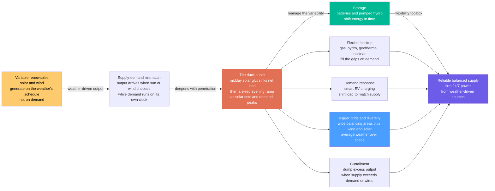

# 🦆 Grid Integration of Renewables: Running a Whole Grid on an Uncontrollable Faucet

> [!abstract] TL;DR
> The traditional grid is a machine you **command**: coal, gas, hydro, and nuclear plants are turned up and down second by second to chase demand, keeping supply and demand in perfect instantaneous balance. **Wind and solar break that model.** They are **variable** (weather-driven, gusting and clouding minute to minute), **uncertain** (only imperfectly forecast), **non-dispatchable** (you can turn them *down* by throwing energy away, but you cannot turn them *up* on demand), and **inverter-based** (they connect through power electronics, not spinning machines, so they lack the rotating **inertia** that instinctively steadies grid frequency). The signature symptom is the **duck curve**: midday solar floods the grid and sinks **net load** into a deep belly, then vanishes at dusk exactly as people come home, forcing other plants into a violent **evening ramp**. Push penetration higher and two more problems bite — **curtailment** (dumping cheap renewable energy when supply exceeds demand or transmission limits) and **declining system inertia**. Integration is the art of taming this variability with a **flexibility toolbox**: **storage** to shift energy in time, **flexible dispatchable backup** to fill the gaps, **demand response** to shift the load, **bigger grids and resource diversity** to average weather over space, stronger **transmission**, better **forecasting**, and **grid-forming inverters** for synthetic inertia. Turning cheap-but-uncontrollable wind and solar into reliable 24/7 power is *the* central operational challenge of the energy transition.

## Intuition

**Analogy:** Imagine trying to keep a bathtub at exactly the right level using a faucet you **do not control**. The faucet gushes hard when the sun blazes and the wind howls, then trickles to nothing at night or on a calm, cloudy evening — all on the *weather's* schedule, never yours. Meanwhile the **drain** (electricity demand) runs on its own rhythm: a little in the small hours, a surge when the city wakes, and a big pull in the evening when everyone gets home, cooks dinner, and switches on the lights. In the old world you had a faucet with a proper handle — you opened it to match the drain exactly, moment by moment. That is a grid built on **dispatchable** power. Renewables hand you a faucet stuck to the sky's whims. Your only "handle" is a shut-off valve: you can *waste* water when there is too much (that is **curtailment** — throwing energy away), but you cannot summon more when the tub runs low.

Now watch what a day looks like once solar dominates. At noon the faucet blasts — often pouring in **more water than the drain can take**, so you spill the overflow. But the sun sets at the worst possible moment: right as the evening drain opens wide. In a couple of hours you swing from "too much water, spilling over" to "not nearly enough, and the tub is emptying fast." Plotted out, that swing traces the belly-and-neck silhouette engineers named the **duck curve** — a sagging midday belly where solar drowns the net demand, then a steep neck as solar disappears and demand climbs, forcing every other plant to **ramp** furiously to catch up. Integrating renewables is everything you do to run that unreliable faucet like a reliable one: keep a **storage tank** (a battery) that you fill at noon and drain in the evening; keep a fast **backup faucet** (gas, hydro) with a real handle for the calm nights; **shift the drain** to when the water is flowing (charge cars and run dishwashers at midday); and **connect many tubs across a wide region** so one town's calm is cancelled by another's gale. None of it makes the sky obedient — it makes an *uncontrollable* faucet behave like a *dependable* one.

---

## How It Works

### Core Mechanics

A power grid has one non-negotiable rule: **generation must equal consumption at every instant**, or frequency drifts and the system destabilizes (this is the balancing job the grid note describes in detail, referenced in prose: *The_Electric_Power_Grid*). Traditional generators satisfy this rule by being **dispatchable** — an operator raises or lowers their output on command. Variable renewables clash with the rule on four fronts, and integration is the engineering that reconciles them:

1. **Variability — output follows the weather, not demand.** Solar traces a bell curve peaking at solar noon and falling to **zero at night**; wind gusts and lulls on timescales from seconds to seasons. Neither cares what the load is doing. The mismatch between a weather-shaped supply and an activity-shaped demand is the root of every downstream problem.

2. **Uncertainty — you cannot perfectly foresee it.** Because output depends on tomorrow's clouds and wind, it can only be **forecast**, never scheduled. Forecast errors must be covered by held-back **reserves**, and the reserve requirement grows with how much variable generation is on the system.

3. **Non-dispatchability — you can turn it down but not up.** A solar farm at noon is already giving everything the sun offers; there is no "more" to command. The only control is *downward* — **curtailment**, deliberately spilling available renewable energy when there is too much of it or the wires are full. Firming the supply *upward* has to come from storage, backup, or imports.

4. **Low inertia — inverter-based, not spinning.** Synchronous coal, gas, hydro, and nuclear generators store huge **rotational kinetic energy** in their spinning masses; when a fault suddenly unbalances supply and demand, that inertia instantly resists the frequency change, buying seconds for controls to respond. Solar, wind, and batteries connect through **power-electronic inverters** with no inherent rotating mass (the converter physics is covered in prose: *Power_Electronics_and_Converters*). As they displace synchronous plants, **system inertia falls**, frequency swings get faster and deeper, and stability becomes harder to hold.

**The duck curve, precisely.** Define **net load = demand − variable renewable generation** — the load that everything *else* on the grid must serve. Add more midday solar and the net load's midday value sinks; past enough penetration it carves a deep **belly** (California's CAISO made the shape canonical). Then, over the two to three hours around sunset, solar collapses while demand climbs toward its evening peak, so net load rockets upward — the duck's steep **neck**, a **ramp** of thousands of megawatts per hour that fast, flexible plants must chase. The belly can even dip **below zero** (renewables exceeding total demand), which forces **curtailment**. So one phenomenon breeds three integration headaches at once: **over-generation and curtailment** in the belly, a brutal **ramp** on the neck, and shrinking room for the inflexible baseload plants that used to run flat-out around the clock.

**The flexibility toolbox.** Everything that makes a high-renewable grid reliable is a way to add **flexibility** — the ability to move energy in time, in space, or in demand:

- **Storage** — batteries for daily shifting (charge the belly, discharge the neck: the direct duck-curve fix), and pumped-hydro or hydrogen for longer durations (technology detail in prose: *Batteries_and_Electrochemical_Storage*).
- **Flexible dispatchable backup** — fast-ramping gas, hydro, geothermal, and nuclear that fill the gaps when the weather quits.
- **Demand-side flexibility** — demand response and smart EV charging that **shift the load to the supply** (system detail in prose: *Smart_Grids_and_Demand_Response*).
- **Geographic and resource diversity** — wider **balancing areas** and combining wind with solar, so uncorrelated weather over a big region **averages out**: the aggregate is far smoother than any single site.
- **Stronger transmission and interconnection** — wires to move power from where it is windy or sunny to where the load is, and to share reserves across regions.
- **Better forecasting, grid-forming inverters and synthetic inertia, and sector coupling** — sharper predictions shrink reserves; grid-forming inverters can *emulate* inertia and even form the grid voltage themselves; coupling power to heat, hydrogen, and transport soaks up surplus and adds flexible demand.

### Flow / Architecture



---

## Key Concepts

### Secondary Level

- **The grid must balance every second.** Electricity is used the instant it is made — there is no giant buffer in the wires. So at every moment, total generation must equal total demand. Old power plants keep this balance by being turned **up and down on command**.
- **Sun and wind are not on-demand.** A solar farm makes power only when the sun shines and a wind farm only when the wind blows — on the **weather's** schedule, not yours. You can switch them *off*, but you cannot switch them *on* when the sky says no.
- **The duck curve.** When lots of solar floods the grid at midday, the demand left for other plants (the **net load**) sags into a "belly." Then the sun sets right as people come home, so that leftover demand shoots up in the evening — a steep "neck." The belly-and-neck shape is nicknamed the **duck curve**.
- **Curtailment is throwing energy away.** Sometimes at noon there is *more* clean power than anyone needs, or the wires cannot carry it. Then operators deliberately **waste** some of it — turning renewables down. It feels wrong to spill free energy, and it is a big reason storage matters.
- **The fixes, in plain words.** Keep **batteries** to save midday sun for the evening; keep fast **backup plants** for calm nights; **shift when we use power** (charge cars at noon); and **connect big regions** so one place's calm cancels another's gale. Together these turn an unreliable supply into a dependable one.

### Undergraduate Level

- **Net load and the duck curve, quantitatively.** $\text{NetLoad}(t) = \text{Demand}(t) - \text{VRE}(t)$. As solar capacity rises, the midday minimum of net load falls and the **evening ramp** $\frac{d(\text{NetLoad})}{dt}$ steepens. Grid operators track a **3-hour ramp** metric (e.g., CAISO evening ramps exceeding ~13 GW) because the fleet must physically ramp that fast.
- **Dispatchable vs variable vs firm.** *Dispatchable* generation follows commands (gas, hydro). *Variable* renewables (VRE) follow weather. A source's **capacity credit** (or firm capacity) is the fraction of its nameplate you can count on at peak — high for gas, but often only **10–30%** for wind and even lower for solar at a winter-evening peak, because the resource may simply be absent when the grid is most stressed.
- **Capacity vs energy.** Renewables can supply a large share of annual **energy** while contributing little **firm capacity**. Planning must satisfy *both* a peak-**power** adequacy constraint and an annual-**energy** target — they are different problems, and conflating them is a classic error.
- **Curtailment.** Curtailed energy is available renewable output that is *not* used, driven by **over-generation** (supply > demand in the belly), **transmission congestion** (wires full), or **minimum-generation / reserve** limits on must-run plants. Curtailment rates climb non-linearly once penetration passes roughly 20–30% without added flexibility.
- **Reserves and forecasting.** Because VRE is uncertain, operators hold **operating reserves** (spinning and non-spinning) sized to forecast error plus contingency. Better **forecasting** directly shrinks reserve needs and cost — a percent of forecast accuracy is worth real money and real emissions.
- **Storage as time-shifting.** A battery is defined by **power (MW)** and **energy (MWh)**; their ratio is **duration** (e.g., a 4-hour battery). Daily solar shifting wants ~4-hour batteries; smoothing multi-day wind lulls needs long-duration storage (pumped hydro, hydrogen) whose economics differ entirely.
- **Geographic and resource smoothing.** Aggregate variability falls as you combine many sites: if site fluctuations are partly independent, the standard deviation of the *average* of $N$ sites shrinks roughly like $1/\sqrt{N}$ for the uncorrelated part. Wider **balancing areas** and **wind + solar** blends exploit exactly this statistics-of-averaging effect.

### Graduate Level

- **Inertia and frequency stability.** Synchronous machines store kinetic energy $E = \tfrac{1}{2}J\omega^2$; the aggregate **inertia constant** $H$ sets the initial **rate of change of frequency**, $\text{RoCoF} \approx \frac{\Delta P}{2H}f_0$, after a disturbance. Displacing synchronous plants with inverter-based resources lowers $H$, so RoCoF rises and frequency nadirs deepen — the core stability worry at high penetration. Mitigations: **grid-forming (GFM) inverters** that impose voltage and provide **synthetic/virtual inertia** and fast frequency response, plus synchronous condensers for short-circuit strength.
- **Integration cost rises with penetration.** The **system value** of an added MWh of VRE is not just its LCOE; it includes **profile costs** (self-cannibalization of midday prices), **balancing costs** (reserves for forecast error), and **grid costs** (transmission, congestion). These integration costs are modest at low penetration but grow, so the *marginal* value of VRE declines even as its LCOE falls — the economic face of the duck curve.
- **From baseload thinking to flexibility.** The 20th-century mental model — cheap inflexible **baseload** plus expensive **peakers** — inverts. In a high-VRE system, near-zero-marginal-cost renewables provide bulk energy, and value shifts to **flexibility**: fast ramps, storage, dispatchable-down capability, and the ability to run few hours at high value. Inflexible baseload (must-run coal, inflexible nuclear) becomes a *liability* that forces curtailment.
- **The over-build / storage / transmission / firm-capacity trade space.** Getting the *last* few percent to 100% renewable is disproportionately hard: seasonal and multi-day weather droughts ("**Dunkelflaute**") demand either huge **long-duration storage**, large **over-building plus curtailment**, continent-scale **transmission**, or a residual sliver of **firm dispatchable** capacity (gas with CCS, hydrogen turbines, geothermal, nuclear). Studies (e.g., Kroposki *et al.*; NREL) show cost curves that bend sharply upward near 100%, making the *mix* of flexibility resources the central design question.
- **Sector coupling and flexible demand.** Coupling electricity to **heat** (heat pumps, thermal storage), **transport** (smart/bidirectional EV charging), and **hydrogen** (electrolysis) turns surplus VRE into stored energy in other sectors and adds large blocks of **shiftable demand** — arguably the cheapest large-scale flexibility, and the reason integration is increasingly a *whole-energy-system* problem, not just an electricity one.
- **Reliability metrics under high VRE.** Resource adequacy shifts from deterministic reserve margins to probabilistic **loss-of-load expectation (LOLE)** and **expected unserved energy (EUE)** computed over correlated weather years, because the binding risk is a **wind-and-solar drought coinciding with a demand peak**, not a single plant outage.

---

## Python Demo

```python
# Grid Integration of Renewables -- the two pictures that define the challenge.
# numpy + matplotlib only.
#
#   (a) THE DUCK CURVE & NET LOAD -- take a two-humped demand profile and subtract
#       solar generation at RISING penetration. The NET LOAD (what other plants must
#       serve) sinks into a deepening midday BELLY and rockets up in a steep evening
#       RAMP. Where solar exceeds demand, net load goes negative -> CURTAILMENT.
#   (b) STORAGE SMOOTHING -- add an energy-limited BATTERY that CHARGES in the belly
#       and DISCHARGES on the neck. The residual load other plants see is FLATTENED,
#       and the evening ramp is tamed: storage shifts energy in time.
#   (c) GEOGRAPHIC AVERAGING -- variability falls as you combine many wind sites.
#       Aggregating N partly-independent sites shrinks the fluctuation ~ 1/sqrt(N):
#       a wide balancing area is far smoother than any one turbine.
import numpy as np
import matplotlib.pyplot as plt

# ----------------------------------------------------------------------
# (a) Duck curve: demand - solar = net load, at rising solar penetration
# ----------------------------------------------------------------------
t  = np.linspace(0, 24, 24 * 12)          # 5-minute resolution over a day
dt = t[1] - t[0]                          # hours per step

# Two-humped demand: baseload + morning bump + larger evening peak
demand = (1.7
          + 0.30 * np.exp(-0.5 * ((t - 7.5) / 1.3) ** 2)     # morning ramp-up
          + 0.75 * np.exp(-0.5 * ((t - 19.5) / 1.6) ** 2))   # evening peak

# Clear-sky solar bell (zero at night), scaled by a penetration factor
solar_shape = np.clip(np.sin(np.pi * (t - 6) / 12), 0, None)   # sunrise 6, sunset 18
penetrations = [0.0, 0.6, 1.2, 1.8]                            # rising solar fleet
colors = ["#2d3436", "#0984e3", "#00b894", "#e17055"]

net_loads = [demand - p * solar_shape for p in penetrations]

# Metrics for the highest-penetration case
net_hi = net_loads[-1]
ramp = np.gradient(net_hi, dt)                         # d(netload)/dt  [per hour]
evening = (t >= 16) & (t <= 20)
max_ramp = ramp[evening].max()
curtailed = np.trapz(np.clip(-net_hi, 0, None), dx=dt) # energy where net load < 0
print("DUCK CURVE  (highest solar penetration)")
print(f"  midday net-load minimum : {net_hi.min():+.2f}  (negative -> curtailment)")
print(f"  steepest evening ramp   : {max_ramp:+.2f} per hour")
print(f"  curtailed energy        : {curtailed:.2f} (units of power x hours)\n")

# ----------------------------------------------------------------------
# (b) Storage smoothing: an energy-limited battery flattens the net load
# ----------------------------------------------------------------------
target = net_hi.mean()          # aim to flatten net load toward its daily mean
P_max  = 0.65                   # max charge/discharge power
E_max  = 2.6                    # energy capacity  (power x hours)
soc    = 0.5 * E_max            # start half-charged
residual = np.zeros_like(net_hi)
soc_trace = np.zeros_like(net_hi)

for i, nl in enumerate(net_hi):
    want = nl - target                          # >0: discharge to pull residual down
    if want > 0:                                # DISCHARGE (evening neck)
        p = min(want, P_max, soc / dt)          # limited by power and stored energy
        soc -= p * dt
        residual[i] = nl - p
    else:                                       # CHARGE (midday belly / surplus)
        p = min(-want, P_max, (E_max - soc) / dt)
        soc += p * dt
        residual[i] = nl + p
    soc_trace[i] = soc

ramp_res = np.gradient(residual, dt)
print("STORAGE SMOOTHING")
print(f"  peak evening ramp  : {max_ramp:+.2f}/h  ->  {ramp_res[evening].max():+.2f}/h with battery")
print(f"  net-load spread    : {net_hi.ptp():.2f}  ->  {residual.ptp():.2f} with battery\n")

# ----------------------------------------------------------------------
# (c) Geographic averaging: combining N wind sites smooths the aggregate
# ----------------------------------------------------------------------
rng = np.random.default_rng(1)
wind_shape = 0.55 + 0.20 * np.sin(2 * np.pi * (t - 3) / 24)     # mild diurnal wind
def wind_site():
    noise = rng.normal(0, 1, t.size)
    smooth = np.convolve(noise, np.ones(9) / 9, mode="same")    # correlated gusts
    return np.clip(wind_shape + 0.45 * smooth, 0, None)

single = wind_site()
N = 25
fleet = np.mean([wind_site() for _ in range(N)], axis=0)
sd1 = (single - single.mean()).std()
sdN = (fleet  - fleet.mean()).std()
print("GEOGRAPHIC AVERAGING")
print(f"  fluctuation std: 1 site {sd1:.3f}  ->  {N} sites {sdN:.3f} "
      f"({sd1/sdN:.1f}x smoother, ~1/sqrt(N) expected {np.sqrt(N):.1f}x)")

# ----------------------------------------------------------------------
# Plot
# ----------------------------------------------------------------------
fig, ax = plt.subplots(1, 3, figsize=(18, 5.4))
fig.suptitle("Grid Integration of Renewables: the duck curve, storage, and the "
             "smoothing power of a big grid", fontsize=13, fontweight="bold")

# (a) duck curve at rising penetration
for p, nl, c in zip(penetrations, net_loads, colors):
    lbl = "demand (no solar)" if p == 0 else f"net load, solar x{p:.1f}"
    ax[0].plot(t, nl, color=c, lw=2.2, label=lbl)
ax[0].fill_between(t, net_hi, 0, where=(net_hi < 0),
                   color="#fdcb6e", alpha=0.6, label="curtailment (surplus)")
ax[0].axhline(0, color="grey", lw=0.8)
ax[0].annotate("midday belly", (12, net_hi.min()), xytext=(8, 0.7), fontsize=8,
               arrowprops=dict(arrowstyle="->", color="green"))
ax[0].annotate("steep evening ramp", (18.5, 1.8), xytext=(12.5, 2.6), fontsize=8,
               arrowprops=dict(arrowstyle="->", color="crimson"))
ax[0].set_title("(a) The duck curve\nmore solar -> deeper belly, steeper neck")
ax[0].set_xlabel("hour of day"); ax[0].set_ylabel("net load  [normalised]")
ax[0].set_xlim(0, 24); ax[0].set_xticks(range(0, 25, 4))
ax[0].legend(fontsize=7.5, loc="upper left"); ax[0].grid(alpha=0.3)

# (b) storage smoothing
ax[1].plot(t, net_hi,   color="#e17055", lw=2.2, label="net load (no storage)")
ax[1].plot(t, residual, color="#6c5ce7", lw=2.6, label="residual (with battery)")
ax[1].fill_between(t, residual, net_hi, where=(residual < net_hi),
                   color="#00b894", alpha=0.25, label="battery discharge")
ax[1].fill_between(t, residual, net_hi, where=(residual > net_hi),
                   color="#0984e3", alpha=0.25, label="battery charge")
ax[1].axhline(target, color="grey", ls=":", lw=1)
ax[1].set_title("(b) Storage shifts energy in time\ncharge the belly, discharge the neck")
ax[1].set_xlabel("hour of day"); ax[1].set_ylabel("load other plants serve")
ax[1].set_xlim(0, 24); ax[1].set_xticks(range(0, 25, 4))
ax[1].legend(fontsize=7.5, loc="upper left"); ax[1].grid(alpha=0.3)

# (c) geographic averaging
ax[2].plot(t, single, color="#b2bec3", lw=1.4, label="1 wind site (jagged)")
ax[2].plot(t, fleet,  color="#0984e3", lw=2.6, label=f"{N} sites averaged (smooth)")
ax[2].set_title(f"(c) Bigger grid = smoother supply\nvariability falls ~1/sqrt(N): "
                f"{sd1/sdN:.1f}x steadier")
ax[2].set_xlabel("hour of day"); ax[2].set_ylabel("wind output  [normalised]")
ax[2].set_xlim(0, 24); ax[2].set_xticks(range(0, 25, 4))
ax[2].legend(fontsize=8, loc="upper right"); ax[2].grid(alpha=0.3)

plt.tight_layout(rect=[0, 0, 1, 0.93])
plt.show()
```

Running this prints the concrete integration numbers and draws the three defining pictures. **Panel (a)** builds the **duck curve**: as the solar fleet grows, the **net load** other plants must serve sinks into an ever-deeper midday **belly** — eventually going **negative**, the shaded **curtailment** zone where clean power is spilled — then rockets up in a steep evening **ramp** as solar sets into the demand peak. **Panel (b)** adds an energy-limited **battery** that charges in the belly and discharges on the neck; the residual load is visibly **flattened** and the peak ramp shrinks — storage literally *shifts energy in time*, the direct duck-curve fix. **Panel (c)** shows the quiet superpower of a **bigger grid**: one turbine's output is jagged and unpredictable, but averaging 25 partly-independent sites smooths the aggregate by roughly $\sqrt{N}$, because uncorrelated gusts cancel — the statistical reason wide **balancing areas** and **wind + solar** blends make variability manageable.

---

## Real-World Applications

> **Example — California's CAISO and the birth of the duck.** The California grid operator's own **duck-curve** chart (first published ~2013, worsening every year since) is the canonical case: rooftop and utility solar now drive spring midday **net load** so low that CAISO routinely **curtails** thousands of MWh of solar, while the post-sunset **ramp** exceeds ~13 GW in under three hours. California's response is the whole flexibility toolbox at scale — a battery fleet that has grown to **>10 GW**, charging on the belly and discharging into the evening neck (now regularly the single largest supply source at dusk), plus imports over interties, demand response, and time-of-use pricing that nudges load toward midday.

- **South Australia — low-inertia, inverter-dominated operation.** A grid that has run at **100% instantaneous renewables** for stretches, South Australia pioneered the response to lost inertia: the Hornsdale **grid-scale battery** for fast frequency response, **synchronous condensers** for short-circuit strength, and **grid-forming inverters** — a live laboratory for running a large grid with little spinning mass.
- **Denmark and the wider European grid — smoothing by interconnection.** Denmark supplies ~50%+ of its electricity from wind by leaning on a **big balancing area**: it exports surplus wind to Norwegian and Swedish **hydro** (which acts as a giant battery) and imports when calm. Continent-scale **transmission** turns local weather variability into a manageable aggregate — geographic diversity as infrastructure.
- **Texas ERCOT — cheap wind, curtailment, and transmission build-out.** West Texas wind was so abundant and so far from load that it drove **negative prices** and heavy curtailment until the **CREZ** transmission lines were built to carry it to cities — a textbook demonstration that renewable *energy* is worthless without **wires** and flexibility to absorb it.
- **Virtual power plants and smart charging — demand as flexibility.** Aggregators now orchestrate thousands of home batteries, EVs, and smart thermostats into a **virtual power plant** that shifts demand into the solar belly and shaves the evening peak (the mechanism detailed in prose: *Smart_Grids_and_Demand_Response*) — flexibility built from the *demand* side rather than new generation.

---

## Common Pitfalls

- **Confusing energy share with capacity/firmness.** "We hit 60% renewable energy this year" says nothing about the worst hour. Wind and solar can deliver most annual **energy** while contributing little **firm capacity** at a cold, calm, dark winter-evening peak. Adequacy is a *power-at-the-worst-moment* problem; annual energy is a different one, and treating them as the same underbuilds reliability.
- **Assuming more solar always cuts emissions and cost one-for-one.** Past the point where the belly hits the floor, extra midday solar is increasingly **curtailed** — it displaces nothing and earns nothing. Without added storage, transmission, or flexible demand, the *marginal* value of more solar collapses even as its LCOE keeps falling.
- **Ignoring the ramp, fixating on the peak.** Early integration analysis worried about the midday **belly**; the harder operational problem is the **neck** — the steep evening ramp. A fleet can have plenty of capacity yet be unable to **ramp fast enough**. Flexibility (MW-per-minute) matters as much as capacity (MW).
- **Forgetting inertia and grid-forming needs.** Displacing synchronous machines with inverters silently erodes **system inertia**, raising RoCoF and making frequency harder to hold — a stability problem invisible in energy-balance spreadsheets. High-penetration grids need **grid-forming inverters**, synthetic inertia, and short-circuit strength designed in, not bolted on after a blackout.
- **Treating storage as one thing.** A 4-hour battery brilliantly solves the *daily* duck curve but does nothing for a **multi-day wind drought** (Dunkelflaute) or seasonal imbalance. Daily shifting and long-duration/seasonal firming are different jobs needing different technologies (batteries vs pumped hydro / hydrogen). Sizing one for the other is a costly category error.
- **Clinging to baseload thinking.** Inflexible must-run plants (some coal, inflexible nuclear) that cannot turn down become a **liability** in a high-VRE grid — they force curtailment of cheaper renewables. The value has shifted from cheap-and-constant to **flexible**; planning as if the goal is still 24/7 baseload gets the whole system wrong.
- **Underestimating the last 10%.** Getting from 0 to ~80% renewable is comparatively cheap; the final push to ~100% runs into rare, correlated **weather droughts** that demand hugely oversized storage, transmission, or a firm-capacity backstop. Extrapolating early, easy cost trends to the endgame badly understates the difficulty.

*(Sibling notes in this Power Grid and Systems section — The_Electric_Power_Grid, Smart_Grids_and_Demand_Response, Grid_Stability_Reliability_and_Blackouts, and Batteries_and_Electrochemical_Storage, together with Solar_Photovoltaics in the Renewable Energy section — supply, respectively, the instantaneous supply-demand balancing rule this note must satisfy, the demand-side flexibility that shifts load to the sun, the inertia and reliability physics that curtailment and low inertia threaten, the time-shifting technology that fixes the duck curve, and the variable resource whose midday bell creates the duck in the first place.)*

---

## Related Concepts

**The electrical-engineering companions — the same challenge from the wires' side**
- [[Renewable_Energy_Integration]] — the EE deep-dive on connecting variable, inverter-based resources: phasors, frequency control, grid-forming inverters, and grid codes; this note is the whole-**energy-system** view (weather, markets, the flexibility mix), that one is the **circuits-and-control** view
- [[Power_Systems_and_the_Grid]] — the generation-transmission-distribution machine and the instantaneous balancing rule that variability, curtailment, and lost inertia all stress
- [[Power_Electronics_and_Converters]] — the **inverter** that couples solar, wind, and batteries to the grid; why inverter-based resources lack native inertia and how grid-forming control supplies synthetic inertia

**The variable resource and the vault hub**
- [[Wind_Energy]] — the other great variable renewable; combining wind with solar is a core diversity strategy, since wind's stronger night-and-winter output often fills solar's gaps
- [[Energy_Systems_Overview]] — the vault hub: integration is where the "generation," "grid," and "storage" links of the whole energy chain collide and must be reconciled

**The systems-thinking lens — reliability of a coupled network**
- [[Resilience_and_Robustness]] — a high-renewable grid must stay reliable under correlated weather shocks; the robustness-fragility trade-off and reserve margins are exactly this problem at the system level
- [[Feedback_Loops_and_Causality]] — the grid is a real-time balancing **feedback loop** (frequency signals commanding generation); low inertia weakens that loop's damping, the root of the stability worry

---

## Review Questions

**Secondary**
1. Using the "bathtub with an uncontrollable faucet" analogy, explain (a) why running a grid on wind and solar is harder than running it on a coal plant, (b) what the **duck curve** is and why the *evening* is the scary part, and (c) name three things we do to make an unreliable supply behave like a reliable one.

**Undergraduate**
2. A grid adds enough solar that midday **net load** drops near zero. (a) Sketch the net-load duck curve and mark the belly, the neck/ramp, and the region where **curtailment** occurs. (b) Explain why building *even more* solar makes the evening ramp problem worse, not better. (c) You may add either a fleet of **4-hour batteries** or a new **long-distance transmission line** to a windy neighbouring region. Explain how each reduces curtailment and eases the ramp, and give one situation where each is clearly the better choice.

**Graduate**
3. A system operator is driving instantaneous VRE penetration from 40% toward 90%. (a) Explain how falling **system inertia** changes RoCoF and frequency stability, and what **grid-forming inverters** and synchronous condensers contribute. (b) Distinguish the **capacity vs energy** and **capacity-credit** issues: why can a grid meet 80% of annual energy from VRE yet still need substantial firm capacity, and what sets that need (hint: Dunkelflaute / LOLE over correlated weather years)? (c) Explain why the *marginal system value* of VRE declines with penetration even as its LCOE falls, naming the profile, balancing, and grid components of integration cost, and argue which flexibility resources you would add to bend the cost curve near 100%.

---

## Sources

- B. Kroposki, B. Johnson, Y. Zhang, *et al.* — "Achieving a 100% Renewable Grid: Operating Electric Power Systems with Extremely High Levels of Variable Renewable Energy," *IEEE Power & Energy Magazine*, 2017 — the definitive survey of inertia, grid-forming inverters, and high-penetration operation
- P. Denholm, M. O'Connell, G. Brinkman, J. Jorgenson — *Overgeneration from Solar Energy in California: A Field Guide to the Duck Chart* (NREL/TP-6A20-65023, 2015) and related NREL renewable-integration studies — the origin and analysis of the duck curve, curtailment, and flexibility
- A. von Meier — *Electric Power Systems: A Conceptual Introduction* (Wiley/IEEE Press, 2006) — accessible grounding in grid balancing, dispatch, frequency control, and why supply must match demand instantly
- IEA — *Renewables Integration* and *Grid-Scale Storage / Power Systems in Transition* reports (annual) — global data on curtailment, capacity credit, system flexibility, and integration policy
- H. Holttinen *et al.* (IEA Wind Task 25) — "Design and Operation of Energy Systems with Large Amounts of Variable Generation" — the multi-country evidence base on reserves, balancing costs, and geographic smoothing

---

#energy-systems #renewable-integration #duck-curve #curtailment #grid-flexibility
