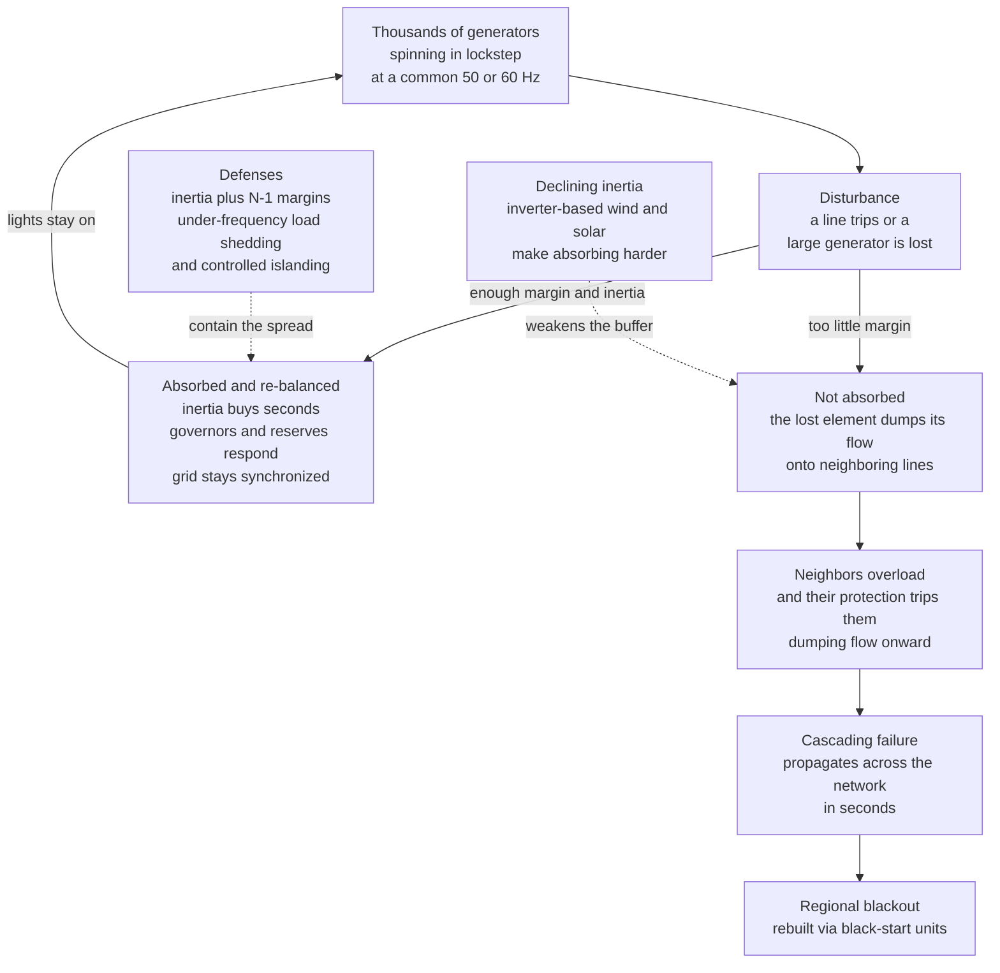

# ⚡ Grid Stability, Reliability, and Blackouts: Keeping a Continent Synchronized

> [!abstract] TL;DR
> An AC power grid stays up through a **delicate synchronized dance**: thousands of generators strung across a continent all spin in near-perfect lockstep, every one locked to the same **50 or 60 Hz beat**, instant by instant matching generation to demand. **Grid stability** is the physics and engineering of keeping that dance in step — **frequency stability** (generation equals load, cushioned by **inertia** from spinning mass), **voltage stability** (reactive-power balance), and **rotor-angle stability** (generators staying in synchronism after a jolt). **Reliability** is designing and operating so the loss of *any single element* — the **N-1 criterion** — never brings the system down, backed by reserves, protective relays, and metrics like SAIDI and loss-of-load probability. When a disturbance is *not* absorbed, a single failure — an overloaded line sagging into a tree, a generator tripping — dumps its load onto neighbors, which overload and trip too, dumping load onward in a **cascading failure** that can black out a region in seconds. This is the signature of a tightly coupled complex system: the **2003 Northeast blackout** darkened 50 million people from one un-trimmed tree in Ohio, and blackout sizes follow a **heavy-tailed** distribution reminiscent of self-organized criticality. The grid defends itself with inertia, N-1 margins, automatic **under-frequency load shedding**, **islanding**, and **black-start** recovery. The great modern challenge: inverter-based **wind and solar carry little or no inherent inertia**, so as they displace spinning generators the grid's frequency swings get **faster and deeper**, forcing new tools — synthetic and grid-forming inertia, fast frequency response, and storage — and tying power engineering directly to complexity science.

## Intuition

**Analogy — a continent-wide troupe of dancers on one beat.** Picture a vast dance troupe, tens of thousands of dancers spread across a continent, all keeping *exactly* the same rhythm — the grid's **50 or 60 Hz** beat. No conductor tells each one what to do moment to moment; instead they are physically coupled, so if one starts to slow, the others feel the tug and pull it back into time. This is what synchronous generators do: they are enormous spinning masses electromagnetically locked to a common frequency, and their shared **inertia** means the whole troupe changes speed only slowly. Knock one dancer a little off-step and the group absorbs it without missing a beat. That constant absorption of small disturbances is why the lights stay on despite the grid being poked thousands of times a day.

Now knock one dancer *badly* off-step — a big generator trips offline, or a heavily loaded line fails. The power that dancer was carrying does not vanish: it is suddenly thrown onto the neighbors, who now carry more than their share. If they can absorb it, the stumble dies out. If they cannot, a neighbor buckles and throws *its* load onward, which buckles the next — a **cascading failure** rippling outward faster than any human can react, until an entire region goes dark. The grid survives normal life because it is built with **margins** (it can lose any one component and keep running — "**N-minus-1**") and automatic reflexes (shed some load, split into islands) that contain a stumble before it avalanches. Push it past those margins — on a brutally hot day with lines already sagging, or with too few spinning machines to steady the beat — and a local hiccup becomes a regional collapse. **Grid stability and reliability are the engineering of staying synchronized and absorbing shocks; blackouts are what a tightly coupled complex system does when a single failure is allowed to cascade** — and it is getting harder as inertia-providing spinning generators give way to inverter-based wind and solar.

---

## How It Works

### Core Mechanics

An AC grid is a single, continent-spanning machine held together by a shared frequency. Its stability rests on a chain of balances that must be maintained every instant:

1. **Synchronism and the common frequency.** Every synchronous generator spins at a speed tied to the grid frequency (a 2-pole machine at 3000 rpm for 50 Hz). They are electromagnetically **locked together** — nudge one ahead in phase and a restoring torque pulls it back, exactly like coupled pendulums. The frequency is a **shared heartbeat**: it is the *same everywhere* on a synchronous interconnection, and it reads out the instantaneous balance of supply and demand.

2. **Frequency stability and inertia.** Frequency rises when generation exceeds load and falls when load exceeds generation. The spinning mass of all the generators (and motors) stores rotational kinetic energy; this **inertia** resists frequency change, so a sudden imbalance produces a *gradual* frequency slide rather than an instant jump. The initial slope is the **rate of change of frequency (RoCoF)**, set by how big the imbalance is relative to how much inertia is spinning. Inertia buys the **seconds** during which **governors** ramp generators up or down (**primary frequency response**) to arrest the slide, after which slower **secondary/tertiary reserves** restore the target frequency.

3. **Voltage stability.** Separately from frequency, each point on the grid must hold its **voltage** within limits, which depends on the balance of **reactive power** (the out-of-phase power that magnetizes lines, transformers, and motors). When heavily loaded lines can no longer supply enough reactive power, voltages sag and can collapse — **voltage instability** — a distinct failure mode that has caused major blackouts on its own.

4. **Rotor-angle (transient and small-signal) stability.** After a fault or switching event, generators swing in rotor angle relative to one another (the **swing equation**). If the restoring synchronizing torque wins, they settle back into step (**transient stability**); if a generator swings too far, it **loses synchronism** and must be tripped. Poorly damped **small-signal oscillations** between regions can also grow until protection acts.

5. **Reliability and the N-1 criterion.** Operators run the system so that the loss of **any single element** — a line, a transformer, the largest generator — leaves the grid still within all limits: this is the **N-1 contingency criterion**. It is backed by **operating reserves** (spinning and standby), **protection systems** (relays that sense faults in milliseconds and **breakers** that isolate them), and measured by reliability metrics — **SAIDI/SAIFI** (average outage duration/frequency per customer), **loss-of-load probability/expectation**, and reserve margin.

6. **When containment fails — the cascade.** If a disturbance exceeds the margins, the lost element **redistributes its flow onto neighbors**. Those overload, their protection trips them, and *their* flow redistributes further — a **cascading failure** that spreads across the network in seconds. Automatic defenses try to break the chain: **under-frequency load shedding (UFLS)** deliberately disconnects blocks of load when frequency plunges, and controlled **islanding** splits the grid into self-supporting pieces. If those fail, the region blacks out and must be rebuilt from **black-start** units.

7. **The declining-inertia challenge.** Inverter-based **wind and solar** connect through power electronics and provide **little or no inherent inertia**. As they displace spinning machines, total system inertia falls, so the *same* generator trip now produces a **faster, deeper** frequency excursion (higher RoCoF) — leaving less time to respond and edging closer to load-shedding thresholds. This drives new stability tools: **synthetic/grid-forming inertia**, **fast frequency response** from batteries, and entirely new stability paradigms.

### Flow / Architecture



---

## Key Concepts

### Secondary Level

- **The grid runs on one shared beat.** Every power plant on a grid spins in step at the same rhythm — 50 or 60 times a second. As long as they all keep that beat together, the electricity flows smoothly. The beat is like a heartbeat you can measure: if it speeds up, there is too much power being made; if it slows down, there is not enough.
- **Balance every second.** Electricity can't easily be stored in bulk on the wires, so at every instant the amount being *made* must equal the amount being *used*. Operators are constantly nudging plants up and down to keep that balance.
- **Heavy spinning wheels steady things (inertia).** The huge spinning generators act like heavy flywheels: when something suddenly changes, their weight keeps the beat from jumping instantly, giving humans and machines a few precious seconds to react.
- **A blackout is a chain reaction.** If one power line or plant fails and the others can't take up the slack, the extra load falls on the next line, which then fails too, and the next — a **domino chain** that can black out a whole region in seconds. The famous **2003 blackout** started from a single overgrown tree touching a power line and ended up darkening 50 million people.
- **The grid is built to survive one failure.** Engineers design the grid so that losing *any one thing* — a line, a plant — won't bring it down. That safety rule is called **N-minus-one**. Blackouts happen when *more* than the margin fails, or when the safety reflexes can't act fast enough.
- **Why wind and solar make it trickier.** Wind turbines and solar panels don't spin like old power plants — they plug in through electronics and don't add that steadying flywheel weight. So as we use more of them, the beat can change faster, and keeping the grid steady becomes a new engineering puzzle.

### Undergraduate Level

- **Frequency = the balance signal.** System frequency is a direct, real-time readout of the generation-load balance. Surplus generation accelerates the aggregate machine (frequency up); deficit decelerates it (frequency down). Because frequency is common across a synchronous interconnection, it is the single most important control variable.
- **The three timescales of frequency response.** **Inertial response** (instantaneous, from stored rotational energy, sets the initial RoCoF) → **primary control** (governors, seconds, arrests the fall and reaches a steady droop offset) → **secondary control** (AGC, tens of seconds to minutes, restores nominal frequency) → **tertiary** (reserves re-dispatched). Inertia does not *fix* frequency; it slows the change so the slower loops have time to act.
- **Governor droop and the settling frequency.** Generators share load changes via **droop**: an R of 5% means a 5% frequency drop commands full extra output. After a loss ΔP, frequency settles at Δf ≈ −ΔP / (D + 1/R), where D is load damping — a nonzero offset that secondary control then removes.
- **Voltage vs frequency stability.** Frequency is a *system-wide* balance of real power (MW); **voltage** is a *local* balance of reactive power (MVAr). Long, heavily loaded lines consume reactive power and can suffer **voltage collapse** independent of frequency. Both must stay within limits; they are controlled by different means (governors/reserves vs. capacitors, tap changers, and generator excitation).
- **Rotor-angle stability and the swing equation.** Each machine obeys 2H·d²δ/dt² = P_mech − P_elec, with electrical power P_elec ∝ sin δ across the line. A fault reduces P_elec, the rotor accelerates, and whether it re-synchronizes is judged by the **equal-area criterion**. This is the physics of coupled oscillators (see *[[Oscillations_and_SHM]]* and *[[Rotational_Dynamics]]*).
- **N-1 security and contingency analysis.** Operators continuously run **contingency analysis** — simulating the loss of each credible single element — and re-dispatch so that no single failure violates a thermal, voltage, or stability limit. Reserves are sized to cover at least the largest single infeed loss.
- **Protection and its double edge.** **Relays** detect faults (over-current, distance, under-frequency) and command **breakers** to isolate them in tens of milliseconds — essential, but the *same* fast tripping is what propagates a cascade when relays trip healthy but overloaded lines. Coordinating protection to isolate faults without amplifying cascades is a core design tension.
- **Reliability metrics.** **SAIDI** (System Average Interruption Duration Index) and **SAIFI** (frequency), **LOLP/LOLE** (loss-of-load probability/expectation, hours per year), **EENS** (expected energy not served), and **planning reserve margin** quantify how reliable a system is and drive investment.
- **UFLS, islanding, and black start.** When frequency plunges past staged thresholds, **under-frequency load shedding** automatically drops blocks of load to rescue the remaining system. **Islanding** deliberately splits the grid into balanced sub-systems to halt a cascade. After a total blackout, **black-start** units (hydro, some gas turbines, increasingly batteries) that can start without external power re-energize the network piece by piece.

### Graduate Level

- **The system frequency response (SFR) model.** The center-of-inertia frequency after a disturbance is captured by a low-order model: 2H·d(Δω)/dt = ΔP_gov − ΔP_L − D·Δω with a governor lag τ_g·d(ΔP_gov)/dt = −ΔP_gov − (1/R)·Δω. The **initial RoCoF** is ΔP_L/(2H_sys), the **nadir** depends on H, R, τ_g and the reheat fraction, and the **quasi-steady-state** offset is −ΔP_L/(D + 1/R). Falling H_sys raises RoCoF and deepens the nadir toward UFLS thresholds — the quantitative heart of the inertia problem.
- **RoCoF limits and protection interactions.** Distributed generation and some machines carry **RoCoF relays** and **vector-shift** protection; excessive RoCoF (e.g., > 0.5–1 Hz/s) can spuriously trip large blocks of embedded generation, converting a modest imbalance into a large one — a key concern in low-inertia grids (a factor examined after the 2019 GB and 2016 South Australia events).
- **Rotor-angle vs voltage vs frequency taxonomy.** Formally (Kundur et al.), power-system stability splits into **rotor-angle** (small-signal and transient), **voltage** (small-disturbance and large-disturbance), and **frequency** stability, each with short- and long-term dynamics. Real blackouts often couple modes — e.g., voltage collapse triggering angular instability triggering cascade tripping.
- **Cascading failure as a complex-systems phenomenon.** A cascade is a **load-redistribution process on a network**: removing an element redistributes power flows (per Kirchhoff/DC-power-flow, *not* simple nearest-neighbor), pushing others past capacity and tripping them. Models range from the **Motter–Lai** capacity-tolerance model to the **OPA / CASCADE / branching-process** models of Dobson, Carreras, and Newman. A striking empirical result: **blackout sizes are heavy-tailed** (roughly power-law in energy unserved or customers affected), and grids appear to self-organize toward a **critical** operating point where cascades of all sizes occur — a form of **self-organized criticality** (see *[[Criticality_and_Phase_Transitions]]*). This ties directly to *[[Cascades_and_Systemic_Risk]]* and to **robustness-fragility** trade-offs (*[[Resilience_and_Robustness]]*): the efficiency and tight coupling that make the grid cheap in calm times are what let a small failure go global.
- **The cascade/tipping window.** As with Watts' cascade model, there is a window in loading/margin: too much margin (over-built) and no cascade propagates; too little and even normal fluctuations cascade. Operators trade capital cost against tail risk, which is why blackout risk is intrinsically **heavy-tailed rather than Gaussian** — the largest events dominate the expected cost.
- **Resilience vs reliability.** **Reliability** targets *credible* contingencies (N-1, sometimes N-2) and everyday component failures. **Resilience** targets *high-impact, low-probability* events — extreme weather (Winter Storm Uri, 2021), wildfires, coordinated **cyber-physical attacks** (the 2015 Ukraine grid attack), and correlated failures that violate the independence assumptions behind N-1. Hardening, black-start capability, microgrids, and diversity of supply are resilience measures beyond classical reliability.
- **Grid-forming vs grid-following inverters.** Conventional (grid-**following**) inverters need an existing voltage/frequency reference and provide no inertia. **Grid-forming** inverters *impose* a voltage waveform and can emulate inertia and provide instantaneous fast frequency response and even black-start — a leading candidate for stabilizing very-high-renewable grids. **Synthetic inertia** from wind turbines (releasing rotor kinetic energy) and fast frequency response from batteries partly substitute for lost synchronous inertia, but change the dynamics rather than replicate them.
- **Metrics for a low-inertia future.** System operators now monitor **synchronous inertia (GVA·s)** and **minimum inertia requirements**, procure **fast frequency response** and **inertia services** in markets, and study **synchronous condensers** (spinning machines that provide inertia and reactive support without generating). The stability problem is migrating from a purely mechanical-electromagnetic one to a **control-and-power-electronics** one.

---

## Python Demo

```python
# Grid stability in one figure: numpy + matplotlib only.
#
#   (a) FREQUENCY DYNAMICS vs INERTIA -- when a large generator trips, the grid
#       frequency dips then recovers. A low-order System Frequency Response
#       model shows how MORE inertia (H) slows the initial drop (RoCoF) and
#       lifts the nadir, buying time; LOW inertia (high inverter-renewable
#       share) gives a faster, deeper plunge that risks under-frequency
#       load shedding.
#   (b) CASCADE / N-1 MARGIN TIPPING POINT -- on a network, removing one loaded
#       node dumps its load onto neighbors; if their MARGIN is thin they trip
#       too, cascading. Sweeping the margin shows a sharp tipping point between
#       "one failure = regional blackout" and "N-1 secure".
#   (c) HEAVY-TAILED BLACKOUT SIZES -- near the critical margin, random single
#       triggers produce mostly tiny outages and rarely a system-wide one:
#       the hallmark heavy tail of a self-organized-critical grid.
import numpy as np
import matplotlib.pyplot as plt

rng = np.random.default_rng(7)

# ================= (a) SYSTEM FREQUENCY RESPONSE vs INERTIA =================
f_nom = 50.0                 # nominal frequency [Hz]
dPL   = 0.20                 # sudden generation loss [pu of system], e.g. a big unit trips
R     = 0.05                 # governor droop [pu freq / pu power] -> gain 1/R = 20
D     = 1.0                  # load damping [pu power / pu freq]
tau_g = 4.0                  # lumped governor/turbine time constant [s]
dt    = 0.01
t     = np.arange(0.0, 20.0, dt)

def sfr(H):
    """Integrate the 2-state System Frequency Response model (RK4).
       States: dw = per-unit freq deviation, Pg = governor extra power [pu]."""
    dw = np.zeros_like(t); Pg = np.zeros_like(t)
    def deriv(w, pg):
        dw_dt  = (pg - dPL - D * w) / (2.0 * H)     # swing: governor power minus loss minus damping
        dpg_dt = (-pg - (1.0 / R) * w) / tau_g      # governor droop with a first-order lag
        return dw_dt, dpg_dt
    for i in range(1, len(t)):
        w, pg = dw[i-1], Pg[i-1]
        k1w, k1p = deriv(w, pg)
        k2w, k2p = deriv(w + 0.5*dt*k1w, pg + 0.5*dt*k1p)
        k3w, k3p = deriv(w + 0.5*dt*k2w, pg + 0.5*dt*k2p)
        k4w, k4p = deriv(w + dt*k3w,     pg + dt*k3p)
        dw[i] = w  + (dt/6.0)*(k1w + 2*k2w + 2*k3w + k4w)
        Pg[i] = pg + (dt/6.0)*(k1p + 2*k2p + 2*k3p + k4p)
    return f_nom * (1.0 + dw)

H_levels = [8.0, 4.0, 2.0]                       # high -> low system inertia
labels   = ["High inertia  H=8 s", "Medium  H=4 s", "Low inertia  H=2 s (renewable-heavy)"]
colors   = ["#2a9d8f", "#e9a12b", "#e63946"]
freqs    = [sfr(H) for H in H_levels]

ufls = 49.0                                       # first under-frequency load-shed stage [Hz]
print("=== (a) Frequency response after a generation loss ===")
for H, f in zip(H_levels, freqs):
    rocof  = f_nom * dPL / (2.0 * H)              # initial |RoCoF| [Hz/s]
    nadir  = f.min()
    shed   = "SHEDS LOAD" if nadir < ufls else "survives"
    print(f"  H={H:>3.0f} s :  RoCoF={rocof:5.2f} Hz/s   nadir={nadir:6.3f} Hz   -> {shed}")

# ================= build an Erdos-Renyi power network for (b) and (c) ============
n = 200
p_edge = 0.045
U = rng.random((n, n)) < p_edge
A = np.triu(U, 1); A = (A | A.T).astype(float)    # symmetric adjacency, no self-loops
deg = A.sum(axis=1)
L0  = deg + 1.0                                    # nodal "load" proxy: hubs carry more

def run_cascade(alpha, seed):
    """Remove node 'seed'; redistribute failed load equally to alive neighbors;
       any alive node above capacity (1+alpha)*L0 fails next round. Return failed fraction."""
    C     = (1.0 + alpha) * L0
    alive = np.ones(n, dtype=bool)
    L     = L0.copy()
    alive[seed] = False
    newly = [seed]
    while newly:
        add = np.zeros(n)
        for f in newly:
            nb = np.where(A[f] > 0)[0]
            nb = nb[alive[nb]]
            if nb.size:
                add[nb] += L[f] / nb.size
        L += add
        L[~alive] = 0.0
        over  = alive & (L > C)
        newly = list(np.where(over)[0])
        alive[over] = False
    return 1.0 - alive.mean()

# --- (b) sweep the N-1 margin; trigger on the biggest hubs, average ---
hubs   = np.argsort(deg)[-12:]
alphas = np.linspace(0.02, 1.2, 40)
frac   = np.array([np.mean([run_cascade(a, s) for s in hubs]) for a in alphas])
knee   = alphas[np.argmax(frac < 0.05)] if np.any(frac < 0.05) else alphas[-1]
print("\n=== (b) Cascade vs N-1 margin ===")
print(f"  thin margin  alpha=0.05 -> {run_cascade(0.05, hubs[-1])*100:4.0f}% of grid lost from ONE trip")
print(f"  N-1-secure margin needed: about alpha = {knee:.2f}  (one loss stays contained)")

# --- (c) heavy-tailed blackout sizes at a near-critical margin ---
alpha_c = 0.20
sizes   = np.array([run_cascade(alpha_c, rng.integers(n)) for _ in range(2000)])
sizes   = sizes[sizes > 0]
s_sort  = np.sort(sizes)
ccdf    = 1.0 - np.arange(len(s_sort)) / len(s_sort)     # P(size >= x)
print("\n=== (c) Blackout-size distribution at critical margin ===")
print(f"  median event = {np.median(sizes)*100:4.1f}% of grid   "
      f"max event = {sizes.max()*100:4.0f}%   mean = {sizes.mean()*100:4.1f}%")

# ================================ plotting ================================
fig, (axA, axB, axC) = plt.subplots(1, 3, figsize=(17.5, 5.4))
fig.suptitle("Grid stability: inertia cushions the frequency dip, thin N-1 margins let one "
             "failure cascade, and blackout sizes are heavy-tailed",
             fontsize=13, fontweight="bold")

# (a) frequency response
for f, lab, c in zip(freqs, labels, colors):
    axA.plot(t, f, color=c, lw=2.4, label=lab)
axA.axhline(f_nom, color="0.5", lw=1.0, ls=":")
axA.axhline(ufls,  color="#8d0801", lw=1.6, ls="--", label="under-frequency load-shed line")
axA.set_xlabel("time after the generator trips  [s]")
axA.set_ylabel("grid frequency  [Hz]")
axA.set_title("(a) More inertia = slower, shallower dip\nlow inertia risks load shedding", fontsize=11)
axA.set_xlim(0, 20); axA.grid(alpha=0.3); axA.legend(loc="lower right", fontsize=7.6)

# (b) cascade vs margin -- the tipping point
axB.plot(alphas, 100 * frac, "o-", color="#5f0f40", lw=2.4, ms=4)
axB.axvline(knee, color="#2a9d8f", ls="--", lw=1.6, label=f"N-1 secure  (alpha~{knee:.2f})")
axB.fill_between(alphas, 0, 100 * frac, where=(alphas < knee), color="#e63946", alpha=0.12)
axB.set_xlabel("spare capacity margin  alpha  ->  more headroom")
axB.set_ylabel("percent of grid lost from ONE trip")
axB.set_title("(b) The reliability tipping point\nthin margins -> regional blackout", fontsize=11)
axB.grid(alpha=0.3); axB.legend(loc="upper right", fontsize=8)

# (c) heavy-tailed blackout sizes
axC.step(100 * s_sort, ccdf, where="post", color="#1d3557", lw=2.2)
axC.set_xscale("log"); axC.set_yscale("log")
axC.set_xlabel("blackout size  [percent of grid, log]")
axC.set_ylabel("P( size >= x )  [log]")
axC.set_title("(c) Heavy-tailed blackout sizes\nmostly tiny, rarely system-wide", fontsize=11)
axC.grid(alpha=0.3, which="both")

plt.tight_layout(rect=[0, 0, 1, 0.92])
plt.show()
```

Running this prints the frequency-response summary and the cascade statistics, then draws three panels. **Panel (a)** integrates the System Frequency Response model for three inertia levels after the *same* generator trip: the high-inertia case (green) slides slowly and shallowly and recovers to a small droop offset, while the low-inertia case (red) shows a **steeper initial RoCoF and a deeper nadir** — and if that nadir crosses the dashed **under-frequency load-shedding line**, protective relays automatically disconnect blocks of load. This is exactly why displacing spinning generators with inverter-based wind and solar tightens the stability margin. **Panel (b)** is the **reliability tipping point**: with a thin spare-capacity margin, losing a single hub cascades into a loss of a large fraction of the grid (shaded red region), but past a critical margin the same single failure stays contained — the quantitative meaning of **N-1 security**. **Panel (c)** runs thousands of random single triggers at a near-critical margin and plots the complementary CDF of blackout sizes on log-log axes: the result is **heavy-tailed** — the vast majority of disturbances fizzle into tiny outages, but a small fraction cascade to system-wide collapse, the statistical fingerprint of the grid as a self-organized-critical, tightly coupled complex system.

---

## Real-World Applications

> **Example — the 2003 Northeast blackout, a textbook cascade.** On 14 August 2003, on a hot afternoon in Ohio, a set of heavily loaded transmission lines sagged into un-trimmed trees and tripped. A software bug in the operator's alarm system meant no one saw the danger. Each tripped line **redistributed its power onto neighbors**, which overloaded and tripped in turn, and within about an hour the cascade had raced across the northeastern US and Canada, tripping generators and lines faster than any operator could intervene. **~50 million people** lost power for up to two days. The official US-Canada task force report reads like a checklist of this note: inadequate situational awareness, violated **N-1** operating margins, and vegetation contact seeding a **cascading failure** in a tightly coupled network. It directly motivated mandatory, enforceable reliability standards (NERC).

- **2003 Italy blackout.** A single tree flashover on an interconnector from Switzerland, followed by failure to rebalance imports in time, cascaded to island the entire Italian peninsula and black out ~56 million people — a cross-border version of the same mechanism, and a case study in the risks of leaning heavily on tie-line imports.
- **2021 Texas / Winter Storm Uri.** An extreme, correlated weather event froze gas wellheads, wind turbines, and plants simultaneously while heating demand spiked. Frequency fell toward the point of a **total collapse**, and ERCOT was minutes from a system-wide blackout when it ordered massive **rolling load shedding** to save the grid. This is the difference between **reliability** (credible single failures) and **resilience** (high-impact correlated events that violate independence assumptions) — hundreds died and the grid nearly collapsed anyway.
- **South Australia, September 2016.** Storm-damaged transmission towers plus wind-farm control settings that tripped generation on repeated voltage dips, combined with **high inverter-based penetration and low synchronous inertia**, produced a very high RoCoF that tripped the interconnector and blacked out the whole state. It became the world's cautionary tale for **low-inertia stability** — and spurred the **Hornsdale** big battery for fast frequency response.
- **N-1 contingency operation everywhere.** Every transmission operator (PJM, National Grid, ENTSO-E, etc.) runs real-time and day-ahead **contingency analysis**, holds **operating reserves** sized to the largest single infeed loss, and dispatches to remain N-1 secure — the everyday, invisible engineering that keeps single failures from becoming blackouts.
- **Under-frequency load shedding and black-start plans.** Grids maintain staged **UFLS** schemes (drop X% of load at 49.0 Hz, more at 48.8 Hz, etc.) and rehearsed **black-start** sequences using hydro, fast gas turbines, and increasingly **grid-forming batteries** to rebuild the network after a total collapse.
- **The renewable transition in practice.** Operators now publish **minimum inertia requirements**, procure **fast frequency response** and **inertia** as market services, deploy **synchronous condensers**, and pilot **grid-forming inverters** and **synthetic inertia** from wind and storage — the operational front line of maintaining stability as spinning machines retire. The system layer where storage, forecasting, and demand response combine to firm variable output is addressed in the sibling notes on *Grid_Integration_of_Renewables*, *Smart_Grids_and_Demand_Response*, and *Batteries_and_Electrochemical_Storage*.

---

## Common Pitfalls

- **Confusing inertia with reserves (or thinking inertia "fixes" frequency).** Inertia does **not** restore frequency — it only slows the *rate* of change, buying seconds for governors and reserves to act. A grid can have plenty of energy reserve yet dangerously little inertia, so the frequency plunges past load-shed thresholds *before* the reserves can respond. They are different services on different timescales.
- **Assuming a small trigger implies a small blackout.** The size of the initiating event tells you almost nothing about the size of the outcome — a single tree branch caused a 50-million-person blackout. Cascades are governed by **connectivity, loading, and margins**, not by trigger magnitude, and their sizes are **heavy-tailed**, so averaging or Gaussian intuition badly understates tail risk.
- **Treating protective relays as purely protective.** The same fast tripping that isolates a genuine fault will **trip a healthy-but-overloaded line** and propagate a cascade. Mis-coordinated or hidden-failure protection has amplified several major blackouts. Protection must be studied as part of the *system* dynamics, not element by element.
- **Confusing reliability with resilience.** N-1 planning covers *credible independent* single failures; it does **not** cover correlated, high-impact events (extreme weather, coordinated cyber-attack) that knock out many elements at once. Uri and the Ukraine attack failed precisely where the N-1 independence assumption breaks. Resilience is a distinct, additional discipline.
- **Ignoring voltage stability by focusing only on frequency.** Frequency gets the headlines, but **voltage collapse** from reactive-power shortfall is a separate failure mode that has caused major blackouts on its own. A grid can be frequency-stable and still collapse in voltage.
- **Underestimating the low-inertia RoCoF problem.** As inverter-based renewables displace synchronous machines, high RoCoF can **spuriously trip embedded generation and RoCoF relays**, turning a modest imbalance into a large one. Planning that assumes historical inertia levels will misjudge nadirs and load-shedding risk in a high-renewable grid.
- **Modeling a cascade as nearest-neighbor dominoes.** Real power flows redistribute according to **Kirchhoff's laws across the whole network**, not just to adjacent lines — a trip in one place can overload a line far away. Purely local cascade models miss this non-local redistribution and mispredict which elements are actually at risk.

---

## Related Concepts

This note sits in the **Power Grid & Systems** pillar (S05) of the Energy Systems vault and takes the *stability, reliability, and failure* view of the grid. Its section siblings are referenced here **in prose**: *The_Electric_Power_Grid* (the structure of generation, transmission, and distribution this note keeps synchronized), *Grid_Integration_of_Renewables* (the system layer where variable, inverter-based supply is firmed and the inertia challenge is managed), *Transmission_Distribution_and_Microgrids* (the network whose lines overload and cascade, and the microgrids/islanding that contain failures), *Smart_Grids_and_Demand_Response* (the sensing, control, and flexible-demand tools that raise stability margins), and *Batteries_and_Electrochemical_Storage* (the millisecond fast frequency response and synthetic inertia that increasingly substitute for spinning mass). The wikilinks below point to notes that already exist elsewhere in the vault.

**Energy Systems context**
- [[Energy_Systems_Overview]] — the whole find-convert-deliver-balance chain; grid stability is the instant-by-instant *balancing* that keeps the delivery system standing up
- [[Wind_Energy]] — inverter-coupled generation that provides little inherent inertia and whose control settings have triggered instability, a central driver of the low-inertia challenge
- [[Solar_Photovoltaics]] — the other major inverter-based source displacing synchronous machines and reshaping frequency dynamics
- [[Renewable_Energy_Integration]] — the duck curve, curtailment, firming, and inertia issues that the transition creates for stability
- [[Power_Electronics_and_Converters]] — the inverters through which renewables and batteries connect; grid-forming inverters and synthetic inertia are power-electronics answers to lost synchronous inertia

**Power-engineering foundations**
- [[Power_Systems_and_the_Grid]] — the electrical-engineering treatment of AC power flow, three-phase transmission, and grid operation underlying stability analysis
- [[Rotational_Dynamics]] — the rotational kinetic energy and moment of inertia of spinning generators that *is* grid inertia; the swing equation is Newton's second law for rotation
- [[Oscillations_and_SHM]] — synchronous generators behave as coupled oscillators; rotor-angle stability and inter-area oscillations are this physics applied to the grid

**The complex-systems view of blackouts**
- [[Cascades_and_Systemic_Risk]] — the general theory of local failures propagating through coupled networks; the 2003 blackout is its canonical power-grid example
- [[Resilience_and_Robustness]] — the robustness-fragility trade-off: the efficiency and tight coupling that make the grid cheap in calm times are what let a small failure cascade
- [[Criticality_and_Phase_Transitions]] — the tipping behavior and heavy-tailed event sizes; grids appear to self-organize toward a critical operating point where cascades of all sizes occur
- [[Bifurcations_and_Tipping_Points]] — the sharp margin threshold between "one failure is contained" and "one failure blacks out a region"
- [[Network_Science_Fundamentals]] — the network structure (hubs, connectivity, percolation) that governs whether a shock fizzles or spreads

---

## Review Questions

**Secondary**
1. Explain, using the "troupe of dancers on one beat" idea, what it means for a power grid to stay *synchronized*, and why the grid measures a **frequency** (like 50 or 60 Hz). Then describe in your own words how a **blackout** can spread as a chain reaction from a single failure, and give one reason engineers design the grid to survive losing any *one* component. Finally, say why wind turbines and solar panels make keeping the grid steady harder than old spinning power plants did.

**Undergraduate**
2. A large generator supplying 10% of a grid's load suddenly trips. (i) Explain the sequence of **inertial response → primary (governor) response → secondary control** and what each does to the frequency over its timescale. (ii) Two grids are identical except one has twice the **inertia** H; sketch and compare their frequency curves (initial RoCoF, nadir, settling frequency), and explain which is more likely to trigger **under-frequency load shedding** and why. (iii) State the **N-1 criterion** and explain how contingency analysis and operating reserves are used to keep a *single* generator or line loss from cascading into a blackout.

**Graduate**
3. A system operator is planning for a grid moving from 20% to 70% inverter-based renewables. (i) Using the System Frequency Response model, explain quantitatively how falling synchronous inertia changes the **RoCoF** and **nadir** for the same disturbance, and why this raises the risk of both UFLS activation and spurious RoCoF-relay tripping of embedded generation. (ii) Contrast **reliability** (N-1 design) with **resilience**, using Winter Storm Uri and the 2016 South Australia event to show where the independence assumptions behind N-1 break down. (iii) Explain why blackout sizes are **heavy-tailed** and what "self-organized criticality" implies for the grid as a complex system, and evaluate three mitigations — **synchronous condensers**, **grid-forming inverters / synthetic inertia**, and **fast frequency response from batteries** — for how each addresses (or fails to address) the loss of synchronous inertia.

---

## Sources

- P. Kundur — *Power System Stability and Control* (McGraw-Hill, 1994) — the definitive reference on rotor-angle, voltage, and frequency stability, the swing equation, and control
- A. von Meier — *Electric Power Systems: A Conceptual Introduction* (Wiley-IEEE, 2006) — an accessible conceptual treatment of grid operation, balance, and stability
- U.S.-Canada Power System Outage Task Force — *Final Report on the August 14, 2003 Blackout in the United States and Canada* (2004) — the authoritative anatomy of a cascading failure and its causes
- I. Dobson, B. A. Carreras, V. E. Lynch & D. E. Newman — "Complex systems analysis of series of blackouts: Cascading failure, criticality, and self-organization," *Chaos* 17, 026103 (2007) — the heavy-tailed, self-organized-critical view of blackouts
- P. Kundur et al. — "Definition and classification of power system stability," *IEEE Transactions on Power Systems* 19(3), 2004 — the standard taxonomy of stability types

---

#energy-systems #grid-stability #blackouts #cascading-failure #inertia
