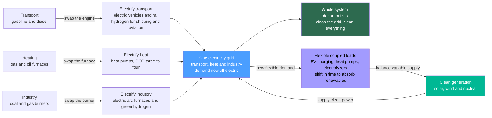

# ⚡ Sector Coupling and Electrification: Electrify Everything, Then Clean the Power

> [!abstract] TL;DR
> Today's energy system is really **several separate systems that barely talk to each other** — electricity in the wires, gasoline and diesel for transport, gas and oil for heating, coal and gas for industry — and most of them burn fossil fuels directly, so **only about a fifth of final energy is electricity**. The master strategy for deep decarbonization is elegant: **electrify everything, then clean up the electricity**. Swap the gasoline car for an electric one, the gas furnace for an electric **heat pump**, the industrial gas burner for an electric or green-hydrogen process — and once those demands ride on the grid, making the grid clean (solar, wind, nuclear) cleans them *all at once*. Merging these previously-separate sectors into one electricity-centered web is called **sector coupling**. It beats a straight fuel swap for two reasons: electric end-uses are often far **more efficient** (a heat pump delivers 3–4 units of heat per unit of electricity; an EV wastes far less than an engine), so the electrified system needs **less total energy**; and millions of new flexible loads — car chargers, heat pumps, electrolyzers — can be **shifted in time** to soak up variable renewables, turning demand into grid **flexibility**. The catch: it **grows electricity demand** and demands a massive clean-generation and grid buildout, plus new infrastructure (charging, heat-pump rollout), and it leaves hard-to-electrify niches (shipping, aviation, some industry) for **hydrogen and e-fuels**. Electrify, couple the sectors, clean the power — and the whole system decarbonizes together.

## Intuition

**Analogy:** Imagine four separate businesses in a town that each buy their own fuel and never coordinate — a taxi fleet running on gasoline, a heating company burning gas, a foundry burning coal, and only the *electric utility* running on wires. If you wanted to "clean up the town," you'd have to fix each business separately: cleaner gasoline, cleaner gas, cleaner coal — four hard problems. Now imagine you first **rewire all four to plug into the same electric grid** — the taxis become EVs, the heaters become heat pumps, the foundry goes electric. Suddenly you have *one* problem instead of four: **clean the grid, and every business gets clean at the same moment.** That is the whole trick of electrification and sector coupling — collapse many fossil systems into one electric system, then decarbonize that single system.

Two things make this better than just swapping one fuel for another. First, the electric machines are usually **more efficient at delivering the actual service**: a heat pump does not *make* heat by burning something — it *moves* heat from outside like a fridge in reverse, delivering three to four units of warmth for one unit of electricity, while an electric motor turns almost all its energy into motion instead of dumping most of it as engine heat. So the electrified town needs **less total energy** to do the same jobs. Second, many of these new electric loads are **patient** — an EV parked for eight hours does not care *which* hour it charges, a water heater or heat store can preheat early — so millions of them can be nudged to run when the sun is blazing or the wind is strong, helping the grid **absorb variable renewables** instead of fighting them. Electrify the demand, couple the sectors, clean the supply.

---

## How It Works

### Core Mechanics

Sector coupling is the deliberate **integration of the transport, heat, and industry sectors with the electricity sector**, using electricity (and secondarily hydrogen and heat) as the shared energy carrier. The logic runs in a fixed order:

1. **Start from the siloed, fossil-fueled system.** Final energy today is split across largely independent sectors — transport (oil), buildings heat (gas/oil), industry (coal/gas/oil), and electricity — and burning fuels *directly* at the point of use means each sector must be decarbonized on its own terms. Electricity is only **~20% of final energy**, so cleaning the grid alone touches only a fifth of the problem.
2. **Electrify the end uses.** Replace direct fuel combustion with electric technologies at the point of demand:
   - **Transport** — battery **electric vehicles** replace internal-combustion cars; electrify rail; reserve **hydrogen and e-fuels** for the genuinely hard cases (shipping, aviation, long-haul).
   - **Heating** — electric **heat pumps** replace gas and oil furnaces and boilers in buildings (and increasingly in industrial and district heat); their efficiency comes from *moving* heat, not making it.
   - **Industry** — electrify process heat, use **electric arc furnaces** for steel recycling, and deploy **green hydrogen** (made by electrolysis) for primary steel, ammonia, and chemicals that resist direct electrification.
3. **All demand now rides on one grid.** Once the end uses are electric, the transport, heat, and industry loads all appear as *electricity* demand. Cleaning the grid now decarbonizes the whole coupled system.
4. **Clean the electricity supply.** Scale **solar, wind, and nuclear** (plus hydro, geothermal, storage) so the grid the coupled sectors draw from is low-carbon. Because everything is coupled to it, *one* clean-up cleans everything.
5. **Turn the new loads into flexibility — Power-to-X.** Because many electric loads are time-flexible, they double as demand-side balancing. **Power-to-heat** (heat pumps + thermal storage), **power-to-gas/hydrogen** (electrolyzers), and **power-to-mobility** (smart EV charging) let the coupled sectors *absorb* variable renewables — shifting consumption to windy/sunny hours instead of curtailing generation. New demand becomes new **flexibility**.

**The efficiency multiplier.** The reason electrification often *shrinks* total energy use is that electric end-uses beat combustion at delivering the actual service. A heat pump with a coefficient of performance (COP) of 3.5 delivers 3.5 kWh of heat per kWh of electricity; a gas furnace at 90% delivers only 0.9 kWh of heat per kWh of gas. An EV converts ~85% of its stored energy to wheel motion; a gasoline engine converts only ~20–25%. So even though electricity *demand* grows in absolute terms, **primary (and final) energy needed for the same services falls** — the coupled, electrified system does more with less.

**The trade-off.** Electrification concentrates demand on the grid, so it **greatly increases electricity demand** (needing a large clean-generation and transmission buildout), requires enormous **infrastructure rollout** (chargers, heat pumps, industrial retrofits), and cannot economically reach every niche — leaving **hydrogen and e-fuels** for hard-to-electrify transport and industry.

### Flow / Architecture



---

## Key Concepts

### Secondary Level

- **Our energy system is really several separate systems.** Electricity runs the lights, gasoline runs cars, gas runs furnaces, coal and gas run factories — and most of them burn fossil fuel directly. Electricity is only about **a fifth** of the energy we use.
- **The big idea: electrify everything, then clean the electricity.** Swap the gasoline car for an electric one, the gas furnace for an electric **heat pump**, the factory burner for an electric process. Now those jobs run on the grid — so **making the grid clean makes them all clean at once.**
- **Joining the sectors together is called "sector coupling."** Instead of fixing transport, heating, and industry one hard problem at a time, you merge them onto one clean electric system and solve them together.
- **Electric machines often use less energy.** A **heat pump** gives 3–4 units of warmth for 1 unit of electricity (it *moves* heat like a fridge in reverse instead of burning fuel), and an electric car wastes far less than a gasoline engine. So the electrified system does the same jobs with **less total energy**.
- **New electric loads can help the grid.** Millions of car chargers and heat pumps don't care exactly *when* they run, so they can turn on when the sun and wind are strong — soaking up clean power instead of wasting it.
- **The catch.** Electrifying everything means the grid must get **much bigger and much cleaner**, and a few jobs (ships, planes, some heavy industry) are hard to electrify and may use **hydrogen** instead.

### Undergraduate Level

- **Why only ~20% of final energy is electricity today.** Final energy is dominated by *direct* fuel combustion in transport, buildings, and industry. Decarbonizing the *grid* alone therefore addresses only that ~20%; the strategy of **electrify-then-decarbonize-electricity** first *moves* the other sectors onto the grid so that cleaning the grid decarbonizes the whole.
- **Electrification of the three big end uses.** **Transport** — EVs (and rail) for most road/rail miles, hydrogen/e-fuels for shipping, aviation, and long-haul. **Heat** — electric **heat pumps** replacing gas/oil boilers in buildings and increasingly in low/medium-temperature industrial and district heat. **Industry** — electric process heat, **electric arc furnaces**, and **green hydrogen** (electrolytic) for primary steel, ammonia, and chemicals.
- **The heat pump and COP.** A heat pump moves heat from a cold source to a warm sink, delivering **COP = useful heat / electrical work in**, typically 3–4 for space heating (higher for mild climates, lower in deep cold). Because it *pumps* rather than *burns* heat, it beats the ~90% ceiling of a combustion boiler by a factor of 3–4 — the single largest efficiency lever in building decarbonization.
- **Well-to-wheel / source-to-service efficiency.** Comparing an ICE car (tank-to-wheel ~20–25%) with an EV (battery-to-wheel ~85%) shows electrification delivers the same *service* (kWh at the wheels) for far less *input* energy — the core reason electrification lowers total energy demand even as it raises electricity demand.
- **Sector coupling and Power-to-X.** Coupling integrates the sectors around electricity plus secondary carriers (hydrogen, heat): **power-to-heat**, **power-to-gas/hydrogen**, **power-to-mobility**. The coupling is bidirectional in *value* — new loads consume clean power *and* provide flexibility by shifting when they consume.
- **New loads as flexibility (demand response + storage).** EV batteries (smart charging, vehicle-to-grid), heat pumps paired with **thermal storage** (preheat the building/tank when power is cheap), and electrolyzers (run when renewables are abundant) turn otherwise-rigid demand into dispatchable flexibility that firms variable solar and wind — the demand-side complement to batteries and pumped hydro.
- **The demand-growth challenge.** Full electrification can double or more the electricity a country needs, so clean generation and the grid must scale in step; the efficiency multiplier softens this (less *total* energy) but does not remove the need for a large clean-power and transmission buildout.

### Graduate Level

- **Primary-energy accounting and the "efficiency dividend."** Deep-electrification scenarios (e.g. Jacobson's 100% wind-water-solar work) find that global **end-use energy demand falls by roughly a third** versus a business-as-usual fossil pathway, chiefly because electric drivetrains and heat pumps convert energy to service far more efficiently and because you eliminate the primary-energy overhead of extraction, refining, and thermal-generation losses. This "efficiency dividend" is why electrified pathways are less energy-intensive than the fossil systems they replace — a crucial and often-missed point in demand forecasting.
- **Marginal COP and the winter-peak problem.** Heat-pump COP falls as the source-sink temperature lift grows (Carnot-limited), so heating demand and heat-pump *inefficiency* both peak in cold snaps, driving a **winter electricity peak** in high-heat-pump regions. This reshapes system planning: it favors thermal storage, hybrid heat pumps, building-fabric efficiency, and firm/dispatchable capacity, and it couples the power system's peak to weather in a new way (see *Smart_Grids_and_Demand_Response* and *Grid_Integration_of_Renewables* for the balancing response).
- **Cross-sector flexibility and the value of coupling.** Coupling raises the *flexible fraction* of demand. Optimal-dispatch and capacity-expansion models show that smart EV charging, thermal-storage-buffered heat pumps, and electrolyzers can absorb a large share of would-be-curtailed renewable output, lowering the storage and firm-capacity needed for a given renewable share. Coupling thus reduces total system cost relative to treating each sector's decarbonization in isolation — the quantitative case for an integrated energy-system model rather than sector-by-sector optimization.
- **Power-to-X and the hydrogen economy at the margin.** Direct electrification is the efficient default; **hydrogen and derived e-fuels** (ammonia, e-methanol, e-kerosene) are the *last-resort* carriers for what electrification cannot reach — high-temperature industry, chemical feedstocks, shipping, aviation, and seasonal storage. Round-trip and conversion losses make Power-to-X-to-Power inefficient (often <40% round-trip), so hydrogen is reserved for hard-to-abate niches and long-duration/seasonal balancing rather than as a general electricity substitute — a recurring efficiency argument in transition roadmaps.
- **Infrastructure co-evolution and stranded assets.** Electrification forces simultaneous buildout of charging networks, distribution-grid reinforcement, heat-pump manufacturing and installer capacity, and (for hydrogen) electrolysis and pipeline infrastructure, while gas distribution networks and refineries risk **stranding**. The transition is therefore a coupled infrastructure and industrial-policy problem, not merely a technology-swap — the systems-of-systems framing that makes energy-system engineering distinct.
- **Emissions accounting on a decarbonizing grid.** An EV or heat pump's carbon footprint tracks the **marginal grid carbon intensity** at the time of use; on a dirty grid the near-term benefit is muted, but because the same asset gets cleaner every year as the grid decarbonizes, electrification "locks in" a declining-emissions trajectory that a new fossil appliance cannot. This time-dynamic (and the case for time-of-use, carbon-aware flexible charging) is central to honest lifecycle comparison.
- **The rebound and adequacy caveats.** Cheaper, more efficient electric services can induce demand rebound, and a weather-coupled, largely-electrified system raises **resource-adequacy** stakes: correlated cold-and-still ("Dunkelflaute") events stress a system whose heating *and* mobility now depend on electricity. Robust decarbonization pairs electrification with firm clean capacity, long-duration storage, strong transmission, and demand flexibility — the reliability counterpart to the efficiency story.

---

## Python Demo

```python
# Electrification and sector coupling, in one figure. numpy + matplotlib only.
#
#   (a) EFFICIENCY GAIN -- input energy needed to deliver ONE unit of useful
#       service, done the fossil way vs electrified. A gas furnace vs a heat
#       pump, and a gasoline car vs an EV. Electric end-uses need far LESS input.
#   (b) SYSTEM ENERGY -- electrifying transport + heat + industry GROWS
#       electricity demand, yet because heat pumps and EVs are so efficient the
#       TOTAL final energy for the same services SHRINKS. Siloed-fossil today vs
#       electrified-and-clean tomorrow.
#   (c) COUPLED FLEXIBLE LOADS -- new electric loads (EV charging, heat pumps,
#       electrolyzers) are time-flexible: scheduled into the midday solar
#       surplus they flatten net load and absorb renewables, instead of piling
#       onto the evening peak when charged naively.
import numpy as np
import matplotlib.pyplot as plt

# ---- shared efficiency assumptions ----
eta_furnace, cop_hp = 0.90, 3.5        # gas boiler efficiency; heat-pump COP
eta_ice,     eta_ev = 0.22, 0.85       # ICE tank-to-wheel; EV battery-to-wheel

# ================= (a) EFFICIENCY GAIN OF ELECTRIFICATION =================
# Input energy required to deliver 1 unit of useful service.
services   = ["Space heating\n(1 unit of heat)", "Driving\n(1 unit at wheels)"]
fossil_in  = np.array([1/eta_furnace, 1/eta_ice])   # units of FUEL in
electric_in= np.array([1/cop_hp,      1/eta_ev])    # units of ELECTRICITY in
saving     = 100 * (1 - electric_in / fossil_in)
print("=== (a) Input energy per unit of useful service ===")
for s, f, e, sv in zip(services, fossil_in, electric_in, saving):
    print(f"  {s.splitlines()[0]:<14}: fossil {f:.2f}  vs  electric {e:.2f}"
          f"   ({sv:.0f}% less input)")

# ================= (b) SYSTEM FINAL ENERGY: SILOED vs ELECTRIFIED =================
# Illustrative final-energy shares today, normalized to 100 (electricity ~20%).
today = {"Electricity (already)": 20.0, "Oil - transport": 28.0,
         "Gas/oil - heat": 30.0, "Coal/gas - industry": 22.0}
# Electrify each end use with its efficiency multiplier -> final energy shrinks.
useful_transport = today["Oil - transport"] * eta_ice
elec_transport   = useful_transport / eta_ev
useful_heat      = today["Gas/oil - heat"] * eta_furnace
elec_heat        = useful_heat / cop_hp
elec_industry    = today["Coal/gas - industry"] * 0.65   # electric + some H2 losses
electrified = {"Electricity (existing)": today["Electricity (already)"],
               "Transport - now electric": elec_transport,
               "Heat - now heat pumps":    elec_heat,
               "Industry - electric + H2": elec_industry}
tot_today, tot_elec = sum(today.values()), sum(electrified.values())
print("\n=== (b) System final energy ===")
print(f"  today (siloed, fossil)   : {tot_today:.0f} units,  electricity share "
      f"{100*today['Electricity (already)']/tot_today:.0f}%")
print(f"  electrified + clean grid : {tot_elec:.0f} units,  nearly all electric"
      f"   ({100*(1-tot_elec/tot_today):.0f}% less TOTAL final energy)")

# ================= (c) COUPLED FLEXIBLE LOADS ABSORB SOLAR =================
dt = 0.25; t = np.arange(0, 24, dt)
solar = 10.0 * np.exp(-((t - 12.5) / 2.8) ** 2)          # midday solar bell [GW]
solar[(t < 6.5) | (t > 18.5)] = 0.0
base  = (6.0 + 1.5 * np.exp(-((t - 8.0) / 1.5) ** 2)     # rigid non-flex demand
             + 3.0 * np.exp(-((t - 19.5) / 2.0) ** 2))

flex_energy = 18.0                                        # GWh/day of EV+HP+H2 load
surplus = np.maximum(solar - base, 0.0)                   # midday clean surplus
flex_managed = flex_energy * surplus / (surplus.sum() * dt)     # shift INTO surplus
evening = np.exp(-((t - 19.0) / 1.6) ** 2)               # naive "plug in after work"
flex_naive = flex_energy * evening / (evening.sum() * dt)

net_naive   = base + flex_naive   - solar                 # net load, unmanaged
net_managed = base + flex_managed - solar                 # net load, coupled/flexible
print("\n=== (c) Flexibility of coupled loads ===")
print(f"  evening peak, naive charging : {net_naive.max():.2f} GW")
print(f"  evening peak, smart coupling : {net_managed.max():.2f} GW"
      f"   ({100*(1-net_managed.max()/net_naive.max()):.0f}% lower)")

# ================================ plotting ================================
fig, (axA, axB, axC) = plt.subplots(1, 3, figsize=(17.5, 5.6))
fig.suptitle("Electrify everything, then clean the power: the efficiency gain, "
             "the shrinking-yet-electric energy system, and flexible coupled loads",
             fontsize=13, fontweight="bold")

# (a) efficiency gain -- grouped bars
x = np.arange(len(services)); w = 0.36
axA.bar(x - w/2, fossil_in,   w, color="#e76f51", label="fossil (burn fuel)")
axA.bar(x + w/2, electric_in, w, color="#2a9d8f", label="electric (pump / motor)")
for xi, f, e in zip(x, fossil_in, electric_in):
    axA.text(xi - w/2, f + 0.08, f"{f:.2f}", ha="center", fontsize=9)
    axA.text(xi + w/2, e + 0.08, f"{e:.2f}", ha="center", fontsize=9)
axA.set_xticks(x); axA.set_xticklabels(services, fontsize=9)
axA.set_ylabel("input energy per unit of useful service")
axA.set_title("(a) Electric end-uses need far LESS input\nheat pump COP 3.5, EV vs engine",
              fontsize=11)
axA.legend(fontsize=8); axA.grid(alpha=0.3, axis="y")

# (b) system final energy -- stacked bars
def stack(ax, xpos, d, cmap):
    bottom = 0.0
    for (label, val), c in zip(d.items(), cmap):
        ax.bar(xpos, val, 0.55, bottom=bottom, color=c, label=label)
        if val > 3:
            ax.text(xpos, bottom + val/2, f"{val:.0f}", ha="center",
                    va="center", fontsize=8, color="white")
        bottom += val
    return bottom
cols_t = ["#4a9eff", "#e76f51", "#f4a300", "#7f5539"]
cols_e = ["#4a9eff", "#2a9d8f", "#00b894", "#a29bfe"]
tt = stack(axB, 0, today,       cols_t)
te = stack(axB, 1, electrified, cols_e)
axB.text(0, tt + 2, f"total {tt:.0f}", ha="center", fontsize=9, fontweight="bold")
axB.text(1, te + 2, f"total {te:.0f}", ha="center", fontsize=9, fontweight="bold")
axB.set_xticks([0, 1]); axB.set_xticklabels(["Today\nsiloed, fossil",
                                             "Electrified\n+ clean grid"], fontsize=9)
axB.set_ylabel("final energy  [normalized units]")
axB.set_title("(b) Electricity demand grows, yet\nTOTAL energy SHRINKS (efficiency)",
              fontsize=11)
axB.set_ylim(0, tt + 12); axB.legend(fontsize=6.5, loc="upper right"); axB.grid(alpha=0.3, axis="y")

# (c) flexible coupled loads
axC.plot(t, solar, color="#f4a300", lw=2.2, label="solar generation")
axC.plot(t, net_naive,   color="#e76f51", lw=2.0, ls="--", label="net load: naive charging")
axC.plot(t, net_managed, color="#2a9d8f", lw=2.6, label="net load: smart coupling")
axC.fill_between(t, 0, flex_managed, color="#a29bfe", alpha=0.35,
                 label="flexible loads shifted to midday")
axC.set_xlabel("hour of day"); axC.set_ylabel("power  [GW]")
axC.set_title("(c) Coupled flexible loads absorb solar\nEVs + heat pumps + electrolyzers",
              fontsize=11)
axC.set_xlim(0, 24); axC.set_xticks(range(0, 25, 4)); axC.grid(alpha=0.3)
axC.legend(fontsize=7.5, loc="upper left")

plt.tight_layout(rect=[0, 0, 1, 0.92])
plt.show()
```

Running this prints the numbers and draws three panels. **Panel (a)** is the efficiency case: to deliver one unit of useful heat, a gas furnace needs ~1.11 units of fuel while a heat pump needs only ~0.29 units of electricity; to deliver one unit at the wheels, a gasoline car burns ~4.5 units of fuel while an EV uses ~1.18 units of electricity — electric end-uses need dramatically **less input energy** for the same service. **Panel (b)** carries that into the whole system: electrifying transport, heat, and industry makes electricity the dominant carrier (up from ~20%), yet because heat pumps and EVs are so efficient the **total final energy falls by roughly half** for the same services — the "efficiency dividend" that lets an electrified system do more with less. **Panel (c)** shows the flexibility payoff: the same coupled loads, when scheduled into the midday **solar surplus** (purple) rather than piled onto the evening peak, flatten net load and **absorb renewable output** instead of wasting it — new demand turned into grid balancing.

---

## Real-World Applications

> **Example — Norway's electrified transport, and the heat-pump-and-hydropower loop.** Norway is the world's clearest live demonstration of electrify-then-clean. By the mid-2020s **over 90% of new car sales were electric**, because the country coupled its transport sector to a grid that is already ~98% clean (overwhelmingly **hydropower**). The same households run **heat pumps** for winter heating at a national penetration among the highest on Earth — so both driving *and* heating now draw on clean hydro rather than oil and gas. This is sector coupling in the flesh: two large fossil demands were moved onto an already-clean grid, decarbonizing them wholesale, while smart EV charging and flexible heating help balance a hydro-plus-wind system. It embodies the note's thesis — electrify the end uses, lean on the efficiency of heat pumps and EVs, and let a clean grid decarbonize everything at once.

- **Heat-pump rollouts in buildings.** Programs across Europe and the pledge to install tens of millions of heat pumps (IEA/EU targets) replace gas and oil boilers with COP 3–4 units, cutting both emissions and *total* heating energy; paired with hot-water/thermal storage they preheat when power is cheap, adding flexibility (see *Heat_Exchangers_and_HVAC* and *Power_and_Refrigeration_Cycles* for the underlying thermodynamics).
- **Electric vehicles as coupled, flexible load.** Mass EV adoption is the largest single driver of new electricity demand; managed ("smart") charging and **vehicle-to-grid** turn parked fleets into distributed storage that soaks up midday solar and supports the evening peak, tying transport directly to grid balancing.
- **Green hydrogen for hard-to-abate industry.** Electrolysis-based **green hydrogen** for primary steel (e.g. hydrogen direct-reduced iron) and ammonia electrifies industry indirectly where furnaces cannot run on electricity directly, and large electrolyzers act as flexible loads that ramp with renewable output (see *Hydrogen_and_Fuel_Cells*).
- **Electric arc furnaces and industrial electrification.** Steel recycling via electric arc furnaces already electrifies a major industrial process; broader process-heat electrification (industrial heat pumps, electric boilers, resistance/induction heating) extends coupling into the factory.
- **Power-to-heat in district energy.** Large heat pumps and electric boilers feeding district-heating networks with thermal storage convert cheap surplus electricity into stored heat — a grid-scale power-to-X flexibility resource that couples the power and heat sectors at city scale (see *Cogeneration_and_District_Energy*).
- **Whole-system decarbonization roadmaps.** National net-zero strategies (UK, EU, US) are built around the electrify-then-decarbonize spine: scale clean generation and the grid, electrify road transport and heat, reserve hydrogen/e-fuels for aviation, shipping, and heavy industry (see *The_Energy_Transition_and_Net_Zero*).

---

## Common Pitfalls

- **Treating electrification as a like-for-like fuel swap.** The point is *not* to run the same appliances on electricity — it is to switch to fundamentally more efficient electric technologies (heat pumps, motors). Comparing a heat pump to a gas boiler on kWh-of-fuel misses the COP-3–4 multiplier and understates electrification's benefit; comparing on *useful service delivered* is the correct frame.
- **Forgetting that electrification only helps if the grid gets clean.** An EV or heat pump on a coal-heavy grid delivers muted near-term emissions cuts. The strategy is *electrify **and** decarbonize the grid* — the two must proceed together; electrifying onto a dirty grid alone is not decarbonization.
- **Ignoring the demand-growth and grid-buildout burden.** Full electrification can double electricity demand and requires massive clean-generation, transmission, and distribution investment. Plans that electrify demand without scaling supply and the grid create adequacy and congestion crises — the efficiency dividend softens but does not eliminate this.
- **Assuming hydrogen everywhere.** Because Power-to-X-to-Power is inefficient (large conversion losses), using hydrogen as a *general* electricity substitute wastes energy. Direct electrification is the efficient default; hydrogen and e-fuels are the **last resort** for genuinely hard-to-electrify niches (aviation, shipping, high-temp/feedstock industry, seasonal storage).
- **Overlooking the winter/weather peak.** Heat-pump COP drops in deep cold just as heating demand spikes, and an electrified heating-plus-transport system couples the grid's peak tightly to weather. Sizing only for average conditions ignores cold-and-still ("Dunkelflaute") stress; robust systems add firm capacity, long-duration storage, thermal storage, and building-fabric efficiency.
- **Modeling sectors in isolation.** Optimizing transport, heat, and power separately misses the coupling value — the flexibility that EVs, heat pumps, and electrolyzers provide to absorb renewables and cut storage needs only appears in an *integrated* whole-system model. Sector-by-sector decarbonization is more expensive than coupled decarbonization.
- **Neglecting the infrastructure and workforce rollout.** Chargers, distribution upgrades, heat-pump manufacturing and installer capacity, and industrial retrofits are the real bottleneck, not the technology. Timelines that assume instant appliance turnover ignore the multi-decade stock-replacement and infrastructure reality.

---

## Related Concepts

This note opens the **Power Grid & Systems** pillar (S05) of the Energy Systems vault and takes the *whole-system decarbonization* view — how electrifying transport, heat, and industry and coupling them to a cleaned-up grid decarbonizes everything together. Its section siblings are referenced here **in prose**: *The_Electric_Power_Grid* (the physical grid the coupled sectors all draw from), *Grid_Integration_of_Renewables* (integrating the variable clean supply that must scale as demand grows), *Smart_Grids_and_Demand_Response* (the control layer that turns flexible coupled loads into balancing), *Hydrogen_and_Fuel_Cells* (the secondary carrier for hard-to-electrify niches and seasonal storage), and *The_Energy_Transition_and_Net_Zero* (the roadmap this strategy sits inside). The links below point to notes that already exist elsewhere in the vault.

**Energy Systems foundations — where coupling fits in the chain**
- [[Energy_Systems_Overview]] — the whole find-convert-deliver-balance chain; sector coupling is the strategy that routes *all* end-use demand through the electricity link so cleaning it cleans the system
- [[The_Global_Energy_System_and_Demand]] — the sectoral final-energy split (why electricity is only ~20%) that motivates electrify-then-decarbonize in the first place
- [[Forms_and_Conversion_of_Energy]] — electrification is a wholesale shift of end-use conversions from combustion to electric (chemical→heat/motion becomes electric→heat/motion), with the efficiency gains this note quantifies
- [[Emissions_and_the_Climate_Impact_of_Energy]] — the emissions driver that makes deep decarbonization necessary; electrification's benefit tracks the falling carbon intensity of the grid

**Cleaning the grid the coupled sectors ride on**
- [[Solar_Photovoltaics]] — the cheap, variable midday generation whose surplus flexible coupled loads are ideally placed to absorb
- [[Wind_Energy]] — the other pillar of variable clean supply that must scale as electrification grows demand
- [[Nuclear_Fission_Power]] — firm, dispatchable clean generation that complements variable renewables in supplying a much-larger electrified grid
- [[Renewable_Energy_Integration]] — the duck curve, curtailment, and firming; coupled flexible loads are a demand-side answer to renewable variability
- [[Power_Systems_and_the_Grid]] — the transmission/distribution system that must be reinforced and expanded to carry electrified transport, heat, and industry
- [[Batteries_and_Electrochemical_Storage]] — the storage partner to flexible demand; EV batteries themselves become coupled, flexible grid assets

**The efficient electric end-uses**
- [[Power_and_Refrigeration_Cycles]] — the refrigeration/heat-pump cycle and the COP that makes electric heating 3–4× more efficient than combustion, the core of the efficiency multiplier
- [[Heat_Exchangers_and_HVAC]] — the building-side heat-transfer and HVAC engineering through which heat pumps deliver electrified heating

**Systems framing**
- [[Sustainable_and_Energy_Systems_Engineering]] — the whole-system, integrated-design view that treats coupled energy sectors as one system to optimize, rather than sector by sector
- [[Urban_and_Infrastructure_Systems]] — sector coupling as a coupled infrastructure-of-infrastructures problem, where power, transport, heat, and industry become interdependent networks

---

## Review Questions

**Secondary**
1. In your own words, explain why today's energy system is like "several separate systems that barely talk to each other," and describe the plan to clean it up in three steps: **electrify** the cars and furnaces and factories, put that demand on **one grid**, then **clean** the grid. Why does a **heat pump** use less energy than a gas furnace to warm your house, and why can charging lots of electric cars actually *help* a grid that runs on solar and wind?

**Undergraduate**
2. A city wants to decarbonize home heating. (i) Compare, in energy terms, replacing a **gas furnace** (90% efficient) with an **electric heat pump** (COP 3.5): how much *input* energy does each need to deliver 100 kWh of heat, and why does electrification *lower* total energy even though it *raises* electricity demand? (ii) Explain what **sector coupling** means and give one example each of power-to-heat, power-to-mobility, and power-to-hydrogen. (iii) Why is "electrify" only half the strategy — what must happen to the grid for the heat pumps to actually be low-carbon, and what happens to the city's *peak* electricity demand on the coldest winter days?

**Graduate**
3. A national planner is designing a net-zero energy system. (i) Explain, using the idea of an **efficiency dividend**, why deep-electrification scenarios often project *lower* total final/primary energy than business-as-usual, and identify which sectors drive that reduction. (ii) Contrast **direct electrification** with **Power-to-X (hydrogen/e-fuels)** on efficiency grounds, and argue where each should be deployed — why is hydrogen a "last resort" rather than a general electricity substitute? (iii) Explain how **cross-sector flexibility** (smart EV charging, thermal-storage-buffered heat pumps, flexible electrolyzers) changes the amount of storage and firm capacity a high-renewable grid needs, and why an **integrated whole-system model** yields a cheaper decarbonization path than optimizing transport, heat, and power in isolation. (iv) Identify the reliability caveat this efficiency story must be paired with, and name two measures that address it.

---

## Sources

- International Energy Agency — *World Energy Outlook* (annual) and *Energy Technology Perspectives* — the authoritative scenarios for electrification, sector coupling, and the electricity-demand growth of net-zero pathways
- M. Z. Jacobson et al. — "100% Clean and Renewable Wind, Water, and Sunlight All-Sector Energy Roadmaps" (*Joule*, 2017; *PNAS*, 2015) — the deep-electrification / efficiency-dividend analyses showing lower end-use energy after full electrification
- D. J. C. MacKay — *Sustainable Energy — Without the Hot Air* (UIT Cambridge, 2009; withouthotair.com) — the clear, quantitative treatment of heat pumps, EVs, and end-to-end energy efficiency behind electrification
- J. Rosenow, R. Gibb, T. Nowak & R. Lowes — "Heating up the global heat pump market" (*Nature Energy*, 2022) and related heat-pump reviews — the evidence base for heat-pump efficiency (COP) and building-heat electrification
- IEA — *The Future of Heat Pumps* (2022) and *Global EV Outlook* (annual) — deployment status, flexibility potential, and demand impact of the two largest electrification end-uses

---

#energy-systems #electrification #sector-coupling #heat-pumps #power-to-x
