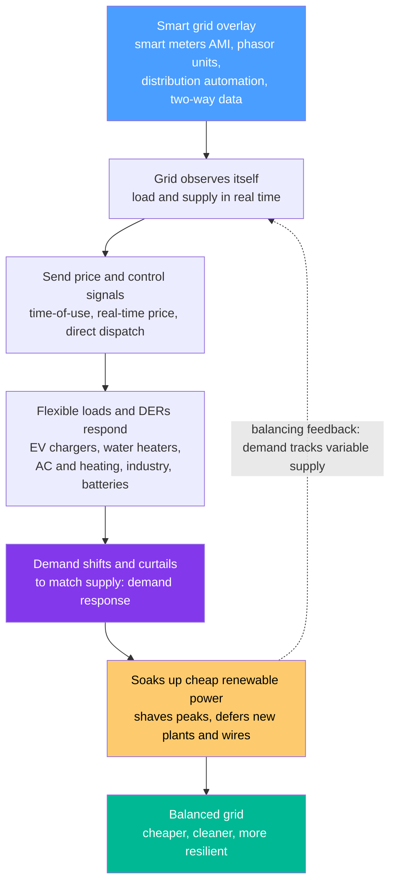

# 🔌 Smart Grids and Demand Response: Flexing Demand to Follow Variable Supply

> [!abstract] TL;DR
> The old power grid was **dumb and one-way**: electricity flowed from a few big plants to millions of passive consumers, and the utility barely knew what was happening until something broke. A **smart grid** bolts a *nervous system* onto that machine — smart meters, phasor sensors, distribution automation, and two-way communication everywhere — so the grid can finally **see itself in real time** and **respond**. The most powerful trick this unlocks is flipping the grid's founding assumption. For a century we adjusted **supply** to chase demand (spin up a gas peaker when everyone turns on the kettle). But renewables blow and shine on the *weather's* schedule, not ours — so instead ask: why not adjust **demand** to match supply? That is **demand response**. When wind and solar are abundant and cheap (a sunny midday), signal EV chargers, water heaters, air conditioners, and factories to switch **on** and soak it up; when the grid is strained (a still evening), gently dial them back. Your car does not care whether it charges at 2 pm or 2 am, so let it charge when the wind blows. Aggregate millions of such flexible devices — nudged by **price signals** and smart controls — and they behave like one giant **virtual battery** (a "virtual power plant") that firms renewables, shaves peaks, and defers new wires and plants. This digital, participatory flexibility is a **low-cost pillar** of the energy transition, alongside storage and flexible generation.

## Intuition

**Analogy:** Picture a busy restaurant kitchen that can only cook **to order**. Every time a customer sits down, the chef must instantly fire another burner — and to survive the dinner rush, the kitchen keeps expensive extra cooks standing idle all day just for that one peak hour. That is the **traditional grid**: supply forever scrambling to follow demand, with pricey "peaker" plants kept warm for the few hours a year everyone cooks at once. Now imagine the restaurant could gently **reschedule its diners** — nudging the flexible ones to eat when the kitchen is quiet and ingredients are cheap and fresh, while still serving anyone who genuinely needs to eat right now. Suddenly you need far fewer idle cooks, waste far less food, and the whole operation runs cheaper and calmer. That rescheduling is **demand response**, and the maitre d' who can *see every table and text every diner* is the **smart grid**.

Translate it back: the smart grid adds **sensing, communication, and control** so the operator can watch load and supply second-by-second and send signals out to the edge. Demand response then treats a huge slice of consumption — EV charging, water and space heating and cooling, industrial batches — as **movable in time**. Because these loads do not care *exactly when* they run, they can be slid onto the hours when renewable power is gushing and prices are low, and pulled back when the grid is tight. A single water heater is a rounding error, but **aggregate a hundred thousand of them** and — by the law of large numbers — their combined, predictable response becomes a firm, dispatchable block of power you can summon on command: a **virtual power plant** built entirely out of demand. The grid stops being a one-way pipe from plants to people and becomes a **two-way, participatory system** where flexible demand is as valuable as flexible supply.

---

## How It Works

### Core Mechanics

1. **The smart grid overlay: making the grid observable and controllable.** The physical grid — generators, transformers, wires — barely changes; what changes is a *digital layer* laid on top. **Smart meters** and Advanced Metering Infrastructure (AMI) report household and business consumption at fine time resolution instead of once a month; **phasor measurement units (PMUs)** sample voltage and current phase dozens of times a second across the transmission system; **distribution automation** puts remote-controlled switches, sensors, and reclosers out on the feeders. Two-way communication ties it together, turning a system the operator used to *infer* into one it can directly **see** (observability) and **steer** (controllability) in near real time.

2. **From seeing to acting: signals to the edge.** Real-time visibility is only useful if the grid can respond. Smart grids push **signals** outward to flexible devices — either **price signals** (time-of-use rates, real-time prices, critical-peak pricing) that let each device decide, or **direct control** signals from an aggregator or utility that dispatch loads on command. The device side is the growing fleet of **distributed energy resources (DERs)**: EV chargers, smart thermostats and water heaters, rooftop solar, home and grid batteries, and controllable industrial processes.

3. **Demand response: the core lever.** Instead of only ramping generation up and down to meet a fixed demand curve, the operator now shapes **demand** to fit supply and grid conditions. Three moves dominate. **Peak shaving** trims the short, expensive, stressful demand peaks that otherwise size the whole system (fewer peaker plants, less wire). **Load shifting** moves flexible consumption in time — soaking up cheap **midday solar** or **overnight wind** and away from tight evening hours — while delivering the *same energy* (the EV still ends up charged). **Fast frequency and ancillary services** use loads that can respond in seconds (like aggregated water heaters or EV chargers) to help balance the grid, a job that used to belong only to spinning generators.

4. **The negawatt and the virtual power plant.** A watt *not* consumed at a critical moment — a **negawatt** — is as valuable to the balance as a watt generated, and usually far cheaper. Aggregation turns tiny, noisy individual responses into a reliable resource: pool tens of thousands of DERs and their combined behaviour becomes smooth and predictable (fluctuations shrink roughly as $1/\sqrt{N}$), yielding a **virtual power plant (VPP)** that can be *dispatched* like a real one. **Vehicle-to-grid (V2G)** extends this further, letting EV batteries push energy *back* when needed.

5. **Why it matters for renewables.** Wind and solar are **variable** and only partly forecastable — the central challenge of a clean grid. Flexible demand is a cheap complement to storage and flexible generation: rather than curtail free midday solar or fire a fossil peaker at dusk, the grid **bends demand toward the renewables**. The result is cheaper balancing, deferred infrastructure, better efficiency, faster fault detection and **self-healing**, and consumer savings — while the open challenges are **cybersecurity, privacy, interoperability, consumer engagement, and equity**.

### Flow / Architecture



---

## Key Concepts

### Secondary Level

- **The old grid was dumb and one-way.** Power flowed from big plants to homes, and the utility only found out about a problem when something broke. A **smart grid** adds meters, sensors, and two-way messaging so the grid can *watch itself* and *react*.
- **A big new idea: move the demand, not just the supply.** Instead of always making more power when people want it, the smart grid can ask flexible machines to run *later or earlier*. This is **demand response**.
- **Your EV does not care if it charges at 2 pm or 2 am.** So let it charge when the wind is blowing or the sun is shining and power is cheap and clean — and ease off when the grid is busy.
- **Many small helpers add up to a big one.** One water heater is nothing, but a hundred thousand of them, nudged together, act like a huge shared **battery** that helps balance the grid — a **virtual power plant**.
- **This makes power cheaper, cleaner, and more reliable.** Flattening the daily peak means fewer expensive backup plants and fewer new power lines, and it helps use more wind and solar.

### Undergraduate Level

- **Observability and controllability.** AMI smart meters (interval consumption data), PMUs (time-synchronized phasors at high sample rates), and distribution automation convert an *inferred* grid into a *measured, steerable* one. This is the enabling shift; demand response is what you *do* with it.
- **The three demand-response actions.** **Peak shaving** (cut the top of the load curve), **load shifting** (translate flexible energy in time while conserving total energy delivered), and **ancillary/fast services** (seconds-scale response for frequency regulation and reserves). Each maps to a different grid need and a different revenue stream.
- **Price signals vs direct control.** **Time-of-use (TOU)** rates set fixed cheap/expensive windows; **real-time pricing (RTP)** passes wholesale prices through; **critical-peak pricing (CPP)** spikes on a few stressed days. Alternatively an **aggregator** directly dispatches enrolled loads. Price-based programs rely on **demand elasticity**; control-based programs guarantee response but need contracts and comfort limits.
- **Distributed energy resources (DERs) and the duck curve.** High solar penetration depresses midday **net load** and steepens the evening ramp (the "duck curve"). Load shifting flexible demand *into* the midday belly and *out of* the evening ramp directly flattens net load — the cleanest, cheapest fix before reaching for storage or peakers.
- **The negawatt.** A curtailed or shifted watt is a supply-side substitute: avoided generation, avoided transmission congestion, and deferred capacity. Because peaker capacity is used only a few percent of the year, shaving the peak with demand is often far cheaper per kW than building generation.
- **Aggregation and the virtual power plant.** Individual DERs are small and stochastic; aggregating $N$ of them makes the *relative* fluctuation of the pool fall like $1/\sqrt{N}$, so a large fleet becomes predictable and **dispatchable**. The VPP is then bid into markets and dispatched like a conventional plant — but it is built from demand and small assets.

### Graduate Level

- **Demand as a balancing feedback loop.** In control terms the smart grid closes a loop the old grid left open: measured imbalance (or price, or frequency) is fed back as a signal that modulates demand, driving supply-demand error toward zero. Stability depends on communication latency, aggregate device dynamics, and avoiding **synchronization** pathologies (e.g., thousands of thermostats snapping on together after a price step — "cold load pickup" and rebound peaks). Randomized/stochastic dispatch and dead-bands are used to decorrelate devices.
- **Thermostatically controlled loads (TCLs) as storage.** Water heaters, HVAC, and refrigeration store energy in *temperature*. Their aggregate behaviour is modelled as a population of hybrid-state (on/off) systems; controlling the switching distribution lets a fleet act as a fast, bounded **virtual battery** with an energy budget set by comfort dead-bands — capacity that is "free" because the thermal mass already exists.
- **Elasticity, rebound, and mechanism design.** Price-based DR shifts consumption per a (time-varying, often small and habit-bound) demand elasticity, but shifted load *reappears* (payback/rebound), so naive TOU can merely relocate the peak. Well-designed programs shape the *whole* schedule, use graduated or real-time prices, and pair incentives with automation so the response is default-on rather than reliant on human vigilance.
- **VPP market integration and DER aggregation.** Regulatory changes (e.g., FERC Order 2222 in the US) let aggregated DERs bid into wholesale energy, capacity, and ancillary markets. This requires baselining (estimating counterfactual consumption to measure delivered negawatts), telemetry, settlement, and forecasting of an inherently behavioural, weather-coupled resource.
- **Flexibility as a fourth balancing resource.** Renewable integration draws on storage, flexible generation, transmission/geographic smoothing, and **demand flexibility**. Flexibility is often the lowest-cost marginal option for the *daily* shift (chasing the solar belly) and for fast frequency response, while multi-day and seasonal gaps still lean on storage and firm generation — the resources are complements, not substitutes.
- **Grid edge: cybersecurity, privacy, interoperability, equity.** Making millions of endpoints controllable vastly enlarges the **attack surface** and exposes fine-grained behavioural data (metering privacy). Robust operation demands OT security, authenticated control, interoperable standards (OpenADR, IEEE 2030.5, IEC 61850), and program designs that do not penalize households with the least flexibility — the socio-technical constraints that gate real-world deployment.

---

## Python Demo

```python
# Smart grids & demand response in one figure:
#   (a) LOAD SHIFTING / PEAK SHAVING -- flexible loads (EV charging, water
#       heating) move off the evening peak into the sunny midday and the
#       quiet overnight, flattening demand and soaking up renewable supply.
#   (b) VIRTUAL POWER PLANT -- aggregating tens of thousands of small,
#       flexible devices yields a smooth, predictable, DISPATCHABLE block
#       of "negawatts" that rivals a peaker plant.
# numpy + matplotlib only.
import numpy as np
import matplotlib.pyplot as plt

# ---- time axis: one day at 15-minute resolution ---------------------
h = np.linspace(0, 24, 24 * 4, endpoint=False)

def gauss(t, mu, sig, amp):
    # wrap around midnight so overnight bumps stay continuous
    d = np.minimum(np.abs(t - mu), 24 - np.abs(t - mu))
    return amp * np.exp(-0.5 * (d / sig) ** 2)

# ---- (a) demand shaping --------------------------------------------
# inflexible base demand: always-on load plus the human morning/evening rhythm
inflexible = 40 + gauss(h, 8, 1.6, 22) + gauss(h, 19, 2.2, 40)      # GW

# flexible load (EVs + water/space heating): BASELINE piles onto the evening
flex_base   = gauss(h, 20, 1.6, 26)                                 # GW
flex_energy = np.trapz(flex_base, h)     # GWh of shiftable energy to conserve

# renewable supply: a solar "belly" peaking at midday (daylight only)
solar = np.clip(65 * np.sin(np.pi * (h - 6) / 12), 0, None)         # GW

# DEMAND RESPONSE: move the SAME flexible energy into the midday solar belly
# and overnight (cheap wind), conserving total energy delivered.
flex_dr_shape = gauss(h, 13, 2.4, 1.0) + 0.6 * gauss(h, 3, 2.2, 1.0)
flex_dr = flex_dr_shape * flex_energy / np.trapz(flex_dr_shape, h)

demand_base = inflexible + flex_base
demand_dr   = inflexible + flex_dr

peak_base, peak_dr = demand_base.max(), demand_dr.max()
print("=== (a) Load shifting / peak shaving ===")
print(f"  peak demand baseline : {peak_base:5.1f} GW")
print(f"  peak demand with DR  : {peak_dr:5.1f} GW")
print(f"  peak shaved          : {100*(peak_base-peak_dr)/peak_base:4.1f} percent")
print(f"  shiftable energy conserved: {np.trapz(flex_base,h):.1f} vs "
      f"{np.trapz(flex_dr,h):.1f} GWh")

# ---- (b) virtual power plant: aggregate many small devices ----------
N        = 50_000          # smart water heaters enrolled in the VPP
rated_kW = 4.5             # kW each
# duty cycle p(t): higher at morning and evening hot-water use
p       = 0.14 + 0.05*gauss(h, 7, 1.5, 1.0) + 0.06*gauss(h, 20, 2.0, 1.0)
mean_MW = N * p * rated_kW / 1e3                     # fleet mean draw  [MW]
std_MW  = np.sqrt(N * p * (1-p)) * rated_kW / 1e3    # fleet std  [MW] ~ 1/sqrt(N)

# a coordinated 2-hour DR event (18:00-20:00): shed 55% of fleet draw
event     = (h >= 18) & (h < 20)
shed_frac = 0.55
mean_dr   = mean_MW.copy()
mean_dr[event] = mean_MW[event] * (1 - shed_frac)
shed_MW = (mean_MW[event] - mean_dr[event]).mean()

# aggregation makes the fleet predictable: relative fluctuation ~ 1/sqrt(N)
cov_single = (np.sqrt(p*(1-p)) / p).max()            # one device, worst case
print("\n=== (b) Virtual power plant ===")
print(f"  fleet baseline draw ~ {mean_MW.mean():4.1f} MW")
print(f"  firm curtailment (negawatts) ~ {shed_MW:4.1f} MW  <- rivals a peaker plant")
print(f"  relative fluctuation: 1 device {cov_single:.2f}  ->  "
      f"fleet of {N:,} only {cov_single/np.sqrt(N):.4f}")

# ============================= plotting ==============================
fig, (axA, axB) = plt.subplots(1, 2, figsize=(15, 6))
fig.suptitle("Smart grids & demand response: flex DEMAND to follow variable SUPPLY",
             fontsize=13, fontweight="bold")

# (a) load shifting / peak shaving
axA.fill_between(h, solar, color="#ffd166", alpha=0.35, label="renewable (solar) supply")
axA.plot(h, demand_base, color="#e63946", lw=2.5, label="demand: baseline (peaky)")
axA.plot(h, demand_dr,   color="#2a9d8f", lw=2.5, label="demand: after demand response")
axA.fill_between(h, demand_dr, demand_base, where=demand_base > demand_dr,
                 color="#e63946", alpha=0.15)
axA.axhline(peak_base, color="#e63946", ls=":", lw=1)
axA.axhline(peak_dr,   color="#2a9d8f", ls=":", lw=1)
axA.annotate("peak shaved:\nflexible load moved to\nsunny midday & quiet night",
             xy=(19, peak_dr), xytext=(8.5, peak_base + 3), fontsize=9, color="#333",
             arrowprops=dict(arrowstyle="->", color="#333"))
axA.set_xlabel("hour of day"); axA.set_ylabel("power  [GW]")
axA.set_xlim(0, 24); axA.set_xticks(range(0, 25, 4))
axA.set_title("(a) Load shifting flattens the peak & soaks up solar")
axA.legend(loc="upper left", fontsize=8); axA.grid(alpha=0.3)

# (b) virtual power plant dispatch
axB.plot(h, mean_MW, color="#adb5bd", lw=2, ls="--", label="fleet baseline draw")
axB.fill_between(h, mean_dr - 3*std_MW, mean_dr + 3*std_MW, color="#4a9eff", alpha=0.25,
                 label="fleet draw, plus/minus 3 sigma (tight: aggregation)")
axB.plot(h, mean_dr, color="#8338ec", lw=2.5, label="fleet draw with DR event")
axB.axvspan(18, 20, color="#8338ec", alpha=0.08)
axB.annotate(f"firm shed ~ {shed_MW:.0f} MW\nnegawatts = a peaker plant",
             xy=(19, mean_dr[event].mean()), xytext=(8.5, mean_MW.max() + 3),
             fontsize=9, color="#333",
             arrowprops=dict(arrowstyle="->", color="#333"))
axB.set_xlabel("hour of day"); axB.set_ylabel("aggregate fleet power  [MW]")
axB.set_xlim(0, 24); axB.set_xticks(range(0, 25, 4))
axB.set_title(f"(b) {N:,} small loads -> one dispatchable virtual power plant")
axB.legend(loc="upper left", fontsize=8); axB.grid(alpha=0.3)

plt.tight_layout(rect=[0, 0, 1, 0.95])
plt.show()
```

Running this prints the numbers and draws two panels. **Panel (a)** is the demand-response story: the red **baseline** demand curve has a vicious evening spike because everyone plugs in EVs and heats water right when they get home — and it sits *out of phase* with the yellow **solar** supply that gushes at midday. After demand response, the green curve slides that same flexible energy into the sunny midday belly and the quiet overnight hours (the total energy delivered is unchanged, as the console confirms), **shaving the peak** by a double-digit percentage and lining demand up with clean supply. **Panel (b)** is the virtual-power-plant story: fifty thousand humble water heaters, each a stochastic on/off rounding error, aggregate into a fleet whose draw is *smooth and predictable* — the plus/minus-3-sigma band is razor thin because relative fluctuation falls as $1/\sqrt{N}$. A coordinated two-hour event then sheds a **firm block of negawatts** (tens of MW) that the operator can dispatch on command, exactly like calling on a peaker plant — except it was built entirely out of flexible demand.

---

## Real-World Applications

> **Example — a residential virtual power plant firming the evening ramp.** Programs such as those run by utilities and aggregators (for example Tesla's California VPP of home Powerwalls, or OhmConnect/enrolled-thermostat fleets) pool tens of thousands of home batteries, smart thermostats, and EV chargers behind a single control platform. On a hot evening when the solar belly collapses and the grid tightens, the aggregator dispatches the fleet: batteries discharge, thermostats nudge up a couple of degrees, EV charging pauses. Everything in this note is visible at once. The **smart-meter/AMI** layer measures each home's consumption to *baseline* the response; **price or dispatch signals** go out over the two-way link; thousands of small, individually trivial **DERs** respond together; and because the pool is large, the aggregate negawatts are **predictable and firm** enough to be *bid into the wholesale market* and settled like a real plant — a peaker made of demand, deferring both a fossil plant and new wires.

- **Time-of-use and real-time pricing.** Utilities worldwide expose cheaper overnight/midday rates so EVs, water heaters, and pool pumps self-schedule into low-price, high-renewable hours — the simplest, broadest form of demand response, riding entirely on AMI smart meters.
- **Utility direct load control.** Long-standing programs cycle residential AC and water heaters (and increasingly EV charging) during system peaks under contract, providing reliable, dispatchable curtailment for a few critical hours a year.
- **Industrial and commercial demand response.** Aluminium smelters, data centers, cold storage, and water treatment shed or shift large blocks of load on signal, selling fast interruptible capacity and ancillary services into markets.
- **EV smart charging and vehicle-to-grid.** Managed charging shifts millions of vehicles to off-peak/high-renewable windows; V2G pilots let fleets and homes *export* battery energy back to firm the evening ramp.
- **Frequency regulation from aggregated loads.** Fleets of water heaters, EV chargers, and batteries provide seconds-scale frequency response, a role once monopolized by spinning generators — often the highest-value use of small flexible loads.
- **Grid self-healing via distribution automation.** Sensors, remote switches, and fault detection let feeders **reconfigure automatically** around faults, shrinking outage extent and duration — the reliability face of the smart-grid overlay.

---

## Common Pitfalls

- **Confusing load shifting with load reduction.** Demand response mostly *moves* energy in time; the EV still charges and the water still heats. Programs that ignore this create a **rebound peak** — shifted load reappears an hour later and can be worse than the original. Shape the whole schedule, not just the peak hour.
- **Naive time-of-use that synchronizes everyone.** A single sharp cheap-window boundary makes thousands of devices switch on *simultaneously* at the same instant, manufacturing a brand-new spike ("cold load pickup"). Real deployments randomize start times, use dead-bands, and prefer graduated or real-time prices.
- **Overestimating human vigilance.** Price signals that rely on people manually turning things off fade as novelty wears off. Durable demand response is **automated and default-on** (smart thermostats, managed chargers, aggregator control), with humans able to opt out — not opt in every time.
- **Treating capacity as firm without aggregation math.** One device's response is unreliable; only *aggregation* makes it firm. Underestimating the fleet size needed (or the correlation between devices) leaves the "virtual power plant" unable to deliver its bid when called. Fluctuation falls as $1/\sqrt{N}$ *only if* the devices are decorrelated.
- **Baselining errors.** Paying for "negawatts" requires estimating the counterfactual — what consumption *would* have been. Gameable or biased baselines either overpay or discourage participation; sound measurement-and-verification is as important as the physical response.
- **Ignoring cybersecurity and privacy.** Making millions of endpoints remotely controllable is a giant new **attack surface**, and interval metering exposes fine-grained behaviour. A demand-response system without authenticated control, segmentation, and privacy protection is a liability, not an asset.
- **Assuming flexibility replaces storage and firm generation.** Demand flexibility is superb for the *daily* shift and fast response, but it cannot cover multi-day lulls or seasonal gaps. It is a **complement** to storage and flexible generation, not a substitute — planning that conflates them under-builds the system.

---

## Related Concepts

**The physical grid this digitizes**
- [[Power_Systems_and_the_Grid]] — the generators, transformers, and transmission/distribution network that the smart-grid overlay instruments and steers; demand response reshapes the *load* that this system must forever keep balanced against supply.

**Why flexible demand is needed**
- [[Renewable_Energy_Integration]] — the variability, forecasting, reserves, and ramping problem of putting wind and solar on the grid; demand-side flexibility is one of the four balancing resources (with storage, flexible generation, and transmission) that make it work.

**The control-theory backbone**
- [[Feedback_Loops_and_Causality]] — a price or frequency signal that drives demand to cancel supply-demand error is a **balancing feedback loop**; the same theory explains both the stabilizing benefit and the synchronization/rebound pathologies to design around.

**The communication and edge layer**
- [[IoT_Protocols]] — smart meters, thermostats, and EV chargers are grid-edge IoT devices; their two-way, low-power communication is the physical substrate that turns a "dumb" grid into an observable, controllable one.

**Securing the new attack surface**
- [[Threat_Modeling]] — making millions of endpoints remotely dispatchable and richly metered vastly enlarges the grid's attack surface and privacy exposure; systematically modeling those threats is a precondition for safe smart-grid deployment.

Within the Energy Systems vault this note sits in the **Power Grid and Systems** section and is referenced in prose by its siblings: *The_Electric_Power_Grid* (the physical, one-way machine that the smart grid overlays with sensing and two-way data), *Grid_Integration_of_Renewables* (the variability problem that demand flexibility helps solve alongside storage), *Transmission_Distribution_and_Microgrids* (the wires and local grids where distribution automation and DERs live), *Batteries_and_Electrochemical_Storage* (the storage that partners with demand response to firm renewables), and *Energy_Efficiency_and_Demand_Management* (the broader demand-side toolkit of which demand response is the real-time, price-responsive edge).

---

## Review Questions

**Secondary**
1. Explain why the old power grid is called "dumb and one-way," and what a smart grid adds to it. Then, in plain words, describe what "demand response" means using an electric car as your example — and explain why it is fine for the car to charge at 2 am instead of 6 pm. Finally, explain how a hundred thousand water heaters can act like one big shared battery.

**Undergraduate**
2. A regional grid has a sharp evening demand peak driven by EV charging and water heating, and abundant solar at midday. (i) Describe how **load shifting** would reshape the daily demand curve, and why the *total energy delivered* is unchanged even though the peak drops. (ii) Contrast a **time-of-use price signal** with **direct load control** as ways to achieve this shift, giving one advantage and one risk of each. (iii) Explain why shifting all flexible load into a single cheap price window can *create* a new peak, and one design fix.

**Graduate**
3. An aggregator enrolls 50,000 thermostatically controlled water heaters to build a virtual power plant. (a) Using the idea that the aggregate's relative fluctuation scales as $1/\sqrt{N}$, explain why the *fleet* is dispatchable even though each device is an unpredictable on/off load, and what happens to that guarantee if the devices become correlated. (b) Model the fleet as a "virtual battery": what physical quantity stores the energy, and what sets its capacity and the comfort constraints on how long it can be curtailed? (c) Discuss how demand flexibility complements — rather than replaces — storage and flexible generation across daily, multi-day, and seasonal timescales, and identify two socio-technical constraints (from cybersecurity, privacy, baselining, or equity) that gate real-world deployment.

---

## Sources

- Alexandra von Meier — *Electric Power Systems: A Conceptual Introduction* (Wiley/IEEE Press) — accessible grounding in how the physical grid works and why observability and control matter for modern operation.
- James Momoh — *Smart Grid: Fundamentals of Design and Analysis* (Wiley/IEEE Press) — dedicated treatment of smart-grid architecture, AMI, communication, control, and analysis.
- U.S. Department of Energy / NREL — smart-grid and demand-response reports (e.g., DOE *Benefits of Demand Response* report to Congress; NREL demand-response and grid-flexibility studies) — data on peak shaving, DR potential, and DER aggregation.
- International Energy Agency (IEA) — *Digitalisation and Energy* — global perspective on how digital sensing, communication, and control reshape demand and supply flexibility.
- FERC — Order 2222 (Distributed Energy Resource Aggregation) and Order 745 (Demand Response Compensation) — the market rules that let aggregated DERs and demand response participate as dispatchable resources.

---

#energy-systems #smart-grid #demand-response #virtual-power-plant #load-shifting
