# ⚡ The Electric Power Grid: The Largest Machine Ever Built, Balancing Supply and Demand Every Instant

> [!abstract] TL;DR
> The electric power grid is **the largest machine ever built** — a continent-spanning web of generators, transformers, and wires that performs an almost impossible feat, second by second, every second of the day: the electricity being **consumed** at any instant must **exactly equal** the electricity being **generated**, because electricity is essentially *not stored in the wires themselves*. Flip on a kettle and a distant power plant must instantly produce a hair more; when a city wakes up, generation across the network ramps in perfect lockstep. This relentless **supply-must-equal-demand** tightrope walk is the grid's core constraint, and it is why the whole system hums at a precise **frequency** — 50 or 60 Hz — that acts as its heartbeat: speed up and it signals *too much* generation, slow down and it signals *too little*. The grid moves power from where it is made to where it is used through a **voltage hierarchy** — crank the voltage way *up* for efficient long-distance **transmission** (electrical express highways that minimize $I^2R$ losses), then step it back *down* at substations for safe local **distribution** to homes and factories. Operators keep the balance in real time by **dispatching** generators in **merit order** — cheap baseload at the bottom, flexible load-following and peaking plants on top — while holding **reserves** and honoring **N-1** reliability so a single failure never cascades. Understanding this always-balancing, always-on network explains how electricity actually reaches you — and why integrating **variable, inverter-based wind and solar** (which do not supply on-demand output or traditional spinning inertia) is the central challenge of the energy transition.

## Intuition

**Analogy:** The electric power grid is best pictured as **a single, continent-sized machine whose every part is spinning in perfect synchrony — and which cannot keep even a sip of energy in reserve inside its own wires.** Imagine a giant water network where you were *forbidden to use any storage tanks*: the instant anyone opens a tap, the pumps at the far end must speed up by exactly the right amount, or the pipes either burst from overpressure or run dry. That is the grid. There is no meaningful buffer in the copper itself, so **whatever the world plugs in right now must be produced right now**, by machines that may be hundreds of miles away.

Now push the analogy one step further, because the grid has a beautiful trick for telling everyone whether supply and demand match: it listens to its own **heartbeat**. Across an entire interconnection, thousands of generators spin in lockstep like dancers holding the same beat, and that shared beat is the grid **frequency** — 60 Hz in the Americas, 50 Hz across most of the rest of the world. When demand suddenly exceeds supply, all those spinning machines are dragged down together and the beat *slows*; when there is too much generation, the beat *speeds up*. So a single number, measurable anywhere on the network, instantly reveals the balance of the whole system — and control rooms and automatic governors chase that number every second to keep it pinned. Finally, to move enormous power across a continent without wasting it as heat, the grid plays a voltage game: it **steps the voltage way up** for the long haul — high-voltage transmission lines are the electrical equivalent of interstate highways, moving huge power with tiny current and therefore tiny losses — and then **steps it back down** at local substations to the safe voltages that light your lamp. A machine that must balance itself every instant, that broadcasts its health as a frequency, and that shuttles power through an up-then-down voltage hierarchy: grasp those three ideas and you understand how the lights stay on — and why adding weather-driven wind and solar is so hard.

---

## How It Works

### Core Mechanics

1. **The grid's one job — deliver electricity instantly and reliably.** The power grid connects **generators** (the machines that make electricity) to **loads** (everything that uses it) through an interconnected **alternating-current (AC)** network. Its purpose is to deliver electrical energy from source to consumer *reliably, safely, and on demand*, across distances that can span a continent, with the customer experiencing nothing but a wall socket that always works.

2. **The defining constraint — supply must equal demand at every instant.** Unlike a warehouse of goods or a reservoir of water, the transmission and distribution wires store almost no energy. So total **generation** must continuously match total **consumption plus losses**, *at every moment*. There is no "later." The system holds this balance by constantly adjusting how hard generators push — a process called **dispatch** — so that generation tracks the ever-changing **load**. When you switch on an appliance, the extra demand is met within milliseconds to seconds by the physics and controls described below, not by any stored reserve in the cable.

3. **Frequency is the real-time balance signal — the grid's heartbeat.** Most generators are large **synchronous machines** whose rotors physically spin in step with the grid's AC waveform. Their combined rotational speed *is* the system frequency (50 or 60 Hz). If demand exceeds generation, the extra load draws kinetic energy out of all those spinning rotors, and they collectively **slow down** — frequency falls. If generation exceeds demand, the rotors **speed up** — frequency rises. Frequency is therefore a single, network-wide, instantaneous indicator of the supply-demand balance: keep it at nominal and the grid is balanced.

4. **The stabilizing chain — inertia, then governors, then AGC.** When a big generator suddenly trips offline, three layers respond in sequence. First, **inertia** — the stored kinetic energy of all the spinning masses — resists the frequency change, buying precious seconds and limiting the **rate of change of frequency**. Second, **primary frequency response**: turbine **governors** sense the speed droop and open valves to add mechanical power within seconds, arresting the fall at a **nadir** and partly recovering it. Third, **secondary control** — **Automatic Generation Control (AGC)** — slowly nudges selected plants to restore frequency exactly to nominal over minutes and return borrowed reserves. Alongside this, **reactive power** support holds **voltage** within limits, a separate but parallel balancing act.

5. **The voltage hierarchy — up for transmission, down for distribution.** Power delivered is $P = VI$, but the heat lost in a line is $P_{loss} = I^2R$. To move a given power with *less current* — and therefore far less loss — you raise the **voltage**. So generators produce at tens of kV, **step-up transformers** boost it to **hundreds of kV** for **transmission** over long distances, and **substations** with **step-down transformers** progressively lower it for **distribution** through cities and finally to household voltage. This up-then-down hierarchy — enabled cheaply by AC transformers — is the historical reason **AC won** over DC for grid delivery, though modern **HVDC** links now carry bulk power over very long distances and tie asynchronous grids together.

6. **Operating the grid — dispatch, reserves, and reliability.** Generators are stacked in a **merit order** (economic dispatch): the cheapest and least flexible run first as **baseload**, then **load-following** plants track the daily curve, and fast, expensive **peaking** units cover the highest peaks. Zero-marginal-cost **variable renewables** are typically taken first, leaving a **net load** for the dispatchable fleet to follow. Operators forecast load, hold **spinning and standby reserves** for surprises, coordinate across **balancing areas** and **interconnections**, and plan to survive the loss of any single element — the **N-1 contingency** standard — so no single failure cascades into a blackout. **System operators** (ISOs/RTOs, or TSOs abroad) run this balancing act continuously.

### Flow / Architecture

```mermaid
graph LR
    GEN["Power plants generate<br/>coal, gas, nuclear, hydro,<br/>wind and solar"]
    STEPUP["Step-UP transformer<br/>raise voltage to hundreds of kV<br/>low current means low I2R loss"]
    TRANS["High-voltage transmission<br/>express highways of electricity<br/>carry bulk power long distance"]
    SUB["Substation<br/>step-DOWN transformer<br/>reduce voltage for local use"]
    DIST["Distribution lines<br/>medium then low voltage<br/>streets and neighborhoods"]
    LOAD["Homes and factories<br/>the load that varies<br/>hour by hour"]
    BAL["Balance rule<br/>supply must equal demand every instant<br/>electricity is not stored in the wires"]
    FREQ["Grid frequency 50 or 60 Hz<br/>the heartbeat and balance signal<br/>too much generation speeds it up<br/>too little slows it down"]

    GEN --> STEPUP
    STEPUP --> TRANS
    TRANS --> SUB
    SUB --> DIST
    DIST --> LOAD
    LOAD -.->|"demand changes"| BAL
    BAL -.->|"redispatch generation"| GEN
    BAL --> FREQ
    FREQ -.->|"balance signal to operators"| BAL

    style GEN fill:#e17055,color:#fff
    style TRANS fill:#4a9eff,color:#fff
    style LOAD fill:#00b894,color:#fff
    style BAL fill:#fdcb6e,color:#000
    style FREQ fill:#8338ec,color:#fff
```



---

## Key Concepts

### Secondary Level

- **The grid is one giant machine that cannot store electricity in its wires.** Whatever is being used right now must be made right now, somewhere on the network, and sent instantly through the wires. There is no tank of electricity waiting inside the cable.
- **Supply must always equal demand.** When you turn on a kettle, a power plant far away must make a tiny bit more electricity at that exact moment. When a whole city wakes up, many plants ramp up together in perfect timing.
- **Frequency is the grid's heartbeat.** All the big generators spin together at the same beat — 60 Hz in the Americas, 50 Hz in most other places. If people use more than is being made, the beat **slows down**; if too much is being made, it **speeds up**. Watching this one number tells operators whether the grid is balanced.
- **High voltage for the long trip, low voltage for your home.** To send power far without wasting it as heat, the voltage is cranked way *up* for the long-distance lines (the "highways"), then stepped *down* at local stations before it reaches your house at a safe voltage.
- **Different plants for different jobs.** Cheap steady plants run all the time (baseload); flexible plants follow the daily ups and downs; fast "peaker" plants switch on only for the busiest hours. Wind and solar are used whenever they are available.
- **Why wind and solar are tricky.** They make power only when the sun shines or the wind blows — not necessarily when people need it — so the grid needs extra flexibility, storage, and backup to keep the balance.

### Undergraduate Level

- **The instantaneous balance and net load.** Total generation equals total demand plus losses at all times. With must-take variable renewables, the dispatchable fleet must follow the **net load** = demand minus wind and solar output — a curve that is more volatile than demand itself (the "duck curve," with a deep midday belly and a steep evening ramp).
- **Why high voltage transmits efficiently.** For a fixed delivered power $P = VI$, raising $V$ lowers $I$, and since line loss is $I^2R$, doubling voltage cuts current in half and losses to a quarter. This is the entire economic case for high-voltage transmission and for the transformer-based voltage hierarchy.
- **AC, three-phase, and transformers.** The grid runs on **three-phase AC**, which delivers constant instantaneous power and enables compact, efficient motors and generators. **Transformers** step voltage up and down almost losslessly using electromagnetic induction — the killer feature that let AC beat DC for delivery. **HVDC** is used where AC is uneconomic: very long overhead/undersea links and ties between asynchronous grids.
- **Frequency dynamics — the swing equation.** For an aggregated system, $2H\,\dfrac{d(\Delta f_{pu})}{dt} = P_{gen} - P_{load} - D\,\Delta f_{pu}$, where $H$ is the inertia constant (seconds of stored kinetic energy) and $D$ is load damping. A power imbalance produces a **rate of change of frequency** inversely proportional to system inertia — less inertia means faster, deeper frequency excursions.
- **Primary response and droop.** Governors adjust output in proportion to frequency error through a **droop** setting $R$ (typically ~5 percent): a small steady frequency offset commands a proportional change in generation, sharing the correction across many units. Droop alone leaves a residual frequency error, which **AGC** (secondary control) integrates away to restore nominal frequency.
- **Merit-order dispatch and reserves.** **Economic dispatch** stacks generators from lowest to highest marginal cost to meet load at least cost; the last unit needed sets the marginal price. Operators simultaneously hold **spinning reserve** (synchronized, ready in seconds) and **non-spinning/standby reserve** (available in minutes) sized to cover the largest credible contingency.
- **Reliability and the N-1 standard.** The system is planned and operated so that the loss of any single component — a generator, line, or transformer — does not cause loss of load or cascade. This **N-1** criterion drives redundancy, protection coordination, and the reserve margins that make the grid dependable.

### Graduate Level

- **The swing equation from first principles.** Each synchronous machine obeys $\dfrac{2H_i}{\omega_s}\dfrac{d^2\delta_i}{dt^2} = P_{m,i} - P_{e,i}$, where $\delta$ is the rotor angle and $P_e$ depends on network power flows through the angle differences. Aggregating and linearizing about nominal gives the center-of-inertia frequency model; the **initial RoCoF** after a step imbalance $\Delta P$ is $\dfrac{df}{dt}\Big|_{0^+} = -\dfrac{\Delta P\, f_0}{2 H_{sys}}$, making declining system inertia (as inverter-based resources displace synchronous machines) a first-order stability concern.
- **Primary, secondary, and tertiary control hierarchy.** **Primary** (droop governors, seconds) arrests frequency; **secondary** (AGC / load-frequency control, tens of seconds to minutes) restores frequency to nominal and returns interchange to schedule via the **Area Control Error** $ACE = \Delta P_{tie} + B\,\Delta f$; **tertiary** (economic redispatch, minutes to an hour) reoptimizes and replenishes reserves. Each layer is slower and larger in scope than the last.
- **Optimal power flow and the network constraints.** Beyond the merit order, real dispatch is a constrained optimization — **Security-Constrained Optimal Power Flow (SCOPF)** — minimizing cost subject to the nonlinear AC power-flow equations, generator limits, thermal line ratings, voltage bounds, and N-1 security, yielding **locational marginal prices** that reflect congestion and losses. **Unit commitment** (a mixed-integer program) schedules which units are on hours to a day ahead, respecting start-up costs, minimum up/down times, and ramp limits.
- **Reactive power and voltage as a decoupled control problem.** In high-voltage networks, active power flow couples mainly to **angle** differences and reactive power to **voltage** magnitude. Voltage is supported locally by generator excitation, capacitor/reactor banks, tap-changing transformers, and **FACTS/STATCOM** devices; reactive power does not transport efficiently over long distances, so voltage support must be geographically distributed — a fundamentally different problem from frequency, which is a single global variable.
- **Stability regimes.** The grid must remain stable under (i) **rotor-angle / transient stability** after large faults (will machines stay in synchronism?), (ii) **small-signal stability** (are inter-area oscillatory modes damped?), (iii) **frequency stability** (does inertia plus response keep the nadir above load-shedding thresholds?), and (iv) **voltage stability** (can the network deliver reactive power without collapse?). Cascading blackouts typically arise when a contingency violates one regime and protective trips propagate faster than operators can react.
- **The inverter-based, low-inertia frontier.** Wind and solar connect through **power electronics**, providing no inherent inertia and, in grid-following mode, no independent voltage reference. This motivates **synthetic/virtual inertia**, **fast frequency response**, and **grid-forming inverters** that emulate voltage-source behavior, plus **storage** and demand flexibility to firm variable output. Rising RoCoF, weaker system strength (short-circuit ratio), and sub-synchronous control interactions are the emerging research and operations challenges of a converter-dominated grid.
- **Markets as the coordination layer.** Liberalized systems coordinate the physical balance through **day-ahead and real-time energy markets**, **ancillary-services markets** (regulation, spinning/non-spinning reserve, reactive support), and **capacity markets** — price signals that align thousands of independently owned assets with the instantaneous engineering constraint that supply must equal demand.

---

## Python Demo

```python
# The electric power grid in one figure. Panel (a): the daily LOAD curve and how a
# merit-order generation stack (variable renewables -> baseload -> load-following ->
# peaking) is dispatched to match demand EXACTLY at every hour. Panel (b): the grid's
# FREQUENCY after a sudden generation loss, showing inertia -> governor -> AGC recovery,
# and why a low-inertia (renewable-heavy) grid dips faster and deeper. numpy + matplotlib.
import numpy as np
import matplotlib.pyplot as plt

# =====================================================================
# (a) DAILY LOAD CURVE + MERIT-ORDER DISPATCH  (supply == demand, hour by hour)
# =====================================================================
t = np.linspace(0, 24, 24 * 12 + 1)          # time of day [h], 5-min resolution

# Demand [GW]: overnight trough, a morning peak, and a larger evening peak
demand = (58
          + 14 * np.exp(-((t - 8.0) / 2.2) ** 2)     # morning ramp ~08:00
          + 26 * np.exp(-((t - 19.5) / 2.4) ** 2)    # evening peak ~19:30
          - 10 * np.exp(-((t - 4.0) / 3.0) ** 2))    # deep pre-dawn trough

# Must-take variable renewables (zero marginal cost -> dispatched FIRST) [GW]
solar = 22 * np.exp(-((t - 13.0) / 3.2) ** 2)        # midday solar bump
wind  = 9 + 4 * np.sin(2 * np.pi * (t - 3) / 24)     # slowly varying wind
renew = solar + np.clip(wind, 0, None)

# NET LOAD the dispatchable fleet must follow = demand - renewables (the "duck curve")
net = demand - renew

# Dispatchable stack, stacked in merit order on top of renewables:
baseload = np.full_like(t, 34.0)                     # flat nuclear/coal (cheapest, inflexible)
baseload = np.minimum(baseload, net)                 # never generate more than needed
inter    = np.clip(net - baseload, 0, 26)            # load-following combined-cycle gas
peaking  = np.clip(net - baseload - inter, 0, None)  # fast peaking gas/hydro (evening spike)

# Verify the instantaneous balance: stacked generation reproduces demand at every hour
total_gen = renew + baseload + inter + peaking
assert np.allclose(total_gen, demand, atol=1e-9), "supply must equal demand!"

# =====================================================================
# (b) FREQUENCY RESPONSE to a sudden generation trip  (inertia + governor + AGC)
# =====================================================================
f0   = 60.0          # nominal frequency [Hz]
D    = 1.0           # load damping [pu/pu]
R    = 0.05          # governor droop (5 percent)
Tg   = 4.0           # governor + turbine lag [s]
Ki   = 0.08          # AGC (secondary) integral gain
dPL  = 0.10          # step imbalance: lose 10 percent of supply at t = 2 s [pu]
tmax, dt = 40.0, 0.005
steps = int(tmax / dt)
tt = np.arange(steps) * dt

def simulate(H):
    """Aggregated swing + governor + AGC. Returns frequency f(t) [Hz]."""
    x = 0.0        # per-unit frequency deviation  (df/f0)
    pg = 0.0       # governor (primary) power [pu]
    pa = 0.0       # AGC (secondary) power [pu]
    f = np.empty(steps)
    for i in range(steps):
        load = dPL if tt[i] >= 2.0 else 0.0          # generation-loss step
        dx  = (pg + pa - load - D * x) / (2 * H)     # swing equation
        dpg = (-pg - x / R) / Tg                     # governor with droop
        dpa = -Ki * x                                # AGC integrates frequency error
        x  += dx * dt
        pg += dpg * dt
        pa += dpa * dt
        f[i] = f0 * (1 + x)
    return f

f_high = simulate(H=6.0)   # synchronous-dominated grid (high inertia)
f_low  = simulate(H=2.0)   # inverter-dominated grid (low inertia)

# ------------------------------- plotting -------------------------------
fig, (axA, axB) = plt.subplots(1, 2, figsize=(15, 6))
fig.suptitle("The electric power grid: match generation to demand every instant, "
             "and frequency is the balance signal", fontsize=13, fontweight="bold")

# (a) load curve + dispatch stack
colors = ["#2a9d8f", "#5b7fff", "#f4a261", "#e63946"]
labels = ["variable renewables (wind + solar)", "baseload (nuclear / coal)",
          "load-following (combined-cycle gas)", "peaking (gas turbine / hydro)"]
axA.stackplot(t, renew, baseload, inter, peaking, colors=colors, labels=labels, alpha=0.9)
axA.plot(t, demand, color="k", lw=2.5, label="demand (the load curve)")
axA.plot(t, net, color="#6a4c93", lw=1.8, ls="--", label="net load = demand - renewables")
axA.annotate("evening peak\n-> peaking plants",
             xy=(19.5, demand[np.argmin(np.abs(t - 19.5))]), xytext=(13.2, 92),
             fontsize=9, color="#b3001b",
             arrowprops=dict(arrowstyle="->", color="#b3001b"))
axA.annotate("midday solar\ncarves the belly",
             xy=(13.0, net[np.argmin(np.abs(t - 13.0))]), xytext=(1.0, 30),
             fontsize=9, color="#6a4c93",
             arrowprops=dict(arrowstyle="->", color="#6a4c93"))
axA.set_xlabel("time of day  [h]")
axA.set_ylabel("power  [GW]")
axA.set_xlim(0, 24); axA.set_ylim(0, 100)
axA.set_xticks(range(0, 25, 3))
axA.set_title("(a) Merit-order dispatch: supply is stacked to equal demand")
axA.legend(loc="upper left", fontsize=8)
axA.grid(alpha=0.3)

# (b) frequency response to a generation trip
axB.axhline(f0, color="k", lw=1.0, ls=":", alpha=0.6)
axB.axhline(59.5, color="#e63946", lw=1.0, ls="--", alpha=0.7)
axB.text(38, 59.51, "under-frequency\nload-shed threshold", ha="right", va="bottom",
         fontsize=8, color="#e63946")
axB.plot(tt, f_high, color="#2a9d8f", lw=2.5, label="high inertia  H = 6 s  (synchronous grid)")
axB.plot(tt, f_low,  color="#e76f51", lw=2.5, label="low inertia  H = 2 s  (inverter-heavy grid)")
axB.axvline(2.0, color="gray", lw=0.8, alpha=0.6)
axB.text(2.1, 59.62, "generation\ntrips (t = 2 s)", fontsize=8, color="gray")
i_nadir = np.argmin(f_low)
axB.annotate("nadir (deeper & faster\nwhen inertia is low)",
             xy=(tt[i_nadir], f_low[i_nadir]), xytext=(9, 59.68),
             fontsize=9, color="#c1440e",
             arrowprops=dict(arrowstyle="->", color="#c1440e"))
axB.annotate("AGC restores 60 Hz",
             xy=(34, f_high[int(34 / dt)]), xytext=(22, 60.02),
             fontsize=9, color="#2a9d8f",
             arrowprops=dict(arrowstyle="->", color="#2a9d8f"))
axB.set_xlabel("time after disturbance  [s]")
axB.set_ylabel("grid frequency  [Hz]")
axB.set_xlim(0, tmax); axB.set_ylim(59.55, 60.1)
axB.set_title("(b) Frequency = the heartbeat: inertia, governor & AGC recover balance")
axB.legend(loc="lower right", fontsize=8)
axB.grid(alpha=0.3)

plt.tight_layout(rect=[0, 0, 1, 0.94])
plt.show()

# ---- console summary -------------------------------------------------
print("=== (a) instantaneous balance check ===")
print(f"  peak demand           : {demand.max():5.1f} GW  at {t[np.argmax(demand)]:.1f} h")
print(f"  min demand (trough)   : {demand.min():5.1f} GW  at {t[np.argmin(demand)]:.1f} h")
print(f"  peaking energy needed : {np.trapz(peaking, t):5.1f} GWh over the day")
print(f"  max generation error  : {np.abs(total_gen - demand).max():.2e} GW (supply == demand)")
print("=== (b) frequency nadir after losing 10 percent of supply ===")
print(f"  high inertia H=6 s -> nadir {f_high.min():.3f} Hz")
print(f"  low  inertia H=2 s -> nadir {f_low.min():.3f} Hz  (dips below the load-shed line)")
```

Running this prints a balance check and two frequency nadirs, and draws two panels that *are* the note. **Panel (a)** builds the day from the bottom up: the green band is must-take **variable renewables**, and the dashed purple **net load** (demand minus renewables) is what the dispatchable fleet actually chases — flat **baseload** at the bottom, flexible **load-following** gas in the middle, and a thin, expensive **peaking** cap that appears only at the evening spike. The black **demand** curve rides exactly on top of the stack because the `assert` guarantees generation equals demand at every five-minute step — the grid's iron law made visible, along with the midday "duck belly" solar carves and the steep evening ramp that peaking plants must cover. **Panel (b)** is the heartbeat: at $t = 2\,$s a chunk of generation trips, and frequency dives. A **high-inertia** grid (many spinning synchronous machines) resists the change, so it dips gently, is arrested by **governor** droop, and is drawn back to 60 Hz by **AGC**; a **low-inertia** grid (renewables displacing that spinning mass) drops *faster and deeper*, plunging toward the under-frequency load-shed line. That single contrast is the crux of the energy transition: less spinning inertia means a jumpier heartbeat, which is exactly why grid-forming inverters, fast frequency response, and storage matter.

---

## Real-World Applications

> **Example — a regional interconnection run by an ISO, balancing millions of loads every four seconds.** In North America, a system operator such as PJM, ERCOT, CAISO, or MISO orchestrates everything in this note simultaneously across its footprint. It runs a **day-ahead unit-commitment** market to decide which plants start, a **real-time economic-dispatch** engine that re-solves the **merit order** every five minutes, and an **AGC** loop that sends set-points to regulating units every few seconds to pin frequency to 60 Hz and hold scheduled tie-line flows with neighbors. It continuously computes **N-1** security, holds spinning and non-spinning **reserves** sized to its largest single contingency, and publishes **locational marginal prices** that expose transmission congestion. When a large generator trips, the interconnection's collective **inertia** and **primary frequency response** arrest the dip within seconds — the same curve as Panel (b) — before secondary control restores nominal. Everything the grid is, from the instantaneous balance to the voltage hierarchy to reliability, is visible in one control room.

- **Wide-area interconnections.** The Eastern, Western, and Texas (ERCOT) interconnections in North America, and the huge synchronous grid of Continental Europe, each operate as a single synchronized machine at one frequency — enormous balancing areas that pool generation, share reserves, and smooth demand across time zones and weather.
- **HVDC super-links.** Long undersea and overland **HVDC** lines — such as ties across the North Sea, China's ultra-high-voltage DC lines moving hydro and wind thousands of kilometers, and back-to-back DC ties between asynchronous grids — carry bulk power where AC transmission would be uneconomic or impossible.
- **Grid frequency as a public health signal.** Operators, and even hobbyists with frequency monitors, read the grid's 50/60 Hz beat as a live diagnosis of continental supply-demand balance; historically, mains-frequency-synchronized clocks even kept time by counting AC cycles.
- **Balancing variable renewables.** As wind and solar grow, operators lean on faster reserves, battery storage, demand response, geographic aggregation, and improved forecasting to follow a more volatile **net load** — the duck curve of Panel (a) writ large across systems like California and South Australia.
- **Blackout prevention and post-mortems.** Cascading failures such as the 2003 Northeast blackout and the 2021 Texas winter crisis are studied precisely as violations of the balance-and-N-1 principles here, driving investment in protection, reserves, weatherization, and situational awareness.

---

## Common Pitfalls

- **Thinking electricity is stored in the grid.** The wires hold essentially no energy; the grid balances by *matching generation to demand in real time*, not by drawing from a buffer. Storage (batteries, pumped hydro) is a deliberate, separate asset bolted onto the grid — it is not the wires. This misconception hides why the instantaneous balance is so hard.
- **Confusing energy and power, capacity and delivery.** "500 MW of solar capacity" is a *power* rating under ideal conditions, not guaranteed delivery; the grid must be planned around *when* and *how much energy* actually arrives. Sizing a system by nameplate capacity, ignoring capacity factor and timing, badly overstates what is dependable.
- **Assuming renewables can simply swap in one-for-one for thermal plants.** Variable, inverter-based wind and solar provide neither on-demand output nor traditional spinning **inertia**, so replacing synchronous generation degrades frequency response (Panel b). Integration requires added flexibility, fast reserves, storage, and grid-forming controls — not just more panels and turbines.
- **Ignoring reactive power and voltage.** Beginners track only active-power balance and frequency, but the grid must *also* hold **voltage** within limits via distributed reactive-power support. Unlike frequency (one global number), voltage is local, and neglecting it invites voltage collapse — a distinct failure mode from a frequency event.
- **Believing frequency is only a local or minor detail.** Frequency is a *system-wide* variable and the primary real-time indicator of balance across an entire interconnection. A persistent deviation means the whole synchronized system is out of balance, not just one plant — which is why it is controlled so aggressively.
- **Underrating transmission and the voltage hierarchy.** The cheapest generation is worthless if it cannot reach load. Because losses scale as $I^2R$, high-voltage transmission is not a luxury but the enabling technology of the whole system; congestion and permitting of new lines are often the real bottleneck to integrating remote wind and solar.
- **Forgetting reliability is engineered, not free.** The grid's dependability comes from deliberate **N-1** design, reserves, and protection coordination. Trimming these margins to cut cost is exactly what turns a routine single failure into a cascading blackout.

---

## Related Concepts

**The electrical engineering view of the same grid**
- [[Power_Systems_and_the_Grid]] — the electrical-engineering companion to this note: the circuits, per-unit system, power-flow equations, and protection that formalize the network described here at the whole-system level. Distinct basename, complementary lens.
- [[AC_Circuit_Analysis_and_Phasors]] — the phasor and three-phase AC foundation underneath the grid; why alternating current, reactive power, and impedance behave as they do on the wires.
- [[Electric_Machines_and_Transformers]] — the synchronous generators whose spinning mass *is* the grid's inertia and frequency, and the transformers that build the up-then-down voltage hierarchy almost losslessly.

**Feeding and following the grid**
- [[Renewable_Energy_Integration]] — the electrical-engineering treatment of connecting variable, inverter-based sources: the intermittency, inertia, and control problems that this note frames at system scale.
- [[Wind_Energy]] — a leading variable, non-dispatchable source whose weather-driven output the grid must absorb and balance; the "net load" of the demo begins here.
- [[Solar_Photovoltaics]] — the other dominant variable renewable; its midday surge and evening cliff carve the duck-curve net load that dispatchable plants must chase.

**The energy-conversion backbone**
- [[Thermodynamics_of_Energy_Conversion]] — where the dispatchable electricity comes from: the heat-engine efficiency and flexibility limits that determine which plants can serve baseload, load-following, and peaking roles.

Within the Energy Systems vault this note **opens the Power Grid and Systems section** and is referenced in prose by its section siblings, which drill into the pieces it frames: *Grid_Stability_Reliability_and_Blackouts* (the inertia, frequency, and N-1 dynamics of the demo taken deeper, including cascading failure); *Transmission_Distribution_and_Microgrids* (the voltage hierarchy, HVDC, and local networks in detail); *Smart_Grids_and_Demand_Response* (making the *demand* side flexible so the balance is easier to keep); *Grid_Integration_of_Renewables* (the central challenge of variable, inverter-based supply); and *Sector_Coupling_and_Electrification* (electrifying transport, heat, and industry, which reshapes the load curve this grid must serve).

---

## Review Questions

**Secondary**
1. Explain why the power grid is often called "the largest machine ever built" and why it cannot store electricity inside its wires. Then describe, in plain words, what happens to the grid's "heartbeat" (its frequency) when a whole city suddenly turns on air conditioners faster than power plants can respond — does the beat speed up or slow down, and why? Finally, explain why the voltage is cranked *up* for long-distance lines and then stepped *down* before it reaches your home.

**Undergraduate**
2. A balancing area serves a demand that dips to 58 GW overnight and peaks at 92 GW in the evening, with 34 GW of inflexible baseload and up to 30 GW of variable wind and solar. (i) Sketch or describe the *net load* the dispatchable fleet must follow, and explain why it is more volatile than demand itself. (ii) Using $P_{loss} = I^2R$ and $P = VI$, quantify how much line loss falls if transmission voltage is doubled for the same delivered power, and state why this justifies the voltage hierarchy. (iii) The system loses a 900 MW generator. Explain the sequence of inertia, primary governor response, and AGC, and which of these determines the frequency *nadir* versus the final *restored* frequency.

**Graduate**
3. A grid operator is retiring synchronous thermal plants and replacing them with inverter-based wind and solar, halving the system inertia constant $H$. (a) Using the aggregated swing equation and $\frac{df}{dt}\big|_{0^+} = -\frac{\Delta P f_0}{2H_{sys}}$, explain quantitatively how this changes the RoCoF and frequency nadir after a fixed generation trip, and why that threatens under-frequency load-shedding thresholds. (b) Contrast the control problems of *frequency* (a single global variable) and *voltage* (a distributed local variable), and explain why reactive-power support cannot be centralized the way AGC can. (c) Propose three concrete measures — spanning grid-forming inverters, fast frequency response, storage, and market/ancillary-service design — that let a converter-dominated grid preserve the balance and stability that spinning inertia used to provide, and identify the trade-offs of each.

---

## Sources

- Alexandra von Meier — *Electric Power Systems: A Conceptual Introduction* (Wiley-IEEE Press, 2006) — the clearest conceptual account of the grid, the instantaneous balance, frequency, and the voltage hierarchy.
- J. Duncan Glover, Thomas J. Overbye & Mulukutla S. Sarma — *Power System Analysis and Design* (Cengage) — the standard engineering text on transformers, transmission, power flow, economic dispatch, and stability.
- David J. C. MacKay — *Sustainable Energy — Without the Hot Air* (UIT Cambridge, 2008; free at withouthotair.com) — quantitative, whole-system view of matching energy supply to demand at national scale.
- Gretchen Bakke — *The Grid: The Fraying Wires Between Americans and Our Energy Future* (Bloomsbury, 2016) — an accessible narrative of how the grid works, why it is fragile, and how renewables strain it.
- U.S.-Canada Power System Outage Task Force — *Final Report on the August 14, 2003 Blackout* (2004) — an authoritative case study of balance, N-1 reliability, and cascading failure on a real interconnection.

---

#energy-systems #power-grid #supply-demand-balance #grid-frequency #transmission
