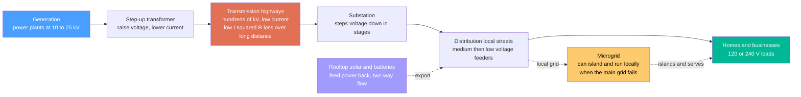

# 🔌 Transmission, Distribution, and Microgrids: Highways, Local Streets, and Self-Sufficient Neighborhoods of Power

> [!abstract] TL;DR
> Getting electricity from a distant power plant to your phone charger works like a **transportation network**. **Transmission** lines are the **interstate highways**: they carry enormous power over long distances at **very high voltage**, for one beautiful reason from physics — for a fixed power $P = VI$, pushing at higher **voltage** means lower **current**, and since resistive heat loss $P_{loss}=I^2R$ scales with the *square* of the current, cranking voltage up **slashes line losses**. That single fact is why cross-country lines run at **hundreds of thousands of volts** and why transformers exist at all. Near your town, **distribution** is the **local street network**: substation transformers step the voltage back down to safe levels and fan it out to homes and businesses. Traditionally power flowed **one way**, from big central plants outward — but rooftop **solar and batteries** are turning neighborhoods into producers, creating **two-way flows** and the "prosumer." The newest idea is the **microgrid**: a local chunk of grid — a campus, hospital, base, or village — that can **disconnect and run islanded** on its own solar, batteries, and generators when the main grid fails, delivering **resilience** and bringing power to remote places. Highways, local streets, and now self-sufficient neighborhoods.

## Intuition

**Analogy:** Getting electricity from a power plant to your phone charger is like a **transportation network with highways and local streets**. **Transmission** lines are the **interstate highways** — a few huge arteries carrying vast traffic (power) at very high speed (voltage) across long distances. **Distribution** is the **local street network** — off-ramps and neighborhood roads that slow everything down to a safe, usable level and deliver it to your door. You do not run interstate speeds through a school zone, and you do not send bulk power at 120 volts across a continent; each tier is engineered for its job.

The reason transmission runs at such extreme voltage is a genuinely elegant piece of physics, and it is worth pausing on because it explains the whole design. To send a fixed amount of **power** down a wire you can trade **voltage** against **current**: $P = VI$, so if you double the voltage you halve the current for the same power delivered. Now here is the payoff — the energy wasted as **heat** in the wire is $P_{loss} = I^2 R$, growing with the **square** of the current. Halve the current and you quarter the loss; raise the voltage tenfold and the loss drops a hundredfold. That is why cross-country lines run at hundreds of thousands of volts: it is the cheapest way to beat the tyranny of $I^2R$ over distance. Then, near your town, transformers step the voltage back **down** — because 345,000 volts is magnificent for a highway and lethal for a kitchen.

Traditionally this all flowed **one way**: big central plants pushed power outward through transmission, then distribution, to passive consumers at the edge. But that picture is breaking. Rooftop **solar panels**, home **batteries**, and **EVs** now let a neighborhood *produce* and *push power back*, turning consumers into "prosumers" and forcing power to flow in **both directions**. And a further idea is emerging at the grid's edge: the **microgrid** — a self-contained local grid (a hospital, a military base, an island village) with its own generation and loads that can **disconnect from the main grid and keep running on its own** during a blackout. Highways, local streets, and now self-sufficient neighborhoods that can stand alone when the interstate is closed.

---

## How It Works

### Core Mechanics

1. **Transmission — beating $I^2R$ with high voltage.** A generator makes electricity at 10–25 kV; a **step-up transformer** immediately raises it to **hundreds of kV** (typically 115–765 kV). For a fixed power $P=VI$, higher voltage means proportionally lower current, and because line loss is $P_{loss}=I^2R$, the fraction of power wasted as heat is $P_{loss}/P = PR/V^2$ — it falls as $1/V^2$. This is the single decisive reason transmission is high-voltage: it makes moving bulk power across a continent economically possible. High-voltage/extra-high-voltage lines on towers, plus step-up transformers, form an interconnected **transmission network** whose meshing provides redundancy and lets far-apart regions share generation.

2. **HVDC — for the very longest hauls.** Above roughly 600–800 km overhead (or tens of km undersea), **high-voltage direct current** beats AC. DC has no reactive-power charging current, no AC skin effect, and needs fewer conductors, so line losses per km are lower; converter stations at each end (built from [[Power_Electronics_and_Converters]]) cost more but the line is cheaper and **fully controllable**, and DC can tie together grids that are **not synchronized** (asynchronous interties). HVDC is how remote **offshore wind**, giant desert **solar**, and hydro reach distant load centers.

3. **Substations — the highway-to-street interchange.** At **step-down substations** the voltage is lowered in stages (transmission → sub-transmission → distribution), with breakers, protection, and metering. Congestion on the transmission network — too much power wanting to flow down too few lines — is a major driver of the need for **grid expansion** to reach remote wind and solar.

4. **Distribution — the local streets, one-way no longer.** From the substation, **medium-voltage feeders** (roughly 4–35 kV) carry power through the neighborhood, and small pole/pad **distribution transformers** step it down to the final **low voltage** (120/240 V in North America, 230/400 V elsewhere) at each premise. Feeders are usually **radial** (a simple branching tree, cheap but a single fault kills the branch) or, in dense downtowns, **networked** (meshed, more reliable, costlier). Historically power flowed strictly **downhill** from substation to load, which made **voltage regulation** simple. Distributed **rooftop solar** breaks this: on a sunny, low-demand afternoon a feeder can run **backwards**, pushing power *up* toward the substation and causing local **voltage rise** that can trip inverters — the core challenge that motivates the smarter, sensor-rich distribution grid.

5. **Microgrids — islands of self-sufficiency.** A **microgrid** is a bounded local grid (campus, hospital, base, remote community, island) with its own **generation** — solar, batteries, combined-heat-and-power, diesel/gas gensets — and its own **loads**, connected to the main grid through a single point. Normally it runs **grid-connected**, buying and selling power. But when the main grid fails, it can **island**: open its point of common coupling, and a **grid-forming** inverter or generator takes over setting the local voltage and frequency, keeping critical loads alive. When the grid returns, the microgrid **resynchronizes** (matches phase and frequency) and reconnects. The value is **resilience** (surviving outages), clean **local renewable** integration, and — as standalone **mini-grids** — bringing first-time electricity to remote areas without waiting for the transmission network to arrive.

### Flow / Architecture



---

## Key Concepts

### Secondary Level

- **Highways and local streets.** Long-distance **transmission** lines are the interstate highways of electricity; **distribution** lines are the local streets that deliver it to your house. Each is built for its job — you would not run highway power at highway voltage through your kitchen.
- **Why the big lines use such scary-high voltage.** To send the same amount of power, higher **voltage** lets you use less **current**. And the heat wasted in a wire depends on the current *squared* — so cutting the current a little saves a *lot* of wasted energy. That is why long lines run at hundreds of thousands of volts: to avoid throwing away power as heat.
- **Transformers change the voltage.** They step voltage **up** for the highway (to save energy) and back **down** near your home (to keep it safe).
- **Power used to flow one way.** From big plants outward to homes. Now **rooftop solar** lets homes push power *back*, so it can flow both ways.
- **A microgrid can stand on its own.** A hospital or village with its own solar, batteries, and generators can **cut itself off** from the main grid during a blackout and keep the lights on — then reconnect when the grid comes back.

### Undergraduate Level

- **The line-loss law.** Delivered power $P=VI$; resistive loss $P_{loss}=I^2R$. Substituting $I=P/V$ gives $P_{loss}=P^2R/V^2$ and a **loss fraction** $P_{loss}/P = PR/V^2$. Losses fall as the **inverse square** of voltage — the quantitative heart of why transmission is high-voltage. (See [[Circuit_Elements_and_Kirchhoffs_Laws]] for Ohm's law and $I^2R$ dissipation.)
- **Voltage tiers.** Generation 10–25 kV → transmission 115–765 kV → sub-transmission → distribution 4–35 kV → utilization 120/240/400 V. Each transformer stage trades voltage for current at constant power (minus small transformer losses).
- **Three-phase AC and reactive power.** The grid is **three-phase** (see [[AC_Circuit_Analysis_and_Phasors]]); real transmission also carries **reactive power** from line inductance and capacitance, which must be managed (shunt capacitors/reactors, tap-changers) to hold voltage within limits.
- **HVDC vs HVAC.** HVDC wins for very long overhead lines, long submarine cables (where AC charging current would consume the whole cable), and **asynchronous** interconnections; it needs costly converter stations but cheaper, more controllable lines.
- **Radial vs networked distribution.** Radial feeders are cheap and simple but drop the whole branch on a fault; networked/meshed systems in cities cost more but survive single faults. **Voltage regulation** along a feeder (voltage drop under load) is a first-order design constraint.
- **Distributed generation and two-way flow.** Rooftop PV injecting power mid-feeder causes **voltage rise**, possible **reverse power flow** at the substation, and protection-coordination problems — the reasons distribution is becoming an actively managed, sensor-rich system.
- **Microgrid modes.** *Grid-connected* (grid sets frequency/voltage; microgrid follows) vs *islanded* (a local **grid-forming** source sets frequency/voltage). Transitions require fast **islanding detection** and, on return, **resynchronization**.
- **Reliability metrics.** **SAIDI** (average outage *duration* per customer per year) and **SAIFI** (average outage *frequency*) quantify distribution reliability and are the yardsticks microgrids and grid hardening aim to improve.

### Graduate Level

- **Loss economics and conductor sizing.** Total lifetime cost trades **capital** (thicker conductor, higher-voltage insulation, right-of-way) against **$I^2R$ energy losses** over decades; Kelvin's law and economic-current-density arguments set the optimal conductor. Corona losses and thermal (sag) limits cap voltage and current independently.
- **Power flow and stability.** Steady-state **AC power flow** solves nonlinear $P$-$Q$-$V$-$\theta$ equations (Newton–Raphson); transmitted power across a line of reactance $X$ is $P \approx \frac{V_1 V_2}{X}\sin\delta$, so the **angle** $\delta$ is the transfer lever and $\delta \to 90°$ is the stability edge. Congestion, N-1 contingency limits, and locational marginal prices all flow from this.
- **HVDC control.** Line-commutated converters (thyristor, bulk point-to-point) vs **voltage-source converters** (IGBT, black-start capable, multi-terminal DC grids). VSC-HVDC enables offshore wind collection and independent real/reactive control at each terminal.
- **Grid-forming vs grid-following inverters.** Grid-*following* inverters (most rooftop PV) inject current phase-locked to an existing voltage and **cannot** run an island alone; grid-*forming* inverters synthesize a voltage/frequency reference (droop or virtual-synchronous-machine control) and can black-start a microgrid — a central research area as inverter-based resources displace synchronous inertia.
- **Islanding, protection, and anti-islanding.** Safe islanding needs fast detection, seamless-transfer control, microgrid protection that works at low fault current (inverters cannot supply the large fault currents relays expect), and, for parallel grid-connected inverters, mandated **anti-islanding** to avoid energizing a "dead" line and endangering utility crews.
- **The grid-edge transformation.** Distributed energy resources (DER), smart inverters (Volt-VAR/Volt-Watt), DER management systems, and transactive/local energy markets are converting the once-passive distribution feeder into an actively controlled, bidirectional, software-defined network — the operational face of the renewable, resilient, accessible grid.

---

## Python Demo

```python
# Transmission, Distribution & Microgrids in one figure:
#   (a) TRANSMISSION -- why bulk power travels at HIGH VOLTAGE: the I^2 R physics.
#       For a FIXED power delivered down a fixed-resistance line, plot the fraction
#       of power lost as heat, and the line current, versus the transmission voltage.
#       Losses plummet as ~1/V^2 -- the whole reason for hundreds-of-kV lines.
#   (b) MICROGRID ISLANDING -- a campus with local solar + battery rides through a
#       grid outage: local supply (solar + battery discharge) keeps the load SERVED
#       while the main grid is down. numpy + matplotlib only.
import numpy as np
import matplotlib.pyplot as plt

# ======================================================================
# (a) TRANSMISSION: line loss and current vs voltage   (loss = I^2 R)
# ======================================================================
P = 500e6                      # W, 500 MW of power we must deliver down the line
R = 12.0                       # ohm, total resistance of a long transmission line
V = np.linspace(100e3, 765e3, 500)     # line voltage: 100 kV up to 765 kV

I        = P / V               # A, current needed to carry the power (P = V*I)
P_loss   = I**2 * R            # W, resistive heating loss = I^2 R
loss_pct = 100.0 * P_loss / P  # percent of delivered power wasted as heat  (= P*R/V^2)

# reference voltages to annotate (kV -> percent lost)
refs = {"138 kV": 138e3, "345 kV": 345e3, "765 kV": 765e3}
print("=== Transmission line: 500 MW over a 12 ohm line ===")
for name, v in refs.items():
    print(f"  at {name:8s}  current = {P/v/1e3:6.2f} kA   loss = {100*P*R/v**2:5.2f} %")
print("  Note: HVDC over very long distance cuts loss further -- no reactive")
print("        charging current, no AC skin effect, fewer conductors.\n")

# ======================================================================
# (b) MICROGRID: ride through a grid OUTAGE by ISLANDING on solar + battery
# ======================================================================
t = np.arange(0.0, 24.0, 0.1)          # hours across one day

solar = 4.0 * np.clip(np.sin(np.pi * (t - 6.0) / 12.0), 0.0, None)   # MW, midday bell
load  = (1.4                                                          # MW, overnight base
         + 0.7 * np.exp(-((t - 8.0)  / 2.0)**2)                       #     morning bump
         + 1.4 * np.exp(-((t - 19.0) / 2.5)**2))                      #     evening peak

out_start, out_end = 17.0, 21.0                       # main grid is DOWN 17:00 - 21:00
grid_up = ~((t >= out_start) & (t < out_end))

cap  = 12.0                            # MWh usable battery capacity
soc0 = 3.0                             # MWh stored at midnight
dt   = t[1] - t[0]                     # h

soc      = np.zeros_like(t)            # MWh, state of charge
batt_pwr = np.zeros_like(t)            # MW, + = discharging to load, - = charging
grid_pwr = np.zeros_like(t)            # MW, + = importing from main grid
served   = np.zeros_like(t)            # MW, load actually kept alive
s = soc0
for i in range(len(t)):
    net = solar[i] - load[i]                       # + surplus / - deficit before battery
    if grid_up[i]:                                 # ---- grid connected ----
        if net > 0:                                # soak surplus solar into battery
            charge      = min(net, (cap - s) / dt)
            batt_pwr[i] = -charge
            grid_pwr[i] = -(net - charge)          # export whatever is left over
        else:                                      # let the grid cover the deficit
            grid_pwr[i] = -net
        served[i] = load[i]
    else:                                          # ---- ISLANDED: no grid ----
        if net >= 0:                               # charge from surplus, curtail if full
            batt_pwr[i] = -min(net, (cap - s) / dt)
            served[i]   = load[i]
        else:                                      # discharge battery to cover deficit
            discharge   = min(-net, s / dt)        # limited by stored energy
            batt_pwr[i] = discharge
            served[i]   = solar[i] + discharge     # would shed load only if battery empties
    s = np.clip(s - batt_pwr[i] * dt, 0.0, cap)    # update stored energy
    soc[i] = s

shed = np.maximum(load - served, 0.0)
print("=== Microgrid islanding through a 17:00-21:00 outage ===")
print(f"  battery capacity {cap:.0f} MWh, min state-of-charge {soc.min():.2f} MWh")
print(f"  unserved (shed) energy during outage: {np.trapz(shed, t):.2f} MWh"
      f"  -> {'LOAD FULLY SERVED' if shed.max() < 1e-6 else 'some load shed'}")

# ------------------------------- plotting -------------------------------
fig, (axA, axB) = plt.subplots(1, 2, figsize=(15, 6))
fig.suptitle("Transmission & microgrids: high voltage beats I^2 R losses; "
             "a microgrid islands to ride through an outage",
             fontsize=13, fontweight="bold")

# (a) loss fraction (left) and current (right) vs voltage
axA.plot(V / 1e3, loss_pct, color="#e76f51", lw=3, label="power lost as heat  [%]")
for name, v in refs.items():
    axA.axvline(v / 1e3, color="k", lw=0.8, alpha=0.3)
    axA.annotate(f"{name}\n{100*P*R/v**2:.1f}% lost",
                 xy=(v / 1e3, 100*P*R/v**2), xytext=(v/1e3 + 20, 100*P*R/v**2 + 6),
                 fontsize=8, color="#555",
                 arrowprops=dict(arrowstyle="->", color="#888"))
axA.set_xlabel("transmission voltage  [kV]")
axA.set_ylabel("fraction of power lost as heat  [%]", color="#e76f51")
axA.tick_params(axis="y", labelcolor="#e76f51")
axA.set_xlim(100, 765)
axA.set_ylim(0, 65)
axA.set_title("(a) Higher voltage -> lower current -> loss falls as 1 over V squared")
axA.grid(alpha=0.3)

axA2 = axA.twinx()
axA2.plot(V / 1e3, I / 1e3, color="#4a9eff", lw=2, ls="--", label="line current  [kA]")
axA2.set_ylabel("line current  [kA]", color="#4a9eff")
axA2.tick_params(axis="y", labelcolor="#4a9eff")
axA2.set_ylim(0, (P / 100e3) / 1e3 * 1.05)
h1, l1 = axA.get_legend_handles_labels()
h2, l2 = axA2.get_legend_handles_labels()
axA.legend(h1 + h2, l1 + l2, loc="upper right", fontsize=9)

# (b) microgrid power balance through the islanding event
axB.axvspan(out_start, out_end, color="#d63031", alpha=0.10)
axB.text((out_start + out_end) / 2, 4.3, "MAIN GRID DOWN\n(islanded)",
         ha="center", va="top", fontsize=9, color="#b02a2a", fontweight="bold")
axB.plot(t, solar, color="#f4a900", lw=2.2, label="local solar")
axB.plot(t, load,  color="#2d3436", lw=2.2, label="load (demand)")
axB.fill_between(t, 0, np.maximum(batt_pwr, 0), color="#00b894", alpha=0.35,
                 label="battery discharge -> load")
axB.fill_between(t, 0, np.minimum(batt_pwr, 0), color="#0984e3", alpha=0.25,
                 label="battery charging (surplus)")
axB.plot(t, served, color="#e17055", lw=1.6, ls=":", label="load served")
axB.set_xlabel("hour of day")
axB.set_ylabel("power  [MW]")
axB.set_xlim(0, 24)
axB.set_ylim(-2.5, 4.6)
axB.set_xticks(range(0, 25, 3))
axB.set_title("(b) Islanding: solar + battery keep the load served, grid down")
axB.grid(alpha=0.3)

axB2 = axB.twinx()
axB2.plot(t, soc, color="#6c5ce7", lw=2.4, label="battery state of charge  [MWh]")
axB2.set_ylabel("battery energy stored  [MWh]", color="#6c5ce7")
axB2.tick_params(axis="y", labelcolor="#6c5ce7")
axB2.set_ylim(0, cap * 1.05)
hb1, lb1 = axB.get_legend_handles_labels()
hb2, lb2 = axB2.get_legend_handles_labels()
axB.legend(hb1 + hb2, lb1 + lb2, loc="upper left", fontsize=8)

plt.tight_layout(rect=[0, 0, 1, 0.94])
plt.show()
```

Running this prints the loss figures and draws two panels. **Panel (a)** is the transmission physics: for a fixed 500 MW delivered down a fixed line, the red curve shows the **fraction of power wasted as heat** collapsing as voltage rises — from tens of percent at 100 kV down to roughly one percent at 765 kV — while the dashed blue **current** falls in lockstep, because the loss is $I^2R$ and $I=P/V$. The annotations at 138, 345, and 765 kV make the $1/V^2$ payoff concrete and explain, in one picture, why humanity strings continent-crossing lines at hundreds of kV (and why HVDC squeezes the very longest hauls even harder). **Panel (b)** is the microgrid story: through a normal day the campus runs grid-connected, soaking midday **solar** surplus into its **battery** (blue fill, purple state-of-charge rising). Then the red band marks a **grid outage** from 17:00 to 21:00 — exactly when solar is fading and the evening load peaks. The microgrid **islands**: the battery **discharges** (green fill) to fill the gap between local solar and demand, and the dotted "load served" line stays glued to the demand curve — the load is **never dropped** even though the main grid is dead. The falling purple curve shows the stored energy being spent to buy that resilience, and reconnection would let it recharge once the grid returns.

---

## Real-World Applications

> **Example — a hospital microgrid riding out a hurricane.** When a major storm knocks out the regional grid, a hospital campus microgrid (for instance the systems deployed after Superstorm Sandy, or the Borrego Springs and Santa Rita Jail microgrids in California) does exactly what Panel (b) shows: it detects the grid is gone, **opens its point of common coupling**, and a grid-forming inverter plus on-site solar, batteries, and gensets take over setting the local frequency and voltage — keeping operating rooms, refrigeration, and life-support powered for hours or days while the surrounding neighborhood is dark. When utility power returns, the microgrid **resynchronizes** and reconnects seamlessly. Every layer of this note is present: transmission delivered the power before the storm, distribution fanned it out, and the microgrid provided **islanded resilience** when both failed.

- **Extra-high-voltage and HVDC backbones.** China's ±800 kV and ±1100 kV UHVDC lines move tens of gigawatts of remote hydro and wind thousands of kilometers to coastal cities; Europe's undersea HVDC links (NorNed, North Sea offshore-wind collector grids) and the North American EHV network are the $I^2R$-beating highways in the flesh.
- **Distribution with rooftop solar — two-way flow.** In high-PV regions (California, South Australia, Hawaii) feeders now routinely run **backwards** at midday, forcing utilities to deploy smart inverters, voltage regulators, and DER management systems to control **voltage rise** — the "duck curve" and grid-edge transformation in action.
- **Remote and island mini-grids for energy access.** Standalone solar-plus-battery **mini-grids** electrify villages across Sub-Saharan Africa and South/Southeast Asia and power islands (from Ta'u in American Samoa to Greek and Indonesian islands), delivering first-time electricity without waiting for the transmission network to reach them.
- **Military and critical-infrastructure microgrids.** US Department of Defense bases (SPIDERS program), data centers, and campuses deploy microgrids specifically for **resilience** — the ability to island and keep mission-critical loads alive through grid attacks or disasters.
- **Reliability-driven grid hardening.** Utilities track **SAIDI/SAIFI**, and microgrids, undergrounding, and networked feeders are justified by their measurable improvement to these outage-duration and outage-frequency numbers.

---

## Common Pitfalls

- **Confusing high transmission voltage with wasted energy.** The high voltage is precisely what *avoids* waste: it lowers current, and loss is $I^2R$. People often assume "high voltage = dangerous inefficiency," when physically it is the opposite — cutting voltage to "save power" would multiply losses.
- **Forgetting that loss scales with the square of current, not linearly.** Halving the current does not halve the loss — it **quarters** it. Reasoning linearly badly underestimates the value of a voltage upgrade or the penalty of an overloaded feeder.
- **Assuming rooftop solar automatically means blackout backup.** Most home/commercial PV uses **grid-following** inverters with mandatory **anti-islanding**: when the grid goes down, they shut off for lineworker safety and **cannot** power the house alone. Islanding requires a **grid-forming** inverter and controls — a microgrid, not just panels.
- **Ignoring reverse power flow and voltage rise on distribution.** Distribution was designed for one-way flow; injecting PV mid-feeder can push local voltage above limits and trip inverters or mis-coordinate protection. Treating a feeder as a passive delivery pipe fails once DER penetration is high.
- **Underestimating inverter fault-current limits in islanded microgrids.** Inverters cannot deliver the large fault currents that traditional protective relays expect, so conventional overcurrent protection may not trip in an island. Microgrid protection needs rethinking, not copy-paste from the bulk grid.
- **Treating HVDC as universally better than AC.** HVDC wins only past a break-even distance (long overhead, long submarine, or asynchronous ties) because converter stations are expensive; for typical medium-distance meshed transmission, AC's cheap transformers and easy tapping still win.
- **Confusing capacity with resilience.** Adding generation does not by itself let a site survive an outage; **resilience** requires the ability to *island* — sensing, grid-forming control, and enough local storage/generation to balance load in real time while disconnected.

---

## Related Concepts

**The bulk grid and its machines**
- [[Power_Systems_and_the_Grid]] — the whole generation-transmission-distribution machine and its instant-by-instant balance law; this note zooms into the *wires* tier and extends it downward to the microgrid edge.
- [[Electric_Machines_and_Transformers]] — transformers are the enabling device: they step voltage up for the highway and down for the street, making the $I^2R$-beating strategy physically possible.
- [[Power_Electronics_and_Converters]] — the converter stations behind **HVDC** and the grid-forming/grid-following inverters that let solar, batteries, and microgrids interface with (and island from) the AC grid.

**Circuit and AC foundations**
- [[Circuit_Elements_and_Kirchhoffs_Laws]] — Ohm's law and $I^2R$ power dissipation, the exact physics that makes high-voltage transmission worthwhile.
- [[AC_Circuit_Analysis_and_Phasors]] — three-phase, impedance, and reactive power, the language in which transmission losses, voltage drop, and power flow are actually computed.

**What flows through the wires**
- [[Renewable_Energy_Integration]] — the intermittency, forecasting, and reserve problem of putting variable generation onto the grid, which drives two-way distribution flows and the microgrid's islanding value.
- [[Solar_Photovoltaics]] — the rooftop DER that turns passive consumers into two-way "prosumers" and supplies the local generation inside most microgrids.
- [[Wind_Energy]] — the remote, high-capacity-factor resource whose distance from load centers is a prime motivation for HVDC and transmission expansion.

Within the **Power Grid & Systems** section this note supplies the physical delivery layer and is referenced in prose by its siblings: *The_Electric_Power_Grid* (the balance-and-frequency machine these wires serve), *Grid_Integration_of_Renewables* (managing variable generation across the T&D network), *Smart_Grids_and_Demand_Response* (the sensing and control that make bidirectional distribution and microgrids work), *Grid_Stability_Reliability_and_Blackouts* (SAIDI/SAIFI, cascading failures, and the resilience microgrids provide), and *Energy_Access_and_Global_Development* (mini-grids bringing first-time electricity to remote communities).

---

## Review Questions

**Secondary**
1. Explain the "highways and local streets" analogy for the electric grid: which part is transmission, which is distribution, and what does a transformer do at the interchange between them? Then, in plain words, explain why the long-distance lines use extremely high voltage — using the fact that the heat wasted in a wire depends on the *square* of the current. Finally, explain what a microgrid does when the main grid fails.

**Undergraduate**
2. A line of total resistance $R = 15\ \Omega$ must deliver $P = 400$ MW. (i) Compute the current and the fraction of power lost as heat if it is transmitted at 138 kV, and again at 500 kV. (ii) By what factor does the loss fraction change, and why is that factor the *square* of the voltage ratio? (iii) A homeowner has grid-following rooftop solar and is surprised the panels shut off during a blackout. Explain why grid-following inverters cannot island, and what would be required to keep the home powered.

**Graduate**
3. A remote 2 GW offshore wind farm is 900 km from the load center, and a hospital campus wants outage resilience. (a) Argue whether AC or HVDC should carry the wind power, citing at least three physical or economic factors (losses, reactive/charging current, converter cost, controllability, asynchronous ties). (b) For the campus microgrid, contrast grid-following and grid-forming inverters and explain why islanding, seamless transfer, and low-fault-current **protection** are non-trivial. (c) High rooftop-PV penetration causes reverse power flow and voltage rise on the local feeder; describe two mitigation strategies (for example smart-inverter Volt-VAR control or storage) and the trade-offs each introduces.

---

## Sources

- Alexandra von Meier — *Electric Power Systems: A Conceptual Introduction* (Wiley-IEEE) — the clearest conceptual treatment of transmission, distribution, losses, and grid structure.
- J. D. Glover, T. J. Overbye & M. S. Sarma — *Power System Analysis and Design* (Cengage) — the standard engineering text on transmission lines, transformers, power flow, and per-unit analysis.
- R. H. Lasseter et al. — *The CERTS Microgrid Concept* and subsequent microgrid papers; U.S. Department of Energy microgrid program reports — foundational sources on microgrid architecture, islanding, and grid-forming control.
- Gretchen Bakke — *The Grid: The Fraying Wires Between Americans and Our Energy Future* (Bloomsbury) — accessible narrative of the aging grid, distributed generation, and the grid-edge transformation.
- U.S. Department of Energy / NREL — reports on HVDC, distribution DER integration, and resilience microgrids — real-world data and case studies.

---

#energy-systems #transmission #distribution #microgrid #HVDC
