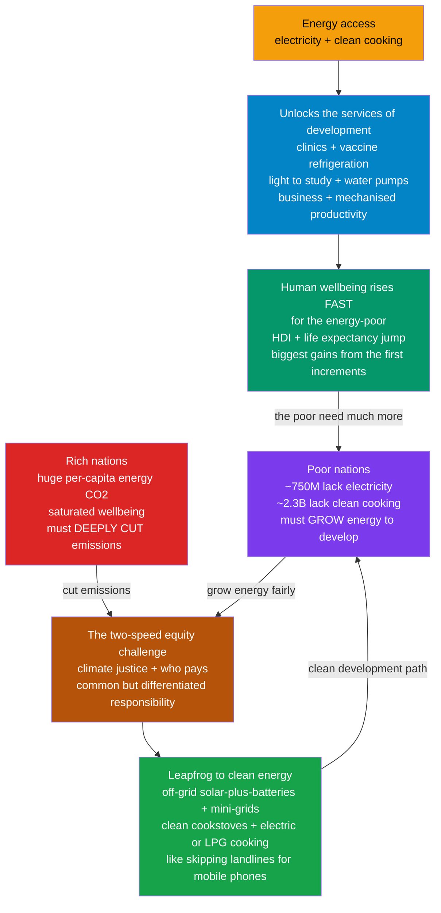

# 🌍 Energy Access and Global Development: The Foundation of Human Wellbeing — and the Justice of the Transition

> [!abstract] TL;DR
> Reliable, affordable energy is the **invisible foundation under almost every step out of poverty**: it lets a child study after dark, a clinic refrigerate vaccines, a farmer pump water, and a business run a machine. The link between energy and human wellbeing is strong but **saturating** — the first increments of energy buy *enormous* gains in health, education, and lifespan for the energy-poor, while piling ever more energy onto an already-rich society buys almost nothing. Yet roughly **750 million people still have no electricity** and about **2.3 billion cook over smoky open fires** that fill their homes with deadly fumes. This sets up the defining tension of the transition — a **"two-speed" energy problem**: rich, high-emitting nations must **deeply cut** their energy emissions, while poor nations must **grow** their energy use to develop — raising hard questions of **climate justice** (historical responsibility, who pays, common-but-differentiated responsibilities). The most hopeful answer is **leapfrogging**: like villages that skipped landlines for mobile phones, developing regions can skip the dirty-fuel path and go straight to **off-grid solar-plus-batteries, mini-grids, and clean cooking**. **Energy justice** asks the questions that make the transition not just clean but fair: *who gets energy, who pays, and who bears the pollution?*

## Intuition

**Analogy:** You flip a switch and light floods the room — so ordinary you never think about it. That single, thoughtless gesture is one of the deepest dividing lines between the rich world and the poor. Hundreds of millions of people have **no switch to flip at all**, and billions more cook dinner over a smoky fire that is slowly poisoning the air their children breathe. Now picture what a first reliable connection *does* for a family that never had one: the kids can read after sunset, the local clinic can keep vaccines cold and deliver babies under a working light, the well gets an electric pump so no one walks hours for water, and a sewing machine or a mill turns a household into a small business. That first trickle of energy transforms a life. But here is the striking twist: hand a *second* air-conditioner and a *third* television to a family that already has everything, and their health, education, and lifespan barely budge. **The same kilowatt-hour that is life-changing for the energy-poor is almost worthless to the energy-rich.**

That single fact reframes the whole climate debate. The world does not have *one* energy problem; it has **two, running at opposite speeds**. Rich countries burn colossal amounts of fossil energy and must slam the brakes — cut emissions hard and fast. Poor countries burn far too little and must hit the accelerator — grow their energy use to lift people out of poverty. Telling a nation still lacking basic power that it must "cut back" to save the climate, while your own citizens each command dozens of energy-guzzling machines, is neither fair nor going to work. The escape from this trap is the same trick that put a smartphone in the hand of a farmer who never had a landline: **leapfrog**. A village need not wait decades for a coal grid to crawl out to it — it can string up **solar panels and a battery** today and skip the dirty century entirely. Everything hard and everything hopeful about global energy lives in that one image: *the light switch that half the world is still waiting for.*

---

## How It Works

Read energy access as the **first rung of a development ladder**. Energy is rarely wanted for its own sake; it is wanted for the *services* it unlocks — light, refrigeration, motive power, heat, information. Those services underpin **health, education, clean water, and productive enterprise**, which together drive human development. But the relationship is **saturating**: plot wellbeing against energy use and you see a steep climb at the bottom that flattens into a plateau at the top. That single curve implies two things at once — the poor need *much more* energy, and the rich could do with *much less*. Layer on the fact that energy combustion is also the dominant source of climate-warming emissions, and you get the central equity puzzle: how to let the bottom of the curve **climb** while the top **descends**, all without cooking the planet. The answer being bet on is **distributed clean energy that lets the poor leapfrog the fossil path**.



**Energy as the foundation of wellbeing.** Trace any dimension of human development back far enough and you hit energy. **Health**: powered clinics, refrigerated vaccines and medicines, sterilisation, electric water pumps for clean drinking water, and lighting for night-time emergencies and childbirth. **Education**: electric light turns the hours after sunset — otherwise lost — into study time, and powers schools and information access. **Productivity**: mechanisation, irrigation pumps, cold storage that stops crops rotting, mills, tools, and the electricity that lets a micro-enterprise exist at all. **Comfort and dignity**: heating, cooling, and freedom from the daily drudgery of gathering fuel and water. Energy does not *guarantee* development, but development is almost impossible without it.

**The saturating link.** Across countries, development indicators — the **Human Development Index (HDI)**, **life expectancy**, and (inversely) **child mortality** — rise sharply with per-capita energy use at low levels, then **flatten**. Going from ~2,000 to ~20,000 kWh per person per year moves a society from destitution to solid middle-income wellbeing; going from ~40,000 to ~80,000 adds almost nothing measurable to health or longevity. The policy reading is blunt: **the marginal wellbeing value of a kilowatt-hour is huge for the poor and near-zero for the rich.**

**The access gap — two gaps, actually.** *Electricity access*: roughly **750 million people** have no electricity at all, concentrated overwhelmingly in **Sub-Saharan Africa** and pockets of developing Asia. *Clean cooking*: a larger and more lethal gap — about **2.3 billion people** still cook and heat with **biomass, charcoal, or coal** on open fires or crude stoves. The resulting **household (indoor) air pollution** is one of the world's biggest environmental killers (millions of premature deaths a year, disproportionately women and young children), and gathering fuel imposes hours of daily **drudgery**, mostly on women and girls, that could be schooling or income. Energy poverty is not only a poor-country problem: in rich countries, **energy poverty / fuel poverty** means households that cannot afford to adequately heat, cool, or power their homes.

**Vast inequality.** Per-capita energy use spans **more than an order of magnitude** between nations — a typical American uses roughly 10× an Indian and 30× the poorest countries — and large gaps exist *within* nations too. This inequality is the backdrop to every fairness argument in the transition.

**The two-speed / equity challenge.** The core tension: the countries that must **cut** energy emissions (rich, high-emitting, saturated on the wellbeing curve) are not the countries that must **grow** energy use (poor, low-emitting, on the steep part of the curve). This drives the **climate-justice** debate — **historical responsibility** for accumulated emissions, **common-but-differentiated responsibilities (CBDR)**, **loss and damage**, and **finance and technology transfer** so developing nations can build clean rather than dirty. It also raises **energy security and sovereignty**: no nation will accept an energy path it sees as keeping it poor or dependent.

**Solutions and leapfrogging.** The hopeful thread is that clean energy is now often the *cheapest and fastest* way to expand access, allowing developing regions to **leapfrog** the centralised-fossil-grid path much as mobile phones leapfrogged landlines. The toolkit: **solar home systems** (a panel, battery, and a few LED lights and sockets), **mini-grids / micro-grids** (a village-scale generator, often solar-plus-battery, serving a local network), **grid extension** where density justifies it, and **clean cooking** via improved cookstoves, LPG, biogas, or **electric cooking** powered by that new clean supply. The frontier debate — *can clean energy power full industrial development without the fossil path, and who finances it?* — is unresolved, but the direction is set. Framing all of it is **energy justice**, usually split into three faces: **distributional** (who gets the energy and who bears the harms), **procedural** (who has a voice in decisions), and **recognition** (whose needs and vulnerabilities are acknowledged).

---

## Key Concepts / Details

### Secondary Level
- **Energy is the foundation, not a luxury.** Reliable energy is what lets a clinic keep vaccines cold, a child study after dark, a farmer pump water, and a business run a machine. Take it away and almost every path out of poverty gets much harder.
- **The two big gaps.** About **750 million** people have **no electricity**, and about **2.3 billion** still **cook over smoky fires** (wood, charcoal, dung). That smoke is a major cause of death, especially for women and children, and gathering the fuel wastes hours every day.
- **Diminishing returns.** The first bit of energy changes a poor family's life enormously; the tenth air-conditioner in a rich home changes almost nothing. So **the poor need much more and the rich could use less.**
- **Two speeds.** Rich countries must **cut** their huge energy emissions; poor countries must **grow** their energy to develop. Solving climate change fairly means doing both at once.
- **Leapfrogging.** Just as many places skipped landlines and went straight to mobile phones, a village can skip waiting for a coal grid and go straight to **solar panels plus a battery**.

### Undergraduate Level
- **Energy services, not energy.** People value the *service* (light, cold storage, motive power), not the joules. Efficiency and appropriate technology can deliver the service with far less energy — which reframes "how much energy does development need?"
- **The energy-wellbeing (saturation) curve.** Regress HDI or life expectancy on per-capita energy across countries and you get a **concave, saturating** curve: steep at low energy, flat at high energy. Wellbeing "saturates" somewhere in the low-to-mid tens-of-thousands of kWh per person per year — beyond which extra energy adds little.
- **SDG 7 and the access metrics.** UN **Sustainable Development Goal 7** targets *universal access to affordable, reliable, sustainable, and modern energy by 2030*. It splits into **electricity access** and **clean cooking access**, tracked by the IEA/World Bank/WHO. Access is measured in **tiers** (from a few hours of basic lighting up to reliable, high-capacity supply), not a simple yes/no.
- **Household air pollution.** Burning solid fuels indoors produces fine particulates (PM2.5), carbon monoxide, and other toxins, causing pneumonia, stroke, heart disease, and lung disease — millions of premature deaths annually, plus burns and the opportunity cost of fuel-gathering time.
- **The three routes to access.** **Grid extension** (best where demand density is high), **mini-grids** (village-scale, increasingly solar-plus-battery), and **standalone solar home systems** (cheapest for remote, low-demand households). Choosing among them is a cost-and-density optimisation.
- **Climate justice basics.** **CBDR** ("common but differentiated responsibilities"), **historical responsibility** (rich nations emitted most of the cumulative CO2), and **climate finance** (pledged flows from rich to poor nations for mitigation, adaptation, and loss-and-damage) are the vocabulary of the equity debate.

### Graduate Level
- **Why the curve saturates.** The saturation reflects **diminishing marginal returns**: the first energy buys the highest-value services (clean water, refrigeration, light, basic mechanisation) with steep welfare payoffs; later energy buys lower-value comfort and convenience. Empirically, HDI vs energy is often fit as a **saturating exponential or logarithmic** form; the *inflection/plateau* implies a "sufficiency" band — enough for a decent life without the rich world's excess. This underpins **"decent living energy"** and **energy-sufficiency** research estimating the minimum energy for universal wellbeing (often far below rich-country use).
- **Productive use of energy (PUE) and the reliability threshold.** Access alone is not development; **productive uses** (agro-processing, cold chains, workshops, irrigation) turn electrons into income. But many productive uses require **reliable, sufficient-capacity, affordable** power — a few hours of dim lighting (low tiers) does not power a mill. The **quality/reliability** of access, not just its presence, governs its development impact.
- **The development-vs-emissions debate.** Can clean energy power full **industrialisation** (steel, cement, heavy manufacturing — the hard-to-abate sectors), or does deep development still imply an energy/emissions surge? Positions range from **"leapfrog clean"** optimism (renewables plus storage are now cheap enough) to **"development first"** arguments (poor nations have a right to grow, even via some fossil use, given their negligible historical responsibility). The resolution hinges on **cost, finance, and technology transfer**.
- **Energy justice as a framework.** Formalised into **distributional** (spatial/temporal allocation of benefits and burdens), **procedural** (participation, due process in siting and planning), and **recognition** (acknowledging marginalised and vulnerable groups) justice — sometimes extended with **cosmopolitan** (global) and **restorative** dimensions. Provides a normative lens over techno-economic energy planning.
- **Finance and the "missing middle."** The binding constraint on access is frequently **capital cost and risk**, not technology. Off-grid solar shifts fuel-cost (operating) burdens into **upfront capital** — hard for poor households — solved partly by **pay-as-you-go (PAYGo)** mobile-money financing. At national scale, high **cost of capital** in developing countries can double the effective price of capital-intensive clean energy, a core target of climate-finance reform.
- **Rebound, equity, and the global carbon budget.** As the poor climb the wellbeing curve, their (justified) emissions rise; the arithmetic of a fixed **global carbon budget** therefore demands *disproportionate* cuts from the rich to leave "development space" for the poor — the quantitative heart of CBDR and **contraction-and-convergence** style proposals.

---

## Python Demo

```python
# Energy Access & Global Development:
#   (a) the SATURATING energy-wellbeing curve -- HDI vs per-capita energy across
#       countries: huge gains from the first increments, a flat plateau at the top;
#   (b) the great per-capita energy INEQUALITY between rich and poor nations;
#   (c) the ACCESS GAP -- billions still lacking electricity and clean cooking;
#   (d) LEAPFROGGING -- the falling cost of off-grid solar crossing an affordability
#       threshold, letting villages skip the fossil grid.
# Figures are illustrative, rounded from IEA / World Bank / WHO / Our World in Data.
import numpy as np
import matplotlib.pyplot as plt

# ---- (a) Energy vs wellbeing: the saturating curve ----
countries = ["Ethiopia","Nigeria","Bangladesh","India","Vietnam","World",
             "Brazil","China","Japan","Germany","USA","Norway"]
energy_pc = np.array([2500, 4000, 3500, 7000, 12000, 21000,
                      16000, 30000, 42000, 44000, 77000, 82000], dtype=float)  # kWh/person/yr
hdi       = np.array([0.49, 0.54, 0.66, 0.63, 0.70, 0.73,
                      0.75, 0.77, 0.92, 0.94, 0.92, 0.96], dtype=float)

# Illustrative saturating fit: HDI ~ Hmax * (1 - exp(-E / tau))
Hmax, tau = 0.97, 12000.0
E_fit = np.linspace(0, 90000, 400)
hdi_fit = Hmax * (1.0 - np.exp(-E_fit / tau))
knee = tau  # where the curve has reached ~63% of its rise -- the "plateau" begins near here
print("ENERGY vs WELLBEING (saturating)")
print(f"  from 2,500 -> 20,000 kWh/pc: HDI rises ~{Hmax*(1-np.exp(-20000/tau)) - Hmax*(1-np.exp(-2500/tau)):.2f}")
print(f"  from 44,000 -> 82,000 kWh/pc: HDI rises ~{Hmax*(1-np.exp(-82000/tau)) - Hmax*(1-np.exp(-44000/tau)):.3f}  (saturated)")

# ---- (b) Per-capita energy inequality ----
ineq_countries = ["USA","Germany","China","World avg","India","Nigeria","Ethiopia"]
ineq_energy    = np.array([77000, 44000, 30000, 21000, 7000, 4000, 2500], dtype=float)
world_avg = 21000.0
print(f"\nINEQUALITY: USA / Ethiopia per-capita energy ratio = {77000/2500:.0f}x")

# ---- (c) Access gap: people lacking electricity & clean cooking, by region (millions) ----
cats   = ["No\nelectricity", "No clean\ncooking"]
ssa    = np.array([570, 900])    # Sub-Saharan Africa
asia   = np.array([150, 1300])   # Developing Asia
rest   = np.array([40, 100])     # Rest of world
totals = ssa + asia + rest
print(f"\nACCESS GAP: ~{totals[0]}M lack electricity, ~{totals[1]/1000:.1f}B lack clean cooking")

# ---- (d) Leapfrog: falling cost of a basic off-grid solar home system ----
years    = np.array([2010, 2013, 2016, 2019, 2022, 2025])
sys_cost = np.array([1000, 620, 400, 260, 180, 130], dtype=float)  # USD, basic solar-home-system
afford   = 200.0  # illustrative affordability threshold for PAYGo financing

# ============================ Plot ============================
fig, ax = plt.subplots(2, 2, figsize=(14, 10))
fig.suptitle("Energy Access & Global Development: the saturating energy-wellbeing curve, "
             "the inequality, the gap, and the leapfrog", fontsize=13, fontweight="bold")

# (a) saturating energy-wellbeing curve
ax[0,0].plot(E_fit, hdi_fit, color="#059669", lw=2.4, label="saturating fit")
ax[0,0].scatter(energy_pc, hdi, color="#0284c7", zorder=5, s=45)
for c, x, y in zip(countries, energy_pc, hdi):
    ax[0,0].annotate(c, (x, y), textcoords="offset points", xytext=(4, -9), fontsize=7)
ax[0,0].axvspan(0, knee, color="#f59e0b", alpha=0.10)
ax[0,0].text(1500, 0.30, "steep: huge wellbeing\ngains for the energy-poor", fontsize=8, color="#b45309")
ax[0,0].text(52000, 0.62, "plateau: extra energy\nadds little wellbeing", fontsize=8, color="#065f46")
ax[0,0].set_title("(a) Energy vs wellbeing: the SATURATING curve")
ax[0,0].set_xlabel("primary energy per person  [kWh/yr]")
ax[0,0].set_ylabel("Human Development Index")
ax[0,0].set_ylim(0, 1.0); ax[0,0].legend(fontsize=8, loc="lower right"); ax[0,0].grid(alpha=0.3)

# (b) per-capita energy inequality
bars = ax[0,1].barh(ineq_countries[::-1], ineq_energy[::-1], color="#7c3aed")
ax[0,1].axvline(world_avg, color="#dc2626", ls="--", lw=1.5, label="world average")
ax[0,1].set_title("(b) Per-capita energy inequality (~30x span)")
ax[0,1].set_xlabel("primary energy per person  [kWh/yr]")
ax[0,1].legend(fontsize=8, loc="lower right"); ax[0,1].grid(alpha=0.3, axis="x")

# (c) access gap, stacked by region
x = np.arange(len(cats))
ax[1,0].bar(x, ssa,  color="#dc2626", label="Sub-Saharan Africa")
ax[1,0].bar(x, asia, bottom=ssa, color="#f59e0b", label="Developing Asia")
ax[1,0].bar(x, rest, bottom=ssa+asia, color="#94a3b8", label="Rest of world")
for xi, tot in zip(x, totals):
    ax[1,0].text(xi, tot+40, f"~{tot:,}M", ha="center", fontsize=9, fontweight="bold")
ax[1,0].set_xticks(x); ax[1,0].set_xticklabels(cats)
ax[1,0].set_title("(c) The access gap: still without modern energy")
ax[1,0].set_ylabel("people  [millions]")
ax[1,0].set_ylim(0, 2600); ax[1,0].legend(fontsize=8); ax[1,0].grid(alpha=0.3, axis="y")

# (d) leapfrog: off-grid solar cost crossing affordability
ax[1,1].plot(years, sys_cost, "o-", color="#16a34a", lw=2.4, ms=7, label="basic solar home system")
ax[1,1].axhline(afford, color="#dc2626", ls="--", lw=1.5, label="affordability threshold (PAYGo)")
cross = np.interp(afford, sys_cost[::-1], years[::-1])
ax[1,1].axvspan(cross, years[-1], color="#16a34a", alpha=0.08)
ax[1,1].annotate("leapfrog becomes\naffordable off-grid", (cross, afford),
                 xytext=(2013.5, 430), fontsize=8,
                 arrowprops=dict(arrowstyle="->", color="green"))
ax[1,1].set_title("(d) Leapfrogging: off-grid solar cost collapse")
ax[1,1].set_xlabel("year"); ax[1,1].set_ylabel("system cost  [USD]")
ax[1,1].legend(fontsize=8); ax[1,1].grid(alpha=0.3)

plt.tight_layout(rect=[0, 0, 1, 0.95])
plt.savefig("energy_access_and_development.png", dpi=110)
plt.show()
```

**What the plots reveal.** **Panel (a)** is the central idea: HDI climbs almost vertically over the first ~15,000 kWh/person and then **flattens into a plateau** — the printout confirms a large HDI gain from 2,500 to 20,000 kWh but a negligible one from 44,000 to 82,000. This is the mathematical statement of "the poor need much more, the rich could use less." **Panel (b)** shows the raw **inequality** — a ~30× span from the USA to Ethiopia, with the world average sitting far below the rich nations. **Panel (c)** stacks the **access gap** by region: ~750 million still without electricity (mostly Sub-Saharan Africa) and the larger, deadlier ~2.3 billion without clean cooking (mostly developing Asia and Africa). **Panel (d)** shows the **leapfrog**: as a basic solar home system's price collapses below an affordability threshold, off-grid clean energy becomes the *fastest* route to access — no grid required, just as mobiles needed no copper lines.

---

## Real-World Applications

> **Example — pay-as-you-go solar in East Africa.** Companies like **M-KOPA** and **d.light** pair a small **solar home system** (panel, lithium battery, LED lights, phone charging, sometimes a TV or fan) with **mobile-money micro-payments**: a household pays a small daily or weekly fee over ~1–2 years and then owns the system outright. This solves the core barrier — the **upfront capital** of clean energy — by spreading it into affordable installments enabled by mobile-money networks. Millions of off-grid homes across Kenya, Uganda, Tanzania, and Nigeria have gained their first electricity this way, *without waiting for the grid to arrive* — a direct, working embodiment of energy **leapfrogging** (the technology itself is detailed in the sibling *Solar_Photovoltaics*).

- **IEA / World Bank / WHO SDG 7 tracking.** The annual **Tracking SDG 7** and **Energy Access Outlook** reports monitor the electricity- and clean-cooking-access gaps, tier by tier and region by region, steering billions in development finance toward the hardest-hit areas (Sub-Saharan Africa above all).
- **Village mini-grids in South Asia and Africa.** Solar-plus-battery **mini-grids** (e.g., Husk Power, and India's rural electrification programs) power whole villages and their **productive uses** — mills, cold storage, workshops — turning access into income rather than mere lighting (grid-scale integration is covered in the prose-referenced sibling *Transmission_Distribution_and_Microgrids*).
- **Clean-cooking programs.** India's **Pradhan Mantri Ujjwala Yojana** distributed tens of millions of **LPG** connections to poor households to displace smoky biomass; improved-cookstove and **electric-cooking (eCooking)** programs elsewhere tackle the 2.3-billion-person **household air pollution** crisis — one of the largest environmental-health interventions in the world.
- **Climate-finance and just-transition deals.** **Just Energy Transition Partnerships (JETPs)** with South Africa, Indonesia, and Vietnam channel rich-country finance to help coal-dependent developing nations build clean power instead — an operational attempt at **common-but-differentiated responsibilities** and **technology transfer**.
- **Loss-and-damage and COP negotiations.** The creation of a **loss-and-damage fund** at recent UN climate COPs is the equity/justice debate made concrete: rich, historically high-emitting nations financing the harms borne disproportionately by poor, low-emitting ones (the governance layer is developed in *Climate_Politics_and_Environmental_Governance*).

---

## Common Pitfalls

- **Confusing "access" with "enough."** A single light bulb and a phone charger for a few hours (a low access *tier*) is counted as "access" but cannot run a clinic fridge, a water pump, or a workshop. **Reliability, capacity, and affordability** — not a binary connection — determine development impact. Celebrating connection counts while ignoring quality overstates progress.
- **Extrapolating the wellbeing curve linearly.** The energy-wellbeing relationship is **saturating**, not linear. Assuming "more energy always means proportionally more wellbeing" leads rich societies to over-consume and misjudges how *little* extra energy the poor actually need to reach a decent life.
- **Ignoring clean cooking.** Electricity access gets the headlines, but the **clean-cooking gap is three times larger and arguably deadlier** (millions of deaths a year from household air pollution). A plan that electrifies homes but leaves families cooking on smoky fires misses the bigger health crisis.
- **Prescribing the rich world's path to the poor world.** Demanding that energy-poor nations "cut back" for the climate — while rich citizens each command dozens of energy-guzzling machines — is neither fair nor politically viable. The transition must let the poor **grow** their energy even as the rich cut theirs; conflating the two speeds dooms the negotiation.
- **Assuming leapfrogging is automatic or sufficient.** Off-grid solar is transformative for **lighting and basic loads**, but powering heavy **industry** (steel, cement, manufacturing) — the engine of deep development — is far harder off-grid. Leapfrogging solves the first rungs of the ladder, not necessarily the top; over-promising it is a real risk.
- **Treating the barrier as technology when it is finance.** The panels and batteries are cheap and available; the binding constraints are **upfront capital, risk, and the high cost of capital** in developing countries. Solutions that push hardware without solving financing (PAYGo, concessional finance, de-risking) stall.
- **Averaging away the people who matter most.** "World average" energy and wellbeing figures hide a >10× spread. Policy built on the average — rather than on the hundreds of millions at the bottom of the curve — is neither just nor effective.

---

## Related Concepts

This note is the **development-and-justice** capstone of the **Energy Systems** vault, and it deliberately bridges into development economics, political science, sociology, and public health. Its Energy-Systems siblings supply the technical and policy scaffolding: *The_Global_Energy_System_and_Demand* provides the scale and the per-capita-inequality numbers this note humanises; *Solar_Photovoltaics* is the cheap, modular technology that makes off-grid **leapfrogging** physically possible; *Transmission_Distribution_and_Microgrids* details the mini-grid and distribution machinery that carries village-scale access; *Energy_Policy_and_Decarbonization* supplies the carbon-pricing and policy tools that must be reconciled with the poor world's need to grow energy; and *The_Energy_Transition_and_Net_Zero* frames the decarbonization pathway that must run at "two speeds" to be just.

Cross-vault connections (verified to exist):

- [[Development_Economics]] — the economics of why energy is a foundational input to growth and structural transformation; the growth-vs-emissions tension is a development-economics problem at its core.
- [[Climate_Politics_and_Environmental_Governance]] — the governance and treaty layer (Paris, CBDR, loss-and-damage, JETPs) through which the two-speed equity challenge is actually negotiated.
- [[Global_Inequality_and_Development]] — the sociology of the vast between- and within-nation inequality that per-capita energy use both reflects and reinforces.
- [[Environmental_Health_and_Toxicology]] — the public-health mechanism behind the clean-cooking crisis: household air pollution from solid-fuel combustion and its disease burden.
- [[Global_Health_and_Health_Systems]] — energy as the enabling infrastructure of health systems (refrigerated vaccines, clinic power, clean water) and a determinant of global health equity.
- [[Development_Economics_and_Political_Development]] — the political-science view of how energy, institutions, and state capacity interact on the path out of poverty.
- [[Poverty_Social_Mobility_and_Life_Chances]] — energy poverty as one of the material deprivations that shape life chances and constrain mobility.

---

## Review Questions

**Secondary**
1. Explain, using the light-switch idea, why reliable energy is a *foundation* for getting out of poverty and not just a comfort. Give three specific things (health, education, or work) that a first electricity connection makes possible for a poor family. Then describe the "two-speed" problem in one sentence: what must rich countries do, and what must poor countries do?

**Undergraduate**
2. The relationship between per-capita energy use and human wellbeing (e.g., HDI or life expectancy) is **saturating**, not linear. (a) Sketch the curve and mark roughly where it flattens. (b) Explain, in terms of *marginal* wellbeing per kilowatt-hour, why this shape implies "the poor need much more and the rich could use less." (c) The clean-cooking access gap (~2.3 billion) is far larger than the electricity gap (~750 million) — explain what "clean cooking" means, why the current situation is a major *health* problem, and why it disproportionately affects women and children.

**Graduate**
3. A low-income, coal-dependent developing nation is asked at a climate summit to phase out coal and cap its energy growth. (a) Using **historical responsibility**, **common-but-differentiated responsibilities**, and the **saturating energy-wellbeing curve**, construct the nation's fairness argument for continued energy growth. (b) Explain how **leapfrogging** (off-grid solar, mini-grids, PAYGo finance) could let it grow energy *without* the coal path, and identify which parts of development (basic access vs heavy industry) leapfrogging does and does not readily solve. (c) The real barrier is often the **cost of capital**, not technology. Explain this claim and propose two climate-finance mechanisms (e.g., concessional finance, JETPs, de-risking) that would let clean access scale — and note how each embodies the three faces of **energy justice** (distributional, procedural, recognition).

---

## Sources

- Vaclav Smil — [*Energy and Civilization: A History*](https://mitpress.mit.edu/9780262536165/energy-and-civilization/) (MIT Press, 2017) — the deep link between energy use and human wellbeing, and the historical arc of energy and development.
- David J. C. MacKay — [*Sustainable Energy — Without the Hot Air*](https://www.withouthotair.com/) (UIT Cambridge, 2009) — numbers-first, per-capita accounting that grounds the inequality and sufficiency arguments (free online).
- International Energy Agency — [*SDG7: Data and Projections / Tracking SDG 7*](https://www.iea.org/reports/sdg7-data-and-projections) and [*Energy Access Outlook*](https://www.iea.org/topics/energy-access) — the authoritative electricity- and clean-cooking-access data, tiers, and regional gaps.
- Our World in Data — [*Energy*](https://ourworldindata.org/energy) and [*Access to Energy*](https://ourworldindata.org/energy-access) — open datasets on the energy-wellbeing relationship, per-capita inequality, and access trends.
- World Health Organization — [*Household Air Pollution and Health*](https://www.who.int/news-room/fact-sheets/detail/household-air-pollution-and-health) — the disease burden and demographics of cooking with solid fuels.

---

#energy-systems #energy-access #energy-poverty #development #energy-justice
