# 💵 Energy Economics and Markets: The Levelized Cost of Electricity, the Merit Order, and the Price of Carbon

> [!abstract] TL;DR
> How do you compare the cost of a **nuclear plant** that runs for 60 years, a **wind farm** with free fuel but gusty output, and a **gas plant** cheap to build but hungry for fuel? You *can't* just compare sticker prices — so energy economists invented a common yardstick: the **levelized cost of electricity (LCOE)**, which spreads **every** cost a plant will ever incur (building, fuel, operating, financing) over **every** unit of electricity it will ever make, discounted to today, giving a single **dollars-per-megawatt-hour** figure comparable across wildly different technologies — like ranking cars by total **cost-per-mile** rather than sticker price. LCOE reveals the deepest split in modern energy: renewables and nuclear are **capital-heavy** (build-it-once, fuel-free), so their economics live and die by the **discount rate** (the cost of capital), while gas and coal are **fuel-heavy**, exposed to commodity prices. But electricity is a strange product — it must be produced the **instant** it is used, can't be stored in the wire, and short-run demand barely flexes — so its price is set minute-by-minute in special **wholesale markets** by the **merit order**: generators are dispatched cheapest-marginal-cost first, and the *last* one needed sets a single **clearing price** everyone is paid. Because wind and solar have near-**zero marginal cost**, they push that price down (the **merit-order effect**) and, at times of surplus, can drive it **negative**. And lurking underneath is a giant cost markets ignore — the **externality** of pollution and carbon damage that society pays but the price tag omits, the textbook **market failure** — which is why economists argue for a **price on carbon** (a tax or cap-and-trade) to make the market tell the truth and reshuffle the merit order against dirty plants. LCOE tells you *what to build*; the merit order tells you *what runs and what it earns*; carbon pricing tells you *what the price is hiding*. This is the S06 opener: the economics and markets that decide why clean energy is winning, how grids get paid for, and how policy can accelerate — or stall — the transition.

## Intuition

**Analogy:** You want to compare three very different cars. One is an **electric car**: expensive to buy, but almost free to run. One is a **fuel-guzzler**: cheap on the lot, but it drinks money at every gas station. One is a **workhorse truck**: built to run for decades. Comparing their **sticker prices** tells you almost nothing — the real question is the **total cost per mile** once you fold in purchase, fuel, maintenance, and the loan interest, spread over every mile you will ever drive. That single number lets you rank machines that are otherwise incomparable. The **levelized cost of electricity (LCOE)** is exactly this trick for power plants: take *everything* a plant will ever cost — the **capital** to build it, the **fuel** it burns, the **operating and maintenance** to keep it running, and the **financing** (interest on the money borrowed to build it) — add it all up over the plant's whole life, spread it over every kilowatt-hour it will ever generate, and out pops one number in **dollars per megawatt-hour** you can lay side by side for solar, wind, gas, coal, and nuclear.

The moment you do this arithmetic, a deep pattern jumps out. A wind farm or nuclear plant is like the electric car: nearly all its lifetime cost is the **up-front capital**, with little or no fuel — so its cost-per-mile is dominated by *how expensive the money was* to build it (the **interest rate**). A gas plant is the guzzler: cheap to build, but its cost is dominated by the **fuel** it keeps buying. That single split — capital-heavy versus fuel-heavy — explains most fights in energy economics, and it is why **cheap capital is oxygen** for renewables and nuclear.

But electricity has a second strangeness the car analogy misses: **you cannot fill a tank.** Electricity must be manufactured the *exact instant* it is consumed, it cannot be stockpiled in the wire, and in the short run people don't much change how much they use when the price moves. So its price does *all* the moving — swinging hour to hour, occasionally spiking, and sometimes even going **negative** (generators paying you to take power) when a gale floods the grid with more wind than anyone wants. A special kind of market, the **merit order**, sets that price minute by minute by stacking generators cheapest-first and letting the *last one needed* set the price for everyone. And beneath all of it sits a cost the price tag simply *omits* — the smoke, the illness, the carbon warming the planet. Society pays that bill, but the market never sees it: the classic **externality**. Which is why economists keep insisting on one fix — **put a price on carbon** — so the market finally tells the truth about what our energy really costs.

---

## How It Works

### Core Mechanics

Energy economics answers two linked questions: **what should we build?** (compare costs) and **what should run right now, and what is it worth?** (price and trade). Follow the logic from a bare cost comparison to a live market price:

1. **The problem: incomparable machines.** A nuclear plant lasts 60 years with tiny fuel cost but enormous up-front capital; a gas plant is cheap to build but pays for fuel every second it runs; a wind farm has zero fuel but produces only when the wind blows. Their cost *structures* are so different that "price" is meaningless. We need a **common denominator**.

2. **LCOE — the levelized cost of electricity.** Collapse the whole life of a plant into one number: total **discounted lifetime cost** divided by total **discounted lifetime generation**.

    $$\text{LCOE}=\frac{\displaystyle\sum_{t=0}^{N}\frac{I_t+M_t+F_t}{(1+r)^t}}{\displaystyle\sum_{t=1}^{N}\frac{E_t}{(1+r)^t}}$$

    where $I_t$ is **capital/investment** spending, $M_t$ is **operation & maintenance (O&M)**, $F_t$ is **fuel**, $E_t$ is **electricity generated** in year $t$, $N$ is the plant **lifetime**, and $r$ is the **discount rate** (the cost of capital). Everything — costs *and* future energy — is discounted to present value, because a dollar (or a kilowatt-hour) next decade is worth less than one today. The result is a single **$/MWh** figure you can rank across any technologies.

3. **Why the structure matters — capital-heavy vs fuel-heavy.** Break LCOE into **capital + fuel + O&M** components and the technologies split cleanly. **Solar, wind, and nuclear** are *capital-intensive*: the up-front build dominates, fuel is near-zero. **Gas and coal** are *fuel-intensive*: cheap to build, but a large slice of their LCOE is the commodity they burn. This one fact drives everything downstream — from which technologies win to which risks they carry.

4. **The discount rate is the hidden lever.** Because capital-heavy plants pay their whole cost up front and recover it slowly over decades, the **cost of capital $r$** hits them hardest. A wind farm at 3% financing may beat gas; the *same* wind farm at 10% financing may lose — nothing about the turbine changed, only the interest rate. This is why **low-cost, patient capital** is decisive for the clean transition, and why LCOE is acutely sensitive to $r$, plant **lifetime**, and **capacity factor** (how many hours per year the plant actually runs).

5. **LCOE's blind spot — cost is not value.** LCOE answers "*what does a MWh cost to produce?*" but ignores **when and where** it is produced. A MWh of midday solar in a sunny, congested region is worth far *less* than a MWh delivered into the evening peak. Hence economists add **value-based** metrics — **LACE** (levelized avoided cost of energy), **value-adjusted LCOE**, and **system LCOE** — that fold in **integration costs** (backup, storage, transmission) and the market value of *timing*. LCOE ranks costs; it does not rank *worth*.

6. **Electricity is a peculiar commodity.** It is **near-non-storable** (you can't stock the wire), demands **instantaneous balance** (supply must equal demand every second or the grid destabilizes), and has **inelastic short-run demand** (people don't cut consumption much when price spikes). Those three facts guarantee **volatile prices** — and force a special market design.

7. **Wholesale markets and the merit order.** In a **wholesale electricity market**, generators offer to supply at their **marginal cost** (mostly fuel + variable O&M; capital is already sunk). The operator stacks offers **cheapest-first** — the **merit order** — and dispatches up the stack until supply meets demand. The **last (most expensive) unit needed** sets the **marginal clearing price**, and — crucially — *every* dispatched generator is paid that single price. Zero-fuel wind and solar sit at the bottom of the stack, so more renewables shove the whole curve rightward and **push the clearing price down** — the **merit-order effect** — and at high surplus can drive prices **negative** (generators paying to keep running to avoid shutdown costs or to capture subsidies).

8. **The market family.** Real systems run several coupled markets: a **day-ahead** market (schedule tomorrow), a **real-time/balancing** market (correct minute-by-minute errors), **ancillary-service** markets (frequency regulation, reserves, inertia), and — where energy-only prices don't reward reliability enough — **capacity markets** that pay generators just to *be available* (firm capacity). The design debate — **energy-only vs capacity markets**, **scarcity pricing**, price caps — is one of the deepest in the field, because marginal-cost pricing may not, by itself, pay enough to keep firm capacity around for the few desperate hours it is needed.

9. **The externality — the price that lies.** Burning fossil fuels imposes huge costs — air pollution, health damage, and **CO₂** warming the planet — that fall on *society*, not the generator. The market price omits them: the textbook **negative externality** and **market failure**. Because the polluter doesn't pay, the market **over-produces** dirty power.

10. **Carbon pricing — making the market tell the truth.** The economist's fix is to **internalize** the externality: put a **price on carbon** via a **tax** (set the price, let quantity adjust) or **cap-and-trade** (set the quantity, let the market find the price). Either way, coal and gas now carry their carbon cost into their **marginal cost**, which **reshuffles the merit order** — penalizing high-emitters, often flipping the dispatch order of coal and gas, and steering investment toward clean plants. Meanwhile **fossil-fuel subsidies** push the price the *wrong* way, and clean-energy subsidies push it back. Price and policy, together, steer what gets built.

### Flow / Architecture

```mermaid
graph LR
    SRC["Compare energy sources<br/>nuclear, wind, gas, coal, solar<br/>wildly different cost shapes"]
    LCOE["Levelized cost of electricity<br/>spread capital plus fuel plus O and M plus financing<br/>over every unit ever generated<br/>discount future to present value"]
    YARD["Common yardstick<br/>one dollars-per-MWh number<br/>compare any technology"]
    MKT["Wholesale market and merit order<br/>dispatch cheapest marginal cost first<br/>last unit sets the clearing price<br/>re-cleared each hour"]
    PRICE["Real-time price<br/>swings hour to hour<br/>cheap renewables push it down<br/>can even go negative at surplus"]
    EXT["Hidden externality<br/>pollution and carbon damage<br/>NOT in the market price<br/>the classic market failure"]
    CARBON["Carbon pricing<br/>tax or cap-and-trade<br/>makes the price tell the truth<br/>reshuffles the merit order"]

    SRC -->|"how to compare"| LCOE
    LCOE -->|"cost per unit"| YARD
    YARD -->|"decides what to build"| MKT
    MKT -->|"supply meets demand"| PRICE
    PRICE -.->|"price ignores damage"| EXT
    EXT -->|"correct the failure"| CARBON
    CARBON -.->|"penalize dirty plants"| MKT

    style LCOE fill:#4a9eff,color:#fff
    style YARD fill:#00b894,color:#fff
    style MKT fill:#e17055,color:#fff
    style EXT fill:#6c5ce7,color:#fff
    style CARBON fill:#fdcb6e,color:#000
```



---

## Key Concepts

### Secondary Level

- **You can't compare power plants by sticker price.** A nuclear plant costs a fortune to build but runs almost free for 60 years; a gas plant is cheap to build but keeps buying fuel. Judging them by build-cost alone is like judging cars by price without asking about gas mileage.
- **LCOE is the "cost per mile" of electricity.** Add up *everything* a plant will ever cost — building it, fueling it, running it, and the loan interest — then divide by *all* the electricity it will ever make. Out comes one number, in **dollars per megawatt-hour**, that lets you compare any two power sources fairly.
- **Two kinds of plant.** Some plants (wind, solar, nuclear) cost a lot up front but almost nothing to fuel. Others (gas, coal) are cheap to build but spend endlessly on fuel. That single difference explains most arguments about energy cost.
- **Electricity can't be stored in the wire.** It has to be made the *exact second* it's used. Because you can't stockpile it, its price jumps around all day — sometimes it even goes **below zero**, meaning power plants pay *you* to use electricity when there's a huge surplus of wind or sun.
- **Cheapest plants run first.** A market turns on generators from cheapest to most expensive until there's enough power; the *last* one needed sets the price everybody gets paid. Because wind and solar are basically free to run, adding them **pushes the price down**.
- **Pollution is a cost nobody pays — yet.** Burning coal and gas harms health and heats the planet, but that damage isn't in the electricity bill. Economists want to fix this by **putting a price on carbon**, so dirty power finally costs what it really costs.

### Undergraduate Level

- **The LCOE formula.** $\text{LCOE}=\dfrac{\sum_t (I_t+M_t+F_t)/(1+r)^t}{\sum_t E_t/(1+r)^t}$ — discounted lifetime cost over discounted lifetime generation. It is essentially the *break-even price* a plant must earn per MWh to recover all costs at the required return $r$. Note the **denominator is discounted too**: future kilowatt-hours are worth less today, which is why a long life helps but with diminishing effect.
- **Cost components and the capital/fuel split.** LCOE decomposes into **capital** (annualized overnight build cost via the capital-recovery factor), **fuel**, and **O&M**. For **solar/wind/nuclear**, capital is 60–90% of LCOE; for **gas/coal**, fuel is the dominant slice. This is *the* structural fact of energy economics.
- **Capacity factor.** $\text{CF}=\dfrac{\text{energy actually produced}}{\text{nameplate power}\times 8760\text{ h}}$. A plant's capital is spread over its *actual* output, so a low CF (solar ~15–25%) inflates capital-per-MWh, while a high CF (nuclear ~90%) dilutes it. Doubling CF roughly halves the capital component of LCOE.
- **The discount rate dominates capital-heavy sources.** Because capital-heavy plants recover their up-front cost slowly, LCOE is steeply sensitive to $r$ for solar/wind/nuclear and nearly flat for gas. Move $r$ from 3% to 10% and nuclear's LCOE can *double* while gas barely moves — the single most important sensitivity in the whole analysis, and why **weighted average cost of capital (WACC)** is decisive.
- **Marginal-cost dispatch and the clearing price.** In the short run, capital is **sunk**; generators offer at **marginal cost** (fuel + variable O&M). The operator dispatches up the **merit order** until demand is met, and the marginal unit sets a **uniform clearing price** paid to all. Low-marginal-cost renewables therefore *depress* wholesale prices — the **merit-order effect**.
- **Why prices are volatile and sometimes negative.** With **inelastic demand** and **non-storable** supply, small supply-demand shifts cause big price swings. When must-run and subsidized zero-cost generation exceeds demand, price goes **negative**: it can be cheaper to pay to keep running than to shut down and restart, or a production subsidy makes negative-price operation still profitable.
- **The market family and capacity.** **Day-ahead** and **real-time** markets handle energy; **ancillary services** handle stability; **capacity markets** pay for firm availability. The debate — **energy-only vs capacity** — asks whether marginal-cost energy prices alone can fund enough reliable capacity for rare peak hours (the **"missing money"** problem).
- **Externalities and Pigouvian correction.** Pollution and CO₂ are **negative externalities**: the private cost to the generator is below the **social cost**, so the market over-supplies dirty power. A **carbon price** (Pigouvian tax) equal to the marginal external damage — the **social cost of carbon** — realigns private and social incentives, shifting the merit order and investment toward clean sources.

### Graduate Level

- **LCOE as a screening metric, and its discontents.** LCOE is a *first-order* screen that assumes a fixed capacity factor and treats every MWh as equally valuable. In systems with high variable renewables this assumption breaks: solar's *marginal value* falls as penetration rises (**value cannibalization** — solar suppresses the very midday prices it earns), so two technologies with equal LCOE can have very different *system* value. Rigorous planning uses **LACE**, **value-adjusted LCOE**, and full **capacity-expansion / production-cost models** that co-optimize generation, storage, and transmission across thousands of hours.
- **System / integration cost.** The true cost of adding a variable resource includes **balancing** (reserves for forecast error), **profile** costs (temporal mismatch of supply and demand), **grid** costs (transmission and reinforcement), and **adequacy** (firm backup for still, dark periods). These **integration costs** rise with penetration and are *external* to plant-level LCOE — a central reason cheap renewables do not translate one-for-one into a cheap system.
- **Marginal pricing, scarcity, and market design.** Uniform marginal-clearing (**locational marginal pricing**, LMP, with congestion and loss components at each node) is efficient in theory but produces the **missing-money problem**: with price caps and rare scarcity, energy revenues may not cover fixed costs of peaking plants, threatening resource adequacy. Fixes include **scarcity pricing** (administrative demand curves for reserves, e.g. ERCOT's ORDC), **capacity markets** (PJM, ISO-NE), or **strategic reserves** — each with distinct incentive distortions. As zero-marginal-cost renewables grow, energy prices trend toward **0 or negative** more often, intensifying the missing-money debate (Borenstein, Joskow).
- **Carbon pricing: tax vs cap-and-trade under uncertainty.** A **tax** fixes the price (certain marginal abatement cost, uncertain emissions); **cap-and-trade** fixes the quantity (certain emissions, volatile price). **Weitzman's** prices-vs-quantities result says the choice hinges on the relative slopes of marginal damage and marginal abatement cost — with a *flat* marginal-damage curve (climate, a stock pollutant) a **price instrument (tax)** is generally favored. Real systems (EU ETS, RGGI) add price floors/ceilings (**hybrid** designs) to hedge both risks.
- **Investment under risk: LCOE vs real options.** LCOE assumes deterministic, must-build deployment; real investment is **optionality under uncertainty** (fuel and carbon prices, policy, load growth, technology cost declines). **Real-options** analysis values the *flexibility* to defer, expand, or abandon, explaining why **merchant risk** (exposure to volatile wholesale prices) leads developers to seek **Power Purchase Agreements (PPAs)** — long-term fixed-price offtake contracts that convert merchant risk into bankable cash flows and slash the cost of capital, feeding directly back into LCOE.
- **The equilibrium view.** In a competitive long-run equilibrium, entry drives each technology's expected revenue to its LCOE (including a normal return on capital), and the marginal technology sets both price and the carbon-adjusted merit order. Perturb the system — a carbon price, a subsidy, a demand shock, a battery cost decline — and it re-solves for a new dispatch, new prices, and a new investment mix. Energy economics is, at bottom, this coupled **cost–price–investment** fixed point, which is why understanding LCOE, marginal pricing, and externalities *together* is the key to why clean energy is now winning and how policy can bend the curve.

---

## Python Demo

```python
# Energy economics in one figure: how we COMPARE costs and how markets PRICE power.
# numpy + matplotlib only.
#
#   (a) LCOE BREAKDOWN & COMPARISON -- stack each technology's levelized cost into
#       CAPITAL + FUEL + O&M. Renewables/nuclear are CAPITAL-heavy (fuel-free);
#       gas/coal are FUEL-heavy. LCOE = discounted lifetime cost / discounted
#       lifetime generation.
#   (b) THE DISCOUNT-RATE LEVER -- sweep the cost of capital r. Capital-heavy
#       sources (nuclear, solar) rise STEEPLY with r; fuel-heavy gas is nearly flat.
#       Same hardware, different interest rate, different winner.
#   (c) THE MERIT ORDER + CARBON PRICE -- stack generators cheapest-marginal-cost
#       first; the last unit needed sets the CLEARING PRICE. A carbon price lifts
#       coal/gas marginal costs, RESHUFFLES the order, and moves the price.
import numpy as np
import matplotlib.pyplot as plt

# ----------------------------------------------------------------------
# LCOE model:  capital ($/kW), fixed O&M ($/kW-yr), fuel+var O&M ($/MWh),
#              capacity factor, lifetime (yr).  Discount to present via the
#              capital-recovery factor CRF = r(1+r)^N / ((1+r)^N - 1).
# ----------------------------------------------------------------------
def crf(r, N):
    return r * (1 + r) ** N / ((1 + r) ** N - 1)

def lcoe_components(capex, om_fix, fuel, cf, life, r):
    G   = cf * 8.76                     # annual generation, MWh per kW-yr (8760 h /1000)
    cap = capex * crf(r, life) / G      # $/MWh  capital (annualized, spread over output)
    om  = om_fix / G                    # $/MWh  fixed O&M
    fu  = fuel                          # $/MWh  fuel + variable O&M
    return np.array([cap, fu, om])

# (capex $/kW, fixed O&M $/kW-yr, fuel $/MWh, capacity factor, life yr, CO2 t/MWh)
techs = {
    "Solar PV":  dict(capex=1000, om=15,  fuel=0.0, cf=0.24, life=30, co2=0.00),
    "Wind":      dict(capex=1300, om=40,  fuel=0.0, cf=0.38, life=25, co2=0.00),
    "Gas CCGT":  dict(capex=900,  om=10,  fuel=45.0, cf=0.55, life=30, co2=0.37),
    "Coal":      dict(capex=2200, om=30,  fuel=25.0, cf=0.60, life=40, co2=0.90),
    "Nuclear":   dict(capex=6000, om=100, fuel=8.0,  cf=0.90, life=60, co2=0.00),
}
r_base = 0.07

print("=== (a) LCOE BREAKDOWN at r = %.0f%% ($/MWh) ===" % (r_base * 100))
breakdown = {}
for name, p in techs.items():
    cap, fu, om = lcoe_components(p["capex"], p["om"], p["fuel"], p["cf"], p["life"], r_base)
    breakdown[name] = (cap, fu, om)
    print(f"  {name:9s} capital {cap:6.1f} | fuel {fu:6.1f} | O&M {om:5.1f} "
          f"| TOTAL {cap+fu+om:6.1f}")

# ----------------------------------------------------------------------
# (b) discount-rate sweep: total LCOE vs r for each technology
# ----------------------------------------------------------------------
r_grid = np.linspace(0.02, 0.12, 60)
lcoe_vs_r = {name: np.array([lcoe_components(p["capex"], p["om"], p["fuel"],
                                             p["cf"], p["life"], r).sum()
                             for r in r_grid])
            for name, p in techs.items()}

# ----------------------------------------------------------------------
# (c) merit order: dispatch cheapest MARGINAL cost first until demand met.
#     Marginal cost ~ fuel + var O&M (capital is sunk). Add carbon price.
# ----------------------------------------------------------------------
# fleet: (name, marginal $/MWh, capacity GW, CO2 t/MWh, color)
fleet = [
    ("Wind+Solar",  0.0, 20, 0.00, "#00b894"),
    ("Nuclear",     9.0, 15, 0.00, "#8338ec"),
    ("Coal",       28.0, 25, 0.90, "#3d3d3d"),
    ("Gas CCGT",   48.0, 25, 0.37, "#e07b39"),
    ("Gas peaker", 90.0, 15, 0.55, "#c0392b"),
]
demand   = 70.0     # GW to serve right now
co2_price = 50.0    # $/tCO2

def merit(fleet, cprice):
    """Return generators sorted by carbon-adjusted marginal cost, with cumulative edges."""
    adj = [(n, mc + co2 * cprice, cap, col) for (n, mc, cap, co2, col) in fleet]
    adj.sort(key=lambda g: g[1])
    names = [g[0] for g in adj]
    mcs   = np.array([g[1] for g in adj])
    caps  = np.array([g[2] for g in adj])
    cols  = [g[3] for g in adj]
    right = np.cumsum(caps); left = right - caps
    return names, mcs, left, right, cols

def clearing_price(mcs, right, D):
    idx = min(int(np.searchsorted(right, D, side="left")), len(mcs) - 1)
    return mcs[idx], idx

names0, mc0, left0, right0, col0 = merit(fleet, 0.0)         # no carbon
namesC, mcC, leftC, rightC, colC = merit(fleet, co2_price)   # with carbon
price0, i0 = clearing_price(mc0, right0, demand)
priceC, iC = clearing_price(mcC, rightC, demand)

print(f"\n=== (c) MERIT ORDER (demand {demand:.0f} GW) ===")
print(f"  no carbon : marginal plant = {names0[i0]:10s}  clearing price = ${price0:5.1f}/MWh")
print(f"  ${co2_price:.0f}/tCO2 : marginal plant = {namesC[iC]:10s}  clearing price = ${priceC:5.1f}/MWh")
print(f"  -> carbon pricing lifts the price AND reshuffles coal vs gas in the stack")

# ----------------------------------------------------------------------
# Plot
# ----------------------------------------------------------------------
fig, ax = plt.subplots(1, 3, figsize=(18, 5.6))
fig.suptitle("Energy economics: LCOE compares costs, the merit order sets the price",
             fontsize=13, fontweight="bold")

# (a) stacked LCOE breakdown
labels = list(techs.keys())
caps = np.array([breakdown[n][0] for n in labels])
fuel = np.array([breakdown[n][1] for n in labels])
om   = np.array([breakdown[n][2] for n in labels])
x = np.arange(len(labels))
ax[0].bar(x, caps, color="#4a9eff", label="capital")
ax[0].bar(x, fuel, bottom=caps, color="#e07b39", label="fuel")
ax[0].bar(x, om,   bottom=caps + fuel, color="#95a5a6", label="O&M")
for i, n in enumerate(labels):
    ax[0].text(i, caps[i] + fuel[i] + om[i] + 1.5, f"{caps[i]+fuel[i]+om[i]:.0f}",
               ha="center", fontsize=8, fontweight="bold")
ax[0].set_xticks(x); ax[0].set_xticklabels(labels, rotation=20, fontsize=8)
ax[0].set_ylabel("LCOE  [$/MWh]")
ax[0].set_title("(a) LCOE breakdown at 7% cost of capital\ncapital-heavy vs fuel-heavy")
ax[0].legend(fontsize=8, loc="upper left"); ax[0].grid(alpha=0.3, axis="y")

# (b) discount-rate sensitivity
colors_b = {"Solar PV": "#f0a500", "Wind": "#00b894", "Gas CCGT": "#e07b39",
            "Coal": "#3d3d3d", "Nuclear": "#8338ec"}
for name in labels:
    ax[1].plot(r_grid * 100, lcoe_vs_r[name], lw=2.2,
               color=colors_b[name], label=name)
ax[1].axvline(7, color="gray", ls=":", lw=1)
ax[1].text(7.1, ax[1].get_ylim()[1] * 0.05, "base 7%", fontsize=7, color="gray")
ax[1].set_xlabel("discount rate / cost of capital  [%]")
ax[1].set_ylabel("total LCOE  [$/MWh]")
ax[1].set_title("(b) The discount-rate lever\ncapital-heavy sources rise steeply; gas is flat")
ax[1].legend(fontsize=8, loc="upper left"); ax[1].grid(alpha=0.3)

# (c) merit order + carbon
for l, r_, m, c, n in zip(left0, right0, mc0, col0, names0):
    ax[2].plot([l, r_], [m, m], color=c, lw=8, solid_capstyle="butt")
    ax[2].text((l + r_) / 2, m + 2.5, n, ha="center", fontsize=7, color=c)
# carbon-adjusted merit order as a dashed step line
step_x = np.repeat(np.concatenate([[0], rightC]), 2)[1:-1]
step_y = np.repeat(mcC, 2)
ax[2].plot(step_x, step_y, color="crimson", lw=1.8, ls="--",
           label=f"with ${co2_price:.0f}/tCO2 carbon price")
ax[2].axvline(demand, color="navy", lw=1.5, ls=":")
ax[2].text(demand + 1, 5, f"demand\n{demand:.0f} GW", color="navy", fontsize=7)
ax[2].axhline(price0, color="black", lw=1, alpha=0.6)
ax[2].text(1, price0 + 2, f"clearing price ${price0:.0f}", fontsize=7)
ax[2].axhline(priceC, color="crimson", lw=1, alpha=0.6)
ax[2].text(1, priceC + 2, f"with carbon ${priceC:.0f}", fontsize=7, color="crimson")
ax[2].set_xlabel("cumulative capacity dispatched  [GW]")
ax[2].set_ylabel("marginal cost  [$/MWh]")
ax[2].set_title("(c) The merit order + carbon price\ncheapest first sets the clearing price")
ax[2].set_xlim(0, right0[-1]); ax[2].set_ylim(0, 130)
ax[2].legend(fontsize=8, loc="upper left"); ax[2].grid(alpha=0.3)

plt.tight_layout(rect=[0, 0, 1, 0.93])
plt.show()
```

Running this prints the numbers and draws the three pillars of energy economics. **Panel (a)** stacks each technology's **LCOE** into **capital, fuel, and O&M**: solar, wind, and nuclear are almost entirely **blue capital** with little or no fuel, while gas and coal carry a fat **orange fuel** slice — the structural split that governs everything. **Panel (b)** turns the **discount rate** knob: because capital-heavy plants pay everything up front, their LCOE lines climb *steeply* as the cost of capital rises, while fuel-heavy gas stays nearly flat — so the *same* wind farm or reactor can beat or lose to gas depending only on the interest rate, which is precisely why cheap, patient capital is the oxygen of the clean transition. **Panel (c)** builds the **merit order**: generators stacked cheapest-marginal-cost first, dispatched up to the **demand** line, with the last unit setting the **clearing price** everyone is paid — and the dashed red curve shows how a **carbon price** lifts coal and gas, **reshuffles** their order in the stack, and raises the marginal price, exactly the mechanism by which putting a price on carbon makes the market discriminate against dirty power.

---

## Real-World Applications

> **Example — Lazard's LCOE report and the auctions it explains.** Every year the investment bank **Lazard** publishes its *Levelized Cost of Energy Analysis*, the industry's most-cited scorecard, computing exactly the $/MWh figure in this note for each technology and, over the last decade, documenting **utility-scale solar and wind falling below new gas and coal** — the number that rewrote global energy investment. When a government runs a **reverse auction** for new capacity (developers bid the lowest price at which they'll build), the winning bids track these LCOE curves: solar and wind now clear at **$20–50/MWh** in sunny/windy regions, undercutting fossil generation. Crucially, developers de-risk those bids with **Power Purchase Agreements (PPAs)** — long-term fixed-price contracts that convert volatile merchant revenue into bankable cash flow, lowering their cost of capital and, via panel (b)'s mechanism, their LCOE. LCOE, auctions, and PPAs are the same economics viewed from three angles.

- **PJM, ERCOT, and the EU day-ahead market — the merit order live.** Regional operators run **day-ahead and real-time markets** where thousands of generators are dispatched by **merit order** and paid the **locational marginal price**. **ERCOT** (Texas) is an **energy-only** market with **scarcity pricing** (prices can spike to a ~$5,000/MWh cap in shortages); **PJM** and **ISO-NE** run **capacity markets** paying for firm availability — a live enactment of the energy-only-vs-capacity design debate.
- **Negative prices in Germany, California, and Texas.** As wind and solar penetration rose, wholesale prices in these systems now routinely go **negative** during windy, sunny, low-demand hours — the merit-order effect taken to its logical extreme, and a direct market signal to build **storage** and flexible demand.
- **The EU Emissions Trading System (EU ETS).** The world's largest **cap-and-trade** market puts a price on CO₂ that flows straight into fossil generators' marginal cost, reshuffling the merit order and driving Europe's **coal-to-gas** and coal-to-renewables switching — carbon pricing changing dispatch in real time, exactly as in panel (c).
- **The social cost of carbon in policy.** Governments estimate a **social cost of carbon** (the marginal external damage of a ton of CO₂) to set carbon taxes and evaluate regulations — the empirical anchor for the **Pigouvian** correction, tying this note directly to environmental externality theory.
- **Discount rates deciding nuclear.** Whether a new nuclear plant (referenced in prose: *Nuclear_Fission_Power*) is "cheap" or "ruinously expensive" hinges almost entirely on its **financing cost** and construction time — the panel (b) sensitivity made real in the fierce debates over Hinkley Point C and Vogtle.

---

## Common Pitfalls

- **Treating LCOE as the whole story — ignoring value.** LCOE measures **cost per MWh**, not **value per MWh**. Cheap midday solar is worth less than firm evening power; ranking a solar farm and a gas peaker on LCOE alone ignores *when* each delivers. Always pair LCOE with **value/system metrics (LACE, value-adjusted LCOE, integration cost)** before concluding one technology "wins."
- **Forgetting the discount rate is doing most of the work.** Quoting an LCOE without stating the **cost of capital** is meaningless for capital-heavy sources. A headline "nuclear is expensive" often just means "someone assumed a high discount rate." Always ask *what $r$?* — and remember financing, not physics, often decides the ranking.
- **Confusing marginal cost with total (LCOE) cost.** In the *market*, generators bid **marginal cost** (fuel + variable O&M), with capital **sunk**; in *investment*, they need to recover **full LCOE**. A plant can be dispatched every hour on marginal cost yet still go bankrupt if wholesale prices never cover its capital — the essence of the **missing-money** problem. Mixing the two leads to nonsense about "free" renewables.
- **Assuming cheap renewable LCOE means a cheap system.** Plant-level LCOE **excludes integration costs** — backup, storage, transmission, and the value lost to **cannibalization** as penetration rises. A system of $30/MWh solar is *not* a $30/MWh grid; the last few percent of reliability is where the cost hides.
- **Believing the market price reflects the true cost.** Wholesale price omits the **externality** of pollution and carbon — the classic **market failure**. Concluding fossil power is "cheapest" from unpriced markets ignores the social bill society pays elsewhere. The whole case for **carbon pricing** is that the observed price is *wrong*.
- **Thinking a carbon tax and cap-and-trade are interchangeable.** A **tax** fixes the price and lets emissions float; **cap-and-trade** fixes emissions and lets the price float. Under uncertainty they are *not* equivalent (Weitzman) — for a stock pollutant like CO₂ a price instrument is generally favored, and real systems add price floors/ceilings. Assuming they're the same misses the core design trade-off.
- **Misreading negative prices as "broken."** Negative wholesale prices are not a market failure but a **rational signal**: with must-run and subsidized zero-cost supply exceeding demand, it is cheaper to pay to keep running than to cycle off. They flag a real need for **flexibility and storage**, not a bug to be capped away.
- **Ignoring capacity factor when comparing capital costs.** A plant's capital is spread over its *actual* generation. Comparing $/kW build costs without dividing by **capacity factor** makes intermittent sources look artificially cheap per-kW; only $/MWh (LCOE) is comparable across a 90%-CF reactor and a 20%-CF solar array.

*(Sibling notes in this Economics, Policy & Frontiers section develop what this opener sets up: **Energy_Policy_and_Decarbonization** carries the carbon-pricing, subsidy, and regulation thread into policy design; **Energy_Efficiency_and_Demand_Management** adds the demand side — flexibility, demand response, and the "negawatt" — that reshapes the merit order from the load end; **The_Energy_Transition_and_Net_Zero** places these market and cost dynamics inside the whole-system, decades-long decarbonization pathway; and **Grid_Integration_of_Renewables** supplies the physical machinery — variability, storage, and transmission — whose integration costs LCOE alone omits. **Solar_Photovoltaics** is the technology whose plummeting LCOE and value-cannibalization make this note's economics vivid.)*

---

## Related Concepts

This note is the **S06 opener** of the Energy Systems vault, bridging into microeconomics and finance. The sibling notes of this section — *Energy_Policy_and_Decarbonization*, *Energy_Efficiency_and_Demand_Management*, *The_Energy_Transition_and_Net_Zero*, and *Grid_Integration_of_Renewables* — are referenced above in prose; the links below point to notes that already exist elsewhere in the vault.

**Microeconomics — the market machinery underneath**
- [[Supply_and_Demand]] — the merit order *is* an electricity supply curve meeting demand; the marginal clearing price is the market-clearing price of this note applied to a peculiar, non-storable commodity
- [[Market_Failures]] — pollution and carbon are the textbook **negative externality** and market failure that unpriced electricity markets embody, the reason the observed price understates true social cost
- [[Externalities_and_Pigouvian_Tax]] — a **carbon price** is a **Pigouvian tax** set to the marginal external damage (the social cost of carbon), realigning private marginal cost with social cost and reshuffling the merit order

**Finance — how future costs and cash flows are valued**
- [[Time_Value_of_Money]] — LCOE **discounts** all future costs and generation to present value; the whole levelizing idea rests on a dollar (and a kWh) tomorrow being worth less than one today
- [[DCF_Analysis]] — LCOE is essentially a **discounted-cash-flow** break-even price: the per-MWh revenue that makes a plant's NPV zero at the required return
- [[Cost_of_Capital_and_WACC]] — the **discount rate** in LCOE *is* the weighted average cost of capital; because capital-heavy sources are so sensitive to it, financing cost decides whether renewables and nuclear win

**Game theory & market design — how power is auctioned and priced**
- [[Auction_Theory]] — capacity-market and renewable procurement **auctions** (and the uniform-price clearing of wholesale energy markets) are auction mechanisms; PPAs and reverse auctions determine who builds and at what price

**Energy technologies whose economics this note governs**
- [[Nuclear_Fission_Power]] — the archetypal **capital-heavy, discount-rate-sensitive** technology whose "expensive or cheap?" verdict swings entirely on financing cost and construction time
- [[Gas_Turbines_and_Combined_Cycle]] — the archetypal **fuel-heavy, marginal price-setter** that frequently sits at the top of the merit order and sets the clearing price a carbon tax then targets
- [[Emissions_and_the_Climate_Impact_of_Energy]] — quantifies the **externality** (CO₂ and pollution) that carbon pricing internalizes, the physical damage behind the social cost of carbon
- [[Batteries_and_Electrochemical_Storage]] — the flexibility asset that arbitrages the volatile prices and negative-price hours this note explains, capturing the value that intermittent LCOE alone cannot

---

## Review Questions

**Secondary**
1. Using the "cost per mile" analogy, explain why you cannot compare a nuclear plant and a gas plant just by their build cost, and describe what the **levelized cost of electricity (LCOE)** rolls together to make them comparable. Then explain two strange things about electricity as a product: why its price jumps around all day (and can even go below zero), and why the pollution from burning coal is a cost that doesn't show up on the electricity bill.

**Undergraduate**
2. Two power plants have the *same* LCOE of $60/MWh at a 7% discount rate: a wind farm (90% of its cost is capital, no fuel) and a gas plant (mostly fuel). (a) If the cost of capital rises to 10%, what happens to each plant's LCOE, and why do they move so differently? (b) In the short-run wholesale market, which plant is more likely to be *dispatched* and which is more likely to *set the clearing price*, and why does the answer depend on **marginal** cost rather than LCOE? (c) Explain the **merit-order effect**: why does adding zero-fuel wind and solar push the wholesale price down, and how can it drive prices negative?

**Graduate**
3. A grid operator considers a $50/tCO₂ carbon price on a fleet of wind, nuclear, coal, and gas. (a) Show how the carbon price enters each generator's **marginal cost** and can **reshuffle** the dispatch order of coal and gas, and explain the effect on the clearing price paid to *all* generators including the zero-carbon ones (the inframarginal rent). (b) The system's solar share is rising and solar's *marginal value* is falling even as its LCOE falls — explain **value cannibalization** and why LCOE is therefore an incomplete planning metric, naming two value-based corrections. (c) Compare a **carbon tax** and **cap-and-trade** for CO₂ under uncertainty (invoke the prices-vs-quantities argument), and explain why a developer facing volatile wholesale prices prefers a **PPA**, and how that choice feeds back into the project's cost of capital and LCOE.

---

## Sources

- International Energy Agency & Nuclear Energy Agency — *Projected Costs of Generating Electricity* (2020 ed.) — the authoritative multi-country LCOE methodology, cost data, and discount-rate sensitivities
- Lazard — *Levelized Cost of Energy Analysis* (annual) — the industry-standard technology-by-technology LCOE benchmark documenting the renewables cost decline
- S. Stoft — *Power System Economics: Designing Markets for Electricity* (Wiley/IEEE, 2002) — the classic text on merit-order dispatch, marginal pricing, capacity markets, and market design
- S. Borenstein — "The Trouble with Electricity Markets: Understanding California's Restructuring Disaster," *Journal of Economic Perspectives* (2002) — inelastic demand, non-storability, price volatility, and market failure in power markets
- P. Joskow — "Comparing the Costs of Intermittent and Dispatchable Electricity Generating Technologies," *American Economic Review* (2011) — the seminal critique of LCOE and the case for value-based (LACE-style) metrics

---

#energy-systems #energy-economics #LCOE #electricity-markets #carbon-pricing
