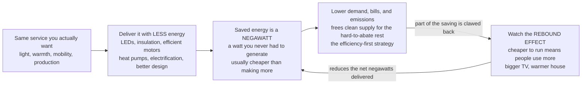

# 💡 Energy Efficiency and Demand Management: The Cheapest Kilowatt-Hour Is the One You Never Use

> [!abstract] TL;DR
> Before you build any power plant — clean or dirty — the smartest, cheapest move is to simply **need less energy for the same result.** Swap 60-watt incandescent bulbs (which waste ~90 percent of their energy as heat) for 9-watt LEDs, insulate a drafty house, use a heat pump instead of a resistance heater, make a motor or engine more efficient — and you get the *same* light, warmth, and motion for a fraction of the energy. Efficiency experts call each unit of energy you *don't* have to generate a **"negawatt,"** and it is usually **far cheaper than producing more** — often at *negative net cost*, because the measure pays for itself in avoided bills. That is why "**efficiency first**" is a foundational energy strategy: efficiency is the quiet, unglamorous, invisible giant of the energy transition — frequently the single **largest and cheapest lever** for cutting emissions and bills, and it *frees* scarce clean generation to decarbonize the hard stuff. There is one famous catch: when something becomes cheaper to run, people sometimes use **more** of it (a bigger TV, a warmer house) — the **rebound effect** — which claws back part of the savings. And cost-effective measures often go un-adopted anyway (the **efficiency gap**), stalled by split incentives, upfront cost, and hassle. But even with these caveats, using energy *smartly* — better technology, better buildings, better habits — remains the foundation of a sane energy system. Why waste what you can save?

## Intuition

**Analogy:** Imagine two ways to make your household richer. The first is to earn more money — that is like building another power plant: expensive, slow, and it takes years to pay off. The second is to **stop leaking money** — plug the drafty windows, cancel the subscriptions you never use, fix the tap that drips all night. The second way is almost always cheaper, faster, and lower-risk, and it makes the first way go further. Energy efficiency is exactly this "stop-the-leak" strategy for energy: a 60-watt incandescent bulb is a *tap left running* — nine-tenths of the electricity you pay for pours out as useless heat, and only a tenth becomes light. Screw in a 9-watt LED and you get the **same brightness** while the leak stops. The energy you no longer waste is a **negawatt**: a watt you *avoided* generating, and the cheapest, cleanest "power plant" in the world, because it never has to be built, fueled, cooled, or connected to the grid.

Scale that up. A house wrapped in insulation needs a smaller furnace and less fuel to stay warm; an electric motor with a variable-speed drive sips power only when the pump actually needs to spin; an electric car turns roughly three-quarters of its energy into motion where a gasoline engine throws three-quarters away as heat. Every one of these is the same trick — **same service, less energy** — and the saved energy costs less than making new energy. But watch for the twist: once the *running cost* of a service falls, people tend to *use more of it*. Cheap light means more, brighter lamps left on longer; a cheap-to-heat house gets kept a couple degrees warmer. That **rebound effect** eats into the savings — sometimes a little, occasionally a lot. Efficiency is still the foundation of a sane energy system, but only if you keep one honest eye on the rebound.

---

## How It Works

The logic is a chain. You start with the **service** a person actually wants — not "kilowatt-hours," but *light in the room, a warm house, a moving car, a smelted tonne of steel.* Efficiency **decouples** that service from the energy needed to deliver it: better technology, better buildings, and better design let you deliver the *same* service with *less* energy. The energy you no longer spend is a **negawatt** — and because avoided energy needs no fuel, no plant, and no transmission, the negawatt is typically the **lowest-cost, lowest-carbon "resource"** on the whole menu, frequently at *negative* net cost once bill savings are counted. Lower energy demand then flows straight through to lower fuel use, lower bills, and lower emissions — and it *shrinks the job* left for clean generation, making every other part of the transition easier and cheaper. The one arrow that runs *backwards* is the **rebound effect**: because efficiency makes the service cheaper to run, demand for the service can rise, clawing back part of the negawatts.



**Where the negawatts come from — four great sinks.** Efficiency is not one technology but a portfolio spread across the four places energy is spent. **(1) Buildings** are an enormous sink: insulation, better glazing, air-sealing, efficient HVAC and especially **heat pumps** (which move heat rather than making it, delivering 3-to-4 units of warmth per unit of electricity), **LED lighting**, and smart controls that only run equipment when needed. **(2) Industry** saves through efficient **motors and variable-speed drives** (motors are ~two-thirds of industrial electricity), process integration, waste-heat recovery and cogeneration, and simply better equipment. **(3) Transport** saves through fuel economy, **modal shift**, and above all **electrification** — an electric drivetrain is inherently ~3-4× more efficient tank-to-wheel than an internal-combustion engine. **(4) Appliances and devices** improve steadily under standards and labels that quietly ratchet up efficiency year after year.

**Measuring it.** The economy-wide scorecard is **energy intensity** — energy consumed per unit of GDP (or per unit of physical output) — which has fallen steadily for decades as economies use energy more cleverly and shift toward services. The policy toolkit that *drives* the gains is **standards and labels**: minimum energy-performance standards (**MEPS**) for appliances, **building codes**, vehicle fuel-economy rules, and mandatory efficiency **labels** that inform buyers. Large users run formal **energy-management systems** (the ISO 50001 standard) to find and bank negawatts systematically.

**Demand management — beyond the device.** Efficiency is about the *amount* of energy per service, but you can also *manage and reduce demand* directly through behavior, information, and **demand-side management (DSM)** programs run by utilities. This overlaps with — but is distinct from — **demand response**, which shifts or sheds load in *time* to match a variable grid (an evening peak, a cheap sunny afternoon). The clean distinction: **efficiency changes the total amount of energy; demand response changes its timing.** Both cut cost and carbon, but through different mechanisms.

**The caveats that keep efficiency honest.** Three big ones. **(1) The rebound effect:** efficiency lowers the running cost of a service, so people consume more of it. *Direct* rebound (drive the efficient car more) is usually modest (~10-30 percent for most services); *indirect* rebound spends the saved money on other energy-using things; and *economy-wide* rebound — the **Jevons paradox** / Khazzoom-Brookes postulate — is the contested claim that efficiency can, at the macro scale, raise total consumption (as more-efficient steam engines historically raised total coal use). **(2) The efficiency gap** (or "energy-efficiency paradox"): measures that are *cost-effective on paper* often go un-adopted because of real barriers — imperfect information, upfront capital cost, hassle/transaction costs, and above all **split incentives**, the classic landlord-tenant problem where the person who would pay for the insulation is not the person who would enjoy the lower bills. **(3) Measurement and baselines:** you can only credibly claim savings against a *counterfactual* of what would have happened anyway, so measurement-and-verification, additionality, and free-ridership are genuinely hard. Despite all three caveats, efficiency remains, in nearly every decarbonization scenario, the **single largest and cheapest wedge** of emissions cuts through 2030 — the unsung hero of the transition.

---

## Key Concepts

### Secondary (intuitive foundation)

- **The cheapest, cleanest energy is the energy you never use.** Every unit you avoid — a **negawatt** — needs no fuel, no plant, and no wires, so it usually costs less and pollutes less than making new energy.
- **Efficiency means: same service, less energy.** The same light, warmth, and motion for a fraction of the input. An incandescent bulb wastes ~90 percent of its energy as heat; an LED giving the same light uses about one-seventh the power.
- **Four places the savings live.** *Buildings* (insulation, LED lighting, heat pumps), *industry* (efficient motors, waste-heat recovery), *transport* (fuel economy and electric vehicles), and *appliances* (standards quietly making them better every year).
- **Watch the rebound.** When something gets cheaper to run, people sometimes use more of it — a bigger TV, a warmer house — clawing back part of the savings. It rarely erases them, but it is real.

### Undergraduate (the working relations)

- **Service vs energy.** Efficiency is measured as *useful service per unit of energy*: lumens per watt (lighting), miles per gallon or Wh per km (vehicles), coefficient of performance **COP** (heat pumps, where COP of 3-4 beats a resistance heater's COP of 1 several-fold because it *moves* heat instead of making it).
- **Energy intensity.** $I = E / \text{GDP}$, the energy needed per dollar of output, has fallen ~1-2 percent per year for decades. It decomposes into a *technical-efficiency* effect and a *structural* effect (economies shifting from heavy industry to services).
- **Standards and labels.** MEPS (minimum energy-performance standards) set a floor; **energy labels** (EU A-to-G, US Energy Star) inform buyers; vehicle **fuel-economy standards** (US CAFE) and **building codes** ratchet whole fleets and stocks upward. Japan's **Top Runner** program uniquely sets the *best current product* as tomorrow's minimum.
- **The negative-cost negawatt and the MAC curve.** Plot abatement measures by cost per tonne of CO2 avoided (a **marginal abatement cost curve**) and many efficiency measures sit *below zero* — they save more in energy bills than they cost, so they **pay for themselves**. This is the analytic heart of "efficiency first."
- **Direct rebound and the demand elasticity.** Efficiency cuts the *effective price* of an energy service; if the service has price-elasticity $\eta$, demand for it rises by roughly $(P_{new}/P_{old})^{\eta}$, so *actual* savings fall short of *engineering* savings. Lighting rebound is small; space heating/cooling and driving can rebound more.
- **DSM vs demand response.** Demand-side management reduces the *total amount* of energy (efficiency, conservation); demand response shifts its *timing* to match the grid. Both are "the demand side," but efficiency is about quantity and DR is about *when*.

### Graduate (mechanisms, limits, and debates)

- **Rebound taxonomy and its magnitude.** *Direct* rebound (more of the same service), *indirect* rebound (saved income spent on other energy), and *economy-wide* rebound culminating in the **Jevons paradox** / Khazzoom-Brookes postulate that efficiency can *increase* aggregate energy use via cheaper energy, growth, and structural change. Empirically, most reviews put *direct* rebound for households at ~10-30 percent and economy-wide rebound meaningfully below 100 percent for most measures — so efficiency still saves energy net, but demand must be modeled as **endogenous**, not fixed.
- **The efficiency gap / energy-efficiency paradox.** The persistent under-adoption of apparently cost-effective measures. Explanations divide into *market failures* (information asymmetry, **split incentives**/principal-agent as in landlord-tenant and builder-buyer, capital-market constraints, learning/network externalities), *hidden costs* (real but unmeasured hassle, downtime, quality trade-offs), and *behavioral* factors (**present bias**, inattention, status-quo bias). Which category dominates determines whether the right fix is a standard, a subsidy, a disclosure mandate, or a nudge.
- **Measurement, additionality, and M&V.** Claimed savings are counterfactual: you never observe the energy *not* used. Rigorous **measurement and verification** (deemed vs metered savings, baseline construction, weather normalization, randomized/quasi-experimental evaluation) must handle **free-ridership** (paying people for actions they would have taken anyway) and **spillover**. "You can't manage what you can't measure" is a literal constraint on efficiency policy.
- **The thermodynamic ceiling — exergy and second-law efficiency.** First-law efficiency asks "how much energy is lost"; **second-law (exergetic) efficiency** asks "how far from the thermodynamic best-possible is this, given the *quality* of energy the task needs." Heating a room to 20 °C by burning a 1500 °C flame or by resistance heating is a first-law "success" but an exergy catastrophe — which is exactly why a **heat pump** (COP > 1) is the thermodynamically correct answer: it matches low-grade heat demand to a low-exergy source. Deep efficiency is ultimately *matching energy quality to task*.
- **Electrification as efficiency.** Because electric drivetrains and heat pumps convert far more of their input to useful service than combustion, **electrifying** end-uses is itself a giant efficiency measure: a country that electrifies transport and heat can deliver the same mobility and warmth on dramatically less *primary* energy, which is why deep-decarbonization scenarios show total final energy *falling* even as electricity's share *rises*.
- **Efficiency's outsized role in decarbonization.** In the IEA's Net Zero pathway, efficiency and related demand-side measures are among the **largest single contributors** to emissions reductions before 2030 — cheaper and faster to deploy than new clean *supply* — which is the quantitative basis for the EU/IEA "**efficiency first**" principle: treat the negawatt as the first resource considered, not the last.

---

## Python Demo

```python
# Energy efficiency: the negawatt as the cheapest resource -- and the rebound
# that eats into it.
#   (a) NEGAWATTS: swap 60 W incandescent bulbs for 9 W LEDs across a home and
#       track cumulative ENERGY saved (negawatt-hours) and MONEY saved, incl. the
#       tiny payback time -> a NEGATIVE-cost measure that pays for itself.
#   (b) REBOUND: cheaper light lowers the effective price of the service, so usage
#       rises -> plot engineering savings vs actual (rebound-adjusted) savings.
#   (c) ENERGY INTENSITY: energy per unit GDP falling over decades as economies
#       use energy more efficiently.
import numpy as np
import matplotlib.pyplot as plt

# ---------------------------------------------------------------------------
# (a) NEGAWATTS from an LED retrofit  (same light, far less energy)
# ---------------------------------------------------------------------------
n_bulbs      = 20            # bulbs in a home
P_inc, P_led = 60.0, 9.0     # watts for the SAME ~800 lumens of light
hours_day    = 4.0           # hours used per day per bulb
price_kwh    = 0.15          # $ per kWh
led_premium  = 2.0           # $ extra per LED bulb vs an incandescent

hours_yr   = hours_day * 365.0
years      = np.arange(0, 11)                      # 0..10 years
# annual energy per whole home (kWh)
E_inc_yr   = n_bulbs * P_inc * hours_yr / 1000.0
E_led_yr   = n_bulbs * P_led * hours_yr / 1000.0
neg_yr     = E_inc_yr - E_led_yr                   # negawatt-hours saved / yr

cum_neg    = neg_yr * years                         # cumulative energy saved (kWh)
upfront    = n_bulbs * led_premium                  # extra upfront $ for LEDs
cum_money  = neg_yr * price_kwh * years - upfront    # cumulative net $ (minus upfront)
payback_yr = upfront / (neg_yr * price_kwh)          # simple payback (years)

# negative-cost check: cost per tonne CO2 avoided (grid ~0.4 kg CO2 / kWh)
co2_kg_kwh = 0.40
co2_yr_t   = neg_yr * co2_kg_kwh / 1000.0            # tonnes CO2 avoided / yr
# lifetime (say 10 yr): net cost = upfront - bill savings; divide by CO2 avoided
net_cost_10 = upfront - neg_yr * price_kwh * 10
cost_per_t  = net_cost_10 / (co2_yr_t * 10)          # $ / tonne (negative = pays for itself)

print("=== (a) LED negawatts (home of 20 bulbs) ===")
print(f"  incandescent: {E_inc_yr:6.0f} kWh/yr   LED: {E_led_yr:6.0f} kWh/yr")
print(f"  negawatts saved: {neg_yr:6.0f} kWh/yr  (~${neg_yr*price_kwh:5.0f}/yr)")
print(f"  upfront LED premium ${upfront:.0f}  ->  payback {payback_yr*12:.1f} months")
print(f"  abatement cost = {cost_per_t:7.0f} $/tCO2  (NEGATIVE => pays for itself)")

# ---------------------------------------------------------------------------
# (b) REBOUND: cheaper service -> more usage claws back part of the savings
# ---------------------------------------------------------------------------
# effective price of an hour of light falls by the efficiency ratio:
price_ratio = P_led / P_inc                          # 9/60 = 0.15 (85% cheaper)
eta         = -0.20                                  # price-elasticity of the service
usage_mult  = price_ratio ** eta                     # >1: people use light MORE
hours_yr_rb = hours_yr * usage_mult                  # rebound-inflated usage
E_led_rb    = n_bulbs * P_led * hours_yr_rb / 1000.0
neg_yr_rb   = E_inc_yr - E_led_rb                    # ACTUAL savings after rebound
takeback    = (neg_yr - neg_yr_rb) / neg_yr          # fraction clawed back

cum_neg_rb  = neg_yr_rb * years
print("\n=== (b) rebound effect ===")
print(f"  effective price of light -{(1-price_ratio)*100:.0f}%  ->  usage x{usage_mult:.2f}")
print(f"  engineering savings {neg_yr:5.0f} kWh/yr  ->  actual {neg_yr_rb:5.0f} kWh/yr")
print(f"  rebound take-back = {takeback*100:.0f}%")

# ---------------------------------------------------------------------------
# (c) ENERGY INTENSITY decline: energy per unit GDP, ~1.5%/yr fall
# ---------------------------------------------------------------------------
yr_hist  = np.arange(1980, 2021)
r_int    = 0.015                                     # ~1.5% per year decline
intensity = 100.0 * np.exp(-r_int * (yr_hist - 1980))

# ---------------------------------------------------------------------------
# Plot
# ---------------------------------------------------------------------------
fig, ax = plt.subplots(2, 2, figsize=(13, 9))

# (1) cumulative ENERGY saved -- the growing pile of negawatts
ax[0, 0].fill_between(years, 0, cum_neg, color="#00b894", alpha=0.35)
ax[0, 0].plot(years, cum_neg, color="#00b894", lw=2.5, marker="o",
              label="cumulative negawatt-hours")
ax[0, 0].set_title("(a) Negawatts pile up: cumulative energy saved\nLED vs incandescent (home of 20 bulbs)")
ax[0, 0].set_xlabel("years"); ax[0, 0].set_ylabel("energy saved [kWh]")
ax[0, 0].grid(alpha=0.3); ax[0, 0].legend(loc="upper left", fontsize=9)

# (2) cumulative MONEY saved -- pays for itself fast (negative-cost measure)
ax[0, 1].axhline(0, color="gray", lw=1)
ax[0, 1].plot(years, cum_money, color="#8338ec", lw=2.5, marker="s")
ax[0, 1].axvline(payback_yr, color="crimson", ls="--", lw=1.5)
ax[0, 1].text(payback_yr + 0.15, cum_money.max() * 0.15,
              f"payback\n~{payback_yr*12:.0f} months", color="crimson", fontsize=9)
ax[0, 1].set_title("(b) A negative-cost measure:\nefficiency that pays for itself")
ax[0, 1].set_xlabel("years"); ax[0, 1].set_ylabel("net money saved [$]")
ax[0, 1].grid(alpha=0.3)

# (3) REBOUND: engineering vs actual savings
ax[1, 0].fill_between(years, cum_neg_rb, cum_neg, color="crimson", alpha=0.20,
                      label=f"clawed back by rebound (~{takeback*100:.0f}%)")
ax[1, 0].plot(years, cum_neg, color="#00b894", lw=2.5, label="engineering savings")
ax[1, 0].plot(years, cum_neg_rb, color="#c0621a", lw=2.5, ls="--",
              label="actual savings (after rebound)")
ax[1, 0].set_title("(c) Rebound effect eats into the negawatts:\ncheaper light -> people use more")
ax[1, 0].set_xlabel("years"); ax[1, 0].set_ylabel("energy saved [kWh]")
ax[1, 0].grid(alpha=0.3); ax[1, 0].legend(loc="upper left", fontsize=8)

# (4) ENERGY INTENSITY declining -- economies using energy more efficiently
ax[1, 1].plot(yr_hist, intensity, color="#0284c7", lw=2.5)
ax[1, 1].fill_between(yr_hist, 0, intensity, color="#0284c7", alpha=0.08)
ax[1, 1].set_title("(d) Energy intensity falls over time:\nless energy per unit of GDP")
ax[1, 1].set_xlabel("year"); ax[1, 1].set_ylabel("energy per GDP [index, 1980 = 100]")
ax[1, 1].set_ylim(0, 105); ax[1, 1].grid(alpha=0.3)

plt.tight_layout()
plt.savefig("energy_efficiency_and_demand_management.png", dpi=120)
plt.show()
```

**What the demo shows.** Panel **(a)** stacks up the **negawatt-hours**: swapping 20 incandescent bulbs for LEDs saves on the order of **1,500 kWh per year**, a pile of avoided energy that never needed a power plant. Panel **(b)** turns those negawatts into dollars — the tiny **LED premium pays back in a couple of months**, after which the measure is pure savings; computing its cost per tonne of CO2 gives a **negative** number, the hallmark of the efficiency measures that sit *below zero* on a marginal-abatement-cost curve (they pay for themselves). Panel **(c)** injects the honesty: because efficient light is ~85 percent cheaper to run, a modest demand-elasticity means people leave lights on longer, so **actual** savings fall short of **engineering** savings — the red wedge is the **rebound take-back**. Panel **(d)** zooms out to the whole economy: **energy intensity** (energy per unit of GDP) falling ~1.5 percent a year is the macro fingerprint of a civilization steadily learning to do more with less.

---

## Real-World Applications

> **Example — the LED lighting revolution as a global negawatt machine.** Lighting once consumed roughly a fifth of the world's electricity, almost all of it burned in incandescent bulbs that turned ~90 percent of their energy into unwanted heat. The rise of the LED — riding **Haitz's law**, the steady exponential improvement in light output per watt — plus coordinated **incandescent phase-outs** (EU 2009-2012, US EISA standards, and dozens of national MEPS) converted lighting from a huge energy sink into one of the cheapest, fastest emission cuts ever achieved. The switch delivers the *same* light for roughly one-seventh the power, pays for itself in months, and demonstrates every theme of this note at once: a genuine **negawatt** at **negative cost**, driven by **standards and labels**, with a modest **rebound** as cheap light gets used more freely.

- **Appliance standards and labels.** US **Energy Star** and MEPS, the **EU energy label** (A-to-G rating), and Japan's **Top Runner** program have quietly ratcheted refrigerators, air conditioners, TVs, and motors to a fraction of their historical energy use — among the highest benefit-to-cost ratios of any energy policy.
- **Buildings: codes, retrofits, and heat pumps.** Building energy codes, **Passivhaus** ultra-low-energy design, weatherization/retrofit programs, and the mass rollout of **heat pumps** (COP 3-4, replacing gas boilers and resistance heaters) attack the single largest energy sink; smart thermostats and controls add a behavioral layer.
- **Industrial efficiency and energy management.** High-efficiency **motors** (IE3/IE4 classes) with **variable-speed drives**, **waste-heat recovery**, process integration, and the **ISO 50001** energy-management standard let factories bank negawatts systematically — motors alone are roughly two-thirds of industrial electricity.
- **Vehicle fuel economy and electrification.** **CAFE**-style fuel-economy standards steadily cut per-mile fuel use, while **electrification** delivers a step-change: an EV drivetrain is ~3-4× more efficient than internal combustion, making vehicle electrification itself one of the largest efficiency measures available.
- **Utility DSM and efficiency-as-a-resource.** Utilities run **demand-side management** programs and **energy-efficiency obligations**, and in integrated resource planning treat efficiency (the "**negawatt**") as a supply option competing directly with new plants — sometimes procured through efficiency markets and pay-for-performance schemes.

---

## Common Pitfalls

- **Ignoring the rebound effect.** Multiplying engineering savings by installed units and stopping there **overstates** real savings — cheaper-to-run services get used more. Model demand as *endogenous*: for services with meaningful price-elasticity (heating, cooling, driving) subtract a direct-rebound take-back, and at policy scale watch for indirect and economy-wide (Jevons) effects.
- **Confusing efficiency with demand response.** They are different levers: **efficiency** cuts the *total amount* of energy per service; **demand response** shifts its *timing* to match the grid. A program that only moves load off-peak has not made anything more efficient, and one that cuts total kWh has not automatically helped the peak. Name which one you mean.
- **Gaming or mis-measuring the baseline.** Claimed savings are counterfactual — you never observe the energy *not* used. Deemed-savings tables, weak baselines, weather non-normalization, and **free-ridership** (paying people for what they would have done anyway) can inflate reported negawatts. Rigorous measurement-and-verification and randomized/quasi-experimental evaluation are non-negotiable.
- **Letting split incentives kill the measure.** The **landlord who buys the insulation** is not the **tenant who pays the heating bill**, so a cost-effective retrofit never happens. Split incentives (also builder-buyer) are a leading cause of the **efficiency gap**; the fix is usually disclosure mandates, standards, or on-bill financing rather than more information alone.
- **Assuming efficiency alone shrinks total energy.** At the level of a single device it does; at the level of an economy, growth and rebound can push total consumption *up* even as intensity falls. Efficiency is necessary but not sufficient — it must be paired with clean supply and, often, price signals.
- **Chasing first-law efficiency while ignoring exergy.** Making a resistance heater "99 percent efficient" is a thermodynamic dead end; a **heat pump** with COP 3-4 delivers the same warmth on a third of the electricity because it *matches energy quality to task*. Judge deep efficiency by the **second law**, not just by how little energy is "lost."
- **Optimizing upfront cost instead of lifecycle cost.** The efficient option often costs more to buy and far less to own. Buyers who minimize the sticker price (from present bias, capital constraints, or inattention) leave negative-cost negawatts on the table — the behavioral core of the efficiency gap.

---

## Related Concepts

Within the **Energy Systems** vault, this note is the demand-side and "efficiency-first" companion to its *Economics, Policy & Frontiers* siblings, referenced here in prose because they are neighboring section notes: *Energy_Economics_and_Markets* (where the negawatt competes as a resource against new supply, and the negative-cost promise is priced), *Energy_Policy_and_Decarbonization* (standards, labels, and the "efficiency first" principle as policy), *Smart_Grids_and_Demand_Response* (the *timing* lever that complements efficiency's *amount* lever), *Sector_Coupling_and_Electrification* (electrification as itself a giant efficiency measure), and *Cogeneration_and_District_Energy* (the supply-side twin that reclaims waste heat to raise fuel-utilization efficiency).

Cross-vault connections (verified to exist):

- [[Exergy_and_Energy_Quality]] — the deep principle beneath second-law efficiency: matching energy *quality* to the task is what makes heat pumps beat resistance heat and cogeneration beat separate production.
- [[Thermodynamics_of_Energy_Conversion]] — the conversion-loss physics that efficiency fights; the Carnot ceiling that says *some* waste is mandatory and the rest is the negawatt frontier.
- [[The_Global_Energy_System_and_Demand]] — the macro map where **energy intensity** falls, demand is endogenous, and Jevons/rebound is flagged as a first-order caveat.
- [[Emissions_and_the_Climate_Impact_of_Energy]] — why the negawatt is also a low-carbon "source": avoided energy is avoided emissions, the cheapest abatement wedge.
- [[Heat_Exchangers_and_HVAC]] — the building-efficiency workhorses (efficient HVAC, heat recovery) that turn better equipment into delivered negawatts.
- [[Power_and_Refrigeration_Cycles]] — the vapor-compression cycle behind the **heat pump** (COP > 1), the single most important efficiency technology for heating.
- [[Externalities_and_Pigouvian_Tax]] — the market-failure lens on the efficiency gap: unpriced carbon and split incentives explain why cost-effective negawatts go un-adopted.
- [[Feedback_Loops_and_Causality]] — the rebound effect as a **reinforcing feedback** loop (cheaper service to more usage), the systems view of why efficiency savings partly leak away.

---

## Review Questions

1. **(Secondary)** Your friend says the best way to cut a household's energy bill and emissions is to "put solar panels on the roof." Using the idea of a **negawatt** and the incandescent-versus-LED example, argue why the *first* move should often be to **use less energy** rather than to generate more — and explain what a negawatt is in plain terms.
2. **(Secondary)** After a family replaces every bulb with an LED, their lighting electricity bill barely drops. Give a plausible reason involving the **rebound effect**, and explain why efficiency savings can be smaller than a simple "watts saved" calculation predicts.
3. **(Undergraduate)** A home swaps twenty 60 W incandescent bulbs (used 4 h/day) for 9 W LEDs at 15 cents per kWh, with a $2-per-bulb premium. (i) Compute the annual energy saved (the negawatts) and the annual money saved. (ii) Compute the simple payback time and explain why this measure appears at **negative cost** on a marginal-abatement-cost curve. (iii) If a demand-elasticity of the lighting service is about -0.2 and efficient light is ~85 percent cheaper to run, qualitatively explain how much of the engineering savings survives.
4. **(Undergraduate)** Distinguish **energy efficiency** from **demand response** with a concrete example of each, and explain why a policy that only shifts load off-peak has *not* improved efficiency, while one that cuts total kWh has *not* automatically helped the evening peak.
5. **(Graduate)** The "efficiency gap" is the persistent under-adoption of measures that look cost-effective on paper. Distinguish the *market-failure*, *hidden-cost*, and *behavioral* explanations, give the policy remedy each implies (standard, subsidy, disclosure, nudge), and explain why the **split-incentive** (landlord-tenant) problem is hard to fix with information alone.
6. **(Graduate)** Deep-decarbonization scenarios often show **total final energy falling** even as **electricity's share rises**, and they credit efficiency as the *largest* near-term abatement wedge — yet the **Jevons paradox** warns that efficiency can raise total consumption. Reconcile these claims: distinguish direct, indirect, and economy-wide rebound; explain why electrification is itself an efficiency measure; and state what the empirical evidence implies for an "efficiency-first" strategy.

---

## Sources

- Amory B. Lovins & Rocky Mountain Institute — [*Reinventing Fire: Bold Business Solutions for the New Energy Era*](https://rmi.org/insight/reinventing-fire/) (Chelsea Green, 2011) — the "negawatt" thesis and efficiency as the cheapest resource.
- International Energy Agency — [*Energy Efficiency (annual market report)*](https://www.iea.org/topics/energy-efficiency) and the [*Energy Efficiency 2024*](https://www.iea.org/reports/energy-efficiency-2024) analysis — global efficiency trends, energy intensity, and the "efficiency first" principle.
- Jonathan M. Cullen & Julian M. Allwood — [*Sustainable Materials with Both Eyes Open*](https://www.withbotheyesopen.com/) (UIT Cambridge, 2012) — where energy and material efficiency really come from, across the whole system.
- Steve Sorrell — [*The Rebound Effect: an assessment of the evidence for economy-wide energy savings from improved energy efficiency*](https://ukerc.ac.uk/publications/the-rebound-effect-an-assessment-of-the-evidence-for-economy-wide-energy-savings-from-improved-energy-efficiency/) (UK Energy Research Centre, 2007) — the definitive review of direct, indirect, and economy-wide rebound.
- Kenneth Gillingham, David Rapson & Gernot Wagner — ["The Rebound Effect and Energy Efficiency Policy,"](https://doi.org/10.1093/reep/rev017) *Review of Environmental Economics and Policy* 10(1), 2016 — modern synthesis on rebound magnitude and policy implications.

---

#energy-systems #energy-efficiency #negawatt #rebound-effect #demand-management
