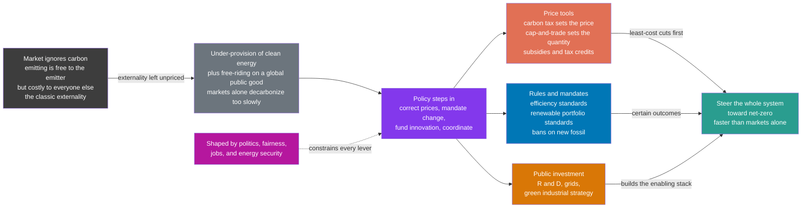

# 🏛️ Energy Policy and Decarbonization: Bending the System Because Markets Won't

> [!abstract] TL;DR
> **The technology to decarbonize energy mostly already exists and is often the cheapest option — yet the transition is too slow, because unregulated markets do not count the damage from carbon.** Burning fossil fuels is effectively *free* to the emitter but *costly* to everyone (the classic **externality**), so left alone, markets systematically under-deliver clean energy and coordination fails. **Policy** is the lever that closes that gap, and it comes in three broad families: **price tools** that put a cost on carbon (a **carbon tax** sets the price, **cap-and-trade** sets the quantity and lets a market find the price) or reward clean energy (**subsidies, tax credits, feed-in tariffs**); **rules and mandates** that simply require change (efficiency standards, **renewable portfolio standards**, bans on new gas boilers or petrol cars); and **public investment** in R and D, grids, and green industrial strategy. Economists favour a carbon price because it finds the *least-cost* cuts automatically — the logic captured by the **marginal abatement cost curve** — but in practice every real decarbonization strategy blends all three, governed across international (**UNFCCC / Paris Agreement / NDCs**), national, and sub-national levels. The hard part is not the physics but the **political economy**: fairness (a **just transition** for workers and the energy-poor), energy security, jobs, carbon leakage, stranded assets, incumbent lobbying, and policy durability. This note connects the vault's energy *technologies* to the political-economic *forces* that actually deploy them — because whether decarbonization happens is as much a policy question as a technical one.

## Intuition

**Analogy:** Think about **littering**. Suppose dropping trash on the street were completely free to you but quietly imposed a small cost on everyone who walks by later. Each individual has no reason to stop — the cost lands on strangers, not on the litterer — so the street fills up even though everyone would prefer it clean. You have three ways to fix this. You can **tax littering** (make each person pay for the mess they make). You can **pay for recycling** (reward the good behaviour with a subsidy). Or you can **ban single-use plastics outright** (a rule that removes the choice). In the real world, cities use *all three at once*.

Carbon is exactly this, at planetary scale. Every ton of CO₂ from burning coal, oil, or gas is "free" to whoever burns it but imposes a real cost — climate damage — on everyone, everywhere, for centuries (the **externality**). Because the market price of fossil energy leaves that damage out, the market keeps choosing fossil fuels even when clean alternatives are cheaper all-in. **Energy policy is the messy, powerful toolkit for correcting that missing price and steering the whole system toward net-zero faster than markets would on their own** — carbon taxes and cap-and-trade (the tax on littering), subsidies and tax credits (paying for recycling), and efficiency standards and phase-out bans (banning the plastics) — all tangled up with politics, fairness, jobs, energy security, and the question of who wins and who loses.

---

## How It Works

### Core Mechanics

Decarbonization is fundamentally a **market-failure and collective-action problem**, and policy is the correction. The mechanism runs in a clear sequence:

1. **The market fails to price carbon.** In an ordinary market, the price of a good reflects its full cost. But CO₂ damage is an **externality**: it is not borne by the buyer or seller of fossil energy, so it never shows up in the price. Coal and gas therefore look artificially cheap, clean energy looks relatively expensive, and the market under-invests in decarbonization. Worse, climate stability is a **global public good** — one country's emission cuts benefit everyone — which invites **free-riding**: each actor prefers others to bear the cost. Unregulated markets deliver too little abatement, too slowly.

2. **Policy steps in to correct prices, mandate change, fund innovation, and coordinate.** Government has a distinct comparative advantage here: it can set a price on the externality, write binding rules, spend public money on things markets under-provide (basic R and D, grids), and negotiate collective commitments across borders.

3. **Price tools put a cost on carbon — the economists' preferred lever.** A **carbon tax** fixes the *price* per ton and lets the *quantity* of emissions adjust; **cap-and-trade** (emissions trading) fixes the *quantity* by issuing a capped number of tradeable permits and lets the *market discover the price*. Both make polluters pay, and — crucially — both let the market find the **cheapest cuts first**: any firm whose abatement cost is below the carbon price will abate rather than pay, so society climbs the cheap steps of the abatement ladder before the expensive ones. On the reward side, **subsidies, investment/production tax credits, and feed-in tariffs** pull down the cost of clean technology and accelerate deployment.

4. **Rules and mandates simply require the change.** Where prices are politically hard or markets respond sluggishly, governments legislate: **efficiency standards** (appliances, buildings, vehicle fuel economy), **renewable portfolio standards / clean-electricity standards** (a required share of clean generation), and **technology phase-outs** (banning new coal plants, internal-combustion cars by a date, gas boilers). These are blunt but certain — they guarantee an outcome rather than a price.

5. **Public investment and industrial policy build what markets won't.** Transmission grids, charging networks, early-stage R and D, and deliberate **green industrial strategy** create the infrastructure and learning curves that private actors under-fund because the returns are diffuse or too distant.

6. **The system bends toward net-zero — but is shaped by politics.** Every lever above is filtered through **political economy**: distributional fairness (the **just transition** for fossil-fuel workers and communities, energy poverty), **energy security** and geopolitics, jobs, **carbon leakage** (production fleeing to unregulated jurisdictions, met by **border carbon adjustments**), **stranded assets** and lock-in, incumbent lobbying, public acceptance, and the **credibility and durability** of the policy over decades. A carbon price that everyone expects to be repealed after the next election changes almost no long-lived investment.

The unifying idea economists bring is **cost-effectiveness**: for a given tonnage of cuts, do the *cheapest* ones first. The **marginal abatement cost curve (MACC)** ranks every option from the money-saving efficiency measures (negative cost) up through cheap renewables to expensive frontier tech like direct air capture. A single carbon price of $X automatically unlocks *every* option cheaper than $X — which is exactly why a broad, uniform price is theoretically the least-cost lever, and why narrow, technology-specific subsidies and mandates can be more expensive per ton even when they are more politically palatable.

### Flow / Architecture



---

## Key Concepts

### Secondary Level

- **Why we need policy at all.** Clean energy technology mostly already exists and is often cheap — so why is the switch so slow? Because polluting with CO₂ is *free* for the polluter but harmful to everyone. Markets do not charge for that harm, so they keep choosing fossil fuels. **Policy exists to fix this gap.**
- **The three big toolboxes.** Governments can (1) **put a price on carbon** — a carbon tax, or a cap-and-trade market — so pollution is no longer free; (2) **reward clean energy** with subsidies and tax breaks; and (3) **make rules** that require change — efficiency standards, renewable targets, or banning new petrol cars and gas boilers by a certain year.
- **Carrot and stick.** A carbon tax and a ban are "sticks"; subsidies and tax credits are "carrots." Real countries use a *mix* of carrots and sticks, because no single tool does everything.
- **Fairness matters (the just transition).** Cutting fossil fuels can hurt coal miners, oil workers, and poor families who spend a lot on energy. Good policy tries to protect these people — retraining, support payments, cheaper clean energy — so the change is fair. This is called a **just transition**.
- **It is a world problem.** No country can solve climate change alone, and each is tempted to let others do the hard work. So nations make shared promises through the **Paris Agreement**, where each pledges its own emission cuts.
- **The point.** Because markets do not price carbon, **policy is the essential lever** that bends the energy system toward zero emissions faster than it would go on its own.

### Undergraduate Level

- **The externality, precisely.** The **social cost of carbon (SCC)** is the estimated damage (in dollars) from emitting one extra ton of CO₂ — recent US federal estimates range roughly **$50–190/tCO₂**, though values vary widely with the discount rate and damage functions used. A **Pigouvian tax** set equal to the SCC internalizes the externality, aligning private incentives with the social optimum (see [[Externalities_and_Pigouvian_Tax]]).
- **Price instruments: tax vs cap.** A **carbon tax** sets price, leaving quantity uncertain; **cap-and-trade** sets quantity (environmental certainty), leaving price uncertain and volatile. The classic **Weitzman "prices vs quantities"** result says the choice depends on the *slopes* of the marginal-cost and marginal-benefit curves — for a stock pollutant like CO₂ (flat near-term marginal damages), a **price** instrument is generally more efficient. Real ETS designs (EU ETS) now add price floors/ceilings, blurring the distinction.
- **The marginal abatement cost curve (MACC).** Rank abatement options from cheapest to most expensive; the height is $/tCO₂, the width is tons available. **Efficiency measures often have *negative* cost** (they save money over their life), then come onshore wind and solar, then EVs and heat pumps, up to expensive frontier options (green hydrogen, DAC). A carbon price of $X unlocks every option to the left of $X — the essence of **least-cost decarbonization**.
- **Subsidies and learning curves.** Clean-tech cost declines were substantially **policy-driven**: feed-in tariffs (Germany's EEG) and deployment subsidies scaled solar and wind, driving costs down a **learning curve** (Wright's law — each doubling of cumulative capacity cut solar module cost ~20%). Solar PV fell ~90% in a decade; batteries similarly. This is the economic rationale for subsidizing *deployment*, not just research: learning-by-doing is itself a positive externality.
- **Regulations and standards.** **Renewable Portfolio Standards (RPS)**, **Corporate Average Fuel Economy (CAFE)** standards, appliance/building codes, and **ICE phase-out** dates (EU 2035, UK, California) deliver *quantity certainty* and overcome behavioural and split-incentive frictions that a price alone leaves unaddressed (landlord-tenant efficiency gaps, consumer myopia).
- **The policy mix in practice.** No jurisdiction relies on one tool. A carbon price handles the broad least-cost cuts; standards target sectors where price signals are weak; subsidies and public R and D pull frontier tech down the cost curve; grids and permitting reform unblock deployment. Overlapping instruments can interact badly — e.g., subsidies *under* a binding cap merely shuffle emissions and lower the permit price without cutting total emissions (the **"waterbed effect"**).
- **Governance levels.** **International** (UNFCCC framework, the **Paris Agreement** with its bottom-up **Nationally Determined Contributions**, the ratchet mechanism and global stocktake), **national/state** (carbon prices, RPS, tax credits like the US IRA), and **local**. Fragmentation creates **carbon leakage**, addressed by **Carbon Border Adjustment Mechanisms (CBAM)**.
- **Distributional effects and the just transition.** Carbon pricing is often **regressive** (energy is a larger budget share for the poor) unless revenue is recycled — via **carbon dividends** (equal per-capita rebates, which can make the poorest *net beneficiaries*), tax cuts, or transition funds. The **just transition** also covers stranded fossil workers and communities.

### Graduate Level

- **Optimal carbon price under uncertainty — the DICE lineage.** Nordhaus's **DICE/RICE** integrated assessment models couple a simple climate model to an economic growth model and solve for the emissions path that maximizes discounted welfare, yielding an *optimal carbon price* rising over time. Results are notoriously sensitive to the **social discount rate**: Nordhaus's descriptive ~4–5% implies modest near-term action, while the **Stern Review's** prescriptive ~1.4% implies aggressive immediate cuts — a debate that is as much ethical (intergenerational equity, pure rate of time preference) as economic. **Weitzman's "dismal theorem"** argues fat-tailed catastrophic risk can dominate the calculus regardless of the central discount rate.
- **Prices vs quantities revisited (Weitzman 1974).** Under abatement-cost uncertainty, expected deadweight loss depends on curve slopes: when the marginal *benefit* of abatement is flatter than marginal *cost* (true for a stock pollutant), a **tax** dominates a cap; hybrids (cap with price collar) capture much of both. This underpins modern ETS reforms (EU ETS Market Stability Reserve, RGGI price floors).
- **Instrument interactions and general equilibrium.** The **tax-interaction effect** and **revenue-recycling effect** mean the welfare cost of a carbon price depends on how revenue is used and how it interacts with pre-existing distortionary taxes (the **double-dividend** hypothesis: recycling carbon revenue to cut labour taxes may reduce net cost). Overlapping instruments under a binding cap trigger the **waterbed effect**, undermining additional measures unless the cap itself tightens.
- **Political economy and time-inconsistency.** Optimal policy is undermined by **credibility** problems: long-lived investment responds to the *expected future* carbon price, not today's, so a government that cannot commit (time-inconsistency, electoral cycles, incumbent lobbying) gets less abatement per announced price. **Carbon lock-in** (sunk fossil capital, network effects, political constituencies) and **stranded-asset** risk create powerful status-quo coalitions. Designing **durable, credible, self-reinforcing** policy (building green constituencies, gradual ratchets, legally entrenched targets) is a first-order problem — arguably more binding than the economics.
- **Carbon leakage, competitiveness, and border adjustments.** Unilateral pricing risks shifting emissions-intensive production abroad (leakage rates estimated ~5–30% for exposed sectors). **CBAM** equalizes the carbon cost of imports but raises WTO-compatibility, measurement (embodied-carbon accounting), and geopolitical-equity concerns (developing-country exports). Ties to **consumption-based vs territorial** emissions accounting.
- **Collective action and the international commons.** Global mitigation is a **public-goods / free-rider** problem with no world enforcer; Paris traded Kyoto's binding top-down targets for universal bottom-up participation, betting that transparency, ratcheting, and reputational/reciprocity dynamics (**repeated-game** cooperation) can sustain deepening ambition. **Climate clubs** (Nordhaus) propose conditional cooperation enforced by trade penalties to overcome free-riding. Current NDCs still imply ~2.5–2.9 °C, illustrating the ambition gap.
- **Beyond marginal pricing: innovation and directed technical change (Acemoglu et al.).** When clean and dirty technologies compete with path-dependent innovation, the optimal policy is a **temporary** combination of carbon price *and* research subsidy that redirects innovation toward clean tech before the price alone would; relying on a carbon price alone is slower and costlier because it ignores the R and D externality. This formalizes why deployment subsidies (learning-by-doing) and research support complement, rather than duplicate, carbon pricing.
- **Sector heterogeneity and hard-to-abate residuals.** Least-cost economy-wide models (e.g., IEA/IPCC pathways) show electricity decarbonizes first and cheapest; aviation, shipping, cement, and steel are **hard-to-abate**, needing hydrogen, e-fuels, CCS, or DAC at high marginal cost — which is precisely where a rising carbon price plus targeted industrial policy matters most, and where residual emissions in "net-zero" concentrate.

---

## Python Demo

```python
# ENERGY POLICY & DECARBONIZATION in three panels:
#   (a) MARGINAL ABATEMENT COST CURVE (MACC): options ranked cheapest-first;
#       a carbon price of $X automatically unlocks every cut cheaper than X.
#   (b) POLICY SCENARIOS: emissions trajectories under business-as-usual vs a
#       moderate carbon price vs strong policy reaching net-zero by 2050.
#   (c) POLICY-DRIVEN DEPLOYMENT S-CURVE: clean-tech adoption accelerated by
#       subsidies/mandates vs a slow no-policy baseline. numpy + matplotlib.
import numpy as np
import matplotlib.pyplot as plt

# ============================================================
# (a) MARGINAL ABATEMENT COST CURVE  [$/tCO2 vs GtCO2 available]
#     Efficiency measures have NEGATIVE cost (they save money).
# ============================================================
measures = [
    ("Building efficiency",  -35.0, 4.0),
    ("Appliance/LED std",    -20.0, 2.0),
    ("Methane leak capture",   8.0, 2.0),
    ("Onshore wind",          12.0, 6.0),
    ("Solar PV",              18.0, 7.0),
    ("Reforestation",         25.0, 3.0),
    ("Offshore wind",         45.0, 4.0),
    ("EVs + heat pumps",      65.0, 5.0),
    ("Nuclear",               70.0, 3.0),
    ("Green hydrogen (ind.)",130.0, 4.0),
    ("CCS on cement",        150.0, 3.0),
    ("Direct air capture",   320.0, 2.0),
]
measures.sort(key=lambda m: m[1])                     # cheapest first
names  = [m[0] for m in measures]
cost   = np.array([m[1] for m in measures])           # $/tCO2
pot    = np.array([m[2] for m in measures])           # GtCO2 available
left   = np.concatenate([[0.0], np.cumsum(pot)[:-1]]) # bar left edges

carbon_price = 60.0                                   # $/tCO2 policy lever
unlocked = pot[cost <= carbon_price].sum()
total    = pot.sum()

print("=== (a) MARGINAL ABATEMENT COST CURVE ===")
print(f"  carbon price          : ${carbon_price:.0f}/tCO2")
print(f"  abatement unlocked    : {unlocked:.0f} of {total:.0f} GtCO2 "
      f"({100*unlocked/total:.0f}% of options, cheapest-first)")

# ============================================================
# (b) POLICY SCENARIOS  [annual GtCO2, 2020-2050]
# ============================================================
yrs = np.arange(2020, 2051)
e0  = 40.0
bau        = e0 * 1.008 ** (yrs - 2020)               # business-as-usual growth
carbon_tax = e0 * np.exp(-0.020 * (yrs - 2020))       # moderate price: partial
strong     = e0 * (1.0 - (yrs - 2020) / 30.0)         # mandates -> net-zero 2050
strong     = np.clip(strong, 0.0, None)

print("\n=== (b) POLICY SCENARIOS (emissions in 2050) ===")
print(f"  business-as-usual : {bau[-1]:5.1f} GtCO2/yr")
print(f"  moderate carbon $ : {carbon_tax[-1]:5.1f} GtCO2/yr")
print(f"  strong policy     : {strong[-1]:5.1f} GtCO2/yr (net-zero)")

# ============================================================
# (c) DEPLOYMENT S-CURVE  [clean-tech share of new sales, %]
#     Logistic adoption; policy raises the growth rate & shifts midpoint.
# ============================================================
def logistic(t, L, k, t0):
    return L / (1.0 + np.exp(-k * (t - t0)))

t_years   = np.arange(2015, 2051)
with_pol  = logistic(t_years, 95.0, 0.42, 2032.0)     # subsidies + mandates
no_pol    = logistic(t_years, 95.0, 0.20, 2044.0)     # market alone, slower

# ------------------------------- plotting -------------------------------
fig, (axA, axB, axC) = plt.subplots(1, 3, figsize=(18, 5.6))
fig.suptitle("Energy policy & decarbonization: least-cost cuts, policy scenarios, "
             "and policy-accelerated deployment", fontsize=13, fontweight="bold")

# (a) MACC
below = cost <= carbon_price
colors = ["#2a9d8f" if b else "#e17055" for b in below]
axA.bar(left, cost, width=pot, align="edge", color=colors,
        edgecolor="white", linewidth=0.6)
axA.axhline(carbon_price, color="#8338ec", lw=2, ls="--",
            label=f"carbon price = ${carbon_price:.0f}/t")
axA.axhline(0, color="k", lw=0.8, alpha=0.5)
axA.axvline(unlocked, color="#8338ec", lw=1, ls=":")
axA.annotate(f"unlocks ~{unlocked:.0f} Gt\n(cheapest-first)",
             xy=(unlocked, carbon_price), xytext=(unlocked + 1.5, 200),
             fontsize=9, color="#8338ec",
             arrowprops=dict(arrowstyle="->", color="#8338ec"))
axA.set_xlabel("cumulative abatement  [GtCO2 / yr]")
axA.set_ylabel("marginal cost  [$ / tCO2]")
axA.set_title("(a) Marginal abatement cost curve\ncheap cuts first; price sets the cutoff",
              fontsize=11)
axA.legend(loc="upper left", fontsize=9)
axA.grid(axis="y", alpha=0.25)

# (b) policy scenarios
axB.plot(yrs, bau,        color="#dc2626", lw=2.5, label="business-as-usual")
axB.plot(yrs, carbon_tax, color="#e17055", lw=2.5, label="moderate carbon price")
axB.plot(yrs, strong,     color="#2a9d8f", lw=2.5, label="strong policy -> net-zero")
axB.axhline(0, color="k", lw=0.8, alpha=0.5)
axB.fill_between(yrs, strong, 0, color="#2a9d8f", alpha=0.12)
axB.annotate("net-zero\nby 2050", xy=(2050, 0), xytext=(2041, 9),
             fontsize=9, color="#2a9d8f",
             arrowprops=dict(arrowstyle="->", color="#2a9d8f"))
axB.set_xlabel("year")
axB.set_ylabel("annual emissions  [GtCO2 / yr]")
axB.set_title("(b) Policy scenarios\nstringency sets the trajectory", fontsize=11)
axB.grid(alpha=0.3)
axB.legend(loc="lower left", fontsize=9)

# (c) deployment S-curve
axC.plot(t_years, with_pol, color="#2a9d8f", lw=2.5, label="with policy support")
axC.plot(t_years, no_pol,   color="#6c757d", lw=2.5, ls="--", label="market alone")
axC.fill_between(t_years, no_pol, with_pol, color="#2a9d8f", alpha=0.15)
axC.annotate("policy pulls\nadoption forward", xy=(2033, 60), xytext=(2036, 28),
             fontsize=9, color="#2a9d8f",
             arrowprops=dict(arrowstyle="->", color="#2a9d8f"))
axC.set_xlabel("year")
axC.set_ylabel("clean-tech share of new sales  [%]")
axC.set_ylim(0, 100)
axC.set_title("(c) Deployment S-curve\nsubsidies + mandates accelerate adoption",
              fontsize=11)
axC.grid(alpha=0.3)
axC.legend(loc="center right", fontsize=9)

plt.tight_layout(rect=[0, 0, 1, 0.93])
plt.show()
```

Running this prints the abatement accounting and scenario endpoints, then draws the policy argument in three panels. **Panel (a)** is the heart of cost-effective climate policy: order every abatement option cheapest-first and the curve reveals that the first cuts *save money* (efficiency, negative cost), the middle band (wind, solar, methane) is cheap, and only frontier options like direct air capture are expensive — and a single **carbon price** slices horizontally across it, automatically unlocking *every* cut below the line without a planner having to pick winners. **Panel (b)** shows why **policy stringency**, not technology, sets the outcome: the same economy drifts upward under business-as-usual, bends modestly under a moderate carbon price, and only a **strong policy package** (price + mandates + investment) reaches net-zero by 2050. **Panel (c)** captures the deployment story — clean tech follows an **S-curve**, and subsidies and mandates *pull the whole curve forward by a decade*, which (via learning-by-doing) is exactly how solar and batteries got cheap. Together the panels say the tools are known and the cheap cuts are real; the binding question is whether policy is strong, broad, and durable enough to climb the curve fast.

---

## Real-World Applications

> **Example — the EU Emissions Trading System (ETS) as cap-and-trade in the wild.** The EU ETS, launched in 2005, is the world's largest carbon market: it caps emissions from ~10,000 power plants and heavy-industry installations, issues a declining number of tradeable allowances, and lets the market discover the price. It illustrates every textbook feature at once. The **cap** guarantees the environmental outcome; the **trading** finds least-cost abatement (a utility that can cheaply switch coal-to-gas sells permits to a steel plant that cannot); early **over-allocation** crashed the price to near zero (the design pitfall of getting the cap wrong); the **Market Stability Reserve** was added to put a floor under volatility (the price-vs-quantity hybrid fix); and the incoming **Carbon Border Adjustment Mechanism (CBAM)** tackles **carbon leakage** by charging imports for their embodied carbon. The carbon price rose from single digits to €80–100/tCO₂, materially reshaping European power-sector dispatch toward gas and renewables.

- **Carbon taxes.** Sweden's carbon tax (introduced 1991, now among the world's highest at ~€120/tCO₂) helped cut emissions while GDP grew — a real-world **decoupling** case; British Columbia's revenue-neutral carbon tax pioneered dividend-style recycling.
- **Subsidies and industrial policy.** The US **Inflation Reduction Act (2022)** deploys hundreds of billions in production and investment tax credits for clean electricity, EVs, and hydrogen — a bet on deployment subsidies and learning curves rather than a carbon price. Germany's **feed-in tariffs (EEG)** earlier seeded the global solar cost decline.
- **Mandates and phase-outs.** Renewable Portfolio Standards across US states, **CAFE** fuel-economy standards, the EU's **2035 ban on new internal-combustion cars**, and UK/EU dates for phasing out gas boilers all deliver quantity certainty where prices alone move too slowly.
- **International governance.** The **UNFCCC → Kyoto → Paris Agreement** arc, with bottom-up **NDCs**, a five-year **ratchet**, and the **global stocktake**, is the coordination layer for a global public-goods problem — and the arena where the ambition gap (~2.5–2.9 °C on current pledges) is measured.
- **Just-transition programs.** Germany's coal-exit **Structural Strengthening Act** (€40bn for lignite regions), and dedicated transition funds in the EU, operationalize fairness for fossil-fuel workers and communities.
- **Carbon-price modeling in policy.** Governments use the **social cost of carbon** in regulatory cost-benefit analysis, and agencies like the **IEA** publish carbon-price and policy-stringency scenarios (Stated Policies vs Announced Pledges vs Net-Zero) that shape national planning.

---

## Common Pitfalls

- **Assuming the market will decarbonize on its own because clean is cheap.** Even when clean energy is cheaper all-in, the *unpriced* externality plus incumbency, financing frictions, split incentives, and infrastructure gaps keep fossil fuels winning. "Cheapest technology" does not imply "automatic adoption" — that is the whole reason policy exists.
- **Treating one instrument as sufficient.** A carbon price alone under-invests in R and D and ignores behavioural/split-incentive barriers; subsidies alone are fiscally expensive and pick winners; mandates alone are not least-cost. Real decarbonization needs a **mix** — and the mix must be designed so instruments reinforce rather than cancel (beware the **waterbed effect** of subsidies under a binding cap).
- **Ignoring the distributional hit (skipping the just transition).** Carbon pricing is regressive if revenue is not recycled, and phase-outs strand workers and regions. Policies that ignore fairness generate backlash (see the *gilets jaunes* fuel-tax protests) and get repealed — killing their long-run climate value. **Revenue recycling and transition support are not optional add-ons; they are what makes the policy durable.**
- **Getting the cap wrong in cap-and-trade.** Over-allocate permits and the price collapses to zero, delivering no abatement (early EU ETS, early California). Quantity instruments give environmental certainty only if the cap is set tight and credible, ideally with a price floor.
- **Setting a carbon price nobody believes will last.** Long-lived capital responds to the *expected future* price. A price expected to be repealed after the next election barely shifts investment. **Credibility and durability matter more than the headline number.**
- **Confusing avoided-emissions accounting and leakage.** A jurisdiction can appear to decarbonize by exporting its heavy industry (carbon leakage) rather than actually cutting global emissions — the reason **border adjustments** and consumption-based accounting exist.
- **Subsidizing under a binding cap (the waterbed effect).** Adding a clean-energy subsidy on top of a fixed emissions cap merely lowers the permit price and reshuffles *where* emissions occur without cutting the *total* — the cap already fixed the quantity. Overlapping instruments must be co-designed.
- **Betting the pathway on future removals.** "Net-zero by 2050" plans that back-load cuts and lean on large-scale future carbon removal risk a **moral hazard** that licenses present-day delay — and the *cumulative* budget, not the endpoint, sets the warming.

---

## Related Concepts

This note lives in the vault's **Economics, Policy & Frontiers** pillar and links the energy *technologies* to the political-economic forces that deploy them. Its immediate siblings — referenced here in prose — develop adjacent pieces: *Energy_Economics_and_Markets* (how energy markets and prices work, the substrate policy intervenes in), *The_Energy_Transition_and_Net_Zero* (the physical pathway and targets policy is steering toward), *Energy_Efficiency_and_Demand_Management* (the negative-cost, left-hand end of the abatement curve that standards target), *Energy_Access_and_Global_Development* (the equity and energy-poverty dimension of a fair transition), and *Emissions_and_the_Climate_Impact_of_Energy* (the carbon externality and net-zero rationale this policy toolkit exists to address). The cross-links below point to notes that already exist elsewhere in the vault.

**Energy-systems technologies that policy deploys**
- [[Energy_Systems_Overview]] — the hub of this vault; policy is how these technologies actually get built at scale
- [[The_Global_Energy_System_and_Demand]] — the scale of the energy demand that policy must decarbonize, and the fossil incumbency it must overcome
- [[Solar_Photovoltaics]] — its ~90% cost decline was substantially policy-driven (feed-in tariffs and deployment subsidies down the learning curve)
- [[Wind_Energy]] — scaled by renewable portfolio standards and production tax credits, a canonical mandate-plus-subsidy success
- [[Nuclear_Fission_Power]] — clean, firm generation whose economics hinge on policy (financing support, carbon pricing, licensing)
- [[Carbon_Capture_Utilization_and_Storage]] — the high-cost, right-hand end of the abatement curve for hard-to-abate residuals, funded by credits and mandates

**Economic foundations — the market failure policy corrects (Microeconomics vault)**
- [[Externalities_and_Pigouvian_Tax]] — the core logic: carbon is a negative externality, and a carbon tax is the textbook Pigouvian correction
- [[Market_Failures]] — the broader category (externalities, public goods, information failures) that justifies intervention
- [[Public_Goods]] — climate stability is a global public good, so abatement is chronically under-provided and free-riding is rational
- [[Coase_Theorem]] — the property-rights alternative: cap-and-trade creates tradeable emission rights, letting the market bargain to the efficient allocation

**Political economy and governance — how policy actually gets made (Political Science vault)**
- [[Climate_Politics_and_Environmental_Governance]] — the international collective-action architecture (UNFCCC, Kyoto, Paris, NDCs) and its distributive politics
- [[Policy_Analysis_and_the_Policy_Process]] — how energy policy is designed, adopted, and evaluated inside the policy process
- [[Regulatory_Politics_and_Administrative_Law]] — the machinery through which standards and mandates are written and enforced

**Cooperation and behaviour**
- [[Repeated_Games_and_Folk_Theorems]] — why sustained international climate cooperation is possible despite free-rider incentives: repetition and reciprocity
- [[Nudges_and_Choice_Architecture]] — the behavioural, low-cost complement to prices and mandates (default green tariffs, efficiency labels)

---

## Review Questions

**Secondary**
1. Clean energy is often already the cheapest option, yet the world is not switching fast enough. Using the idea that polluting with carbon is "free to the polluter but costly to everyone," explain *why* markets on their own decarbonize too slowly. Then name the three families of policy tools governments use to fix this, giving one everyday-littering analogy for each (a stick, a carrot, and a rule).

**Undergraduate**
2. A government wants to cut emissions at the *lowest total cost*. (i) Sketch and explain a **marginal abatement cost curve**, including why some measures (efficiency) sit *below* zero. (ii) Explain how setting a single **carbon price of $X** automatically selects the least-cost set of cuts, and why this makes a broad price more cost-effective than a pile of technology-specific subsidies. (iii) The finance minister worries the carbon tax will hit poor households hardest. Explain why carbon pricing is often **regressive** and describe two ways to recycle the revenue that could make the policy fair (and therefore politically durable).

**Graduate**
3. A country is choosing between a **carbon tax** and a **cap-and-trade** system, and separately debating whether to *also* add clean-energy subsidies and R and D support. (a) Using **Weitzman's "prices vs quantities"** logic and the stock-pollutant nature of CO₂, argue which price instrument is more efficient under abatement-cost uncertainty, and how a hybrid (price collar) changes the answer. (b) The country already has a binding emissions cap. Explain the **waterbed effect** and why stacking a subsidy on top may not reduce total emissions. (c) Drawing on **directed technical change** (Acemoglu et al.) and the R and D externality, argue why a carbon price *alone* may still be insufficient, and what temporary complementary policy the theory recommends. (d) Finally, explain why **policy credibility and durability** may matter more for long-lived investment than the exact level of the carbon price, and how carbon **lock-in** and **stranded-asset** politics threaten that durability.

---

## Sources

- Nordhaus, W. (2013). *The Climate Casino: Risk, Uncertainty, and Economics for a Warming World.* Yale University Press — DICE/RICE integrated assessment, optimal carbon price, discounting, and climate clubs.
- Stern, N. (2007). *The Economics of Climate Change: The Stern Review.* Cambridge University Press — the market-failure framing ("the greatest market failure the world has seen") and the low-discount-rate case for early, aggressive action.
- IPCC (2022). *Climate Change 2022: Mitigation of Climate Change (AR6 WG III)* — Summary for Policymakers, Ch. 13 (national/sub-national policy) and Ch. 14 (international cooperation); policy instruments and pathways.
- International Energy Agency (annual). *World Energy Outlook* — Stated Policies, Announced Pledges, and Net-Zero-by-2050 policy scenarios and their emissions trajectories.
- Weitzman, M. L. (1974). "Prices vs. Quantities." *Review of Economic Studies*, 41(4), 477–491 — the foundational instrument-choice result under uncertainty.

---

#energy-systems #energy-policy #decarbonization #carbon-pricing #just-transition
