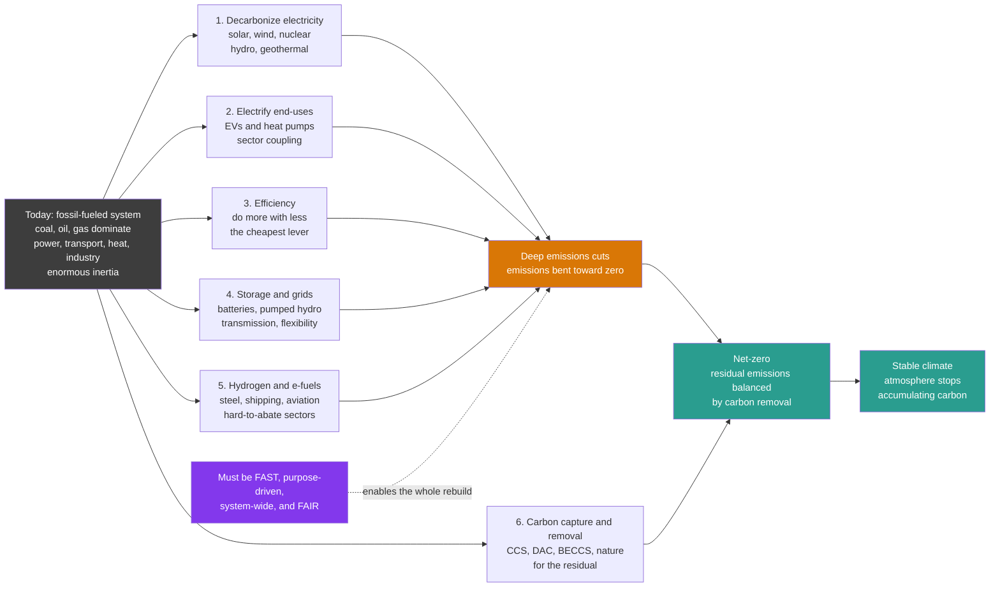

# 🌍 The Energy Transition and Net Zero: Rebuilding Civilization's Foundations in a Few Decades

> [!abstract] TL;DR
> **The energy transition is the deliberate, system-wide rebuild of the machinery that powers civilization — swapping fossil fuels for clean energy fast enough to stop wrecking the climate — and it is the synthesis that every other note in this vault feeds into.** Its goal is **net-zero**: cut greenhouse emissions as close to zero as physically possible, then cancel the stubborn remainder by **removing CO₂ from the air**, so the atmosphere stops accumulating carbon (the reason emitting *less* is not enough — see the carbon budget). It is unlike past transitions (wood→coal→oil, which took a **century** and were driven by better, cheaper fuels winning out): this one is **purpose-driven** (to hit a climate target), **far faster** (decades), and moves toward sources that are cleaner but in some ways *harder* — variable renewables that need whole new grids and storage. There is no single silver bullet; the transition deploys a **portfolio of levers together**: (1) **decarbonize electricity** (solar, wind, nuclear, hydro, geothermal), (2) **electrify** cars and heat, (3) squeeze **efficiency** (the cheapest lever), (4) build **storage and grids** to firm variable supply, (5) use **hydrogen and e-fuels** for hard-to-abate steel, shipping, and aviation, and (6) apply **carbon capture and removal** to the unavoidable residual. The challenge is speed and scale — the fastest infrastructure build in history — plus system integration, investment, political will, and a **just** transition that is fair and affordable worldwide. The reasons for optimism (plunging costs, exponential deployment **S-curves**) collide with a sobering gap to targets. Understanding how all the vault's pieces snap into this integrated, urgent, and equitable transformation is the whole point of studying energy systems.

## Intuition

**Analogy:** Humanity is attempting the **fastest, largest rebuild of its own physical foundations in history**. For two centuries, fossil-fuel machinery — power plants, engines, furnaces, boilers — has been the hidden skeleton holding up modern life. Now we are deliberately trying to swap out that entire skeleton, while the body keeps running, in just a few **decades**, so we can stop overheating the planet. Every previous energy transition — wood to coal, coal to oil — unfolded over roughly a **century** and happened almost by accident: a *better, cheaper, denser* fuel simply out-competed the old one, and nobody planned it. This transition is fundamentally different in three ways. It is **purpose-driven** — we are doing it *on purpose*, to hit a climate goal, not because clean power magically beat fossil fuels at every task. It is **fast** — decades, not a century. And for the first time we are moving *toward* sources that are cleaner but in some ways **harder to use**: the sun and wind are free but *variable*, so they demand entirely new grids, storage, and ways of running the system.

The goal has a precise name — **net-zero** — and it means cutting emissions as close to zero as we possibly can, then **canceling the stubborn remainder by pulling CO₂ back out of the air**, so the planet stops accumulating carbon. (Emitting merely *less* does not work, because CO₂ piles up for centuries: as long as we add any net amount, the blanket keeps thickening.) Picture the whole thing as **steering a supertanker**: enormous momentum, agonizingly slow to turn, every part connected to every other. You cannot fix one piece in isolation — you must *simultaneously* build clean power, electrify the cars and the heating, remake heavy industry, string new transmission and storage across continents, and do all of it **fairly and affordably**, for rich and poor countries alike. It is the **defining project of our era**: technically possible, economically more favorable every year — and a **race against time and inertia**.

---

## How It Works

### Core Mechanics

The transition is not one action but a **coordinated set of moves** on a system with enormous inertia. Six mechanics make it work — and make it hard.

1. **The target is set by physics, not politics.** Because CO₂ **accumulates** in the atmosphere for centuries, the eventual warming is fixed by the *cumulative* total we ever emit — the **carbon budget**. Steady emissions still thicken the blanket; only driving *net* emissions to **zero** halts the buildup. That is why the goal is **net-zero**, and why the timeline (~**2050** for a good shot at 1.5–2 °C) is dictated by how fast the remaining budget is being spent, not by any political calendar.

2. **"Net" means residual plus removal.** A perfectly zero-emission world is not achievable soon: cement chemistry, long-haul aviation, some agriculture, and industrial process heat leave a **hard-to-abate residual**. Net-zero tolerates that residual *only if an equal quantity of CO₂ is removed* — by afforestation, bioenergy-with-capture (BECCS), direct air capture (DAC), or enhanced weathering. Crucially, **avoided emissions are not removals**, and **temporary** biological storage (a forest that can burn) is not the same as **durable** geological storage.

3. **No silver bullet — a portfolio of levers.** Deep decarbonization comes from stacking a handful of moves, each cutting a slice: **decarbonize electricity**, **electrify** end-uses, harvest **efficiency**, integrate variable supply with **storage and grids**, deploy **hydrogen** for what electricity cannot easily reach, and apply **carbon removal** to the rest. They are complements, not substitutes — leave one out and the others must strain to cover the gap.

4. **Electricity is the keystone — clean it, then run everything on it.** The cheapest deep-decarbonization strategy is a two-step: first make electricity nearly carbon-free (solar and wind are now the cheapest new power in most of the world), then **shift as many end-uses onto that clean grid as possible** — electric vehicles instead of engines, heat pumps instead of furnaces. This is **sector coupling**: transport and heat become "customers" of clean power, and because an EV or heat pump is intrinsically far more efficient than combustion, electrification *cuts primary energy demand* even as it cleans it.

5. **Variability forces a new kind of grid.** A fossil plant is a controllable tap you turn up or down; the sun and wind are not. Integrating them at scale means building **flexibility**: batteries and pumped hydro to time-shift energy, long-distance **transmission** to average out weather over geography, demand that flexes to match supply, and firm low-carbon capacity (nuclear, hydro, geothermal, or hydrogen turbines) for the long, still, dark stretches. The variable renewable is cheap; **firming it** is where much of the system cost and engineering now lives.

6. **The pace is set by S-curves and by inertia fighting them.** Clean technologies deploy along **S-curves**: slow, then explosively exponential as costs fall and scale compounds (solar and batteries have followed steep **learning curves**, roughly 20–30% cost drops per doubling of cumulative production). Against that momentum stands **incumbency and lock-in** — trillions in existing fossil assets, supply chains, and institutions whose **committed emissions** rival the entire remaining budget, implying not just *stopping new builds* but *early retirement* of assets still capable of running.

**The overarching constraint is speed, scale, and fairness.** This is the fastest infrastructure transformation ever attempted, requiring investment on the order of **trillions of dollars per year**, secure supply chains for critical materials (lithium, copper, rare earths), the political will to price carbon and set standards, and — decisively — a **just transition** that protects workers, keeps energy affordable, and extends modern energy *access* to those who still lack it. A transition that is technically brilliant but socially unjust will stall.

### Flow / Architecture



---

## Key Concepts

### Secondary Level

- **What the transition is.** We are changing the whole world's energy system — swapping coal, oil, and gas for clean energy like **sun, wind, and nuclear** — to stop climate change. It is like rebuilding the engine of a moving car without stopping the car.
- **Why it is different from before.** People switched from wood to coal, and coal to oil, over about **100 years**, each time because the new fuel was simply *better and cheaper*. This time we are switching **on purpose** to stop overheating the planet, we are doing it **much faster**, and the new sources are cleaner but trickier — the sun and wind come and go, so we need new **batteries and power lines**.
- **What "net-zero" means.** Cut the pollution we put in the air down to almost nothing, then **soak up whatever is left** by pulling it back out of the air (for example, growing forests or machines that capture CO₂). Then the air stops getting worse. Just polluting *less* is not enough, because the pollution **builds up and stays**.
- **The main tools (the levers).** There is no single fix. We use several tools together: **clean electricity**, running **cars and heating on that electricity**, **wasting less energy**, **storing** energy and building better **grids**, using **hydrogen** for the hardest jobs like making steel, and **capturing carbon** for the rest.
- **Why it is hard.** It has to happen **fast and everywhere at once**, it costs a lot up front, and it has to be **fair** — cheap enough for ordinary people and helpful to poorer countries, not just rich ones.
- **Why to be hopeful.** Clean energy has gotten **dramatically cheaper** — solar and batteries cost a fraction of what they did a decade ago — and they are being built faster and faster. The race is whether that speed is enough.

### Undergraduate Level

- **Contrasting the transitions.** Historical energy transitions were **demand-pull, market-driven, and slow**: coal displaced wood because it was denser and cheaper for steam; oil displaced coal for its portability and energy density. Each took **50–100 years** to move from a few percent to majority share. The current transition is **policy-push and target-constrained**: it is driven by an externality (climate damage) rather than a superior private good, must complete in **~30 years**, and moves *toward* lower power-density, *variable* primary sources — reversing the historical trend toward ever-denser, dispatchable fuels. That reversal is exactly what makes grids and storage central.
- **Net-zero, formally.** Net-zero CO₂ is the state where **anthropogenic emissions are balanced by anthropogenic removals** over a given period. It is *required* (not merely desirable) because of the near-linear relationship between cumulative CO₂ and peak warming: only zeroing net emissions stabilizes temperature. Distinguish it from **carbon-neutral** (often a company/product claim leaning heavily on purchased *offsets*, frequently avoided-emission credits of dubious permanence) and from **net-zero GHG** (which also balances methane and N₂O, a harder target than net-zero CO₂ alone).
- **The mitigation wedges.** The gap between a business-as-usual emissions path and a net-zero path can be **decomposed into wedges** (after Pacala and Socolow), each a strategy that grows over time to cut a slice: **efficiency** (largest and cheapest early), **clean electricity supply**, **electrification** of transport/heat, **hydrogen/e-fuels**, and **CCS/removal** (ramping late to mop up the residual). Marginal abatement cost generally *rises* along this stack — efficiency and renewables are often *negative-cost*, while DAC and aviation e-fuels are expensive — which is why the cheap levers must be pushed hardest and first.
- **Sector coupling and the efficiency dividend.** Electrifying end-uses does double duty. A battery-electric vehicle converts ~**80–90%** of input energy to motion vs ~**20–30%** for an internal-combustion engine; a heat pump delivers **3–4 units of heat per unit of electricity** (coefficient of performance > 1) by *moving* heat rather than making it. So electrification, powered by a clean grid, both **cleans** demand and **shrinks primary energy demand** — the reason IEA net-zero scenarios show total primary energy *falling* even as energy *services* grow.
- **Firming variable renewables.** Integrating high shares of solar and wind requires managing variability across timescales: **seconds–minutes** (inertia, fast frequency response — increasingly from grid-forming inverters), **hours** (batteries, demand response, the "duck curve"), **days** (dispatchable hydro, gas-with-CCS, imports), and **seasons** (long-duration storage, hydrogen, overbuild-and-curtail). System cost is not just LCOE of the generator but the **system value** net of integration cost — which declines as penetration rises unless flexibility scales with it.
- **Cost, investment, and the S-curve.** Clean-energy **learning rates** (~**20% for solar PV, ~19% for lithium-ion batteries** per doubling of cumulative deployment) have driven order-of-magnitude cost declines, tipping solar and wind to the **cheapest new generation** across most of the world. Deployment follows a **logistic S-curve**; the policy question is whether the current exponential phase is steep enough to close the gap to targets, given the trillions/year of capital, permitting reform, and grid buildout required.
- **The just transition.** Decarbonization redistributes costs and benefits: fossil-dependent workers and regions face **stranded jobs**; low-income households are exposed to energy-price shocks; developing nations argue they need **energy access** and growth first and bear least historical responsibility. A durable transition therefore couples technology with **equity policy** — worker retraining, revenue recycling from carbon pricing, and climate finance from rich to poor countries — echoing the fairness dimension of development economics.

### Graduate Level

- **The whole-systems optimization problem.** Deep decarbonization is best framed as a **capacity-expansion and dispatch co-optimization** across the coupled power–transport–heat–industry system under a cumulative-emissions (carbon-budget) constraint. Because levers interact — electrification *raises* electricity demand, which *raises* the value of clean generation and storage; hydrogen competes with direct electrification for the same clean electrons — least-cost pathways are **path-dependent** and sensitive to technology-cost trajectories, discount rates, and the assumed availability of CDR. Models (e.g., integrated assessment models, MESSAGE, GCAM, and detailed energy-system optimizers) reveal that **residual-emission and CDR assumptions dominate** the feasible pathway space, making CDR credibility a first-order determinant, not a footnote.
- **The near-linearity that makes budgets the currency.** Peak warming ≈ **TCRE × cumulative CO₂** (~0.45 °C per 1000 GtCO₂), roughly independent of pathway. This is why net-zero *timing* and the *area under the emissions curve* — not just the endpoint — determine outcomes, and why a pathway that back-loads cuts can overshoot the budget even while nominally reaching net-zero on schedule. Overshoot scenarios then rely on **net-negative** emissions to draw temperature back down, importing all the permanence, scale, and moral-hazard risks of large CDR.
- **Overshoot, moral hazard, and the CDR wager.** Budgeting today for *future* removals can **license present delay** (the moral-hazard critique). Distinctions that decide credibility: **flow vs stock** removal, **durability** (geological centuries-to-millennia vs biological decades and reversible), **additionality**, and the vast **energy and land footprints** of BECCS/DAC (DAC's thermodynamic minimum work to concentrate dilute atmospheric CO₂ is nontrivial; BECCS competes for land, water, and biomass). Over-reliance on speculative CDR is the central integrity risk in net-zero pledges.
- **Value deflation and the marginal economics of VRE.** As variable renewables scale, their **wholesale value deflates** (self-cannibalization: solar depresses midday prices it depends on), so LCOE understates true system cost. The relevant metrics become **system LCOE / value-adjusted LCOE**, marginal system value, and the co-scaling of storage, transmission, and flexible demand. This reframes "cheap solar" — the *generator* is cheap; the *decarbonized, reliable system* built around it is where cost and engineering concentrate, and where the last ~10–20% of fossil generation is hardest and most expensive to displace.
- **Hard-to-abate sectors and molecular energy carriers.** Sectors needing high energy density or high-temperature/reducing chemistry — **steel** (coke as reductant → green-hydrogen direct reduction), **cement** (process CO₂ from calcination, intrinsic to the chemistry → CCS or novel binders), **aviation and shipping** (energy-density limits of batteries → sustainable e-fuels/ammonia/methanol) — resist electrification. Their abatement hinges on **green hydrogen** (electrolysis powered by clean electricity) and **CCS**, both currently high-cost, making them the residual that CDR and carbon pricing must eventually reach.
- **Political economy, lock-in, and stranded assets.** The transition is as much an **institutional** problem as a technical one: existing fossil capital embodies **committed emissions** comparable to the entire 1.5 °C budget, so budget-consistency implies **premature retirement** and asset stranding, with attendant financial-stability and distributional politics. Carbon pricing, standards/mandates, and green industrial policy must overcome incumbent rents, collective-action and free-rider problems across nations, and **carbon leakage** (production and emissions relocating to unpriced jurisdictions — motivating border carbon adjustments). This is where energy systems meet climate politics and governance.
- **Systems-thinking framing.** The energy system is a **complex adaptive system** with feedbacks (learning curves as reinforcing loops accelerating deployment; incumbency and sunk capital as balancing loops resisting it), tipping dynamics, and high-leverage intervention points. Framing decarbonization through **leverage points** — shifting the goal (net-zero), the rules (carbon price), and information flows (disclosure) rather than merely tweaking parameters — and bounding it by **planetary boundaries** connects the engineering of the transition to the broader science of steering large socio-technical systems.

---

## Python Demo

```python
# The energy transition to net-zero in THREE panels:
#   (a) NET-ZERO PATHWAY / MITIGATION WEDGES -- an emissions trajectory falling
#       from today to net-zero by ~2050, decomposed into contributing "wedges"
#       (efficiency, clean electricity, electrification, hydrogen, capture/removal),
#       with the residual offset by removal to reach net-zero.
#   (b) ENERGY-MIX TRANSFORMATION -- the S-curves: fossil share shrinking while
#       renewables + clean surge over the decades.
#   (c) CARBON BUDGET -- cumulative emissions vs the finite budget under FAST vs
#       SLOW action; slow action blows the budget, fast action stays inside it.
# numpy + matplotlib only.
import numpy as np
import matplotlib.pyplot as plt

# ============================================================
# (a) NET-ZERO PATHWAY DECOMPOSED INTO MITIGATION WEDGES  [GtCO2/yr]
# ============================================================
yrs = np.arange(2020, 2051)                 # 2020 -> 2050
t   = yrs - 2020

baseline = 40.0 + 0.5 * t                   # business-as-usual: rising demand
gross    = 40.0 * (1.0 - t / 30.0)          # gross emissions -> 0 at 2050
gross    = np.clip(gross, 0.0, None)
gap      = baseline - gross                 # total mitigation that must be delivered

# Raw wedge "weights": efficiency dominates early; hydrogen & capture ramp late.
w_eff   = 0.35 - 0.15 * (t / 30.0)          # efficiency: high early, tapering
w_elec  = 0.30 + 0.00 * t                   # clean electricity supply: steady, big
w_ify   = 0.10 + 0.15 * (t / 30.0)          # electrification: ramps up
w_h2    = 0.02 + 0.10 * (t / 30.0)          # hydrogen / e-fuels: ramps late
w_cap   = 0.03 + 0.12 * (t / 30.0)          # capture + removal: ramps latest
W = np.vstack([w_eff, w_elec, w_ify, w_h2, w_cap])
W = W / W.sum(axis=0)                        # normalise so wedges sum to the gap
wedges = W * gap                             # each wedge's GtCO2/yr contribution

labels = ["Efficiency", "Clean electricity", "Electrification",
          "Hydrogen / e-fuels", "Capture + removal"]
colors = ["#8ecae6", "#219ebc", "#2a9d8f", "#8338ec", "#d97706"]

residual_2050 = 3.0                          # hard-to-abate residual at 2050
print("=== (a) NET-ZERO PATHWAY / WEDGES ===")
print(f"  2020 emissions       : {gross[0]:.0f} GtCO2/yr")
print(f"  2050 gross residual  : ~{residual_2050:.0f} GtCO2/yr (aviation, cement, etc.)")
print(f"  2050 removal offsets it -> NET-ZERO")
print(f"  total mitigation @2050: {gap[-1]:.0f} GtCO2/yr across 5 wedges")

# ============================================================
# (b) ENERGY-MIX TRANSFORMATION -- the S-curves  [share of primary energy]
# ============================================================
ymix   = np.arange(2020, 2061)
tm     = ymix - 2020
fossil = 0.20 + 0.60 / (1.0 + np.exp(0.18 * (ymix - 2038)))   # 0.78 -> 0.21
nuclear = 0.05 + 0.05 * tm / 40.0                             # 0.05 -> 0.10
renew   = 1.0 - fossil - nuclear                              # remainder (S-curve up)
print("\n=== (b) ENERGY-MIX TRANSFORMATION ===")
print(f"  fossil share 2020 -> 2060 : {fossil[0]*100:.0f}% -> {fossil[-1]*100:.0f}%")
print(f"  renewable share 2020->2060: {renew[0]*100:.0f}% -> {renew[-1]*100:.0f}%")

# ============================================================
# (c) CARBON BUDGET -- cumulative emissions, FAST vs SLOW  [GtCO2]
# ============================================================
budget = 500.0                               # remaining ~1.5C budget from 2020
yb     = np.arange(2020, 2071)
tb     = yb - 2020

fast = 40.0 * np.exp(-0.09 * tb)             # fast: steep decline from 2020
slow = np.where(yb <= 2035, 40.0,            # slow: flat then late decline
                np.clip(40.0 * (1.0 - (yb - 2035) / 25.0), 0.0, None))
cum_fast = np.cumsum(fast)
cum_slow = np.cumsum(slow)
i_bust   = int(np.argmax(cum_slow >= budget))
print("\n=== (c) CARBON BUDGET ===")
print(f"  remaining 1.5C budget       : {budget:.0f} GtCO2")
print(f"  FAST action peak cumulative : {cum_fast.max():.0f} GtCO2 (stays under)")
print(f"  SLOW action blows budget in : {yb[i_bust]}")

# ------------------------------- plotting -------------------------------
fig, (axA, axB, axC) = plt.subplots(1, 3, figsize=(18, 5.8))
fig.suptitle("The energy transition to net-zero: stack every lever, flip the mix, "
             "and stay inside the budget", fontsize=13, fontweight="bold")

# (a) net-zero pathway with mitigation wedges
axA.stackplot(yrs, wedges, labels=labels, colors=colors, alpha=0.85)
axA.plot(yrs, baseline, "k--", lw=1.6, label="business-as-usual")
axA.plot(yrs, gross, color="#dc2626", lw=2.6, label="net emissions -> zero")
axA.axhline(0, color="k", lw=1, alpha=0.5)
axA.annotate("residual balanced\nby removal = NET-ZERO",
             xy=(2050, 0), xytext=(2035, 20), fontsize=8, color="#2a9d8f",
             arrowprops=dict(arrowstyle="->", color="#2a9d8f"))
axA.set_xlabel("year")
axA.set_ylabel("emissions  [GtCO2 / yr]")
axA.set_title("(a) Net-zero pathway = stacked wedges\nno single silver bullet",
              fontsize=11)
axA.legend(loc="upper left", fontsize=7.5, ncol=1)
axA.set_xlim(2020, 2050)

# (b) energy-mix S-curves
axB.stackplot(ymix, fossil, renew, nuclear,
              labels=["Fossil fuels", "Renewables", "Nuclear"],
              colors=["#3d3d3d", "#2a9d8f", "#e9c46a"], alpha=0.9)
axB.set_xlabel("year")
axB.set_ylabel("share of primary energy")
axB.set_ylim(0, 1)
axB.set_title("(b) Energy-mix transformation\nthe S-curves cross over", fontsize=11)
axB.legend(loc="center right", fontsize=8)

# (c) carbon budget: cumulative fast vs slow
axC.plot(yb, cum_slow, color="#dc2626", lw=2.6, label="slow action (cumulative)")
axC.plot(yb, cum_fast, color="#2a9d8f", lw=2.6, label="fast action (cumulative)")
axC.axhline(budget, color="#8338ec", lw=2, ls="--",
            label=f"1.5 C budget = {budget:.0f} Gt")
axC.axvline(yb[i_bust], color="#dc2626", lw=1, ls=":")
axC.annotate(f"budget blown\n~{yb[i_bust]}", xy=(yb[i_bust], budget),
             xytext=(yb[i_bust] + 3, budget * 0.5), fontsize=9, color="#dc2626",
             arrowprops=dict(arrowstyle="->", color="#dc2626"))
axC.set_xlabel("year")
axC.set_ylabel("cumulative emissions since 2020  [GtCO2]")
axC.set_title("(c) Carbon budget: fast vs slow\nspeed is everything", fontsize=11)
axC.grid(alpha=0.3)
axC.legend(loc="upper left", fontsize=8)

plt.tight_layout(rect=[0, 0, 1, 0.93])
plt.show()
```

Running this prints the pathway, mix, and budget arithmetic, then draws the transition in three panels. **Panel (a)** is the core idea of net-zero as a *portfolio*: the gap between a rising business-as-usual line and the declining **net-emissions** curve is filled by stacked **wedges** — efficiency dominating early (cheapest), clean electricity carrying the largest steady slice, electrification and hydrogen ramping up, and capture/removal ramping *latest* to offset the hard-to-abate residual so the net line reaches **zero by ~2050**. No single wedge does the job; they only close the gap **together**. **Panel (b)** shows the **energy-mix transformation** — the fossil share collapsing along an S-curve while renewables surge and cross over, exactly the reversal of every prior transition. **Panel (c)** is the reason speed is non-negotiable: because warming tracks **cumulative** emissions, *slow* action (flat, then late cuts) blows through the finite ~**500 GtCO₂** budget in the early 2030s, while only *fast* action keeps the running total inside it. Together the panels are the whole vault's thesis in one figure: *deploy every lever at once, flip the mix, and do it fast — because the budget is spent in cumulative tons.*

---

## Real-World Applications

> **Example — the IEA's "Net Zero by 2050" roadmap as the transition's blueprint.** The International Energy Agency's landmark 2021 scenario is the clearest worked example of *all these levers operating together*. It maps a global path where, by 2050, **electricity's share of final energy roughly doubles** as transport and heat electrify; **solar and wind grow to the backbone of supply** (annual solar additions rising several-fold); **energy intensity falls sharply** as efficiency does heavy early lifting; **grids and storage expand enormously** to firm variable supply; **low-emission hydrogen** scales for steel, shipping, and chemicals; and a modest but real quantity of **CCS and direct air capture** mops up residual emissions. Its most-quoted near-term finding — *no new unabated fossil-fuel supply projects* are needed on the least-cost path — is a direct expression of the **committed-emissions / carbon-budget** logic in this note. The roadmap is not a forecast; it is an existence proof that a net-zero pathway is *technically feasible*, alongside a sober accounting of the unprecedented **speed and investment** required.

- **National net-zero laws and NDCs.** Over 140 countries covering the large majority of global emissions have adopted **net-zero targets** (the UK, EU, and others in binding law; China by 2060; India by 2070), translated into **Nationally Determined Contributions** under the **Paris Agreement** and tested against reality by the periodic **Global Stocktake** — the governance machinery that turns the physics of the carbon budget into policy commitments.
- **Green industrial policy at scale.** The US **Inflation Reduction Act**, the EU **Green Deal / Fit for 55**, and China's clean-manufacturing dominance are real-world deployments of the "policy-push" character of this transition — subsidizing learning curves, building supply chains for batteries and solar, and using standards and carbon pricing (the EU **ETS**, plus its **carbon border adjustment**) to bend investment toward clean capital.
- **Electrification of transport and heat.** The rapid S-curve of **electric-vehicle** adoption (from niche to double-digit sales share in a decade) and the rollout of **heat pumps** across Europe and Asia are sector coupling in action — moving end-uses onto an increasingly clean grid and delivering the efficiency dividend that shrinks primary energy demand.
- **Hard-to-abate demonstrations.** First-of-a-kind **green-hydrogen direct-reduction steel** plants (e.g., in Sweden), **sustainable aviation fuel** mandates, and ammonia-fueled shipping pilots are the leading edge of decarbonizing the sectors electricity cannot easily reach — the residual that carbon removal must otherwise cover.
- **Carbon removal buildout.** Commercial **direct-air-capture** plants and large advance-purchase commitments for **durable removal** are the early scaffolding of the "net" in net-zero — small today, but the credibility test for every overshoot-dependent pathway.
- **Just-transition programs.** Coal-region transition funds (the EU **Just Transition Mechanism**, South Africa's **Just Energy Transition Partnership**) operationalize fairness — retraining workers and financing developing-country decarbonization — the social dimension without which the technical transition stalls.

---

## Common Pitfalls

- **Assuming a single silver bullet.** No one technology decarbonizes the whole system — not solar, not nuclear, not hydrogen, not carbon removal. Deep cuts come from the **portfolio stacked together**; over-betting on one lever leaves gaps the others cannot cheaply fill.
- **Treating "net-zero" as an endpoint rather than a budget.** Warming tracks **cumulative** emissions, so a pledge that back-loads cuts and reaches net-zero "on time" can still blow the carbon budget. The **area under the emissions curve** — how fast you cut in the 2020s — matters as much as the 2050 headline.
- **Over-relying on future carbon removal (moral hazard).** Budgeting today for large-scale removals that do not yet exist at scale can **license present-day delay**. Removals are not interchangeable with cuts, and **temporary** biological storage is not **durable** geological storage. Treat CDR as a scarce mop for the true residual, not a license to keep emitting.
- **Confusing carbon-neutral offsets with real decarbonization.** Buying cheap **avoided-emission offsets** is not the same as reducing your own emissions or removing CO₂. Much "carbon neutrality" leans on credits of questionable permanence and additionality; net-zero integrity depends on cutting first and removing durably.
- **Ignoring system-integration cost of variable renewables.** Cheap solar and wind LCOE does not mean a cheap *system*. Without co-scaling **storage, transmission, and flexibility**, high renewable shares run into value deflation, curtailment, and reliability gaps. The generator is cheap; **firming it** is where cost concentrates.
- **Forgetting the hard-to-abate residual.** Assuming everything electrifies ignores **cement, steel, aviation, shipping, and industrial heat**, which resist electrification and need hydrogen or CCS. Underestimating this residual makes net-zero look easier — and cheaper — than it is.
- **Neglecting the just transition.** A technically optimal pathway that strands workers, spikes energy prices, or ignores developing-country access will meet political resistance and stall. **Fairness is not a soft add-on; it is a feasibility constraint.**
- **Mistaking today's exponential deployment for automatic success.** S-curves are encouraging, but **incumbency, lock-in, permitting, supply chains, and committed emissions** can flatten the curve short of the target. Optimism about cost declines must be weighed against the sobering **gap** to a budget-consistent path.

---

## Related Concepts

This note is the **synthesis of the entire Energy Systems vault** — every technology and constraint studied elsewhere is a piece of this one integrated transformation. Its immediate siblings in the *Economics, Policy & Frontiers* pillar are referenced here in prose: *Emissions_and_the_Climate_Impact_of_Energy* supplies the climate "why" (the accumulating blanket and the carbon budget that make net-zero *necessary*); *Energy_Policy_and_Decarbonization* develops the levers of carbon pricing, standards, and green industrial policy that turn the transition from feasible into real; *Sector_Coupling_and_Electrification* and *Grid_Integration_of_Renewables* detail two of the mechanical levers (electrifying demand, and firming variable supply); *Carbon_Capture_Utilization_and_Storage* is the technology behind the "offset the residual" half of net-zero; and *The_Reach_and_Future_of_Energy_Systems* zooms out to where this all leads. The verified cross-links below point to notes that already exist elsewhere in the vault.

**The vault's foundation — the system being transformed**
- [[Energy_Systems_Overview]] — the hub of this vault; the transition is the *purpose* the whole overview builds toward
- [[The_Global_Energy_System_and_Demand]] — the scale, structure, and growth of demand that the transition must clean *while it keeps growing*
- [[Thermodynamics_of_Energy_Conversion]] — efficiency, the cheapest lever: electrification wins partly because heat pumps and motors beat combustion on the second law

**The clean-supply levers (decarbonize electricity)**
- [[Solar_Photovoltaics]] — the steepest learning curve in energy; the S-curve backbone of the transition
- [[Wind_Energy]] — the co-leading cheap, variable renewable that partners with solar across day and season
- [[Nuclear_Fission_Power]] — firm, dispatchable low-carbon capacity that complements variable renewables on the long, still, dark stretches

**The integration levers (store, firm, and carry energy)**
- [[Batteries_and_Electrochemical_Storage]] — hours-scale flexibility that time-shifts solar and firms the grid; the same chemistry that electrifies transport
- [[Hydrogen_and_Fuel_Cells]] — the molecular carrier for hard-to-abate sectors and seasonal storage that electrons cannot easily reach

**The climate driver and governance (cross-vault)**
- [[Anthropogenic_Climate_Change]] — the climate-science case that makes the transition urgent; the warming this whole rebuild exists to stop
- [[Climate_Politics_and_Environmental_Governance]] — the Paris Agreement, collective-action problems, and the political machinery that must drive a *purpose-driven* transition
- [[Development_Economics]] — the growth-and-equity lens on a *just* transition: energy access, developing-country pathways, and who pays

**Systems-thinking framing (cross-vault)**
- [[Sustainability_and_Planetary_Boundaries]] — the planetary limits within which the energy system must operate; climate is one boundary among several
- [[Leverage_Points_and_Mental_Models]] — why shifting the *goal* (net-zero), the *rules* (carbon price), and *information* (disclosure) are higher-leverage than parameter tweaks in a complex socio-technical system

---

## Review Questions

**Secondary**
1. Past energy transitions (wood to coal, coal to oil) took about a **century** and happened because the new fuel was cheaper and better. Give **two ways** today's transition to clean energy is *different*, and explain in your own words what **"net-zero"** means and why simply *polluting less* is not enough to stop the climate from getting worse.

**Undergraduate**
2. A country wants to decarbonize its energy system. (i) Explain why there is **no single silver bullet** and describe how at least **four levers** (from clean electricity, electrification, efficiency, storage/grids, hydrogen, carbon removal) would work *together*, noting which are cheapest and should come first. (ii) Electrifying cars and heating is described as doing "double duty" — explain how a heat pump and an EV both **clean** demand *and* **shrink** primary energy use. (iii) Why does high penetration of **variable** solar and wind make the *system* expensive even when the *generators* are cheap?

**Graduate**
3. A nation pledges **net-zero by 2050** but plans to keep emissions high through the 2020s, relying on large-scale **carbon dioxide removal** after 2040 to reach "net." (a) Using the near-linear relationship between peak warming and **cumulative** CO₂ (TCRE), explain why the *shape* of the pathway — not just the 2050 endpoint — can still violate the 1.5 °C carbon budget, and what "overshoot" then requires. (b) Critique the CDR-dependent plan on grounds of **moral hazard, durability, additionality, and land/energy footprint**, distinguishing avoided emissions from durable removals. (c) The plan leaves its **coal regions and heavy industry** exposed. Explain why a **just transition** and the political economy of **committed emissions / stranded assets** are feasibility constraints as binding as the engineering, and connect this to at least one governance or systems-thinking lever from the vault.

---

## Sources

- International Energy Agency (2021, updated 2023). *Net Zero by 2050: A Roadmap for the Global Energy Sector*. IEA, Paris — the definitive least-cost pathway integrating every decarbonization lever.
- IPCC (2022). *Climate Change 2022: Mitigation of Climate Change (AR6 Working Group III)* — Summary for Policymakers and mitigation-pathway chapters (carbon budgets, sectoral transitions, CDR, feasibility). Cambridge University Press.
- Smil, V. (2010, and *Energy Transitions*, 2nd ed. 2017). *Energy Transitions: Global and National Perspectives*. Praeger/ABC-CLIO — the historical scale, pace, and inertia of past transitions and why this one is different.
- Ritchie, H., Roser, M., & Rosado, P. (2020, updated). "Energy" and "CO₂ and Greenhouse Gas Emissions." *Our World in Data* — energy-mix, learning-curve, and emissions data underlying the S-curves and wedges.
- Davis, S. J. et al. (2018). "Net-zero emissions energy systems." *Science*, 360, eaas9793 — the technical anatomy of the hard-to-abate residual and what a net-zero energy system actually requires.

---

#energy-systems #energy-transition #net-zero #decarbonization #climate
