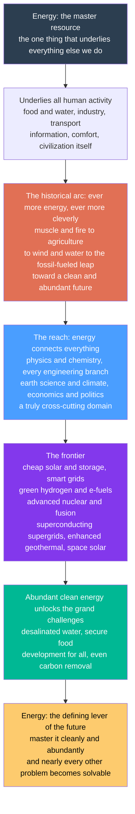

# 🌍 The Reach and Future of Energy Systems

> [!abstract] TL;DR
> **Energy is the master resource** — the one thing that underlies everything else we do. Every calorie of food, every gadget and building, every journey and idea ultimately runs on energy captured and converted, so the story of human progress *is* largely the story of harnessing ever more energy, ever more cleverly: from **muscle and fire**, to **water and wind**, to the enormous **fossil-fueled leap** that built the modern world, and now — we hope — to a **clean, abundant future**. This capstone steps back to see the whole landscape at once. It has three movements. **The reach:** energy is the thread that ties together *physics* (thermodynamics, the Carnot limit, the nucleus), *chemistry* (combustion, electrochemistry, fuels), *every branch of engineering* (turbines, cells, grids, reactors), *earth science and climate* (resources, emissions, the carbon cycle), *economics* (LCOE, markets, externalities), and *politics and society* (policy, security, justice, development) — a truly cross-cutting domain that this vault's six pillars survey. **The arc:** energy use per capita has tracked human capability across the whole of history, exploding a hundredfold with fossil fuels. **The frontier:** cheap solar-plus-storage and smart grids in the near term; green hydrogen and e-fuels, advanced nuclear and the fusion prospect, superconducting supergrids, enhanced geothermal, and even space-based solar beyond. The through-line is simple and profound: **master clean, abundant energy, and almost every other problem — water, food, poverty, even pulling carbon back from the sky — becomes more solvable.** Energy is where the future is won or lost.

---

## Intuition

**Analogy — energy is the master resource, the currency behind every other currency.** Money can buy you anything, but money itself is only a claim on *work done*, and work is done by energy. Strip a modern life down and you find joules under everything: the food on the table (sunlight fixed by plants, then diesel in the tractor and the truck), the water from the tap (pumped, treated, sometimes desalinated), the phone in your hand (mined, smelted, fabricated, and now charged every night), the warm room, the fast trip, the lit screen, the idea you just had while the lights were on. Nothing in the human world happens without energy first being captured from nature and converted into a useful form. That is why the arc of history reads, at bottom, as an **energy ladder** — muscle, then fire, then domesticated animals and the first crops, then the water wheel and the sail, then the vast buried-sunlight bonanza of coal, oil, and gas that let a farmer's descendants command the labor of hundreds of invisible servants. Energy captured per person has risen roughly a *hundredfold* from a forager to an affluent citizen today, and human capability rose right along with it.

Now hold that ladder up and look at where it points. For two centuries the rungs were built from combustion — and the same fire that lifted us is the largest single source of the greenhouse gases now warming the planet. So the task of this century is to keep climbing while swapping the fuel: to build the next rungs out of **clean, abundant power** — sunlight and wind made astonishingly cheap, storage in every home and car, grids that think, hydrogen forging clean steel, perhaps a star finally lit on Earth. This note is the culmination of the Energy Systems vault. It does not introduce a new device; it steps back to celebrate the field itself — the one discipline that must connect physics, chemistry, every engineering branch, earth science, economics, and politics around humanity's central question: **how do we power civilization cleanly and abundantly?** Get that right, and water, food, development, and even climate repair come within reach. That is why energy is the defining lever of the future.

---

## How It Works

### Core Mechanics

This capstone assembles the whole vault into a single line of argument, in five moves.

1. **Energy is the master resource.** Physicist Robert Ayres and historians of energy make the case starkly: energy is not one input among many but the input that produces every other input. Food is chemical energy; materials are energy congealed into ordered form; information is energy spent to hold bits against entropy; water at scale is an energy problem (pumping, treating, desalinating). Because energy underlies everything, the **quantity and quality of energy a society can command sets a ceiling on what it can do** — a ceiling that has risen with every rung of the ladder.

2. **The historical arc — the energy ladder.** Human energy capture climbed through recognizable eras: **muscle** (endosomatic, ~100 W of metabolic power), **fire** (the first exosomatic energy, cooking and warmth), **agriculture** (concentrating solar energy into crops and draft animals), **wind and water** (mills and sails, the first non-biological prime movers), and then the discontinuity — **fossil fuels**, a dense, storable, portable stock of ancient sunlight that broke the old solar-flow budget and made per-capita energy use explode. The Industrial Revolution was, at heart, an *energy* revolution ([[The_First_Industrial_Revolution]], [[The_Second_Industrial_Revolution]]). The next rung, we hope, is **clean and abundant** — high energy use decoupled from carbon.

3. **The reach — energy as the great connector.** Energy is the most cross-cutting subject in all of engineering because a single kilowatt-hour touches every discipline. Its *limits* are **physics** ([[Laws_of_Thermodynamics]], the Carnot ceiling, [[Entropy_and_Second_Law]], the binding energy of the nucleus). Its *fuels and storage* are **chemistry** (combustion, electrochemistry). Its *machines* are **every branch of engineering** — turbines, photovoltaic cells, reactors, grids, batteries. Its *resources and consequences* are **earth science and climate** ([[Anthropogenic_Climate_Change]], the carbon cycle, [[Sustainability_and_Planetary_Boundaries]]). Its *allocation* is **economics** (LCOE, markets, externalities) and its *governance* is **politics** (security, justice, access). The grid itself is a textbook **complex system**, and the transition is **system change** at civilization scale. No other engineering field reaches so far.

4. **The frontier — where the ladder is being built now.** The near term is already arriving: **cheap solar and wind plus storage**, mass **electrification** (EVs, heat pumps), and **smart grids** that balance a variable supply. Beyond that lie longer horizons: **long-duration and seasonal storage**; **green hydrogen and e-fuels** to decarbonize steel, cement, aviation, and shipping; **advanced nuclear** (small modular and Gen-IV reactors); the **fusion** prospect of star-power on Earth; **AI and digitalization** running the grid; **superconducting and HVDC supergrids** moving power across continents; **enhanced geothermal** tapping heat almost anywhere; **space-based solar**; and novel materials throughout. The unifying vision is **abundance** — clean energy so plentiful and cheap it stops being a constraint.

5. **The through-line — energy unlocks the grand challenges.** Because energy is the master resource, cheap clean energy is a *master key*. Abundant power makes **fresh water** (desalination), **food** (protected, powered agriculture), and **development** (the ~700 million still without electricity) far more tractable — and it is the prerequisite for **carbon removal**, since pulling CO2 back from the sky is fundamentally an energy-intensive task. Master clean, abundant energy and nearly every other problem gets easier. That is the case for treating energy as the defining lever of the future, and it is why *energy systems* — the field that connects all of this — is worth studying whole.

### Flow / Architecture



---

## Key Concepts

### Secondary Level

- **Energy is behind everything.** Food, water, phones, cars, houses, factories, the internet — none of it happens without energy first being taken from nature and turned into a useful form. That is why energy is called the *master resource*: it powers all the others.
- **History is an energy story.** Long ago people had only their muscles, then fire, then animals and farms, then windmills and water wheels. Then we found coal, oil, and gas — a huge buried store of ancient sunlight — and suddenly one person could command the energy of hundreds. That leap built the modern world.
- **The catch.** Burning all that fuel warms the planet. So the job now is to keep the benefits of lots of energy but get it from clean sources — sun, wind, water, nuclear — instead of from burning.
- **The exciting part.** The future could have solar power almost too cheap to measure, batteries in every home and car, grids that manage themselves, clean hydrogen making clean steel, and maybe even *fusion* — the way the Sun makes energy — working on Earth.
- **Why it matters most.** If we get cheap clean energy, lots of other hard problems get easier: making fresh water from the sea, growing food, lifting people out of poverty, and even cleaning carbon back out of the air. Energy is the key that helps unlock the rest.

### Undergraduate Level

- **Energy as master resource, quantified.** Global primary energy demand is roughly **600 EJ/yr** and still rising with population and development. Per-capita energy use tracks the arc of human capability: a forager commands about 100 W of metabolic power, while an affluent modern citizen commands the equivalent of dozens of "energy servants" through machines. Development and energy access are tightly correlated — which is why the transition must *raise* clean supply, not merely cap demand.
- **The energy ladder is a story of density and controllability.** Each rung improved **energy density** and **dispatchability**: firewood, then coal (denser, storable), then oil (dense *and* liquid, hence transport), then electricity (instant, clean at point of use), and — the modern twist — renewables that are clean and abundant but *diffuse and variable*, which is why storage and grids matter so much now.
- **The reach across disciplines.** Energy's *limits* are physics (Carnot $\eta_{max}=1-T_C/T_H$, the second law); its *carriers* are chemistry and electrochemistry; its *machines* are mechanical, electrical, chemical, nuclear, and civil engineering; its *footprint* is earth science and climate; its *allocation* is economics (LCOE, merit-order dispatch, externalities); its *rules* are policy. A single course cannot own energy — it is inherently interdisciplinary, which is exactly what makes the field so rich.
- **The near-term frontier is mostly deployment.** Solar PV, onshore wind, and lithium-ion batteries have each fallen roughly **90% in cost within about a decade** (Wright's-law learning curves), turning them from niche to cheapest-new-build in much of the world. The near-term future is less about invention than about *scaling* proven technologies — plus the grids, storage, and flexibility to run on them.
- **Sector coupling and electrification.** The dominant strategy is *electrify everything electrifiable* (transport via EVs at roughly 90% drivetrain efficiency versus ~25% for combustion; heat via heat pumps at coefficient-of-performance 3-4) and clean the electricity — then use those flexible electric loads to help balance a renewable grid. Hard-to-electrify sectors (steel, cement, aviation, shipping) point toward hydrogen and e-fuels.
- **The further frontier.** Beyond scaling lies genuine invention: long-duration and seasonal storage; green hydrogen and power-to-X; advanced nuclear (SMRs, Gen-IV); fusion; grid-scale AI; HVDC and superconducting supergrids; enhanced geothermal "anywhere"; and space-based solar. Not all will pan out — but several will, and the portfolio is what matters.

### Graduate Level

- **Energy sets a thermodynamic ceiling on civilization.** Because every material, informational, and biological process is ultimately a controlled degradation of energy quality (exergy destruction, $\dot X_{dest}=T_0\,\dot S_{gen}$), the *rate* and *quality* of energy a society can marshal bounds its complexity. This is the deep reason energy is the master resource rather than a mere input: it is the currency in which the second law charges for every ordered structure a civilization builds and maintains.
- **The transition is a coupled techno-economic-political-material system.** Net-zero is not a technology but a decades-long reconfiguration entangling physics, learning curves, incumbency, finance, geopolitics, and justice. The **binding constraint is the rate of change**, not the endpoint: how fast clean generation, grids, storage, and supply chains can be built without breaking affordability or reliability. A complete analysis integrates EROEI, life-cycle emissions, and **critical-material limits** (lithium, copper, rare earths), because a renewable system trades *fuel* risk for *materials and land* risk.
- **The frontier as a real-options portfolio.** No single technology "wins." Rational strategy hedges across timescales and readiness levels: near-certain (solar, wind, batteries, electrification), probable-and-scaling (long-duration storage, green hydrogen for hard sectors, HVDC supergrids, advanced nuclear), and high-variance moonshots (commercial fusion, space solar, ubiquitous enhanced geothermal). The value is in the *option set* — deploy what is ready, fund what is promising, and keep several bets alive because deep uncertainty dominates decade-scale forecasts.
- **Abundance changes the objective function.** Most energy analysis optimizes *scarcity* (minimize cost subject to a carbon budget). A credible clean-abundance frontier flips the frame: if clean electricity approaches very low marginal cost for many hours, the binding problems become **storage, transmission, and demand shaping**, and previously energy-limited services — desalination, direct air capture, synthetic fuels, protected agriculture — become deployable at scale. **Direct air capture** in particular is fundamentally an energy problem (thermodynamic minimum work of separation plus large real-world overheads), so cheap clean energy is the precondition for large-scale carbon removal, closing the loop between the energy system and climate repair.
- **Energy as the meta-solution to the grand challenges.** Water (desalination and pumping), food (fertilizer, mechanization, controlled-environment agriculture), development (the access gap), and climate (mitigation *and* removal) are each, at their core, energy problems. This is the strongest form of the through-line: because energy is the master resource, **clean-energy abundance is a general-purpose lever** on the whole slate of twenty-first-century challenges — the reason mastering energy systems is arguably the highest-leverage engineering project of the era.
- **Humility about forecasts.** The history of energy is a graveyard of confident predictions (nuclear "too cheap to meter," peak-oil doom, perennial fusion timelines). The disciplined stance is scenario thinking over point forecasts, attention to *rates and learning curves* over static costs, and respect for the scale and inertia of a ~600 EJ/yr system that no single innovation reshapes overnight.

---

## Python Demo

```python
# "The sweep and future of energy" in three panels. numpy + matplotlib only.
#
#   (a) THE GREAT ENERGY ARC  -- per-capita daily energy use across the eras of
#       history (muscle -> fire -> agriculture -> coal/industrial -> oil/electric
#       -> today), on a LOG axis, showing the ~100x fossil-fueled explosion, then
#       BRANCHING into projected futures (clean abundance / efficient-clean /
#       constrained). Illustrative estimates in the spirit of Cook (1971) & Smil.
#
#   (b) THE FRONTIER, COST CURVES  -- the learning-curve collapse of the three
#       technologies that reshaped what is possible: solar PV, wind, and
#       batteries have each fallen ~90%+ in cost. Plotted as cost RELATIVE to
#       each technology's starting year (log axis) so they share one scale.
#
#   (c) THE FRONTIER, SOURCE EVOLUTION  -- the projected energy mix to mid-century
#       as logistic S-curves: fossil declining, solar+wind surging, other-clean
#       (nuclear + hydro + bioenergy) roughly steady. The transition as an
#       inflection point in the arc.
import numpy as np
import matplotlib.pyplot as plt

# =====================================================================
# (a) THE GREAT ENERGY ARC  (per-capita daily energy, kcal/day, log scale)
# =====================================================================
eras = ["Muscle\nonly", "Fire /\nhunting", "Early\nagriculture",
        "Advanced\nagriculture", "Industrial\n(coal)", "Oil +\nelectricity",
        "Today\n(affluent)"]
kcal_hist = np.array([2000, 5000, 12000, 26000, 77000, 150000, 230000], dtype=float)
x_hist = np.arange(len(eras))                    # 0..6

# branching futures from "Today" (index 6) out to a "2050+" column (index 7)
x_future = len(eras)                             # = 7
futures = {
    "Clean abundance":  400000.0,   # cheap clean power lifts the ceiling
    "Efficient clean":  230000.0,   # same service, decarbonized via efficiency
    "Constrained":      150000.0,   # energy-limited pathway
}
fut_colors = {"Clean abundance": "#00b894",
              "Efficient clean": "#4a9eff",
              "Constrained":     "#e17055"}

print("=== (a) THE GREAT ENERGY ARC  (per-capita, kcal/day) ===")
for e, k in zip([s.replace(chr(10), ' ') for s in eras], kcal_hist):
    print(f"  {e:22s} {k:9.0f}")
print(f"  fossil-era rise (muscle -> today): {kcal_hist[-1]/kcal_hist[0]:.0f}x")

# =====================================================================
# (b) FRONTIER COST CURVES  (relative cost, percent of start year, log scale)
#     endpoints from public data; interpolated log-linearly for the curve
# =====================================================================
def decline(y0, y1, c0, c1, n=60):
    yrs = np.linspace(y0, y1, n)
    # log-linear interpolation => straight line on a log axis
    rel = 100.0 * (c1 / c0) ** ((yrs - y0) / (y1 - y0))
    return yrs, rel

yr_solar, rel_solar = decline(1976, 2023, 100.0, 100.0 * 0.30 / 100.0)   # $100/W -> $0.30/W
yr_wind,  rel_wind  = decline(1985, 2023, 100.0, 100.0 * 0.04 / 0.40)    # LCOE ~90% down
yr_batt,  rel_batt  = decline(2010, 2023, 100.0, 100.0 * 140.0 / 1200.0) # $1200 -> $140 /kWh

print("\n=== (b) FRONTIER COST CURVES  (fall to fraction of start) ===")
print(f"  Solar PV module 1976->2023 : down to {rel_solar[-1]:.1f}% (~{100-rel_solar[-1]:.0f}% cheaper)")
print(f"  Wind LCOE       1985->2023 : down to {rel_wind[-1]:.1f}%")
print(f"  Battery pack    2010->2023 : down to {rel_batt[-1]:.1f}%")

# =====================================================================
# (c) SOURCE EVOLUTION  (share of energy, percent, logistic S-curves)
# =====================================================================
yr = np.linspace(1990, 2060, 300)
fossil     = 30.0 + (86.0 - 30.0) / (1.0 + np.exp((yr - 2035.0) / 8.0))
solar_wind =  1.0 + (52.0 -  1.0) / (1.0 + np.exp(-(yr - 2032.0) / 7.0))
other_clean = 100.0 - fossil - solar_wind        # nuclear + hydro + bioenergy

print("\n=== (c) SOURCE EVOLUTION  (share, percent) ===")
for t in (1990, 2023, 2060):
    i = int(np.argmin(np.abs(yr - t)))
    print(f"  {t}:  fossil {fossil[i]:4.0f}   solar+wind {solar_wind[i]:4.0f}"
          f"   other-clean {other_clean[i]:4.0f}")

# ------------------------------- plotting ------------------------------
fig, (axA, axB, axC) = plt.subplots(1, 3, figsize=(18, 5.6))
fig.suptitle("The Sweep and Future of Energy: the arc, the cost collapse, and the coming mix",
             fontsize=14, fontweight="bold")

# (a) the great energy arc + branching futures
axA.plot(x_hist, kcal_hist, "o-", color="#2C3E50", lw=2.6, ms=8, label="historical arc")
for name, val in futures.items():
    axA.plot([x_hist[-1], x_future], [kcal_hist[-1], val], "o--",
             color=fut_colors[name], lw=2.2, ms=7, label=f"future: {name}")
axA.axvspan(x_hist[-1], x_future + 0.4, color="#8338ec", alpha=0.06)
axA.annotate("the fossil-fueled\nexplosion",
             xy=(4.6, 100000), xytext=(1.4, 130000), fontsize=8.5, color="#e17055",
             arrowprops=dict(arrowstyle="->", color="#e17055"))
axA.set_yscale("log")
axA.set_xticks(list(x_hist) + [x_future])
axA.set_xticklabels(eras + ["2050+"], fontsize=7.5)
axA.set_ylabel("per-capita energy use  [kcal/day, log]")
axA.set_title("(a) The great energy arc\n~100x rise, then branching futures", fontsize=11)
axA.legend(fontsize=7.2, loc="lower right")
axA.grid(alpha=0.3, which="both")

# (b) frontier cost curves (log-y, relative to start)
axB.plot(yr_solar, rel_solar, color="#f39c12", lw=2.6, label="Solar PV module")
axB.plot(yr_wind,  rel_wind,  color="#00b894", lw=2.6, label="Wind (LCOE)")
axB.plot(yr_batt,  rel_batt,  color="#8338ec", lw=2.6, label="Battery pack ($/kWh)")
axB.set_yscale("log")
axB.set_ylabel("cost, percent of starting year  [log]")
axB.set_xlabel("year")
axB.set_title("(b) The frontier: cost collapse\nlearning curves reshaped the possible", fontsize=11)
axB.axhline(100, color="k", lw=1, alpha=0.3)
axB.legend(fontsize=8, loc="lower left")
axB.grid(alpha=0.3, which="both")

# (c) source evolution S-curves
axC.plot(yr, fossil,      color="#3d3d3d", lw=2.6, label="fossil fuels")
axC.plot(yr, solar_wind,  color="#f39c12", lw=2.6, label="solar + wind")
axC.plot(yr, other_clean, color="#2a9d8f", lw=2.6, label="other clean (nuclear+hydro+bio)")
axC.axvline(2023, color="gray", ls="--", lw=1)
axC.text(2024, 78, "today", fontsize=8, color="gray")
axC.annotate("the transition\n(inflection)", xy=(2035, 50), xytext=(2000, 62),
             fontsize=8.5, color="#8338ec",
             arrowprops=dict(arrowstyle="->", color="#8338ec"))
axC.set_ylim(0, 95)
axC.set_xlabel("year")
axC.set_ylabel("share of energy  [percent]")
axC.set_title("(c) The coming mix\nfossil down, solar+wind surge", fontsize=11)
axC.legend(fontsize=8, loc="upper right")
axC.grid(alpha=0.3)

plt.tight_layout(rect=[0, 0, 1, 0.92])
plt.show()
```

Running this prints the numbers and draws the whole story in three panels. **Panel (a)** is the **great energy arc**: per-capita energy use climbs modestly through muscle, fire, and agriculture, then *explodes roughly a hundredfold* with coal and oil — the single most important fact about the modern world compressed into one log-scale line — before **branching** into futures that depend on the choices this vault is about (clean abundance lifting the ceiling, efficient-clean holding it, or a constrained path). **Panel (b)** is the **frontier's engine**: solar, wind, and batteries have each fallen roughly 90% or more in cost within a decade or so, and those learning curves — not any single breakthrough — are what turned the clean transition from aspiration into the cheapest option. **Panel (c)** is the **coming mix**: fossil fuels bending down while solar and wind surge up as logistic S-curves, with the crossover — the transition itself — as the inflection point in the arc. Together: *this is where we came from, this is why the future changed, and this is where the mix is heading.*

---

## Real-World Applications

> **Example — the whole field in one frontier project: green steel.** Steelmaking is ~7-8% of global CO2 because it burns coal (coke) both for heat and to chemically strip oxygen from iron ore. The clean route touches every pillar of this vault at once. **Renewable electricity** (S03) at learning-curve prices powers an **electrolyzer** (S04/S06 electrochemistry) that splits water into **green hydrogen**; that hydrogen replaces coke to *reduce* the ore, emitting water instead of CO2; the process heat is **electrified**; the plant is sited where clean power is cheapest and firmed by **storage and a smart grid** (S04-S05); and whether it gets built at all turns on **carbon pricing, policy, and market design** (S06). One product, and the entire chain from thermodynamics to policy is in play — a microcosm of why energy systems is the connector discipline. Sweden's HYBRIT and H2 Green Steel are building exactly this.

- **Solar-plus-storage as the new default.** In much of the world, new solar paired with batteries is now the cheapest new electricity, flipping the grid from fossil-baseload-plus-peakers toward clean-baseload-plus-flexibility — the near-term frontier already in deployment.
- **Electrification of everything.** EVs (~90% drivetrain efficiency) and heat pumps (COP 3-4) move demand from liquid fuels and gas onto a decarbonizing grid, coupling the transport and heating sectors into the power system and reshaping demand curves.
- **Advanced nuclear and the fusion prospect.** Small modular reactors aim to make fission cheaper and faster to build; fusion programs (tokamaks like ITER, and private efforts) chase star-power on Earth — the ultimate high-density clean source, still on the frontier but advancing.
- **Grid-scale AI and digitalization.** Machine learning now forecasts renewable output, optimizes dispatch, and manages millions of distributed devices — the "grid that thinks" that a variable-supply system needs.
- **Desalination and water security.** Cheap clean power makes reverse-osmosis desalination affordable at scale, turning an energy surplus directly into fresh water — a concrete instance of energy as the master key to another grand challenge.
- **Carbon removal.** Direct air capture and other removal methods are, at bottom, energy-intensive separation processes; they only make climate sense powered by abundant clean energy — the loop where the energy system helps repair the climate it once damaged.
- **Energy access and development.** Distributed solar-plus-battery microgrids leapfrog the century-old central grid for the ~700 million people without reliable electricity — energy abundance as a development lever.

---

## Common Pitfalls

- **Treating energy as one input among many rather than the master resource.** Analyses that price energy like any commodity miss that energy *produces* the other inputs — food, materials, water, information. Underweighting energy's foundational role leads to the recurring error of assuming we can solve water, food, or development *without* first solving energy.
- **Confusing the endpoint with the problem — ignoring the rate.** "Net-zero by 2050" is a destination; the binding constraint is *how fast* clean generation, grids, storage, and supply chains can be built without breaking affordability or reliability. Celebrating a target while ignoring deployment rates, finance, and materials is the most common strategic mistake.
- **Techno-optimism that waits for a silver bullet.** Betting the transition on fusion, space solar, or some future breakthrough while under-deploying the proven, already-cheap technologies (solar, wind, batteries, grids) is backwards. The frontier is a *portfolio*: scale what works now, fund what is promising, and keep moonshots alive — but never make the near-term plan hostage to the moonshot.
- **Forecasting energy with confidence.** The field is a graveyard of confident predictions — nuclear "too cheap to meter," perennial fusion timelines, peak-oil doom, and analysts who missed the solar cost collapse entirely. Point forecasts of a ~600 EJ/yr system decades out are almost always wrong; scenario thinking and attention to *learning curves and rates* are the disciplined alternative.
- **Assuming clean means limitless or free.** Renewables trade fuel risk for **materials and land** risk (lithium, copper, rare earths, siting); storage has round-trip losses and embodied energy; grids and supply chains take time and capital. "Abundance" is a goal to engineer toward, not a physics free lunch.
- **Mistaking energy *quantity* for energy *quality*.** The first law conserves energy; the second degrades it. A clean-abundance future is not "energy for free" but "exergy delivered where and when it is useful" — which is why storage, transmission, and demand shaping become the binding problems as marginal generation cost falls.
- **Ignoring the human system.** Energy transitions are as much about incumbency, justice, geopolitics, and public consent as about device physics. A technically optimal plan that ignores who wins, who loses, and who decides will stall — energy is a political and social system, not just an engineering one.

---

## Related Concepts

This note is the **capstone of the Energy Systems vault** — the closing synthesis of all six pillars. It gathers the threads developed across the sibling notes: the field's hub and thermodynamic foundations in *Energy_Systems_Overview* (S01); the near-term decarbonization program in *The_Energy_Transition_and_Net_Zero* and the electrify-everything strategy in *Sector_Coupling_and_Electrification* (S06); the flagship frontier sources — *Solar_Photovoltaics* (S03), the *Hydrogen_and_Fuel_Cells* carrier (S04), and the star-power prospect in *Nuclear_Fusion_Energy* (S04). Those sibling notes are referenced here in prose; the cross-vault wikilinks below point to notes that already exist elsewhere in the vault and anchor energy's enormous reach.

**Physics foundation — the laws that set the ceiling**
- [[Laws_of_Thermodynamics]] — the first law (energy is only converted, never created) and the second law (the Carnot ceiling and mandatory waste heat) that bound every rung of the energy ladder and every future device
- [[Entropy_and_Second_Law]] — why energy *quality* (exergy) degrades, the microscopic reason a clean-abundance future is about delivering usable exergy, not conjuring free energy

**Engineering neighbor — the conversion machinery and its efficiency**
- [[Sustainable_and_Energy_Systems_Engineering]] — the mechanical-engineering view of the same transition: Carnot limits, exergy, heat pumps, and waste-heat recovery as the efficiency levers of decarbonization, complementing this systems-level capstone

**Earth system — why it matters and where the limits are**
- [[Anthropogenic_Climate_Change]] — energy production is the largest source of greenhouse-gas emissions, so decarbonizing the energy system is the central task for limiting warming; this whole vault is the engineer's response to that driver
- [[Sustainability_and_Planetary_Boundaries]] — energy sits at the center of the planetary-boundaries picture (climate, but also materials and land); the systems-thinking frame for why the transition is boundary-constrained system change

**History — the arc that got us here**
- [[The_First_Industrial_Revolution]] — the first great rung of the fossil-fueled leap, when coal and the steam engine broke the old solar-flow energy budget
- [[The_Second_Industrial_Revolution]] — oil, electricity, and the modern high-energy society whose per-capita explosion this capstone plots and whose carbon debt it seeks to repay

---

## Review Questions

**Secondary**
1. Energy is called the "master resource" because it powers everything else. Pick three very different things in your day (a meal, a trip, and using your phone) and explain what kind of energy each one needed and where that energy came from. Then describe the "energy ladder" of history in your own words — from muscle and fire to fossil fuels — and say why the future's next rung needs to be *clean* energy rather than more burning.

**Undergraduate**
2. The great energy arc shows per-capita energy use rising roughly a hundredfold with fossil fuels, and development tracks energy access closely. (i) Explain why this means the energy transition must *raise* clean supply for billions of people, not simply cap demand. (ii) Choose one frontier technology (green hydrogen, advanced nuclear, or grid-scale storage) and explain which "sector" or problem it addresses and why electrification alone cannot cover it. (iii) Using the learning-curve idea (solar, wind, and batteries each falling ~90%), explain why the near-term future of energy is described as "mostly deployment, not invention."

**Graduate**
3. Argue the thesis that "clean-energy abundance is a general-purpose lever on the twenty-first century's grand challenges." (a) Explain, using energy as the master resource and the second law, *why* water (desalination), food, development, and carbon removal are all fundamentally energy problems. (b) Frame the energy frontier as a real-options portfolio across readiness levels and timescales, and defend a rational allocation between scaling proven technologies and funding moonshots under deep uncertainty. (c) Explain why the *rate* of the transition, not its endpoint, is the binding constraint, and identify at least three non-physics factors (finance, materials, incumbency, justice, geopolitics) that any complete strategy must integrate — then state, with reasons, how much confidence you would place in any point forecast of the 2060 energy mix.

---

## Sources

- V. Smil — *Energy and Civilization: A History* (MIT Press, 2017) — the definitive account of energy as the driver and constraint of every human society, the backbone of this capstone's "arc"
- D. J. C. MacKay — *Sustainable Energy — Without the Hot Air* (UIT Cambridge, 2008; free at withouthotair.com) — the quantitative, no-nonsense arithmetic of what a clean-energy future actually requires
- International Energy Agency — *World Energy Outlook* (annual) and *Net Zero by 2050: A Roadmap for the Global Energy Sector* (2021) — the leading global scenarios, mix projections, and transition milestones
- Our World in Data — *Energy* (ourworldindata.org/energy), by Hannah Ritchie and Max Roser — open data on the energy mix, per-capita use, and technology cost declines behind the demo's figures
- R. U. Ayres & B. Warr — *The Economic Growth Engine: How Energy and Work Drive Material Prosperity* (Edward Elgar, 2009) — the case that energy (useful work) is the master input behind economic growth itself

---

#energy-systems #energy-future #master-resource #frontiers #capstone
