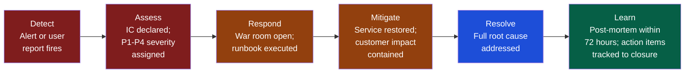

# Crisis and Incident Management

> [!abstract] TL;DR
> Incidents are inevitable; how a team responds is a choice. The incident commander (IC) role separates technical work from coordination work — only one person coordinates, everyone else executes. Blameless post-mortems produce learning; blame-based post-mortems produce silence. DORA's MTTR and change failure rate are the lagging indicators of incident management maturity. Great incident culture is built during the quiet times through runbooks, game days, and blameless learning reviews.

## The Incident Lifecycle



## Severity Classification

Consistent severity classification enables consistent response. Do not debate severity during an incident — apply the matrix and move on.

| Severity | Customer Impact | Business Impact | Response |
|---|---|---|---|
| **P1 (Critical)** | Core service completely down; all users affected | Revenue loss, SLA breach, reputational risk | IC + all hands; 24/7 until resolved |
| **P2 (High)** | Major feature degraded; significant user subset affected | Revenue risk; customer complaints at scale | IC + dedicated team; business hours + escalation after-hours |
| **P3 (Medium)** | Non-core feature degraded; small user subset | Low immediate business risk | Assigned engineer; resolved within 2 business days |
| **P4 (Low)** | Cosmetic or edge-case; minimal user impact | Negligible | Ticket in backlog; resolved in normal sprint |

## The Incident Commander Role

The IC is the single coordination point during an incident. Their job is to facilitate resolution, not to fix the incident themselves.

### IC Responsibilities

| Responsibility | What It Looks Like |
|---|---|
| **Declare the incident** | "This is a P1. I am IC. War room open at [link]." |
| **Assign roles** | IC + Comms Lead + Technical Lead(s). Maximum 7–10 people in the war room. |
| **Maintain timeline** | Log every action, hypothesis, and finding with a timestamp. |
| **Drive hypotheses** | "What is the most likely cause? What evidence supports it?" |
| **Time-box investigations** | "We've been on this theory for 15 minutes with no signal. Next hypothesis." |
| **Communicate status** | Every 30 minutes: internal stakeholder update; every 60 minutes: customer-facing update |
| **Make decisions** | When engineers disagree on approach, IC breaks the tie: "We go with Option A. Execute now." |
| **Declare resolution** | When customer impact is resolved, declare end of incident even if root cause is not fully understood. |

### IC Anti-Patterns

- **IC who also codes** — You cannot coordinate and debug simultaneously. The IC who pulls up the codebase is no longer coordinating.
- **Too many people in the war room** — >10 people generates noise and competing theories. IC: "If you are not actively working on resolution, please monitor the update thread."
- **No timeline kept** — Post-mortems without a timeline are guesses. Log everything in real time.
- **Extended debate** — A P1 is not a design review. IC: "Decision made. Proceed."

### War Room Roles

```
P1 Incident — Checkout Service Down

IC:           Alice (EM) — coordination, timeline, stakeholder comms
Comms Lead:   Bob (PM) — customer status page, internal Slack updates
Tech Lead:    Carol (Staff Eng) — driving hypotheses and directing engineers
Engineers:    Dave (backend), Eve (database) — executing investigation
Observer:     Frank (VP Engineering) — silent; briefed every 30 min by IC
```

## The Runbook

A runbook is a step-by-step guide for handling a known failure mode. Runbooks are written during the quiet times; they are executed during the loud times.

```markdown
## RUNBOOK: Checkout Service — Database Connection Pool Exhaustion

**Severity**: P1 / P2 depending on scope
**Alert**: `checkout-db-connections > 95%` in Datadog
**Owner**: Payments team

### Diagnosis Steps

1. Open Datadog → Checkout → Infrastructure → DB Connections
2. Confirm: is the connection count rising or stable at 95%?
   - Rising: Likely connection leak. Go to step 4.
   - Stable: Likely traffic spike. Go to step 3.

3. Traffic Spike Path:
   a. Check current RPS: expected = 300–500, spike = >800
   b. Enable rate limiting: `kubectl set env deployment/checkout RATE_LIMIT=true`
   c. Scale read replicas: `kubectl scale deployment/checkout-reader --replicas=4`
   d. Monitor: connections should drop within 5 minutes.

4. Connection Leak Path:
   a. Identify leaking pod: `kubectl top pods -n checkout | sort -k3 -rn | head -5`
   b. Restart leaking pod: `kubectl rollout restart deployment/<pod-name>`
   c. If all pods leaking: rollback last deploy: `kubectl rollout undo deployment/checkout`
   d. File P1 ticket. Tag on-call backend lead.

### Resolution Confirmation
  - Connection count < 70%
  - Checkout error rate < 0.1%
  - P95 latency < 400ms

### Escalation
  - 15 min: Ping checkout team lead
  - 30 min: Ping Alice (EM)
  - 60 min: Ping VP Engineering
```

**Runbook quality checks:**
- Written by someone other than the on-call engineer (fresh eyes catch missing context)
- Executed during a game day before production use
- Updated after every incident that reveals a gap
- Linked directly from the alert (not buried in Confluence)

## Blameless Post-Mortem Culture

The goal of a post-mortem is to extract system-level learning, not to assign individual fault. Blame creates silence; silence creates recurrence.

### The Blameless Principle

> "People make mistakes not because they are careless or incompetent, but because the systems and processes they work within made the mistake easy and the safeguard hard." — Sidney Dekker

A blameless post-mortem asks: "What conditions made this outcome possible?" not "Who made this mistake?"

### Post-Mortem Template

```markdown
## Post-Mortem: Checkout P1 — June 14, 2026

**Date**: June 17, 2026 (within 72 hours of resolution)
**Incident Duration**: 2026-06-14 14:23 UTC → 15:41 UTC (78 minutes)
**Severity**: P1
**Customer Impact**: 100% of checkout requests failed for 78 minutes; estimated €12k revenue loss
**Facilitator**: Alice (EM) — not the IC or engineers directly involved

---

### Timeline (all times UTC)
14:23 — Alert fires: checkout error rate > 10%
14:25 — IC declared; war room opened
14:31 — Initial hypothesis: deploy at 14:18 caused regression
14:38 — Rollback executed; no improvement
14:45 — Second hypothesis: database connection exhaustion
14:52 — Confirmed: connection pool at 100%; leak traced to payment service timeout misconfiguration
15:15 — Fix deployed: timeout reduced to 5s; connections begin recovering
15:41 — Checkout error rate < 0.1%; incident closed

---

### Root Cause
Payment service timeout set to 300s (5 minutes) instead of 5s in the Q2 payment config refactor.
Under moderate load, slow payment provider responses held connections open, exhausting the pool.

### Contributing Factors
- Timeout value was not in the test suite (no assertion on config values)
- Load test environment does not simulate slow payment provider responses
- No alert existed for slow payment provider response time (only for checkout errors, downstream)
- The config refactor was reviewed by one engineer (missed the misconfiguration)

### What Went Well
- IC declared within 2 minutes of alert
- Runbook for connection exhaustion existed and correctly guided the diagnosis
- Timeline was maintained throughout

### Action Items

| Action | Owner | Due | Priority |
|--------|-------|-----|----------|
| Add timeout value assertions to checkout config tests | Dave | June 21 | P1 |
| Add alert: payment provider p95 response > 2s | Eve | June 21 | P1 |
| Update load test profile to simulate slow provider | Carol | June 28 | P2 |
| Add second reviewer requirement for config changes | Alice | June 21 | P2 |
| Run game day: connection exhaustion scenario | Alice | July 15 | P3 |

---

### How Did This Stay Hidden?
The configuration was valid — it did not cause an error, just poor performance under load.
Our staging environment uses a fast payment stub; the slow provider path had never been tested at scale.
```

### Post-Mortem Facilitation Rules

1. **Facilitator is not the IC** — Separate the roles; the IC is too close to the incident.
2. **No blame language** — Facilitator redirects: "Let's focus on what the system allowed. What conditions made this mistake easy?"
3. **Action items own names and dates** — No "team to investigate." A named owner and a due date, or it will not be done.
4. **Action items tracked to closure** — Review status in the next sprint planning. A post-mortem with orphaned action items is a ritual without learning.
5. **Share the post-mortem broadly** — The learning is wasted if only the team that had the incident reads it. Share across engineering.

## DORA Metrics and Incident Management

| DORA Metric | Incident Relevance | Recovery Strategy |
|---|---|---|
| **Deployment Frequency** | More frequent deploys = smaller blast radius per deploy | Feature flags, trunk-based development, small commits |
| **Lead Time for Changes** | Faster changes = faster hotfixes during incidents | Streamlined deployment pipeline; no manual approval gates for hotfixes |
| **Change Failure Rate** | High CFR = incidents per deploy | Better test coverage, staging environments, canary releases |
| **MTTR** | How fast you recover | Runbooks, IC role clarity, alert quality, rollback automation |

**DORA recovery heuristic:**
```
If MTTR > 60 min: Focus on runbook quality and IC role definition
If CFR > 5%:      Focus on test coverage and canary deployments
If deploy freq < 1/week: Focus on deployment pipeline and feature flags
If lead time > 1 week: Focus on review process, PR size, automation
```

## Game Days

A game day is a planned exercise that simulates failure in a controlled environment. Netflix calls this "Chaos Engineering." The goal is to surface incident response gaps before a real incident does.

```bash
# Simple game day: terminate a random pod in staging
# Verify: does the team detect it? How long to recover? Does the runbook work?

kubectl delete pod -n checkout \
  $(kubectl get pods -n checkout -o name | shuf -n 1) \
  --force --grace-period=0

# Measure:
# Time to alert: X minutes
# Time to runbook execution: Y minutes
# Time to service restoration: Z minutes
# Gaps found: [list]
```

**Game Day Agenda:**
1. Pre-brief: What are we simulating and what are we testing?
2. Simulation: Execute the failure injection (IC role assigned)
3. Response: Team executes incident response as if real
4. Debrief: What worked? What was missing? Update runbooks immediately.

## Common Pitfalls

1. **Blame in post-mortems** — "Alice deployed the broken config" is not a root cause. The root cause is the conditions that allowed the broken config to reach production.
2. **Post-mortem action items with no owner** — "Team to investigate" means nobody will investigate.
3. **MTTR measured from detection, not occurrence** — Mean Time To Detect (MTTD) is a separate metric. Know both. A 2-hour outage with a 90-minute detection gap is a monitoring failure, not a response failure.
4. **Runbooks that only the author can follow** — Test the runbook with someone who wasn't in the original incident. If they can't follow it, it is incomplete.
5. **IC who codes during the incident** — The IC who pulls up the debugger has abandoned their coordination role.
6. **No game days** — Teams that only run post-mortems learn from failure after it happens. Game days let you learn before.

## Review Questions

1. A P1 incident has 15 engineers in the war room and progress is stalling. What should the IC do, and why?
2. Write a blameless statement for this blame-based finding: "Dave pushed the broken config without testing it."
3. Using DORA metrics, how would you diagnose a team with MTTR of 4 hours and a change failure rate of 8%? What are the root causes and remediation priorities?
4. What is the purpose of a game day, and what specific outputs should a team leave with after running one?

## Related Notes

- [[_MOC_Engineering_Leadership_Master|↑ Engineering Leadership MOC]]
- [[Delivery_and_Execution]]
- [[Engineering_Metrics_and_Health]]
- [[Technical_Leadership]]
- [[Team_Building_and_Culture]]

#Engineering #Leadership #IncidentManagement #PostMortem #DORA #Reliability
