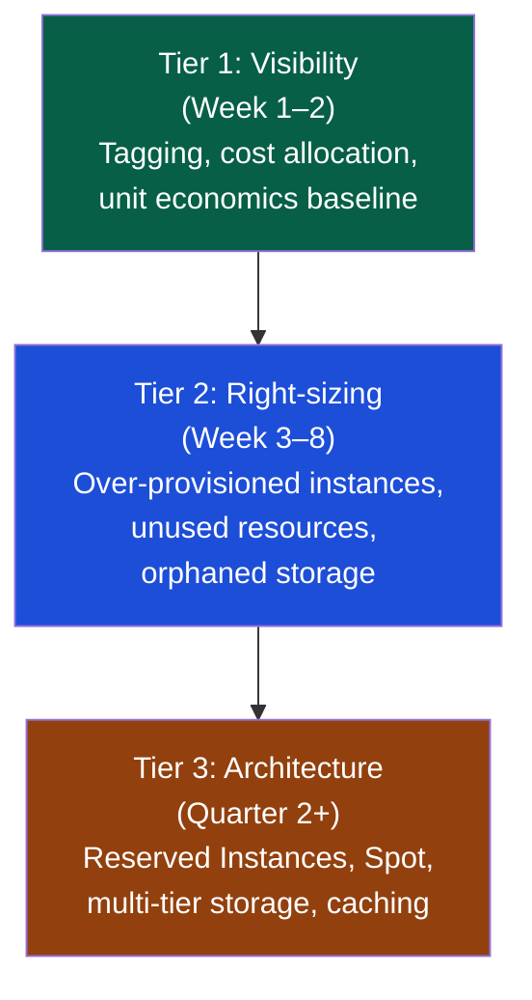

# Financial Management for Engineering Managers

> [!abstract] TL;DR
> Engineering managers who cannot fluently discuss budget are ceding influence over their most critical resource. Engineering spend splits into two buckets: people (headcount — typically 70–80% of budget) and non-people (cloud, tooling, licenses, contractors). The EM's financial jobs are to plan and forecast spend, optimize the cloud and tooling envelope, build ROI cases for investment, apply the build/buy/integrate framework, and communicate cost of delay to justify prioritization. Financial fluency is not optional at Staff+ or Director level.

## The Engineering Budget Anatomy

A typical software engineering budget breaks down as follows:

```
Engineering Budget
├── People Costs (70–80%)
│   ├── Salaries + payroll taxes (65–70%)
│   ├── Benefits (15–20% of salary)
│   ├── Recruiting fees (15–25% of first-year salary per hire)
│   └── Training + conferences (1–3% of salary)
│
├── Infrastructure (10–20%)
│   ├── Cloud compute (EC2, GKE, App Engine)
│   ├── Cloud storage + databases (S3, RDS, Spanner)
│   ├── CDN + networking egress
│   ├── Managed services (Kafka, Elasticsearch, Redis)
│   └── Observability (Datadog, New Relic, Honeycomb)
│
└── Tooling + Licenses (5–10%)
    ├── Developer tools (GitHub, JetBrains, Copilot)
    ├── Security tooling (Snyk, Veracode, Wiz)
    ├── CI/CD (CircleCI, BuildKite, GitHub Actions)
    └── SaaS dependencies (Stripe, SendGrid, LaunchDarkly)
```

## Headcount Planning

Headcount is both the largest cost and the hardest to reverse — hiring takes 3–6 months; a bad hire takes 6–18 months to exit.

### Headcount Forecasting Model

```
Annual headcount cost per engineer:
  = Salary × 1.25 (benefits + payroll taxes)
  + Recruiting cost (if net new hire): Salary × 0.20

Example:
  Senior Engineer at $180k salary
  All-in cost: $180k × 1.25 = $225k/year
  Net new hire: $225k + $36k recruiting = $261k first year

Team of 6 senior engineers: ~$1.35M/year steady-state
```

### Headcount vs. Tooling Tradeoff

| Scenario | Headcount | Tooling | Heuristic |
|---|---|---|---|
| Repetitive manual testing | +1 QA engineer at $120k/year | Automation tool + investment at $40k | Automate if coverage > 50% of engineer's scope |
| Manual deploys: 2 hrs/week/engineer | 0 | CI/CD investment: 3 engineer-weeks | < 6 month payback — automate |
| Security vulnerability scanning | +1 Security engineer at $160k | SAST tool at $25k/year | Tool first; hire when complexity exceeds tool's scope |
| Customer data analytics | +2 Data engineers at $150k/year | Self-serve BI platform at $30k/year | Depends on custom modeling needs |

**Rule of thumb:** If a tool eliminates 50%+ of an engineer's time on a task, the tool has a payback period under one year for any tool priced below half that engineer's salary.

## Cloud Cost Optimization

Cloud spend is the most actionable cost lever for most engineering teams. Three tiers of optimization:



### Tier 1: Visibility First

You cannot optimize what you cannot see. Before any cost-cutting, implement:

```yaml
# AWS tagging strategy
Tags:
  Environment: prod | staging | dev
  Team: payments | auth | platform
  Service: checkout-api | auth-service | data-pipeline
  Owner: alice@company.com
  CostCenter: engineering-payments
```

**Unit economics baseline:**
```
Cost per API request = Monthly infra cost / Monthly request count
Cost per active user = Monthly infra cost / Monthly active users
Cost per transaction = Monthly infra cost / Monthly transaction count

Target: Unit cost trending down as the business scales (economies of scale)
Red flag: Unit cost trending up at scale (architectural inefficiency)
```

### Tier 2: Right-Sizing (Typical 20–35% savings)

```bash
# AWS Cost Explorer: find over-provisioned instances
aws ce get-rightsizing-recommendation \
  --service EC2 \
  --configuration '{"RecommendationTarget": "SAME_INSTANCE_FAMILY"}'

# Common findings:
# - db.r5.4xlarge running at 12% CPU avg → right-size to db.r5.xlarge
# - 40 idle NAT Gateways (dev environments nobody cleaned up)
# - 2TB S3 bucket with last access 14 months ago (move to Glacier)
```

| Optimization | Typical Saving | Effort | Risk |
|---|---|---|---|
| Right-size over-provisioned EC2/RDS | 20–40% of compute cost | Low | Low (staging first) |
| Delete unused resources (EBS, EIP, old snapshots) | 5–10% | Low | Low |
| Switch dev/staging to Reserved Instances | 30–40% vs on-demand | Low | Low |
| Move infrequently accessed S3 to Intelligent-Tiering | 40–60% on eligible storage | Low | None |
| Spot Instances for batch workloads | 60–80% vs on-demand | Medium | Medium (interruption handling) |
| CDN caching for static assets | Variable | Low | Low |

### Tier 3: Architecture Optimization (Largest gains, highest effort)

- **Reserved Instances / Committed Use Discounts** — 1-year commitment saves 30–40%; 3-year saves 50–60%. Justify only for stable, production workloads.
- **Multi-tier storage** — Hot (SSD), warm (standard), cold (Glacier). Automate lifecycle policies for log data, backups, and audit trails.
- **Caching** — Redis/Memcached in front of expensive DB queries; CDN for API responses that can tolerate eventual consistency.
- **Right-size the data transfer** — Egress is expensive. Keep compute close to data. Avoid cross-AZ data transfer for frequently called internal services.

## ROI Analysis for Engineering Investments

Use this template when making the case for investment in tooling, infrastructure, or people.

```
Investment Case Template:

Initiative: Developer Platform (internal developer portal)
Investment: 2 engineers × 2 quarters = $150k fully-loaded

Current State:
  - New service setup: 3 days average across 12 services/year = 36 engineer-days = $43k/year
  - Dependency discovery: 0.5 days/week per engineer = $135k/year team-wide
  - On-boarding new engineers: 2 weeks average = $24k/year (4 hires/year)
Total current cost: ~$202k/year

Post-Investment State (12 months after launch):
  - New service setup: 4 hours → 36× faster = $41k saved/year
  - Dependency discovery: automated → $100k saved/year
  - On-boarding: 2 weeks → 3 days → $17k saved/year
Total annual savings: ~$158k/year

ROI:
  Year 1: -$150k (investment) + $158k (savings) = $8k net (break-even Year 1)
  Year 2: $158k pure savings
  Year 3: $158k pure savings

3-year ROI: ($8k + $158k + $158k) / $150k = 216%
```

## Build vs. Buy vs. Integrate Framework

```
Decision: Authentication service

Step 1: Is this a core competitive differentiator?
  → Auth is not our differentiator. Skip Build.

Step 2: Does the commercial option meet our compliance requirements?
  → Evaluate Auth0, Okta (SOC 2 Type II, GDPR) → Yes.

Step 3: Total cost comparison:
  Build: 3 engineers × 6 months = $337k + ongoing maintenance 0.5 FTE = $112k/year
  Auth0: $25k/year enterprise plan, implementation 2 weeks
  → Auth0: Year 1: $37k, Year 3: $75k vs Build: $663k

Decision: Buy (Auth0)
  → Document rationale in ADR-0042
```

| Dimension | Build | Buy | Open Source |
|---|---|---|---|
| Competitive differentiator | Yes — only reason to build | No | No |
| Customization needed | Extreme | Low | Medium |
| Time to production | Months | Days–weeks | Weeks |
| Ongoing ownership | High — your problem | Vendor's problem | Medium — your upgrade burden |
| Vendor lock-in | None | High | Low |
| Compliance control | Full | Shared responsibility | Full |
| Security patching | Your team | Vendor | You (pull the patch) |

**When Build is right:** Payment processing engine for a fintech startup; recommendation algorithm for a media company; pricing engine for a trading firm. The rule is: if it is your moat, build it.

## Cost of Delay

Cost of Delay (CD) makes the cost of prioritization decisions explicit. It is the revenue, savings, or risk exposure per unit of time if a feature or investment is delayed.

```
Cost of Delay Formula:
  CD = (User value + Time criticality + Risk reduction) per week

Example: GDPR Compliance Feature
  Regulatory fine risk: €20M max (assume 10% probability of fine next year if not compliant)
  Expected fine exposure: €2M/year = €38k/week
  Customer churn risk (2 enterprise customers threatening to leave at €200k ARR each): €400k
  
  CD = (€38k × 52 weeks regulatory risk amortized to weekly) + (€400k one-time / 12-week delay)
     = €731 + €33k/week ≈ €33k/week of delay

Sequencing decision:
  If GDPR feature takes 6 weeks and reduces a 6-week delay is €33k × 6 = €198k cost
  Compare to a revenue feature with CD of €5k/week → GDPR feature wins decisively
```

### Weighted Shortest Job First (WSJF)

```
WSJF = Cost of Delay / Job Duration

Higher WSJF = higher priority

| Feature | CD (€k/week) | Duration (weeks) | WSJF | Priority |
|---------|-------------|-----------------|------|----------|
| GDPR compliance | 33 | 6 | 5.5 | 1st |
| Checkout latency | 12 | 2 | 6.0 | 1st (tie) |
| Auth SSO | 8 | 4 | 2.0 | 3rd |
| Admin portal | 3 | 6 | 0.5 | 4th |
```

## Common Pitfalls

1. **Ignoring the true cost of a hire** — Salary is 65–70% of the all-in cost. New EM budgets that exclude benefits, recruiting, and on-boarding underestimate by 40%.
2. **Cloud cost optimization as a one-time project** — Cloud spend grows with the product. Optimization must be a monthly practice, not a Q2 initiative.
3. **Build decisions without ROI analysis** — "It would be cool to build our own X" is not a business case. Every build decision should include a make-vs-buy cost comparison.
4. **No cost allocation tags** — Teams that don't tag cloud resources cannot attribute cost to services, cannot identify waste, and cannot hold teams accountable.
5. **Ignoring Cost of Delay for engineering initiatives** — Tech debt reduction and reliability investments have a Cost of Delay expressed as incident revenue loss and velocity drag. Quantify it.
6. **Headcount as the only growth lever** — More engineers is rarely the answer when the bottleneck is process, tooling, or architecture. Diagnose before hiring.

## Review Questions

1. An engineering team's cloud bill grew from $80k to $200k over 12 months. What is your Tier 1 action before making any cuts, and why?
2. Build the ROI case for purchasing a $30k/year observability tool (Datadog) for a team of 8 engineers who currently spend an estimated 2 hours/week each manually investigating alerts.
3. Using Cost of Delay, how would you compare the priority of a security compliance deadline (€10M fine risk, 20% probability if missed) against a growth feature ($50k ARR upside)?
4. A director asks why you are proposing to buy an auth solution instead of building one. Walk through the build/buy/integrate framework with a concrete recommendation.

## Related Notes

- [[_MOC_Engineering_Leadership_Master|↑ Engineering Leadership MOC]]
- [[Engineering_Manager_Overview]]
- [[Technical_Leadership]]
- [[Technical_Roadmapping]]
- [[Delivery_and_Execution]]

#Engineering #Leadership #Finance #Budget #CloudCost
